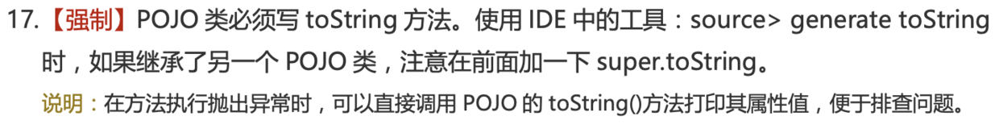
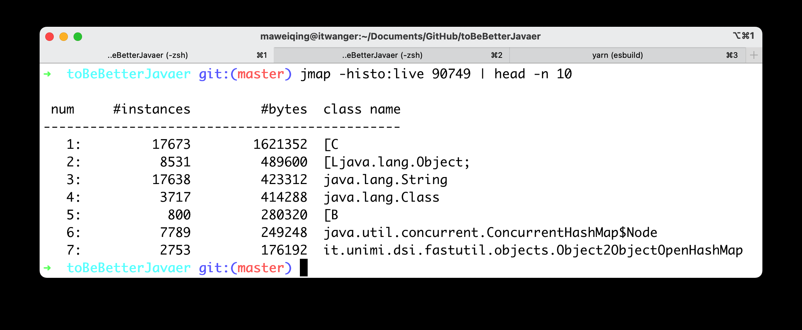
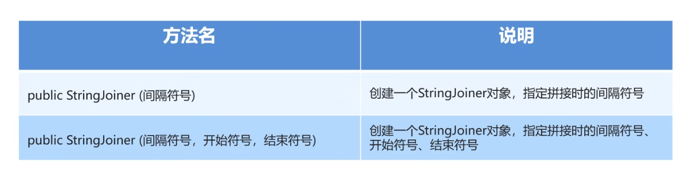
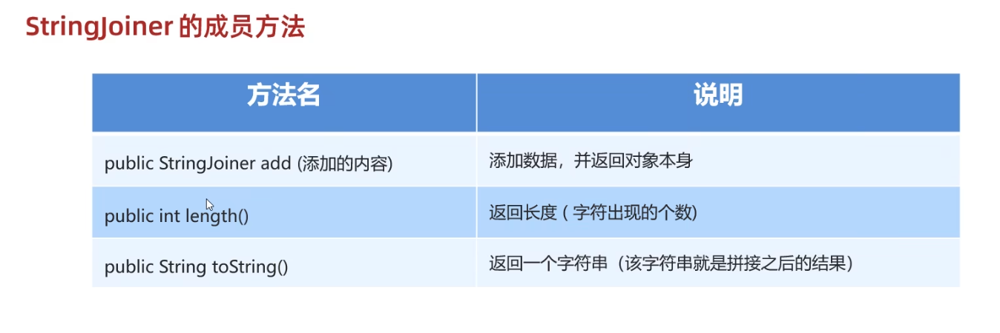
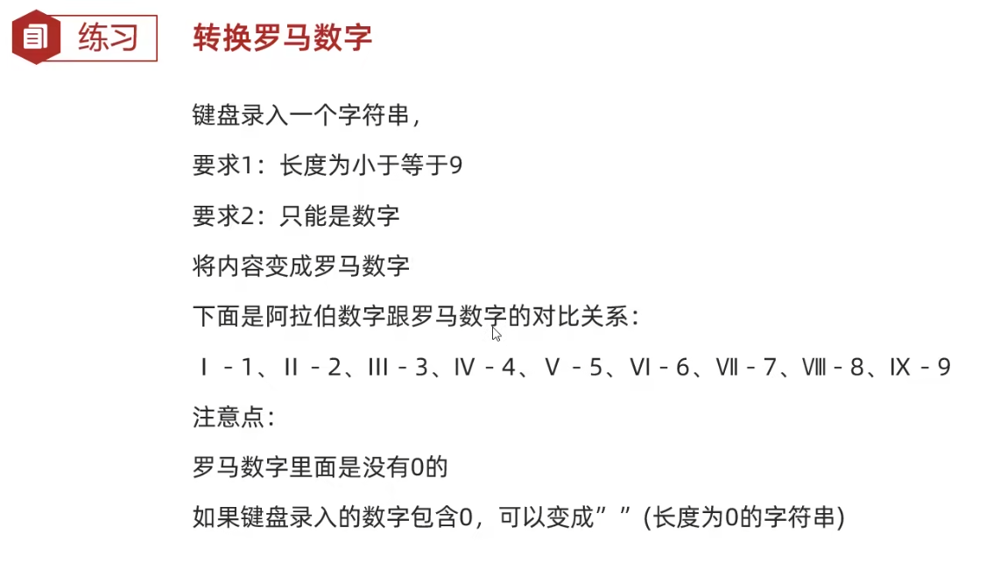
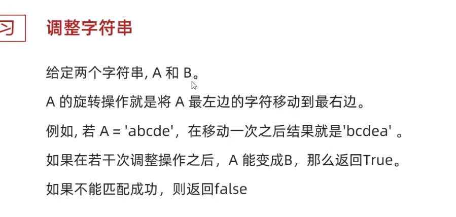

# 前言


​    这个是书写的第一本小册，用来详细的去复习java的基础的内容，这里会记录一些我从其他书籍上看到的相关的介绍，简介等，以及自己对于这个的理解，以及一些详细的案例。综合考虑来制作这样的一本java基础书籍，会持续的去补充这里的东西。


# java概述以及环境变量的配置

## 为什么选择java

很简单，因为因为Java是全球排名第一的编程语言，Java工程师也是市场需求最大的软件工程师，选择Java，就是选择了高薪。虽然现在市场上，有很多制造java失业等的一些焦虑，不过，这种现象再各个行业都有所体现，相对来说，java目前还是值得去入手的一门语言。

## 为什么java最广泛

从互联网到企业平台，Java是应用最广泛的编程语言，原因在于：

- Java是基于JVM虚拟机的跨平台语言，一次编写，到处运行；
- Java程序易于编写，而且有内置垃圾收集，不必考虑内存管理；
- Java虚拟机拥有工业级的稳定性和高度优化的性能，且经过了长时期的考验；
- Java拥有最广泛的开源社区支持，各种高质量组件随时可用。

Java语言常年霸占着三大市场：

- 互联网和企业应用，这是Java EE的长期优势和市场地位；
- 大数据平台，主要有Hadoop、Spark、Flink等，他们都是Java或Scala（一种运行于JVM的编程语言）开发的；
- Android移动平台。

这意味着Java拥有最广泛的就业市场。

同时，**Java是一门面向对象的编程语言**。这个在后续会说什么是面向对象的编程语言。

对于java的可移植性，也是非常可见的，Java有一句口号：`Write once, run anywhere`，一次编写、到处运行。这也是Java的魅力所在。而实现这种特性的正是Java虚拟机JVM。已编译的Java程序可以在任何带有JVM的平台上运行。你可以在windows平台编写代码，然后拿到linux上运行。只要你在编写完代码后，将代码编译成.class文件，再把class文件打成Java包，这个jar包就可以在不同的平台上运行了。

Java是一个强类型语言，它允许扩展编译时检查潜在类型不匹配问题的功能。Java要求显式的方法声明，它不支持C风格的隐式声明。这些严格的要求保证编译程序能捕捉调用错误，这就导致更可靠的程序。

## java简介

ava最早是由SUN公司（已被Oracle收购）的[詹姆斯·高斯林](https://en.wikipedia.org/wiki/James_Gosling)（高司令，人称Java之父）在上个世纪90年代初开发的一种编程语言，最初被命名为Oak，目标是针对小型家电设备的嵌入式应用，结果市场没啥反响。谁料到互联网的崛起，让Oak重新焕发了生机，于是SUN公司改造了Oak，在1995年以Java的名称正式发布，原因是Oak已经被人注册了，因此SUN注册了Java这个商标。随着互联网的高速发展，Java逐渐成为最重要的网络编程语言。

Java介于编译型语言和解释型语言之间。编译型语言如C、C++，代码是直接编译成机器码执行，但是不同的平台（x86、ARM等）CPU的指令集不同，因此，需要编译出每一种平台的对应机器码。解释型语言如Python、Ruby没有这个问题，可以由解释器直接加载源码然后运行，代价是运行效率太低。而Java是将代码编译成一种“字节码”，它类似于抽象的CPU指令，然后，针对不同平台编写虚拟机，不同平台的虚拟机负责加载字节码并执行，这样就实现了“一次编写，到处运行”的效果。当然，这是针对Java开发者而言。对于虚拟机，需要为每个平台分别开发。为了保证不同平台、不同公司开发的虚拟机都能正确执行Java字节码，SUN公司制定了一系列的Java虚拟机规范。从实践的角度看，JVM的兼容性做得非常好，低版本的Java字节码完全可以正常运行在高版本的JVM上。

随着Java的发展，SUN给Java又分出了三个不同版本：

- Java SE：Standard Edition
- Java EE：Enterprise Edition
- Java ME：Micro Edition

这三者之间有啥关系呢？

```ascii
┌───────────────────────────┐
│Java EE                    │
│    ┌────────────────────┐ │
│    │Java SE             │ │
│    │    ┌─────────────┐ │ │
│    │    │   Java ME   │ │ │
│    │    └─────────────┘ │ │
│    └────────────────────┘ │
└───────────────────────────┘
```

简单来说，Java SE就是标准版，包含标准的JVM和标准库，而Java EE是企业版，它只是在Java SE的基础上加上了大量的API和库，以便方便开发Web应用、数据库、消息服务等，Java EE的应用使用的虚拟机和Java SE完全相同。

Java ME就和Java SE不同，它是一个针对嵌入式设备的“瘦身版”，Java SE的标准库无法在Java ME上使用，Java ME的虚拟机也是“瘦身版”。

毫无疑问，Java SE是整个Java平台的核心，而Java EE是进一步学习Web应用所必须的。我们熟悉的Spring等框架都是Java EE开源生态系统的一部分。不幸的是，Java ME从来没有真正流行起来，反而是Android开发成为了移动平台的标准之一，因此，没有特殊需求，不建议学习Java ME。

直到现在，java已经迎来了20的版本。

对于java的开发工具，也是有很多的选择。目前推荐用的就是idea。这本书也都是在idea上来进行操作的。

## 关于java的常见误解

当然，关于安装的这部分，这个书就不做解释了，也可能以后会做解释，目前是不做解释了。话不多说，直接开始下面的学习。

# java语法基础

## 第一个java程序

首先要知道，java是面向对象设计的，所以，首先要引入下面几个概念：

- **对象**：对象是类的一个实例，有状态和行为。例如，一条狗是一个对象，它的状态有：颜色、名字、品种；行为有：摇尾巴、叫、吃等。

- **类**：类是一个模板，它描述一类对象的行为和状态。

- **方法**：方法就是行为，一个类可以有很多方法。逻辑运算、数据修改以及所有动作都是在方法中完成的。

- **实例变量**：每个对象都有独特的实例变量，对象的状态由这些实例变量的值决定。

  一般的，每一个语言的开始都是从Hello word开始，当然java也不例外。

  ```java
  public class Hello {
      public static void main(String[] args) {
          System.out.println("Hello, world!");
      }
  }
  ```

  这就是java的hello word 乍一看还是非常的麻烦的，但是如果详细的说明，其实也没那么麻烦了。下面就对这一行代码进行一个简单的解析。

  在一个Java程序中，你总能找到一个类似：

  ```java
  public class Hello {
      ...
  }
  ```

  的定义，这个定义被称为class（类），这里的类名是`Hello`，大小写敏感，`class`用来定义一个类，`public`表示这个类是公开的，`public`、`class`都是Java的关键字，必须小写，`Hello`是类的名字，按照习惯，首字母`H`要大写。而花括号`{}`中间则是类的定义。

  注意到类的定义中，我们定义了一个名为`main`的方法：

  ```java
      public static void main(String[] args) {
          ...
      }
  ```

  方法是可执行的代码块，一个方法除了方法名`main`，还有用`()`括起来的方法参数，这里的`main`方法有一个参数，参数类型是`String[]`，参数名是`args`，`public`、`static`用来修饰方法，这里表示它是一个公开的静态方法，`void`是方法的返回类型，而花括号`{}`中间的就是方法的代码。

  方法的代码每一行用`;`结束，这里只有一行代码，就是：

  ```java
          System.out.println("Hello, world!");
  ```

  它用来打印一个字符串到屏幕上。

  Java规定，某个类定义的`public static void main(String[] args)`是Java程序的固定入口方法，因此，Java程序总是从`main`方法开始执行。

  注意到Java源码的缩进不是必须的，但是用缩进后，格式好看，很容易看出代码块的开始和结束，缩进一般是4个空格或者一个tab。

  最后，当我们把代码保存为文件时，文件名必须是`Hello.java`，而且文件名也要注意大小写，因为要和我们定义的类名`Hello`完全保持一致。

  简单来说我们可以来看这个图

  

  之后我们在idea中点击运行就可以了。

  

这样，我们就书写完我们的第一个程序了。

这里就不讲如何用命令在控制台上做输出了，因为这本书主打的就是一个快速入门，所以一些不重要，或者是已经被淘汰的东西，我这里就不做介绍了。

## 基本语法

编写 Java 程序时，应注意以下几点：

- **大小写敏感**：Java 是大小写敏感的，这就意味着标识符 Hello 与 hello 是不同的。
- **类名**：对于所有的类来说，类名的首字母应该大写。如果类名由若干单词组成，那么每个单词的首字母应该大写，例如 **MyFirstJavaClass** 。
- **方法名**：所有的方法名都应该以小写字母开头。如果方法名含有若干单词，则后面的每个单词首字母大写。
- **源文件名**：源文件名必须和类名相同。当保存文件的时候，你应该使用类名作为文件名保存（切记 Java 是大小写敏感的），文件名的后缀为 **.java**。（如果文件名和类名不相同则会导致编译错误）。
- **主方法入口**：所有的 Java 程序由 **public static void main(String[] args)** 方法开始执行。

## java标识符

Java 所有的组成部分都需要名字。类名、变量名以及方法名都被称为标识符。

关于 Java 标识符，有以下几点需要注意：

- 所有的标识符都应该以字母（A-Z 或者 a-z）,美元符（$）、或者下划线（_）开始
- 首字符之后可以是字母（A-Z 或者 a-z）,美元符（$）、下划线（_）或数字的任何字符组合
- 关键字不能用作标识符
- 标识符是大小写敏感的
- 合法标识符举例：age、$salary、_value、__1_value
- 非法标识符举例：123abc、-salary

## java修饰符

像其他语言一样，Java可以使用修饰符来修饰类中方法和属性。主要有两类修饰符：

- 访问控制修饰符 : default, public , protected, private
- 非访问控制修饰符 : final, abstract, static, synchronized

## java变量

什么是变量？

变量就是初中数学的代数的概念，例如一个简单的方程，x，y都是变量。

在Java中，变量分为两种：基本类型的变量和引用类型的变量。

我们先讨论基本类型的变量。

在Java中，变量必须先定义后使用，在定义变量的时候，可以给它一个初始值。例如：

```
int x = 1;
```

上述语句定义了一个整型`int`类型的变量，名称为`x`，初始值为`1`。

不写初始值，就相当于给它指定了默认值。默认值总是`0`。

来看一个完整的定义变量，然后打印变量值的例子：

```java
public class Main {
    public static void main(String[] args) {
        int x = 100; // 定义int类型变量x，并赋予初始值100
        System.out.println(x); // 打印该变量的值
    }
}

```

变量的一个重要特点是可以重新赋值。例如，对变量`x`，先赋值`100`，再赋值`200`，观察两次打印的结果：

```java
public class Main {
    public static void main(String[] args) {
        int x = 100; // 定义int类型变量x，并赋予初始值100
        System.out.println(x); // 打印该变量的值，观察是否为100
        x = 200; // 重新赋值为200
        System.out.println(x); // 打印该变量的值，观察是否为200
    }
}

```

注意到第一次定义变量`x`的时候，需要指定变量类型`int`，因此使用语句`int x = 100;`。而第二次重新赋值的时候，变量`x`已经存在了，不能再重复定义，因此不能指定变量类型`int`，必须使用语句`x = 200;`。

变量不但可以重新赋值，还可以赋值给其他变量。让我们来看一个例子：

```java
public class Main {
    public static void main(String[] args) {
        int n = 100; // 定义变量n，同时赋值为100
        System.out.println("n = " + n); // 打印n的值

        n = 200; // 变量n赋值为200
        System.out.println("n = " + n); // 打印n的值

        int x = n; // 变量x赋值为n（n的值为200，因此赋值后x的值也是200）
        System.out.println("x = " + x); // 打印x的值

        x = x + 100; // 变量x赋值为x+100（x的值为200，因此赋值后x的值是200+100=300）
        System.out.println("x = " + x); // 打印x的值
        System.out.println("n = " + n); // 再次打印n的值，n应该是200还是300？
   }
}
```

我们一行一行地分析代码执行流程：

执行`int n = 100;`，该语句定义了变量`n`，同时赋值为`100`，因此，JVM在内存中为变量`n`分配一个“存储单元”，填入值`100`：

```ascii
      n
      │
      ▼
┌───┬───┬───┬───┬───┬───┬───┐
│   │100│   │   │   │   │   │
└───┴───┴───┴───┴───┴───┴───┘
```

执行`n = 200;`时，JVM把`200`写入变量`n`的存储单元，因此，原有的值被覆盖，现在`n`的值为`200`：

```ascii
      n
      │
      ▼
┌───┬───┬───┬───┬───┬───┬───┐
│   │200│   │   │   │   │   │
└───┴───┴───┴───┴───┴───┴───┘
```

执行`int x = n;`时，定义了一个新的变量`x`，同时对`x`赋值，因此，JVM需要*新分配*一个存储单元给变量`x`，并写入和变量`n`一样的值，结果是变量`x`的值也变为`200`：

```ascii
      n           x
      │           │
      ▼           ▼
┌───┬───┬───┬───┬───┬───┬───┐
│   │200│   │   │200│   │   │
└───┴───┴───┴───┴───┴───┴───┘
```

执行`x = x + 100;`时，JVM首先计算等式右边的值`x + 100`，结果为`300`（因为此刻`x`的值为`200`），然后，将结果`300`写入`x`的存储单元，因此，变量`x`最终的值变为`300`：

```ascii
      n           x
      │           │
      ▼           ▼
┌───┬───┬───┬───┬───┬───┬───┐
│   │200│   │   │300│   │   │
└───┴───┴───┴───┴───┴───┴───┘
```

可见，变量可以反复赋值。注意，等号`=`是赋值语句，不是数学意义上的相等，否则无法解释`x = x + 100`。

Java 中主要有如下几种类型的变量

- 局部变量
- 类变量（静态变量）
- 成员变量（非静态变量）

下面我们就来对一个变量的例题进行练习。题目非常的简单，就是一个关于公交车上下车的问题。

```java
/**
 * 〈功能概述〉<br>
 *题目如下：一开始公交车上没有乘客。
 * 第一站：上去一个乘客
 * 第二站：上去俩位乘客，下来一个乘客。
 * 第三站：上去俩位乘客，下来一个乘客。
 * 第四站：下来一位乘客
 * 第五站：上来一位乘客
 * 问题：到了终点站，车上一共几位乘客
 * @author:Lenovo
 * @date: 2022/11/19 20:37
 */
public class 变量练习之计算公交车的人数 {
    public static void main(String[] args){
        int count=0;
        count=count+1;
        count=count+2-1;
        count=count+2-1;
        count=count-1;
        count=count+1;
        System.out.println(count);

    }
}
```


## java关键字

Java有一组关键字，这些关键字是保留字，不能用作变量、方法、类或任何其他标识符。关键字就是系统指定的，不需要我们去定义的一些东西。

他一共有下面这几种

| 类别                 | 关键字                         | 说明                 |
| :------------------- | :----------------------------- | :------------------- |
| 访问控制             | private                        | 私有的               |
| protected            | 受保护的                       |                      |
| public               | 公共的                         |                      |
| default              | 默认                           |                      |
| 类、方法和变量修饰符 | abstract                       | 声明抽象             |
| class                | 类                             |                      |
| extends              | 扩充、继承                     |                      |
| final                | 最终值、不可改变的             |                      |
| implements           | 实现（接口）                   |                      |
| interface            | 接口                           |                      |
| native               | 本地、原生方法（非 Java 实现） |                      |
| new                  | 创建                           |                      |
| static               | 静态                           |                      |
| strictfp             | 严格浮点、精准浮点             |                      |
| synchronized         | 线程、同步                     |                      |
| transient            | 短暂                           |                      |
| volatile             | 易失                           |                      |
| 程序控制语句         | break                          | 跳出循环             |
| case                 | 定义一个值以供 switch 选择     |                      |
| continue             | 继续                           |                      |
| do                   | 运行                           |                      |
| else                 | 否则                           |                      |
| for                  | 循环                           |                      |
| if                   | 如果                           |                      |
| instanceof           | 实例                           |                      |
| return               | 返回                           |                      |
| switch               | 根据值选择执行                 |                      |
| while                | 循环                           |                      |
| 错误处理             | assert                         | 断言表达式是否为真   |
| catch                | 捕捉异常                       |                      |
| finally              | 有没有异常都执行               |                      |
| throw                | 抛出一个异常对象               |                      |
| throws               | 声明一个异常可能被抛出         |                      |
| try                  | 捕获异常                       |                      |
| 包相关               | import                         | 引入                 |
| package              | 包                             |                      |
| 基本类型             | boolean                        | 布尔型               |
| byte                 | 字节型                         |                      |
| char                 | 字符型                         |                      |
| double               | 双精度浮点                     |                      |
| float                | 单精度浮点                     |                      |
| int                  | 整型                           |                      |
| long                 | 长整型                         |                      |
| short                | 短整型                         |                      |
| 变量引用             | super                          | 父类、超类           |
| this                 | 本类                           |                      |
| void                 | 无返回值                       |                      |
| 保留关键字           | goto                           | 是关键字，但不能使用 |
| const                | 是关键字，但不能使用           |                      |

**注意：**Java 的 null 不是关键字，类似于 true 和 false，它是一个字面常量，不允许作为标识符使用。

这里将对关键字进行一个介绍，这里没听懂也没关系，只是方便后续去查看的。

**1、abstract：** 用于声明抽象类，以及抽象方法。

```java
abstract class Animal {
    abstract void makeSound();

    public void sleep() {
        System.out.println("The animal is sleeping.");
    }
}

class Dog extends Animal {
    void makeSound() {
        System.out.println("The dog barks.");
    }
}

```

在这个示例中，我们创建了一个名为 Animal 的抽象类，其中包含一个抽象方法 `makeSound()` 和一个具体方法 `sleep()`。

**2、boolean：** Java 中的一种基本数据类型，表示布尔值，即真（true）或假（false）。boolean 数据类型常用于判断条件、循环控制和逻辑运算等场景。

```java
boolean isStudent = true;

if (isStudent) {
    System.out.println("This person is a student.");
} else {
    System.out.println("This person is not a student.");
}

```

在这个示例中，我们定义了一个 boolean 变量：isStudent。通过 if 语句，我们可以根据这些变量的值进行不同的操作。

**3、break：** 用于跳出循环结构（如 for、while 和 do-while 循环）或 switch 语句。当遇到 break 语句时，程序将立即跳出当前循环或 switch 语句，继续执行紧跟在循环或 switch 语句后面的代码。

```java
for (int i = 0; i < 10; i++) {
    if (i == 5) {
        break;
    }
    System.out.println("i: " + i);
}
System.out.println("Loop ended.");
```

在这个示例中，我们使用 for 循环遍历 0 到 9 的整数。当 i 等于 5 时，我们使用 break 语句跳出循环。

**4、byte：** 用于表示一个 8 位（1 字节）有符号整数。它的值范围是 -128（-2^7）到 127（2^7 - 1）。

由于 byte 类型占用的空间较小，它通常用于处理大量的数据，如文件读写、网络传输等场景，以节省内存空间。

```java
byte minByte = -128;
byte maxByte = 127;
```

在这个示例中，我们声明了三个 byte 类型的变量：minByte、maxByte，并分别赋予了不同的值。

**5、case：** 通常与 switch 语句一起使用。switch 语句允许根据某个变量的值来选择执行不同的代码块。在 switch 语句中，case 用于标识每个可能的值和对应的代码块。

例子我们直接放到 switch 中一起讲。

**6、catch：** 用于捕获 try 语句中的异常。在 try 块中可能会抛出异常，而在 catch 块中可以捕获这些异常并进行处理。catch 块可以有多个，每个 catch 块可以捕获特定类型的异常。在 catch 块中，可以根据需要进行异常处理，例如输出错误信息、进行日志记录、恢复程序状态等。

```java
try {
    int num = Integer.parseInt("abc");
} catch (NumberFormatException e) {
    System.out.println("Invalid number format");
}
```

这个程序使用 try-catch 语句捕获 NumberFormatException 异常。在 try 块中，尝试将字符串 "abc" 转换为整数类型，由于这个字符串不是有效的数字格式，将会抛出 NumberFormatException 异常。在 catch 块中，捕获到了这个异常，并输出一条错误信息。

**7、char：** 用于声明一个字符类型的变量。char 类型的变量可以存储任意的Unicode 字符，可以使用单引号将字符括起来来表示。

```java
char c = 'A';
```

这个程序创建了一个 char 类型的变量 c，并将其赋值为大写字母 A。

**8、class：** 用于声明一个类。


```java
public class Person {
    private String name;
    private int age;

    public Person(String name, int age) {
        this.name = name;
        this.age = age;
    }

    public void sayHello() {
        System.out.println("Hello, my name is " + name + " and I am " + age + " years old.");
    }
}
```

**9、continue：** 用于继续下一个循环，可以在指定条件下跳过其余代码。


```java
for (int i = 1; i <= 10; i++) {
    if (i % 2 == 0) {
        continue;
    }
    System.out.println(i);
}
```

**10、default：** 用于指定 switch 语句中除去 case 条件之外的默认代码块。这个我们放到 switch 里一起演示。

**11、do：** 通常和 while 关键字配合使用，do 后紧跟循环体。


```java
int i = 1;
do {
    System.out.println(i);
    i++;
} while (i <= 10);
```

do-while 循环与 while 循环类似，不同之处在于 do-while 循环会先执行循环体中的代码，然后再检查循环条件。因此，do-while 循环至少会执行一次循环体中的代码。

**12、double：** 用于声明一个双精度浮点类型的变量。


```java
double a = 3.14;
double b = 2.0;
double c = a + b;
```

**13、else：** 用于指示 if 语句中的备用分支。


```java
int score = 75;
if (score >= 60) {
    System.out.println("及格了");
} else {
    System.out.println("挂科了");
}
```

**14、enum：** 用于定义一组固定的常量枚举。


```java
public enum PlayerType {
    TENNIS,
    FOOTBALL,
    BASKETBALL
}
```

**15、extends：** 用于指示一个类是从另一个类或接口继承的。


```java
class Animal {
    public void eat() {
        System.out.println("动物正在吃东西");
    }
}

class Dog extends Animal {
    public void bark() {
        System.out.println("狗在汪汪叫");
    }
}

public class ExtendsDemo {
    public static void main(String[] args) {
        Dog dog = new Dog();
        dog.eat();
        dog.bark();
    }
}
```

Animal 类中有一个 `eat()` 方法，输出字符串 "动物正在吃东西"。Dog 类继承自 Animal 类，并定义了一个 `bark()` 方法，输出字符串 "狗在汪汪叫"。

**16、final：** 用于表示某个变量、方法或类是最终的，不能被修改或继承。

①、final 变量：表示一个常量，一旦被赋值，其值就不能再被修改。这在声明不可变的值时非常有用。


```java
final double PI = 3.14159265359;
```

②、final 方法表示一个不能被子类重写的方法。这在设计类时，确保某个方法的实现不会被子类修改时非常有用。


```java
class Animal {
    final void makeSound() {
        System.out.println("动物发出声音.");
    }
}

class Dog extends Animal {
    // 错误: 无法覆盖来自 Animal 的 final 方法
    // void makeSound() {
    //     System.out.println("狗吠叫.");
    // }
}

public class Main {
    public static void main(String[] args) {
        Dog dog = new Dog();
        dog.makeSound();
    }
}
```

③、final 类表示一个不能被继承的类。这在设计类时，确保其不会被其他类继承时非常有用。String 类就是 final 的。


```java
final class Animal {
    void makeSound() {
        System.out.println("动物发出声音.");
    }
}

// 错误: 类型 Dog 无法继承 final 类 Animal
// class Dog extends Animal {
//     void makeSound() {
//         System.out.println("狗吠叫.");
//     }
// }

public class Main {
    public static void main(String[] args) {
        Animal animal = new Animal();
        animal.makeSound();
    }
}
```

**17、finally：** 和 `try-catch` 配合使用，表示无论是否处理异常，总是执行 finally 块中的代码。


```java
try {
    int x = 10 / 0;  // 抛出异常
} catch (Exception e) {
    System.out.println("发生了异常：" + e.getMessage());
} finally {
    System.out.println("finally 块被执行");
}
```

**18、float：** 表示单精度浮点数。


```java
float f1 = 3.14f;   // 注意要在数字后面加上 f 表示这是一个 float 类型
float f2 = 1.23e-4f;   // 科学计数法表示小数
```

在 Java 中，浮点数默认是 double 类型，如果要使用 float 类型的数据，需要在数字后面加上一个 f 或者 F，表示这是一个 float 类型的字面量。另外，也可以使用科学计数法表示浮点数，例如 1.23e-4 表示 0.000123。

**19、for：** 用于声明一个 for 循环，如果循环次数是固定的，建议使用 for 循环。


```java
int[] arr = {1, 2, 3, 4, 5};
for (int i = 0; i < arr.length; i++) {
    System.out.println("arr[" + i + "] = " + arr[i]);
}
```

**20、if：** 用于指定条件，如果条件为真，则执行对应代码。


```java
int n = -3;
if (n > 0) {
    System.out.println(n + " 是正数");
} else if (n < 0) {
    System.out.println(n + " 是负数");
} else {
    System.out.println(n + " 是零");
}
```

**21、implements：** 用于实现接口。

下面是一个实现了 Runnable 接口的类的示例：


```java
public class MyThread implements Runnable {
    public void run() {
        // 线程执行的代码
    }
}
```

**22、import：** 用于导入对应的类或者接口。例如，如果要使用 Java 标准库中的 ArrayList 类，可以这样写：


```java
import java.util.ArrayList;
```

**23、instanceof：** 用于判断对象是否属于某个类型（class )。


```java
例如，假设有一个 Person 类和一个 Student 类，Student 类继承自 Person 类，可以使用 instanceof 运算符来判断一个对象是否为 Person 类或其子类的实例：
Person p = new Student();
if (p instanceof Person) {
    System.out.println("p is an instance of Person");
}
if (p instanceof Student) {
    System.out.println("p is an instance of Student");
}
```

**24、int：** 用于表示整数值。


```java
int x;           // 声明一个 int 类型的变量 x
x = 10;          // 将整数值 10 赋给变量 x
int y = 20;     // 声明并初始化一个 int 类型的变量 y，赋值为整数值 20
```

**25、interface：** 用于声明接口。会定义一组方法的签名（即方法名、参数列表和返回值类型），但没有方法体。其他类可以实现接口，并提供方法的具体实现。


```java
public interface MyInterface {
    void method1();
    int method2(String param);
}
```

**26、long：** 用于表示长整数值。


```java
long x;           // 声明一个 long 类型的变量 x
x = 10000000000L; // 将长整数值 10000000000 赋给变量 x，需要在数字后面加上 L 或 l 表示这是一个 long 类型的值
long y = 20000000000L; // 声明并初始化一个 long 类型的变量 y，赋值为长整数值 20000000000
```

**27、native：** 用于声明一个本地方法，本地方法是指在 Java 代码中声明但在本地代码（通常是 C 或 C++ 代码）中实现的方法，它通常用于与操作系统或其他本地库进行交互。


```java
public native void nativeMethod();
```

**28、new：** 用于创建一个新的对象。

以下是使用 new 关键字创建对象实例的基本语法：


```java
ClassName obj = new ClassName();
```

以下是使用 new 关键字创建数组实例的基本语法：


```java
int[] arr = new int[10];
```

**29、null：** 如果一个变量是空的（什么引用也没有指向），就可以将它赋值为 null，和空指针异常息息相关。


```java
String str = null; // 声明一个字符串引用，初始化为 null
MyClass obj = null; // 声明一个 MyClass 类型的引用，初始化为 null
```

**30、package：** 用于声明类所在的包。


```java
package com.example.mypackage;
```

**31、private：** 一个访问权限修饰符，表示方法或变量只对当前类可见。


```java
public class MyClass {
    private int x; // 私有属性 x，只能在当前类的内部访问

    private void foo() {
        // 私有方法 foo，只能在当前类的内部调用
    }
}
```

在这个示例中，MyClass 类有一个私有属性 x 和一个私有方法 `foo()`。这些成员只能在 MyClass 类的内部访问和调用，对其他类不可见。

**32、protected：** 一个访问权限修饰符，表示方法或变量对同一包内的类和所有子类可见。


```java
package com.example.mypackage;

public class MyBaseClass {
    protected int x; // 受保护的属性 x，可以被子类和同一包中的其他类访问

    protected void foo() {
        // 受保护的方法 foo，可以被子类和同一包中的其他类调用
    }
}

package com.example.mypackage;

public class MySubClass extends MyBaseClass {
    public void bar() {
        x = 10; // 可以访问 MyBaseClass 中的受保护属性 x
        foo(); // 可以调用 MyBaseClass 中的受保护方法 foo
    }
}
```

在这个示例中，MyBaseClass 类有一个受保护的属性 x 和一个受保护的方法 `foo()`。这些成员可以被子类和同一包中的其他类访问和调用。MySubClass 类继承自 MyBaseClass 类，并可以访问和修改 MyBaseClass 中的受保护成员。

**33、public：** 一个访问权限修饰符，除了可以声明方法和变量（所有类可见），还可以声明类。`main()` 方法必须声明为 public。


```java
public class MyClass {
    public int x; // 公有属性 x，可以被任何类访问

    public void foo() {
        // 公有方法 foo，可以被任何类调用
    }
}
```

在这个示例中，MyClass 类有一个公有属性 x 和一个公有方法 `foo()`。这些成员可以被任何类访问和调用，无论这些类是否在同一个包中。

**35、return：** 用于从方法中返回一个值或终止方法的执行。return 语句可以将方法的计算结果返回给调用者，或者在方法执行到某个特定条件时提前结束方法。


```java
public int add(int a, int b) {
    int sum = a + b;
    return sum; // 返回 sum 的值，并结束方法的执行
}
```

此外，return 语句还可以用于提前结束方法的执行。例如，假设我们要编写一个方法，用于判断一个整数是否为偶数：


```java
public static boolean isEven(int number) {
    if (number % 2 == 0) {
        return true;
    }
    return false;
}
```

在这个示例中，我们定义了一个名为 isEven 的方法，该方法接收一个整数参数 number。如果 number 是偶数，我们使用 return 语句提前返回 true。否则，方法执行将继续，最后返回 false。

**36、short：** 用于表示短整数，占用 2 个字节（16 位）的内存空间。


```java
short x = 10; // 声明一个 short 类型的变量 x，赋值为 10
short y = 20; // 声明一个 short 类型的变量 y，赋值为 20
```

**37、static：** 表示该变量或方法是静态变量或静态方法。


```java
public class MyClass {
    public static int x; // 静态变量 x，属于类的成员

    public static void foo() {
        // 静态方法 foo，属于类的成员
    }
}
```

在这个示例中，MyClass 类有一个静态变量 x 和一个静态方法 `foo()`。这些成员属于类的成员，可以通过类名直接访问，不需要创建对象。

**38、strictfp（strict floating-point）：** 并不常见，通常用于修饰一个方法，用于限制浮点数计算的精度和舍入行为。当你在类、接口或方法上使用 strictfp 时，该范围内的所有浮点数计算将遵循 IEEE 754 标准的规定，以确保跨平台的浮点数计算的一致性。

不同的硬件平台和 JVM 实现可能对浮点数计算的精度和舍入行为有差异，这可能导致在不同环境中运行相同的浮点数计算代码产生不同的结果。使用 strictfp 关键字可以确保在所有平台上获得相同的浮点数计算结果，避免计算结果的不一致问题。

但请注意，使用 strictfp 可能会对性能产生影响，因为可能需要更多的计算和转换来确保遵循 IEEE 754 标准。因此，在使用 strictfp 时，需要权衡精度和一致性与性能之间的关系。


```java
public strictfp class MyClass {
    public static void main(String[] args) {
        double a = 0.1;
        double b = 0.2;
        double result = a + b;
        System.out.println("Result: " + result);
    }
}
```

输出：


```text
Result: 0.30000000000000004
```

在这个示例中，MyClass 类被声明为 strictfp，因此类中的所有浮点数计算都将遵循 IEEE 754 标准。

在大多数现代操作系统上，使用 strictfp 可能不会产生显著差异，因为大家都遵循 IEEE 754 标准，除非是一些较旧的硬件平台。

IEEE 754 标准（IEEE Standard for Floating-Point Arithmetic）是一个定义浮点数表示和运算的国际标准。由国际电气和电子工程师协会（IEEE）制定，首次发布于1985年。

IEEE 754 标准主要规定了以下几个方面：

浮点数表示：标准定义了两种浮点数格式，单精度（32位）和双精度（64位）。这两种格式分别由符号位、指数位和尾数位组成，用于表示浮点数的大小和精度。

四舍五入和舍入模式：标准定义了多种舍入模式，例如向最接近的数舍入（Round to Nearest, Ties to Even）、向零舍入（Round toward Zero）、向正无穷舍入（Round toward +∞）和向负无穷舍入（Round toward -∞）等。这些模式指导了浮点数计算过程中如何处理精度损失和舍入误差。

特殊值：标准定义了一些特殊的浮点数值，如正无穷（+∞）、负无穷（-∞）和非数值（NaN）。这些特殊值用于表示浮点数计算中可能出现的溢出、下溢和未定义结果等情况。

浮点数运算：标准规定了浮点数的基本运算（加、减、乘、除）和比较运算（等于、不等于、大于、小于、大于等于、小于等于）的行为和结果。这些运算需要遵循标准中规定的表示、舍入和特殊值处理规则。

来看示例


```java
public class Ieee754Demo {

    public static void main(String[] args) {
        float a = 0.1f;
        float b = 0.2f;
        float c = a + b;

        System.out.println("a = " + a);
        System.out.println("b = " + b);
        System.out.println("c = a + b = " + c);

        double x = 1.0 / 0.0;
        double y = -1.0 / 0.0;
        double z = 0.0 / 0.0;

        System.out.println("x = 1.0 / 0.0 = " + x);
        System.out.println("y = -1.0 / 0.0 = " + y);
        System.out.println("z = 0.0 / 0.0 = " + z);
    }
}
```

输出结果：


我们可以看到 IEEE 754 标准中的浮点数表示和运算：

- 单精度浮点数的加法：变量 a 和 b 分别存储了 0.1 和 0.2，它们的和 c 等于 0.3。由于浮点数表示的精度限制，c 的实际值可能与理论值略有误差。
- 特殊值：变量 x、y 和 z 分别存储了正无穷（+∞）、负无穷（-∞）和非数值（NaN）。这些特殊值是由除法运算产生的，当被除数为 0 或结果无法表示时，会返回相应的特殊值。

**39、super：** 可用于调用父类的方法或者字段。


```java
class Animal {
    protected String name;

    public Animal(String name) {
        this.name = name;
    }

    public void eat() {
        System.out.println(name + " is eating.");
    }
}

public class Dog extends Animal {
    public Dog(String name) {
        super(name); // 调用父类的构造方法
    }

    public void bark() {
        System.out.println(name + " is barking.");
    }

    public void eat() {
        super.eat(); // 调用父类的方法
        System.out.println(name + " is eating bones.");
    }
}
```

**40、switch：** 用于根据某个变量的值选择执行不同的代码块。switch 语句通常与 case 和 default 一起使用。每个 case 子句表示一个可能的值和对应的代码块，而 default 子句用于处理不在 case 子句中的值。


```java
public class Main {
    public static void main(String[] args) {
        int dayOfWeek = 3;

        switch (dayOfWeek) {
            case 1:
                System.out.println("Monday");
                break;
            case 2:
                System.out.println("Tuesday");
                break;
            case 3:
                System.out.println("Wednesday");
                break;
            case 4:
                System.out.println("Thursday");
                break;
            case 5:
                System.out.println("Friday");
                break;
            case 6:
                System.out.println("Saturday");
                break;
            case 7:
                System.out.println("Sunday");
                break;
            default:
                System.out.println("Invalid day");
                break;
        }
    }
}
```

在这个示例中，我们定义了一个名为 dayOfWeek 的整数变量，并赋予了一个值。然后，我们使用 switch 语句根据 dayOfWeek 的值来输出对应的星期几。每个 case 子句表示 dayOfWeek 可能的值，后面紧跟着要执行的代码。使用 break 语句跳出 switch 语句，避免执行其他 case 子句的代码。如果 dayOfWeek 的值不在 case 子句中，default 子句将被执行。

**41、synchronized：** 用于指定多线程代码中的同步方法、变量或者代码块。


```java
public class MyClass {
    private int count;

    public synchronized void increment() {
        count++; // 同步方法
    }

    public void doSomething() {
        synchronized(this) { // 同步代码块
            // 执行一些需要同步的操作
        }
    }
}
```

**42、this：** 可用于在方法或构造方法中引用当前对象。


```java
public class MyClass {
    private int num;

    public MyClass(int num) {
        this.num = num; // 使用 this 关键字引用当前对象的成员变量
    }

    public void doSomething() {
        System.out.println("Doing something with " + this.num); // 使用 this 关键字引用当前对象的成员变量
    }

    public MyClass getThis() {
        return this; // 返回当前对象本身
    }
}
```

在这个示例中，MyClass 类有一个私有成员变量 num，并定义了一个构造方法、一个方法和一个返回当前对象的方法。在构造方法中，使用 this 关键字引用当前对象的成员变量，并将传入的参数赋值给该成员变量。在方法 `doSomething()` 中，使用 this 关键字引用当前对象的成员变量，并输出该成员变量的值。在方法 `getThis()` 中，直接返回当前对象本身。

**43、throw：** 主动抛出异常。


```java
public class MyClass {
    public void doSomething(int num) throws Exception {
        if (num < 0) {
            throw new Exception("num must be greater than zero"); // 手动抛出异常
        }
        // 执行一些操作
    }
}
```

**44、throws：** 用于声明异常。


```java
public class MyClass {
    public void doSomething(int num) throws Exception {
        if (num < 0) {
            throw new Exception("num must be greater than zero"); // 手动抛出异常
        }
        // 执行一些操作
    }
}
```

**45、transient：** 修饰的字段不会被序列化。


```java
public class MyClass implements Serializable {
    private int id;
    private String name;
    private transient String password;

    public MyClass(int id, String name, String password) {
        this.id = id;
        this.name = name;
        this.password = password;
    }

    // 省略 getter 和 setter 方法

    @Override
    public String toString() {
        return "MyClass{" +
                "id=" + id +
                ", name='" + name + '\'' +
                ", password='" + password + '\'' +
                '}';
    }
}
```

在这个示例中，MyClass 类实现了 Serializable 接口，表示该类的对象可以被序列化。该类有三个成员变量，分别是 id、name 和 password。其中，password 成员变量被标记为 transient，表示在序列化过程中忽略这个成员变量。

**45、try：** 用于包裹要捕获异常的代码块。


```java
try {
    // 可能抛出异常的代码
    int result = 1 / 0;
} catch (Exception e) {
    // 异常处理代码
    e.printStackTrace();
}
```

**46、void：** 用于指定方法没有返回值。


```java
public void doSomething() {
    // 方法体
}
```

**47、volatile：** 保证不同线程对它修饰的变量进行操作时的可见性，即一个线程修改了某个变量的值，新值对其他线程来说是立即可见的。


```java
public class MyThread extends Thread {
    private volatile boolean running = true;

    @Override
    public void run() {
        while (running) {
            // 线程执行的代码
        }
    }

    public void stopThread() {
        running = false;
    }
}
```

在这个示例中，MyThread 类继承了 Thread 类，重写了 `run()` 方法。MyThread 类有一个成员变量 running，被标记为 volatile，表示这个变量是共享的，可能会被多个线程同时访问。在 `run()` 方法中，使用 while 循环检查 running 变量的值，如果 running 为 true，就继续执行循环体中的代码。在另一个方法 `stopThread()` 中，将 running 变量的值设置为 false，表示需要停止线程。

**48、while：** 如果循环次数不固定，建议使用 while 循环。


```java
int i = 0;
while (i < 10) {
    System.out.println(i);
    i++;
}
```

“除了这些关键字，Java 中还有两个非常特殊的保留字（goto 和 const），它们不能在程序中使用。”

“goto 在 C语言中叫做‘无限跳转’语句，在 Java 中，不再使用 goto 语句，因为无限跳转会破坏程序结构。”

Java 中确实可以使用标签（label）与 break 和 continue 语句结合来实现类似 goto 的跳转功能。以下是一个简单的示例：


```java
public class LabelDemo {
    public static void main(String[] args) {
        outerLoop:
        for (int i = 0; i < 3; i++) {
            for (int j = 0; j < 3; j++) {
                if (i == 1 && j == 1) {
                    System.out.println("跳过 outerLoop 中的当前迭代");
                    continue outerLoop;
                }
                System.out.println("i: " + i + ", j: " + j);
            }
        }
        System.out.println("结束");
    }
}
```

在这个示例中，我们使用了两层嵌套循环。外层循环有一个名为 outerLoop 的标签。当 i 等于 1 且 j 等于 1 时，我们使用 continue outerLoop 语句跳过外层循环中的当前迭代。这与 goto 的行为类似。

来看输出结果：


```text
i: 0, j: 0
i: 0, j: 1
i: 0, j: 2
i: 1, j: 0
跳过 outerLoop 中的当前迭代
i: 2, j: 0
i: 2, j: 1
i: 2, j: 2
结束
```

尽管可以使用标签实现类似 goto 的跳转功能，但这种用法在 Java 中仍然较少见，因为过度使用可能导致代码难以理解和维护。通常建议尽可能使用其他控制结构（如 if、for 和 while 语句）来组织代码。

以下是一个使用 if 和 for 语句替代标签跳转的示例。在这个示例中，我们使用了一个布尔变量 skipIteration 来决定是否跳过外层循环的当前迭代：


```java
public class IfForDemo {
    public static void main(String[] args) {
        for (int i = 0; i < 3; i++) {
            boolean skipIteration = false;
            for (int j = 0; j < 3; j++) {
                if (i == 1 && j == 1) {
                    System.out.println("跳过外层循环中的当前迭代");
                    skipIteration = true;
                    break;
                }
                System.out.println("i: " + i + ", j: " + j);
            }
            if (skipIteration) {
                continue;
            }
        }
    }
}
```

在这个示例中，当 i 等于 1 且 j 等于 1 时，我们将 skipIteration 设置为 true，然后使用 break 语句跳出内层循环。在外层循环中，我们检查 skipIteration 变量的值，如果为 true，则跳过外层循环的当前迭代。

这个示例的输出结果与之前的示例相同：


```text
i: 0, j: 0
i: 0, j: 1
i: 0, j: 2
i: 1, j: 0
跳过外层循环中的当前迭代
i: 2, j: 0
i: 2, j: 1
i: 2, j: 2
```

“const 在 C语言中是声明常量的关键字，在 Java 中可以使用 public static final 三个关键字的组合来达到常量的效果。”


```java
public class Circle {
    public static final double PI = 3.14159;

    public static double calculateArea(double radius) {
        return PI * radius * radius;
    }
}
```

在这个示例中，我们使用 public static final 关键字组合定义了一个名为 PI 的常量。因为它是 public 的，所以其他类可以访问这个常量。因为它是 static 的，所以它与类关联，而不是类的实例。因为它是 final 的，所以它的值不能被更改。

之后我们详细介绍俩个常用的关键字

### final

**1. 数据**

声明数据为常量，可以是编译时常量，也可以是在运行时被初始化后不能被改变的常量。

- 对于基本类型，final 使数值不变；
- 对于引用类型，final 使引用不变，也就不能引用其它对象，但是被引用的对象本身是可以修改的。

```java
final int x = 1;
// x = 2;  // cannot assign value to final variable 'x'
final A y = new A();
y.a = 1;
```

**2. 方法**

声明方法不能被子类重写。

private 方法隐式地被指定为 final，如果在子类中定义的方法和基类中的一个 private 方法签名相同，此时子类的方法不是重写基类方法，而是在子类中定义了一个新的方法。

**3. 类**

声明类不允许被继承。

### static

**1. 静态变量**

- 静态变量：又称为类变量，也就是说这个变量属于类的，类所有的实例都共享静态变量，可以直接通过类名来访问它。静态变量在内存中只存在一份。
- 实例变量：每创建一个实例就会产生一个实例变量，它与该实例同生共死。

```java
public class A {

    private int x;         // 实例变量
    private static int y;  // 静态变量

    public static void main(String[] args) {
        // int x = A.x;  // Non-static field 'x' cannot be referenced from a static context
        A a = new A();
        int x = a.x;
        int y = A.y;
    }
}
```

**2. 静态方法**

静态方法在类加载的时候就存在了，它不依赖于任何实例。所以静态方法必须有实现，也就是说它不能是抽象方法。

```java
public abstract class A {
    public static void func1(){
    }
    // public abstract static void func2();  // Illegal combination of modifiers: 'abstract' and 'static'
}
```

只能访问所属类的静态字段和静态方法，方法中不能有 this 和 super 关键字，因为这两个关键字与具体对象关联。

```java
public class A {

    private static int x;
    private int y;

    public static void func1(){
        int a = x;
        // int b = y;  // Non-static field 'y' cannot be referenced from a static context
        // int b = this.y;     // 'A.this' cannot be referenced from a static context
    }
}
```

**3. 静态语句块**

静态语句块在类初始化时运行一次。

```java
public class A {
    static {
        System.out.println("123");
    }

    public static void main(String[] args) {
        A a1 = new A();
        A a2 = new A();
    }
}
123
```

**4. 静态内部类**

非静态内部类依赖于外部类的实例，也就是说需要先创建外部类实例，才能用这个实例去创建非静态内部类。而静态内部类不需要。

```java
public class OuterClass {

    class InnerClass {
    }

    static class StaticInnerClass {
    }

    public static void main(String[] args) {
        // InnerClass innerClass = new InnerClass(); // 'OuterClass.this' cannot be referenced from a static context
        OuterClass outerClass = new OuterClass();
        InnerClass innerClass = outerClass.new InnerClass();
        StaticInnerClass staticInnerClass = new StaticInnerClass();
    }
}
```

静态内部类不能访问外部类的非静态的变量和方法。

**5. 静态导包**

在使用静态变量和方法时不用再指明 ClassName，从而简化代码，但可读性大大降低。

```java
import static com.xxx.ClassName.*
```

**6. 初始化顺序**

静态变量和静态语句块优先于实例变量和普通语句块，静态变量和静态语句块的初始化顺序取决于它们在代码中的顺序。

```java
public static String staticField = "静态变量";
static {
    System.out.println("静态语句块");
}
public String field = "实例变量";
{
    System.out.println("普通语句块");
}
```

最后才是构造函数的初始化。

```java
public InitialOrderTest() {
    System.out.println("构造函数");
}
```

存在继承的情况下，初始化顺序为：

- 父类（静态变量、静态语句块）
- 子类（静态变量、静态语句块）
- 父类（实例变量、普通语句块）
- 父类（构造函数）
- 子类（实例变量、普通语句块）
- 子类（构造函数）

以上就是关键字的一些详细介绍了，以后也会详细介绍这个的，现在就不做介绍了。

## java注释

类似于 C/C++、Java 也支持单行以及多行注释。注释中的字符将被 Java 编译器忽略。

```java
public class HelloWorld {
   /* 这是第一个Java程序
    * 它将输出 Hello World
    * 这是一个多行注释的示例
    */
    public static void main(String[] args){
       // 这是单行注释的示例
       /* 这个也是单行注释的示例 */
       System.out.println("Hello World"); 
    }
}

```

下面我们来详细的说一下注释


01、单行注释

单行注释通常用于解释方法内某单行代码的作用。


```java
public void method() {
    int age = 18; // age 用于表示年龄
}
```

**但如果写在行尾的话，其实是不符合阿里巴巴的开发规约的**。


正确的单行注释如上图中所说，在被注释语句上方另起一行，使用 `//` 注释。


```java
public void method() {
    // age 用于表示年龄
    int age = 18;
}
```

02、多行注释

多行注释使用的频率其实并不高，通常用于解释一段代码的作用。


```java
/*
age 用于表示年纪
name 用于表示姓名
*/
int age = 18;
String name = "沉默王二";
```

以 `/*` 开始，以 `*/` 结束，但不如用多个 `//` 来得痛快，因为 `*` 和 `/` 不在一起，敲起来麻烦。


```java
// age 用于表示年纪
// name 用于表示姓名
int age = 18;
String name = "沉默王二";
```

03、文档注释

文档注释可用在三个地方，类、字段和方法，用来解释它们是干嘛的。


```java
/**
 * 微信搜索「沉默王二」，回复 Java
 */
public class Demo {
    /**
     * 姓名
     */
    private int age;

    /**
     * main 方法作为程序的入口
     *
     * @param args 参数
     */
    public static void main(String[] args) {

    }
}
```

PS：在 Intellij IDEA 中，按下 `/**` 后敲下回车键就可以自动添加文档注释的格式，`*/` 是自动补全的。

04、文档注释的注意事项

1）`javadoc` 命令只能为 public 和 protected 修饰的字段、方法和类生成文档。

default 和 private 修饰的字段和方法的注释将会被忽略掉。因为我们本来就不希望这些字段和方法暴露给调用者。

如果类不是 public 的话，javadoc 会执行失败。


2）文档注释中可以嵌入一些 HTML 标记，比如说段落标记 `<p>`，超链接标记 `<a></a>` 等等，但不要使用标题标记，比如说 `<h1>`，因为 javadoc 会插入自己的标题，容易发生冲突。

3）文档注释中可以插入一些 `@` 注解，比如说 `@see` 引用其他类，`@version` 版本号，`@param` 参数标识符，`@author` 作者标识符，`@deprecated` 已废弃标识符，等等。

05、注释规约

1）类、字段、方法必须使用文档注释，不能使用单行注释和多行注释。因为注释文档在 IDE 编辑窗口中可以悬浮提示，提高编码效率。

比如说，在使用 String 类的时候，鼠标悬停在 String 上时可以得到以下提示。


2）所有的抽象方法包括接口中的方法)必须要用 Javadoc 注释、除了返回值、参数、 异常说明外，还必须指出该方法做什么事情，实现什么功能。

3）所有的类都必须添加创建者和创建日期。

Intellij IDEA 中可以在「File and Code Templates」中设置。


语法如下所示：


```text
/**
* java注释
* @author 名字
* @date ${DATE}
*/
```

设置好后，在新建一个类的时候就可以自动生成了。


```java
/**
 * 
 *java注释
 * @author xiaou
 * @date 2023/6/14
 */
public class Test {
}
```

4）所有的枚举类型字段必须要有注释，说明每个数据项的用途。

5）代码修改的同时，注释也要进行相应的修改。

“记住一点，注释是程序固有的一部分。”

- 第一、注释要能够准确反映设计思想和代码逻辑;
- 第二、注释要能够描述业务含 义，使别的程序员能够迅速了解到代码背后的信息。

完全没有注释的大段代码对于阅读者形同 天书，注释是给自己看的，即使隔很长时间，也能清晰理解当时的思路;注释也是给继任者看 的，使其能够快速接替自己的工作。

## java数据类型

Java 中的数据类型可分为 2 种：

1）**基本数据类型**。

基本数据类型是 Java 语言操作数据的基础，包括 boolean、char、byte、short、int、long、float 和 double，共 8 种。

2）**引用数据类型**。

除了基本数据类型以外的类型，都是所谓的引用类型。常见的有数组，类和接口。基本数据类型

来个思维导图，感受下。


基本数据类型是CPU可以直接进行运算的类型。Java定义了以下几种基本数据类型：

- 整数类型：byte，short，int，long
- 浮点数类型：float，double
- 字符类型：char
- 布尔类型：boolean

Java定义的这些基本数据类型有什么区别呢？要了解这些区别，我们就必须简单了解一下计算机内存的基本结构。

计算机内存的最小存储单元是字节（byte），一个字节就是一个8位二进制数，即8个bit。它的二进制表示范围从`00000000`~`11111111`，换算成十进制是0~255，换算成十六进制是`00`~`ff`。

内存单元从0开始编号，称为内存地址。每个内存单元可以看作一间房间，内存地址就是门牌号。

```ascii
  0   1   2   3   4   5   6  ...
┌───┬───┬───┬───┬───┬───┬───┐
│   │   │   │   │   │   │   │...
└───┴───┴───┴───┴───┴───┴───┘
```

一个字节是1byte，1024字节是1K，1024K是1M，1024M是1G，1024G是1T。一个拥有4T内存的计算机的字节数量就是：

```
4T = 4 x 1024G
   = 4 x 1024 x 1024M
   = 4 x 1024 x 1024 x 1024K
   = 4 x 1024 x 1024 x 1024 x 1024
   = 4398046511104
```

不同的数据类型占用的字节数不一样。我们看一下Java基本数据类型占用的字节数：

```ascii
       ┌───┐
  byte │   │
       └───┘
       ┌───┬───┐
 short │   │   │
       └───┴───┘
       ┌───┬───┬───┬───┐
   int │   │   │   │   │
       └───┴───┴───┴───┘
       ┌───┬───┬───┬───┬───┬───┬───┬───┐
  long │   │   │   │   │   │   │   │   │
       └───┴───┴───┴───┴───┴───┴───┴───┘
       ┌───┬───┬───┬───┐
 float │   │   │   │   │
       └───┴───┴───┴───┘
       ┌───┬───┬───┬───┬───┬───┬───┬───┐
double │   │   │   │   │   │   │   │   │
       └───┴───┴───┴───┴───┴───┴───┴───┘
       ┌───┬───┐
  char │   │   │
       └───┴───┘
```

`byte`恰好就是一个字节，而`long`和`double`需要8个字节。

我们用表格来直观的感受一下基本数据类型

| 数据类型 | 默认值   | 大小   |
| -------- | -------- | ------ |
| boolean  | false    | 1 比特 |
| char     | '\u0000' | 2 字节 |
| byte     | 0        | 1 字节 |
| short    | 0        | 2 字节 |
| int      | 0        | 4 字节 |
| long     | 0L       | 8 字节 |
| float    | 0.0f     | 4 字节 |
| double   | 0.0      | 8 字节 |

### 01、比特和字节

比特币（Bitcoin）听说过吧？字节跳动（Byte Dance）听说过吧？这些名字当然不是乱起的，确实和比特、字节有关系。

#### 1）bit（比特）

比特作为信息技术的最基本存储单位，非常小，但大名鼎鼎的比特币就是以此命名的，它的简写为小写字母“b”。

大家都知道，计算机是以二进制存储数据的，二进制的一位，就是 1 比特，也就是说，比特要么为 0 要么为 1。

#### **2）Byte（字节）**

通常来说，一个英文字符是一个字节，一个中文字符是两个字节。字节与比特的换算关系是：1 字节 = 8 比特。

在往上的单位就是 KB，并不是 1000 字节，因为计算机只认识二进制，因此是 2 的 10 次方，也就是 1024 个字节。


### 02.基本数据类型

#### 整型

对于整型类型，Java只定义了带符号的整型，因此，最高位的bit表示符号位（0表示正数，1表示负数）。各种整型能表示的最大范围如下：

- byte：-128 ~ 127
- short: -32768 ~ 32767
- int: -2147483648 ~ 2147483647
- long: -9223372036854775808 ~ 9223372036854775807

下面来看一个定义整型的

```java
public class Main {
    public static void main(String[] args) {
        int i = 2147483647;
        int i2 = -2147483648;
        int i3 = 2_000_000_000; // 加下划线更容易识别
        int i4 = 0xff0000; // 十六进制表示的16711680
        int i5 = 0b1000000000; // 二进制表示的512
        long l = 9000000000000000000L; // long型的结尾需要加L
    }
}
```


特别注意：同一个数的不同进制的表示是完全相同的，例如`15`=`0xf`＝`0b1111`。

#### 浮点型

浮点类型的数就是小数，因为小数用科学计数法表示的时候，小数点是可以“浮动”的，如1234.5可以表示成12.345x102，也可以表示成1.2345x103，所以称为浮点数。

下面是定义浮点数的例子：

```java
float f1 = 3.14f;
float f2 = 3.14e38f; // 科学计数法表示的3.14x10^38
double d = 1.79e308;
double d2 = -1.79e308;
double d3 = 4.9e-324; // 科学计数法表示的4.9x10^-324
```

对于`float`类型，需要加上`f`后缀。

浮点数可表示的范围非常大，`float`类型可最大表示3.4x1038，而`double`类型可最大表示1.79x10308。

#### 布尔类型

布尔类型`boolean`只有`true`和`false`两个值，布尔类型总是关系运算的计算结果：

```java
boolean b1 = true;
boolean b2 = false;
boolean isGreater = 5 > 3; // 计算结果为true
int age = 12;
boolean isAdult = age >= 18; // 计算结果为false
```

#### 字符串型

字符类型`char`表示一个字符。Java的`char`类型除了可表示标准的ASCII外，还可以表示一个Unicode字符：

```java
public class Main {
    public static void main(String[] args) {
        char a = 'A';
        char zh = '中';
        System.out.println(a);
        System.out.println(zh);
    }
}
```

注意`char`类型使用单引号`'`，且仅有一个字符，要和双引号`"`的字符串类型区分开。

### 03、单精度和双精度

单精度（single-precision）和双精度（double-precision）是指两种不同精度的浮点数表示方法。

单精度是这样的格式，1 位符号，8 位指数，23 位小数。


单精度浮点数通常占用 32 位（4 字节）存储空间。数值范围大约是 ±1.4E-45 到 ±3.4028235E38，精度大约为 6 到 9 位有效数字。

双精度是这样的格式，1 位符号，11 位指数，52 为小数。


双精度浮点数通常占用 64 位（8 字节）存储空间，数值范围大约是 ±4.9E-324 到 ±1.7976931348623157E308，精度大约为 15 到 17 位有效数字。

计算精度取决于小数位（尾数）。小数位越多，则能表示的数越大，那么计算精度则越高。

一个数由若干位数字组成，其中影响测量精度的数字称作有效数字，也称有效数位。有效数字指科学计算中用以表示一个浮点数精度的那些数字。一般地，指一个用小数形式表示的浮点数中，从第一个非零的数字算起的所有数字。如 1.24 和 0.00124 的有效数字都有 3 位。

以下是确定有效数字的一些基本规则：

- 非零数字总是有效的。
- 位于两个非零数字之间的零是有效的。
- 对于小数，从左侧开始的第一个非零数字之前的零是无效的。
- 对于整数，从右侧开始的第一个非零数字之后的零是无效的。

下面是一些示例，说明如何确定有效数字：

- 1234：4 个有效数字（所有数字都是非零数字）
- 1002：4 个有效数字（零位于两个非零数字之间）
- 0.00234：3 个有效数字（从左侧开始的前两个零是无效的）
- 1200：2 个有效数字（从右侧开始的两个零是无效的）

基本数据类型在作为成员变量和静态变量的时候有默认值，引用数据类型也有的（学完数组&字符串，以及面向对象编程后会更加清楚，这里先简单过一下）。

### 04、引用数据类型

String是最典型的引用数据类型，所以我们就拿 String 类举例，看下面这段代码：


```java

public class LocalRef {
    private String a;
    static String b;

    public static void main(String[] args) {
        LocalRef lv = new LocalRef();
        System.out.println(lv.a);
        System.out.println(b);
    }
}
```

输出结果如下所示：


```text
null
null
```

null 在 Java 中是一个很神奇的存在，在你以后的程序生涯中，见它的次数不会少，尤其是伴随着令人烦恼的“空指针异常”，也就是所谓的 `NullPointerException`。

也就是说，引用数据类型的默认值为 null，包括数组和接口。

那你是不是很好奇，为什么数组和接口也是引用数据类型啊？

先来看数组：


```java
int [] arrays = {1,2,3};
System.out.println(arrays);
```

arrays 是一个 int 类型的数组，对吧？打印结果如下所示：


```text
[I@2d209079
```

`[I` 表示数组是 int 类型的，@ 后面是十六进制的 hashCode——这样的打印结果太“人性化”了，一般人表示看不懂！为什么会这样显示呢？查看一下 `java.lang.Object` 类的 `toString()` 方法就明白了。


数组虽然没有显式定义成一个类，但它的确是一个对象，继承了祖先类 Object 的所有方法。那为什么数组不单独定义一个类来表示呢？就像字符串 String 类那样呢？

一个合理的解释是 Java 将其隐藏了。假如真的存在一个 Array.java，我们也可以假想它真实的样子，它必须要定义一个容器来存放数组的元素，就像 String 类那样。


```java
public final class String
    implements java.io.Serializable, Comparable<String>, CharSequence {
    /** The value is used for character storage. */
    private final char value[];
}
```

数组内部定义数组？没必要的！

再来看接口：


```java
List<String> list = new ArrayList<>();
System.out.println(list);
```

List 是一个非常典型的接口：


```java
public interface List<E> extends Collection<E> {}
```

而 ArrayList 是 List 接口的一个实现：


```java
public class ArrayList<E> extends AbstractList<E>
        implements List<E>, RandomAccess, Cloneable, java.io.Serializable
{}
```

对于接口类型的引用变量来说，你没法直接 new 一个：


只能 new 一个实现它的类的对象——那自然接口也是引用数据类型了。

来看一下基本数据类型和引用数据类型之间最大的差别。

基本数据类型：

- 1、变量名指向具体的数值。
- 2、基本数据类型存储在栈上。

引用数据类型：

- 1、变量名指向的是存储对象的内存地址，在栈上。
- 2、内存地址指向的对象存储在堆上。

上面说了栈和队，那么什么是栈和堆呢，下面来进行一个讲解。

### 05、栈和堆

堆是堆（heap），栈是栈（stack），如果看到“堆栈”的话，请不要怀疑自己，那是翻译的错，堆栈也是栈，反正我很不喜欢“堆栈”这种叫法，容易让新人掉坑里。

堆是在程序运行时在内存中申请的空间（可理解为动态的过程）；切记，不是在编译时；因此，Java 中的对象就放在这里，这样做的好处就是：

> 当需要一个对象时，只需要通过 new 关键字写一行代码即可，当执行这行代码时，会自动在内存的“堆”区分配空间——这样就很灵活。

栈，能够和处理器（CPU，也就是脑子）直接关联，因此访问速度更快。既然访问速度快，要好好利用啊！Java 就把对象的引用放在栈里。为什么呢？因为引用的使用频率高吗？

不是的，因为 Java 在编译程序时，必须明确的知道存储在栈里的东西的生命周期，否则就没法释放旧的内存来开辟新的内存空间存放引用——空间就那么大，前浪要把后浪拍死在沙滩上啊。

这么说就理解了吧？

如果还不理解的话，可以看一下这个视频，讲的非常不错：[什么是堆？什么是栈？他们之间有什么区别和联系？open in new window](https://www.zhihu.com/question/19729973/answer/2238950166)

用图来表示一下，左侧是栈，右侧是堆。


这里再补充一些额外的知识点，能看懂就继续吸收，看不懂可以先去学下一节，以后再来补，没关系的。学习就是这样，可以跳过，可以温故。

举个例子。


```java
String a = new String("xiaou")
```

这段代码会先在堆里创建一个 沉默王二的字符串对象，然后再把对象的引用 a 放到栈里面。这里面还会涉及到字符串常量池，后面会讲。

那么对于这样一段代码，有基本数据类型的变量，有引用类型的变量，堆和栈都是如何存储他们的呢？


```java
public void test()
{
    int i = 4;
    int y = 2;
    Object o1 = new Object();
}
```

我来画个图表示下。


应该一目了然了吧？如果还不理解，以后我会再一些面试题中，更新这些的具体讲解的。


### 06、数据类型之间的转换

数据类型转换的目的是确保在表达式求值时，不同类型的数据能够相互兼容。

#### 01、自动类型转换

自动类型转换（自动类型提升）是 Java 编译器在不需要显式转换的情况下，将一种基本数据类型自动转换为另一种基本数据类型的过程。这种转换通常发生在表达式求值期间，当不同类型的数据需要相互兼容时。自动类型转换遵循以下规则：

- 如果任何操作数是 double 类型，其他操作数将被转换为 double 类型。
- 否则，如果任何操作数是 float 类型，其他操作数将被转换为 float 类型。
- 否则，如果任何操作数是 long 类型，其他操作数将被转换为 long 类型。
- 否则，所有操作数将被转换为 int 类型。

需要注意的是，自动类型转换只发生在兼容类型之间。例如，从较小的数据类型（如 int）到较大的数据类型（如 long 或 double）的转换是安全的，因为较大的数据类型可以容纳较小数据类型的所有可能值。


```text
byte -> short -> int -> long -> float -> double
char -> int -> long -> float -> double
```

下面是一个简单的示例，演示了自动类型转换：


```java
int intValue = 5;
double doubleValue = 2.5;

// 自动类型转换：intValue 被转换为 double 类型
double result = intValue * doubleValue;
System.out.println("结果: " + result); // 输出：结果: 12.5
```

在这个示例中，我们有一个 int 类型的变量 intValue 和一个 double 类型的变量 doubleValue。当我们将它们相乘时，根据自动类型转换的规则，intValue 将被转换为 double 类型，以便将两个 double 类型的操作数相乘。最终结果将是一个 double 类型的值：12.5。

再来举个例子，顾客到超市购物，购买牙膏 2 盒，面巾纸 4 盒。其中牙膏的价格是 10.9 元，面巾纸的价格是 5.8 元，求商品总价格。实现代码如下：


```java
float price1 = 10.9f; // 定义牙膏的价格，单精度浮点型float
double price2 = 5.8; // 定义面巾纸的价格，双精度浮点型double
int num1 = 2; // 定义牙膏的数量，整型 int
int num2 = 4; // 定义面巾纸的数量
double res = price1 * num1 + price2 * num2; // 计算总价
System.out.println("一共付给收银员" + res + "元"); // 输出总价
```

上述代码中首先定义了一个 float 类型的变量存储牙膏的价格，然后定义了一个 double 类型的变量存储面巾纸的价格，再定义两个 int 类型的变量存储物品的数量，最后进行了乘运算以及和运算之后，将结果储存在一个 double 类型的变量中进行输出。


```text
一共付给收银员44.99999923706055元
```

从执行结果看出，float、int 和 double 三种数据类型参与运算，最后输出的结果为 double 类型的数据。这种转换一般称为“表达式中类型的自动提升”。

自动类型提升有好处，但它也会引起令人疑惑的编译错误。例如，下面看起来正确的程序却会引起问题：


```java
byte b = 50;

b = b * 2; // Type mismatch: cannot convert from int to byte
```

如上所示，第二行会报“类型不匹配：无法从int转换为byte”错误。

该程序试图将一个完全合法的 byte 型的值 50*2 存储给一个 byte 型的变量。但是当表达式求值的时候，操作数被自动的提升为 int 型，计算结果也被提升为 int 型。这样表达式的结果现在是 int 型，不强制转换它就不能被赋为 byte 型。

所以应该使用一个显示的强制类型转换，例如：


```java
byte b = 50;
b = (byte)(b*2);
```

这样就能产生正确的值 100。

注意：char 类型比较特殊，char 自动转换成 int、long、float 和 double，但 byte 和 short 不能自动转换为 char，而且 char 也不能自动转换为 byte 或 short。

#### 02、强制类型转换

强制类型转换是 Java 中将一种数据类型显式转换为另一种数据类型的过程。与自动类型转换不同，强制类型转换需要程序员显式地指定要执行的转换。强制类型转换在以下情况中可能需要：

- 将较大的数据类型转换为较小的数据类型。
- 将浮点数转换为整数。
- 将字符类型转换为数值类型。

需要注意的是，强制类型转换可能会导致数据丢失或精度降低，因为目标类型可能无法容纳原始类型的所有可能值。因此，在进行强制类型转换时，需要确保转换后的值仍然在目标类型的范围内。


```text
double -> float -> long -> int -> char -> short -> byte
```

以下是一个简单的示例，演示了强制类型转换：


```java
double doubleValue = 42.8;

// 强制类型转换：将 double 类型转换为 int 类型
int intValue = (int) doubleValue;
System.out.println("整数值: " + intValue); // 输出：整数值: 42
```

在这个示例中，我们有一个 double 类型的变量 doubleValue。我们希望将其转换为 int 类型的变量 intValue。为此，我们使用强制类型转换语法，即在要转换的变量之前加上目标类型的括号（如 (int)）。

需要注意的是，将 doubleValue 转换为 int 类型时，小数部分将被截断。因此，输出结果将是：Integer value: 42。在这种情况下，精度丢失是可以接受的，但在其他情况下，我们可能需要更加小心地处理类型转换以避免数据丢失。

顾客到超市购物，购买牙膏 2 盒，面巾纸 4 盒。其中牙膏的价格是 10.9 元，面巾纸的价格是 5.8 元，求商品总价格，在计算总价时采用 int 类型的数据进行存储。实现代码如下：


```java
float price1 = 10.9f;
double price2 = 5.8;
int num1 = 2;
int num2 = 4;
int res2 = (int) (price1 * num1 + price2 * num2);
System.out.println("一共付给收银员" + res2 + "元");
```

在上述实例中，有 double 类型、float 类型和 int 类型的数据参与运算，其运算结果默认为 double 类型，题目要求的结果为 int 类型，因为 int 类型的取值范围要小于 double 类型的取值范围，所以需要进行强制类型转换。


```text
一共付给收银员44元
```

这个在我们的实际开发中是非常常用的一个存在。当然在idea中，是可以实现快速的转换的，这里就不做过多的介绍了。

### 07、缓存池

这个能帮助你更好的理解数据类型，属于是面试的范围了

new Integer(123) 与 Integer.valueOf(123) 的区别在于：

- new Integer(123) 每次都会新建一个对象；
- Integer.valueOf(123) 会使用缓存池中的对象，多次调用会取得同一个对象的引用。

```java
Integer x = new Integer(123);
Integer y = new Integer(123);
System.out.println(x == y);    // false
Integer z = Integer.valueOf(123);
Integer k = Integer.valueOf(123);
System.out.println(z == k);   // true
```

valueOf() 方法的实现比较简单，就是先判断值是否在缓存池中，如果在的话就直接返回缓存池的内容。

```java
public static Integer valueOf(int i) {
    if (i >= IntegerCache.low && i <= IntegerCache.high)
        return IntegerCache.cache[i + (-IntegerCache.low)];
    return new Integer(i);
}
```

在 Java 8 中，Integer 缓存池的大小默认为 -128~127。

```java
static final int low = -128;
static final int high;
static final Integer cache[];

static {
    // high value may be configured by property
    int h = 127;
    String integerCacheHighPropValue =
        sun.misc.VM.getSavedProperty("java.lang.Integer.IntegerCache.high");
    if (integerCacheHighPropValue != null) {
        try {
            int i = parseInt(integerCacheHighPropValue);
            i = Math.max(i, 127);
            // Maximum array size is Integer.MAX_VALUE
            h = Math.min(i, Integer.MAX_VALUE - (-low) -1);
        } catch( NumberFormatException nfe) {
            // If the property cannot be parsed into an int, ignore it.
        }
    }
    high = h;

    cache = new Integer[(high - low) + 1];
    int j = low;
    for(int k = 0; k < cache.length; k++)
        cache[k] = new Integer(j++);

    // range [-128, 127] must be interned (JLS7 5.1.7)
    assert IntegerCache.high >= 127;
}
```

编译器会在自动装箱过程调用 valueOf() 方法，因此多个值相同且值在缓存池范围内的 Integer 实例使用自动装箱来创建，那么就会引用相同的对象。

```java
Integer m = 123;
Integer n = 123;
System.out.println(m == n); // true
```

基本类型对应的缓冲池如下：

- boolean values true and false
- all byte values
- short values between -128 and 127
- int values between -128 and 127
- char in the range \u0000 to \u007F

在使用这些基本类型对应的包装类型时，如果该数值范围在缓冲池范围内，就可以直接使用缓冲池中的对象。

在 jdk 1.8 所有的数值类缓冲池中，Integer 的缓冲池 IntegerCache 很特殊，这个缓冲池的下界是 - 128，上界默认是 127，但是这个上界是可调的，在启动 jvm 的时候，通过 -XX:AutoBoxCacheMax=<size> 来指定这个缓冲池的大小，该选项在 JVM 初始化的时候会设定一个名为 java.lang.IntegerCache.high 系统属性，然后 IntegerCache 初始化的时候就会读取该系统属性来决定上界。

## java运算符

计算机的最基本用途之一就是执行数学运算，作为一门计算机语言，Java也提供了一套丰富的运算符来操纵变量。我们可以把运算符分成以下几组：

- 算术运算符
- 关系运算符
- 位运算符
- 逻辑运算符
- 赋值运算符
- 其他运算符

下面我们要学习的，大概就是下图


### 01、算术运算符

算术运算符除了最常见的加减乘除，还有一个取余的运算符，用于得到除法运算后的余数，来串代码感受下。


```java
int a = 10;
int b = 5;

System.out.println(a + b);//15
System.out.println(a - b);//5
System.out.println(a * b);//50
System.out.println(a / b);//2
System.out.println(a % b);//0

b = 3;
System.out.println(a + b);//13
System.out.println(a - b);//7
System.out.println(a * b);//30
System.out.println(a / b);//3
System.out.println(a % b);//1
```

对于初学者来说，加法（+）、减法（-）、乘法（*）很好理解，但除法（/）和取余（%）会有一点点疑惑。在以往的认知里，10/3 是除不尽的，结果应该是 3.333333...，而不应该是 3。相应的，余数也不应该是 1。这是为什么呢？

因为数字在程序中可以分为两种，一种是整型，一种是浮点型，整型和整型的运算结果就是整型，不会出现浮点型。否则，就会出现浮点型。


```java
int a = 10;
float c = 3.0f;
double d = 3.0;
System.out.println(a / c); // 3.3333333
System.out.println(a / d); // 3.3333333333333335
System.out.println(a % c); // 1.0
System.out.println(a % d); // 1.0
```

需要注意的是，当浮点数除以 0 的时候，结果为 Infinity 或者 NaN。


```java
System.out.println(10.0 / 0.0); // Infinity
System.out.println(0.0 / 0.0); // NaN
```

Infinity 的中文意思是无穷大，NaN 的中文意思是这不是一个数字（Not a Number）。

当整数除以 0 的时候（`10 / 0`），会抛出异常：


```text
Exception in thread "main" java.lang.ArithmeticException: / by zero
	at com.itwanger.eleven.ArithmeticOperator.main(ArithmeticOperator.java:32)
```

所以整数在进行除法运算时，需要先判断除数是否为 0，以免程序抛出异常。

算术运算符中还有两种特殊的运算符，自增运算符（++）和自减运算符（--），它们也叫做一元运算符，只有一个操作数。


```java
int x = 10;
System.out.println(x++);//10 (11)  
System.out.println(++x);//12  
System.out.println(x--);//12 (11)  
System.out.println(--x);//10  
```

一元运算符可以放在数字的前面或者后面，放在前面叫前自增（前自减），放在后面叫后自增（后自减）。

前自增和后自增是有区别的，拿 `int y = ++x` 这个表达式来说（x = 10），它可以拆分为 `x = x+1 = 11; y = x = 11`，所以表达式的结果为 `x = 11, y = 11`。拿 `int y = x++` 这个表达式来说（x = 10），它可以拆分为 `y = x = 10; x = x+1 = 11`，所以表达式的结果为 `x = 11, y = 10`。


```java
int x = 10;
int y = ++x;
System.out.println(y + " " + x);// 11 11

x = 10;
y = x++;
System.out.println(y + " " + x);// 10 11
```

对于前自减和后自减来说，你可以自己试一把。

### 02、关系运算符

关系运算符用来比较两个操作数，返回结果为 true 或者 false。


来看示例：


```java
int a = 10, b = 20;
System.out.println(a == b); // false
System.out.println(a != b); // true
System.out.println(a > b); // false
System.out.println(a < b); // true
System.out.println(a >= b); // false
System.out.println(a <= b); // true
```

### 03、位运算符

在学习位运算符之前，需要先学习一下二进制，因为位运算符操作的不是整型数值（int、long、short、char、byte）本身，而是整型数值对应的二进制。


```java
System.out.println(Integer.toBinaryString(60)); // 111100
System.out.println(Integer.toBinaryString(13)); // 1101
```

从程序的输出结果可以看得出来，60 的二进制是 0011 1100（用 0 补到 8 位），13 的二进制是 0000 1101。

PS：现代的二进制记数系统由戈特弗里德·威廉·莱布尼茨于 1679 年设计。莱布尼茨是德意志哲学家、数学家，历史上少见的通才。


来看示例：


```java
int a = 60, b = 13;
System.out.println("a 的二进制：" + Integer.toBinaryString(a)); // 111100
System.out.println("b 的二进制：" + Integer.toBinaryString(b)); // 1101

int c = a & b;
System.out.println("a & b：" + c + "，二进制是：" + Integer.toBinaryString(c));

c = a | b;
System.out.println("a | b：" + c + "，二进制是：" + Integer.toBinaryString(c));

c = a ^ b;
System.out.println("a ^ b：" + c + "，二进制是：" + Integer.toBinaryString(c));

c = ~a;
System.out.println("~a：" + c + "，二进制是：" + Integer.toBinaryString(c));

c = a << 2;
System.out.println("a << 2：" + c + "，二进制是：" + Integer.toBinaryString(c));

c = a >> 2;
System.out.println("a >> 2：" + c + "，二进制是：" + Integer.toBinaryString(c));

c = a >>> 2;
System.out.println("a >>> 2：" + c + "，二进制是：" + Integer.toBinaryString(c));
```

对于初学者来说，位运算符无法从直观上去计算出结果，不像加减乘除那样。因为我们日常接触的都是十进制，位运算的时候需要先转成二进制，然后再计算出结果。

鉴于此，初学者在写代码的时候其实很少会用到位运算。对于编程高手来说，为了提高程序的性能，会在一些地方使用位运算。比如说，HashMap 在计算哈希值的时候：


```java
static final int hash(Object key) {
    int h;
    return (key == null) ? 0 : (h = key.hashCode()) ^ (h >>> 16);
}
```

如果对位运算一点都不懂的话，遇到这样的源码就很吃力。所以说，虽然位运算用的少，但还是要懂。

1）按位左移运算符：


```java
System.out.println(10<<2);//10*2^2=10*4=40  
System.out.println(10<<3);//10*2^3=10*8=80  
System.out.println(20<<2);//20*2^2=20*4=80  
System.out.println(15<<4);//15*2^4=15*16=240 
```

`10<<2` 等于 10 乘以 2 的 2 次方；`10<<3` 等于 10 乘以 2 的 3 次方。

2）按位右移运算符：


```java
System.out.println(10>>2);//10/2^2=10/4=2
System.out.println(20>>2);//20/2^2=20/4=5
System.out.println(20>>3);//20/2^3=20/8=2
```

`10>>2` 等于 10 除以 2 的 2 次方；`20>>2` 等于 20 除以 2 的 2 次方。

### 04、逻辑运算符

逻辑与运算符（&&）：多个条件中只要有一个为 false 结果就为 false。

逻辑或运算符（||）：多个条件只要有一个为 true 结果就为 true。


```java
int a=10;
int b=5;
int c=20;
System.out.println(a<b&&a<c);//false && true = false

System.out.println(a>b||a<c);//true || true = true
```

逻辑非运算符（!）：用来反转条件的结果，如果条件为 true，则逻辑非运算符将得到 false。

单逻辑与运算符（&）：很少用，因为不管第一个条件为 true 还是 false，依然会检查第二个。

单逻辑或运算符（|）：也会检查第二个条件。

也就是说，& 和 | 性能不如 && 和 ||，但用法一样：


```java
int a=10;
int b=5;
int c=20;
System.out.println(a<b&a<c);//false & true = false

System.out.println(a>b|a<c);//true | true = true  
```

### 05、赋值运算符

赋值操作符恐怕是 Java 中使用最频繁的操作符了，它就是把操作符右侧的值赋值给左侧的变量。来看示例：


```java
int a=10;
int b=20;
a+=4;//a=a+4 (a=10+4)  
b-=4;//b=b-4 (b=20-4)  
System.out.println(a);
System.out.println(b);
```

不过在进行数值的赋值时，需要小点心，比如说下面这种情况：


编译器之所以提示错误，是因为 = 右侧的算术表达式默认为 int 类型，左侧是 short 类型的时候需要进行强转。


```java
short a = 10;
short b = 10;
//a+=b;//a=a+b internally so fine
a = (short)(a + b);
System.out.println(a);
```

除此之外，还会有边界问题，比如说，两个非常大的 int 相乘，结果可能就超出了 int 的范围：


```java
int a = Integer.MAX_VALUE;
int b = 10000;
int c = a * b;
System.out.println(c); // -10000
```

程序输出的结果为 -10000，这个答案很明显不是我们想要的结果，虽然可以通过右侧表达式强转 long 的方法解决：


```java
int a = Integer.MAX_VALUE;
int b = 10000;
long c = (long)a * b;
System.out.println(c); // 21474836470000
```

但尽量不要这样做，结果非常大的时候，尽量提前使用相应的类型进行赋值。


```java
long a = Integer.MAX_VALUE - 1;
long b = 10000;
long c = a * b;
System.out.println(c); // 21474836460000
```

### 06、三元运算符

三元运算符用于替代 if-else，可以使用一行代码完成条件判断的要求。来看示例：


```java
int a=2;
int b=5;
int min=(a<b)?a:b;
System.out.println(min);
```

如果 ? 前面的条件为 true，则结果为 : 前的值，否则为 : 后的值。

我们来看一个相关的案例

**一座寺庙住着三个和尚，已知他们身高，求这三个和尚的最高值**

```java
public class 三元运算符练习2 {
    public static void main(String[] args) {
        int height1=150;
        int height2=210;
        int height3=165;
        int temp=height1>height2?height1:height2;
        int max=temp>height3?temp:height3;
        System.out.println(max);
    }

```

就是先1和2比，之后较大的和3比。

附上一个运算优先级。基本记住()优先于所有就可以了。

学了这么多的运算符，下面来看运算符的一个优先级。

### 07、运算符优先级

当多个运算符出现在一个表达式中，谁先谁后呢？这就涉及到运算符的优先级别的问题。在一个多运算符的表达式中，运算符优先级不同会导致最后得出的结果差别甚大。

例如，（1+3）＋（3+2）*2，这个表达式如果按加号最优先计算，答案就是 18，如果按照乘号最优先，答案则是 14。

再如，x = 7 + 3 * 2;这里x得到13，而不是20，因为乘法运算符比加法运算符有较高的优先级，所以先计算3 * 2得到6，然后再加7。

下表中具有最高优先级的运算符在的表的最上面，最低优先级的在表的底部。

| 类别     | 操作符                                     | 关联性   |
| :------- | :----------------------------------------- | :------- |
| 后缀     | () [] . (点操作符)                         | 左到右   |
| 一元     | expr++ expr--                              | 从左到右 |
| 一元     | ++expr --expr + - ～ ！                    | 从右到左 |
| 乘性     | * /％                                      | 左到右   |
| 加性     | + -                                        | 左到右   |
| 移位     | >> >>>  <<                                 | 左到右   |
| 关系     | > >= < <=                                  | 左到右   |
| 相等     | == !=                                      | 左到右   |
| 按位与   | ＆                                         | 左到右   |
| 按位异或 | ^                                          | 左到右   |
| 按位或   | \|                                         | 左到右   |
| 逻辑与   | &&                                         | 左到右   |
| 逻辑或   | \| \|                                      | 左到右   |
| 条件     | ？：                                       | 从右到左 |
| 赋值     | = + = - = * = / =％= >> = << =＆= ^ = \| = | 从右到左 |
| 逗号     | ，                                         | 左到右   |

## java流程控制语句

流程控制语句是我们写代码中，非常重要的知识，我们的程序就是由这些结构而成的。

“比如说 if-else、switch、for、while、do-while、return、break、continue 等等，接下来，我们一个个来了解下。

### 01、if-else 相关


#### **1）if 语句**

if 语句的格式如下：


```java
if(布尔表达式){  
// 如果条件为 true，则执行这块代码
} 
```

画个流程图表示一下：


来写个示例：


```java
int age = 20;
if (age < 30) {
    System.out.println("");
}
```

输出：


```text
青春年华
```

#### **2）if-else 语句**

if-else 语句的格式如下:


```java
if(布尔表达式){  
// 条件为 true 时执行的代码块
}else{  
// 条件为 false  时执行的代码块
}  
```

画个流程图表示一下：


来写个示例：


```java
int age = 31;
if (age < 30) {
    System.out.println("青春年华");
} else {
    System.out.println("而立之年");
}
```

输出：


```text
而立之年
```

除了这个例子之外，还有一个判断闰年（被 4 整除但不能被 100 整除或者被 400 整除）的例子：


```java
int year = 2020;
if (((year % 4 == 0) && (year % 100 != 0)) || (year % 400 == 0)) {
    System.out.println("闰年");
} else {
    System.out.println("普通年份");
}
```

输出：


```text
闰年
```

如果执行语句比较简单的话，可以使用三元运算符来代替 if-else 语句，如果条件为 true，返回 ? 后面 : 前面的值；如果条件为 false，返回 : 后面的值。


```java
int num = 13;
String result = (num % 2 == 0) ? "偶数" : "奇数";
System.out.println(result);
```

输出：


```text
奇数
```

#### **3）if-else-if 语句**

if-else-if 语句的格式如下：


```java
if(条件1){  
// 条件1 为 true 时执行的代码
}else if(条件2){  
// 条件2 为 true 时执行的代码
}  
else if(条件3){  
// 条件3 为 true 时执行的代码
}  
...  
else{  
// 以上条件均为 false 时执行的代码
} 
```

画个流程图表示一下：


来写个示例：


```java
int age = 31;
if (age < 30) {
    System.out.println("青春年华");
} else if (age >= 30 && age < 40 ) {
    System.out.println("而立之年");
} else if (age >= 40 && age < 50 ) {
    System.out.println("不惑之年");
} else {
    System.out.println("知天命");
}
```

输出：


```text
而立之年
```

#### **4）if 嵌套语句**

if 嵌套语句的格式如下：


```java
if(外侧条件){    
     // 外侧条件为 true 时执行的代码 
    if(内侧条件){  
        // 内侧条件为 true 时执行的代码
    }    
}  
```

画个流程图表示一下：


来写个示例：


```java
int age = 20;
boolean isGirl = true;
if (age >= 20) {
    if (isGirl) {
        System.out.println("女生法定结婚年龄");
    }
}
```

输出：


```text
女生法定结婚年龄
```

### 02、switch 语句

switch 语句用来判断变量与多个值之间的相等性。变量的类型可以是 byte、short、int 或者 char，或者对应的包装器类型 Byte、Short、Integer、Character，以及字符串和枚举类型。

来看一下 switch 语句的格式：


```java
switch(变量) {    
case 可选值1:    
 // 可选值1匹配后执行的代码;    
 break;  // 该关键字是可选项
case 可选值2:    
 // 可选值2匹配后执行的代码;    
 break;  // 该关键字是可选项
......    
    
default: // 该关键字是可选项     
 // 所有可选值都不匹配后执行的代码 
}    
```

- 变量可以有 1 个或者 N 个值。
- 值类型必须和变量类型是一致的，并且值是确定的。
- 值必须是唯一的，不能重复，否则编译会出错。
- break 关键字是可选的，如果没有，则执行下一个 case，如果有，则跳出 switch 语句。
- default 关键字也是可选的。

画个流程图：


来个示例：


```java
int age = 20;
switch (age) {
    case 20 :
        System.out.println("上学");
        break;
    case 24 :
        System.out.println("苏州工作");
        break;
    case 30 :
        System.out.println("洛阳工作");
        break;
    default:
        System.out.println("未知");
        break; // 可省略
}
```

输出：


```text
上学
```

当两个值要执行的代码相同时，可以把要执行的代码写在下一个 case 语句中，而上一个 case 语句中什么也没有，来看一下示例：


```java
String name = "沉默王二";
switch (name) {
    case "詹姆斯":
        System.out.println("篮球运动员");
        break;
    case "穆里尼奥":
        System.out.println("足球教练");
        break;
    case "沉默王二":
    case "沉默王三":
        System.out.println("乒乓球爱好者");
        break;
    default:
        throw new IllegalArgumentException(
                "名字没有匹配项");

}
```

输出：


```text
乒乓球爱好者
```

枚举作为 switch 语句的变量也很常见，来看例子：


```java
public class SwitchEnumDemo {
    public enum PlayerTypes {
        TENNIS,
        FOOTBALL,
        BASKETBALL,
        UNKNOWN
    }

    public static void main(String[] args) {
        System.out.println(createPlayer(PlayerTypes.BASKETBALL));
    }

    private static String createPlayer(PlayerTypes playerType) {
        switch (playerType) {
            case TENNIS:
                return "网球运动员费德勒";
            case FOOTBALL:
                return "足球运动员C罗";
            case BASKETBALL:
                return "篮球运动员詹姆斯";
            case UNKNOWN:
                throw new IllegalArgumentException("未知");
            default:
                throw new IllegalArgumentException(
                        "运动员类型: " + playerType);

        }
    }
}
```

输出：


```text
篮球运动员詹姆斯
```

### 03、for 循环


#### **1）普通 for 循环**

普通的 for 循环可以分为 4 个部分：

1）初始变量：循环开始执行时的初始条件。

2）条件：循环每次执行时要判断的条件，如果为 true，就执行循环体；如果为 false，就跳出循环。当然了，条件是可选的，如果没有条件，则会一直循环。

3）循环体：循环每次要执行的代码块，直到条件变为 false。

4）自增/自减：初始变量变化的方式。

来看一下普通 for 循环的格式：


```java
for(初始变量;条件;自增/自减){  
// 循环体
}  
```

画个流程图：


来个示例：


```java
for (int i = 0; i < 5; i++) {
    System.out.println("xiaou");
}
```

输出：


```text
xiaou
xiaou
xiaou
xiaou
xiaou
```


之后再来看一个有趣的打印

```java
for (int i = 0; i < 5; i++) {
    for (int j = 0;j<= i;j++) {
        System.out.print("❤");
    }
    System.out.println();
}
```


```text
❤
❤❤
❤❤❤
❤❤❤❤
❤❤❤❤❤
```

#### **2）for-each**

for-each 循环通常用于遍历数组和集合，它的使用规则比普通的 for 循环还要简单，不需要初始变量，不需要条件，不需要下标来自增或者自减。来看一下语法：


```java
for(元素类型 元素 : 数组或集合){  
// 要执行的代码
}  
```

来看一下示例：


```java
String[] strs = {"xiaou", "一枚有趣的程序员"};

for (String str : strs) {
    System.out.println(str);
}
```

输出：


```text
xiaou
一枚有趣的程序员
```

#### **3）无限 for 循环**


```java
for(;;){
    System.out.println("停不下来。。。。");
}
```

输出：


```text
停不下来。。。。
停不下来。。。。
停不下来。。。。
停不下来。。。。
```

一旦运行起来，就停不下来了，除非强制停止。

### 04、while 循环

来看一下 while 循环的格式：


```java
while(条件){  
//循环体  
}  
```

画个流程图：


来个示例：


```java
int i = 0;
while (true) {
    System.out.println("xiaou");
    i++;
    if (i == 5) {
        break;
    }
}
```

接下来这个会是多少次呢，其实很好猜到，就是五次

```text
xiaou
xiaou
xiaou
xiaou
xiaou
```

接下来看while的无限死循环


```java
while (true) {
    System.out.println("停不下来。。。。");
}
```

输出：


```text
停不下来。。。。
停不下来。。。。
停不下来。。。。
停不下来。。。。
```

把 while 的条件设置为 true，并且循环体中没有 break 关键字的话，程序一旦运行起来，就根本停不下来了，除非强制停止。

### 05、do-while 循环

来看一下 do-while 循环的格式：


```java
do{  
// 循环体
}while(提交);  
```

画个流程图：


来个示例：


```java
int i = 0;
do {
    System.out.println("1");
    i++;
    if (i == 5) {
        break;
    }
} while (true);
```


```text
1
1
1
1
1
```

同时，dowhile也是可以死循环的

```java
do {
    System.out.println("停不下来。。。。");
} while (true);
```

输出：


```text
停不下来。。。。
停不下来。。。。
停不下来。。。。
停不下来。。。。
```

把 do-while 的条件设置为 true，并且循环体中没有 break 关键字的话，程序一旦运行起来，就根本停不下来了，除非强制停止。


### 06、break

break 关键字通常用于中断循环或 switch 语句，它在指定条件下中断程序的当前流程。如果是内部循环，则仅中断内部循环。

可以将 break 关键字用于所有类型循环语句中，比如说 for 循环、while 循环，以及 do-while 循环。

来画个流程图感受一下：


用在 for 循环中的示例：


```java
for (int i = 1; i <= 10; i++) {
    if (i == 5) {
        break;
    }
    System.out.println(i);
}
```

用在嵌套 for 循环中的示例：


```java
for (int i = 1; i <= 3; i++) {
    for (int j = 1; j <= 3; j++) {
        if (i == 2 && j == 2) {
            break;
        }
        System.out.println(i + " " + j);
    }
}
```

用在 while 循环中的示例：


```java
int i = 1;
while (i <= 10) {
    if (i == 5) {
        i++;
        break;
    }
    System.out.println(i);
    i++;
}
```

用在 do-while 循环中的示例：


```java
int j = 1;
do {
    if (j == 5) { 
        j++;
        break;
    }
    System.out.println(j);
    j++;
} while (j <= 10);
```

用在 switch 语句中的示例：


```java
switch (age) {
    case 20 :
        System.out.println("上学");
        break;
    case 24 :
        System.out.println("苏州工作");
        break;
    case 30 :
        System.out.println("洛阳工作");
        break;
    default:
        System.out.println("未知");
        break; // 可省略
}
```

### 07、continue

当我们需要在 for 循环或者 （do）while 循环中立即跳转到下一个循环时，就可以使用 continue 关键字，通常用于跳过指定条件下的循环体，如果循环是嵌套的，仅跳过当前循环。

来个示例：


```java
for (int i = 1; i <= 10; i++) {
    if (i == 5) {
        // 使用 continue 关键字
        continue;// 5 将会被跳过
    }
    System.out.println(i);
}
```

输出：


```text
1
2
3
4
6
7
8
9
10
```


再来个循环嵌套的例子。


```java
for (int i = 1; i <= 3; i++) {
    for (int j = 1; j <= 3; j++) {
        if (i == 2 && j == 2) {
            //  当i=2，j=2时跳过
            continue;
        }
        System.out.println(i + " " + j);
    }
}
```

打印出什么玩意呢？


```text
1 1
1 2
1 3
2 1
2 3
3 1
3 2
3 3
```

“2 2” 没有输出，被跳过了。

再来看一下 while 循环时 continue 的使用示例：


```java
int i = 1;
while (i <= 10) {
    if (i == 5) {
        i++;
        continue;
    }
    System.out.println(i);
    i++;
}
```

输出：


```text
1
2
3
4
6
7
8
9
10
```

注意：如果把 if 条件中的“i++”省略掉的话，程序就会进入死循环，一直在 continue。

最后，再来看一下 do-while 循环时 continue 的使用示例：


```java
int i=1;
do{
    if(i==5){
        i++;
        continue;
    }
    System.out.println(i);
    i++;
}while(i<=10);
```

输出：


```text
1
2
3
4
6
7
8
9
10
```

注意：同样的，如果把 if 条件中的“i++”省略掉的话，程序就会进入死循环，一直在 continue。

### 08、switch case 语句

switch case 语句判断一个变量与一系列值中某个值是否相等，每个值称为一个分支。

```java

switch(expression){
    case value :
       //语句
       break; //可选
    case value :
       //语句
       break; //可选
    //你可以有任意数量的case语句
    default : //可选
       //语句
}
```

switch case 语句有如下规则：

- switch 语句中的变量类型可以是： byte、short、int 或者 char。从 Java SE 7 开始，switch 支持字符串 String 类型了，同时 case 标签必须为字符串常量或字面量。
- switch 语句可以拥有多个 case 语句。每个 case 后面跟一个要比较的值和冒号。
- case 语句中的值的数据类型必须与变量的数据类型相同，而且只能是常量或者字面常量。
- 当变量的值与 case 语句的值相等时，那么 case 语句之后的语句开始执行，直到 break 语句出现才会跳出 switch 语句。
- 当遇到 break 语句时，switch 语句终止。程序跳转到 switch 语句后面的语句执行。case 语句不必须要包含 break 语句。如果没有 break 语句出现，程序会继续执行下一条 case 语句，直到出现 break 语句。
- switch 语句可以包含一个 default 分支，该分支一般是 switch 语句的最后一个分支（可以在任何位置，但建议在最后一个）。default 在没有 case 语句的值和变量值相等的时候执行。default 分支不需要 break 语句。

一个简单的案例：

```java
public class Test {
   public static void main(String args[]){
      //char grade = args[0].charAt(0);
      char grade = 'C';
 
      switch(grade)
      {
         case 'A' :
            System.out.println("优秀"); 
            break;
         case 'B' :
         case 'C' :
            System.out.println("良好");
            break;
         case 'D' :
            System.out.println("及格");
            break;
         case 'F' :
            System.out.println("你需要再努力努力");
            break;
         default :
            System.out.println("未知等级");
      }
      System.out.println("你的等级是 " + grade);
   }
}
```

## 案例

在结束了上面的学习之后，我们已经初步的掌握了一些写程序的能力，下面的几个程序，来帮助大家更好的理解。

### 1.*回文数：正序和倒序一样的整数

- 例如121
- 12321

```java
public class 力扣算法真题回文数 {
    public static void main(String[] args) {
        int x=121;
        int temp=x;//定义临时的值
        int num=0;
        //利用循环，从右往左获取每一次数字
        while (x!=0){
            //从右往左获得数字
            int ge=x%10;
            //更新数据
            x=x/10;
            //num存储
            num=num*10+ge;
        }
        System.out.println(num);
        System.out.println(num==temp);
    }
}
```

下面我们来解析一下这段程序。

1. 首先定义一个类名为“力扣算法真题回文数”的公共类。
2. 在main()方法中，定义一个整型变量x并且初始化为121，表示需要判断的整数。
3. 定义一个临时变量temp并且将x赋值给它，用于后面判断回文数时的比较。
4. 定义一个整型变量num并且初始化为0，用于存储从右往左获取的每一位数字。
5. 利用while循环从右往左获取x的每一位数字，具体实现如下：

- 通过取模运算获取x的个位数字ge。
- 将x除以10，更新x的值。
- 将num乘以10加上ge，将获取的数字存储到num中。

1. 循环结束后，num中存储的就是x从右往左的倒序数字。
2. 最后，通过System.out.println()方法输出num的值，然后通过判断num是否等于temp来判断x是否为回文数。如果相等，则输出true，否则输出false。

总之，这段代码的实现思路是将整数从右往左获取每一位数字，然后将获取的数字存储到另一个变量中，最后判断这两个变量是否相等，从而判断整数是否为回文数。

### 2.给定两个整数，被除数和除数，将两个数相除，要求不能使用除法。乘法和取余

- 最后要得到商和余数

```java
public class 力扣算法真题求商和余数 {
    public static void main(String[] args) {
        //记录被除数
        int dividend=100;
        //定义count
        int count=0;
        //定义除数
        int divisor=10;
        while (dividend>=divisor){
            dividend=dividend-divisor;
            count++;
        }
        System.out.println("余数为"+dividend);
        System.out.println("商为"+count);
    }
}
```

这一个就不做解析了。

## 小结

至此，我们的java基础语法就已经学完了，学习完这一个章节，就算是对java的一个基础入门了。

# 数组 & 字符串

## java数组

### 一维数组

我们在Java程序基础里介绍了数组这种数据类型。有了数组，我们还需要来操作它。

数组是一个对象，它包含了一组固定数量的元素，并且这些元素的类型是相同的。数组会按照索引的方式将元素放在指定的位置上，意味着我们可以通过索引来访问这些元素。在 Java 中，索引是从 0 开始的。

我们可以将数组理解为一个个整齐排列的单元格，每个单元格里面存放着一个元素。

数组元素的类型可以是基本数据类型（比如说 int、double），也可以是引用数据类型（比如说 String），包括自定义类型。

数组的声明方式分两种。

先来看第一种：


```java
int[] anArray;
```

再来看第二种：


```java
int anOtherArray[];
```

不同之处就在于中括号的位置，是跟在类型关键字的后面，还是跟在变量的名称的后面。前一种的使用频率更高一些，像 ArrayList 的源码中就用了第一种方式。

同样的，数组的初始化方式也有多种，最常见的是：


```java
int[] anArray = new int[10];
```

上面这行代码中使用了 new 关键字，这就意味着数组的确是一个对象，只有对象的创建才会用到 new 关键字，基本数据类型是不用的。然后，我们需要在方括号中指定数组的长度。

这时候，数组中的每个元素都会被初始化为默认值，int 类型的就为 0，Object 类型的就为 null。 不同数据类型的默认值不同。

另外，还可以使用大括号的方式，直接初始化数组中的元素：


```java
int anOtherArray[] = new int[] {1, 2, 3, 4, 5};
```


这时候，数组的元素分别是 1、2、3、4、5，索引依次是 0、1、2、3、4，长度是 5。


下面我们来说如何去访问数组

前面提到过，可以通过索引来访问数组的元素，就像下面这样：


```java
anArray[0] = 10;
```

变量名，加上中括号，加上元素的索引，就可以访问到数组，通过“=”操作符可以对元素进行赋值。

如果索引的值超出了数组的界限，就会抛出 `ArrayIndexOutOfBoundException`。

既然数组的索引是从 0 开始，那就是到数组的 `length - 1` 结束，不要使用超出这个范围内的索引访问数组，就不会抛出数组越界的异常了。

当数组的元素非常多的时候，逐个访问数组就太辛苦了，所以需要通过遍历的方式。

通过`for`循环就可以遍历数组。因为数组的每个元素都可以通过索引来访问，因此，使用标准的`for`循环可以完成一个数组的遍历：

```java
public class Main {
    public static void main(String[] args) {
        int[] ns = { 1, 4, 9, 16, 25 };
        for (int i=0; i<ns.length; i++) {
            int n = ns[i];
            System.out.println(n);
        }
    }
}
```

为了实现`for`循环遍历，初始条件为`i=0`，因为索引总是从`0`开始，继续循环的条件为`i<ns.length`，因为当`i=ns.length`时，`i`已经超出了索引范围（索引范围是`0` ~ `ns.length-1`），每次循环后，`i++`。

第二种方式是使用`for each`循环，直接迭代数组的每个元素：

```java
public class Main {
    public static void main(String[] args) {
        int[] ns = { 1, 4, 9, 16, 25 };
        for (int n : ns) {
            System.out.println(n);
        }
    }
}
```

注意：在`for (int n : ns)`循环中，变量`n`直接拿到`ns`数组的元素，而不是索引。

显然`for each`循环更加简洁。但是，`for each`循环无法拿到数组的索引，因此，到底用哪一种`for`循环，取决于我们的需要。如果不需要关心索引的话（意味着不需要修改数组的某个元素），使用 for-each 遍历更简洁一些。当然，也可以使用 while 和 do-while 循环。

在 Java 中，可变参数用于将任意数量的参数传递给方法，来看 `varargsMethod()` 方法：


```java
void varargsMethod(String... varargs) {}
```

该方法可以接收任意数量的字符串参数，可以是 0 个或者 N 个，本质上，可变参数就是通过数组实现的。为了证明这一点，我们可以看一下反编译一后的字节码：


```java
public class VarargsDemo
{

    public VarargsDemo()
    {
    }

    transient void varargsMethod(String as[])
    {
    }
}
```

所以，我们其实可以直接将数组作为参数传递给该方法：


```java
VarargsDemo demo = new VarargsDemo();
String[] anArray = new String[] {"你好", "xiaou"};
demo.varargsMethod(anArray);
```

也可以直接传递多个字符串，通过逗号隔开的方式：


```java
demo.varargsMethod("你好", "xiaou");
```

在 Java 中，数组与 List 关系非常密切。List 封装了很多常用的方法，方便我们对集合进行一些操作，而如果直接操作数组的话，有很多不便，因为数组本身没有提供这些封装好的操作，所以有时候我们需要把数组转成 List。

最原始的方式，就是通过遍历数组的方式，一个个将数组添加到 List 中。


```java
int[] anArray = new int[] {1, 2, 3, 4, 5};

List<Integer> aList = new ArrayList<>();
for (int element : anArray) {
    aList.add(element);
}
```

更优雅的方式是通过 Arrays 类的 `asList()` 方法：


```java
List<Integer> aList = Arrays.asList(anArray);
```

不过需要注意的是，Arrays.asList 的参数需要是 Integer 数组，而 anArray 目前是 int 类型，我们需要换另外一种方式。


```java
List<Integer> aList = Arrays.stream(anArray).boxed().collect(Collectors.toList());
```

这又涉及到了 Java 流的知识，后面会讲到。

还有一个需要注意的是，Arrays.asList 方法返回的 ArrayList 并不是 `java.util.ArrayList`，它其实是 Arrays 类的一个内部类：


```java
private static class ArrayList<E> extends AbstractList<E>
        implements RandomAccess, java.io.Serializable{}
```

如果需要添加元素或者删除元素的话，需要把它转成 `java.util.ArrayList`。


```java
new ArrayList<>(Arrays.asList(anArray));
```

Java 8 新增了 Stream 流的概念，这就意味着我们也可以将数组转成 Stream 进行操作。


```java
String[] anArray = new String[] {"xiaou", "你好", "世界"};
Stream<String> aStream = Arrays.stream(anArray);
```

如果想对数组进行排序的话，可以使用 Arrays 类提供的 `sort()` 方法。

- 基本数据类型按照升序排列
- 实现了 Comparable 接口的对象按照 `compareTo()` 的排序

来看第一个例子：


```java
int[] anArray = new int[] {5, 2, 1, 4, 8};
Arrays.sort(anArray);
```

排序后的结果如下所示：


```java
[1, 2, 4, 5, 8]
```

来看第二个例子：


```java
String[] yetAnotherArray = new String[] {"A", "E", "Z", "B", "C"};
Arrays.sort(yetAnotherArray, 1, 3,
                Comparator.comparing(String::toString).reversed());
```

只对 1-3 位置上的元素进行反序，所以结果如下所示：


```text
[A, Z, E, B, C]
```

有时候，我们需要从数组中查找某个具体的元素，最直接的方式就是通过遍历的方式：


```java
int[] anArray = new int[] {5, 2, 1, 4, 8};
for (int i = 0; i < anArray.length; i++) {
    if (anArray[i] == 4) {
        System.out.println("找到了 " + i);
        break;
    }
}
```

上例中从数组中查询元素 4，找到后通过 break 关键字退出循环。

如果数组提前进行了排序，就可以使用二分查找法，这样效率就会更高一些。`Arrays.binarySearch()` 方法可供我们使用，它需要传递一个数组，和要查找的元素。


```java
int[] anArray = new int[] {1, 2, 3, 4, 5};
int index = Arrays.binarySearch(anArray, 4);
```

在了解了数组的一些规范之后，下面来看几个例题

比如一个简单的求和

```java
package 数组;

import java.util.Random;

/**
 * 〈功能概述〉<br>
 *1.求出所有数据的和
 * 2.求所有数据的平均数
 * 3.统计有多少个数据比平均数小
 * @author:xiaou
 * @date: 2022/11/26 22:06
 */
public class a8遍历数组求和 {
    public static void main(String[] args) {
        int[] arr=new int[10];
        Random r=new Random();
        for (int i = 0; i < arr.length; i++) {
            int number=r.nextInt(100)+1;
            arr[i]=number;

        }
        int sum=0;
        for (int i = 0; i < arr.length; i++) {
            sum+=arr[i];
        }
        System.out.println("数组中所有的和为"+sum);

        int avg=sum/arr.length;
        System.out.println("数组中的平均数为"+avg);
        //3
        int count=0;
        for (int i = 0; i < arr.length; i++) {
           if (arr[i]<avg){
               count++;
            }
        }
        System.out.println("一共有"+count+"个数字，比平均数小");

    }
}
```

这里我们用到了随机数的生成，也就是

```java
int randomIndex= r.nextInt(num)
//其中num为数字的意思，记录0~num但不包含num的值既生成0~num-1范围内的值
```

这个知识。

下面再来看一个经典的冒泡排序

对数组进行排序是程序中非常基本的需求。常用的排序算法有冒泡排序、插入排序和快速排序等。我们来看一下如何使用冒泡排序算法对一个整型数组从小到大进行排序：

```java
import java.util.Arrays;

public class Main {
    public static void main(String[] args) {
        int[] ns = { 28, 12, 89, 73, 65, 18, 96, 50, 8, 36 };
        // 排序前:
        System.out.println(Arrays.toString(ns));
        for (int i = 0; i < ns.length - 1; i++) {
            for (int j = 0; j < ns.length - i - 1; j++) {
                if (ns[j] > ns[j+1]) {
                    // 交换ns[j]和ns[j+1]:
                    int tmp = ns[j];
                    ns[j] = ns[j+1];
                    ns[j+1] = tmp;
                }
            }
        }
        // 排序后:
        System.out.println(Arrays.toString(ns));
    }
}
```

冒泡排序的特点是，每一轮循环后，最大的一个数被交换到末尾，因此，下一轮循环就可以“刨除”最后的数，每一轮循环都比上一轮循环的结束位置靠前一位。

另外，注意到交换两个变量的值必须借助一个临时变量。像这么写是错误的：

```
int x = 1;
int y = 2;

x = y; // x现在是2
y = x; // y现在还是2
```

正确的写法是：

```
int x = 1;
int y = 2;

int t = x; // 把x的值保存在临时变量t中, t现在是1
x = y; // x现在是2
y = t; // y现在是t的值1
```

实际上，Java的标准库已经内置了排序功能，我们只需要调用JDK提供的`Arrays.sort()`就可以排序：


```java
import java.util.Arrays;

public class Main {
    public static void main(String[] args) {
        int[] ns = { 28, 12, 89, 73, 65, 18, 96, 50, 8, 36 };
        Arrays.sort(ns);
        System.out.println(Arrays.toString(ns));
    }
}

```

必须注意，对数组排序实际上修改了数组本身。例如，排序前的数组是：

```
int[] ns = { 9, 3, 6, 5 };
```

在内存中，这个整型数组表示如下：

```ascii
      ┌───┬───┬───┬───┐
ns───▶│ 9 │ 3 │ 6 │ 5 │
      └───┴───┴───┴───┘
```

当我们调用`Arrays.sort(ns);`后，这个整型数组在内存中变为：

```ascii
      ┌───┬───┬───┬───┐
ns───▶│ 3 │ 5 │ 6 │ 9 │
      └───┴───┴───┴───┘
```

即变量`ns`指向的数组内容已经被改变了。

如果对一个字符串数组进行排序，例如：

```
String[] ns = { "banana", "apple", "pear" };
```

排序前，这个数组在内存中表示如下：

```ascii
                   ┌──────────────────────────────────┐
               ┌───┼──────────────────────┐           │
               │   │                      ▼           ▼
         ┌───┬─┴─┬─┴─┬───┬────────┬───┬───────┬───┬──────┬───┐
ns ─────▶│░░░│░░░│░░░│   │"banana"│   │"apple"│   │"pear"│   │
         └─┬─┴───┴───┴───┴────────┴───┴───────┴───┴──────┴───┘
           │                 ▲
           └─────────────────┘
```

调用`Arrays.sort(ns);`排序后，这个数组在内存中表示如下：

```ascii
                   ┌──────────────────────────────────┐
               ┌───┼──────────┐                       │
               │   │          ▼                       ▼
         ┌───┬─┴─┬─┴─┬───┬────────┬───┬───────┬───┬──────┬───┐
ns ─────▶│░░░│░░░│░░░│   │"banana"│   │"apple"│   │"pear"│   │
         └─┬─┴───┴───┴───┴────────┴───┴───────┴───┴──────┴───┘
           │                              ▲
           └──────────────────────────────┘
```

原来的3个字符串在内存中均没有任何变化，但是`ns`数组的每个元素指向变化了。


之后再来看一个数组反转的例子，更加巩固一下数组

```java
public class RunoobTest {
 
    /* 反转数组*/
    static void reverse(int a[], int n)
    {
        int[] b = new int[n];
        int j = n;
        for (int i = 0; i < n; i++) {
            b[j - 1] = a[i];
            j = j - 1;
        }
 
        /*输入反转数组*/
        System.out.println("反转后数组是: \n");
        for (int k = 0; k < n; k++) {
            System.out.println(b[k]);
        }
    }
 
    public static void main(String[] args)
    {
        int [] arr = {10, 20, 30, 40, 50};
        reverse(arr, arr.length);
    }
}
```

### 二维数组

二维数组是一种数据类型，可以存储多行和多列的数据。它由一系列的行和列组成，每个元素都可以通过一个行索引和列索引来访问。例如，一个3行4列的二维数组可以表示为以下形式：


```java
array = [
  [a, b, c, d],
  [e, f, g, h],
  [i, j, k, l]
]
```

在这个例子中，第一行有4个元素，第二行有4个元素，第三行有4个元素，每个元素都有一个行索引和一个列索引。例如，元素 array[1][2] 是第2行第3列的元素，它的值是 g。

使用二维数组可以有效地存储和处理表格数据，如矩阵、图像、地图等等。

定义一个二维数组如下：

```java
public class Main {
    public static void main(String[] args) {
        int[][] ns = {
            { 1, 2, 3, 4 },
            { 5, 6, 7, 8 },
            { 9, 10, 11, 12 }
        };
        System.out.println(ns.length); // 3
    }
}

```

因为`ns`包含3个数组，因此，`ns.length`为`3`。实际上`ns`在内存中的结构如下：

```ascii
                    ┌───┬───┬───┬───┐
         ┌───┐  ┌──▶│ 1 │ 2 │ 3 │ 4 │
ns ─────▶│░░░│──┘   └───┴───┴───┴───┘
         ├───┤      ┌───┬───┬───┬───┐
         │░░░│─────▶│ 5 │ 6 │ 7 │ 8 │
         ├───┤      └───┴───┴───┴───┘
         │░░░│──┐   ┌───┬───┬───┬───┐
         └───┘  └──▶│ 9 │10 │11 │12 │
                    └───┴───┴───┴───┘
```

如果我们定义一个普通数组`arr0`，然后把`ns[0]`赋值给它：

```java
public class Main {
    public static void main(String[] args) {
        int[][] ns = {
            { 1, 2, 3, 4 },
            { 5, 6, 7, 8 },
            { 9, 10, 11, 12 }
        };
        int[] arr0 = ns[0];
        System.out.println(arr0.length); // 4
    }
}

```

实际上`arr0`就获取了`ns`数组的第0个元素。因为`ns`数组的每个元素也是一个数组，因此，`arr0`指向的数组就是`{ 1, 2, 3, 4 }`。在内存中，结构如下：

```ascii
            arr0 ─────┐
                      ▼
                    ┌───┬───┬───┬───┐
         ┌───┐  ┌──▶│ 1 │ 2 │ 3 │ 4 │
ns ─────▶│░░░│──┘   └───┴───┴───┴───┘
         ├───┤      ┌───┬───┬───┬───┐
         │░░░│─────▶│ 5 │ 6 │ 7 │ 8 │
         ├───┤      └───┴───┴───┴───┘
         │░░░│──┐   ┌───┬───┬───┬───┐
         └───┘  └──▶│ 9 │10 │11 │12 │
                    └───┴───┴───┴───┘
```

访问二维数组中的元素

我们可以使用两个方括号来访问二维中的元素。

第一个表示我们要从中访问元素的数组，而第二个表示我们要访问的元素索引。

让我们用一个例子来简化上面的解释：


```java
int[][] oddNumbers = { {1, 3, 5, 7}, {9, 11, 13, 15} };

System.out.println(oddNumbers[0][0]);
// 1
```

在上面的示例中，`oddNumbers` 数组中有两个数组——`{1, 3, 5, 7}` 和 `{9, 11, 13, 15}`。

第一个数组——`{1, 3, 5, 7}`——用 0 表示。

第二个数组——`{9, 11, 13, 15}`——用 1 表示。

第一个数组是 0，第二个是 1，第三个是 2，依此类推。

因此，要访问第一个数组中的项目，我们将 0 分配给第一个方括号。由于我们试图访问数组中的第一项，我们将使用它的索引，即 0：`oddNumbers[0][0]`。

让我们进一步分解它。

这是访问元素的代码：`oddNumbers[?][?]`。

我在两个方括号中都加上了问号——随着进展填写它们。

假设我们要访问第二个数组中的元素，我们的代码将如下所示：`oddNumbers[1][?]`。

现在我们要在第二个数组（`{9, 11, 13, 15}`）中尝试访问其中一个元素。就像一维数组一样，每个元素都有一个从零开始的索引。

因此，要访问第三个元素 `13`，我们将其索引号传递给第二个方括号：`oddNumbers[1][2]`。

来看这样一个例子：


```java
int[][] oddNumbers = { {1, 3, 5, 7}, {9, 11, 13, 15}, {17, 19, 21, 23} };
```

我们的目标是访问第三个数组中的 21。访问方式仍然通过问号来表示：`oddNumbers[?][?]`。

我们首先给第一个问号一个指向要访问的特定数组的值。

数组 0 => `{1, 3, 5, 7}`

数组 1 => `{9, 11, 13, 15}`

数组 2 => `{17, 19, 21, 23}`

我们要查找的数字在第三个数组中，所以是：`oddNumbers[2][?]`。

第二个方括号的值将指向要访问的元素。为此，我们必须指定元素的索引。以下是该数组中的索引：

17 => 索引 0

19 => 索引 1

21 => 索引 2

23 => 索引 3

21 的索引为 2，因此我们可以将其添加到第二个方括号：`oddNumbers[2][2]`。当你将其打印到控制台时，将会打印出 21。

代码如下所示：


```java
int[][] oddNumbers = { {1, 3, 5, 7}, {9, 11, 13, 15}, {17, 19, 21, 23} };

System.out.println(oddNumbers[2][2]);
// 21
```

你可以使用嵌套循环，遍历二维数组中的所有项目。这是一个例子：


```java
int[][] oddNumbers = { {1, 3, 5, 7}, {9, 11, 13, 15}, {17, 19, 21, 23} };

for(int i = 0; i < oddNumbers.length; i++){
    for(int j = 0; j < oddNumbers[i].length; j++){
        System.out.println(oddNumbers[i][j]);
    }   
}

// 1
// 3
// 5
// 7
// 9
// 11
// 13
// 15
// 17
// 19
// 21
// 23
```

上面的代码将会打印出 `oddNumbers` 数组中的所有项目。

一个比较经典的用二维数组来实现的案例就是杨辉三角

```java
import java.util.Scanner;

public class YangHuiTriangle {
    public static void main(String[] args) {
        Scanner input = new Scanner(System.in);
        System.out.print("请输入要打印的行数：");
        int n = input.nextInt();
        printYangHuiTriangle(n);
    }

    public static void printYangHuiTriangle(int n) {
        int[][] triangle = new int[n][n];

        for (int i = 0; i < n; i++) {
            // 每行的第一个和最后一个数字都是1
            triangle[i][0] = 1;
            triangle[i][i] = 1;

            for (int j = 1; j < i; j++) {
                // 其他数字是上一行的两个数字之和
                triangle[i][j] = triangle[i - 1][j - 1] + triangle[i - 1][j];
            }
        }

        // 打印杨辉三角
        for (int i = 0; i < n; i++) {
            for (int j = 0; j <= i; j++) {
                System.out.print(triangle[i][j] + " ");
            }
            System.out.println();
        }
    }
}
```

“这段代码使用了一个二维数组来存储杨辉三角中的数字。首先，程序要求用户输入要打印的行数，然后调用 printYangHuiTriangle 方法来生成和打印杨辉三角。在 printYangHuiTriangle 方法中，程序使用了一个嵌套的 for 循环来计算杨辉三角中的每个数字，并将结果存储在二维数组 triangle 中。最后，程序再次使用循环来遍历数组并打印出杨辉三角中的数字。

下面看他的打印结果

```java
请输入要打印的行数：6
1 
1 1 
1 2 1 
1 3 3 1 
1 4 6 4 1 
1 5 10 10 5 1 
```

### 打印java数组

数组其实也是一个对象，因为java就是万物皆是对象，但 Java 中并未明确的定义这样一个类。

因此数组也就没有机会覆盖 `Object.toString()` 方法。如果尝试直接打印数组的话，输出的结果并不是我们预期的结果。为什么不能直接打印数组

“首先，我们来看一下，为什么不能直接打印数组，直接打印的话，会出现什么问题。”

来看这样一个例子。


```text
String [] cmowers = {"你好"};
System.out.println(cmowers);
```

程序打印的结果是：


```text
[Ljava.lang.String;@3d075dc0
```

`[Ljava.lang.String;` 表示字符串数组的 Class 名，@ 后面的是十六进制的 hashCode——这样的打印结果太“人性化”了，一般人表示看不懂！为什么会这样显示呢？查看一下 `java.lang.Object` 类的 `toString()` 方法就明白了。


```java
public String toString() {
    return getClass().getName() + "@" + Integer.toHexString(hashCode());
}
```

再次证明，数组虽然没有显式定义成一个类，但它的确是一个对象，继承了祖先类 Object 的所有方法。


那为什么数组不单独定义一个类来表示呢？就像字符串 String 类那样呢？

一个合理的说法是 Java 将其隐藏了。假如真的存在这么一个类，就叫 Array.java 吧，我们假想一下它真实的样子，必须得有一个容器来存放数组的每一个元素，就像 String 类那样。String类我们下面会做解释，这里就不做解释了。

来简单的看一下string类的源码

```java
public final class String
    implements java.io.Serializable, Comparable<String>, CharSequence {
    /** The value is used for character storage. */
    private final char value[];
}

```


下面我们来看几种打印java数组的方式

#### stream 流打印 Java 数组

“我们来看第一种打印数组的方法，使用时髦一点的Stream 流 这个如果不会的可以跳过，我们之后会做解释

第一种形式：


```java
Arrays.asList(cmowers).stream().forEach(s -> System.out.println(s));
```

第二种形式：


```java
Stream.of(cmowers).forEach(System.out::println);
```

第三种形式：


```java
Arrays.stream(cmowers).forEach(System.out::println);
```


没错，这三种方式都可以轻松胜任本职工作，并且显得有点高大上，毕竟用到了 Stream，以及lambda 表达式

#### for 循环打印 Java 数组

“当然了，也可以使用传统的方式，for 循环。甚至 for-each 也行。”


```java
for(int i = 0; i < cmowers.length; i++){
    System.out.println(cmowers[i]);
}

for (String s : cmowers) {
    System.out.println(s);
}
```

#### Arrays 工具类打印 Java 数组


我认为 `Arrays.toString()` 是打印数组的最佳方式，没有之一。

`Arrays.toString()` 可以将任意类型的数组转成字符串，包括基本类型数组和引用类型数组。该方法有多种重载形式。


使用 `Arrays.toString()` 方法来打印数组再优雅不过了，


```java
String [] cmowers = {"java","xiaou"};
System.out.println(Arrays.toString(cmowers));
```

程序打印结果：


```text
[java,xiaou]
```

哇，打印格式不要太完美，不多不少！完全是我们预期的结果：`[]` 表明是一个数组，`,` 点和空格用来分割元素。

#### Arrays工具类打印二维数组

除了一维数组，我们还可以用工具类来打印二维数组

“可以使用 `Arrays.deepToString()` 方法。”


```java
String[][] deepArray = new String[][] {{"nihao", "你好"}, {"java"}};
System.out.println(Arrays.deepToString(deepArray));
```

打印结果如下所示。


```text
[[nihao,你好], [java]]
```

#### POJO 的打印规约

阿里巴巴的 Java 开发手册上有这样一条规约：



“什么是 POJO 呢，就是 Plain Ordinary Java Object 的缩写，一般在 Web 应用程序中建立一个数据库的映射对象时，我们称它为 POJO，这类对象不继承或不实现任何其它 Java 框架的类或接口。”

“对于这样的类，最好是重写一下它的 `toString()` 方法，方便查看这个对象到底包含了什么字段，好排查问题。”

“如果不重写的话，打印出来的 Java 对象就像直接打印数组的那样，一串谁也看不懂的字符序列。”

“可以借助 Intellij IDEA 生成重写的 `toString()` 方法，特别方便。”

# 字符串

## Java String类

字符串广泛应用 在 Java 编程中，在 Java 中字符串属于对象，Java 提供了 String 类来创建和操作字符串。

String 被声明为 final，因此它不可被继承。(Integer 等包装类也不能被继承）在 Java 8 中，String 内部使用 char 数组存储数据。

```java
public final class String
    implements java.io.Serializable, Comparable<String>, CharSequence {
    /** The value is used for character storage. */
    private final char value[];
}
```

在 Java 9 之后，String 类的实现改用 byte 数组存储字符串，同时使用 `coder` 来标识使用了哪种编码。

```java
public final class String
    implements java.io.Serializable, Comparable<String>, CharSequence {
    /** The value is used for character storage. */
    private final byte[] value;

    /** The identifier of the encoding used to encode the bytes in {@code value}. */
    private final byte coder;
}
```

value 数组被声明为 final，这意味着 value 数组初始化之后就不能再引用其它数组。并且 String 内部没有改变 value 数组的方法，因此可以保证 String 不可变。

### 创建字符串

创建字符串最简单的方式如下:

```java
String str = "Runoob";
```


在代码中遇到字符串常量时，这里的值是 "**Runoob**"，编译器会使用该值创建一个 String 对象。

和其它对象一样，可以使用关键字和构造方法来创建 String 对象。

用构造函数创建字符串：

```java
String str2=new String("Runoob");
```

String 创建的字符串存储在公共池中，而 new 创建的字符串对象在堆上：

```java
String s1 = "Runoob";              // String 直接创建
String s2 = "Runoob";              // String 直接创建
String s3 = s1;                    // 相同引用
String s4 = new String("Runoob");   // String 对象创建
String s5 = new String("Runoob");   // String 对象创建
```


String 类有 11 种构造方法，这些方法提供不同的参数来初始化字符串，比如提供一个字符数组参数:

```java
public class StringDemo{
   public static void main(String args[]){
      char[] helloArray = { 'r', 'u', 'n', 'o', 'o', 'b'};
      String helloString = new String(helloArray);  
      System.out.println( helloString );
   }
}
```

**注意:**String 类是不可改变的，所以你一旦创建了 String 对象，那它的值就无法改变了,一会我们会介绍为什么java的字符串不可变

### 字符串长度


用于获取有关对象的信息的方法称为访问器方法。

String 类的一个访问器方法是 length() 方法，它返回字符串对象包含的字符数。

下面的代码执行后，len 变量等于 17：

```java
public class StringDemo {
    public static void main(String args[]) {
        String site = "blog.guoyaxue.top";
        int len = site.length();
        System.out.println( "我的网址长度 : " + len );
   }
}
```

执行结果如下：

```java
我的网址长度 : 17
```

## String 方法

下面是 String 类支持的方法，更多详细，参看 [Java String API](https://www.runoob.com/manual/jdk11api/java.base/java/lang/String.html) 文档:

| SN(序号) | 方法描述                                                     |
| :------- | :----------------------------------------------------------- |
| 1        | [char charAt(int index)](https://www.runoob.com/java/java-string-charat.html) 返回指定索引处的 char 值。 |
| 2        | [int compareTo(Object o)](https://www.runoob.com/java/java-string-compareto.html) 把这个字符串和另一个对象比较。 |
| 3        | [int compareTo(String anotherString)](https://www.runoob.com/java/java-string-compareto.html) 按字典顺序比较两个字符串。 |
| 4        | [int compareToIgnoreCase(String str)](https://www.runoob.com/java/java-string-comparetoignorecase.html) 按字典顺序比较两个字符串，不考虑大小写。 |
| 5        | [String concat(String str)](https://www.runoob.com/java/java-string-concat.html) 将指定字符串连接到此字符串的结尾。 |
| 6        | [boolean contentEquals(StringBuffer sb)](https://www.runoob.com/java/java-string-contentequals.html) 当且仅当字符串与指定的StringBuffer有相同顺序的字符时候返回真。 |
| 7        | [static String copyValueOf(char[\] data)](https://www.runoob.com/java/java-string-copyvalueof.html) 返回指定数组中表示该字符序列的 String。 |
| 8        | [static String copyValueOf(char[\] data, int offset, int count)](https://www.runoob.com/java/java-string-copyvalueof.html) 返回指定数组中表示该字符序列的 String。 |
| 9        | [boolean endsWith(String suffix)](https://www.runoob.com/java/java-string-endswith.html) 测试此字符串是否以指定的后缀结束。 |
| 10       | [boolean equals(Object anObject)](https://www.runoob.com/java/java-string-equals.html) 将此字符串与指定的对象比较。 |
| 11       | [boolean equalsIgnoreCase(String anotherString)](https://www.runoob.com/java/java-string-equalsignorecase.html) 将此 String 与另一个 String 比较，不考虑大小写。 |
| 12       | [byte[\] getBytes()](https://www.runoob.com/java/java-string-getbytes.html)  使用平台的默认字符集将此 String 编码为 byte 序列，并将结果存储到一个新的 byte 数组中。 |
| 13       | [byte[\] getBytes(String charsetName)](https://www.runoob.com/java/java-string-getbytes.html) 使用指定的字符集将此 String 编码为 byte 序列，并将结果存储到一个新的 byte 数组中。 |
| 14       | [void getChars(int srcBegin, int srcEnd, char[\] dst, int dstBegin)](https://www.runoob.com/java/java-string-getchars.html) 将字符从此字符串复制到目标字符数组。 |
| 15       | [int hashCode()](https://www.runoob.com/java/java-string-hashcode.html) 返回此字符串的哈希码。 |
| 16       | [int indexOf(int ch)](https://www.runoob.com/java/java-string-indexof.html) 返回指定字符在此字符串中第一次出现处的索引。 |
| 17       | [int indexOf(int ch, int fromIndex)](https://www.runoob.com/java/java-string-indexof.html) 返回在此字符串中第一次出现指定字符处的索引，从指定的索引开始搜索。 |
| 18       | [int indexOf(String str)](https://www.runoob.com/java/java-string-indexof.html)  返回指定子字符串在此字符串中第一次出现处的索引。 |
| 19       | [int indexOf(String str, int fromIndex)](https://www.runoob.com/java/java-string-indexof.html) 返回指定子字符串在此字符串中第一次出现处的索引，从指定的索引开始。 |
| 20       | [String intern()](https://www.runoob.com/java/java-string-intern.html)  返回字符串对象的规范化表示形式。 |
| 21       | [int lastIndexOf(int ch)](https://www.runoob.com/java/java-string-lastindexof.html)  返回指定字符在此字符串中最后一次出现处的索引。 |
| 22       | [int lastIndexOf(int ch, int fromIndex)](https://www.runoob.com/java/java-string-lastindexof.html) 返回指定字符在此字符串中最后一次出现处的索引，从指定的索引处开始进行反向搜索。 |
| 23       | [int lastIndexOf(String str)](https://www.runoob.com/java/java-string-lastindexof.html) 返回指定子字符串在此字符串中最右边出现处的索引。 |
| 24       | [int lastIndexOf(String str, int fromIndex)](https://www.runoob.com/java/java-string-lastindexof.html)  返回指定子字符串在此字符串中最后一次出现处的索引，从指定的索引开始反向搜索。 |
| 25       | [int length()](https://www.runoob.com/java/java-string-length.html) 返回此字符串的长度。 |
| 26       | [boolean matches(String regex)](https://www.runoob.com/java/java-string-matches.html) 告知此字符串是否匹配给定的正则表达式。 |
| 27       | [boolean regionMatches(boolean ignoreCase, int toffset, String other, int ooffset, int len)](https://www.runoob.com/java/java-string-regionmatches.html) 测试两个字符串区域是否相等。 |
| 28       | [boolean regionMatches(int toffset, String other, int ooffset, int len)](https://www.runoob.com/java/java-string-regionmatches.html) 测试两个字符串区域是否相等。 |
| 29       | [String replace(char oldChar, char newChar)](https://www.runoob.com/java/java-string-replace.html) 返回一个新的字符串，它是通过用 newChar 替换此字符串中出现的所有 oldChar 得到的。 |
| 30       | [String replaceAll(String regex, String replacement)](https://www.runoob.com/java/java-string-replaceall.html) 使用给定的 replacement 替换此字符串所有匹配给定的正则表达式的子字符串。 |
| 31       | [String replaceFirst(String regex, String replacement)](https://www.runoob.com/java/java-string-replacefirst.html)  使用给定的 replacement 替换此字符串匹配给定的正则表达式的第一个子字符串。 |
| 32       | [String[\] split(String regex)](https://www.runoob.com/java/java-string-split.html) 根据给定正则表达式的匹配拆分此字符串。 |
| 33       | [String[\] split(String regex, int limit)](https://www.runoob.com/java/java-string-split.html) 根据匹配给定的正则表达式来拆分此字符串。 |
| 34       | [boolean startsWith(String prefix)](https://www.runoob.com/java/java-string-startswith.html) 测试此字符串是否以指定的前缀开始。 |
| 35       | [boolean startsWith(String prefix, int toffset)](https://www.runoob.com/java/java-string-startswith.html) 测试此字符串从指定索引开始的子字符串是否以指定前缀开始。 |
| 36       | [CharSequence subSequence(int beginIndex, int endIndex)](https://www.runoob.com/java/java-string-subsequence.html)  返回一个新的字符序列，它是此序列的一个子序列。 |
| 37       | [String substring(int beginIndex)](https://www.runoob.com/java/java-string-substring.html) 返回一个新的字符串，它是此字符串的一个子字符串。 |
| 38       | [String substring(int beginIndex, int endIndex)](https://www.runoob.com/java/java-string-substring.html) 返回一个新字符串，它是此字符串的一个子字符串。 |
| 39       | [char[\] toCharArray()](https://www.runoob.com/java/java-string-tochararray.html) 将此字符串转换为一个新的字符数组。 |
| 40       | [String toLowerCase()](https://www.runoob.com/java/java-string-tolowercase.html) 使用默认语言环境的规则将此 String 中的所有字符都转换为小写。 |
| 41       | [String toLowerCase(Locale locale)](https://www.runoob.com/java/java-string-tolowercase.html)  使用给定 Locale 的规则将此 String 中的所有字符都转换为小写。 |
| 42       | [String toString()](https://www.runoob.com/java/java-string-tostring.html)  返回此对象本身（它已经是一个字符串！）。 |
| 43       | [String toUpperCase()](https://www.runoob.com/java/java-string-touppercase.html) 使用默认语言环境的规则将此 String 中的所有字符都转换为大写。 |
| 44       | [String toUpperCase(Locale locale)](https://www.runoob.com/java/java-string-touppercase.html) 使用给定 Locale 的规则将此 String 中的所有字符都转换为大写。 |
| 45       | [String trim()](https://www.runoob.com/java/java-string-trim.html) 返回字符串的副本，忽略前导空白和尾部空白。 |
| 46       | [static String valueOf(primitive data type x)](https://www.runoob.com/java/java-string-valueof.html) 返回给定data type类型x参数的字符串表示形式。 |
| 47       | [contains(CharSequence chars)](https://www.runoob.com/java/java-string-contains.html) 判断是否包含指定的字符系列。 |
| 48       | [isEmpty()](https://www.runoob.com/java/java-string-isempty.html) 判断字符串是否为空。 |


在有了这些方法的前提下，就可以来进行一些案例的编写

比如下面的案例

```java
package 字符串;

import java.util.Scanner;

/*
已知正确的用户名和密码，请用程序进行模拟登录。
总共有三次机会。登录之后，会给出相应的提示
 */
public class a3用户登录 {
    public static void main(String[] args) {
        //1.定义变量
        String rightUsername="yuanfang";
        String rightPassword="123456";

        for (int i = 0; i < 3; i++) {
            Scanner sc=new Scanner(System.in);
            System.out.println("请输入用户名");
            String username = sc.next();
            System.out.println("请输入密码");
            String password = sc.next();

            if (username.equals(rightUsername)&&password.equals(rightPassword)){
                System.out.println("用户登录成功");
                break;
            }else {
                if (i==2){
                    System.out.println("你的账户"+username+"被锁定");
                }else{
                    System.out.println("用户名或密码错误您还剩下"+(2-i)+"次机会");
                }

            }
        }
    }
}

```

总体来说还是非常的简单的，这里要注意的是。字符串的比较不能直接用==。要使用equals方法来进行比较。


## 解读String源码

我们以java8的为例进行解读，这里也是涉及到面试的东西，可以当做一个了解

### String 类的声明


```java
public final class String
    implements java.io.Serializable, Comparable<String>, CharSequence {
}
```

“第一，String 类是 final 的，意味着它不能被子类继承。”

“第二，String 类实现了 Serializable 接口，意味着它可以序列化。”

“第三，String 类实现了 Comparable 接口，意味着最好不要用‘==’来比较两个字符串是否相等，而应该用 `compareTo()` 方法去比较。”

因为 == 是用来比较两个对象的地址，这个在讲字符串比较的时候会详细讲。如果只是说比较字符串内容的话，可以使用 String 类的 equals 方法：


```java
public boolean equals(Object anObject) {
    if (this == anObject) {
        return true;
    }
    if (anObject instanceof String) {
        String anotherString = (String) anObject;
        int n = value.length;
        if (n == anotherString.value.length) {
            char v1[] = value;
            char v2[] = anotherString.value;
            int i = 0;
            while (n-- != 0) {
                if (v1[i] != v2[i])
                    return false;
                i++;
            }
            return true;
        }
    }
    return false;
}
```

“第四，StringBuffer、StringBuilder 和 String 一样，都实现了 CharSequence 接口，所以它们仨属于近亲。由于 String 是不可变的，所以遇到字符串拼接的时候就可以考虑一下 String 的另外两个好兄弟，StringBuffer 和 StringBuilder，它俩是可变的。”

### String 类的底层实现


```java
private final char value[];
```

“第五，Java 9 以前，String 是用 char 型数组实现的，之后改成了 byte 型数组实现，并增加了 coder 来表示编码。这样做的好处是在 Latin1 字符为主的程序里，可以把 String 占用的内存减少一半。当然，天下没有免费的午餐，这个改进在节省内存的同时引入了编码检测的开销。”

> Latin1（Latin-1）是一种单字节字符集（即每个字符只使用一个字节的编码方式），也称为ISO-8859-1（国际标准化组织8859-1），它包含了西欧语言中使用的所有字符，包括英语、法语、德语、西班牙语、葡萄牙语、意大利语等等。在Latin1编码中，每个字符使用一个8位（即一个字节）的编码，可以表示256种不同的字符，其中包括ASCII字符集中的所有字符，即0x00到0x7F，以及其他西欧语言中的特殊字符，例如é、ü、ñ等等。由于Latin1只使用一个字节表示一个字符，因此在存储和传输文本时具有较小的存储空间和较快的速度


```java
public final class String
    implements java.io.Serializable, Comparable<String>, CharSequence {
    @Stable
    private final byte[] value;
    private final byte coder;
    private int hash;
}
```

接下来，我们来详细地说一下。

从 `char[]` 到 `byte[]`，最主要的目的是**节省字符串占用的内存空间**。内存占用减少带来的另外一个好处，就是 GC 次数也会减少。

我们使用 `jmap -histo:live pid | head -n 10` 命令就可以查看到堆内对象示例的统计信息、查看 ClassLoader 的信息以及 finalizer 队列。

以我正在运行着的编程喵项目实例（基于 Java 8）来说，结果是这样的。



其中 String 对象有 17638 个，占用了 423312 个字节的内存，排在第三位。

由于 Java 8 的 String 内部实现仍然是 `char[]`，所以我们可以看到内存占用排在第 1 位的就是 char 数组。

`char[]` 对象有 17673 个，占用了 1621352 个字节的内存，排在第一位。

那也就是说优化 String 节省内存空间是非常有必要的，如果是去优化一个使用频率没有 String 这么高的类，就没什么必要，对吧？

众所周知，char 类型的数据在 JVM 中是占用两个字节的，并且使用的是 UTF-8 编码，其值范围在 '\u0000'（0）和 '\uffff'（65,535）（包含）之间。

也就是说，使用 `char[]` 来表示 String 就会导致，即使 String 中的字符只用一个字节就能表示，也得占用两个字节。

> PS：在计算机中，单字节字符通常指的是一个字节（8位）可以表示的字符，而双字节字符则指需要两个字节（16位）才能表示的字符。单字节字符和双字节字符的定义是相对的，不同的编码方式对应的单字节和双字节字符集也不同。常见的单字节字符集有ASCII（美国信息交换标准代码）、ISO-8859（国际标准化组织标准编号8859）、GBK（汉字内码扩展规范）、GB2312（中国国家标准，现在已经被GBK取代），像拉丁字母、数字、标点符号、控制字符都是单字节字符。双字节字符集包括 Unicode、UTF-8、GB18030（中国国家标准），中文、日文、韩文、拉丁文扩展字符属于双字节字符。

当然了，仅仅将 `char[]` 优化为 `byte[]` 是不够的，还要配合 Latin-1 的编码方式，该编码方式是用单个字节来表示字符的，这样就比 UTF-8 编码节省了更多的空间。

换句话说，对于：


```java
String name = "jack";
```

这样的，使用 Latin-1 编码，占用 4 个字节就够了。

但对于：


```java
String name = "小二";
```

这种，木的办法，只能使用 UTF16 来编码。

针对 JDK 9 的 String 源码里，为了区别编码方式，追加了一个 coder 字段来区分。


```java
/**
 * The identifier of the encoding used to encode the bytes in
 * {@code value}. The supported values in this implementation are
 *
 * LATIN1
 * UTF16
 *
 * @implNote This field is trusted by the VM, and is a subject to
 * constant folding if String instance is constant. Overwriting this
 * field after construction will cause problems.
 */
private final byte coder;
```

Java 会根据字符串的内容自动设置为相应的编码，要么 Latin-1 要么 UTF16。

也就是说，从 `char[]` 到 `byte[]`，**中文是两个字节，纯英文是一个字节，在此之前呢，中文是两个字节，英文也是两个字节**。

在 UTF-8 中，0-127 号的字符用 1 个字节来表示，使用和 ASCII 相同的编码。只有 128 号及以上的字符才用 2 个、3 个或者 4 个字节来表示。

- 如果只有一个字节，那么最高的比特位为 0；
- 如果有多个字节，那么第一个字节从最高位开始，连续有几个比特位的值为 1，就使用几个字节编码，剩下的字节均以 10 开头。

具体的表现形式为：

- 0xxxxxxx：一个字节；
- 110xxxxx 10xxxxxx：两个字节编码形式（开始两个 1）；
- 1110xxxx 10xxxxxx 10xxxxxx：三字节编码形式（开始三个 1）；
- 11110xxx 10xxxxxx 10xxxxxx 10xxxxxx：四字节编码形式（开始四个 1）。

也就是说，UTF-8 是变长的，那对于 String 这种有随机访问方法的类来说，就很不方便。所谓的随机访问，就是charAt、subString这种方法，随便指定一个数字，String要能给出结果。如果字符串中的每个字符占用的内存是不定长的，那么进行随机访问的时候，就需要从头开始数每个字符的长度，才能找到你想要的字符。

那你可能会问，UTF-16也是变长的呢？一个字符还可能占用 4 个字节呢？

的确，UTF-16 使用 2 个或者 4 个字节来存储字符。

- 对于 Unicode 编号范围在 0 ~ FFFF 之间的字符，UTF-16 使用两个字节存储。
- 对于 Unicode 编号范围在 10000 ~ 10FFFF 之间的字符，UTF-16 使用四个字节存储，具体来说就是：将字符编号的所有比特位分成两部分，较高的一些比特位用一个值介于 D800~DBFF 之间的双字节存储，较低的一些比特位（剩下的比特位）用一个值介于 DC00~DFFF 之间的双字节存储。

但是在 Java 中，一个字符（char）就是 2 个字节，占 4 个字节的字符，在 Java 里也是用两个 char 来存储的，而String的各种操作，都是以Java的字符（char）为单位的，charAt是取得第几个char，subString取的也是第几个到第几个char组成的子串，甚至length返回的都是char的个数。

所以UTF-16在Java的世界里，就可以视为一个定长的编码。

> 参考链接：[https://www.zhihu.com/question/447224628open in new window](https://www.zhihu.com/question/447224628)

###  类的 hashCode 方法

“第六，每一个字符串都会有一个 hash 值，这个哈希值在很大概率是不会重复的，因此 String 很适合来作为 HashMap的键值。”

来看 String 类的 hashCode 方法。


```java
private int hash; // Cache the hash code for the string

public int hashCode() {
    int h = hash;
    if (h == 0 && value.length > 0) {
        char val[] = value;

        for (int i = 0; i < value.length; i++) {
            h = 31 * h + val[i];
        }
        hash = h;
    }
    return h;
}
```

hashCode 方法首先检查是否已经计算过哈希码，如果已经计算过，则直接返回缓存的哈希码。否则，方法将使用一个循环遍历字符串的所有字符，并使用一个乘法和加法的组合计算哈希码。这种计算方法被称为“31 倍哈希法”。计算完成后，将得到的哈希值存储在 hash 成员变量中，以便下次调用 hashCode 方法时直接返回该值，而不需要重新计算。这是一种缓存优化，称为“惰性计算”。

31倍哈希法（31-Hash）是一种简单有效的字符串哈希算法，常用于对字符串进行哈希处理。该算法的基本思想是将字符串中的每个字符乘以一个固定的质数31的幂次方，并将它们相加得到哈希值。具体地，假设字符串为s，长度为n，则31倍哈希值计算公式如下：


```text
H(s) = (s[0] * 31^(n-1)) + (s[1] * 31^(n-2)) + ... + (s[n-1] * 31^0)
```

其中，s[i]表示字符串s中第i个字符的ASCII码值，`^`表示幂运算。

31倍哈希法的优点在于简单易实现，计算速度快，同时也比较均匀地分布在哈希表中。

hashCode 方法，我们会在另外一个章节里详细讲。

我们可以通过以下方法模拟 String 的 hashCode 方法：


```java
public class HashCodeExample {
    public static void main(String[] args) {
        String text = "小u博客";
        int hashCode = computeHashCode(text);
        System.out.println("字符串 \"" + text + "\" 的哈希码是: " + hashCode);

        System.out.println("String 的 hashCode " + text.hashCode());
    }

    public static int computeHashCode(String text) {
        int h = 0;
        for (int i = 0; i < text.length(); i++) {
            h = 31 * h + text.charAt(i);
        }
        return h;
    }
}
```

看一下结果：


```text
字符串 "xiaou博客" 的哈希码是: -2068961410
String 的 hashCode -2068961410
```

结果是一样的，又学到了吧？

### String 类的 substring 方法

String 类中还有一个方法比较常用 substring，用来截取字符串的，来看源码。


```java
public String substring(int beginIndex) {
    if (beginIndex < 0) {
        throw new StringIndexOutOfBoundsException(beginIndex);
    }
    int subLen = value.length - beginIndex;
    if (subLen < 0) {
        throw new StringIndexOutOfBoundsException(subLen);
    }
    return (beginIndex == 0) ? this : new String(value, beginIndex, subLen);
}
```

substring 方法首先检查参数的有效性，如果参数无效，则抛出 StringIndexOutOfBoundsException 异常。接下来，方法根据参数计算子字符串的长度。如果子字符串长度小于零，抛出StringIndexOutOfBoundsException异常。

如果 beginIndex 为 0，且 endIndex 等于字符串的长度，说明子串与原字符串相同，因此直接返回原字符串。否则，使用 value 数组（原字符串的字符数组）的一部分创建一个新的 String 对象并返回。

下面是几个使用 substring 方法的示例：

①、提取字符串中的一段子串：


```java
String str = "Hello, world!";
String subStr = str.substring(7, 12);  // 从第7个字符（包括）提取到第12个字符（不包括）
System.out.println(subStr);  // 输出 "world"
```

②、提取字符串中的前缀或后缀：


```java
String str = "Hello, world!";
String prefix = str.substring(0, 5);  // 提取前5个字符，即 "Hello,"
String suffix = str.substring(7);     // 提取从第7个字符开始的所有字符，即 "world!"
```

③、处理字符串中的空格和分隔符：


```java
String str = "   Hello,   world!  ";
String trimmed = str.trim();                  // 去除字符串开头和结尾的空格
String[] words = trimmed.split("\\s+");       // 将字符串按照空格分隔成单词数组
String firstWord = words[0].substring(0, 1);  // 提取第一个单词的首字母
System.out.println(firstWord);                // 输出 "H"
```

④、处理字符串中的数字和符号：


```java
String str = "1234-5678-9012-3456";
String[] parts = str.split("-");             // 将字符串按照连字符分隔成四个部分
String last4Digits = parts[3].substring(1);  // 提取最后一个部分的后三位数字
System.out.println(last4Digits);             // 输出 "456"
```

总之，substring 方法可以根据需求灵活地提取字符串中的子串，为字符串处理提供了便利。

### String 类的 indexOf 方法

indexOf 方法用于查找一个子字符串在原字符串中第一次出现的位置，并返回该位置的索引。来看该方法的源码：


```java
/*
 * 查找字符数组 target 在字符数组 source 中第一次出现的位置。
 * sourceOffset 和 sourceCount 参数指定 source 数组中要搜索的范围，
 * targetOffset 和 targetCount 参数指定 target 数组中要搜索的范围，
 * fromIndex 参数指定开始搜索的位置。
 * 如果找到了 target 数组，则返回它在 source 数组中的位置索引（从0开始），
 * 否则返回-1。
 */
static int indexOf(char[] source, int sourceOffset, int sourceCount,
        char[] target, int targetOffset, int targetCount,
        int fromIndex) {
    // 如果开始搜索的位置已经超出 source 数组的范围，则直接返回-1（如果 target 数组为空，则返回 sourceCount）
    if (fromIndex >= sourceCount) {
        return (targetCount == 0 ? sourceCount : -1);
    }
    // 如果开始搜索的位置小于0，则从0开始搜索
    if (fromIndex < 0) {
        fromIndex = 0;
    }
    // 如果 target 数组为空，则直接返回开始搜索的位置
    if (targetCount == 0) {
        return fromIndex;
    }

    // 查找 target 数组的第一个字符在 source 数组中的位置
    char first = target[targetOffset];
    int max = sourceOffset + (sourceCount - targetCount);

    // 循环查找 target 数组在 source 数组中的位置
    for (int i = sourceOffset + fromIndex; i <= max; i++) {
        /* Look for first character. */
        // 如果 source 数组中当前位置的字符不是 target 数组的第一个字符，则在 source 数组中继续查找 target 数组的第一个字符
        if (source[i] != first) {
            while (++i <= max && source[i] != first);
        }

        /* Found first character, now look at the rest of v2 */
        // 如果在 source 数组中找到了 target 数组的第一个字符，则继续查找 target 数组的剩余部分是否匹配
        if (i <= max) {
            int j = i + 1;
            int end = j + targetCount - 1;
            for (int k = targetOffset + 1; j < end && source[j]
                    == target[k]; j++, k++);

            // 如果 target 数组全部匹配，则返回在 source 数组中的位置索引
            if (j == end) {
                /* Found whole string. */
                return i - sourceOffset;
            }
        }
    }
    // 没有找到 target 数组，则返回-1
    return -1;
}
```

来看示例。

①、示例1：查找子字符串的位置


```java
String str = "Hello, world!";
int index = str.indexOf("world");  // 查找 "world" 子字符串在 str 中第一次出现的位置
System.out.println(index);        // 输出 7
```

②、示例2：查找字符串中某个字符的位置


```java
String str = "Hello, world!";
int index = str.indexOf(",");     // 查找逗号在 str 中第一次出现的位置
System.out.println(index);        // 输出 5
```

③、示例3：查找子字符串的位置（从指定位置开始查找）


```java
String str = "Hello, world!";
int index = str.indexOf("l", 3);  // 从索引为3的位置开始查找 "l" 子字符串在 str 中第一次出现的位置
System.out.println(index);        // 输出 3
```

④、示例4：查找多个子字符串


```java
String str = "Hello, world!";
int index1 = str.indexOf("o");    // 查找 "o" 子字符串在 str 中第一次出现的位置
int index2 = str.indexOf("o", 5); // 从索引为5的位置开始查找 "o" 子字符串在 str 中第一次出现的位置
System.out.println(index1);       // 输出 4
System.out.println(index2);       // 输出 8
```

###  类的其他方法

比如说 `length()` 用于返回字符串长度。

比如说 `isEmpty()` 用于判断字符串是否为空。

比如说 `charAt()` 用于返回指定索引处的字符。

比如说 `getBytes()` 用于返回字符串的字节数组，可以指定编码方式，比如说：


```java
String text = "java";
System.out.println(Arrays.toString(text.getBytes(StandardCharsets.UTF_8)));
```

比如说 `trim()` 用于去除字符串两侧的空白字符，来看源码：


```java
public String trim() {
    int len = value.length;
    int st = 0;
    char[] val = value;    /* avoid getfield opcode */

    while ((st < len) && (val[st] <= ' ')) {
        st++;
    }
    while ((st < len) && (val[len - 1] <= ' ')) {
        len--;
    }
    return ((st > 0) || (len < value.length)) ? substring(st, len) : this;
}
```

## string字符串为什么不可变

String 可能是 Java 中使用频率最高的引用类型了，因此 String 类的设计者可以说是用心良苦。

比如说 String 的不可变性。

- String 类被 final 关键字修饰，所以它不会有子类，这就意味着没有子类可以重写它的方法，改变它的行为。
- String 类的数据存储在 `char[]` 数组中，而这个数组也被 final 关键字修饰了，这就表示 String 对象是没法被修改的，只要初始化一次，值就确定了。


```java
public final class String
    implements java.io.Serializable, Comparable<String>, CharSequence {
    /** The value is used for character storage. */
    private final char value[];
}
```

那么这样写，有什么好处呢。

第一，可以保证 String 对象的安全性，避免被篡改，毕竟像密码这种隐私信息一般就是用字符串存储的。

以下是一个简单的 Java 示例，演示了字符串的不可变性如何有助于保证 String 对象的安全性。在本例中，我们创建了一个简单的 User 类，该类使用 String 类型的字段存储用户名和密码。同时，我们使用一个静态方法 getUserCredentials 从外部获取用户凭据。


```java
class User {
    private String username;
    private String password;

    public User(String username, String password) {
        this.username = username;
        this.password = password;
    }

    public String getUsername() {
        return username;
    }

    public String getPassword() {
        return password;
    }
}

public class StringSecurityExample {
    public static void main(String[] args) {
        String username = "小u";
        String password = "123456";
        User user = new User(username, password);

        // 获取用户凭据
        String[] credentials = getUserCredentials(user);

        // 尝试修改从 getUserCredentials 返回的用户名和密码字符串
        credentials[0] = "小李";
        credentials[1] = "612311";

        // 输出原始 User 对象中的用户名和密码
        System.out.println("原始用户名: " + user.getUsername());
        System.out.println("原始密码: " + user.getPassword());
    }

    public static String[] getUserCredentials(User user) {
        String[] credentials = new String[2];
        credentials[0] = user.getUsername();
        credentials[1] = user.getPassword();
        return credentials;
    }
}
```

在这个示例中，尽管我们尝试修改 getUserCredentials 返回的字符串数组（即用户名和密码），但原始 User 对象中的用户名和密码保持不变。这证明了字符串的不可变性有助于保护 String 对象的安全性。

第二，保证哈希值不会频繁变更。毕竟要经常作为哈希表的键值，经常变更的话，哈希表的性能就会很差劲。

在 String 类中，哈希值是在第一次计算时缓存的，后续对该哈希值的请求将直接使用缓存值。这有助于提高哈希表等数据结构的性能。以下是一个简单的示例，演示了字符串的哈希值缓存机制：


```java
String text1 = "1";
String text2 = "1";

// 计算字符串 text1 的哈希值，此时会进行计算并缓存哈希值
int hashCode1 = text1.hashCode();
System.out.println("第一次计算 text1 的哈希值: " + hashCode1);

// 再次计算字符串 text1 的哈希值，此时直接返回缓存的哈希值
int hashCode1Cached = text1.hashCode();
System.out.println("第二次计算: " + hashCode1Cached);

// 计算字符串 text2 的哈希值，由于字符串常量池的存在，实际上 text1 和 text2 指向同一个字符串对象
// 所以这里直接返回缓存的哈希值
int hashCode2 = text2.hashCode();
System.out.println("text2 直接使用缓存: " + hashCode2);
```

在这个示例中，我们创建了两个具有相同内容的字符串 text1 和 text2。首次计算 text1 的哈希值时，会进行实际计算并缓存该值。当我们再次计算 text1 的哈希值或计算具有相同内容的 text2 的哈希值时，将直接返回缓存的哈希值，而不进行重新计算。

由于 String 对象是不可变的，其哈希值在创建后不会发生变化。这使得 String 类可以缓存哈希值，提高哈希表等数据结构的性能。如果 String 是可变的，那么在每次修改时都需要重新计算哈希值，这会降低性能。

第三，可以实现字符串常量池，Java 会将相同内容的字符串存储在字符串常量池中。这样，具有相同内容的字符串变量可以指向同一个 String 对象，节省内存空间。

“由于字符串的不可变性，String 类的一些方法实现最终都返回了新的字符串对象。”

“就拿 `substring()` 方法来说。”


```java
public String substring(int beginIndex) {
    if (beginIndex < 0) {
        throw new StringIndexOutOfBoundsException(beginIndex);
    }
    int subLen = value.length - beginIndex;
    if (subLen < 0) {
        throw new StringIndexOutOfBoundsException(subLen);
    }
    return (beginIndex == 0) ? this : new String(value, beginIndex, subLen);
}
```

`substring()` 方法用于截取字符串，最终返回的都是 new 出来的新字符串对象。

“还有 `concat()` 方法。”


```java
public String concat(String str) {
    int olen = str.length();
    if (olen == 0) {
        return this;
    }
    if (coder() == str.coder()) {
        byte[] val = this.value;
        byte[] oval = str.value;
        int len = val.length + oval.length;
        byte[] buf = Arrays.copyOf(val, len);
        System.arraycopy(oval, 0, buf, val.length, oval.length);
        return new String(buf, coder);
    }
    int len = length();
    byte[] buf = StringUTF16.newBytesFor(len + olen);
    getBytes(buf, 0, UTF16);
    str.getBytes(buf, len, UTF16);
    return new String(buf, UTF16);
}
```

`concat()` 方法用于拼接字符串，不管编码是否一致，最终也返回的是新的字符串对象。

“`replace()` 替换方法其实也一样，你可以自己一会看一下源码，也是返回新的字符串对象。”

“这就意味着，不管是截取、拼接，还是替换，都不是在原有的字符串上进行的，而是重新生成了新的字符串对象。也就是说，这些操作执行过后，**原来的字符串对象并没有发生改变**。”

**线程安全**

String 不可变性天生具备线程安全，可以在多个线程中安全地使用。

 **String Pool 的需要**

如果一个 String 对象已经被创建过了，那么就会从 String Pool 中取得引用。只有 String 是不可变的，才可能使用 String Pool。


string pool也叫做字符串常量值，这个之后会介绍的。

## String Pool

字符串常量池（String Pool）保存着所有字符串字面量（literal strings），这些字面量在编译时期就确定。不仅如此，还可以使用 String 的 intern() 方法在运行过程将字符串添加到 String Pool 中。

当一个字符串调用 intern() 方法时，如果 String Pool 中已经存在一个字符串和该字符串值相等（使用 equals() 方法进行确定），那么就会返回 String Pool 中字符串的引用；否则，就会在 String Pool 中添加一个新的字符串，并返回这个新字符串的引用。

下面示例中，s1 和 s2 采用 new String() 的方式新建了两个不同字符串，而 s3 和 s4 是通过 s1.intern() 和 s2.intern() 方法取得同一个字符串引用。intern() 首先把 "aaa" 放到 String Pool 中，然后返回这个字符串引用，因此 s3 和 s4 引用的是同一个字符串。

```java
String s1 = new String("aaa");
String s2 = new String("aaa");
System.out.println(s1 == s2);           // false
String s3 = s1.intern();
String s4 = s2.intern();
System.out.println(s3 == s4);           // true
```

如果是采用 "bbb" 这种字面量的形式创建字符串，会自动地将字符串放入 String Pool 中。

```java
String s5 = "bbb";
String s6 = "bbb";
System.out.println(s5 == s6);  // true
```

在 Java 7 之前，String Pool 被放在运行时常量池中，它属于永久代。而在 Java 7，String Pool 被移到堆中。这是因为永久代的空间有限，在大量使用字符串的场景下会导致 OutOfMemoryError 错误。


## String, StringBuffer and StringBuilder

**1. 可变性**

- String 不可变
- StringBuffer 和 StringBuilder 可变

**2. 线程安全**

- String 不可变，因此是线程安全的
- StringBuilder 不是线程安全的
- StringBuffer 是线程安全的，内部使用 synchronized 进行同步


下面来看他们的用法

由于字符串是不可变的，所以当遇到字符串拼接(尤其是使用`+`号操作符）的时候，就需要考量性能的问题，你不能毫无顾虑地生产太多 String 对象，对珍贵的内存造成不必要的压力。

于是 Java 就设计了一个专门用来解决此问题的 StringBuffer 类。


```java
public final class StringBuffer extends AbstractStringBuilder implements Serializable, CharSequence {

    public StringBuffer() {
        super(16);
    }
    
    public synchronized StringBuffer append(String str) {
        super.append(str);
        return this;
    }

    public synchronized String toString() {
        return new String(value, 0, count);
    }

    // 其他方法
}
```

不过，由于 StringBuffer 操作字符串的方法加了 `synchronized` 关键字进行了同步，主要是考虑到多线程环境下的安全问题，所以执行效率会比较低。

于是 Java 就给 StringBuffer “生了个兄弟”，名叫 StringBuilder，说，“孩子，你别管线程安全了，你就在单线程环境下使用，这样效率会高得多，如果要在多线程环境下修改字符串，你到时候可以使用 `ThreadLocal`来避免多线程冲突。”


```java
public final class StringBuilder extends AbstractStringBuilder
    implements java.io.Serializable, CharSequence
{
    // ...

    public StringBuilder append(String str) {
        super.append(str);
        return this;
    }

    public String toString() {
        // Create a copy, don't share the array
        return new String(value, 0, count);
    }

    // ...
}
```

除了类名不同，方法没有加 synchronized，基本上完全一样。

实际开发中，StringBuilder 的使用频率也是远高于 StringBuffer，甚至可以这么说，StringBuilder 完全取代了 StringBuffer。


stringBuilder可以看做是一个容器。创建之后里面的内容是可变的。

- 作用：提高字符串的操作效率

构造方法

- 空参构造
- 有参数

常用方法

- append添加
- reverse反转
- length返回长度
- toString可以把StringBulider变成String

下面来看具体的几个案例

```java
package 字符串;

public class a12StringBulider {
    public static void main(String[] args) {
        StringBuilder sb=new StringBuilder("你是傻逼");

        //添加元素
        sb.append(1);
        sb.append(2.3);
        sb.append(true);
        //反转
        sb.reverse();
        //获取长度
        int length = sb.length();
        System.out.println(length);

        //java在底层对他做了一些特殊处理。
        //打印对象不是地址值而是属性值
        System.out.println(sb);
        //变回字符串
        String s = sb.toString();
        
    }
}

```

最后总结一下，一般会用到StringBuilder的场景就是

- 字符串的拼接
- 字符串的反转

## new String("abc")

使用这种方式一共会创建两个字符串对象（前提是 String Pool 中还没有 "abc" 字符串对象）。

- "abc" 属于字符串字面量，因此编译时期会在 String Pool 中创建一个字符串对象，指向这个 "abc" 字符串字面量；
- 而使用 new 的方式会在堆中创建一个字符串对象。

创建一个测试类，其 main 方法中使用这种方式来创建字符串对象。

```java
public class NewStringTest {
    public static void main(String[] args) {
        String s = new String("abc");
    }
}
```

使用 javap -verbose 进行反编译，得到以下内容：

```java
// ...
Constant pool:
// ...
   #2 = Class              #18            // java/lang/String
   #3 = String             #19            // abc
// ...
  #18 = Utf8               java/lang/String
  #19 = Utf8               abc
// ...

  public static void main(java.lang.String[]);
    descriptor: ([Ljava/lang/String;)V
    flags: ACC_PUBLIC, ACC_STATIC
    Code:
      stack=3, locals=2, args_size=1
         0: new           #2                  // class java/lang/String
         3: dup
         4: ldc           #3                  // String abc
         6: invokespecial #4                  // Method java/lang/String."<init>":(Ljava/lang/String;)V
         9: astore_1
// ...
```

在 Constant Pool 中，#19 存储这字符串字面量 "abc"，#3 是 String Pool 的字符串对象，它指向 #19 这个字符串字面量。在 main 方法中，0: 行使用 new #2 在堆中创建一个字符串对象，并且使用 ldc #3 将 String Pool 中的字符串对象作为 String 构造函数的参数。

以下是 String 构造函数的源码，可以看到，在将一个字符串对象作为另一个字符串对象的构造函数参数时，并不会完全复制 value 数组内容，而是都会指向同一个 value 数组。

```java
public String(String original) {
    this.value = original.value;
    this.hash = original.hash;
}
```


## Java 字符串优化：详解 String.intern() 方法


这个是美团技术团队深入的一个东西

[深入解析String#intern - 美团技术团队 (meituan.com)](https://tech.meituan.com/2014/03/06/in-depth-understanding-string-intern.html)

原网址在这里。

要理解美团技术团队的这篇文章，你只需要记住这几点内容：

第一，使用双引号声明的字符串对象会保存在字符串常量池中。

第二，使用 new 关键字创建的字符串对象会先从字符串常量池中找，如果没找到就创建一个，然后再在堆中创建字符串对象；如果找到了，就直接在堆中创建字符串对象。

第三，针对没有使用双引号声明的字符串对象来说，就像下面代码中的 s1 那样：


```java
String s1 = new String("java") + new String("你好");
```

如果想把 s1 的内容也放入字符串常量池的话，可以调用 `intern()` 方法来完成。

不过，需要注意的是，Java 7 的时候，字符串常量池从永久代中移动到了堆中，虽然此时永久代还没有完全被移除。Java 8 的时候，永久代被彻底移除。

这个变化也直接影响了 `String.intern()` 方法在执行时的策略，Java 7 之前，执行 `String.intern()` 方法的时候，不管对象在堆中是否已经创建，字符串常量池中仍然会创建一个内容完全相同的新对象； Java 7 之后呢，由于字符串常量池放在了堆中，执行 `String.intern()` 方法的时候，如果对象在堆中已经创建了，字符串常量池中就不需要再创建新的对象了，而是直接保存堆中对象的引用，也就节省了一部分的内存空间。

例如下面的这个代码

```java
String s1 = new String("java你好");
String s2 = s1.intern();
System.out.println(s1 == s2);
```

第一行代码，字符串常量池中会先创建一个“java你好”的对象，然后堆中会再创建一个“java你好”的对象，s1 引用的是堆中的对象。

第二行代码，对 s1 执行 `intern()` 方法，该方法会从字符串常量池中查找“java你好”这个字符串是否存在，此时是存在的，所以 s2 引用的是字符串常量池中的对象。

也就意味着 s1 和 s2 的引用地址是不同的，一个来自堆，一个来自字符串常量池，所以输出的结果为 false。


```text
false
```

再看下面这个代码

```java
String s1 = new String("java") + new String("你好");
String s2 = s1.intern();
System.out.println(s1 == s2);

```

这个输出结果就是true了。


## StringJoiner

StringJoiner其实和StringBuilder一样，也可以看成是一个容器。

作用：提高字符串的操作效率，代码编写特别简单。但是目前市场上很少有人用(因为这个是在jdk8之后才有的)

他的构造方法。



之后看他的成员方法



看他一个简单的应用

```java
package 字符串;

import java.util.StringJoiner;

public class a14StringJoiner {
    public static void main(String[] args) {
        StringJoiner sj=new StringJoiner("---");
        sj.add("add").add("bbb").add("ccc");
        System.out.println(sj);
    }
}

```

这里就不做过多的介绍了。

## 字符串相等判断：Java中的equals()与==的区别与用法

“这个问题看似简单，却在 Stack Overflow 上有超过 370 万+的访问量。”我说，“这个问题也可以引申为 `.equals()` 和 ‘==’ 操作符有什么区别。”

- “==”操作符用于比较两个对象的地址是否相等。
- `.equals()` 方法用于比较两个对象的内容是否相等。

`.equals()` 就好像我们普通人，看见阿丽塔以为是洛丽塔，看见洛丽塔以为是阿丽塔，看起来一样就觉得她们是同一个人；“==”操作符就好像她们的妈妈，要求更严格，观察更细致，一眼就能分辨出谁是姐姐谁是妹妹。


```java
String alita = new String("小萝莉");
String luolita = new String("小萝莉");

System.out.println(alita.equals(luolita)); // true
System.out.println(alita == luolita); // false
```

就上面这段代码来说，`.equals()` 输出的结果为 true，而“==”操作符输出的结果为 false——前者要求内容相等就可以，后者要求必须是同一个对象。

之前已经学过了，Java 的所有类都默认地继承 Object 这个超类，该类有一个名为 `.equals()` 的方法。一边说，我一边打开了 Object 类的源码。


```java
public boolean equals(Object obj) {
    return (this == obj);
}
```

你看，Object 类的 `.equals()` 方法默认采用的是“==”操作符进行比较。假如子类没有重写该方法的话，那么“==”操作符和 `.equals()` 方法的功效就完全一样——比较两个对象的内存地址是否相等。

但实际情况中，有不少类重写了 `.equals()` 方法，因为比较内存地址的要求比较严格，不太符合现实中所有的场景需求。拿 String 类来说，我们在比较字符串的时候，的确只想判断它们俩的内容是相等的就可以了，并不想比较它们俩是不是同一个对象。

况且，字符串有字符串常量池的概念，本身就推荐使用 `String s = "字符串"` 这种形式来创建字符串对象，而不是通过 new 关键字的方式，因为可以把字符串缓存在字符串常量池中，方便下次使用，不用遇到 new 就在堆上开辟一块新的空间。

那就来看一下 String 类的 `.equals()` 方法的源码吧。


```java
public boolean equals(Object anObject) {
    if (this == anObject) {
        return true;
    }
    if (anObject instanceof String) {
        String aString = (String)anObject;
        if (coder() == aString.coder()) {
            return isLatin1() ? StringLatin1.equals(value, aString.value)
                    : StringUTF16.equals(value, aString.value);
        }
    }
    return false;
}
```

首先，如果两个字符串对象的可以“==”，那就直接返回 true 了，因为这种情况下，字符串内容是必然相等的。否则就按照字符编码进行比较，分为 UTF16 和 Latin1，差别不是很大，就拿 Latin1 的来说吧。


```java
@HotSpotIntrinsicCandidate
public static boolean equals(byte[] value, byte[] other) {
    if (value.length == other.length) {
        for (int i = 0; i < value.length; i++) {
            if (value[i] != other[i]) {
                return false;
            }
        }
        return true;
    }
    return false;
}
```

这个 JDK 版本是 Java 17，也就是最新的 LTS（长期支持）版本。该版本中，String 类使用字节数组实现的，所以比较两个字符串的内容是否相等时，可以先比较字节数组的长度是否相等，不相等就直接返回 false；否则就遍历两个字符串的字节数组，只有有一个字节不相等，就返回 false。

这是 Java 8 中的 equals 方法源码：


```java
public boolean equals(Object anObject) {
    // 判断是否为同一对象
    if (this == anObject) {
        return true;
    }
    // 判断对象是否为 String 类型
    if (anObject instanceof String) {
        String anotherString = (String)anObject;
        int n = value.length;
        // 判断字符串长度是否相等
        if (n == anotherString.value.length) {
            char v1[] = value;
            char v2[] = anotherString.value;
            int i = 0;
            // 判断每个字符是否相等
            while (n-- != 0) {
                if (v1[i] != v2[i])
                    return false;
                i++;
            }
            return true;
        }
    }
    return false;
}
```

JDK 8 比 JDK 17 更容易懂一些：首先判断两个对象是否为同一个对象，如果是，则返回 true。接着，判断对象是否为 String 类型，如果不是，则返回 false。如果对象为 String 类型，则比较两个字符串的长度是否相等，如果长度不相等，则返回 false。如果长度相等，则逐个比较每个字符是否相等，如果都相等，则返回 true，否则返回 false。


“如果要进行两个字符串对象的内容比较，除了 `.equals()` 方法，还有其他两个可选的方案。”

1）`Objects.equals()`

`Objects.equals()` 这个静态方法的优势在于不需要在调用之前判空。


```java
public static boolean equals(Object a, Object b) {
    return (a == b) || (a != null && a.equals(b));
}
```

如果直接使用 `a.equals(b)`，则需要在调用之前对 a 进行判空，否则可能会抛出空指针 `java.lang.NullPointerException`。`Objects.equals()` 用起来就完全没有这个担心。


```java
Objects.equals("小萝莉", new String("小" + "萝莉")) // --> true
Objects.equals(null, new String("小" + "萝莉")); // --> false
Objects.equals(null, null) // --> true

String a = null;
a.equals(new String("小" + "萝莉")); // throw exception
```


2）String 类的 `.contentEquals()`

`.contentEquals()` 的优势在于可以将字符串与任何的字符序列（StringBuffer、StringBuilder、String、CharSequence）进行比较。


```java
public boolean contentEquals(CharSequence cs) {
    // Argument is a StringBuffer, StringBuilder
    if (cs instanceof AbstractStringBuilder) {
        if (cs instanceof StringBuffer) {
            synchronized(cs) {
                return nonSyncContentEquals((AbstractStringBuilder)cs);
            }
        } else {
            return nonSyncContentEquals((AbstractStringBuilder)cs);
        }
    }
    // Argument is a String
    if (cs instanceof String) {
        return equals(cs);
    }
    // Argument is a generic CharSequence
    int n = cs.length();
    if (n != length()) {
        return false;
    }
    byte[] val = this.value;
    if (isLatin1()) {
        for (int i = 0; i < n; i++) {
            if ((val[i] & 0xff) != cs.charAt(i)) {
                return false;
            }
        }
    } else {
        if (!StringUTF16.contentEquals(val, cs, n)) {
            return false;
        }
    }
    return true;
}
```

从源码上可以看得出，如果 cs 是 StringBuffer，该方法还会进行同步，非常的智能化；如果是 String 的话，其实调用的还是 `equals()` 方法。当然了，这也就意味着使用该方法进行比较的时候，多出来了很多步骤，性能上有些损失。

同样来看一下 JDK 8 的源码：


```java
public boolean contentEquals(CharSequence cs) {
    // argument can be any CharSequence implementation
    if (cs.length() != value.length) {
        return false;
    }
    // Argument is a StringBuffer, StringBuilder or String
    if (cs instanceof AbstractStringBuilder) {
        char v1[] = value;
        char v2[] = ((AbstractStringBuilder)cs).getValue();
        int i = 0;
        int n = value.length;
        while (n-- != 0) {
            if (v1[i] != v2[i])
                return false;
            i++;
        }
        return true;
    }
    // Argument is a String
    if (cs.equals(this))
        return true;
    // Argument is a non-String, non-AbstractStringBuilder CharSequence
    char v1[] = value;
    int i = 0;
    int n = value.length;
    while (n-- != 0) {
        if (v1[i] != cs.charAt(i))
            return false;
        i++;
    }
    return true;
}
```

同样更容易理解一些：首先判断参数长度是否相等，不相等则返回 false。如果参数是 AbstractStringBuilder 的实例，则取出其 char 数组，遍历比较两个 char 数组的每个元素是否相等。如果参数是 String 的实例，则直接调用 equals 方法比较两个字符串是否相等。如果参数是其他实现了 CharSequence 接口的对象，则遍历比较两个对象的每个字符是否相等。

总体上感觉还是 `Objects.equals()` 比较舒服

下面来看几个例字，这些也是一作为面试，经常会考到的一些小题目。


```java
new String("小萝莉").equals("小萝莉")
true
```

```java
new String("小萝莉") == "小萝莉"
false
```

```java
new String("小萝莉") == new String("小萝莉")
false
```

```java
"小萝莉" == "小萝莉"
true
```

```java
"小萝莉" == "小" + "萝莉"
true
```

第一行代码的结果为`true`，因为`equals()`方法比较的是字符串的内容，而两个字符串的内容都是相同的。

第二行代码的结果为`false`，因为使用`new`关键字创建的字符串对象是在堆内存中创建的，而使用双引号创建的字符串是在常量池中创建的，两者在内存中的地址不同，因此比较结果为`false`。

第三行代码的结果为`false`，因为使用`new`关键字创建的两个字符串对象在内存中的地址不同，因此比较结果为`false`。

第四行代码的结果为`true`，因为使用双引号创建的两个字符串都是在常量池中创建的，并且内容相同，因此比较结果为`true`。

第五行代码的结果为`true`，因为使用双引号创建的字符串都是在常量池中创建的，而`"小" + "萝莉"`会在编译期间被优化为`"小萝莉"`，因此比较结果为`true`。

## 案例

说了这么多，我们来看几个实际的练习，来进行巩固



```java
package 字符串;

import java.util.Scanner;
import java.util.StringJoiner;

/*

 */
public class a15罗马数字的俩种写法 {
    public static void main(String[] args) {
        //1.键盘录用
        Scanner sc=new Scanner(System.in);
        String str;
        while (true) {
            System.out.println("请输入一个字符串");
            str = sc.next();
            //字符串验证
            boolean flag = checkStr(str);
            if (flag){
                break;
            }else {
                System.out.println("当前字符串不符合规则");
                continue;
            }
        }
        StringBuilder sb=new StringBuilder();
        //变换
        for (int i = 0; i < str.length(); i++) {
            char c = str.charAt(i);
            int number=c-48;//字符和数字的转换
            String s = changeLuoMa(number);
            sb.append(s+" ");
        }
        System.out.println(sb);
    }
    public static String changeLuoMa(int number){
        //定义数组
        String arr[]={"","I","II","III","IIII","V","VI","VII","VIII","VIIII","X"};
        return arr[number];
    }
    public static boolean checkStr(String str){
        //长度
        if (str.length()>9){
            return false;
        }
        //只能是数字
        for (int i = 0; i < str.length(); i++) {
            char c = str.charAt(i);
            if (c<'0'||c>'9'){
                return false;
            }
        }
        return true;
    }
}

```

下面我们来解析一下这个代码：

这段代码实现了将输入的阿拉伯数字字符串转换为对应的罗马数字字符串的功能。具体实现过程如下：

1. 首先通过`Scanner`类从控制台读入一个字符串，然后调用`checkStr()`方法验证输入的字符串是否符合规则，如果不符合规则则重新输入，直到输入符合规则为止。

2. 接着使用`StringBuilder`类创建一个字符串缓冲区，遍历输入的字符串中的每个字符，将字符转换为对应的数字，再调用`changeLuoMa()`方法将数字转换为对应的罗马数字字符串，将转换后的字符串添加到字符串缓冲区中。

3. 最后输出字符串缓冲区中的所有字符串，即为对应的罗马数字字符串。

其中`changeLuoMa()`方法实现了将数字转换为对应的罗马数字字符串的功能，使用了一个字符串数组来存储1~10的罗马数字字符串，根据输入的数字返回对应的罗马数字字符串。

`checkStr()`方法用于验证输入的字符串是否符合规则，规则为只能包含数字字符，且长度不能超过9个字符。

整个程序实现简单，通过方法的封装和调用，使得代码的可读性和可维护性都得到了提高。



```java
package 字符串;
/*
 */
public class a16给定字符串 {
    public static void main(String[] args) {
        String strA="abcde";
        String strB="bcdea";


        boolean result=check(strA,strB);

        System.out.println(result);

    }
    public static boolean check(String strA,String strB){
        for (int i = 0; i < strA.length(); i++) {
            strA=rotate(strA);
            if (strA.equals(strB)){
                return true;
            }
        }
        return false;
    }
    //把左侧字符移动到右侧去
    public static String rotate(String str){
        //解决方法：
        //1.substring进行截取。
        //2.可以把字符串变成一个字符数组
            //截取字符
            char first = str.charAt(0);
            String end = str.substring(1);
            return  end+first;
    }
}

```


这段代码实现了判断两个字符串是否为旋转字符串的功能。具体实现过程如下：

1. 首先定义两个字符串`strA`和`strB`，分别为原始字符串和待判断的字符串。

2. 调用`check()`方法，该方法使用循环将`strA`字符串向左旋转，每次旋转后判断旋转后的字符串是否和`strB`相等，如果相等则返回`true`，否则继续旋转。

3. `rotate()`方法用于将字符串向左旋转一位，具体实现方式为将字符串的第一个字符移到字符串的末尾，然后返回旋转后的字符串。

4. 最后输出`check()`方法的返回值，即为判断结果。

整个程序实现简单，通过方法的封装和调用，使得代码的可读性和可维护性都得到了提高。


# 总结 & 后记

全书写到这里，也是42000字了，首先说明，这个里面很多都是借鉴了一些厉害的程序员的博客，以及官方文档，以及一些技术上的分析。这里面说的，很多都涉及到了底层源码之类的，如果有错误的情况，你可以联系我的邮箱来说明错误,3153566913@qq.com。这个整体的写下来，说实话我觉得，适合一些有java基础的人去看这些东西，而不是0基础的，对于0基础的，如果你看完这个后，非常的懵，感觉什么也没有学到，什么也没有记住，你可以去看黑马的java从入门到起飞，那里面虽然知识不够深，但也算是一个非常好理解的入门视频，包括韩顺平的基础，也是非常经典的一个视频。有兴趣的都可以去查看。最后我想说，如果入门java，光了解这些东西，是远远不够的，需要去学习更多的知识，同时，我也追寻着其他人的脚步，不断的去优化我的知识体系。

2023年6月15日，这本书正式完结，v1.0版本。之后会更新java面向对象，当然这个就是之后的事情了，可能一个月后，可能更久。因为最近在学一些算法。当然，之后我也会出算法之类的总结的。就这样，有缘再见。