# 前言

这本书励志与用这一本书讲透java的面向对象，其实面向对象是一个非常常见的场景在java里面，所以这个是每一个学习java要实现掌握的，并且详细掌握的，为了以后我们去学习一些框架，打下基础。

# 什么是面向对象

相信很多Java开发者，在最初接触Java的时候就听说过，Java是一种面向对象的开发语言，那么什么是面向对象呢？

首先，所谓面向对象，其实是指软件工程中的一类编程风格，很多人称呼他们为开发范式、编程泛型（Programming Paradigm）。面向对象是众多开发范式中的一种。除了面向对象以外，还有面向过程、指令式编程、函数式编程等。

虽然这几年函数式编程越来越被人们所熟知，但是，在所有的开发范式中，我们接触最多的主要还是面向过程和面向对象两种。

### 什么是面向过程

面向过程(Procedure Oriented)是一种以过程为中心的编程思想，是一种自顶而下的编程模式。最典型的面向过程的编程语言就是C语言。

简单来说，面向过程的开发范式中，程序员需要把问题分解成一个一个步骤，每个步骤用函数实现，依次调用即可。

就是说，在进行面向过程编程的时候，不需要考虑那么多，上来先定义一个函数，然后使用各种诸如if-else、for-each等方式进行代码执行。最典型的用法就是实现一个简单的算法，比如实现冒泡排序。

面向过程进行的软件开发，其代码都是流程化的，很明确的可以看出第一步做什么、第二步做什么。这种方式的代码执行起来效率很高。

但是，面向过程同时存在着代码重用性低，扩展能力差，后期维护难度比较大等问题。

### 什么是面向对象

面向对象（Object Oriented）的雏形，最早在出现在1960年的Simula语言中，当时的程序设计领域正面临着一种危机：在软硬件环境逐渐复杂的情况下，软件如何得到良好的维护？

面向对象程序设计在某种程度上通过强调可重复性解决了这一问题。目前较为流行的面向对象语言主要有Java、C#、C++、Python、Ruby、PHP等。

简单来说，面向对象的开发范式中，程序员将问题分解成一个一个步骤，对每个步骤进行相应的抽象，形成对象，通过不同对象之间的调用，组合解决问题。

就是说，在进行面向对象进行编程的时候，要把属性、行为等封装成对象，然后基于这些对象及对象的能力进行业务逻辑的实现。比如:想要造一辆车，上来要先把车的各种属性定义出来，然后抽象成一个Car类。

面向对象的编程方法之所以更加受欢迎，是因为他更加符合人类的思维方式。这种方式编写出来的代码扩展性、可维护性都很高。

与其实面向对象是一种开发范式，倒不如说面向对象是一种对现实世界的理解和抽象的方法。通过对现实世界的理解和抽象，在运用封装、继承、多态等方法，通过抽象出对象的方式进行软件开发。


举个简单点的例子来区分一下面向过程和面向对象。

有一天，你想吃小碗汤了，怎么办呢？有两个选择：

1）自己买食材，豆腐皮啊、肉啊、蒜苔啊等等，自己动手做。

2）到饭店去，只需要对老板喊一声，“来份小碗汤。”

第一种就是面向过程，第二种就是面向对象。

面向过程有什么劣势呢？假如你买了小碗汤的食材，临了又想吃宫保鸡丁了，你是不是还得重新买食材？

面向对象有什么优势呢？假如你不想吃小碗汤了，你只需要对老板说，“我那个小碗汤如果没做的话，换成宫保鸡丁吧！”

面向过程是流程化的，一步一步，上一步做完了，再做下一步。

面向对象是模块化的，我做我的，你做你的，我需要你做的话，我就告诉你一声。我不需要知道你到底怎么做，只看功劳不看苦劳。

不过，如果追到底的话，面向对象的底层其实还是面向过程，只不过把面向过程进行了抽象化，封装成了类，方便我们的调用。

# 类和对象

对象可以是现实中看得见的任何物体，比如说，一只特立独行的猪；也可以是想象中的任何虚拟物体，比如说能七十二变的孙悟空。

Java 通过类（class）来定义这些物体，这些物体有什么状态，通过字段来定义，比如说比如说猪的颜色是纯色还是花色；这些物体有什么行为，通过方法来定义，比如说猪会吃，会睡觉。

来，定义一个简单的类给你看看。


```java

public class Person {
    private String name;
    private int age;
    private int sex;

    private void eat() {
    }

    private void sleep() {
    }

    private void dadoudou() {
    }
}
```

一个类可以包含：

- 字段（Filed）
- 方法（Method）
- 构造方法（Constructor）

在 Person 类中，字段有 3 个，分别是 name、age 和 sex，它们也称为成员变量——在类内部但在方法外部，方法内部的叫临时变量。

成员变量有时候也叫做实例变量，在编译时不占用内存空间，在运行时获取内存，也就是说，只有在对象实例化（`new Person()`）后，字段才会获取到内存，这也正是它被称作“实例”变量的原因。

方法有 3 个，分别是 `eat()`、`sleep()` 和 `dadoudou()`，表示 Person 这个对象可以做什么，也就是吃饭睡觉打豆豆。

那么我们可能会疑惑，为什么没有构造方法。

的确在 Person 类的源码文件（.java）中没看到，但在反编译后的字节码文件（.class）中是可以看得到的。


```java
//
// Source code recreated from a .class file by IntelliJ IDEA
// (powered by Fernflower decompiler)
//

package com.itwanger.twentythree;

public class Person {
    private String name;
    private int age;
    private int sex;

    public Person() {
    }

    private void eat() {
    }

    private void sleep() {
    }

    private void dadoudou() {
    }
}
```

`public Person(){}` 就是默认的构造方法，因为是空的构造方法（方法体中没有内容），所以可以缺省。Java 聪明就聪明在这，有些很死板的代码不需要开发人员添加，它会偷偷地做了。但是在实际的开发中，我们还是推荐加上的。

## new一个对象

创建 Java 对象时，需要用到 `new` 关键字。


```java
Person person = new Person();
```

这行代码就通过 Person 类创建了一个 Person 对象。所有**对象**在创建的时候都会在**堆内存中分配空间**。

创建对象的时候，需要一个 `main()` 方法作为入口， `main()` 方法可以在当前类中，也可以在另外一个类中。

第一种：`main()` 方法直接放在 Person 类中。


```java
public class Person {
    private String name;
    private int age;
    private int sex;

    private void eat() {}
    private void sleep() {}
    private void dadoudou() {}

    public static void main(String[] args) {
        Person person = new Person();
        System.out.println(person.name);
        System.out.println(person.age);
        System.out.println(person.sex);
    }
}
```

输出结果如下所示：


```text
null
0
0
```

第二种：`main()` 方法不在 Person 类中，而在另外一个类中。


实际开发中，我们通常不在当前类中直接创建对象并使用它，而是放在使用对象的类中，比如说上图中的 PersonTest 类。

可以把 PersonTest 类和 Person 类放在两个文件中，也可以放在一个文件（命名为 PersonTest.java）中，就像下面这样。


```java

public class PersonTest {
    public static void main(String[] args) {
        Person person = new Person();
    }
}

class Person {
    private String name;
    private int age;
    private int sex;

    private void eat() {}
    private void sleep() {}
    private void dadoudou() {}
}
```

## 初始化对象

在之前的例子中，程序输出结果为：


```text
null
0
0
```

为什么会有这样的输出结果呢？因为 Person 对象没有初始化，因此输出了 String 的默认值 null，int 的默认值 0。

那怎么初始化 Person 对象（对字段赋值）呢？

#### 第一种：通过对象的引用变量。


```java
public class Person {
    private String name;
    private int age;
    private int sex;

    public static void main(String[] args) {
        Person person = new Person();
        person.name = "xiaou";
        person.age = 18;
        person.sex = 1;
        
        System.out.println(person.name);
        System.out.println(person.age);
        System.out.println(person.sex);
    }
}
```

person 被称为对象 Person 的引用变量，见下图：


通过对象的引用变量，可以直接对字段进行初始化（`person.name = "xiaou"`），所以以上代码输出结果如下所示：


```text
xiaou
18
1
```

#### 第二种：通过方法初始化。


```java

public class Person {
    private String name;
    private int age;
    private int sex;

    public void initialize(String n, int a, int s) {
        name = n;
        age = a;
        sex = s;
    }

    public static void main(String[] args) {
        Person person = new Person();
        person.initialize("xiaou",18,1);

        System.out.println(person.name);
        System.out.println(person.age);
        System.out.println(person.sex);
    }
}
```

在 Person 类中新增方法 `initialize()`，然后在新建对象后传参进行初始化（`person.initialize("xiaou", 18, 1)`）。

#### 第三种：通过构造方法初始化。


```java

public class Person {
    private String name;
    private int age;
    private int sex;

    public Person(String name, int age, int sex) {
        this.name = name;
        this.age = age;
        this.sex = sex;
    }

    public static void main(String[] args) {
        Person person = new Person("xiaou", 18, 1);

        System.out.println(person.name);
        System.out.println(person.age);
        System.out.println(person.sex);
    }
}
```

这也是最标准的一种做法，直接在 new 的时候把参数传递过去。

补充一点知识，匿名对象。匿名对象意味着没有引用变量，它只能在创建的时候被使用一次。


```java
new Person();
```

可以直接通过匿名对象调用方法：

```java
new Person().initialize("xiaou", 18, 1);
```

我们来看下面的这个

```java
public class a1phone {
    String brand;
    double price;

    public void call(){
        System.out.println("手机在打电话");
    }
    public void playGame(){
        System.out.println("手机在玩游戏");
    }
}

```


```java
package 面向方法;

public class a1phonetest {
    public static void main(String[] args) {
        //创建手机的对象
        a1phone p=new a1phone();
        p.brand="小米";
        p.price=1999.98;
        System.out.println(p.brand);
        System.out.println(p.price);
        p.call();
        p.playGame();
        a1phone p2=new a1phone();
        p2.brand="苹果";
        p2.price=9999.99;

    }
}
```

我们把我们新建的这个对象，也叫做javabean。

在javabean类中，是不写main方法的。

在以前，编写main方法的类，都叫做，测试类。

我们可以在测试类中创建javabean类的对象进行赋值调用

## 关于对象

#### **1）抽象的历程**

所有编程语言都是一种抽象，甚至可以说，我们能够解决的问题的复杂程度取决于抽象的类型和质量。

Smalltalk 是历史上第一门获得成功的面向对象语言，也为 Java 提供了灵感。它有 5 个基本特征：

- 万物皆对象。
- 一段程序实际上就是多个对象通过发送消息的方式来告诉彼此该做什么。
- 通过组合的方式，可以将多个对象封装成其他更为基础的对象。
- 对象是通过类实例化的。
- 同一类型的对象可以接收相同的消息。

总结一句话就是：

> 状态+行为+标识=对象，每个对象在内存中都会有一个唯一的地址。

#### **2）对象具有接口**

所有的对象，都可以被归为一类，并且同一类对象拥有一些共同的行为和特征。在 Java 中，class 关键字用来定义一个类型。

创建抽象数据类型是面向对象编程的一个基本概念。你可以创建某种类型的变量，Java 中称之为对象或者实例，然后你就可以操作这些变量，Java 中称之为发送消息或者发送请求，最后对象决定自己该怎么做。

类描述了一系列具有相同特征和行为的对象，从宽泛的概念上来说，类其实就是一种自定义的数据类型。

一旦创建了一个类，就可以用它创建任意多个对象。面向对象编程语言遇到的最大一个挑战就是，如何把现实/虚拟的元素抽象为 Java 中的对象。

对象能够接收什么样的请求是由它的接口定义的。具体是怎么做到的，就由它的实现方法来实现。

#### **3）访问权限修饰符**

类的创建者有时候也被称为 API 提供者，对应的，类的使用者就被称为 API 调用者。

JDK 就给我们提供了 Java 的基础实现，JDK 的作者也就是基础 API 的提供者（Java 多线程部分的作者 Doug Lea 是被 Java 程序员敬佩的一个大佬），我们这些 Java 语言的使用者，说白了就是 JDK 的调用者。

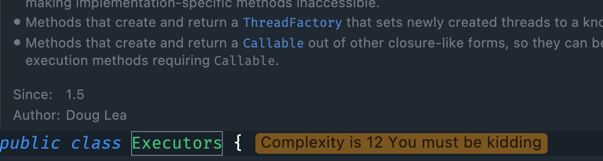

当然了，假如我们也提供了新的类给其他调用者，我们也就成为了新的创建者。

API 创建者在创建新的类的时候，只暴露必要的接口，而隐藏其他所有不必要的信息，之所以要这么做，是因为如果这些信息对调用者是不可见的，那么创建者就可以随意修改隐藏的信息，而不用担心对调用者的影响。

这里就必须要讲到 java 的权限修饰符

访问权限修饰符的第一个作用是，防止类的调用者接触到他们不该接触的内部实现；第二个作用是，让类的创建者可以轻松修改内部机制而不用担心影响到调用者的使用。

- public
- private
- protected

还有一种“默认”的权限修饰符，是缺省的，它修饰的类可以访问同一个包下面的其他类。

#### **4）组合**

我们可以把一个创建好的类作为另外一个类的成员变量来使用，利用已有的类组成成一个新的类，被称为“复用”，组合代表的关系是 has-a 的关系。

之后来看我们java中，面向对象的三大基本特征：

# 面向对象三大基本特征

## 封装(Encapsulation)


所谓封装，也就是把客观事物封装成抽象的类，并且类可以把自己的数据和方法只让可信的类或者对象操作，对不可信的进行信息隐藏。

简单的说，一个类就是一个封装了数据以及操作这些数据的代码的逻辑实体。在一个对象内部，某些代码或某些数据可以是私有的，不能被外界访问。通过这种方式，对象对内部数据提供了不同级别的保护，以防止程序中无关的部分意外的改变或错误的使用了对象的私有部分。

封装从字面上来理解就是包装的意思，专业点就是信息隐藏，**是指利用抽象将数据和基于数据的操作封装在一起，使其构成一个不可分割的独立实体**。

使用封装有 4 大好处：

- 1、良好的封装能够减少耦合。
- 2、类内部的结构可以自由修改。
- 3、可以对成员进行更精确的控制。
- 4、隐藏信息，实现细节。


如我们想要定义一个矩形，先定义一个Rectangle类，并其中通过封装的手段放入一些必备数据。

```markup
/**
* 矩形
*/
class Rectangle {

     /**
      * 设置矩形的长度和宽度
      */
     public Rectangle(int length, int width) {
         this.length = length;
         this.width = width;
     }
    
     /**
      * 长度
      */
     private int length;
    
     /**
      * 宽度
      */
     private int width;
    
     /**
      * 获得矩形面积
      *
      * @return
      */
     public int area() {
         return this.length * this.width;
     }
}复制ErrorOK!
```

我们通过封装的方式，给"矩形"定义了"长度"和"宽度"，这就完成了对现实世界中的"矩形"的抽象的第一步。

如果这个还没有那么的直观，那我们来看下面的这两个类

Husband.java


```java
public class Husband {
    
    /*
     * 对属性的封装
     * 一个人的姓名、性别、年龄、妻子都是这个人的私有属性
     */
    private String name ;
    private String sex ;
    private int age ;
    private Wife wife;
    
    /*
     * setter()、getter()是该对象对外开发的接口
     */
    public String getName() {
        return name;
    }

    public void setName(String name) {
        this.name = name;
    }

    public String getSex() {
        return sex;
    }

    public void setSex(String sex) {
        this.sex = sex;
    }

    public int getAge() {
        return age;
    }

    public void setAge(int age) {
        this.age = age;
    }

    public void setWife(Wife wife) {
        this.wife = wife;
    }
}
```

Wife.java


```java
public class Wife {
    private String name;
    private int age;
    private String sex;
    private Husband husband;

    public String getName() {
        return name;
    }

    public void setName(String name) {
        this.name = name;
    }

    public String getSex() {
        return sex;
    }

    public void setSex(String sex) {
        this.sex = sex;
    }

    public void setAge(int age) {
        this.age = age;
    }

    public void setHusband(Husband husband) {
        this.husband = husband;
    }

    public Husband getHusband() {
        return husband;
    }
    
}
```

可以看得出， Husband 类里面的 wife 属性是没有 `getter()`的，同时 Wife 类的 age 属性也是没有 `getter()`方法的。

所以封装把一个对象的属性私有化，同时提供一些可以被外界访问的属性的方法，如果不想被外界方法，我们大可不必提供方法给外界访问。

但是如果一个类没有提供给外界任何可以访问的方法，那么这个类也没有什么意义了。

比如我们将一个房子看做是一个对象，里面有漂亮的装饰，如沙发、电视剧、空调、茶桌等等都是该房子的私有属性，但是如果我们没有那些墙遮挡，是不是别人就会一览无余呢？没有一点儿隐私！

因为存在那个遮挡的墙，我们既能够有自己的隐私而且我们可以随意的更改里面的摆设而不会影响到外面的人。

但是如果没有门窗，一个包裹的严严实实的黑盒子，又有什么存在的意义呢？所以通过门窗别人也能够看到里面的风景。所以说门窗就是房子对象留给外界访问的接口。

通过这个我们还不能真正体会封装的好处。现在我们从程序的角度来分析封装带来的好处。如果我们不使用封装，那么该对象就没有 `setter()`和 `getter()`，那么 Husband 类应该这样写：


```java
public class Husband {
    public String name ;
    public String sex ;
    public int age ;
    public Wife wife;
}
```

我们应该这样来使用它：


```java
Husband husband = new Husband();
husband.age = 30;
husband.name = "张三";
husband.sex = "男";    //貌似有点儿多余
```

但是哪天如果我们需要修改 Husband，例如将 age 修改为 String 类型的呢？你只有一处使用了这个类还好，如果你有几十个甚至上百个这样地方，你是不是要改到崩溃。如果使用了封装，我们完全可以不需要做任何修改，只需要稍微改变下 Husband 类的 `setAge()`方法即可。


```java
public class Husband {
    
    /*
     * 对属性的封装
     * 一个人的姓名、性别、年龄、妻子都是这个人的私有属性
     */
    private String name ;
    private String sex ;
    private String age ;    /* 改成 String类型的*/
    private Wife wife;
    
    public String getAge() {
        return age;
    }
    
    public void setAge(int age) {
        //转换即可
        this.age = String.valueOf(age);
    }
    
    /** 省略其他属性的setter、getter **/
    
}
```

其他的地方依然这样引用( `husband.setAge(22)` )保持不变。

到了这里我们确实可以看出，**封装确实可以使我们更容易地修改类的内部实现，而无需修改使用了该类的代码**。

我们再看这个好处：**封装可以对成员变量进行更精确的控制**。

还是那个 Husband，一般来说我们在引用这个对象的时候是不容易出错的，但是有时你迷糊了，写成了这样：


```java
Husband husband = new Husband();
husband.age = 300;
```

也许你是因为粗心写成了这样，你发现了还好，如果没有发现那就麻烦大了，谁见过 300 岁的老妖怪啊！

但是使用封装我们就可以避免这个问题，我们对 age 的访问入口做一些控制(setter)如：


```java
public class Husband {
    
    /*
     * 对属性的封装
     * 一个人的姓名、性别、年龄、妻子都是这个人的私有属性
     */
    private String name ;
    private String sex ;
    private int age ;    /* 改成 String类型的*/
    private Wife wife;

    public int getAge() {
        return age;
    }

    public void setAge(int age) {
        if(age > 120){
            System.out.println("ERROR：error age input....");    //提示錯誤信息
        }else{
            this.age = age;
        }
        
    }
    
    /** 省略其他属性的setter、getter **/
    
}
```

上面都是对 setter 方法的控制，其实通过封装我们也能够对对象的出口做出很好的控制。例如性别在数据库中一般都是以 1、0 的方式来存储的，但是在前台我们又不能展示 1、0，这里我们只需要在 `getter()`方法里面做一些转换即可。


```java
public String getSexName() {
    if("0".equals(sex)){
        sexName = "女";
    }
    else if("1".equals(sex)){
        sexName = "男";
    }
    return sexName;
}
```

在使用的时候我们只需要使用 sexName 即可实现正确的性别显示。同理也可以用于针对不同的状态做出不同的操作。


```java
public String getCzHTML(){
    if("1".equals(zt)){
        czHTML = "<a href='javascript:void(0)' onclick='qy("+id+")'>启用</a>";
    }
    else{
        czHTML = "<a href='javascript:void(0)' onclick='jy("+id+")'>禁用</a>";
    }
    return czHTML;
}
```

说了这么多，我们来看java实现封装的基本思路

1. 修改属性的可见性来限制对属性的访问（一般限制为private），例如：

```java
public class Person {
    private String name;
    private int age;
}
```

这段代码中，将 **name** 和 **age** 属性设置为私有的，只能本类才能访问，其他类都访问不了，如此就对信息进行了隐藏。

2. 对每个值属性提供对外的公共方法访问，也就是创建一对赋取值方法，用于对私有属性的访问，例如：

```java
public class Person{
    private String name;
    private int age;

    public int getAge(){
      return age;
    }

    public String getName(){
      return name;
    }

    public void setAge(int age){
      this.age = age;
    }

    public void setName(String name){
      this.name = name;
    }
}
```

采用 **this** 关键字是为了解决实例变量（private String name）和局部变量（setName(String name)中的name变量）之间发生的同名的冲突。

之后我们来复习一个这个private关键字，他是一个权限修饰符。可以修饰成员(成员变量和成员方法)被private修饰的成员，只能在 本类中才能访问如果一个关键字被private修饰后，就只能通过set和get方法来获得和更改参数。

```java
package 面向方法;
public class a3 {
    private String name;
    private int age;
    private String gender;

    //提供get和set方法
    //作用：给name赋值需要有赋值
    public void setName(String n){
        name=n;
    }
    //对外提供数据
    public String getName(){
        return name;
    }


    public void setAge(int a){
        if (a>=18&&a<=50){
            age=a;
        }else {
            System.out.println("非法参数");
        }

    }

    public int getAge(){
        return age;
    }

    public void setGender(String g){
        gender=g;
    }
    public String getGender(){
        return gender;
    }


    public void sleep(){
        System.out.println("在睡觉");
    }public void eat(){
        System.out.println("在吃饭");
    }
}

```

例如这里的get和set方法。

以及main主函数里的调用：

```java
package 面向方法;

public class a3test {
    public static void main(String[] args) {
        a3 gf1=new a3();
        gf1.setName("小诗诗");
        gf1.setAge(18);
        gf1.setGender("傻逼");
        System.out.println(gf1.getAge());
        System.out.println(gf1.getName());
        System.out.println(gf1.getGender());
        gf1.eat();
        gf1.sleep();
    }
}

```

看了这么多，相信大家应该已经看明白什么是封装了。

下面就开始讲第二个基本特征

## 继承(Inheritance)]

继承是指这样一种能力：它可以使用现有类的所有功能，并在无需重新编写原来的类的情况下对这些功能进行扩展。

通过继承创建的新类称为“子类”或“派生类”，被继承的类称为“基类”、“父类”或“超类”。继承的过程，就是从一般到特的过程。

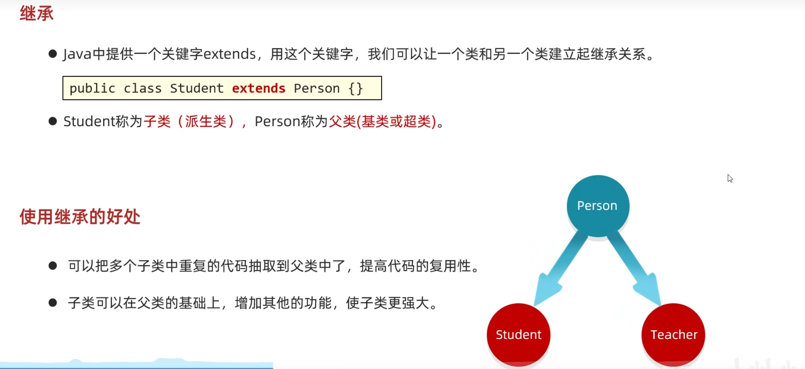


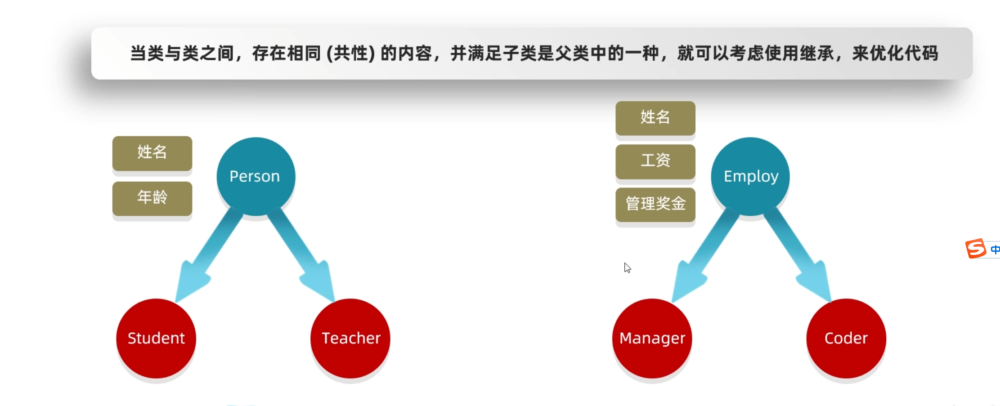

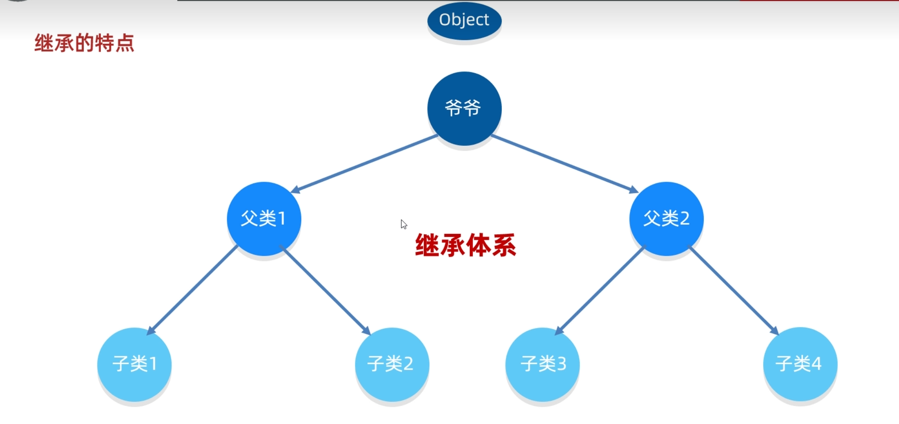

继承是java面向对象编程技术的一块基石，因为它允许创建分等级层次的类。

继承就是子类继承父类的特征和行为，使得子类对象（实例）具有父类的实例域和方法，或子类从父类继承方法，使得子类具有父类相同的行为。

生活中的继承：

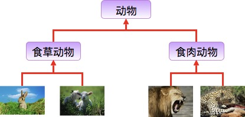

兔子和羊属于食草动物类，狮子和豹属于食肉动物类。

食草动物和食肉动物又是属于动物类。

所以继承需要符合的关系是：is-a，父类更通用，子类更具体。

虽然食草动物和食肉动物都是属于动物，但是两者的属性和行为上有差别，所以子类会具有父类的一般特性也会具有自身的特性。


我们想要定义一个正方形，因为已经有了矩形，所以我们可以直接继承Rectangle类，因为正方形是长方形的一种特例。

```markup
/**
 * 正方形，继承自矩形
 */
class Square extends Rectangle {

    /**
     * 设置正方形边长
     *
     * @param length
     */
    public Square(int length) {
        super(length, length);
    }
}复制ErrorOK!
```

现实世界中，"正方形"是"矩形"的特例，或者说正方形是通过矩形派生出来的，这种派生关系，在面向对象中可以用继承来表达。

如果仅仅只有两三个类，每个类的属性和方法很有限的情况下确实没必要实现继承，但事情并非如此，事实上一个系统中往往有很多个类并且有着很多相似之处，比如猫和狗同属动物，或者学生和老师同属人。各个类可能又有很多个相同的属性和方法，这样的话如果每个类都重新写不仅代码显得很乱，代码工作量也很大。

这时继承的优势就出来了：可以直接使用父类的属性和方法，自己也可以有自己新的属性和方法满足拓展，父类的方法如果自己有需求更改也可以重写。这样**使用继承不仅大大的减少了代码量，也使得代码结构更加清晰可见**。

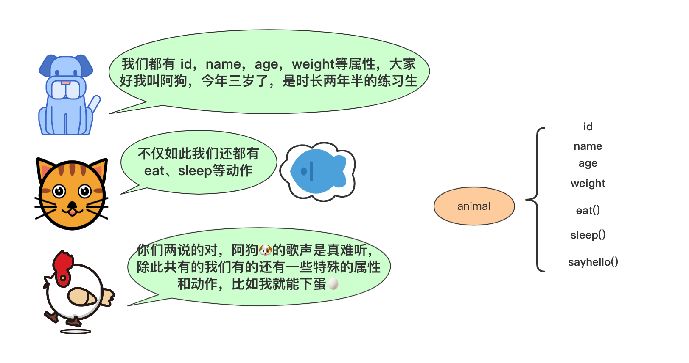

所以这样从代码的层面上来看我们设计这个完整的 Animal 类是这样的：


```java
class Animal
{
    public int id;
    public String name;
    public int age;
    public int weight;

    public Animal(int id, String name, int age, int weight) {
        this.id = id;
        this.name = name;
        this.age = age;
        this.weight = weight;
    }
    //这里省略get set方法
    public void sayHello()
    {
        System.out.println("hello");
    }
    public void eat()
    {
        System.out.println("I'm eating");
    }
    public void sing()
    {
        System.out.println("sing");
    }
}
```

而 Dog，Cat，Chicken 类可以这样设计：


```java
class Dog extends Animal//继承animal
{
    public Dog(int id, String name, int age, int weight) {
        super(id, name, age, weight);//调用父类构造方法
    }
}
class Cat extends Animal{

    public Cat(int id, String name, int age, int weight) {
        super(id, name, age, weight);//调用父类构造方法
    }
}
class Chicken extends Animal{

    public Chicken(int id, String name, int age, int weight) {
        super(id, name, age, weight);//调用父类构造方法
    }
    //鸡下蛋
    public void layEggs()
    {
        System.out.println("我是老母鸡下蛋啦，咯哒咯！咯哒咯！");
    }
}
```

各自的类继承 Animal 后可以直接使用 Animal 类的属性和方法而不需要重复编写，各个类如果有自己的方法也可很容易地拓展

继承的分类

继承分为单继承和多继承，Java 语言只支持类的单继承，但可以通过实现接口的方式达到多继承的目的。****

| 继承                                                         | 定义                       | 优缺点                                                       |
| ------------------------------------------------------------ | -------------------------- | ------------------------------------------------------------ |
| 单继承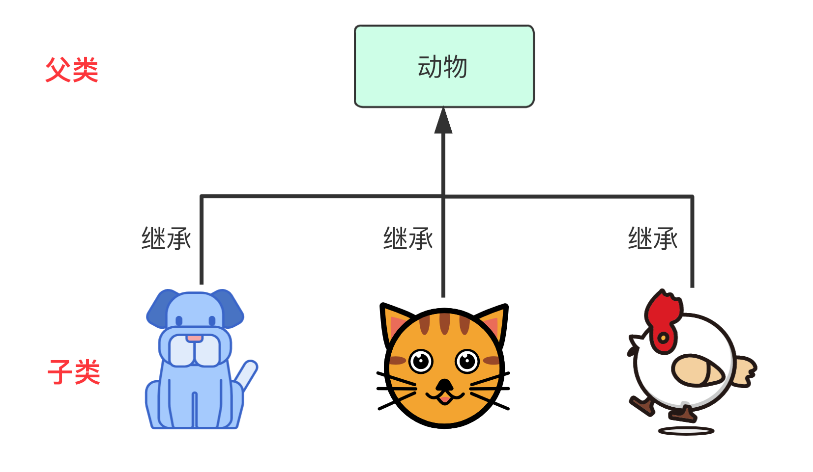 | 一个子类只拥有一个父类     | 优点：在类层次结构上比较清晰 缺点：结构的丰富度有时不能满足使用需求 |
| 多继承（Java 不支持，但可以用其它方式满足多继承使用需求）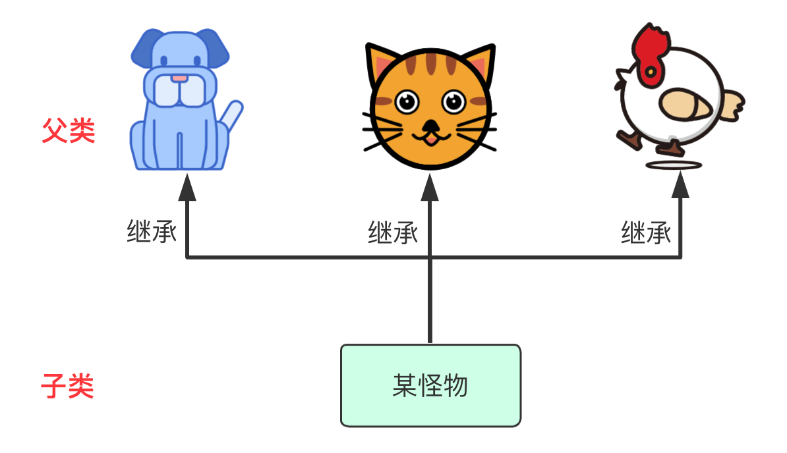 | 一个子类拥有多个直接的父类 | 优点：子类的丰富度很高 缺点：容易造成混乱                    |

### **单继承**

单继承，一个子类只有一个父类，如我们上面讲过的 Animal 类和它的子类。**单继承在类层次结构上比较清晰，但缺点是结构的丰富度有时不能满足使用需求**。

### **多继承**

多继承，一个子类有多个直接的父类。这样做的好处是子类拥有所有父类的特征，**子类的丰富度很高，但是缺点就是容易造成混乱**。下图为一个混乱的例子。

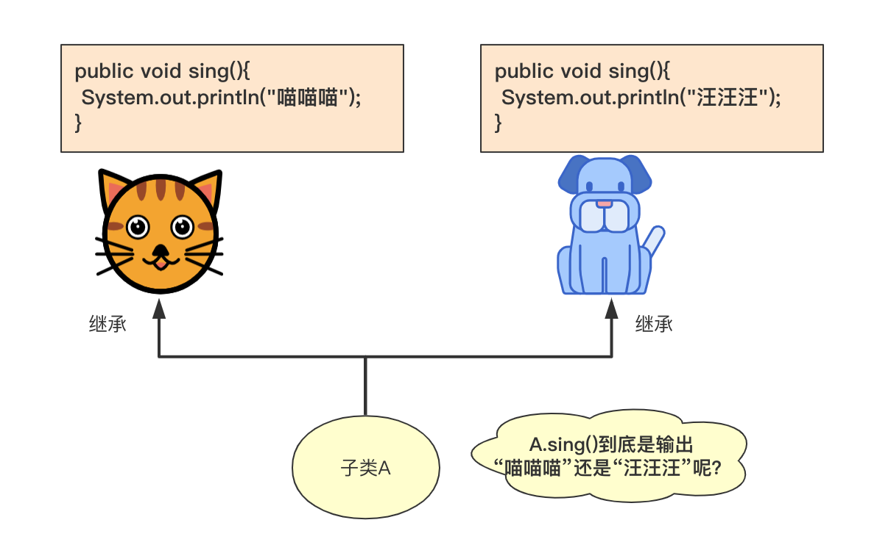

要注意的是，java是不支持多继承的，至于为什么不支持多继承呢，我们来看一下解释。

下面我们来看这个菱型继承

假设我们有类B和类C，它们都继承了相同的类A。另外我们还有类D，类D通过多重继承机制继承了类B和类C。

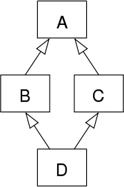

这时候，因为D同时继承了B和C，并且B和C又同时继承了A，那么，D中就会因为多重继承，继承到两份来自A中的属性和方法。

这时候，在使用D的时候，如果想要调用一个定义在A中的方法时，就会出现歧义。

因为这样的继承关系的形状类似于菱形，因此这个问题被形象地称为菱形继承问题。

而C++为了解决菱形继承问题，又引入了**虚继承**。

因为支持多继承，引入了菱形继承问题，又因为要解决菱形继承问题，引入了虚继承。而经过分析，人们发现我们其实真正想要使用多继承的情况并不多。

所以，在 Java 中，不允许“实现多继承”，即一个类不允许继承多个父类。但是 Java 允许“声明多继承”，即一个类可以实现多个接口，一个接口也可以继承多个父接口。由于接口只允许有方法声明而不允许有方法实现（Java 8以前），这就避免了 C++ 中多继承的歧义问题。

但是，Java不支持多继承，在Java 8中支持了默认函数（default method ）之后就不那么绝对了。

虽然我们还是没办法使用extends同时继承多个类，但是因为有了默认函数，我们有可能通过implements从多个接口中继承到多个默认函数，那么，又如何解决这种情况带来的菱形继承问题呢？这个问题留给大家去查询答案。


Java 虽然不支持多继承，但是 Java 有三种实现多继承效果的方式，**分别是**内部类、多层继承和实现接口。

内部类可以继承一个与外部类无关的类，保证了内部类的独立性，正是基于这一点，可以达到多继承的效果。

**多层继承：\**子类继承父类，父类如果还继承其他的类，那么这就叫\**多层继承**。这样子类就会拥有所有被继承类的属性和方法。

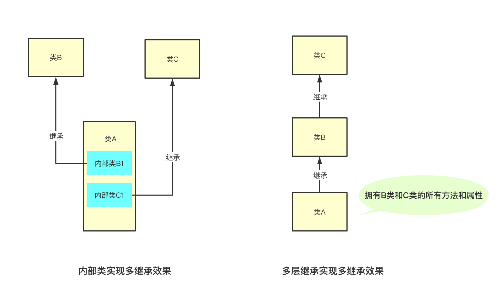

实现接口无疑是满足多继承使用需求的最好方式，一个类可以实现多个接口满足自己在丰富性和复杂环境的使用需求。

类和接口相比，**类就是一个实体，有属性和方法，而接口更倾向于一组方法**。举个例子，就拿斗罗大陆的唐三来看，他存在的继承关系可能是这样的：


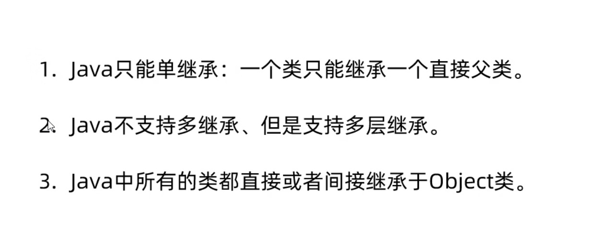

下面来一个图，让你快速区分这个继承的分类


### 如何实现继承

#### **extends 关键字**

在 Java 中，类的继承是单一继承，也就是说一个子类只能拥有一个父类，所以**extends**只能继承一个类。其使用语法为：


```java
class 子类名 extends 父类名{}
```

例如 Dog 类继承 Animal 类，它是这样的：


```java
class Animal{} //定义Animal类
class Dog extends Animal{} //Dog类继承Animal类
```

子类继承父类后，就拥有父类的非私有的**属性和方法**。如果不明白，请看这个案例，在 IDEA 下创建一个项目，创建一个 test 类做测试，分别创建 Animal 类和 Dog 类，Animal 作为父类写一个 sayHello()方法，Dog 类继承 Animal 类之后就可以调用 sayHello()方法。具体代码为：


```java
class Animal {
    public void  sayHello()//父类的方法
    {
        System.out.println("hello,everybody");
    }
}
class Dog extends Animal//继承animal
{ }
public class test {
    public static void main(String[] args) {
       Dog dog=new Dog();
       dog.sayHello();
    }
}
```

点击运行的时候 Dog 子类可以直接使用 Animal 父类的方法。

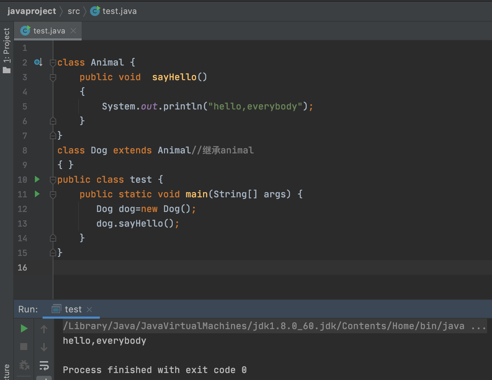

#### **implements 关键字**

使用 implements 关键字可以变相使 Java 拥有多继承的特性，使用范围为类实现接口的情况，一个类可以实现多个接口(接口与接口之间用逗号分开)。

我们来看一个案例，创建一个 test2 类做测试，分别创建 doA 接口和 doB 接口，doA 接口声明 sayHello()方法，doB 接口声明 eat()方法，创建 Cat2 类实现 doA 和 doB 接口，并且在类中需要重写 sayHello()方法和 eat()方法。具体代码为：


```java
interface doA{
     void sayHello();
}
interface doB{
     void eat();
    //以下会报错 接口中的方法不能具体定义只能声明
    //public void eat(){System.out.println("eating");}
}
class Cat2 implements  doA,doB{
    @Override//必须重写接口内的方法
    public void sayHello() {
        System.out.println("hello!");
    }
    @Override
    public void eat() {
        System.out.println("I'm eating");
    }
}
public class test2 {
    public static void main(String[] args) {
        Cat2 cat=new Cat2();
        cat.sayHello();
        cat.eat();
    }
}
```

Cat 类实现 doA 和 doB 接口的时候，需要实现其声明的方法，点击运行结果如下，这就是一个类实现接口的简单案例：

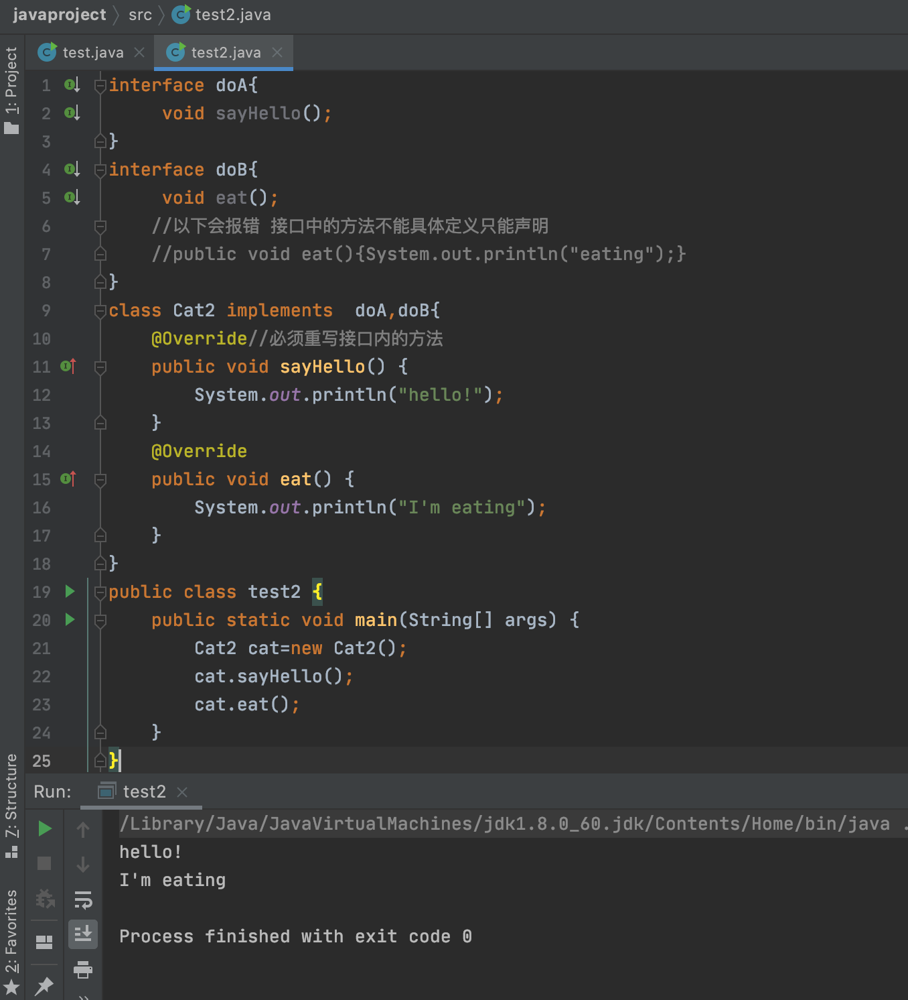

说了这么多我们来看一个继承的练习

### 练习

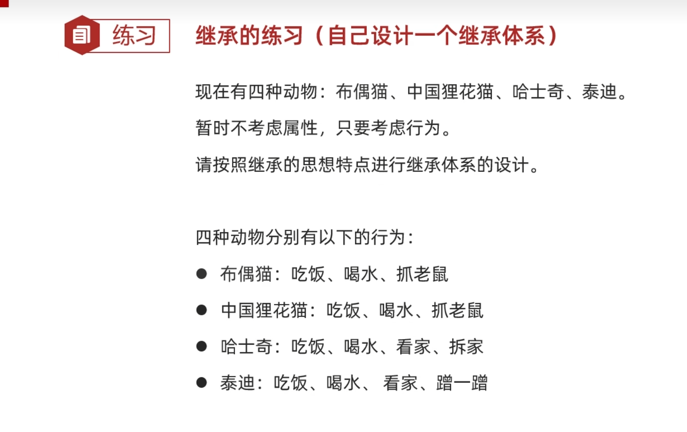

首先我们先画一个图

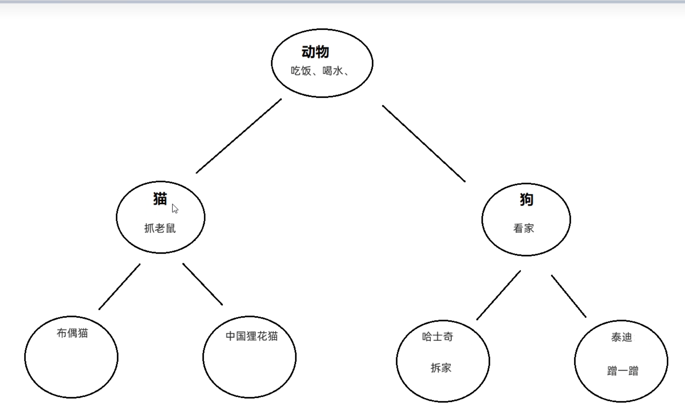

画出继承关系。画图是从下往上画。

之后是写代码。写代码的话，就是从上往下写。

先是动物

```java
package 面向对象进阶.a4;

public class Animal {
    //这里用的是public。所以所有继承他的子类都可以用这个方法。
    //如果是private，就只有自己可以用
    //可以相当于一个人的私房钱
    public void eat(){
        System.out.println("吃东西");
    }
    public void drink(){
        System.out.println("喝水");
    }
}

```

之后是猫和狗

```java
package 面向对象进阶.a4;

public class Cat extends Animal {
    public void cathMouse(){
        System.out.println("猫在抓老鼠");
    }

}

```


```java
package 面向对象进阶.a4;

public class Dog extends Animal {
    public void lookHome(){
        System.out.println("狗在看见");
    }
}

```

最后开始详细书写

```java
package 面向对象进阶.a4;

public class Husky extends Dog{
    public void breakHome(){
        System.out.println("哈士奇在拆家");
    }

}

```

```java
package 面向对象进阶.a4;

public class LiHua extends Cat{
}

```

```java
package 面向对象进阶.a4;

public class Ragdoll extends Cat {
}

```

```java
package 面向对象进阶.a4;

public class Teddy extends Dog {
    public void touch(){
        System.out.println("泰迪又在蹭我的腿了~");
    }
}

```

```java
package 面向对象进阶.a4;
/*
注意事项，子类只能访问父类中非私有的成员
 */
public class Test {
    public static void main(String[] args) {
        //创建一个布偶猫的对象
        Ragdoll rd=new Ragdoll();
        rd.eat();
        rd.drink();
        rd.cathMouse();
        System.out.println("--------------------------");
        //创建一个哈奇士对象
        Husky h=new Husky();
        h.eat();
        h.breakHome();
        h.drink();
        h.lookHome();
    }
}

```

最后的是我们的测试类。就可以发现测试成功了。

这样就算是一个完整的继承了。

## 多态(Polymorphism)

所谓多态就是指一个类实例的相同方法在不同情形有不同表现形式。多态机制使具有不同内部结构的对象可以共享相同的外部接口。

这意味着，虽然针对不同对象的具体操作不同，但通过一个公共的类，它们（那些操作）可以通过相同的方式予以调用。

最常见的多态就是将子类传入父类参数中，运行时调用父类方法时通过传入的子类决定具体的内部结构或行为。

在我刻板的印象里，西游记里的那段孙悟空和二郎神的精彩对战就能很好的解释“多态”这个词：一个孙悟空，能七十二变；一个二郎神，也能七十二变；他们都可以变成不同的形态，但只需要悄悄地喊一声“变”。

Java的多态是什么呢？其实就是一种能力——同一个行为具有不同的表现形式；换句话说就是，执行一段代码，Java 在运行时能根据对象的不同产生不同的结果。和孙悟空和二郎神都只需要喊一声“变”，然后就变了，并且每次变得还不一样；一个道理。

多态的前提条件有三个：

- 子类继承父类
- 子类覆盖父类的方法
- 父类引用指向子类对象

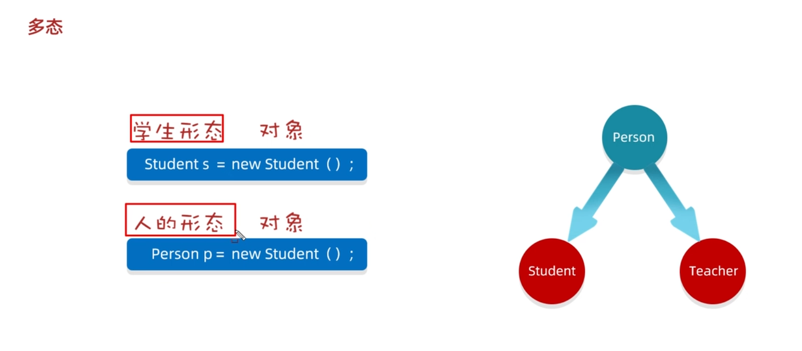

这个简单理解他的应用场景。就是

比如说有一个登录系统。

有三个不同身份的人都需要登录

这个时候。我们登录系统的这个形参。就可以写他父类的person了。

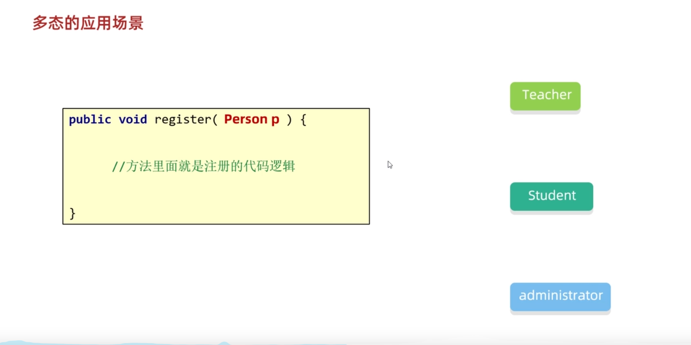

多态的一个简单应用，来看程序清单1-1：


```java
//子类继承父类
public class Wangxiaoer extends Wanger {
    public void write() { // 子类覆盖父类方法
        System.out.println("记住仇恨，表明我们要奋发图强的心智");
    }

    public static void main(String[] args) {
        // 父类引用指向子类对象
        Wanger[] wangers = { new Wanger(), new Wangxiaoer() };

        for (Wanger wanger : wangers) {
            // 对象是王二的时候输出：勿忘国耻
            // 对象是王小二的时候输出：记住仇恨，表明我们要奋发图强的心智
            wanger.write();
        }
    }
}

class Wanger {
    public void write() {
        System.out.println("勿忘国耻");
    }
}
```

#### 01、多态与后期绑定

现在，我们来思考一个问题：程序清单1-1在执行 `wanger.write()` 时，由于编译器只有一个 Wanger 引用，它怎么知道究竟该调用父类 Wanger 的 `write()` 方法，还是子类 Wangxiaoer 的 `write()` 方法呢？

答案是在运行时根据对象的类型进行后期绑定，编译器在编译阶段并不知道对象的类型，但是Java的方法调用机制能找到正确的方法体，然后执行出正确的结果。

多态机制提供的一个重要的好处程序具有良好的扩展性。来看程序清单2-1：


```java
//子类继承父类
public class Wangxiaoer extends Wanger {
    public void write() { // 子类覆盖父类方法
        System.out.println("记住仇恨，表明我们要奋发图强的心智");
    }
    
    public void eat() {
        System.out.println("我不喜欢读书，我就喜欢吃");
    }

    public static void main(String[] args) {
        // 父类引用指向子类对象
        Wanger[] wangers = { new Wanger(), new Wangxiaoer() };

        for (Wanger wanger : wangers) {
            // 对象是王二的时候输出：勿忘国耻
            // 对象是王小二的时候输出：记住仇恨，表明我们要奋发图强的心智
            wanger.write();
        }
    }
}

class Wanger {
    public void write() {
        System.out.println("勿忘国耻");
    }
    
    public void read() {
        System.out.println("每周读一本好书");
    }
}
```

在程序清单 2-1 中，我们在 Wanger 类中增加了 read() 方法，在 Wangxiaoer 类中增加了eat()方法，但这丝毫不会影响到 write() 方法的调用。write() 方法忽略了周围代码发生的变化，依然正常运行。这让我想起了金庸《倚天屠龙记》里九阳真经的口诀：“他强由他强，清风拂山岗；他横由他横，明月照大江。”

多态的这个优秀的特性，让我们在修改代码的时候不必过于紧张，因为多态是一项让程序员“将改变的与未改变的分离开来”的重要特性。

#### 02、多态与构造方法

在构造方法中调用多态方法，会产生一个奇妙的结果，我们来看程序清单3-1：


```java
public class Wangxiaosan extends Wangsan {
    private int age = 3;
    public Wangxiaosan(int age) {
        this.age = age;
        System.out.println("王小三的年龄：" + this.age);
    }
    
    public void write() { // 子类覆盖父类方法
        System.out.println("我小三上幼儿园的年龄是：" + this.age);
    }
    
    public static void main(String[] args) {
        new Wangxiaosan(4);
//      上幼儿园之前
//      我小三上幼儿园的年龄是：0
//      上幼儿园之后
//      王小三的年龄：4
    }
}

class Wangsan {
    Wangsan () {
        System.out.println("上幼儿园之前");
        write();
        System.out.println("上幼儿园之后");
    }
    public void write() {
        System.out.println("老子上幼儿园的年龄是3岁半");
    }
}
```

从输出结果上看，是不是有点诧异？明明在创建 Wangxiaosan 对象的时候，年龄传递的是 4，但输出结果既不是“老子上幼儿园的年龄是 3 岁半”，也不是“我小三上幼儿园的年龄是：4”。

为什么？

因为在创建子类对象时，会先去调用父类的构造方法，而父类构造方法中又调用了被子类覆盖的多态方法，由于父类并不清楚子类对象中的属性值是什么，于是把int类型的属性暂时初始化为 0，然后再调用子类的构造方法（子类构造方法知道王小二的年龄是 4）。

#### 03、多态与向下转型

向下转型是指将父类引用强转为子类类型；这是不安全的，因为有的时候，父类引用指向的是父类对象，向下转型就会抛出 ClassCastException，表示类型转换失败；但如果父类引用指向的是子类对象，那么向下转型就是成功的。

来看程序清单4-1：


```java
public class Wangxiaosi extends Wangsi {
    public void write() {
        System.out.println("记住仇恨，表明我们要奋发图强的心智");
    }

    public void eat() {
        System.out.println("我不喜欢读书，我就喜欢吃");
    }

    public static void main(String[] args) {
        Wangsi[] wangsis = { new Wangsi(), new Wangxiaosi() };

        // wangsis[1]能够向下转型
        ((Wangxiaosi) wangsis[1]).write();
        // wangsis[0]不能向下转型
        ((Wangxiaosi)wangsis[0]).write();
    }
}

class Wangsi {
    public void write() {
        System.out.println("勿忘国耻");
    }

    public void read() {
        System.out.println("每周读一本好书");
    }
}
```


简单的来总结这个就是


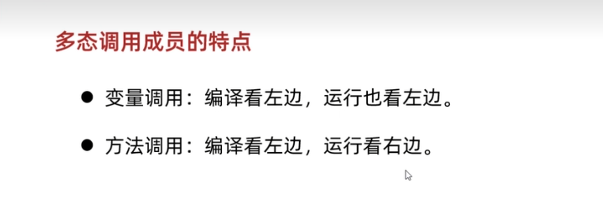


具体这个怎么理解呢。

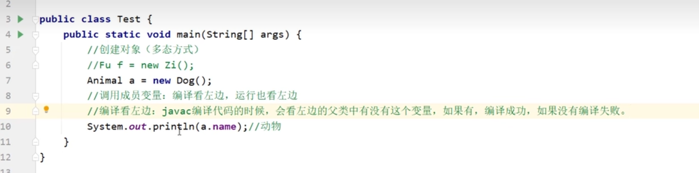


可以这样理解。就是如果子类和父类都有这个变量。那么sout之后。输出的是父类的变量。

运行也看左边。也就是说实际获取的值也是左边的值。

之后看这个方法调用的解释


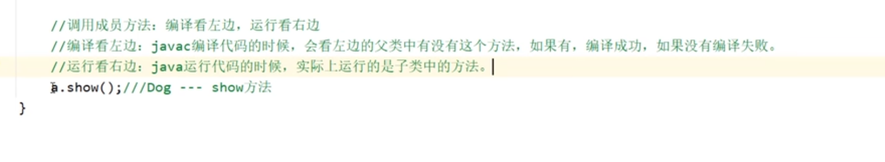


这里编译看左边。简单来说。就是编译的时候要去判断父类中是否有这个方法。如果没有的话。也会报错的。然后运行的时候。运行的就是右边子类所提供的方法内容。

因此。这也就产生的多态的一个弊端。不能调用子类的特殊功能。解决方案也很简单：变回子类类型。用()括起来进行转换。

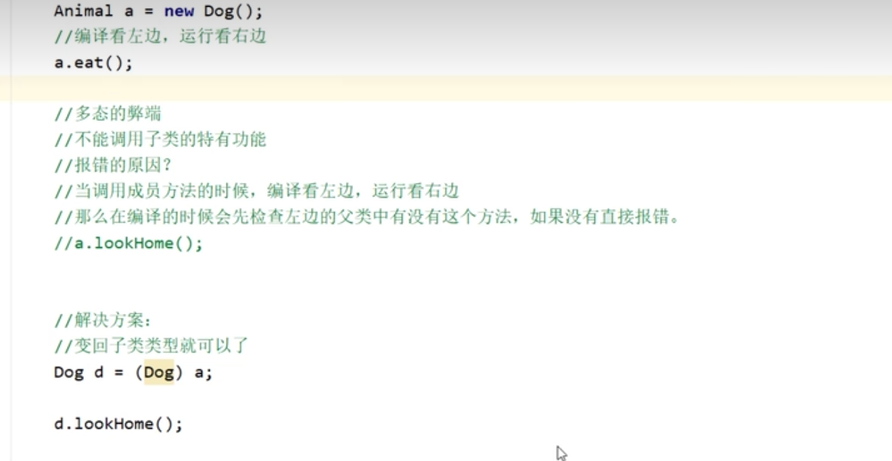


但是也不能随便的转换，

就比如还是上边的代码。

你把a转换为cat。

就会报错。为了尽量避免这种情况的发生。

我们可以用if来进行判断类型。

这里就要用到一个instanceof参数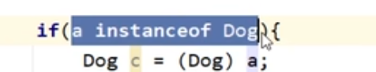


这也就可以判断a是否是dog类型的。如果是返回true。

如果不是就返回false

因此可以看这个类型转换的一个判断代码

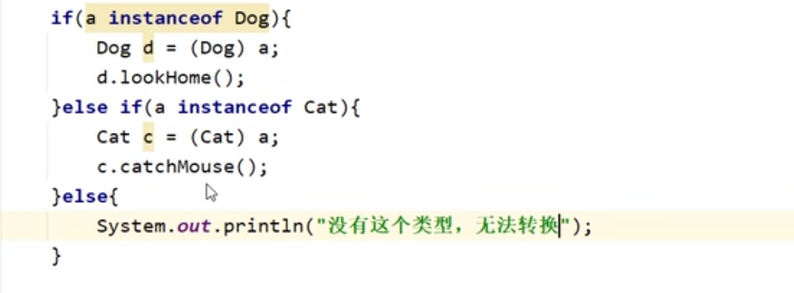

但是这也有点麻烦。

所以java在jdk14之后提供了新特性。


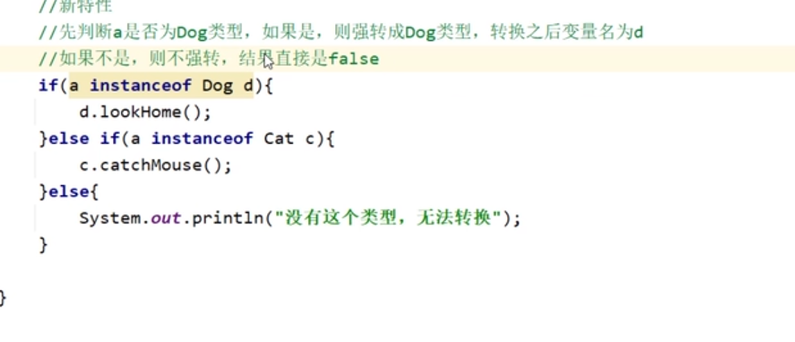

有点类似python中语法糖的效果。


在介绍了面向对象的封装、继承、多态的三个基本特征之后，我们基本掌握了对现实世界抽象的基本方法。

封装：是对类的封装，封装是对类的属性和方法进行封装，只对外暴露方法而不暴露具体使用细节，所以我们一般设计类成员变量时候大多设为私有而通过一些 get、set 方法去读写。

继承：子类继承父类，即“子承父业”，子类拥有父类除私有的所有属性和方法，自己还能在此基础上拓展自己新的属性和方法。主要目的是**复用代码**。

**多态**：多态是同一个行为具有多个不同表现形式或形态的能力。即一个父类可能有若干子类，各子类实现父类方法有多种多样，调用父类方法时，父类引用变量指向不同子类实例而执行不同方法，这就是所谓父类方法是多态的。

下面我们来用一个图来看懂这三者的关系

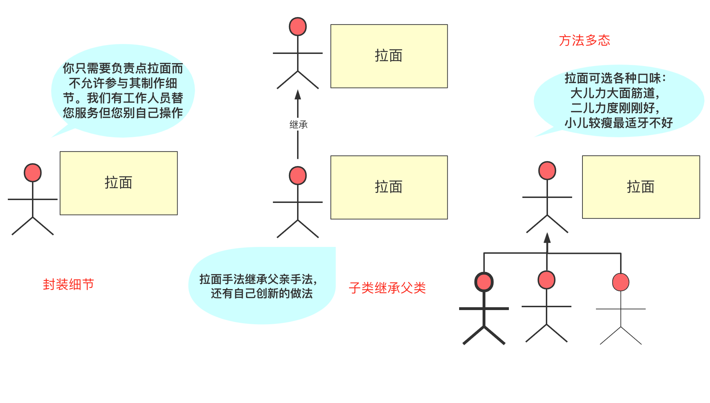

莎士比亚说："一千个读者眼里有一千个哈姆雷特"，说到对现实世界的抽象，虽然方法相同，但是运用同样的方法，最终得到的结果可能千差万别，那么如何评价这个抽象的结果的好坏呢？

这就要提到面喜爱那个对象的五大基本原则了，有了五大原则，我们参考他们来评价一个抽象的好坏。

# 面向对象的五大基本原则

面向对象开发范式的最大的好处就是易用、易扩展、易维护，但是，什么样的代码是易用、易扩展、易维护的呢？如何衡量他们呢？

罗伯特·C·马丁在21世纪早期提出了SOLID原则，这是五个原则的缩写的组合，这五个原则沿用至今。

### 单一职责原（single-responsibility-principle）)

其核心思想为：一个类，最好只做一件事，只有一个引起它的变化。

单一职责原则可以看做是低耦合、高内聚在面向对象原则上的引申，将职责定义为引起变化的原因，以提高内聚性来减少引起变化的原因。职责过多，可能引起它变化的原因就越多，这将导致职责依赖，相互之间就产生影响，从而大大损伤其内聚性和耦合度。通常意义下的单一职责，就是指只有一种单一功能，不要为类实现过多的功能点，以保证实体只有一个引起它变化的原因。 专注，是一个人优良的品质；同样的，单一也是一个类的优良设计。交杂不清的职责将使得代码看起来特别别扭牵一发而动全身，有失美感和必然导致丑陋的系统错误风险。

### 开放封闭原则（Open-Closed principle

其核心思想是：软件实体应该是可扩展的，而不可修改的。也就是，对扩展开放，对修改封闭的。

开放封闭原则主要体现在两个方面：

1、对扩展开放，意味着有新的需求或变化时，可以对现有代码进行扩展，以适应新的情况。

2、对修改封闭，意味着类一旦设计完成，就可以独立完成其工作，而不要对其进行任何尝试的修改。

实现开放封闭原则的核心思想就是对抽象编程，而不对具体编程，因为抽象相对稳定。让类依赖于固定的抽象，所以修改就是封闭的；而通过面向对象的继承和多态机制，又可以实现对抽象类的继承，通过覆写其方法来改变固有行为，实现新的拓展方法，所以就是开放的。 “需求总是变化”没有不变的软件，所以就需要用封闭开放原则来封闭变化满足需求，同时还能保持软件内部的封装体系稳定，不被需求的变化影响。

### 里氏替换原则（Liskov-Substitution Principle]

其核心思想是：子类必须能够替换其基类。这一思想体现为对继承机制的约束规范，只有子类能够替换基类时，才能保证系统在运行期内识别子类，这是保证继承复用的基础。

在父类和子类的具体行为中，必须严格把握继承层次中的关系和特征，将基类替换为子类，程序的行为不会发生任何变化。同时，这一约束反过来则是不成立的，子类可以替换基类，但是基类不一定能替换子类。 里氏替换原则，主要着眼于对抽象和多态建立在继承的基础上，因此只有遵循了Liskov替换原则，才能保证继承复用是可靠地。实现的方法是面向接口编程：将公共部分抽象为基类接口或抽象类，通过Extract Abstract Class，在子类中通过覆写父类的方法实现新的方式支持同样的职责。

里氏替换原则是关于继承机制的设计原则，违反了Liskov替换原则就必然导致违反开放封闭原则。

里氏替换原则能够保证系统具有良好的拓展性，同时实现基于多态的抽象机制，能够减少代码冗余，避免运行期的类型判别。

### 依赖倒置原则（Dependecy-Inversion Principle）

其核心思想是：依赖于抽象。具体而言就是高层模块不依赖于底层模块，二者都同依赖于抽象；抽象不依赖于具体，具体依赖于抽象。

我们知道，依赖一定会存在于类与类、模块与模块之间。当两个模块之间存在紧密的耦合关系时，最好的方法就是分离接口和实现：在依赖之间定义一个抽象的接口使得高层模块调用接口，而底层模块实现接口的定义，以此来有效控制耦合关系，达到依赖于抽象的设计目标。 抽象的稳定性决定了系统的稳定性，因为抽象是不变的，依赖于抽象是面向对象设计的精髓，也是依赖倒置原则的核心。

依赖于抽象是一个通用的原则，而某些时候依赖于细节则是在所难免的，必须权衡在抽象和具体之间的取舍，方法不是一层不变的。依赖于抽象，就是对接口编程，不要对实现编程。

### 接口隔离原则（Interface-Segregation Principle）

其核心思想是：使用多个小的专门的接口，而不要使用一个大的总接口。

具体而言，接口隔离原则体现在：接口应该是内聚的，应该避免“胖”接口。一个类对另外一个类的依赖应该建立在最小的接口上，不要强迫依赖不用的方法，这是一种接口污染。

接口有效地将细节和抽象隔离，体现了对抽象编程的一切好处，接口隔离强调接口的单一性。而胖接口存在明显的弊端，会导致实现的类型必须完全实现接口的所有方法、属性等；而某些时候，实现类型并非需要所有的接口定义，在设计上这是“浪费”，而且在实施上这会带来潜在的问题，对胖接口的修改将导致一连串的客户端程序需要修改，有时候这是一种灾难。在这种情况下，将胖接口分解为多个特点的定制化方法，使得客户端仅仅依赖于它们的实际调用的方法，从而解除了客户端不会依赖于它们不用的方法。 分离的手段主要有以下两种：

1、委托分离，通过增加一个新的类型来委托客户的请求，隔离客户和接口的直接依赖，但是会增加系统的开销。

2、多重继承分离，通过接口多继承来实现客户的需求，这种方式是较好的。

以上就是5个基本的面向对象设计原则，它们就像面向对象程序设计中的金科玉律，遵守它们可以使我们的代码更加鲜活，易于复用，易于拓展，灵活优雅。

不同的设计模式对应不同的需求，而设计原则则代表永恒的灵魂，需要在实践中时时刻刻地遵守。就如ARTHUR J.RIEL在那边《OOD启示录》中所说的：“你并不必严格遵守这些原则，违背它们也不会被处以宗教刑罚。但你应当把这些原则看做警铃，若违背了其中的一条，那么警铃就会响起。”

很多人刚开始可能对这些原则无法深刻的理解，但是没关系，随着自己开发经验的增长，就会慢慢的可以理解这些原则了。

在了解了这个之后，我们来看一个比较大的案例

# 案例

```java
根据需求完成代码:
    1.定义狗类
        属性：
            年龄，颜色
        行为:
            eat(String something)(something表示吃的东西)
            看家lookHome方法(无参数)

    2.定义猫类
        属性：
            年龄，颜色
        行为:
            eat(String something)方法(something表示吃的东西)
            逮老鼠catchMouse方法(无参数)

    3.定义Person类//饲养员
        属性：
            姓名，年龄
        行为：
            keepPet(Dog dog,String something)方法
                功能：喂养宠物狗，something表示喂养的东西
        行为：
            keepPet(Cat cat,String something)方法
                功能：喂养宠物猫，something表示喂养的东西
        生成空参有参构造，set和get方法  
    4.定义测试类(完成以下打印效果):
        keepPet(Dog dog,String somethind)方法打印内容如下：
            年龄为30岁的老王养了一只黑颜色的2岁的狗
            2岁的黑颜色的狗两只前腿死死的抱住骨头猛吃
        keepPet(Cat cat,String somethind)方法打印内容如下：
            年龄为25岁的老李养了一只灰颜色的3岁的猫
            3岁的灰颜色的猫眯着眼睛侧着头吃鱼
    5.思考：       
        1.Dog和Cat都是Animal的子类，以上案例中针对不同的动物，定义了不同的keepPet方法，过于繁琐，能否简化，并体会简化后的好处？
        2.Dog和Cat虽然都是Animal的子类，但是都有其特有方法，能否想办法在keepPet中调用特有方法？
```

下面我们来看思维导图

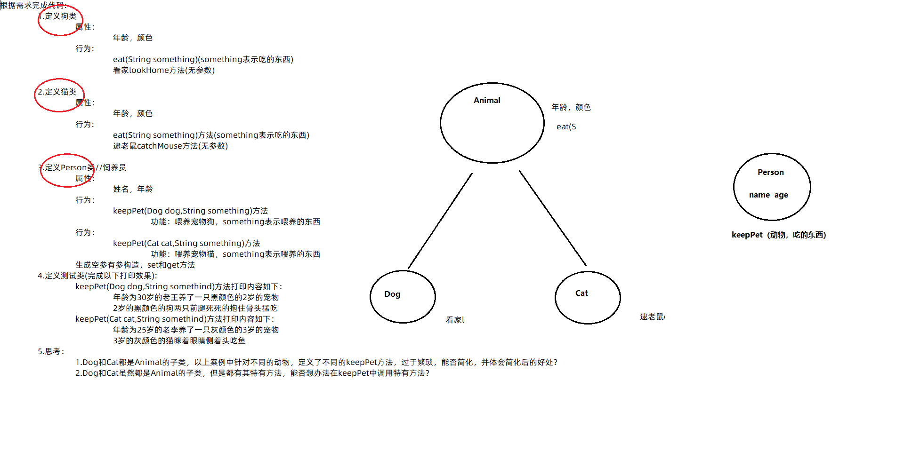

之后开始进行代码演示：

 先写父类的animal

```java
package 面向对象进阶.a8;

public class Animal {
    private int age;
    private String color;

    public void eat(String something){
        System.out.println("动物在吃"+something);
    }

    public Animal() {
    }

    public Animal(int age, String color) {
        this.age = age;
        this.color = color;
    }

    /**
     * 获取
     * @return age
     */
    public int getAge() {
        return age;
    }

    /**
     * 设置
     * @param age
     */
    public void setAge(int age) {
        this.age = age;
    }

    /**
     * 获取
     * @return color
     */
    public String getColor() {
        return color;
    }

    /**
     * 设置
     * @param color
     */
    public void setColor(String color) {
        this.color = color;
    }

    public String toString() {
        return "Animal{age = " + age + ", color = " + color + "}";
    }
}

```

之后是子类的

```java
package 面向对象进阶.a8;

public class Cat extends Animal{
    public Cat() {
    }

    public Cat(int age, String color) {
        super(age, color);
    }

    @Override
    public void eat(String something) {
        System.out.println(getAge()+"岁的"+getColor()+"颜色的猫咪眯着眼睛" +
                "侧着头吃"+something);
    }
    public void catchMouse(){
        System.out.println("猫捉老鼠");
    }
}

```

```java
package 面向对象进阶.a8;

public class Dog extends Animal{

    public Dog() {
    }

    public Dog(int age, String color) {
        super(age, color);
    }
    //行为


    @Override
    public void eat(String something) {
        System.out.println(getAge()+"的"+getColor()+"颜色的狗，俩只前脚" +
                "死死抱着"+something+"猛吃");
    }
    public void lookHome(){
        System.out.println("狗在看见");
    }
}

```

这里是person的。person这里用到了多态。

```java
package 面向对象进阶.a8;

import javax.sound.midi.Soundbank;

//这里的person不要去继承animal
public class Person {
    private String name;
    private int age;
    //饲养猫和狗
    public void KeepPet(Animal a,String something){
        if (a instanceof Dog){
            Dog d=(Dog) a;
            System.out.println("年龄为"+age+"岁的"+name+"养了一直"+a.getColor()
                    +"颜色的"+a.getAge()+"岁的狗");
            d.eat(something);
        }else if (a instanceof Cat){
            Cat c=(Cat) a;
            System.out.println("年龄为"+age+"岁的"+name+"养了一直"+a.getColor()
                    +"颜色的"+a.getAge()+"岁的猫");
            c.eat(something);
        }else {
            System.out.println("没有这种动物");
        }

    }

    public Person() {
    }

    public Person(String name, int age) {
        this.name = name;
        this.age = age;
    }

    /**
     * 获取
     * @return name
     */
    public String getName() {
        return name;
    }

    /**
     * 设置
     * @param name
     */
    public void setName(String name) {
        this.name = name;
    }

    /**
     * 获取
     * @return age
     */
    public int getAge() {
        return age;
    }

    /**
     * 设置
     * @param age
     */
    public void setAge(int age) {
        this.age = age;
    }

    public String toString() {
        return "Person{name = " + name + ", age = " + age + "}";
    }
}

```

之后再看test类。

```java
package 面向对象进阶.a8;

public class Test {
    public static void main(String[] args) {
        //创建对象并且调用方法。


        Person p1=new Person("老王",30);
        Dog d=new Dog(2,"黑");
        Cat c=new Cat(1,"白");
        p1.KeepPet(d,"骨头");
        p1.KeepPet(c,"鱼");

    }
}

```

# java中的包

为了更好地组织类，Java 提供了包机制，用于区别类名的命名空间。

在前面的代码中，我们把类和接口命名为`Person`、`Student`、`Hello`等简单的名字。

在团队开发中，如果小明写了一个`Person`类，小红也写了一个`Person`类，现在，小白既想用小明的`Person`，也想用小红的`Person`，怎么办？

如果小军写了一个`Arrays`类，恰好 JDK 也自带了一个`Arrays`类，如何解决类名冲突？

在 Java 中，我们使用`package`来解决名字冲突。

Java 定义了一种名字空间，称之为包：`package`。一个类总是属于某个包，类名（比如`Person`）只是一个简写，真正的完整类名是`包名.类名`。

例如：

小明的`Person`类存放在包`ming`下面，因此，完整类名是`ming.Person`；

小红的`Person`类存放在包`hong`下面，因此，完整类名是`hong.Person`；

小军的`Arrays`类存放在包`mr.jun`下面，因此，完整类名是`mr.jun.Arrays`；

JDK 的`Arrays`类存放在包`java.util`下面，因此，完整类名是`java.util.Arrays`。

在定义`class`的时候，我们需要在第一行声明这个`class`属于哪个包。

小明的`Person.java`文件：


```java
package ming; // 申明包名ming

public class Person {
}
```

小军的`Arrays.java`文件：


```java
package mr.jun; // 申明包名mr.jun

public class Arrays {
}
```

在 Java 虚拟机执行的时候，JVM 只看完整类名，因此，只要包名不同，类就不同。

包可以是多层结构，用`.`隔开。例如：`java.util`。

> 要特别注意：包没有父子关系。java.util和java.util.zip是不同的包，两者没有任何继承关系。

没有定义包名的`class`，它使用的是默认包，非常容易引起名字冲突，因此，不推荐不写包名的做法。

我们还需要按照包结构把上面的 Java 文件组织起来。假设以`package_sample`作为根目录，`src`作为源码目录，那么所有文件结构就是：


```ascii
package_sample
└─ src
    ├─ hong
    │  └─ Person.java
    │  ming
    │  └─ Person.java
    └─ mr
       └─ jun
          └─ Arrays.java
```

即所有 Java 文件对应的目录层次要和包的层次一致。

编译后的`.class`文件也需要按照包结构存放。如果使用 IDE，把编译后的`.class`文件放到`bin`目录下，那么，编译的文件结构就是：


```ascii
package_sample
└─ bin
   ├─ hong
   │  └─ Person.class
   │  ming
   │  └─ Person.class
   └─ mr
      └─ jun
         └─ Arrays.class
```

编译的命令相对比较复杂，我们需要在`src`目录下执行`javac`命令：


```text
javac -d ../bin ming/Person.java hong/Person.java mr/jun/Arrays.java
```

在 IDE 中，会自动根据包结构编译所有 Java 源码，所以不必担心使用命令行编译的复杂命令

因此，我们可以总结出来包的优点有下面的三个部分

- 1、把功能相似或相关的类或接口组织在同一个包中，方便类的查找和使用。
- 2、如同文件夹一样，包也采用了树形目录的存储方式。同一个包中的类名字是不同的，不同的包中的类的名字是可以相同的，当同时调用两个不同包中相同类名的类时，应该加上包名加以区别。因此，包可以避免名字冲突。
- 3、包也限定了访问权限，拥有包访问权限的类才能访问某个包中的类。

### 包的作用域

位于同一个包的类，可以访问包作用域的字段和方法。

不用`public`、`protected`、`private`修饰的字段和方法就是包作用域。例如，`Person`类定义在`hello`包下面：


```java
package hello;

public class Person {
    // 包作用域:
    void hello() {
        System.out.println("Hello!");
    }
}
```

`Main`类也定义在`hello`包下面，就可以直接访问 Person 类：


```java
package hello;

public class Main {
    public static void main(String[] args) {
        Person p = new Person();
        p.hello(); // 可以调用，因为Main和Person在同一个包
    }
}
```

### 导入包

在一个`class`中，我们总会引用其他的`class`。例如，小明的`ming.Person`类，如果要引用小军的`mr.jun.Arrays`类，他有三种写法：

第一种，直接写出完整类名，例如：


```java
// Person.java
package ming;

public class Person {
    public void run() {
        mr.jun.Arrays arrays = new mr.jun.Arrays();
    }
}
```

很显然，每次都要写完整的类名比较痛苦。

因此，第二种写法是用`import`语句，导入小军的`Arrays`，然后写简单类名：


```java
// Person.java
package ming;

// 导入完整类名:
import mr.jun.Arrays;

public class Person {
    public void run() {
        Arrays arrays = new Arrays();
    }
}
```

在写`import`的时候，可以使用`*`，表示把这个包下面的所有`class`都导入进来（但不包括子包的`class`）：


```java
// Person.java
package ming;

// 导入mr.jun包的所有class:
import mr.jun.*;

public class Person {
    public void run() {
        Arrays arrays = new Arrays();
    }
}
```

我们一般不推荐这种写法，因为在导入了多个包后，很难看出`Arrays`类属于哪个包。

还有一种`import static`的语法，它可以导入一个类的静态字段和静态方法：


```java
package main;

// 导入System类的所有静态字段和静态方法:
import static java.lang.System.*;

public class Main {
    public static void main(String[] args) {
        // 相当于调用System.out.println(…)
        out.println("Hello, world!");
    }
}
```

`import static`很少使用。

Java 编译器最终编译出的`.class`文件只使用 *完整类名*，因此，在代码中，当编译器遇到一个`class`名称时：

- 如果是完整类名，就直接根据完整类名查找这个`class`；
- 如果是简单类名，按下面的顺序依次查找：
  - 查找当前`package`是否存在这个`class`；
  - 查找`import`的包是否包含这个`class`；
  - 查找`java.lang`包是否包含这个`class`。

如果按照上面的规则还无法确定类名，则编译报错。

我们来看一个例子：


```java
// Main.java
package test;

import java.text.Format;

public class Main {
    public static void main(String[] args) {
        java.util.List list; // ok，使用完整类名 -> java.util.List
        Format format = null; // ok，使用import的类 -> java.text.Format
        String s = "hi"; // ok，使用java.lang包的String -> java.lang.String
        System.out.println(s); // ok，使用java.lang包的System -> java.lang.System
        MessageFormat mf = null; // 编译错误：无法找到MessageFormat: MessageFormat cannot be resolved to a type
    }
}
```

因此，编写 class 的时候，编译器会自动帮我们做两个 import 动作：

- 默认自动`import`当前`package`的其他`class`；
- 默认自动`import java.lang.*`。

> 注意：自动导入的是java.lang包，但类似java.lang.reflect这些包仍需要手动导入。

如果有两个`class`名称相同，例如，`mr.jun.Arrays`和`java.util.Arrays`，那么只能`import`其中一个，另一个必须写完整类名。

关于这个导包的问题，我们简单的进行一些了解就可以了，因为我们再用idea编程的时候，实际上她会自动的给我们进行导入

### 包的最佳实践

为了避免名字冲突，我们需要确定唯一的包名。推荐的做法是使用倒置的域名来确保唯一性。例如：

- org.apache
- org.apache.commons.log
- com.tobebetterjavaer.sample

子包就可以根据功能自行命名。

要注意不要和`java.lang`包的类重名，即自己的类不要使用这些名字：

- String
- System
- Runtime
- ...

要注意也不要和 JDK 常用类重名：

- java.util.List
- java.text.Format
- java.math.BigInteger
- ...

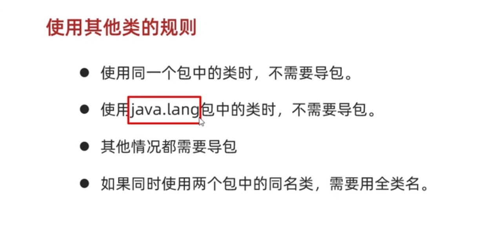

Java 内建的`package`机制是为了避免`class`命名冲突；

JDK 的核心类使用`java.lang`包，编译器会自动导入；

JDK 的其它常用类定义在`java.util.*`，`java.math.*`，`java.text.*`，……；

包名推荐使用倒置的域名，例如`org.apache`。


Java中共有三种变量，分别是类变量(也叫静态变量)、成员变量和局部变量。他们分别存放在JVM的方法区、堆内存和栈内存中。

```java
    /**
     * @author Hollis
     */
    public class Variables {
    
        /**
         * 类变量
         */
        private static int a;
    
        /**
         * 成员变量
         */
        private int b;
    
        /**
         * 局部变量
         * @param c
         */
        public void test(int c){
            int d;
        }
    }
```

下面我们来详细的去了解一下这些变量

# java中的变量

### 01、局部变量

在方法体内声明的变量被称为局部变量，该变量只能在该方法内使用，类中的其他方法并不知道该变量。来看下面这个示例：


```java
/**
 */
public class LocalVariable {
    public static void main(String[] args) {
        int a = 10;
        int b = 10;
        int c = a + b;
        System.out.println(c);
    }
}
```

其中 a、b、c 就是局部变量，它们只能在当前这个 main 方法中使用。

声明局部变量时的注意事项：

- 局部变量声明在方法、构造方法或者语句块中。
- 局部变量在方法、构造方法、或者语句块被执行的时候创建，当它们执行完成后，将会被销毁。
- 访问修饰符不能用于局部变量。
- 局部变量只在声明它的方法、构造方法或者语句块中可见。
- 局部变量是在栈上分配的。
- 局部变量没有默认值，所以局部变量被声明后，必须经过初始化，才可以使用。

### 02、成员变量

在类内部但在方法体外声明的变量称为成员变量，或者实例变量，或者字段。之所以称为实例变量，是因为该变量只能通过类的实例（对象）来访问。来看下面这个示例：


```java
/**
 */
public class InstanceVariable {
    int data = 88;
    public static void main(String[] args) {
        InstanceVariable iv = new InstanceVariable();
        System.out.println(iv.data); // 88
    }
}
```

其中 iv 是一个变量，它是一个引用类型的变量。`new` 关键字可以创建一个类的实例（也称为对象），通过“=”操作符赋值给 iv 这个变量，iv 就成了这个对象的引用，通过 `iv.data` 就可以访问成员变量了。

声明成员变量时的注意事项：

- 成员变量声明在一个类中，但在方法、构造方法和语句块之外。
- 当一个对象被实例化之后，每个成员变量的值就跟着确定。
- 成员变量在对象创建的时候创建，在对象被销毁的时候销毁。
- 成员变量的值应该至少被一个方法、构造方法或者语句块引用，使得外部能够通过这些方式获取实例变量信息。
- 成员变量可以声明在使用前或者使用后。
- 访问修饰符可以修饰成员变量。
- 成员变量对于类中的方法、构造方法或者语句块是可见的。一般情况下应该把成员变量设为私有。通过使用访问修饰符可以使成员变量对子类可见；成员变量具有默认值。数值型变量的默认值是 0，布尔型变量的默认值是 false，引用类型变量的默认值是 null。变量的值可以在声明时指定，也可以在构造方法中指定。

### 03、静态变量

通过 static 关键字声明的变量被称为静态变量（类变量），它可以直接被类访问，来看下面这个示例：


```java
/**
 */
public class StaticVariable {
    static int data = 99;
    public static void main(String[] args) {
        System.out.println(StaticVariable.data); // 99
    }
}
```

其中 data 就是静态变量，通过`类名.静态变量`就可以访问了，不需要创建类的实例。

声明静态变量时的注意事项：

- 静态变量在类中以 static 关键字声明，但必须在方法构造方法和语句块之外。
- 无论一个类创建了多少个对象，类只拥有静态变量的一份拷贝。
- 静态变量除了被声明为常量外很少使用。
- 静态变量储存在静态存储区。
- 静态变量在程序开始时创建，在程序结束时销毁。
- 与成员变量具有相似的可见性。但为了对类的使用者可见，大多数静态变量声明为 public 类型。
- 静态变量的默认值和实例变量相似。
- 静态变量还可以在静态语句块中初始化。

### 04、常量

在 Java 中，有些数据的值是不会发生改变的，这些数据被叫做常量——使用 final 关键字修饰的成员变量。常量的值一旦给定就无法改变！

常量在程序运行过程中主要有 2 个作用：

- 代表常数，便于修改（例如：圆周率的值，`final double PI = 3.14`）
- 增强程序的可读性（例如：常量 UP、DOWN 用来代表上和下，`final int UP = 0`）

Java 要求常量名必须大写。来看下面这个示例：


```java
/**
 */
public class FinalVariable {
    final String CHEN = "沉";
    static final String MO = "默";
    public static void main(String[] args) {
        FinalVariable fv = new FinalVariable();
        System.out.println(fv.CHEN);
        System.out.println(MO);
    }
}
```

# java中的方法

