# java语法基础

## 第一个java程序

首先要知道，java是面向对象设计的，所以，首先要引入下面几个概念：

- **对象**：对象是类的一个实例，有状态和行为。例如，一条狗是一个对象，它的状态有：颜色、名字、品种；行为有：摇尾巴、叫、吃等。

- **类**：类是一个模板，它描述一类对象的行为和状态。

- **方法**：方法就是行为，一个类可以有很多方法。逻辑运算、数据修改以及所有动作都是在方法中完成的。

- **实例变量**：每个对象都有独特的实例变量，对象的状态由这些实例变量的值决定。

  一般的，每一个语言的开始都是从Hello word开始，当然java也不例外。

  ```java
  public class Hello {
      public static void main(String[] args) {
          System.out.println("Hello, world!");
      }
  }
  ```

  这就是java的hello word 乍一看还是非常的麻烦的，但是如果详细的说明，其实也没那么麻烦了。下面就对这一行代码进行一个简单的解析。

  在一个Java程序中，你总能找到一个类似：

  ```java
  public class Hello {
      ...
  }
  ```

  的定义，这个定义被称为class（类），这里的类名是`Hello`，大小写敏感，`class`用来定义一个类，`public`表示这个类是公开的，`public`、`class`都是Java的关键字，必须小写，`Hello`是类的名字，按照习惯，首字母`H`要大写。而花括号`{}`中间则是类的定义。

  注意到类的定义中，我们定义了一个名为`main`的方法：

  ```java
      public static void main(String[] args) {
          ...
      }
  ```

  方法是可执行的代码块，一个方法除了方法名`main`，还有用`()`括起来的方法参数，这里的`main`方法有一个参数，参数类型是`String[]`，参数名是`args`，`public`、`static`用来修饰方法，这里表示它是一个公开的静态方法，`void`是方法的返回类型，而花括号`{}`中间的就是方法的代码。

  方法的代码每一行用`;`结束，这里只有一行代码，就是：

  ```java
          System.out.println("Hello, world!");
  ```

  它用来打印一个字符串到屏幕上。

  Java规定，某个类定义的`public static void main(String[] args)`是Java程序的固定入口方法，因此，Java程序总是从`main`方法开始执行。

  注意到Java源码的缩进不是必须的，但是用缩进后，格式好看，很容易看出代码块的开始和结束，缩进一般是4个空格或者一个tab。

  最后，当我们把代码保存为文件时，文件名必须是`Hello.java`，而且文件名也要注意大小写，因为要和我们定义的类名`Hello`完全保持一致。

  简单来说我们可以来看这个图

  

  之后我们在idea中点击运行就可以了。

  

这样，我们就书写完我们的第一个程序了。

这里就不讲如何用命令在控制台上做输出了，因为这本书主打的就是一个快速入门，所以一些不重要，或者是已经被淘汰的东西，我这里就不做介绍了。

## 基本语法

编写 Java 程序时，应注意以下几点：

- **大小写敏感**：Java 是大小写敏感的，这就意味着标识符 Hello 与 hello 是不同的。
- **类名**：对于所有的类来说，类名的首字母应该大写。如果类名由若干单词组成，那么每个单词的首字母应该大写，例如 **MyFirstJavaClass** 。
- **方法名**：所有的方法名都应该以小写字母开头。如果方法名含有若干单词，则后面的每个单词首字母大写。
- **源文件名**：源文件名必须和类名相同。当保存文件的时候，你应该使用类名作为文件名保存（切记 Java 是大小写敏感的），文件名的后缀为 **.java**。（如果文件名和类名不相同则会导致编译错误）。
- **主方法入口**：所有的 Java 程序由 **public static void main(String[] args)** 方法开始执行。

## java标识符

Java 所有的组成部分都需要名字。类名、变量名以及方法名都被称为标识符。

关于 Java 标识符，有以下几点需要注意：

- 所有的标识符都应该以字母（A-Z 或者 a-z）,美元符（$）、或者下划线（_）开始
- 首字符之后可以是字母（A-Z 或者 a-z）,美元符（$）、下划线（_）或数字的任何字符组合
- 关键字不能用作标识符
- 标识符是大小写敏感的
- 合法标识符举例：age、$salary、_value、__1_value
- 非法标识符举例：123abc、-salary

## java修饰符

像其他语言一样，Java可以使用修饰符来修饰类中方法和属性。主要有两类修饰符：

- 访问控制修饰符 : default, public , protected, private
- 非访问控制修饰符 : final, abstract, static, synchronized

## java变量

什么是变量？

变量就是初中数学的代数的概念，例如一个简单的方程，x，y都是变量。

在Java中，变量分为两种：基本类型的变量和引用类型的变量。

我们先讨论基本类型的变量。

在Java中，变量必须先定义后使用，在定义变量的时候，可以给它一个初始值。例如：

```
int x = 1;
```

上述语句定义了一个整型`int`类型的变量，名称为`x`，初始值为`1`。

不写初始值，就相当于给它指定了默认值。默认值总是`0`。

来看一个完整的定义变量，然后打印变量值的例子：

```java
public class Main {
    public static void main(String[] args) {
        int x = 100; // 定义int类型变量x，并赋予初始值100
        System.out.println(x); // 打印该变量的值
    }
}

```

变量的一个重要特点是可以重新赋值。例如，对变量`x`，先赋值`100`，再赋值`200`，观察两次打印的结果：

```java
public class Main {
    public static void main(String[] args) {
        int x = 100; // 定义int类型变量x，并赋予初始值100
        System.out.println(x); // 打印该变量的值，观察是否为100
        x = 200; // 重新赋值为200
        System.out.println(x); // 打印该变量的值，观察是否为200
    }
}

```

注意到第一次定义变量`x`的时候，需要指定变量类型`int`，因此使用语句`int x = 100;`。而第二次重新赋值的时候，变量`x`已经存在了，不能再重复定义，因此不能指定变量类型`int`，必须使用语句`x = 200;`。

变量不但可以重新赋值，还可以赋值给其他变量。让我们来看一个例子：

```java
public class Main {
    public static void main(String[] args) {
        int n = 100; // 定义变量n，同时赋值为100
        System.out.println("n = " + n); // 打印n的值

        n = 200; // 变量n赋值为200
        System.out.println("n = " + n); // 打印n的值

        int x = n; // 变量x赋值为n（n的值为200，因此赋值后x的值也是200）
        System.out.println("x = " + x); // 打印x的值

        x = x + 100; // 变量x赋值为x+100（x的值为200，因此赋值后x的值是200+100=300）
        System.out.println("x = " + x); // 打印x的值
        System.out.println("n = " + n); // 再次打印n的值，n应该是200还是300？
   }
}
```

我们一行一行地分析代码执行流程：

执行`int n = 100;`，该语句定义了变量`n`，同时赋值为`100`，因此，JVM在内存中为变量`n`分配一个“存储单元”，填入值`100`：

```ascii
      n
      │
      ▼
┌───┬───┬───┬───┬───┬───┬───┐
│   │100│   │   │   │   │   │
└───┴───┴───┴───┴───┴───┴───┘
```

执行`n = 200;`时，JVM把`200`写入变量`n`的存储单元，因此，原有的值被覆盖，现在`n`的值为`200`：

```ascii
      n
      │
      ▼
┌───┬───┬───┬───┬───┬───┬───┐
│   │200│   │   │   │   │   │
└───┴───┴───┴───┴───┴───┴───┘
```

执行`int x = n;`时，定义了一个新的变量`x`，同时对`x`赋值，因此，JVM需要*新分配*一个存储单元给变量`x`，并写入和变量`n`一样的值，结果是变量`x`的值也变为`200`：

```ascii
      n           x
      │           │
      ▼           ▼
┌───┬───┬───┬───┬───┬───┬───┐
│   │200│   │   │200│   │   │
└───┴───┴───┴───┴───┴───┴───┘
```

执行`x = x + 100;`时，JVM首先计算等式右边的值`x + 100`，结果为`300`（因为此刻`x`的值为`200`），然后，将结果`300`写入`x`的存储单元，因此，变量`x`最终的值变为`300`：

```ascii
      n           x
      │           │
      ▼           ▼
┌───┬───┬───┬───┬───┬───┬───┐
│   │200│   │   │300│   │   │
└───┴───┴───┴───┴───┴───┴───┘
```

可见，变量可以反复赋值。注意，等号`=`是赋值语句，不是数学意义上的相等，否则无法解释`x = x + 100`。

Java 中主要有如下几种类型的变量

- 局部变量
- 类变量（静态变量）
- 成员变量（非静态变量）

下面我们就来对一个变量的例题进行练习。题目非常的简单，就是一个关于公交车上下车的问题。

```java
/**
 * 〈功能概述〉<br>
 *题目如下：一开始公交车上没有乘客。
 * 第一站：上去一个乘客
 * 第二站：上去俩位乘客，下来一个乘客。
 * 第三站：上去俩位乘客，下来一个乘客。
 * 第四站：下来一位乘客
 * 第五站：上来一位乘客
 * 问题：到了终点站，车上一共几位乘客
 * @author:Lenovo
 * @date: 2022/11/19 20:37
 */
public class 变量练习之计算公交车的人数 {
    public static void main(String[] args){
        int count=0;
        count=count+1;
        count=count+2-1;
        count=count+2-1;
        count=count-1;
        count=count+1;
        System.out.println(count);

    }
}
```


## java关键字

Java有一组关键字，这些关键字是保留字，不能用作变量、方法、类或任何其他标识符。关键字就是系统指定的，不需要我们去定义的一些东西。

他一共有下面这几种

| 类别                 | 关键字                         | 说明                 |
| :------------------- | :----------------------------- | :------------------- |
| 访问控制             | private                        | 私有的               |
| protected            | 受保护的                       |                      |
| public               | 公共的                         |                      |
| default              | 默认                           |                      |
| 类、方法和变量修饰符 | abstract                       | 声明抽象             |
| class                | 类                             |                      |
| extends              | 扩充、继承                     |                      |
| final                | 最终值、不可改变的             |                      |
| implements           | 实现（接口）                   |                      |
| interface            | 接口                           |                      |
| native               | 本地、原生方法（非 Java 实现） |                      |
| new                  | 创建                           |                      |
| static               | 静态                           |                      |
| strictfp             | 严格浮点、精准浮点             |                      |
| synchronized         | 线程、同步                     |                      |
| transient            | 短暂                           |                      |
| volatile             | 易失                           |                      |
| 程序控制语句         | break                          | 跳出循环             |
| case                 | 定义一个值以供 switch 选择     |                      |
| continue             | 继续                           |                      |
| do                   | 运行                           |                      |
| else                 | 否则                           |                      |
| for                  | 循环                           |                      |
| if                   | 如果                           |                      |
| instanceof           | 实例                           |                      |
| return               | 返回                           |                      |
| switch               | 根据值选择执行                 |                      |
| while                | 循环                           |                      |
| 错误处理             | assert                         | 断言表达式是否为真   |
| catch                | 捕捉异常                       |                      |
| finally              | 有没有异常都执行               |                      |
| throw                | 抛出一个异常对象               |                      |
| throws               | 声明一个异常可能被抛出         |                      |
| try                  | 捕获异常                       |                      |
| 包相关               | import                         | 引入                 |
| package              | 包                             |                      |
| 基本类型             | boolean                        | 布尔型               |
| byte                 | 字节型                         |                      |
| char                 | 字符型                         |                      |
| double               | 双精度浮点                     |                      |
| float                | 单精度浮点                     |                      |
| int                  | 整型                           |                      |
| long                 | 长整型                         |                      |
| short                | 短整型                         |                      |
| 变量引用             | super                          | 父类、超类           |
| this                 | 本类                           |                      |
| void                 | 无返回值                       |                      |
| 保留关键字           | goto                           | 是关键字，但不能使用 |
| const                | 是关键字，但不能使用           |                      |

**注意：**Java 的 null 不是关键字，类似于 true 和 false，它是一个字面常量，不允许作为标识符使用。

这里将对关键字进行一个介绍，这里没听懂也没关系，只是方便后续去查看的。

**1、abstract：** 用于声明抽象类，以及抽象方法。

```java
abstract class Animal {
    abstract void makeSound();

    public void sleep() {
        System.out.println("The animal is sleeping.");
    }
}

class Dog extends Animal {
    void makeSound() {
        System.out.println("The dog barks.");
    }
}

```

在这个示例中，我们创建了一个名为 Animal 的抽象类，其中包含一个抽象方法 `makeSound()` 和一个具体方法 `sleep()`。

**2、boolean：** Java 中的一种基本数据类型，表示布尔值，即真（true）或假（false）。boolean 数据类型常用于判断条件、循环控制和逻辑运算等场景。

```java
boolean isStudent = true;

if (isStudent) {
    System.out.println("This person is a student.");
} else {
    System.out.println("This person is not a student.");
}

```

在这个示例中，我们定义了一个 boolean 变量：isStudent。通过 if 语句，我们可以根据这些变量的值进行不同的操作。

**3、break：** 用于跳出循环结构（如 for、while 和 do-while 循环）或 switch 语句。当遇到 break 语句时，程序将立即跳出当前循环或 switch 语句，继续执行紧跟在循环或 switch 语句后面的代码。

```java
for (int i = 0; i < 10; i++) {
    if (i == 5) {
        break;
    }
    System.out.println("i: " + i);
}
System.out.println("Loop ended.");
```

在这个示例中，我们使用 for 循环遍历 0 到 9 的整数。当 i 等于 5 时，我们使用 break 语句跳出循环。

**4、byte：** 用于表示一个 8 位（1 字节）有符号整数。它的值范围是 -128（-2^7）到 127（2^7 - 1）。

由于 byte 类型占用的空间较小，它通常用于处理大量的数据，如文件读写、网络传输等场景，以节省内存空间。

```java
byte minByte = -128;
byte maxByte = 127;
```

在这个示例中，我们声明了三个 byte 类型的变量：minByte、maxByte，并分别赋予了不同的值。

**5、case：** 通常与 switch 语句一起使用。switch 语句允许根据某个变量的值来选择执行不同的代码块。在 switch 语句中，case 用于标识每个可能的值和对应的代码块。

例子我们直接放到 switch 中一起讲。

**6、catch：** 用于捕获 try 语句中的异常。在 try 块中可能会抛出异常，而在 catch 块中可以捕获这些异常并进行处理。catch 块可以有多个，每个 catch 块可以捕获特定类型的异常。在 catch 块中，可以根据需要进行异常处理，例如输出错误信息、进行日志记录、恢复程序状态等。

```java
try {
    int num = Integer.parseInt("abc");
} catch (NumberFormatException e) {
    System.out.println("Invalid number format");
}
```

这个程序使用 try-catch 语句捕获 NumberFormatException 异常。在 try 块中，尝试将字符串 "abc" 转换为整数类型，由于这个字符串不是有效的数字格式，将会抛出 NumberFormatException 异常。在 catch 块中，捕获到了这个异常，并输出一条错误信息。

**7、char：** 用于声明一个字符类型的变量。char 类型的变量可以存储任意的Unicode 字符，可以使用单引号将字符括起来来表示。

```java
char c = 'A';
```

这个程序创建了一个 char 类型的变量 c，并将其赋值为大写字母 A。

**8、class：** 用于声明一个类。


```java
public class Person {
    private String name;
    private int age;

    public Person(String name, int age) {
        this.name = name;
        this.age = age;
    }

    public void sayHello() {
        System.out.println("Hello, my name is " + name + " and I am " + age + " years old.");
    }
}
```

**9、continue：** 用于继续下一个循环，可以在指定条件下跳过其余代码。


```java
for (int i = 1; i <= 10; i++) {
    if (i % 2 == 0) {
        continue;
    }
    System.out.println(i);
}
```

**10、default：** 用于指定 switch 语句中除去 case 条件之外的默认代码块。这个我们放到 switch 里一起演示。

**11、do：** 通常和 while 关键字配合使用，do 后紧跟循环体。


```java
int i = 1;
do {
    System.out.println(i);
    i++;
} while (i <= 10);
```

do-while 循环与 while 循环类似，不同之处在于 do-while 循环会先执行循环体中的代码，然后再检查循环条件。因此，do-while 循环至少会执行一次循环体中的代码。

**12、double：** 用于声明一个双精度浮点类型的变量。


```java
double a = 3.14;
double b = 2.0;
double c = a + b;
```

**13、else：** 用于指示 if 语句中的备用分支。


```java
int score = 75;
if (score >= 60) {
    System.out.println("及格了");
} else {
    System.out.println("挂科了");
}
```

**14、enum：** 用于定义一组固定的常量枚举。


```java
public enum PlayerType {
    TENNIS,
    FOOTBALL,
    BASKETBALL
}
```

**15、extends：** 用于指示一个类是从另一个类或接口继承的。


```java
class Animal {
    public void eat() {
        System.out.println("动物正在吃东西");
    }
}

class Dog extends Animal {
    public void bark() {
        System.out.println("狗在汪汪叫");
    }
}

public class ExtendsDemo {
    public static void main(String[] args) {
        Dog dog = new Dog();
        dog.eat();
        dog.bark();
    }
}
```

Animal 类中有一个 `eat()` 方法，输出字符串 "动物正在吃东西"。Dog 类继承自 Animal 类，并定义了一个 `bark()` 方法，输出字符串 "狗在汪汪叫"。

**16、final：** 用于表示某个变量、方法或类是最终的，不能被修改或继承。

①、final 变量：表示一个常量，一旦被赋值，其值就不能再被修改。这在声明不可变的值时非常有用。


```java
final double PI = 3.14159265359;
```

②、final 方法表示一个不能被子类重写的方法。这在设计类时，确保某个方法的实现不会被子类修改时非常有用。


```java
class Animal {
    final void makeSound() {
        System.out.println("动物发出声音.");
    }
}

class Dog extends Animal {
    // 错误: 无法覆盖来自 Animal 的 final 方法
    // void makeSound() {
    //     System.out.println("狗吠叫.");
    // }
}

public class Main {
    public static void main(String[] args) {
        Dog dog = new Dog();
        dog.makeSound();
    }
}
```

③、final 类表示一个不能被继承的类。这在设计类时，确保其不会被其他类继承时非常有用。String 类就是 final 的。


```java
final class Animal {
    void makeSound() {
        System.out.println("动物发出声音.");
    }
}

// 错误: 类型 Dog 无法继承 final 类 Animal
// class Dog extends Animal {
//     void makeSound() {
//         System.out.println("狗吠叫.");
//     }
// }

public class Main {
    public static void main(String[] args) {
        Animal animal = new Animal();
        animal.makeSound();
    }
}
```

**17、finally：** 和 `try-catch` 配合使用，表示无论是否处理异常，总是执行 finally 块中的代码。


```java
try {
    int x = 10 / 0;  // 抛出异常
} catch (Exception e) {
    System.out.println("发生了异常：" + e.getMessage());
} finally {
    System.out.println("finally 块被执行");
}
```

**18、float：** 表示单精度浮点数。


```java
float f1 = 3.14f;   // 注意要在数字后面加上 f 表示这是一个 float 类型
float f2 = 1.23e-4f;   // 科学计数法表示小数
```

在 Java 中，浮点数默认是 double 类型，如果要使用 float 类型的数据，需要在数字后面加上一个 f 或者 F，表示这是一个 float 类型的字面量。另外，也可以使用科学计数法表示浮点数，例如 1.23e-4 表示 0.000123。

**19、for：** 用于声明一个 for 循环，如果循环次数是固定的，建议使用 for 循环。


```java
int[] arr = {1, 2, 3, 4, 5};
for (int i = 0; i < arr.length; i++) {
    System.out.println("arr[" + i + "] = " + arr[i]);
}
```

**20、if：** 用于指定条件，如果条件为真，则执行对应代码。


```java
int n = -3;
if (n > 0) {
    System.out.println(n + " 是正数");
} else if (n < 0) {
    System.out.println(n + " 是负数");
} else {
    System.out.println(n + " 是零");
}
```

**21、implements：** 用于实现接口。

下面是一个实现了 Runnable 接口的类的示例：


```java
public class MyThread implements Runnable {
    public void run() {
        // 线程执行的代码
    }
}
```

**22、import：** 用于导入对应的类或者接口。例如，如果要使用 Java 标准库中的 ArrayList 类，可以这样写：


```java
import java.util.ArrayList;
```

**23、instanceof：** 用于判断对象是否属于某个类型（class )。


```java
例如，假设有一个 Person 类和一个 Student 类，Student 类继承自 Person 类，可以使用 instanceof 运算符来判断一个对象是否为 Person 类或其子类的实例：
Person p = new Student();
if (p instanceof Person) {
    System.out.println("p is an instance of Person");
}
if (p instanceof Student) {
    System.out.println("p is an instance of Student");
}
```

**24、int：** 用于表示整数值。


```java
int x;           // 声明一个 int 类型的变量 x
x = 10;          // 将整数值 10 赋给变量 x
int y = 20;     // 声明并初始化一个 int 类型的变量 y，赋值为整数值 20
```

**25、interface：** 用于声明接口。会定义一组方法的签名（即方法名、参数列表和返回值类型），但没有方法体。其他类可以实现接口，并提供方法的具体实现。


```java
public interface MyInterface {
    void method1();
    int method2(String param);
}
```

**26、long：** 用于表示长整数值。


```java
long x;           // 声明一个 long 类型的变量 x
x = 10000000000L; // 将长整数值 10000000000 赋给变量 x，需要在数字后面加上 L 或 l 表示这是一个 long 类型的值
long y = 20000000000L; // 声明并初始化一个 long 类型的变量 y，赋值为长整数值 20000000000
```

**27、native：** 用于声明一个本地方法，本地方法是指在 Java 代码中声明但在本地代码（通常是 C 或 C++ 代码）中实现的方法，它通常用于与操作系统或其他本地库进行交互。


```java
public native void nativeMethod();
```

**28、new：** 用于创建一个新的对象。

以下是使用 new 关键字创建对象实例的基本语法：


```java
ClassName obj = new ClassName();
```

以下是使用 new 关键字创建数组实例的基本语法：


```java
int[] arr = new int[10];
```

**29、null：** 如果一个变量是空的（什么引用也没有指向），就可以将它赋值为 null，和空指针异常息息相关。


```java
String str = null; // 声明一个字符串引用，初始化为 null
MyClass obj = null; // 声明一个 MyClass 类型的引用，初始化为 null
```

**30、package：** 用于声明类所在的包。


```java
package com.example.mypackage;
```

**31、private：** 一个访问权限修饰符，表示方法或变量只对当前类可见。


```java
public class MyClass {
    private int x; // 私有属性 x，只能在当前类的内部访问

    private void foo() {
        // 私有方法 foo，只能在当前类的内部调用
    }
}
```

在这个示例中，MyClass 类有一个私有属性 x 和一个私有方法 `foo()`。这些成员只能在 MyClass 类的内部访问和调用，对其他类不可见。

**32、protected：** 一个访问权限修饰符，表示方法或变量对同一包内的类和所有子类可见。


```java
package com.example.mypackage;

public class MyBaseClass {
    protected int x; // 受保护的属性 x，可以被子类和同一包中的其他类访问

    protected void foo() {
        // 受保护的方法 foo，可以被子类和同一包中的其他类调用
    }
}

package com.example.mypackage;

public class MySubClass extends MyBaseClass {
    public void bar() {
        x = 10; // 可以访问 MyBaseClass 中的受保护属性 x
        foo(); // 可以调用 MyBaseClass 中的受保护方法 foo
    }
}
```

在这个示例中，MyBaseClass 类有一个受保护的属性 x 和一个受保护的方法 `foo()`。这些成员可以被子类和同一包中的其他类访问和调用。MySubClass 类继承自 MyBaseClass 类，并可以访问和修改 MyBaseClass 中的受保护成员。

**33、public：** 一个访问权限修饰符，除了可以声明方法和变量（所有类可见），还可以声明类。`main()` 方法必须声明为 public。


```java
public class MyClass {
    public int x; // 公有属性 x，可以被任何类访问

    public void foo() {
        // 公有方法 foo，可以被任何类调用
    }
}
```

在这个示例中，MyClass 类有一个公有属性 x 和一个公有方法 `foo()`。这些成员可以被任何类访问和调用，无论这些类是否在同一个包中。

**35、return：** 用于从方法中返回一个值或终止方法的执行。return 语句可以将方法的计算结果返回给调用者，或者在方法执行到某个特定条件时提前结束方法。


```java
public int add(int a, int b) {
    int sum = a + b;
    return sum; // 返回 sum 的值，并结束方法的执行
}
```

此外，return 语句还可以用于提前结束方法的执行。例如，假设我们要编写一个方法，用于判断一个整数是否为偶数：


```java
public static boolean isEven(int number) {
    if (number % 2 == 0) {
        return true;
    }
    return false;
}
```

在这个示例中，我们定义了一个名为 isEven 的方法，该方法接收一个整数参数 number。如果 number 是偶数，我们使用 return 语句提前返回 true。否则，方法执行将继续，最后返回 false。

**36、short：** 用于表示短整数，占用 2 个字节（16 位）的内存空间。


```java
short x = 10; // 声明一个 short 类型的变量 x，赋值为 10
short y = 20; // 声明一个 short 类型的变量 y，赋值为 20
```

**37、static：** 表示该变量或方法是静态变量或静态方法。


```java
public class MyClass {
    public static int x; // 静态变量 x，属于类的成员

    public static void foo() {
        // 静态方法 foo，属于类的成员
    }
}
```

在这个示例中，MyClass 类有一个静态变量 x 和一个静态方法 `foo()`。这些成员属于类的成员，可以通过类名直接访问，不需要创建对象。

**38、strictfp（strict floating-point）：** 并不常见，通常用于修饰一个方法，用于限制浮点数计算的精度和舍入行为。当你在类、接口或方法上使用 strictfp 时，该范围内的所有浮点数计算将遵循 IEEE 754 标准的规定，以确保跨平台的浮点数计算的一致性。

不同的硬件平台和 JVM 实现可能对浮点数计算的精度和舍入行为有差异，这可能导致在不同环境中运行相同的浮点数计算代码产生不同的结果。使用 strictfp 关键字可以确保在所有平台上获得相同的浮点数计算结果，避免计算结果的不一致问题。

但请注意，使用 strictfp 可能会对性能产生影响，因为可能需要更多的计算和转换来确保遵循 IEEE 754 标准。因此，在使用 strictfp 时，需要权衡精度和一致性与性能之间的关系。


```java
public strictfp class MyClass {
    public static void main(String[] args) {
        double a = 0.1;
        double b = 0.2;
        double result = a + b;
        System.out.println("Result: " + result);
    }
}
```

输出：


```text
Result: 0.30000000000000004
```

在这个示例中，MyClass 类被声明为 strictfp，因此类中的所有浮点数计算都将遵循 IEEE 754 标准。

在大多数现代操作系统上，使用 strictfp 可能不会产生显著差异，因为大家都遵循 IEEE 754 标准，除非是一些较旧的硬件平台。

IEEE 754 标准（IEEE Standard for Floating-Point Arithmetic）是一个定义浮点数表示和运算的国际标准。由国际电气和电子工程师协会（IEEE）制定，首次发布于1985年。

IEEE 754 标准主要规定了以下几个方面：

浮点数表示：标准定义了两种浮点数格式，单精度（32位）和双精度（64位）。这两种格式分别由符号位、指数位和尾数位组成，用于表示浮点数的大小和精度。

四舍五入和舍入模式：标准定义了多种舍入模式，例如向最接近的数舍入（Round to Nearest, Ties to Even）、向零舍入（Round toward Zero）、向正无穷舍入（Round toward +∞）和向负无穷舍入（Round toward -∞）等。这些模式指导了浮点数计算过程中如何处理精度损失和舍入误差。

特殊值：标准定义了一些特殊的浮点数值，如正无穷（+∞）、负无穷（-∞）和非数值（NaN）。这些特殊值用于表示浮点数计算中可能出现的溢出、下溢和未定义结果等情况。

浮点数运算：标准规定了浮点数的基本运算（加、减、乘、除）和比较运算（等于、不等于、大于、小于、大于等于、小于等于）的行为和结果。这些运算需要遵循标准中规定的表示、舍入和特殊值处理规则。

来看示例


```java
public class Ieee754Demo {

    public static void main(String[] args) {
        float a = 0.1f;
        float b = 0.2f;
        float c = a + b;

        System.out.println("a = " + a);
        System.out.println("b = " + b);
        System.out.println("c = a + b = " + c);

        double x = 1.0 / 0.0;
        double y = -1.0 / 0.0;
        double z = 0.0 / 0.0;

        System.out.println("x = 1.0 / 0.0 = " + x);
        System.out.println("y = -1.0 / 0.0 = " + y);
        System.out.println("z = 0.0 / 0.0 = " + z);
    }
}
```

输出结果：

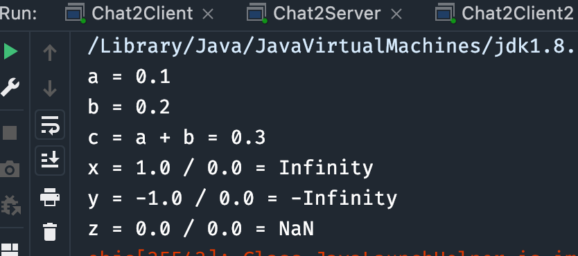

我们可以看到 IEEE 754 标准中的浮点数表示和运算：

- 单精度浮点数的加法：变量 a 和 b 分别存储了 0.1 和 0.2，它们的和 c 等于 0.3。由于浮点数表示的精度限制，c 的实际值可能与理论值略有误差。
- 特殊值：变量 x、y 和 z 分别存储了正无穷（+∞）、负无穷（-∞）和非数值（NaN）。这些特殊值是由除法运算产生的，当被除数为 0 或结果无法表示时，会返回相应的特殊值。

**39、super：** 可用于调用父类的方法或者字段。


```java
class Animal {
    protected String name;

    public Animal(String name) {
        this.name = name;
    }

    public void eat() {
        System.out.println(name + " is eating.");
    }
}

public class Dog extends Animal {
    public Dog(String name) {
        super(name); // 调用父类的构造方法
    }

    public void bark() {
        System.out.println(name + " is barking.");
    }

    public void eat() {
        super.eat(); // 调用父类的方法
        System.out.println(name + " is eating bones.");
    }
}
```

**40、switch：** 用于根据某个变量的值选择执行不同的代码块。switch 语句通常与 case 和 default 一起使用。每个 case 子句表示一个可能的值和对应的代码块，而 default 子句用于处理不在 case 子句中的值。


```java
public class Main {
    public static void main(String[] args) {
        int dayOfWeek = 3;

        switch (dayOfWeek) {
            case 1:
                System.out.println("Monday");
                break;
            case 2:
                System.out.println("Tuesday");
                break;
            case 3:
                System.out.println("Wednesday");
                break;
            case 4:
                System.out.println("Thursday");
                break;
            case 5:
                System.out.println("Friday");
                break;
            case 6:
                System.out.println("Saturday");
                break;
            case 7:
                System.out.println("Sunday");
                break;
            default:
                System.out.println("Invalid day");
                break;
        }
    }
}
```

在这个示例中，我们定义了一个名为 dayOfWeek 的整数变量，并赋予了一个值。然后，我们使用 switch 语句根据 dayOfWeek 的值来输出对应的星期几。每个 case 子句表示 dayOfWeek 可能的值，后面紧跟着要执行的代码。使用 break 语句跳出 switch 语句，避免执行其他 case 子句的代码。如果 dayOfWeek 的值不在 case 子句中，default 子句将被执行。

**41、synchronized：** 用于指定多线程代码中的同步方法、变量或者代码块。


```java
public class MyClass {
    private int count;

    public synchronized void increment() {
        count++; // 同步方法
    }

    public void doSomething() {
        synchronized(this) { // 同步代码块
            // 执行一些需要同步的操作
        }
    }
}
```

**42、this：** 可用于在方法或构造方法中引用当前对象。


```java
public class MyClass {
    private int num;

    public MyClass(int num) {
        this.num = num; // 使用 this 关键字引用当前对象的成员变量
    }

    public void doSomething() {
        System.out.println("Doing something with " + this.num); // 使用 this 关键字引用当前对象的成员变量
    }

    public MyClass getThis() {
        return this; // 返回当前对象本身
    }
}
```

在这个示例中，MyClass 类有一个私有成员变量 num，并定义了一个构造方法、一个方法和一个返回当前对象的方法。在构造方法中，使用 this 关键字引用当前对象的成员变量，并将传入的参数赋值给该成员变量。在方法 `doSomething()` 中，使用 this 关键字引用当前对象的成员变量，并输出该成员变量的值。在方法 `getThis()` 中，直接返回当前对象本身。

**43、throw：** 主动抛出异常。


```java
public class MyClass {
    public void doSomething(int num) throws Exception {
        if (num < 0) {
            throw new Exception("num must be greater than zero"); // 手动抛出异常
        }
        // 执行一些操作
    }
}
```

**44、throws：** 用于声明异常。


```java
public class MyClass {
    public void doSomething(int num) throws Exception {
        if (num < 0) {
            throw new Exception("num must be greater than zero"); // 手动抛出异常
        }
        // 执行一些操作
    }
}
```

**45、transient：** 修饰的字段不会被序列化。


```java
public class MyClass implements Serializable {
    private int id;
    private String name;
    private transient String password;

    public MyClass(int id, String name, String password) {
        this.id = id;
        this.name = name;
        this.password = password;
    }

    // 省略 getter 和 setter 方法

    @Override
    public String toString() {
        return "MyClass{" +
                "id=" + id +
                ", name='" + name + '\'' +
                ", password='" + password + '\'' +
                '}';
    }
}
```

在这个示例中，MyClass 类实现了 Serializable 接口，表示该类的对象可以被序列化。该类有三个成员变量，分别是 id、name 和 password。其中，password 成员变量被标记为 transient，表示在序列化过程中忽略这个成员变量。

**45、try：** 用于包裹要捕获异常的代码块。


```java
try {
    // 可能抛出异常的代码
    int result = 1 / 0;
} catch (Exception e) {
    // 异常处理代码
    e.printStackTrace();
}
```

**46、void：** 用于指定方法没有返回值。


```java
public void doSomething() {
    // 方法体
}
```

**47、volatile：** 保证不同线程对它修饰的变量进行操作时的可见性，即一个线程修改了某个变量的值，新值对其他线程来说是立即可见的。


```java
public class MyThread extends Thread {
    private volatile boolean running = true;

    @Override
    public void run() {
        while (running) {
            // 线程执行的代码
        }
    }

    public void stopThread() {
        running = false;
    }
}
```

在这个示例中，MyThread 类继承了 Thread 类，重写了 `run()` 方法。MyThread 类有一个成员变量 running，被标记为 volatile，表示这个变量是共享的，可能会被多个线程同时访问。在 `run()` 方法中，使用 while 循环检查 running 变量的值，如果 running 为 true，就继续执行循环体中的代码。在另一个方法 `stopThread()` 中，将 running 变量的值设置为 false，表示需要停止线程。

**48、while：** 如果循环次数不固定，建议使用 while 循环。


```java
int i = 0;
while (i < 10) {
    System.out.println(i);
    i++;
}
```

“除了这些关键字，Java 中还有两个非常特殊的保留字（goto 和 const），它们不能在程序中使用。”

“goto 在 C语言中叫做‘无限跳转’语句，在 Java 中，不再使用 goto 语句，因为无限跳转会破坏程序结构。”

Java 中确实可以使用标签（label）与 break 和 continue 语句结合来实现类似 goto 的跳转功能。以下是一个简单的示例：


```java
public class LabelDemo {
    public static void main(String[] args) {
        outerLoop:
        for (int i = 0; i < 3; i++) {
            for (int j = 0; j < 3; j++) {
                if (i == 1 && j == 1) {
                    System.out.println("跳过 outerLoop 中的当前迭代");
                    continue outerLoop;
                }
                System.out.println("i: " + i + ", j: " + j);
            }
        }
        System.out.println("结束");
    }
}
```

在这个示例中，我们使用了两层嵌套循环。外层循环有一个名为 outerLoop 的标签。当 i 等于 1 且 j 等于 1 时，我们使用 continue outerLoop 语句跳过外层循环中的当前迭代。这与 goto 的行为类似。

来看输出结果：


```text
i: 0, j: 0
i: 0, j: 1
i: 0, j: 2
i: 1, j: 0
跳过 outerLoop 中的当前迭代
i: 2, j: 0
i: 2, j: 1
i: 2, j: 2
结束
```

尽管可以使用标签实现类似 goto 的跳转功能，但这种用法在 Java 中仍然较少见，因为过度使用可能导致代码难以理解和维护。通常建议尽可能使用其他控制结构（如 if、for 和 while 语句）来组织代码。

以下是一个使用 if 和 for 语句替代标签跳转的示例。在这个示例中，我们使用了一个布尔变量 skipIteration 来决定是否跳过外层循环的当前迭代：


```java
public class IfForDemo {
    public static void main(String[] args) {
        for (int i = 0; i < 3; i++) {
            boolean skipIteration = false;
            for (int j = 0; j < 3; j++) {
                if (i == 1 && j == 1) {
                    System.out.println("跳过外层循环中的当前迭代");
                    skipIteration = true;
                    break;
                }
                System.out.println("i: " + i + ", j: " + j);
            }
            if (skipIteration) {
                continue;
            }
        }
    }
}
```

在这个示例中，当 i 等于 1 且 j 等于 1 时，我们将 skipIteration 设置为 true，然后使用 break 语句跳出内层循环。在外层循环中，我们检查 skipIteration 变量的值，如果为 true，则跳过外层循环的当前迭代。

这个示例的输出结果与之前的示例相同：


```text
i: 0, j: 0
i: 0, j: 1
i: 0, j: 2
i: 1, j: 0
跳过外层循环中的当前迭代
i: 2, j: 0
i: 2, j: 1
i: 2, j: 2
```

“const 在 C语言中是声明常量的关键字，在 Java 中可以使用 public static final 三个关键字的组合来达到常量的效果。”


```java
public class Circle {
    public static final double PI = 3.14159;

    public static double calculateArea(double radius) {
        return PI * radius * radius;
    }
}
```

在这个示例中，我们使用 public static final 关键字组合定义了一个名为 PI 的常量。因为它是 public 的，所以其他类可以访问这个常量。因为它是 static 的，所以它与类关联，而不是类的实例。因为它是 final 的，所以它的值不能被更改。

之后我们详细介绍俩个常用的关键字

### final

**1. 数据**

声明数据为常量，可以是编译时常量，也可以是在运行时被初始化后不能被改变的常量。

- 对于基本类型，final 使数值不变；
- 对于引用类型，final 使引用不变，也就不能引用其它对象，但是被引用的对象本身是可以修改的。

```java
final int x = 1;
// x = 2;  // cannot assign value to final variable 'x'
final A y = new A();
y.a = 1;
```

**2. 方法**

声明方法不能被子类重写。

private 方法隐式地被指定为 final，如果在子类中定义的方法和基类中的一个 private 方法签名相同，此时子类的方法不是重写基类方法，而是在子类中定义了一个新的方法。

**3. 类**

声明类不允许被继承。

### static

**1. 静态变量**

- 静态变量：又称为类变量，也就是说这个变量属于类的，类所有的实例都共享静态变量，可以直接通过类名来访问它。静态变量在内存中只存在一份。
- 实例变量：每创建一个实例就会产生一个实例变量，它与该实例同生共死。

```java
public class A {

    private int x;         // 实例变量
    private static int y;  // 静态变量

    public static void main(String[] args) {
        // int x = A.x;  // Non-static field 'x' cannot be referenced from a static context
        A a = new A();
        int x = a.x;
        int y = A.y;
    }
}
```

**2. 静态方法**

静态方法在类加载的时候就存在了，它不依赖于任何实例。所以静态方法必须有实现，也就是说它不能是抽象方法。

```java
public abstract class A {
    public static void func1(){
    }
    // public abstract static void func2();  // Illegal combination of modifiers: 'abstract' and 'static'
}
```

只能访问所属类的静态字段和静态方法，方法中不能有 this 和 super 关键字，因为这两个关键字与具体对象关联。

```java
public class A {

    private static int x;
    private int y;

    public static void func1(){
        int a = x;
        // int b = y;  // Non-static field 'y' cannot be referenced from a static context
        // int b = this.y;     // 'A.this' cannot be referenced from a static context
    }
}
```

**3. 静态语句块**

静态语句块在类初始化时运行一次。

```java
public class A {
    static {
        System.out.println("123");
    }

    public static void main(String[] args) {
        A a1 = new A();
        A a2 = new A();
    }
}
123
```

**4. 静态内部类**

非静态内部类依赖于外部类的实例，也就是说需要先创建外部类实例，才能用这个实例去创建非静态内部类。而静态内部类不需要。

```java
public class OuterClass {

    class InnerClass {
    }

    static class StaticInnerClass {
    }

    public static void main(String[] args) {
        // InnerClass innerClass = new InnerClass(); // 'OuterClass.this' cannot be referenced from a static context
        OuterClass outerClass = new OuterClass();
        InnerClass innerClass = outerClass.new InnerClass();
        StaticInnerClass staticInnerClass = new StaticInnerClass();
    }
}
```

静态内部类不能访问外部类的非静态的变量和方法。

**5. 静态导包**

在使用静态变量和方法时不用再指明 ClassName，从而简化代码，但可读性大大降低。

```java
import static com.xxx.ClassName.*
```

**6. 初始化顺序**

静态变量和静态语句块优先于实例变量和普通语句块，静态变量和静态语句块的初始化顺序取决于它们在代码中的顺序。

```java
public static String staticField = "静态变量";
static {
    System.out.println("静态语句块");
}
public String field = "实例变量";
{
    System.out.println("普通语句块");
}
```

最后才是构造函数的初始化。

```java
public InitialOrderTest() {
    System.out.println("构造函数");
}
```

存在继承的情况下，初始化顺序为：

- 父类（静态变量、静态语句块）
- 子类（静态变量、静态语句块）
- 父类（实例变量、普通语句块）
- 父类（构造函数）
- 子类（实例变量、普通语句块）
- 子类（构造函数）

以上就是关键字的一些详细介绍了，以后也会详细介绍这个的，现在就不做介绍了。

## java注释

类似于 C/C++、Java 也支持单行以及多行注释。注释中的字符将被 Java 编译器忽略。

```java
public class HelloWorld {
   /* 这是第一个Java程序
    * 它将输出 Hello World
    * 这是一个多行注释的示例
    */
    public static void main(String[] args){
       // 这是单行注释的示例
       /* 这个也是单行注释的示例 */
       System.out.println("Hello World"); 
    }
}

```

下面我们来详细的说一下注释

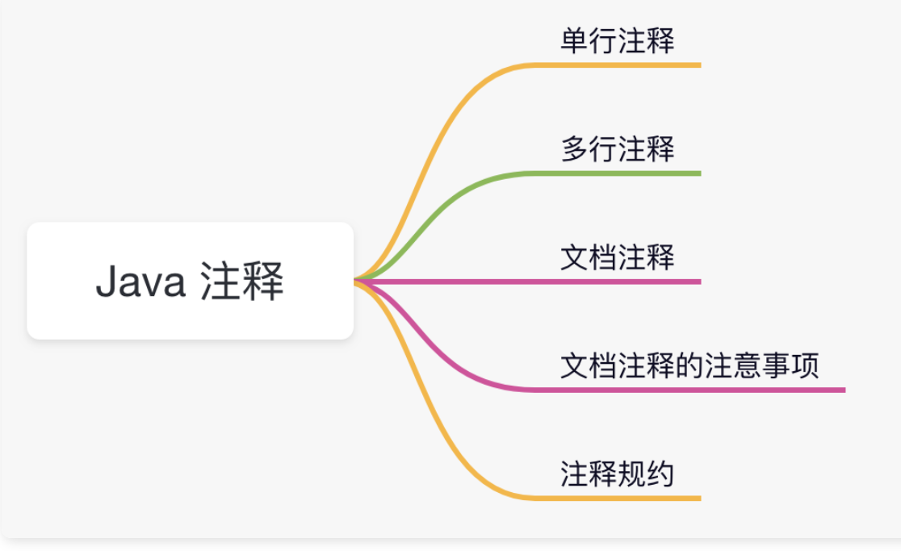

01、单行注释

单行注释通常用于解释方法内某单行代码的作用。


```java
public void method() {
    int age = 18; // age 用于表示年龄
}
```

**但如果写在行尾的话，其实是不符合阿里巴巴的开发规约的**。


正确的单行注释如上图中所说，在被注释语句上方另起一行，使用 `//` 注释。


```java
public void method() {
    // age 用于表示年龄
    int age = 18;
}
```

02、多行注释

多行注释使用的频率其实并不高，通常用于解释一段代码的作用。


```java
/*
age 用于表示年纪
name 用于表示姓名
*/
int age = 18;
String name = "沉默王二";
```

以 `/*` 开始，以 `*/` 结束，但不如用多个 `//` 来得痛快，因为 `*` 和 `/` 不在一起，敲起来麻烦。


```java
// age 用于表示年纪
// name 用于表示姓名
int age = 18;
String name = "沉默王二";
```

03、文档注释

文档注释可用在三个地方，类、字段和方法，用来解释它们是干嘛的。


```java
/**
 * 微信搜索「沉默王二」，回复 Java
 */
public class Demo {
    /**
     * 姓名
     */
    private int age;

    /**
     * main 方法作为程序的入口
     *
     * @param args 参数
     */
    public static void main(String[] args) {

    }
}
```

PS：在 Intellij IDEA 中，按下 `/**` 后敲下回车键就可以自动添加文档注释的格式，`*/` 是自动补全的。

04、文档注释的注意事项

1）`javadoc` 命令只能为 public 和 protected 修饰的字段、方法和类生成文档。

default 和 private 修饰的字段和方法的注释将会被忽略掉。因为我们本来就不希望这些字段和方法暴露给调用者。

如果类不是 public 的话，javadoc 会执行失败。


2）文档注释中可以嵌入一些 HTML 标记，比如说段落标记 `<p>`，超链接标记 `<a></a>` 等等，但不要使用标题标记，比如说 `<h1>`，因为 javadoc 会插入自己的标题，容易发生冲突。

3）文档注释中可以插入一些 `@` 注解，比如说 `@see` 引用其他类，`@version` 版本号，`@param` 参数标识符，`@author` 作者标识符，`@deprecated` 已废弃标识符，等等。

05、注释规约

1）类、字段、方法必须使用文档注释，不能使用单行注释和多行注释。因为注释文档在 IDE 编辑窗口中可以悬浮提示，提高编码效率。

比如说，在使用 String 类的时候，鼠标悬停在 String 上时可以得到以下提示。

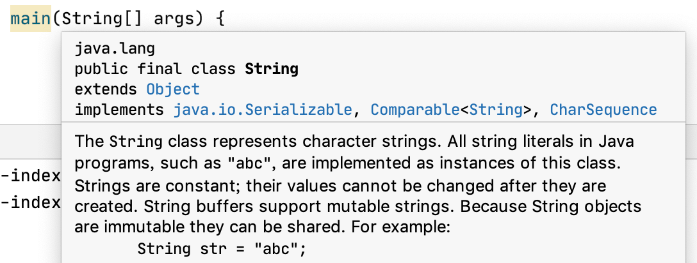

2）所有的抽象方法包括接口中的方法)必须要用 Javadoc 注释、除了返回值、参数、 异常说明外，还必须指出该方法做什么事情，实现什么功能。

3）所有的类都必须添加创建者和创建日期。

Intellij IDEA 中可以在「File and Code Templates」中设置。

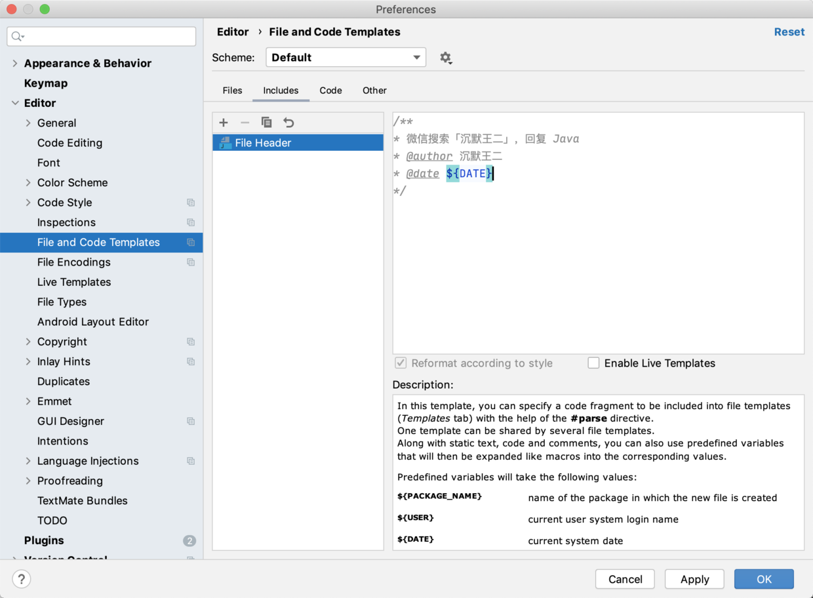

语法如下所示：


```text
/**
* java注释
* @author 名字
* @date ${DATE}
*/
```

设置好后，在新建一个类的时候就可以自动生成了。


```java
/**
 * 
 *java注释
 * @author xiaou
 * @date 2023/6/14
 */
public class Test {
}
```

4）所有的枚举类型字段必须要有注释，说明每个数据项的用途。

5）代码修改的同时，注释也要进行相应的修改。

“记住一点，注释是程序固有的一部分。”

- 第一、注释要能够准确反映设计思想和代码逻辑;
- 第二、注释要能够描述业务含 义，使别的程序员能够迅速了解到代码背后的信息。

完全没有注释的大段代码对于阅读者形同 天书，注释是给自己看的，即使隔很长时间，也能清晰理解当时的思路;注释也是给继任者看 的，使其能够快速接替自己的工作。

## java数据类型

Java 中的数据类型可分为 2 种：

1）**基本数据类型**。

基本数据类型是 Java 语言操作数据的基础，包括 boolean、char、byte、short、int、long、float 和 double，共 8 种。

2）**引用数据类型**。

除了基本数据类型以外的类型，都是所谓的引用类型。常见的有数组，类和接口。基本数据类型

来个思维导图，感受下。


基本数据类型是CPU可以直接进行运算的类型。Java定义了以下几种基本数据类型：

- 整数类型：byte，short，int，long
- 浮点数类型：float，double
- 字符类型：char
- 布尔类型：boolean

Java定义的这些基本数据类型有什么区别呢？要了解这些区别，我们就必须简单了解一下计算机内存的基本结构。

计算机内存的最小存储单元是字节（byte），一个字节就是一个8位二进制数，即8个bit。它的二进制表示范围从`00000000`~`11111111`，换算成十进制是0~255，换算成十六进制是`00`~`ff`。

内存单元从0开始编号，称为内存地址。每个内存单元可以看作一间房间，内存地址就是门牌号。

```ascii
  0   1   2   3   4   5   6  ...
┌───┬───┬───┬───┬───┬───┬───┐
│   │   │   │   │   │   │   │...
└───┴───┴───┴───┴───┴───┴───┘
```

一个字节是1byte，1024字节是1K，1024K是1M，1024M是1G，1024G是1T。一个拥有4T内存的计算机的字节数量就是：

```
4T = 4 x 1024G
   = 4 x 1024 x 1024M
   = 4 x 1024 x 1024 x 1024K
   = 4 x 1024 x 1024 x 1024 x 1024
   = 4398046511104
```

不同的数据类型占用的字节数不一样。我们看一下Java基本数据类型占用的字节数：

```ascii
       ┌───┐
  byte │   │
       └───┘
       ┌───┬───┐
 short │   │   │
       └───┴───┘
       ┌───┬───┬───┬───┐
   int │   │   │   │   │
       └───┴───┴───┴───┘
       ┌───┬───┬───┬───┬───┬───┬───┬───┐
  long │   │   │   │   │   │   │   │   │
       └───┴───┴───┴───┴───┴───┴───┴───┘
       ┌───┬───┬───┬───┐
 float │   │   │   │   │
       └───┴───┴───┴───┘
       ┌───┬───┬───┬───┬───┬───┬───┬───┐
double │   │   │   │   │   │   │   │   │
       └───┴───┴───┴───┴───┴───┴───┴───┘
       ┌───┬───┐
  char │   │   │
       └───┴───┘
```

`byte`恰好就是一个字节，而`long`和`double`需要8个字节。

我们用表格来直观的感受一下基本数据类型

| 数据类型 | 默认值   | 大小   |
| -------- | -------- | ------ |
| boolean  | false    | 1 比特 |
| char     | '\u0000' | 2 字节 |
| byte     | 0        | 1 字节 |
| short    | 0        | 2 字节 |
| int      | 0        | 4 字节 |
| long     | 0L       | 8 字节 |
| float    | 0.0f     | 4 字节 |
| double   | 0.0      | 8 字节 |

### 01、比特和字节

比特币（Bitcoin）听说过吧？字节跳动（Byte Dance）听说过吧？这些名字当然不是乱起的，确实和比特、字节有关系。

#### 1）bit（比特）

比特作为信息技术的最基本存储单位，非常小，但大名鼎鼎的比特币就是以此命名的，它的简写为小写字母“b”。

大家都知道，计算机是以二进制存储数据的，二进制的一位，就是 1 比特，也就是说，比特要么为 0 要么为 1。

#### **2）Byte（字节）**

通常来说，一个英文字符是一个字节，一个中文字符是两个字节。字节与比特的换算关系是：1 字节 = 8 比特。

在往上的单位就是 KB，并不是 1000 字节，因为计算机只认识二进制，因此是 2 的 10 次方，也就是 1024 个字节。

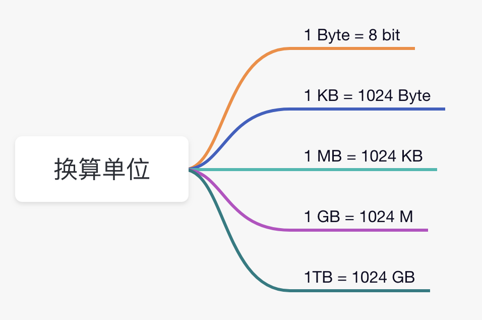

### 02.基本数据类型

#### 整型

对于整型类型，Java只定义了带符号的整型，因此，最高位的bit表示符号位（0表示正数，1表示负数）。各种整型能表示的最大范围如下：

- byte：-128 ~ 127
- short: -32768 ~ 32767
- int: -2147483648 ~ 2147483647
- long: -9223372036854775808 ~ 9223372036854775807

下面来看一个定义整型的

```java
public class Main {
    public static void main(String[] args) {
        int i = 2147483647;
        int i2 = -2147483648;
        int i3 = 2_000_000_000; // 加下划线更容易识别
        int i4 = 0xff0000; // 十六进制表示的16711680
        int i5 = 0b1000000000; // 二进制表示的512
        long l = 9000000000000000000L; // long型的结尾需要加L
    }
}
```


特别注意：同一个数的不同进制的表示是完全相同的，例如`15`=`0xf`＝`0b1111`。

#### 浮点型

浮点类型的数就是小数，因为小数用科学计数法表示的时候，小数点是可以“浮动”的，如1234.5可以表示成12.345x102，也可以表示成1.2345x103，所以称为浮点数。

下面是定义浮点数的例子：

```java
float f1 = 3.14f;
float f2 = 3.14e38f; // 科学计数法表示的3.14x10^38
double d = 1.79e308;
double d2 = -1.79e308;
double d3 = 4.9e-324; // 科学计数法表示的4.9x10^-324
```

对于`float`类型，需要加上`f`后缀。

浮点数可表示的范围非常大，`float`类型可最大表示3.4x1038，而`double`类型可最大表示1.79x10308。

#### 布尔类型

布尔类型`boolean`只有`true`和`false`两个值，布尔类型总是关系运算的计算结果：

```java
boolean b1 = true;
boolean b2 = false;
boolean isGreater = 5 > 3; // 计算结果为true
int age = 12;
boolean isAdult = age >= 18; // 计算结果为false
```

#### 字符串型

字符类型`char`表示一个字符。Java的`char`类型除了可表示标准的ASCII外，还可以表示一个Unicode字符：

```java
public class Main {
    public static void main(String[] args) {
        char a = 'A';
        char zh = '中';
        System.out.println(a);
        System.out.println(zh);
    }
}
```

注意`char`类型使用单引号`'`，且仅有一个字符，要和双引号`"`的字符串类型区分开。

### 03、单精度和双精度

单精度（single-precision）和双精度（double-precision）是指两种不同精度的浮点数表示方法。

单精度是这样的格式，1 位符号，8 位指数，23 位小数。


单精度浮点数通常占用 32 位（4 字节）存储空间。数值范围大约是 ±1.4E-45 到 ±3.4028235E38，精度大约为 6 到 9 位有效数字。

双精度是这样的格式，1 位符号，11 位指数，52 为小数。


双精度浮点数通常占用 64 位（8 字节）存储空间，数值范围大约是 ±4.9E-324 到 ±1.7976931348623157E308，精度大约为 15 到 17 位有效数字。

计算精度取决于小数位（尾数）。小数位越多，则能表示的数越大，那么计算精度则越高。

一个数由若干位数字组成，其中影响测量精度的数字称作有效数字，也称有效数位。有效数字指科学计算中用以表示一个浮点数精度的那些数字。一般地，指一个用小数形式表示的浮点数中，从第一个非零的数字算起的所有数字。如 1.24 和 0.00124 的有效数字都有 3 位。

以下是确定有效数字的一些基本规则：

- 非零数字总是有效的。
- 位于两个非零数字之间的零是有效的。
- 对于小数，从左侧开始的第一个非零数字之前的零是无效的。
- 对于整数，从右侧开始的第一个非零数字之后的零是无效的。

下面是一些示例，说明如何确定有效数字：

- 1234：4 个有效数字（所有数字都是非零数字）
- 1002：4 个有效数字（零位于两个非零数字之间）
- 0.00234：3 个有效数字（从左侧开始的前两个零是无效的）
- 1200：2 个有效数字（从右侧开始的两个零是无效的）

基本数据类型在作为成员变量和静态变量的时候有默认值，引用数据类型也有的（学完数组&字符串，以及面向对象编程后会更加清楚，这里先简单过一下）。

### 04、引用数据类型

String是最典型的引用数据类型，所以我们就拿 String 类举例，看下面这段代码：


```java
public class LocalRef {
    private String a;
    static String b;

    public static void main(String[] args) {
        LocalRef lv = new LocalRef();
        System.out.println(lv.a);
        System.out.println(b);
    }
}
```

输出结果如下所示：


```text
null
null
```

null 在 Java 中是一个很神奇的存在，在你以后的程序生涯中，见它的次数不会少，尤其是伴随着令人烦恼的“空指针异常”，也就是所谓的 `NullPointerException`。

也就是说，引用数据类型的默认值为 null，包括数组和接口。

那你是不是很好奇，为什么数组和接口也是引用数据类型啊？

先来看数组：


```java
int [] arrays = {1,2,3};
System.out.println(arrays);
```

arrays 是一个 int 类型的数组，对吧？打印结果如下所示：


```text
[I@2d209079
```

`[I` 表示数组是 int 类型的，@ 后面是十六进制的 hashCode——这样的打印结果太“人性化”了，一般人表示看不懂！为什么会这样显示呢？查看一下 `java.lang.Object` 类的 `toString()` 方法就明白了。


数组虽然没有显式定义成一个类，但它的确是一个对象，继承了祖先类 Object 的所有方法。那为什么数组不单独定义一个类来表示呢？就像字符串 String 类那样呢？

一个合理的解释是 Java 将其隐藏了。假如真的存在一个 Array.java，我们也可以假想它真实的样子，它必须要定义一个容器来存放数组的元素，就像 String 类那样。


```java
public final class String
    implements java.io.Serializable, Comparable<String>, CharSequence {
    /** The value is used for character storage. */
    private final char value[];
}
```

数组内部定义数组？没必要的！

再来看接口：


```java
List<String> list = new ArrayList<>();
System.out.println(list);
```

List 是一个非常典型的接口：


```java
public interface List<E> extends Collection<E> {}
```

而 ArrayList 是 List 接口的一个实现：


```java
public class ArrayList<E> extends AbstractList<E>
        implements List<E>, RandomAccess, Cloneable, java.io.Serializable
{}
```

对于接口类型的引用变量来说，你没法直接 new 一个：


只能 new 一个实现它的类的对象——那自然接口也是引用数据类型了。

来看一下基本数据类型和引用数据类型之间最大的差别。

基本数据类型：

- 1、变量名指向具体的数值。
- 2、基本数据类型存储在栈上。

引用数据类型：

- 1、变量名指向的是存储对象的内存地址，在栈上。
- 2、内存地址指向的对象存储在堆上。

上面说了栈和队，那么什么是栈和堆呢，下面来进行一个讲解。

### 05、栈和堆

堆是堆（heap），栈是栈（stack），如果看到“堆栈”的话，请不要怀疑自己，那是翻译的错，堆栈也是栈，反正我很不喜欢“堆栈”这种叫法，容易让新人掉坑里。

堆是在程序运行时在内存中申请的空间（可理解为动态的过程）；切记，不是在编译时；因此，Java 中的对象就放在这里，这样做的好处就是：

> 当需要一个对象时，只需要通过 new 关键字写一行代码即可，当执行这行代码时，会自动在内存的“堆”区分配空间——这样就很灵活。

栈，能够和处理器（CPU，也就是脑子）直接关联，因此访问速度更快。既然访问速度快，要好好利用啊！Java 就把对象的引用放在栈里。为什么呢？因为引用的使用频率高吗？

不是的，因为 Java 在编译程序时，必须明确的知道存储在栈里的东西的生命周期，否则就没法释放旧的内存来开辟新的内存空间存放引用——空间就那么大，前浪要把后浪拍死在沙滩上啊。

这么说就理解了吧？

如果还不理解的话，可以看一下这个视频，讲的非常不错：[什么是堆？什么是栈？他们之间有什么区别和联系？open in new window](https://www.zhihu.com/question/19729973/answer/2238950166)

用图来表示一下，左侧是栈，右侧是堆。


这里再补充一些额外的知识点，能看懂就继续吸收，看不懂可以先去学下一节，以后再来补，没关系的。学习就是这样，可以跳过，可以温故。

举个例子。


```java
String a = new String("xiaou")
```

这段代码会先在堆里创建一个 沉默王二的字符串对象，然后再把对象的引用 a 放到栈里面。这里面还会涉及到字符串常量池，后面会讲。

那么对于这样一段代码，有基本数据类型的变量，有引用类型的变量，堆和栈都是如何存储他们的呢？


```java
public void test()
{
    int i = 4;
    int y = 2;
    Object o1 = new Object();
}
```

我来画个图表示下。

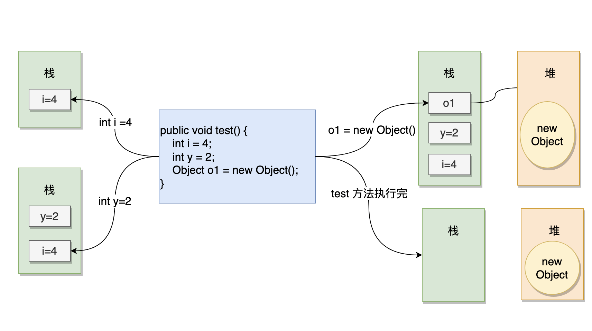

应该一目了然了吧？如果还不理解，以后我会再一些面试题中，更新这些的具体讲解的。


### 06、数据类型之间的转换

数据类型转换的目的是确保在表达式求值时，不同类型的数据能够相互兼容。

#### 01、自动类型转换

自动类型转换（自动类型提升）是 Java 编译器在不需要显式转换的情况下，将一种基本数据类型自动转换为另一种基本数据类型的过程。这种转换通常发生在表达式求值期间，当不同类型的数据需要相互兼容时。自动类型转换遵循以下规则：

- 如果任何操作数是 double 类型，其他操作数将被转换为 double 类型。
- 否则，如果任何操作数是 float 类型，其他操作数将被转换为 float 类型。
- 否则，如果任何操作数是 long 类型，其他操作数将被转换为 long 类型。
- 否则，所有操作数将被转换为 int 类型。

需要注意的是，自动类型转换只发生在兼容类型之间。例如，从较小的数据类型（如 int）到较大的数据类型（如 long 或 double）的转换是安全的，因为较大的数据类型可以容纳较小数据类型的所有可能值。


```text
byte -> short -> int -> long -> float -> double
char -> int -> long -> float -> double
```

下面是一个简单的示例，演示了自动类型转换：


```java
int intValue = 5;
double doubleValue = 2.5;

// 自动类型转换：intValue 被转换为 double 类型
double result = intValue * doubleValue;
System.out.println("结果: " + result); // 输出：结果: 12.5
```

在这个示例中，我们有一个 int 类型的变量 intValue 和一个 double 类型的变量 doubleValue。当我们将它们相乘时，根据自动类型转换的规则，intValue 将被转换为 double 类型，以便将两个 double 类型的操作数相乘。最终结果将是一个 double 类型的值：12.5。

再来举个例子，顾客到超市购物，购买牙膏 2 盒，面巾纸 4 盒。其中牙膏的价格是 10.9 元，面巾纸的价格是 5.8 元，求商品总价格。实现代码如下：


```java
float price1 = 10.9f; // 定义牙膏的价格，单精度浮点型float
double price2 = 5.8; // 定义面巾纸的价格，双精度浮点型double
int num1 = 2; // 定义牙膏的数量，整型 int
int num2 = 4; // 定义面巾纸的数量
double res = price1 * num1 + price2 * num2; // 计算总价
System.out.println("一共付给收银员" + res + "元"); // 输出总价
```

上述代码中首先定义了一个 float 类型的变量存储牙膏的价格，然后定义了一个 double 类型的变量存储面巾纸的价格，再定义两个 int 类型的变量存储物品的数量，最后进行了乘运算以及和运算之后，将结果储存在一个 double 类型的变量中进行输出。


```text
一共付给收银员44.99999923706055元
```

从执行结果看出，float、int 和 double 三种数据类型参与运算，最后输出的结果为 double 类型的数据。这种转换一般称为“表达式中类型的自动提升”。

自动类型提升有好处，但它也会引起令人疑惑的编译错误。例如，下面看起来正确的程序却会引起问题：


```java
byte b = 50;

b = b * 2; // Type mismatch: cannot convert from int to byte
```

如上所示，第二行会报“类型不匹配：无法从int转换为byte”错误。

该程序试图将一个完全合法的 byte 型的值 50*2 存储给一个 byte 型的变量。但是当表达式求值的时候，操作数被自动的提升为 int 型，计算结果也被提升为 int 型。这样表达式的结果现在是 int 型，不强制转换它就不能被赋为 byte 型。

所以应该使用一个显示的强制类型转换，例如：


```java
byte b = 50;
b = (byte)(b*2);
```

这样就能产生正确的值 100。

注意：char 类型比较特殊，char 自动转换成 int、long、float 和 double，但 byte 和 short 不能自动转换为 char，而且 char 也不能自动转换为 byte 或 short。

#### 02、强制类型转换

强制类型转换是 Java 中将一种数据类型显式转换为另一种数据类型的过程。与自动类型转换不同，强制类型转换需要程序员显式地指定要执行的转换。强制类型转换在以下情况中可能需要：

- 将较大的数据类型转换为较小的数据类型。
- 将浮点数转换为整数。
- 将字符类型转换为数值类型。

需要注意的是，强制类型转换可能会导致数据丢失或精度降低，因为目标类型可能无法容纳原始类型的所有可能值。因此，在进行强制类型转换时，需要确保转换后的值仍然在目标类型的范围内。


```text
double -> float -> long -> int -> char -> short -> byte
```

以下是一个简单的示例，演示了强制类型转换：


```java
double doubleValue = 42.8;

// 强制类型转换：将 double 类型转换为 int 类型
int intValue = (int) doubleValue;
System.out.println("整数值: " + intValue); // 输出：整数值: 42
```

在这个示例中，我们有一个 double 类型的变量 doubleValue。我们希望将其转换为 int 类型的变量 intValue。为此，我们使用强制类型转换语法，即在要转换的变量之前加上目标类型的括号（如 (int)）。

需要注意的是，将 doubleValue 转换为 int 类型时，小数部分将被截断。因此，输出结果将是：Integer value: 42。在这种情况下，精度丢失是可以接受的，但在其他情况下，我们可能需要更加小心地处理类型转换以避免数据丢失。

顾客到超市购物，购买牙膏 2 盒，面巾纸 4 盒。其中牙膏的价格是 10.9 元，面巾纸的价格是 5.8 元，求商品总价格，在计算总价时采用 int 类型的数据进行存储。实现代码如下：


```java
float price1 = 10.9f;
double price2 = 5.8;
int num1 = 2;
int num2 = 4;
int res2 = (int) (price1 * num1 + price2 * num2);
System.out.println("一共付给收银员" + res2 + "元");
```

在上述实例中，有 double 类型、float 类型和 int 类型的数据参与运算，其运算结果默认为 double 类型，题目要求的结果为 int 类型，因为 int 类型的取值范围要小于 double 类型的取值范围，所以需要进行强制类型转换。


```text
一共付给收银员44元
```

这个在我们的实际开发中是非常常用的一个存在。当然在idea中，是可以实现快速的转换的，这里就不做过多的介绍了。

### 07、缓存池

这个能帮助你更好的理解数据类型，属于是面试的范围了

new Integer(123) 与 Integer.valueOf(123) 的区别在于：

- new Integer(123) 每次都会新建一个对象；
- Integer.valueOf(123) 会使用缓存池中的对象，多次调用会取得同一个对象的引用。

```java
Integer x = new Integer(123);
Integer y = new Integer(123);
System.out.println(x == y);    // false
Integer z = Integer.valueOf(123);
Integer k = Integer.valueOf(123);
System.out.println(z == k);   // true
```

valueOf() 方法的实现比较简单，就是先判断值是否在缓存池中，如果在的话就直接返回缓存池的内容。

```java
public static Integer valueOf(int i) {
    if (i >= IntegerCache.low && i <= IntegerCache.high)
        return IntegerCache.cache[i + (-IntegerCache.low)];
    return new Integer(i);
}
```

在 Java 8 中，Integer 缓存池的大小默认为 -128~127。

```java
static final int low = -128;
static final int high;
static final Integer cache[];

static {
    // high value may be configured by property
    int h = 127;
    String integerCacheHighPropValue =
        sun.misc.VM.getSavedProperty("java.lang.Integer.IntegerCache.high");
    if (integerCacheHighPropValue != null) {
        try {
            int i = parseInt(integerCacheHighPropValue);
            i = Math.max(i, 127);
            // Maximum array size is Integer.MAX_VALUE
            h = Math.min(i, Integer.MAX_VALUE - (-low) -1);
        } catch( NumberFormatException nfe) {
            // If the property cannot be parsed into an int, ignore it.
        }
    }
    high = h;

    cache = new Integer[(high - low) + 1];
    int j = low;
    for(int k = 0; k < cache.length; k++)
        cache[k] = new Integer(j++);

    // range [-128, 127] must be interned (JLS7 5.1.7)
    assert IntegerCache.high >= 127;
}
```

编译器会在自动装箱过程调用 valueOf() 方法，因此多个值相同且值在缓存池范围内的 Integer 实例使用自动装箱来创建，那么就会引用相同的对象。

```java
Integer m = 123;
Integer n = 123;
System.out.println(m == n); // true
```

基本类型对应的缓冲池如下：

- boolean values true and false
- all byte values
- short values between -128 and 127
- int values between -128 and 127
- char in the range \u0000 to \u007F

在使用这些基本类型对应的包装类型时，如果该数值范围在缓冲池范围内，就可以直接使用缓冲池中的对象。

在 jdk 1.8 所有的数值类缓冲池中，Integer 的缓冲池 IntegerCache 很特殊，这个缓冲池的下界是 - 128，上界默认是 127，但是这个上界是可调的，在启动 jvm 的时候，通过 -XX:AutoBoxCacheMax=<size> 来指定这个缓冲池的大小，该选项在 JVM 初始化的时候会设定一个名为 java.lang.IntegerCache.high 系统属性，然后 IntegerCache 初始化的时候就会读取该系统属性来决定上界。

## java运算符

计算机的最基本用途之一就是执行数学运算，作为一门计算机语言，Java也提供了一套丰富的运算符来操纵变量。我们可以把运算符分成以下几组：

- 算术运算符
- 关系运算符
- 位运算符
- 逻辑运算符
- 赋值运算符
- 其他运算符

下面我们要学习的，大概就是下图

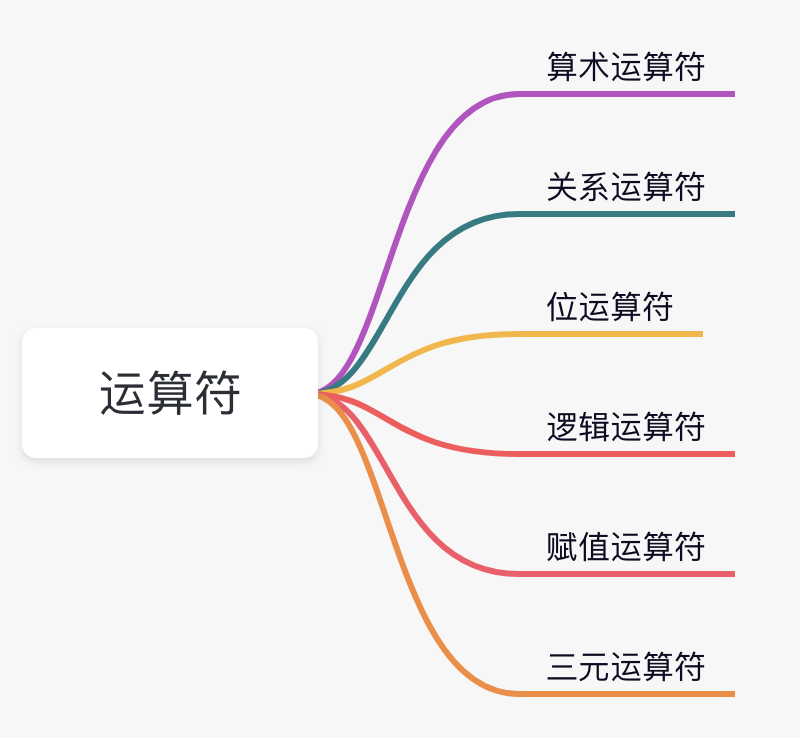

### 01、算术运算符

算术运算符除了最常见的加减乘除，还有一个取余的运算符，用于得到除法运算后的余数，来串代码感受下。


```java
int a = 10;
int b = 5;

System.out.println(a + b);//15
System.out.println(a - b);//5
System.out.println(a * b);//50
System.out.println(a / b);//2
System.out.println(a % b);//0

b = 3;
System.out.println(a + b);//13
System.out.println(a - b);//7
System.out.println(a * b);//30
System.out.println(a / b);//3
System.out.println(a % b);//1
```

对于初学者来说，加法（+）、减法（-）、乘法（*）很好理解，但除法（/）和取余（%）会有一点点疑惑。在以往的认知里，10/3 是除不尽的，结果应该是 3.333333...，而不应该是 3。相应的，余数也不应该是 1。这是为什么呢？

因为数字在程序中可以分为两种，一种是整型，一种是浮点型，整型和整型的运算结果就是整型，不会出现浮点型。否则，就会出现浮点型。


```java
int a = 10;
float c = 3.0f;
double d = 3.0;
System.out.println(a / c); // 3.3333333
System.out.println(a / d); // 3.3333333333333335
System.out.println(a % c); // 1.0
System.out.println(a % d); // 1.0
```

需要注意的是，当浮点数除以 0 的时候，结果为 Infinity 或者 NaN。


```java
System.out.println(10.0 / 0.0); // Infinity
System.out.println(0.0 / 0.0); // NaN
```

Infinity 的中文意思是无穷大，NaN 的中文意思是这不是一个数字（Not a Number）。

当整数除以 0 的时候（`10 / 0`），会抛出异常：


```text
Exception in thread "main" java.lang.ArithmeticException: / by zero
	at com.itwanger.eleven.ArithmeticOperator.main(ArithmeticOperator.java:32)
```

所以整数在进行除法运算时，需要先判断除数是否为 0，以免程序抛出异常。

算术运算符中还有两种特殊的运算符，自增运算符（++）和自减运算符（--），它们也叫做一元运算符，只有一个操作数。


```java
int x = 10;
System.out.println(x++);//10 (11)  
System.out.println(++x);//12  
System.out.println(x--);//12 (11)  
System.out.println(--x);//10  
```

一元运算符可以放在数字的前面或者后面，放在前面叫前自增（前自减），放在后面叫后自增（后自减）。

前自增和后自增是有区别的，拿 `int y = ++x` 这个表达式来说（x = 10），它可以拆分为 `x = x+1 = 11; y = x = 11`，所以表达式的结果为 `x = 11, y = 11`。拿 `int y = x++` 这个表达式来说（x = 10），它可以拆分为 `y = x = 10; x = x+1 = 11`，所以表达式的结果为 `x = 11, y = 10`。


```java
int x = 10;
int y = ++x;
System.out.println(y + " " + x);// 11 11

x = 10;
y = x++;
System.out.println(y + " " + x);// 10 11
```

对于前自减和后自减来说，你可以自己试一把。

### 02、关系运算符

关系运算符用来比较两个操作数，返回结果为 true 或者 false。

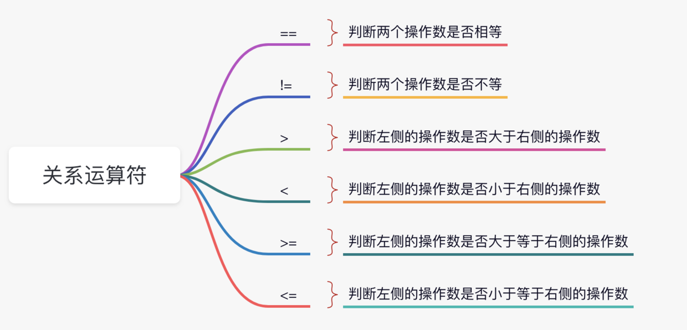

来看示例：


```java
int a = 10, b = 20;
System.out.println(a == b); // false
System.out.println(a != b); // true
System.out.println(a > b); // false
System.out.println(a < b); // true
System.out.println(a >= b); // false
System.out.println(a <= b); // true
```

### 03、位运算符

在学习位运算符之前，需要先学习一下二进制，因为位运算符操作的不是整型数值（int、long、short、char、byte）本身，而是整型数值对应的二进制。


```java
System.out.println(Integer.toBinaryString(60)); // 111100
System.out.println(Integer.toBinaryString(13)); // 1101
```

从程序的输出结果可以看得出来，60 的二进制是 0011 1100（用 0 补到 8 位），13 的二进制是 0000 1101。

PS：现代的二进制记数系统由戈特弗里德·威廉·莱布尼茨于 1679 年设计。莱布尼茨是德意志哲学家、数学家，历史上少见的通才。


来看示例：


```java
int a = 60, b = 13;
System.out.println("a 的二进制：" + Integer.toBinaryString(a)); // 111100
System.out.println("b 的二进制：" + Integer.toBinaryString(b)); // 1101

int c = a & b;
System.out.println("a & b：" + c + "，二进制是：" + Integer.toBinaryString(c));

c = a | b;
System.out.println("a | b：" + c + "，二进制是：" + Integer.toBinaryString(c));

c = a ^ b;
System.out.println("a ^ b：" + c + "，二进制是：" + Integer.toBinaryString(c));

c = ~a;
System.out.println("~a：" + c + "，二进制是：" + Integer.toBinaryString(c));

c = a << 2;
System.out.println("a << 2：" + c + "，二进制是：" + Integer.toBinaryString(c));

c = a >> 2;
System.out.println("a >> 2：" + c + "，二进制是：" + Integer.toBinaryString(c));

c = a >>> 2;
System.out.println("a >>> 2：" + c + "，二进制是：" + Integer.toBinaryString(c));
```

对于初学者来说，位运算符无法从直观上去计算出结果，不像加减乘除那样。因为我们日常接触的都是十进制，位运算的时候需要先转成二进制，然后再计算出结果。

鉴于此，初学者在写代码的时候其实很少会用到位运算。对于编程高手来说，为了提高程序的性能，会在一些地方使用位运算。比如说，HashMap 在计算哈希值的时候：


```java
static final int hash(Object key) {
    int h;
    return (key == null) ? 0 : (h = key.hashCode()) ^ (h >>> 16);
}
```

如果对位运算一点都不懂的话，遇到这样的源码就很吃力。所以说，虽然位运算用的少，但还是要懂。

1）按位左移运算符：


```java
System.out.println(10<<2);//10*2^2=10*4=40  
System.out.println(10<<3);//10*2^3=10*8=80  
System.out.println(20<<2);//20*2^2=20*4=80  
System.out.println(15<<4);//15*2^4=15*16=240 
```

`10<<2` 等于 10 乘以 2 的 2 次方；`10<<3` 等于 10 乘以 2 的 3 次方。

2）按位右移运算符：


```java
System.out.println(10>>2);//10/2^2=10/4=2
System.out.println(20>>2);//20/2^2=20/4=5
System.out.println(20>>3);//20/2^3=20/8=2
```

`10>>2` 等于 10 除以 2 的 2 次方；`20>>2` 等于 20 除以 2 的 2 次方。

### 04、逻辑运算符

逻辑与运算符（&&）：多个条件中只要有一个为 false 结果就为 false。

逻辑或运算符（||）：多个条件只要有一个为 true 结果就为 true。


```java
int a=10;
int b=5;
int c=20;
System.out.println(a<b&&a<c);//false && true = false

System.out.println(a>b||a<c);//true || true = true
```

逻辑非运算符（!）：用来反转条件的结果，如果条件为 true，则逻辑非运算符将得到 false。

单逻辑与运算符（&）：很少用，因为不管第一个条件为 true 还是 false，依然会检查第二个。

单逻辑或运算符（|）：也会检查第二个条件。

也就是说，& 和 | 性能不如 && 和 ||，但用法一样：


```java
int a=10;
int b=5;
int c=20;
System.out.println(a<b&a<c);//false & true = false

System.out.println(a>b|a<c);//true | true = true  
```

### 05、赋值运算符

赋值操作符恐怕是 Java 中使用最频繁的操作符了，它就是把操作符右侧的值赋值给左侧的变量。来看示例：


```java
int a=10;
int b=20;
a+=4;//a=a+4 (a=10+4)  
b-=4;//b=b-4 (b=20-4)  
System.out.println(a);
System.out.println(b);
```

不过在进行数值的赋值时，需要小点心，比如说下面这种情况：

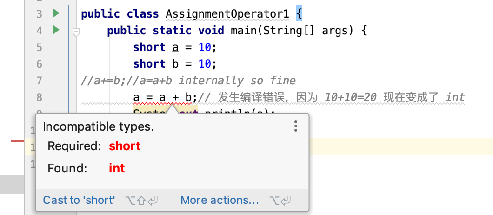

编译器之所以提示错误，是因为 = 右侧的算术表达式默认为 int 类型，左侧是 short 类型的时候需要进行强转。


```java
short a = 10;
short b = 10;
//a+=b;//a=a+b internally so fine
a = (short)(a + b);
System.out.println(a);
```

除此之外，还会有边界问题，比如说，两个非常大的 int 相乘，结果可能就超出了 int 的范围：


```java
int a = Integer.MAX_VALUE;
int b = 10000;
int c = a * b;
System.out.println(c); // -10000
```

程序输出的结果为 -10000，这个答案很明显不是我们想要的结果，虽然可以通过右侧表达式强转 long 的方法解决：


```java
int a = Integer.MAX_VALUE;
int b = 10000;
long c = (long)a * b;
System.out.println(c); // 21474836470000
```

但尽量不要这样做，结果非常大的时候，尽量提前使用相应的类型进行赋值。


```java
long a = Integer.MAX_VALUE - 1;
long b = 10000;
long c = a * b;
System.out.println(c); // 21474836460000
```

### 06、三元运算符

三元运算符用于替代 if-else，可以使用一行代码完成条件判断的要求。来看示例：


```java
int a=2;
int b=5;
int min=(a<b)?a:b;
System.out.println(min);
```

如果 ? 前面的条件为 true，则结果为 : 前的值，否则为 : 后的值。

我们来看一个相关的案例

**一座寺庙住着三个和尚，已知他们身高，求这三个和尚的最高值**

```java
public class 三元运算符练习2 {
    public static void main(String[] args) {
        int height1=150;
        int height2=210;
        int height3=165;
        int temp=height1>height2?height1:height2;
        int max=temp>height3?temp:height3;
        System.out.println(max);
    }

```

就是先1和2比，之后较大的和3比。

附上一个运算优先级。基本记住()优先于所有就可以了。

学了这么多的运算符，下面来看运算符的一个优先级。

### 07、运算符优先级

当多个运算符出现在一个表达式中，谁先谁后呢？这就涉及到运算符的优先级别的问题。在一个多运算符的表达式中，运算符优先级不同会导致最后得出的结果差别甚大。

例如，（1+3）＋（3+2）*2，这个表达式如果按加号最优先计算，答案就是 18，如果按照乘号最优先，答案则是 14。

再如，x = 7 + 3 * 2;这里x得到13，而不是20，因为乘法运算符比加法运算符有较高的优先级，所以先计算3 * 2得到6，然后再加7。

下表中具有最高优先级的运算符在的表的最上面，最低优先级的在表的底部。

| 类别     | 操作符                                     | 关联性   |
| :------- | :----------------------------------------- | :------- |
| 后缀     | () [] . (点操作符)                         | 左到右   |
| 一元     | expr++ expr--                              | 从左到右 |
| 一元     | ++expr --expr + - ～ ！                    | 从右到左 |
| 乘性     | * /％                                      | 左到右   |
| 加性     | + -                                        | 左到右   |
| 移位     | >> >>>  <<                                 | 左到右   |
| 关系     | > >= < <=                                  | 左到右   |
| 相等     | == !=                                      | 左到右   |
| 按位与   | ＆                                         | 左到右   |
| 按位异或 | ^                                          | 左到右   |
| 按位或   | \|                                         | 左到右   |
| 逻辑与   | &&                                         | 左到右   |
| 逻辑或   | \| \|                                      | 左到右   |
| 条件     | ？：                                       | 从右到左 |
| 赋值     | = + = - = * = / =％= >> = << =＆= ^ = \| = | 从右到左 |
| 逗号     | ，                                         | 左到右   |

## java流程控制语句

流程控制语句是我们写代码中，非常重要的知识，我们的程序就是由这些结构而成的。

“比如说 if-else、switch、for、while、do-while、return、break、continue 等等，接下来，我们一个个来了解下。

### 01、if-else 相关

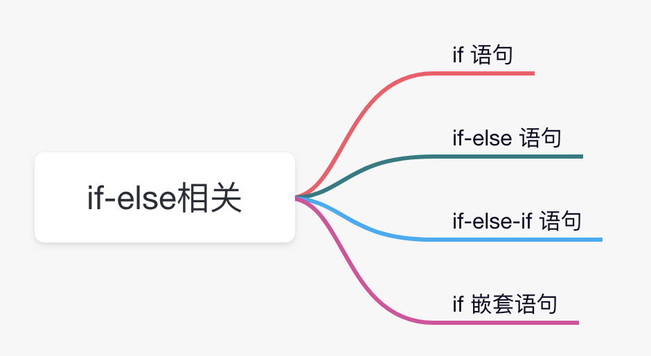

#### **1）if 语句**

if 语句的格式如下：


```java
if(布尔表达式){  
// 如果条件为 true，则执行这块代码
} 
```

画个流程图表示一下：

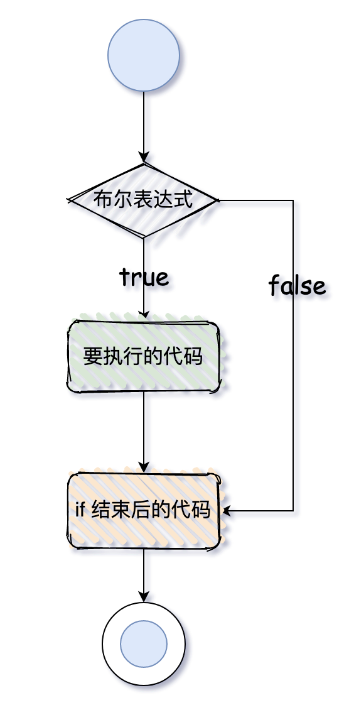

来写个示例：


```java
int age = 20;
if (age < 30) {
    System.out.println("");
}
```

输出：


```text
青春年华
```

#### **2）if-else 语句**

if-else 语句的格式如下:


```java
if(布尔表达式){  
// 条件为 true 时执行的代码块
}else{  
// 条件为 false  时执行的代码块
}  
```

画个流程图表示一下：

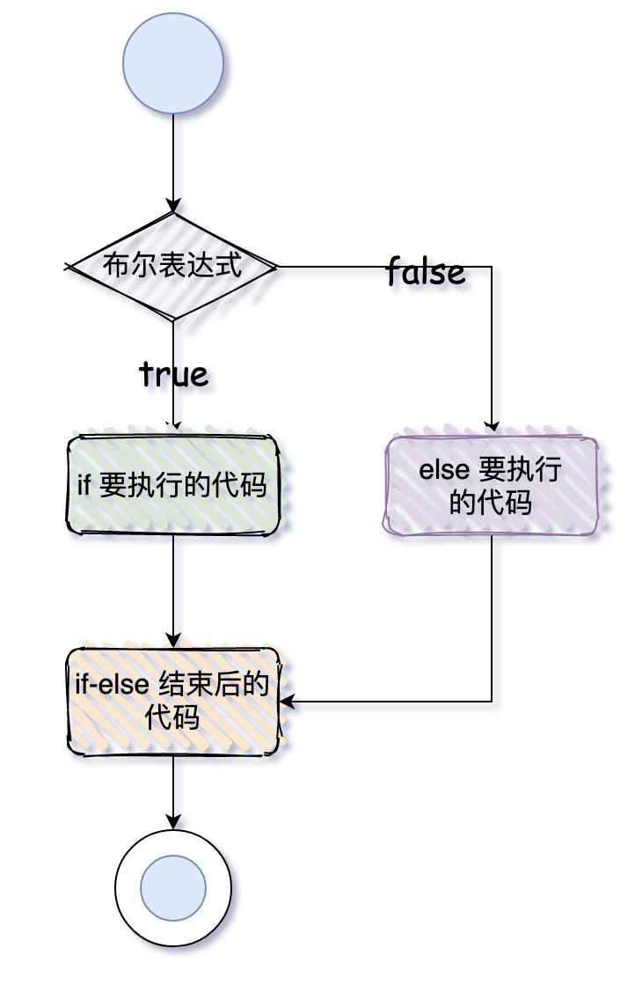

来写个示例：


```java
int age = 31;
if (age < 30) {
    System.out.println("青春年华");
} else {
    System.out.println("而立之年");
}
```

输出：


```text
而立之年
```

除了这个例子之外，还有一个判断闰年（被 4 整除但不能被 100 整除或者被 400 整除）的例子：


```java
int year = 2020;
if (((year % 4 == 0) && (year % 100 != 0)) || (year % 400 == 0)) {
    System.out.println("闰年");
} else {
    System.out.println("普通年份");
}
```

输出：


```text
闰年
```

如果执行语句比较简单的话，可以使用三元运算符来代替 if-else 语句，如果条件为 true，返回 ? 后面 : 前面的值；如果条件为 false，返回 : 后面的值。


```java
int num = 13;
String result = (num % 2 == 0) ? "偶数" : "奇数";
System.out.println(result);
```

输出：


```text
奇数
```

#### **3）if-else-if 语句**

if-else-if 语句的格式如下：


```java
if(条件1){  
// 条件1 为 true 时执行的代码
}else if(条件2){  
// 条件2 为 true 时执行的代码
}  
else if(条件3){  
// 条件3 为 true 时执行的代码
}  
...  
else{  
// 以上条件均为 false 时执行的代码
} 
```

画个流程图表示一下：

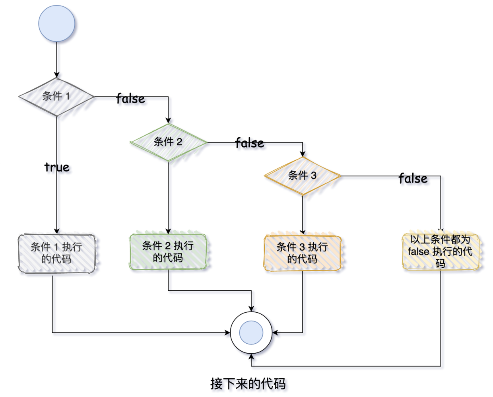

来写个示例：


```java
int age = 31;
if (age < 30) {
    System.out.println("青春年华");
} else if (age >= 30 && age < 40 ) {
    System.out.println("而立之年");
} else if (age >= 40 && age < 50 ) {
    System.out.println("不惑之年");
} else {
    System.out.println("知天命");
}
```

输出：


```text
而立之年
```

#### **4）if 嵌套语句**

if 嵌套语句的格式如下：


```java
if(外侧条件){    
     // 外侧条件为 true 时执行的代码 
    if(内侧条件){  
        // 内侧条件为 true 时执行的代码
    }    
}  
```

画个流程图表示一下：

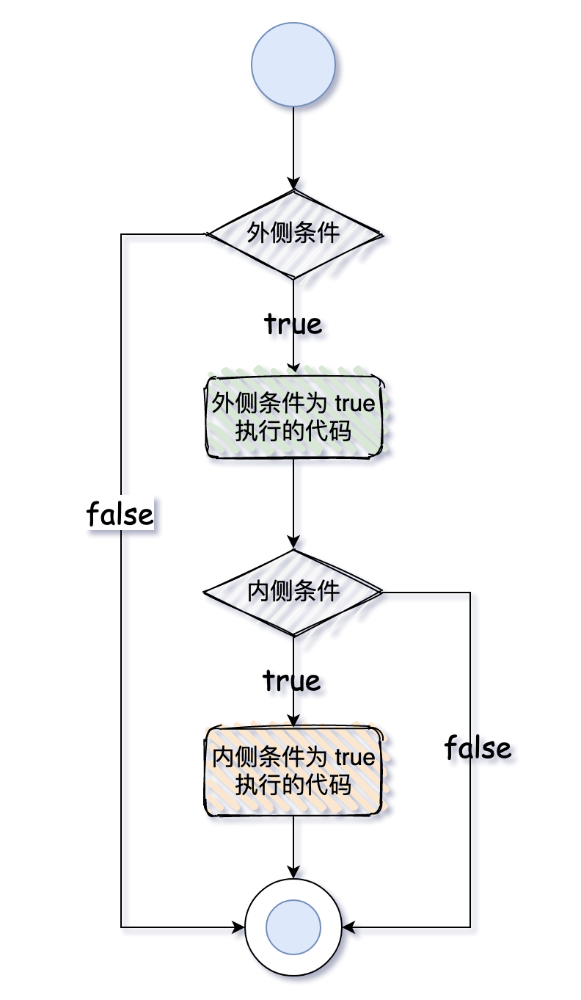

来写个示例：


```java
int age = 20;
boolean isGirl = true;
if (age >= 20) {
    if (isGirl) {
        System.out.println("女生法定结婚年龄");
    }
}
```

输出：


```text
女生法定结婚年龄
```

### 02、switch 语句

switch 语句用来判断变量与多个值之间的相等性。变量的类型可以是 byte、short、int 或者 char，或者对应的包装器类型 Byte、Short、Integer、Character，以及字符串和枚举类型。

来看一下 switch 语句的格式：


```java
switch(变量) {    
case 可选值1:    
 // 可选值1匹配后执行的代码;    
 break;  // 该关键字是可选项
case 可选值2:    
 // 可选值2匹配后执行的代码;    
 break;  // 该关键字是可选项
......    
    
default: // 该关键字是可选项     
 // 所有可选值都不匹配后执行的代码 
}    
```

- 变量可以有 1 个或者 N 个值。
- 值类型必须和变量类型是一致的，并且值是确定的。
- 值必须是唯一的，不能重复，否则编译会出错。
- break 关键字是可选的，如果没有，则执行下一个 case，如果有，则跳出 switch 语句。
- default 关键字也是可选的。

画个流程图：

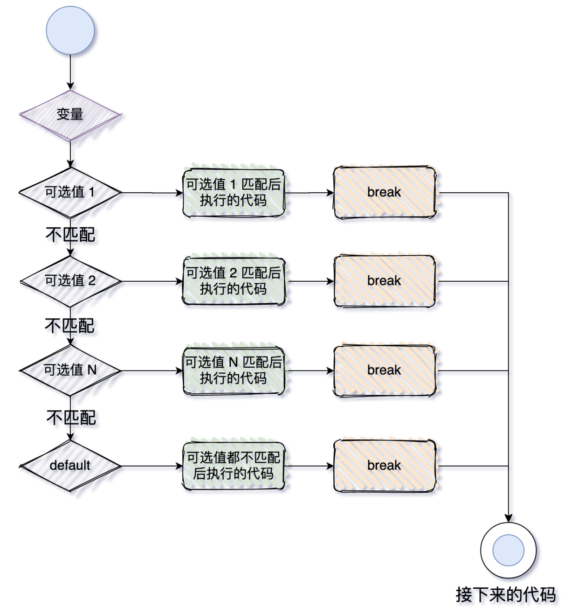

来个示例：


```java
int age = 20;
switch (age) {
    case 20 :
        System.out.println("上学");
        break;
    case 24 :
        System.out.println("苏州工作");
        break;
    case 30 :
        System.out.println("洛阳工作");
        break;
    default:
        System.out.println("未知");
        break; // 可省略
}
```

输出：


```text
上学
```

当两个值要执行的代码相同时，可以把要执行的代码写在下一个 case 语句中，而上一个 case 语句中什么也没有，来看一下示例：


```java
String name = "沉默王二";
switch (name) {
    case "詹姆斯":
        System.out.println("篮球运动员");
        break;
    case "穆里尼奥":
        System.out.println("足球教练");
        break;
    case "沉默王二":
    case "沉默王三":
        System.out.println("乒乓球爱好者");
        break;
    default:
        throw new IllegalArgumentException(
                "名字没有匹配项");

}
```

输出：


```text
乒乓球爱好者
```

枚举作为 switch 语句的变量也很常见，来看例子：


```java
public class SwitchEnumDemo {
    public enum PlayerTypes {
        TENNIS,
        FOOTBALL,
        BASKETBALL,
        UNKNOWN
    }

    public static void main(String[] args) {
        System.out.println(createPlayer(PlayerTypes.BASKETBALL));
    }

    private static String createPlayer(PlayerTypes playerType) {
        switch (playerType) {
            case TENNIS:
                return "网球运动员费德勒";
            case FOOTBALL:
                return "足球运动员C罗";
            case BASKETBALL:
                return "篮球运动员詹姆斯";
            case UNKNOWN:
                throw new IllegalArgumentException("未知");
            default:
                throw new IllegalArgumentException(
                        "运动员类型: " + playerType);

        }
    }
}
```

输出：


```text
篮球运动员詹姆斯
```

### 03、for 循环

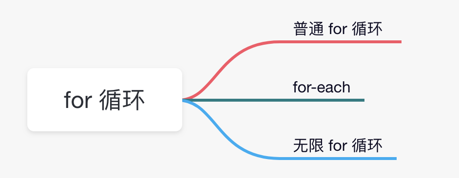

#### **1）普通 for 循环**

普通的 for 循环可以分为 4 个部分：

1）初始变量：循环开始执行时的初始条件。

2）条件：循环每次执行时要判断的条件，如果为 true，就执行循环体；如果为 false，就跳出循环。当然了，条件是可选的，如果没有条件，则会一直循环。

3）循环体：循环每次要执行的代码块，直到条件变为 false。

4）自增/自减：初始变量变化的方式。

来看一下普通 for 循环的格式：


```java
for(初始变量;条件;自增/自减){  
// 循环体
}  
```

画个流程图：

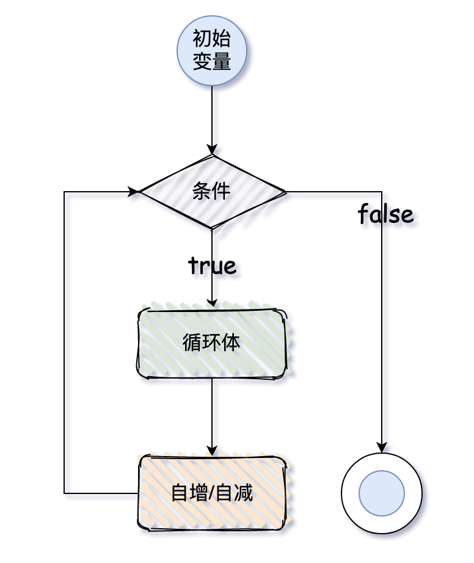

来个示例：


```java
for (int i = 0; i < 5; i++) {
    System.out.println("xiaou");
}
```

输出：


```text
xiaou
xiaou
xiaou
xiaou
xiaou
```


之后再来看一个有趣的打印

```java
for (int i = 0; i < 5; i++) {
    for (int j = 0;j<= i;j++) {
        System.out.print("❤");
    }
    System.out.println();
}
```


```text
❤
❤❤
❤❤❤
❤❤❤❤
❤❤❤❤❤
```

#### **2）for-each**

for-each 循环通常用于遍历数组和集合，它的使用规则比普通的 for 循环还要简单，不需要初始变量，不需要条件，不需要下标来自增或者自减。来看一下语法：


```java
for(元素类型 元素 : 数组或集合){  
// 要执行的代码
}  
```

来看一下示例：


```java
String[] strs = {"xiaou", "一枚有趣的程序员"};

for (String str : strs) {
    System.out.println(str);
}
```

输出：


```text
xiaou
一枚有趣的程序员
```

#### **3）无限 for 循环**


```java
for(;;){
    System.out.println("停不下来。。。。");
}
```

输出：


```text
停不下来。。。。
停不下来。。。。
停不下来。。。。
停不下来。。。。
```

一旦运行起来，就停不下来了，除非强制停止。

### 04、while 循环

来看一下 while 循环的格式：


```java
while(条件){  
//循环体  
}  
```

画个流程图：

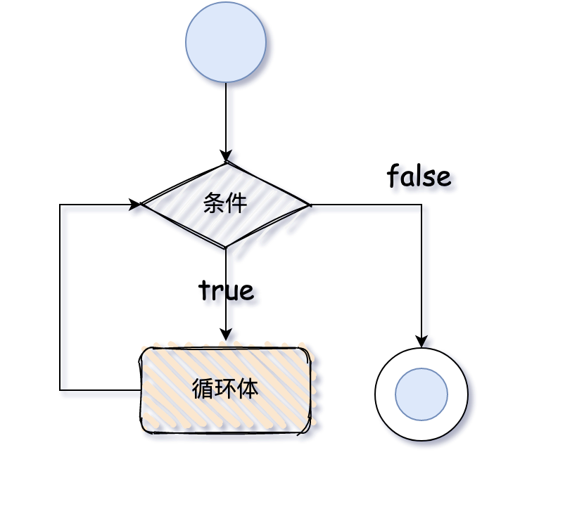

来个示例：


```java
int i = 0;
while (true) {
    System.out.println("xiaou");
    i++;
    if (i == 5) {
        break;
    }
}
```

接下来这个会是多少次呢，其实很好猜到，就是五次

```text
xiaou
xiaou
xiaou
xiaou
xiaou
```

接下来看while的无限死循环


```java
while (true) {
    System.out.println("停不下来。。。。");
}
```

输出：


```text
停不下来。。。。
停不下来。。。。
停不下来。。。。
停不下来。。。。
```

把 while 的条件设置为 true，并且循环体中没有 break 关键字的话，程序一旦运行起来，就根本停不下来了，除非强制停止。

### 05、do-while 循环

来看一下 do-while 循环的格式：


```java
do{  
// 循环体
}while(提交);  
```

画个流程图：

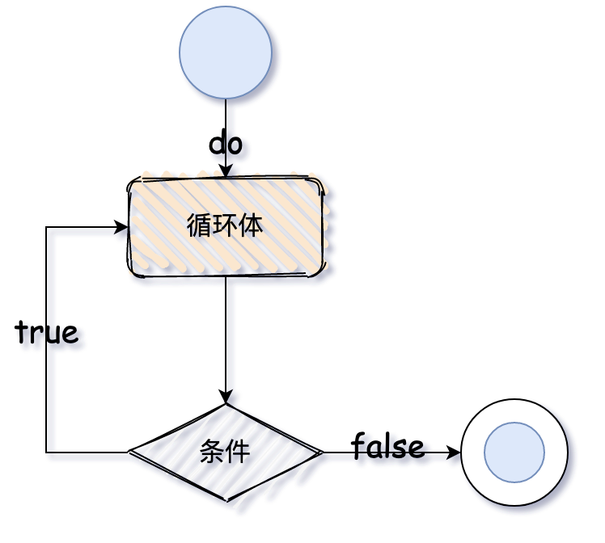

来个示例：


```java
int i = 0;
do {
    System.out.println("1");
    i++;
    if (i == 5) {
        break;
    }
} while (true);
```


```text
1
1
1
1
1
```

同时，dowhile也是可以死循环的

```java
do {
    System.out.println("停不下来。。。。");
} while (true);
```

输出：


```text
停不下来。。。。
停不下来。。。。
停不下来。。。。
停不下来。。。。
```

把 do-while 的条件设置为 true，并且循环体中没有 break 关键字的话，程序一旦运行起来，就根本停不下来了，除非强制停止。


### 06、break

break 关键字通常用于中断循环或 switch 语句，它在指定条件下中断程序的当前流程。如果是内部循环，则仅中断内部循环。

可以将 break 关键字用于所有类型循环语句中，比如说 for 循环、while 循环，以及 do-while 循环。

来画个流程图感受一下：

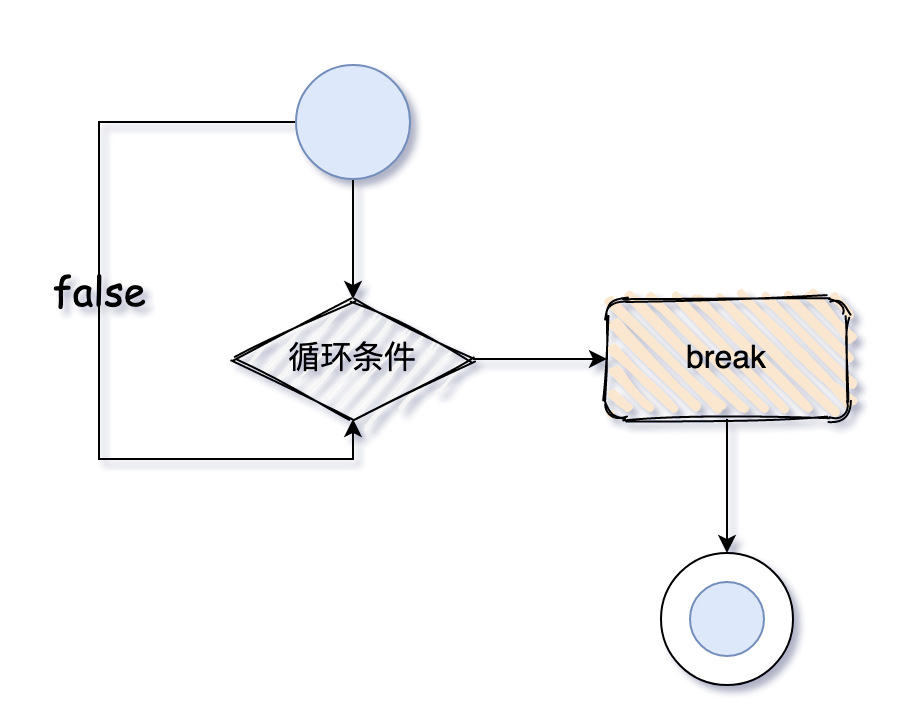

用在 for 循环中的示例：


```java
for (int i = 1; i <= 10; i++) {
    if (i == 5) {
        break;
    }
    System.out.println(i);
}
```

用在嵌套 for 循环中的示例：


```java
for (int i = 1; i <= 3; i++) {
    for (int j = 1; j <= 3; j++) {
        if (i == 2 && j == 2) {
            break;
        }
        System.out.println(i + " " + j);
    }
}
```

用在 while 循环中的示例：


```java
int i = 1;
while (i <= 10) {
    if (i == 5) {
        i++;
        break;
    }
    System.out.println(i);
    i++;
}
```

用在 do-while 循环中的示例：


```java
int j = 1;
do {
    if (j == 5) { 
        j++;
        break;
    }
    System.out.println(j);
    j++;
} while (j <= 10);
```

用在 switch 语句中的示例：


```java
switch (age) {
    case 20 :
        System.out.println("上学");
        break;
    case 24 :
        System.out.println("苏州工作");
        break;
    case 30 :
        System.out.println("洛阳工作");
        break;
    default:
        System.out.println("未知");
        break; // 可省略
}
```

### 07、continue

当我们需要在 for 循环或者 （do）while 循环中立即跳转到下一个循环时，就可以使用 continue 关键字，通常用于跳过指定条件下的循环体，如果循环是嵌套的，仅跳过当前循环。

来个示例：


```java
for (int i = 1; i <= 10; i++) {
    if (i == 5) {
        // 使用 continue 关键字
        continue;// 5 将会被跳过
    }
    System.out.println(i);
}
```

输出：


```text
1
2
3
4
6
7
8
9
10
```


再来个循环嵌套的例子。


```java
for (int i = 1; i <= 3; i++) {
    for (int j = 1; j <= 3; j++) {
        if (i == 2 && j == 2) {
            //  当i=2，j=2时跳过
            continue;
        }
        System.out.println(i + " " + j);
    }
}
```

打印出什么玩意呢？


```text
1 1
1 2
1 3
2 1
2 3
3 1
3 2
3 3
```

“2 2” 没有输出，被跳过了。

再来看一下 while 循环时 continue 的使用示例：


```java
int i = 1;
while (i <= 10) {
    if (i == 5) {
        i++;
        continue;
    }
    System.out.println(i);
    i++;
}
```

输出：


```text
1
2
3
4
6
7
8
9
10
```

注意：如果把 if 条件中的“i++”省略掉的话，程序就会进入死循环，一直在 continue。

最后，再来看一下 do-while 循环时 continue 的使用示例：


```java
int i=1;
do{
    if(i==5){
        i++;
        continue;
    }
    System.out.println(i);
    i++;
}while(i<=10);
```

输出：


```text
1
2
3
4
6
7
8
9
10
```

注意：同样的，如果把 if 条件中的“i++”省略掉的话，程序就会进入死循环，一直在 continue。

### 08、switch case 语句

switch case 语句判断一个变量与一系列值中某个值是否相等，每个值称为一个分支。

```java
switch(expression){
    case value :
       //语句
       break; //可选
    case value :
       //语句
       break; //可选
    //你可以有任意数量的case语句
    default : //可选
       //语句
}
```

switch case 语句有如下规则：

- switch 语句中的变量类型可以是： byte、short、int 或者 char。从 Java SE 7 开始，switch 支持字符串 String 类型了，同时 case 标签必须为字符串常量或字面量。
- switch 语句可以拥有多个 case 语句。每个 case 后面跟一个要比较的值和冒号。
- case 语句中的值的数据类型必须与变量的数据类型相同，而且只能是常量或者字面常量。
- 当变量的值与 case 语句的值相等时，那么 case 语句之后的语句开始执行，直到 break 语句出现才会跳出 switch 语句。
- 当遇到 break 语句时，switch 语句终止。程序跳转到 switch 语句后面的语句执行。case 语句不必须要包含 break 语句。如果没有 break 语句出现，程序会继续执行下一条 case 语句，直到出现 break 语句。
- switch 语句可以包含一个 default 分支，该分支一般是 switch 语句的最后一个分支（可以在任何位置，但建议在最后一个）。default 在没有 case 语句的值和变量值相等的时候执行。default 分支不需要 break 语句。

一个简单的案例：

```java
public class Test {
   public static void main(String args[]){
      //char grade = args[0].charAt(0);
      char grade = 'C';
 
      switch(grade)
      {
         case 'A' :
            System.out.println("优秀"); 
            break;
         case 'B' :
         case 'C' :
            System.out.println("良好");
            break;
         case 'D' :
            System.out.println("及格");
            break;
         case 'F' :
            System.out.println("你需要再努力努力");
            break;
         default :
            System.out.println("未知等级");
      }
      System.out.println("你的等级是 " + grade);
   }
}
```

## 案例

在结束了上面的学习之后，我们已经初步的掌握了一些写程序的能力，下面的几个程序，来帮助大家更好的理解。

### 1.*回文数：正序和倒序一样的整数

- 例如121
- 12321

```java
public class 力扣算法真题回文数 {
    public static void main(String[] args) {
        int x=121;
        int temp=x;//定义临时的值
        int num=0;
        //利用循环，从右往左获取每一次数字
        while (x!=0){
            //从右往左获得数字
            int ge=x%10;
            //更新数据
            x=x/10;
            //num存储
            num=num*10+ge;
        }
        System.out.println(num);
        System.out.println(num==temp);
    }
}
```

下面我们来解析一下这段程序。

1. 首先定义一个类名为“力扣算法真题回文数”的公共类。
2. 在main()方法中，定义一个整型变量x并且初始化为121，表示需要判断的整数。
3. 定义一个临时变量temp并且将x赋值给它，用于后面判断回文数时的比较。
4. 定义一个整型变量num并且初始化为0，用于存储从右往左获取的每一位数字。
5. 利用while循环从右往左获取x的每一位数字，具体实现如下：

- 通过取模运算获取x的个位数字ge。
- 将x除以10，更新x的值。
- 将num乘以10加上ge，将获取的数字存储到num中。

1. 循环结束后，num中存储的就是x从右往左的倒序数字。
2. 最后，通过System.out.println()方法输出num的值，然后通过判断num是否等于temp来判断x是否为回文数。如果相等，则输出true，否则输出false。

总之，这段代码的实现思路是将整数从右往左获取每一位数字，然后将获取的数字存储到另一个变量中，最后判断这两个变量是否相等，从而判断整数是否为回文数。

### 2.给定两个整数，被除数和除数，将两个数相除，要求不能使用除法。乘法和取余

- 最后要得到商和余数

```java
public class 力扣算法真题求商和余数 {
    public static void main(String[] args) {
        //记录被除数
        int dividend=100;
        //定义count
        int count=0;
        //定义除数
        int divisor=10;
        while (dividend>=divisor){
            dividend=dividend-divisor;
            count++;
        }
        System.out.println("余数为"+dividend);
        System.out.println("商为"+count);
    }
}
```

这一个就不做解析了。

## 小结

至此，我们的java基础语法就已经学完了，学习完这一个章节，就算是对java的一个基础入门了。