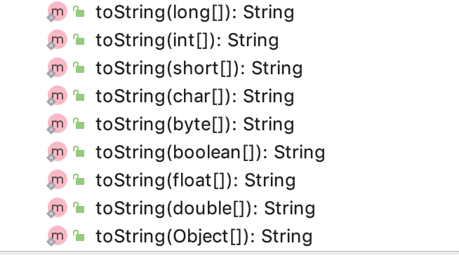

# 数组

## java数组

### 一维数组

我们在Java程序基础里介绍了数组这种数据类型。有了数组，我们还需要来操作它。

数组是一个对象，它包含了一组固定数量的元素，并且这些元素的类型是相同的。数组会按照索引的方式将元素放在指定的位置上，意味着我们可以通过索引来访问这些元素。在 Java 中，索引是从 0 开始的。

我们可以将数组理解为一个个整齐排列的单元格，每个单元格里面存放着一个元素。

数组元素的类型可以是基本数据类型（比如说 int、double），也可以是引用数据类型（比如说 String），包括自定义类型。

数组的声明方式分两种。

先来看第一种：


```java
int[] anArray;
```

再来看第二种：


```java
int anOtherArray[];
```

不同之处就在于中括号的位置，是跟在类型关键字的后面，还是跟在变量的名称的后面。前一种的使用频率更高一些，像 ArrayList 的源码中就用了第一种方式。

同样的，数组的初始化方式也有多种，最常见的是：


```java
int[] anArray = new int[10];
```

上面这行代码中使用了 new 关键字，这就意味着数组的确是一个对象，只有对象的创建才会用到 new 关键字，基本数据类型是不用的。然后，我们需要在方括号中指定数组的长度。

这时候，数组中的每个元素都会被初始化为默认值，int 类型的就为 0，Object 类型的就为 null。 不同数据类型的默认值不同。

另外，还可以使用大括号的方式，直接初始化数组中的元素：


```java
int anOtherArray[] = new int[] {1, 2, 3, 4, 5};
```


这时候，数组的元素分别是 1、2、3、4、5，索引依次是 0、1、2、3、4，长度是 5。


下面我们来说如何去访问数组

前面提到过，可以通过索引来访问数组的元素，就像下面这样：


```java
anArray[0] = 10;
```

变量名，加上中括号，加上元素的索引，就可以访问到数组，通过“=”操作符可以对元素进行赋值。

如果索引的值超出了数组的界限，就会抛出 `ArrayIndexOutOfBoundException`。

既然数组的索引是从 0 开始，那就是到数组的 `length - 1` 结束，不要使用超出这个范围内的索引访问数组，就不会抛出数组越界的异常了。

当数组的元素非常多的时候，逐个访问数组就太辛苦了，所以需要通过遍历的方式。

通过`for`循环就可以遍历数组。因为数组的每个元素都可以通过索引来访问，因此，使用标准的`for`循环可以完成一个数组的遍历：

```java
public class Main {
    public static void main(String[] args) {
        int[] ns = { 1, 4, 9, 16, 25 };
        for (int i=0; i<ns.length; i++) {
            int n = ns[i];
            System.out.println(n);
        }
    }
}
```

为了实现`for`循环遍历，初始条件为`i=0`，因为索引总是从`0`开始，继续循环的条件为`i<ns.length`，因为当`i=ns.length`时，`i`已经超出了索引范围（索引范围是`0` ~ `ns.length-1`），每次循环后，`i++`。

第二种方式是使用`for each`循环，直接迭代数组的每个元素：

```java
public class Main {
    public static void main(String[] args) {
        int[] ns = { 1, 4, 9, 16, 25 };
        for (int n : ns) {
            System.out.println(n);
        }
    }
}
```

注意：在`for (int n : ns)`循环中，变量`n`直接拿到`ns`数组的元素，而不是索引。

显然`for each`循环更加简洁。但是，`for each`循环无法拿到数组的索引，因此，到底用哪一种`for`循环，取决于我们的需要。如果不需要关心索引的话（意味着不需要修改数组的某个元素），使用 for-each 遍历更简洁一些。当然，也可以使用 while 和 do-while 循环。

在 Java 中，可变参数用于将任意数量的参数传递给方法，来看 `varargsMethod()` 方法：


```java
void varargsMethod(String... varargs) {}
```

该方法可以接收任意数量的字符串参数，可以是 0 个或者 N 个，本质上，可变参数就是通过数组实现的。为了证明这一点，我们可以看一下反编译一后的字节码：


```java
public class VarargsDemo
{

    public VarargsDemo()
    {
    }

    transient void varargsMethod(String as[])
    {
    }
}
```

所以，我们其实可以直接将数组作为参数传递给该方法：


```java
VarargsDemo demo = new VarargsDemo();
String[] anArray = new String[] {"你好", "xiaou"};
demo.varargsMethod(anArray);
```

也可以直接传递多个字符串，通过逗号隔开的方式：


```java
demo.varargsMethod("你好", "xiaou");
```

在 Java 中，数组与 List 关系非常密切。List 封装了很多常用的方法，方便我们对集合进行一些操作，而如果直接操作数组的话，有很多不便，因为数组本身没有提供这些封装好的操作，所以有时候我们需要把数组转成 List。

最原始的方式，就是通过遍历数组的方式，一个个将数组添加到 List 中。


```java
int[] anArray = new int[] {1, 2, 3, 4, 5};

List<Integer> aList = new ArrayList<>();
for (int element : anArray) {
    aList.add(element);
}
```

更优雅的方式是通过 Arrays 类的 `asList()` 方法：


```java
List<Integer> aList = Arrays.asList(anArray);
```

不过需要注意的是，Arrays.asList 的参数需要是 Integer 数组，而 anArray 目前是 int 类型，我们需要换另外一种方式。


```java
List<Integer> aList = Arrays.stream(anArray).boxed().collect(Collectors.toList());
```

这又涉及到了 Java 流的知识，后面会讲到。

还有一个需要注意的是，Arrays.asList 方法返回的 ArrayList 并不是 `java.util.ArrayList`，它其实是 Arrays 类的一个内部类：


```java
private static class ArrayList<E> extends AbstractList<E>
        implements RandomAccess, java.io.Serializable{}
```

如果需要添加元素或者删除元素的话，需要把它转成 `java.util.ArrayList`。


```java
new ArrayList<>(Arrays.asList(anArray));
```

Java 8 新增了 Stream 流的概念，这就意味着我们也可以将数组转成 Stream 进行操作。


```java
String[] anArray = new String[] {"xiaou", "你好", "世界"};
Stream<String> aStream = Arrays.stream(anArray);
```

如果想对数组进行排序的话，可以使用 Arrays 类提供的 `sort()` 方法。

- 基本数据类型按照升序排列
- 实现了 Comparable 接口的对象按照 `compareTo()` 的排序

来看第一个例子：


```java
int[] anArray = new int[] {5, 2, 1, 4, 8};
Arrays.sort(anArray);
```

排序后的结果如下所示：


```java
[1, 2, 4, 5, 8]
```

来看第二个例子：


```java
String[] yetAnotherArray = new String[] {"A", "E", "Z", "B", "C"};
Arrays.sort(yetAnotherArray, 1, 3,
                Comparator.comparing(String::toString).reversed());
```

只对 1-3 位置上的元素进行反序，所以结果如下所示：


```text
[A, Z, E, B, C]
```

有时候，我们需要从数组中查找某个具体的元素，最直接的方式就是通过遍历的方式：


```java
int[] anArray = new int[] {5, 2, 1, 4, 8};
for (int i = 0; i < anArray.length; i++) {
    if (anArray[i] == 4) {
        System.out.println("找到了 " + i);
        break;
    }
}
```

上例中从数组中查询元素 4，找到后通过 break 关键字退出循环。

如果数组提前进行了排序，就可以使用二分查找法，这样效率就会更高一些。`Arrays.binarySearch()` 方法可供我们使用，它需要传递一个数组，和要查找的元素。


```java
int[] anArray = new int[] {1, 2, 3, 4, 5};
int index = Arrays.binarySearch(anArray, 4);
```

在了解了数组的一些规范之后，下面来看几个例题

比如一个简单的求和

```java
package 数组;

import java.util.Random;

/**
 * 〈功能概述〉<br>
 *1.求出所有数据的和
 * 2.求所有数据的平均数
 * 3.统计有多少个数据比平均数小
 * @author:xiaou
 * @date: 2022/11/26 22:06
 */
public class a8遍历数组求和 {
    public static void main(String[] args) {
        int[] arr=new int[10];
        Random r=new Random();
        for (int i = 0; i < arr.length; i++) {
            int number=r.nextInt(100)+1;
            arr[i]=number;

        }
        int sum=0;
        for (int i = 0; i < arr.length; i++) {
            sum+=arr[i];
        }
        System.out.println("数组中所有的和为"+sum);

        int avg=sum/arr.length;
        System.out.println("数组中的平均数为"+avg);
        //3
        int count=0;
        for (int i = 0; i < arr.length; i++) {
           if (arr[i]<avg){
               count++;
            }
        }
        System.out.println("一共有"+count+"个数字，比平均数小");

    }
}
```

这里我们用到了随机数的生成，也就是

```java
int randomIndex= r.nextInt(num)
//其中num为数字的意思，记录0~num但不包含num的值既生成0~num-1范围内的值
```

这个知识。

下面再来看一个经典的冒泡排序

对数组进行排序是程序中非常基本的需求。常用的排序算法有冒泡排序、插入排序和快速排序等。我们来看一下如何使用冒泡排序算法对一个整型数组从小到大进行排序：

```java
import java.util.Arrays;

public class Main {
    public static void main(String[] args) {
        int[] ns = { 28, 12, 89, 73, 65, 18, 96, 50, 8, 36 };
        // 排序前:
        System.out.println(Arrays.toString(ns));
        for (int i = 0; i < ns.length - 1; i++) {
            for (int j = 0; j < ns.length - i - 1; j++) {
                if (ns[j] > ns[j+1]) {
                    // 交换ns[j]和ns[j+1]:
                    int tmp = ns[j];
                    ns[j] = ns[j+1];
                    ns[j+1] = tmp;
                }
            }
        }
        // 排序后:
        System.out.println(Arrays.toString(ns));
    }
}
```

冒泡排序的特点是，每一轮循环后，最大的一个数被交换到末尾，因此，下一轮循环就可以“刨除”最后的数，每一轮循环都比上一轮循环的结束位置靠前一位。

另外，注意到交换两个变量的值必须借助一个临时变量。像这么写是错误的：

```
int x = 1;
int y = 2;

x = y; // x现在是2
y = x; // y现在还是2
```

正确的写法是：

```
int x = 1;
int y = 2;

int t = x; // 把x的值保存在临时变量t中, t现在是1
x = y; // x现在是2
y = t; // y现在是t的值1
```

实际上，Java的标准库已经内置了排序功能，我们只需要调用JDK提供的`Arrays.sort()`就可以排序：


```java
import java.util.Arrays;

public class Main {
    public static void main(String[] args) {
        int[] ns = { 28, 12, 89, 73, 65, 18, 96, 50, 8, 36 };
        Arrays.sort(ns);
        System.out.println(Arrays.toString(ns));
    }
}

```

必须注意，对数组排序实际上修改了数组本身。例如，排序前的数组是：

```
int[] ns = { 9, 3, 6, 5 };
```

在内存中，这个整型数组表示如下：

```ascii
      ┌───┬───┬───┬───┐
ns───▶│ 9 │ 3 │ 6 │ 5 │
      └───┴───┴───┴───┘
```

当我们调用`Arrays.sort(ns);`后，这个整型数组在内存中变为：

```ascii
      ┌───┬───┬───┬───┐
ns───▶│ 3 │ 5 │ 6 │ 9 │
      └───┴───┴───┴───┘
```

即变量`ns`指向的数组内容已经被改变了。

如果对一个字符串数组进行排序，例如：

```
String[] ns = { "banana", "apple", "pear" };
```

排序前，这个数组在内存中表示如下：

```ascii
                   ┌──────────────────────────────────┐
               ┌───┼──────────────────────┐           │
               │   │                      ▼           ▼
         ┌───┬─┴─┬─┴─┬───┬────────┬───┬───────┬───┬──────┬───┐
ns ─────▶│░░░│░░░│░░░│   │"banana"│   │"apple"│   │"pear"│   │
         └─┬─┴───┴───┴───┴────────┴───┴───────┴───┴──────┴───┘
           │                 ▲
           └─────────────────┘
```

调用`Arrays.sort(ns);`排序后，这个数组在内存中表示如下：

```ascii
                   ┌──────────────────────────────────┐
               ┌───┼──────────┐                       │
               │   │          ▼                       ▼
         ┌───┬─┴─┬─┴─┬───┬────────┬───┬───────┬───┬──────┬───┐
ns ─────▶│░░░│░░░│░░░│   │"banana"│   │"apple"│   │"pear"│   │
         └─┬─┴───┴───┴───┴────────┴───┴───────┴───┴──────┴───┘
           │                              ▲
           └──────────────────────────────┘
```

原来的3个字符串在内存中均没有任何变化，但是`ns`数组的每个元素指向变化了。


之后再来看一个数组反转的例子，更加巩固一下数组

```java
public class RunoobTest {
 
    /* 反转数组*/
    static void reverse(int a[], int n)
    {
        int[] b = new int[n];
        int j = n;
        for (int i = 0; i < n; i++) {
            b[j - 1] = a[i];
            j = j - 1;
        }
 
        /*输入反转数组*/
        System.out.println("反转后数组是: \n");
        for (int k = 0; k < n; k++) {
            System.out.println(b[k]);
        }
    }
 
    public static void main(String[] args)
    {
        int [] arr = {10, 20, 30, 40, 50};
        reverse(arr, arr.length);
    }
}
```

### 二维数组

二维数组是一种数据类型，可以存储多行和多列的数据。它由一系列的行和列组成，每个元素都可以通过一个行索引和列索引来访问。例如，一个3行4列的二维数组可以表示为以下形式：


```java
array = [
  [a, b, c, d],
  [e, f, g, h],
  [i, j, k, l]
]
```

在这个例子中，第一行有4个元素，第二行有4个元素，第三行有4个元素，每个元素都有一个行索引和一个列索引。例如，元素 array[1][2] 是第2行第3列的元素，它的值是 g。

使用二维数组可以有效地存储和处理表格数据，如矩阵、图像、地图等等。

定义一个二维数组如下：

```java
public class Main {
    public static void main(String[] args) {
        int[][] ns = {
            { 1, 2, 3, 4 },
            { 5, 6, 7, 8 },
            { 9, 10, 11, 12 }
        };
        System.out.println(ns.length); // 3
    }
}

```

因为`ns`包含3个数组，因此，`ns.length`为`3`。实际上`ns`在内存中的结构如下：

```ascii
                    ┌───┬───┬───┬───┐
         ┌───┐  ┌──▶│ 1 │ 2 │ 3 │ 4 │
ns ─────▶│░░░│──┘   └───┴───┴───┴───┘
         ├───┤      ┌───┬───┬───┬───┐
         │░░░│─────▶│ 5 │ 6 │ 7 │ 8 │
         ├───┤      └───┴───┴───┴───┘
         │░░░│──┐   ┌───┬───┬───┬───┐
         └───┘  └──▶│ 9 │10 │11 │12 │
                    └───┴───┴───┴───┘
```

如果我们定义一个普通数组`arr0`，然后把`ns[0]`赋值给它：

```java
public class Main {
    public static void main(String[] args) {
        int[][] ns = {
            { 1, 2, 3, 4 },
            { 5, 6, 7, 8 },
            { 9, 10, 11, 12 }
        };
        int[] arr0 = ns[0];
        System.out.println(arr0.length); // 4
    }
}

```

实际上`arr0`就获取了`ns`数组的第0个元素。因为`ns`数组的每个元素也是一个数组，因此，`arr0`指向的数组就是`{ 1, 2, 3, 4 }`。在内存中，结构如下：

```ascii
            arr0 ─────┐
                      ▼
                    ┌───┬───┬───┬───┐
         ┌───┐  ┌──▶│ 1 │ 2 │ 3 │ 4 │
ns ─────▶│░░░│──┘   └───┴───┴───┴───┘
         ├───┤      ┌───┬───┬───┬───┐
         │░░░│─────▶│ 5 │ 6 │ 7 │ 8 │
         ├───┤      └───┴───┴───┴───┘
         │░░░│──┐   ┌───┬───┬───┬───┐
         └───┘  └──▶│ 9 │10 │11 │12 │
                    └───┴───┴───┴───┘
```

访问二维数组中的元素

我们可以使用两个方括号来访问二维中的元素。

第一个表示我们要从中访问元素的数组，而第二个表示我们要访问的元素索引。

让我们用一个例子来简化上面的解释：


```java
int[][] oddNumbers = { {1, 3, 5, 7}, {9, 11, 13, 15} };

System.out.println(oddNumbers[0][0]);
// 1
```

在上面的示例中，`oddNumbers` 数组中有两个数组——`{1, 3, 5, 7}` 和 `{9, 11, 13, 15}`。

第一个数组——`{1, 3, 5, 7}`——用 0 表示。

第二个数组——`{9, 11, 13, 15}`——用 1 表示。

第一个数组是 0，第二个是 1，第三个是 2，依此类推。

因此，要访问第一个数组中的项目，我们将 0 分配给第一个方括号。由于我们试图访问数组中的第一项，我们将使用它的索引，即 0：`oddNumbers[0][0]`。

让我们进一步分解它。

这是访问元素的代码：`oddNumbers[?][?]`。

我在两个方括号中都加上了问号——随着进展填写它们。

假设我们要访问第二个数组中的元素，我们的代码将如下所示：`oddNumbers[1][?]`。

现在我们要在第二个数组（`{9, 11, 13, 15}`）中尝试访问其中一个元素。就像一维数组一样，每个元素都有一个从零开始的索引。

因此，要访问第三个元素 `13`，我们将其索引号传递给第二个方括号：`oddNumbers[1][2]`。

来看这样一个例子：


```java
int[][] oddNumbers = { {1, 3, 5, 7}, {9, 11, 13, 15}, {17, 19, 21, 23} };
```

我们的目标是访问第三个数组中的 21。访问方式仍然通过问号来表示：`oddNumbers[?][?]`。

我们首先给第一个问号一个指向要访问的特定数组的值。

数组 0 => `{1, 3, 5, 7}`

数组 1 => `{9, 11, 13, 15}`

数组 2 => `{17, 19, 21, 23}`

我们要查找的数字在第三个数组中，所以是：`oddNumbers[2][?]`。

第二个方括号的值将指向要访问的元素。为此，我们必须指定元素的索引。以下是该数组中的索引：

17 => 索引 0

19 => 索引 1

21 => 索引 2

23 => 索引 3

21 的索引为 2，因此我们可以将其添加到第二个方括号：`oddNumbers[2][2]`。当你将其打印到控制台时，将会打印出 21。

代码如下所示：


```java
int[][] oddNumbers = { {1, 3, 5, 7}, {9, 11, 13, 15}, {17, 19, 21, 23} };

System.out.println(oddNumbers[2][2]);
// 21
```

你可以使用嵌套循环，遍历二维数组中的所有项目。这是一个例子：


```java
int[][] oddNumbers = { {1, 3, 5, 7}, {9, 11, 13, 15}, {17, 19, 21, 23} };

for(int i = 0; i < oddNumbers.length; i++){
    for(int j = 0; j < oddNumbers[i].length; j++){
        System.out.println(oddNumbers[i][j]);
    }   
}

// 1
// 3
// 5
// 7
// 9
// 11
// 13
// 15
// 17
// 19
// 21
// 23
```

上面的代码将会打印出 `oddNumbers` 数组中的所有项目。

一个比较经典的用二维数组来实现的案例就是杨辉三角

```java
import java.util.Scanner;

public class YangHuiTriangle {
    public static void main(String[] args) {
        Scanner input = new Scanner(System.in);
        System.out.print("请输入要打印的行数：");
        int n = input.nextInt();
        printYangHuiTriangle(n);
    }

    public static void printYangHuiTriangle(int n) {
        int[][] triangle = new int[n][n];

        for (int i = 0; i < n; i++) {
            // 每行的第一个和最后一个数字都是1
            triangle[i][0] = 1;
            triangle[i][i] = 1;

            for (int j = 1; j < i; j++) {
                // 其他数字是上一行的两个数字之和
                triangle[i][j] = triangle[i - 1][j - 1] + triangle[i - 1][j];
            }
        }

        // 打印杨辉三角
        for (int i = 0; i < n; i++) {
            for (int j = 0; j <= i; j++) {
                System.out.print(triangle[i][j] + " ");
            }
            System.out.println();
        }
    }
}
```

“这段代码使用了一个二维数组来存储杨辉三角中的数字。首先，程序要求用户输入要打印的行数，然后调用 printYangHuiTriangle 方法来生成和打印杨辉三角。在 printYangHuiTriangle 方法中，程序使用了一个嵌套的 for 循环来计算杨辉三角中的每个数字，并将结果存储在二维数组 triangle 中。最后，程序再次使用循环来遍历数组并打印出杨辉三角中的数字。

下面看他的打印结果

```java
请输入要打印的行数：6
1 
1 1 
1 2 1 
1 3 3 1 
1 4 6 4 1 
1 5 10 10 5 1 
```

### 打印java数组

数组其实也是一个对象，因为java就是万物皆是对象，但 Java 中并未明确的定义这样一个类。

因此数组也就没有机会覆盖 `Object.toString()` 方法。如果尝试直接打印数组的话，输出的结果并不是我们预期的结果。为什么不能直接打印数组

“首先，我们来看一下，为什么不能直接打印数组，直接打印的话，会出现什么问题。”

来看这样一个例子。


```text
String [] cmowers = {"你好"};
System.out.println(cmowers);
```

程序打印的结果是：


```text
[Ljava.lang.String;@3d075dc0
```

`[Ljava.lang.String;` 表示字符串数组的 Class 名，@ 后面的是十六进制的 hashCode——这样的打印结果太“人性化”了，一般人表示看不懂！为什么会这样显示呢？查看一下 `java.lang.Object` 类的 `toString()` 方法就明白了。


```java
public String toString() {
    return getClass().getName() + "@" + Integer.toHexString(hashCode());
}
```

再次证明，数组虽然没有显式定义成一个类，但它的确是一个对象，继承了祖先类 Object 的所有方法。


那为什么数组不单独定义一个类来表示呢？就像字符串 String 类那样呢？

一个合理的说法是 Java 将其隐藏了。假如真的存在这么一个类，就叫 Array.java 吧，我们假想一下它真实的样子，必须得有一个容器来存放数组的每一个元素，就像 String 类那样。String类我们下面会做解释，这里就不做解释了。

来简单的看一下string类的源码

```java
public final class String
    implements java.io.Serializable, Comparable<String>, CharSequence {
    /** The value is used for character storage. */
    private final char value[];
}

```


下面我们来看几种打印java数组的方式

#### stream 流打印 Java 数组

“我们来看第一种打印数组的方法，使用时髦一点的Stream 流 这个如果不会的可以跳过，我们之后会做解释

第一种形式：


```java
Arrays.asList(cmowers).stream().forEach(s -> System.out.println(s));
```

第二种形式：


```java
Stream.of(cmowers).forEach(System.out::println);
```

第三种形式：


```java
Arrays.stream(cmowers).forEach(System.out::println);
```


没错，这三种方式都可以轻松胜任本职工作，并且显得有点高大上，毕竟用到了 Stream，以及lambda 表达式

#### for 循环打印 Java 数组

“当然了，也可以使用传统的方式，for 循环。甚至 for-each 也行。”


```java
for(int i = 0; i < cmowers.length; i++){
    System.out.println(cmowers[i]);
}

for (String s : cmowers) {
    System.out.println(s);
}
```

#### Arrays 工具类打印 Java 数组


我认为 `Arrays.toString()` 是打印数组的最佳方式，没有之一。

`Arrays.toString()` 可以将任意类型的数组转成字符串，包括基本类型数组和引用类型数组。该方法有多种重载形式。



使用 `Arrays.toString()` 方法来打印数组再优雅不过了，


```java
String [] cmowers = {"java","xiaou"};
System.out.println(Arrays.toString(cmowers));
```

程序打印结果：


```text
[java,xiaou]
```

哇，打印格式不要太完美，不多不少！完全是我们预期的结果：`[]` 表明是一个数组，`,` 点和空格用来分割元素。

#### Arrays工具类打印二维数组

除了一维数组，我们还可以用工具类来打印二维数组

“可以使用 `Arrays.deepToString()` 方法。”


```java
String[][] deepArray = new String[][] {{"nihao", "你好"}, {"java"}};
System.out.println(Arrays.deepToString(deepArray));
```

打印结果如下所示。


```text
[[nihao,你好], [java]]
```

#### POJO 的打印规约

阿里巴巴的 Java 开发手册上有这样一条规约：


“什么是 POJO 呢，就是 Plain Ordinary Java Object 的缩写，一般在 Web 应用程序中建立一个数据库的映射对象时，我们称它为 POJO，这类对象不继承或不实现任何其它 Java 框架的类或接口。”

“对于这样的类，最好是重写一下它的 `toString()` 方法，方便查看这个对象到底包含了什么字段，好排查问题。”

“如果不重写的话，打印出来的 Java 对象就像直接打印数组的那样，一串谁也看不懂的字符序列。”

“可以借助 Intellij IDEA 生成重写的 `toString()` 方法，特别方便。”