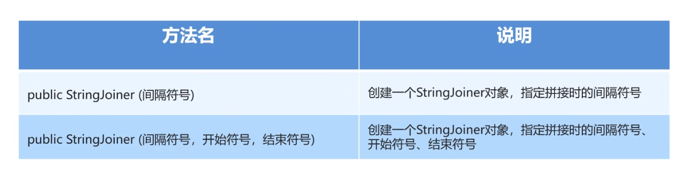
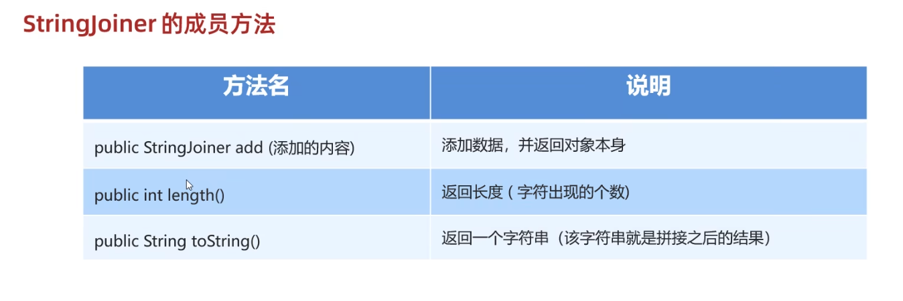
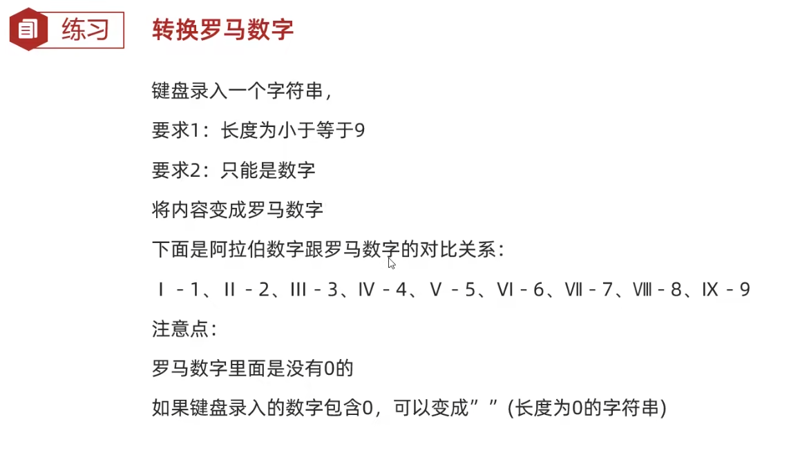
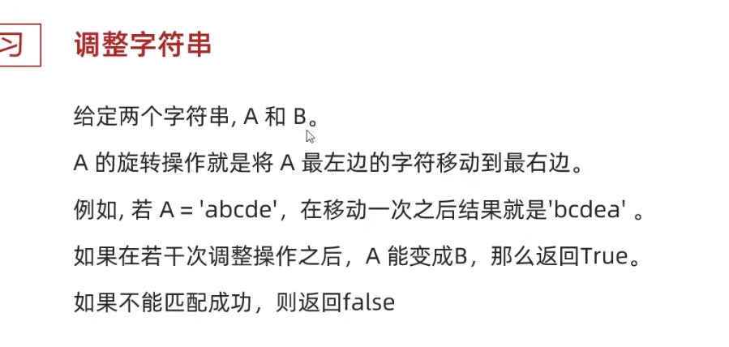

# 字符串

## Java String类

字符串广泛应用 在 Java 编程中，在 Java 中字符串属于对象，Java 提供了 String 类来创建和操作字符串。

String 被声明为 final，因此它不可被继承。(Integer 等包装类也不能被继承）在 Java 8 中，String 内部使用 char 数组存储数据。

```java
public final class String
    implements java.io.Serializable, Comparable<String>, CharSequence {
    /** The value is used for character storage. */
    private final char value[];
}
```

在 Java 9 之后，String 类的实现改用 byte 数组存储字符串，同时使用 `coder` 来标识使用了哪种编码。

```java
public final class String
    implements java.io.Serializable, Comparable<String>, CharSequence {
    /** The value is used for character storage. */
    private final byte[] value;

    /** The identifier of the encoding used to encode the bytes in {@code value}. */
    private final byte coder;
}
```

value 数组被声明为 final，这意味着 value 数组初始化之后就不能再引用其它数组。并且 String 内部没有改变 value 数组的方法，因此可以保证 String 不可变。

### 创建字符串

创建字符串最简单的方式如下:

```java
String str = "Runoob";
```


在代码中遇到字符串常量时，这里的值是 "**Runoob**"，编译器会使用该值创建一个 String 对象。

和其它对象一样，可以使用关键字和构造方法来创建 String 对象。

用构造函数创建字符串：

```java
String str2=new String("Runoob");
```

String 创建的字符串存储在公共池中，而 new 创建的字符串对象在堆上：

```java
String s1 = "Runoob";              // String 直接创建
String s2 = "Runoob";              // String 直接创建
String s3 = s1;                    // 相同引用
String s4 = new String("Runoob");   // String 对象创建
String s5 = new String("Runoob");   // String 对象创建
```


String 类有 11 种构造方法，这些方法提供不同的参数来初始化字符串，比如提供一个字符数组参数:

```java
public class StringDemo{
   public static void main(String args[]){
      char[] helloArray = { 'r', 'u', 'n', 'o', 'o', 'b'};
      String helloString = new String(helloArray);  
      System.out.println( helloString );
   }
}
```

**注意:**String 类是不可改变的，所以你一旦创建了 String 对象，那它的值就无法改变了,一会我们会介绍为什么java的字符串不可变

### 字符串长度


用于获取有关对象的信息的方法称为访问器方法。

String 类的一个访问器方法是 length() 方法，它返回字符串对象包含的字符数。

下面的代码执行后，len 变量等于 17：

```java
public class StringDemo {
    public static void main(String args[]) {
        String site = "blog.guoyaxue.top";
        int len = site.length();
        System.out.println( "我的网址长度 : " + len );
   }
}
```

执行结果如下：

```java
我的网址长度 : 17
```

## String 方法

下面是 String 类支持的方法，更多详细，参看 [Java String API](https://www.runoob.com/manual/jdk11api/java.base/java/lang/String.html) 文档:

| SN(序号) | 方法描述                                                     |
| :------- | :----------------------------------------------------------- |
| 1        | [char charAt(int index)](https://www.runoob.com/java/java-string-charat.html) 返回指定索引处的 char 值。 |
| 2        | [int compareTo(Object o)](https://www.runoob.com/java/java-string-compareto.html) 把这个字符串和另一个对象比较。 |
| 3        | [int compareTo(String anotherString)](https://www.runoob.com/java/java-string-compareto.html) 按字典顺序比较两个字符串。 |
| 4        | [int compareToIgnoreCase(String str)](https://www.runoob.com/java/java-string-comparetoignorecase.html) 按字典顺序比较两个字符串，不考虑大小写。 |
| 5        | [String concat(String str)](https://www.runoob.com/java/java-string-concat.html) 将指定字符串连接到此字符串的结尾。 |
| 6        | [boolean contentEquals(StringBuffer sb)](https://www.runoob.com/java/java-string-contentequals.html) 当且仅当字符串与指定的StringBuffer有相同顺序的字符时候返回真。 |
| 7        | [static String copyValueOf(char[\] data)](https://www.runoob.com/java/java-string-copyvalueof.html) 返回指定数组中表示该字符序列的 String。 |
| 8        | [static String copyValueOf(char[\] data, int offset, int count)](https://www.runoob.com/java/java-string-copyvalueof.html) 返回指定数组中表示该字符序列的 String。 |
| 9        | [boolean endsWith(String suffix)](https://www.runoob.com/java/java-string-endswith.html) 测试此字符串是否以指定的后缀结束。 |
| 10       | [boolean equals(Object anObject)](https://www.runoob.com/java/java-string-equals.html) 将此字符串与指定的对象比较。 |
| 11       | [boolean equalsIgnoreCase(String anotherString)](https://www.runoob.com/java/java-string-equalsignorecase.html) 将此 String 与另一个 String 比较，不考虑大小写。 |
| 12       | [byte[\] getBytes()](https://www.runoob.com/java/java-string-getbytes.html)  使用平台的默认字符集将此 String 编码为 byte 序列，并将结果存储到一个新的 byte 数组中。 |
| 13       | [byte[\] getBytes(String charsetName)](https://www.runoob.com/java/java-string-getbytes.html) 使用指定的字符集将此 String 编码为 byte 序列，并将结果存储到一个新的 byte 数组中。 |
| 14       | [void getChars(int srcBegin, int srcEnd, char[\] dst, int dstBegin)](https://www.runoob.com/java/java-string-getchars.html) 将字符从此字符串复制到目标字符数组。 |
| 15       | [int hashCode()](https://www.runoob.com/java/java-string-hashcode.html) 返回此字符串的哈希码。 |
| 16       | [int indexOf(int ch)](https://www.runoob.com/java/java-string-indexof.html) 返回指定字符在此字符串中第一次出现处的索引。 |
| 17       | [int indexOf(int ch, int fromIndex)](https://www.runoob.com/java/java-string-indexof.html) 返回在此字符串中第一次出现指定字符处的索引，从指定的索引开始搜索。 |
| 18       | [int indexOf(String str)](https://www.runoob.com/java/java-string-indexof.html)  返回指定子字符串在此字符串中第一次出现处的索引。 |
| 19       | [int indexOf(String str, int fromIndex)](https://www.runoob.com/java/java-string-indexof.html) 返回指定子字符串在此字符串中第一次出现处的索引，从指定的索引开始。 |
| 20       | [String intern()](https://www.runoob.com/java/java-string-intern.html)  返回字符串对象的规范化表示形式。 |
| 21       | [int lastIndexOf(int ch)](https://www.runoob.com/java/java-string-lastindexof.html)  返回指定字符在此字符串中最后一次出现处的索引。 |
| 22       | [int lastIndexOf(int ch, int fromIndex)](https://www.runoob.com/java/java-string-lastindexof.html) 返回指定字符在此字符串中最后一次出现处的索引，从指定的索引处开始进行反向搜索。 |
| 23       | [int lastIndexOf(String str)](https://www.runoob.com/java/java-string-lastindexof.html) 返回指定子字符串在此字符串中最右边出现处的索引。 |
| 24       | [int lastIndexOf(String str, int fromIndex)](https://www.runoob.com/java/java-string-lastindexof.html)  返回指定子字符串在此字符串中最后一次出现处的索引，从指定的索引开始反向搜索。 |
| 25       | [int length()](https://www.runoob.com/java/java-string-length.html) 返回此字符串的长度。 |
| 26       | [boolean matches(String regex)](https://www.runoob.com/java/java-string-matches.html) 告知此字符串是否匹配给定的正则表达式。 |
| 27       | [boolean regionMatches(boolean ignoreCase, int toffset, String other, int ooffset, int len)](https://www.runoob.com/java/java-string-regionmatches.html) 测试两个字符串区域是否相等。 |
| 28       | [boolean regionMatches(int toffset, String other, int ooffset, int len)](https://www.runoob.com/java/java-string-regionmatches.html) 测试两个字符串区域是否相等。 |
| 29       | [String replace(char oldChar, char newChar)](https://www.runoob.com/java/java-string-replace.html) 返回一个新的字符串，它是通过用 newChar 替换此字符串中出现的所有 oldChar 得到的。 |
| 30       | [String replaceAll(String regex, String replacement)](https://www.runoob.com/java/java-string-replaceall.html) 使用给定的 replacement 替换此字符串所有匹配给定的正则表达式的子字符串。 |
| 31       | [String replaceFirst(String regex, String replacement)](https://www.runoob.com/java/java-string-replacefirst.html)  使用给定的 replacement 替换此字符串匹配给定的正则表达式的第一个子字符串。 |
| 32       | [String[\] split(String regex)](https://www.runoob.com/java/java-string-split.html) 根据给定正则表达式的匹配拆分此字符串。 |
| 33       | [String[\] split(String regex, int limit)](https://www.runoob.com/java/java-string-split.html) 根据匹配给定的正则表达式来拆分此字符串。 |
| 34       | [boolean startsWith(String prefix)](https://www.runoob.com/java/java-string-startswith.html) 测试此字符串是否以指定的前缀开始。 |
| 35       | [boolean startsWith(String prefix, int toffset)](https://www.runoob.com/java/java-string-startswith.html) 测试此字符串从指定索引开始的子字符串是否以指定前缀开始。 |
| 36       | [CharSequence subSequence(int beginIndex, int endIndex)](https://www.runoob.com/java/java-string-subsequence.html)  返回一个新的字符序列，它是此序列的一个子序列。 |
| 37       | [String substring(int beginIndex)](https://www.runoob.com/java/java-string-substring.html) 返回一个新的字符串，它是此字符串的一个子字符串。 |
| 38       | [String substring(int beginIndex, int endIndex)](https://www.runoob.com/java/java-string-substring.html) 返回一个新字符串，它是此字符串的一个子字符串。 |
| 39       | [char[\] toCharArray()](https://www.runoob.com/java/java-string-tochararray.html) 将此字符串转换为一个新的字符数组。 |
| 40       | [String toLowerCase()](https://www.runoob.com/java/java-string-tolowercase.html) 使用默认语言环境的规则将此 String 中的所有字符都转换为小写。 |
| 41       | [String toLowerCase(Locale locale)](https://www.runoob.com/java/java-string-tolowercase.html)  使用给定 Locale 的规则将此 String 中的所有字符都转换为小写。 |
| 42       | [String toString()](https://www.runoob.com/java/java-string-tostring.html)  返回此对象本身（它已经是一个字符串！）。 |
| 43       | [String toUpperCase()](https://www.runoob.com/java/java-string-touppercase.html) 使用默认语言环境的规则将此 String 中的所有字符都转换为大写。 |
| 44       | [String toUpperCase(Locale locale)](https://www.runoob.com/java/java-string-touppercase.html) 使用给定 Locale 的规则将此 String 中的所有字符都转换为大写。 |
| 45       | [String trim()](https://www.runoob.com/java/java-string-trim.html) 返回字符串的副本，忽略前导空白和尾部空白。 |
| 46       | [static String valueOf(primitive data type x)](https://www.runoob.com/java/java-string-valueof.html) 返回给定data type类型x参数的字符串表示形式。 |
| 47       | [contains(CharSequence chars)](https://www.runoob.com/java/java-string-contains.html) 判断是否包含指定的字符系列。 |
| 48       | [isEmpty()](https://www.runoob.com/java/java-string-isempty.html) 判断字符串是否为空。 |


在有了这些方法的前提下，就可以来进行一些案例的编写

比如下面的案例

```java
package 字符串;

import java.util.Scanner;

/*
已知正确的用户名和密码，请用程序进行模拟登录。
总共有三次机会。登录之后，会给出相应的提示
 */
public class a3用户登录 {
    public static void main(String[] args) {
        //1.定义变量
        String rightUsername="yuanfang";
        String rightPassword="123456";

        for (int i = 0; i < 3; i++) {
            Scanner sc=new Scanner(System.in);
            System.out.println("请输入用户名");
            String username = sc.next();
            System.out.println("请输入密码");
            String password = sc.next();

            if (username.equals(rightUsername)&&password.equals(rightPassword)){
                System.out.println("用户登录成功");
                break;
            }else {
                if (i==2){
                    System.out.println("你的账户"+username+"被锁定");
                }else{
                    System.out.println("用户名或密码错误您还剩下"+(2-i)+"次机会");
                }

            }
        }
    }
}

```

总体来说还是非常的简单的，这里要注意的是。字符串的比较不能直接用==。要使用equals方法来进行比较。


## 解读String源码

我们以java8的为例进行解读，这里也是涉及到面试的东西，可以当做一个了解

### String 类的声明


```java
public final class String
    implements java.io.Serializable, Comparable<String>, CharSequence {
}
```

“第一，String 类是 final 的，意味着它不能被子类继承。”

“第二，String 类实现了 Serializable 接口，意味着它可以序列化。”

“第三，String 类实现了 Comparable 接口，意味着最好不要用‘==’来比较两个字符串是否相等，而应该用 `compareTo()` 方法去比较。”

因为 == 是用来比较两个对象的地址，这个在讲字符串比较的时候会详细讲。如果只是说比较字符串内容的话，可以使用 String 类的 equals 方法：


```java
public boolean equals(Object anObject) {
    if (this == anObject) {
        return true;
    }
    if (anObject instanceof String) {
        String anotherString = (String) anObject;
        int n = value.length;
        if (n == anotherString.value.length) {
            char v1[] = value;
            char v2[] = anotherString.value;
            int i = 0;
            while (n-- != 0) {
                if (v1[i] != v2[i])
                    return false;
                i++;
            }
            return true;
        }
    }
    return false;
}
```

“第四，StringBuffer、StringBuilder 和 String 一样，都实现了 CharSequence 接口，所以它们仨属于近亲。由于 String 是不可变的，所以遇到字符串拼接的时候就可以考虑一下 String 的另外两个好兄弟，StringBuffer 和 StringBuilder，它俩是可变的。”

### String 类的底层实现


```java
private final char value[];
```

“第五，Java 9 以前，String 是用 char 型数组实现的，之后改成了 byte 型数组实现，并增加了 coder 来表示编码。这样做的好处是在 Latin1 字符为主的程序里，可以把 String 占用的内存减少一半。当然，天下没有免费的午餐，这个改进在节省内存的同时引入了编码检测的开销。”

> Latin1（Latin-1）是一种单字节字符集（即每个字符只使用一个字节的编码方式），也称为ISO-8859-1（国际标准化组织8859-1），它包含了西欧语言中使用的所有字符，包括英语、法语、德语、西班牙语、葡萄牙语、意大利语等等。在Latin1编码中，每个字符使用一个8位（即一个字节）的编码，可以表示256种不同的字符，其中包括ASCII字符集中的所有字符，即0x00到0x7F，以及其他西欧语言中的特殊字符，例如é、ü、ñ等等。由于Latin1只使用一个字节表示一个字符，因此在存储和传输文本时具有较小的存储空间和较快的速度


```java
public final class String
    implements java.io.Serializable, Comparable<String>, CharSequence {
    @Stable
    private final byte[] value;
    private final byte coder;
    private int hash;
}
```

接下来，我们来详细地说一下。

从 `char[]` 到 `byte[]`，最主要的目的是**节省字符串占用的内存空间**。内存占用减少带来的另外一个好处，就是 GC 次数也会减少。

我们使用 `jmap -histo:live pid | head -n 10` 命令就可以查看到堆内对象示例的统计信息、查看 ClassLoader 的信息以及 finalizer 队列。

以我正在运行着的编程喵项目实例（基于 Java 8）来说，结果是这样的。


其中 String 对象有 17638 个，占用了 423312 个字节的内存，排在第三位。

由于 Java 8 的 String 内部实现仍然是 `char[]`，所以我们可以看到内存占用排在第 1 位的就是 char 数组。

`char[]` 对象有 17673 个，占用了 1621352 个字节的内存，排在第一位。

那也就是说优化 String 节省内存空间是非常有必要的，如果是去优化一个使用频率没有 String 这么高的类，就没什么必要，对吧？

众所周知，char 类型的数据在 JVM 中是占用两个字节的，并且使用的是 UTF-8 编码，其值范围在 '\u0000'（0）和 '\uffff'（65,535）（包含）之间。

也就是说，使用 `char[]` 来表示 String 就会导致，即使 String 中的字符只用一个字节就能表示，也得占用两个字节。

> PS：在计算机中，单字节字符通常指的是一个字节（8位）可以表示的字符，而双字节字符则指需要两个字节（16位）才能表示的字符。单字节字符和双字节字符的定义是相对的，不同的编码方式对应的单字节和双字节字符集也不同。常见的单字节字符集有ASCII（美国信息交换标准代码）、ISO-8859（国际标准化组织标准编号8859）、GBK（汉字内码扩展规范）、GB2312（中国国家标准，现在已经被GBK取代），像拉丁字母、数字、标点符号、控制字符都是单字节字符。双字节字符集包括 Unicode、UTF-8、GB18030（中国国家标准），中文、日文、韩文、拉丁文扩展字符属于双字节字符。

当然了，仅仅将 `char[]` 优化为 `byte[]` 是不够的，还要配合 Latin-1 的编码方式，该编码方式是用单个字节来表示字符的，这样就比 UTF-8 编码节省了更多的空间。

换句话说，对于：


```java
String name = "jack";
```

这样的，使用 Latin-1 编码，占用 4 个字节就够了。

但对于：


```java
String name = "小二";
```

这种，木的办法，只能使用 UTF16 来编码。

针对 JDK 9 的 String 源码里，为了区别编码方式，追加了一个 coder 字段来区分。


```java
/**
 * The identifier of the encoding used to encode the bytes in
 * {@code value}. The supported values in this implementation are
 *
 * LATIN1
 * UTF16
 *
 * @implNote This field is trusted by the VM, and is a subject to
 * constant folding if String instance is constant. Overwriting this
 * field after construction will cause problems.
 */
private final byte coder;
```

Java 会根据字符串的内容自动设置为相应的编码，要么 Latin-1 要么 UTF16。

也就是说，从 `char[]` 到 `byte[]`，**中文是两个字节，纯英文是一个字节，在此之前呢，中文是两个字节，英文也是两个字节**。

在 UTF-8 中，0-127 号的字符用 1 个字节来表示，使用和 ASCII 相同的编码。只有 128 号及以上的字符才用 2 个、3 个或者 4 个字节来表示。

- 如果只有一个字节，那么最高的比特位为 0；
- 如果有多个字节，那么第一个字节从最高位开始，连续有几个比特位的值为 1，就使用几个字节编码，剩下的字节均以 10 开头。

具体的表现形式为：

- 0xxxxxxx：一个字节；
- 110xxxxx 10xxxxxx：两个字节编码形式（开始两个 1）；
- 1110xxxx 10xxxxxx 10xxxxxx：三字节编码形式（开始三个 1）；
- 11110xxx 10xxxxxx 10xxxxxx 10xxxxxx：四字节编码形式（开始四个 1）。

也就是说，UTF-8 是变长的，那对于 String 这种有随机访问方法的类来说，就很不方便。所谓的随机访问，就是charAt、subString这种方法，随便指定一个数字，String要能给出结果。如果字符串中的每个字符占用的内存是不定长的，那么进行随机访问的时候，就需要从头开始数每个字符的长度，才能找到你想要的字符。

那你可能会问，UTF-16也是变长的呢？一个字符还可能占用 4 个字节呢？

的确，UTF-16 使用 2 个或者 4 个字节来存储字符。

- 对于 Unicode 编号范围在 0 ~ FFFF 之间的字符，UTF-16 使用两个字节存储。
- 对于 Unicode 编号范围在 10000 ~ 10FFFF 之间的字符，UTF-16 使用四个字节存储，具体来说就是：将字符编号的所有比特位分成两部分，较高的一些比特位用一个值介于 D800~DBFF 之间的双字节存储，较低的一些比特位（剩下的比特位）用一个值介于 DC00~DFFF 之间的双字节存储。

但是在 Java 中，一个字符（char）就是 2 个字节，占 4 个字节的字符，在 Java 里也是用两个 char 来存储的，而String的各种操作，都是以Java的字符（char）为单位的，charAt是取得第几个char，subString取的也是第几个到第几个char组成的子串，甚至length返回的都是char的个数。

所以UTF-16在Java的世界里，就可以视为一个定长的编码。

> 参考链接：[https://www.zhihu.com/question/447224628open in new window](https://www.zhihu.com/question/447224628)

###  类的 hashCode 方法

“第六，每一个字符串都会有一个 hash 值，这个哈希值在很大概率是不会重复的，因此 String 很适合来作为 HashMap的键值。”

来看 String 类的 hashCode 方法。


```java
private int hash; // Cache the hash code for the string

public int hashCode() {
    int h = hash;
    if (h == 0 && value.length > 0) {
        char val[] = value;

        for (int i = 0; i < value.length; i++) {
            h = 31 * h + val[i];
        }
        hash = h;
    }
    return h;
}
```

hashCode 方法首先检查是否已经计算过哈希码，如果已经计算过，则直接返回缓存的哈希码。否则，方法将使用一个循环遍历字符串的所有字符，并使用一个乘法和加法的组合计算哈希码。这种计算方法被称为“31 倍哈希法”。计算完成后，将得到的哈希值存储在 hash 成员变量中，以便下次调用 hashCode 方法时直接返回该值，而不需要重新计算。这是一种缓存优化，称为“惰性计算”。

31倍哈希法（31-Hash）是一种简单有效的字符串哈希算法，常用于对字符串进行哈希处理。该算法的基本思想是将字符串中的每个字符乘以一个固定的质数31的幂次方，并将它们相加得到哈希值。具体地，假设字符串为s，长度为n，则31倍哈希值计算公式如下：


```text
H(s) = (s[0] * 31^(n-1)) + (s[1] * 31^(n-2)) + ... + (s[n-1] * 31^0)
```

其中，s[i]表示字符串s中第i个字符的ASCII码值，`^`表示幂运算。

31倍哈希法的优点在于简单易实现，计算速度快，同时也比较均匀地分布在哈希表中。

hashCode 方法，我们会在另外一个章节里详细讲。

我们可以通过以下方法模拟 String 的 hashCode 方法：


```java
public class HashCodeExample {
    public static void main(String[] args) {
        String text = "小u博客";
        int hashCode = computeHashCode(text);
        System.out.println("字符串 \"" + text + "\" 的哈希码是: " + hashCode);

        System.out.println("String 的 hashCode " + text.hashCode());
    }

    public static int computeHashCode(String text) {
        int h = 0;
        for (int i = 0; i < text.length(); i++) {
            h = 31 * h + text.charAt(i);
        }
        return h;
    }
}
```

看一下结果：


```text
字符串 "xiaou博客" 的哈希码是: -2068961410
String 的 hashCode -2068961410
```

结果是一样的，又学到了吧？

### String 类的 substring 方法

String 类中还有一个方法比较常用 substring，用来截取字符串的，来看源码。


```java
public String substring(int beginIndex) {
    if (beginIndex < 0) {
        throw new StringIndexOutOfBoundsException(beginIndex);
    }
    int subLen = value.length - beginIndex;
    if (subLen < 0) {
        throw new StringIndexOutOfBoundsException(subLen);
    }
    return (beginIndex == 0) ? this : new String(value, beginIndex, subLen);
}
```

substring 方法首先检查参数的有效性，如果参数无效，则抛出 StringIndexOutOfBoundsException 异常。接下来，方法根据参数计算子字符串的长度。如果子字符串长度小于零，抛出StringIndexOutOfBoundsException异常。

如果 beginIndex 为 0，且 endIndex 等于字符串的长度，说明子串与原字符串相同，因此直接返回原字符串。否则，使用 value 数组（原字符串的字符数组）的一部分创建一个新的 String 对象并返回。

下面是几个使用 substring 方法的示例：

①、提取字符串中的一段子串：


```java
String str = "Hello, world!";
String subStr = str.substring(7, 12);  // 从第7个字符（包括）提取到第12个字符（不包括）
System.out.println(subStr);  // 输出 "world"
```

②、提取字符串中的前缀或后缀：


```java
String str = "Hello, world!";
String prefix = str.substring(0, 5);  // 提取前5个字符，即 "Hello,"
String suffix = str.substring(7);     // 提取从第7个字符开始的所有字符，即 "world!"
```

③、处理字符串中的空格和分隔符：


```java
String str = "   Hello,   world!  ";
String trimmed = str.trim();                  // 去除字符串开头和结尾的空格
String[] words = trimmed.split("\\s+");       // 将字符串按照空格分隔成单词数组
String firstWord = words[0].substring(0, 1);  // 提取第一个单词的首字母
System.out.println(firstWord);                // 输出 "H"
```

④、处理字符串中的数字和符号：


```java
String str = "1234-5678-9012-3456";
String[] parts = str.split("-");             // 将字符串按照连字符分隔成四个部分
String last4Digits = parts[3].substring(1);  // 提取最后一个部分的后三位数字
System.out.println(last4Digits);             // 输出 "456"
```

总之，substring 方法可以根据需求灵活地提取字符串中的子串，为字符串处理提供了便利。

### String 类的 indexOf 方法

indexOf 方法用于查找一个子字符串在原字符串中第一次出现的位置，并返回该位置的索引。来看该方法的源码：


```java
/*
 * 查找字符数组 target 在字符数组 source 中第一次出现的位置。
 * sourceOffset 和 sourceCount 参数指定 source 数组中要搜索的范围，
 * targetOffset 和 targetCount 参数指定 target 数组中要搜索的范围，
 * fromIndex 参数指定开始搜索的位置。
 * 如果找到了 target 数组，则返回它在 source 数组中的位置索引（从0开始），
 * 否则返回-1。
 */
static int indexOf(char[] source, int sourceOffset, int sourceCount,
        char[] target, int targetOffset, int targetCount,
        int fromIndex) {
    // 如果开始搜索的位置已经超出 source 数组的范围，则直接返回-1（如果 target 数组为空，则返回 sourceCount）
    if (fromIndex >= sourceCount) {
        return (targetCount == 0 ? sourceCount : -1);
    }
    // 如果开始搜索的位置小于0，则从0开始搜索
    if (fromIndex < 0) {
        fromIndex = 0;
    }
    // 如果 target 数组为空，则直接返回开始搜索的位置
    if (targetCount == 0) {
        return fromIndex;
    }

    // 查找 target 数组的第一个字符在 source 数组中的位置
    char first = target[targetOffset];
    int max = sourceOffset + (sourceCount - targetCount);

    // 循环查找 target 数组在 source 数组中的位置
    for (int i = sourceOffset + fromIndex; i <= max; i++) {
        /* Look for first character. */
        // 如果 source 数组中当前位置的字符不是 target 数组的第一个字符，则在 source 数组中继续查找 target 数组的第一个字符
        if (source[i] != first) {
            while (++i <= max && source[i] != first);
        }

        /* Found first character, now look at the rest of v2 */
        // 如果在 source 数组中找到了 target 数组的第一个字符，则继续查找 target 数组的剩余部分是否匹配
        if (i <= max) {
            int j = i + 1;
            int end = j + targetCount - 1;
            for (int k = targetOffset + 1; j < end && source[j]
                    == target[k]; j++, k++);

            // 如果 target 数组全部匹配，则返回在 source 数组中的位置索引
            if (j == end) {
                /* Found whole string. */
                return i - sourceOffset;
            }
        }
    }
    // 没有找到 target 数组，则返回-1
    return -1;
}
```

来看示例。

①、示例1：查找子字符串的位置


```java
String str = "Hello, world!";
int index = str.indexOf("world");  // 查找 "world" 子字符串在 str 中第一次出现的位置
System.out.println(index);        // 输出 7
```

②、示例2：查找字符串中某个字符的位置


```java
String str = "Hello, world!";
int index = str.indexOf(",");     // 查找逗号在 str 中第一次出现的位置
System.out.println(index);        // 输出 5
```

③、示例3：查找子字符串的位置（从指定位置开始查找）


```java
String str = "Hello, world!";
int index = str.indexOf("l", 3);  // 从索引为3的位置开始查找 "l" 子字符串在 str 中第一次出现的位置
System.out.println(index);        // 输出 3
```

④、示例4：查找多个子字符串


```java
String str = "Hello, world!";
int index1 = str.indexOf("o");    // 查找 "o" 子字符串在 str 中第一次出现的位置
int index2 = str.indexOf("o", 5); // 从索引为5的位置开始查找 "o" 子字符串在 str 中第一次出现的位置
System.out.println(index1);       // 输出 4
System.out.println(index2);       // 输出 8
```

###  类的其他方法

比如说 `length()` 用于返回字符串长度。

比如说 `isEmpty()` 用于判断字符串是否为空。

比如说 `charAt()` 用于返回指定索引处的字符。

比如说 `getBytes()` 用于返回字符串的字节数组，可以指定编码方式，比如说：


```java
String text = "java";
System.out.println(Arrays.toString(text.getBytes(StandardCharsets.UTF_8)));
```

比如说 `trim()` 用于去除字符串两侧的空白字符，来看源码：


```java
public String trim() {
    int len = value.length;
    int st = 0;
    char[] val = value;    /* avoid getfield opcode */

    while ((st < len) && (val[st] <= ' ')) {
        st++;
    }
    while ((st < len) && (val[len - 1] <= ' ')) {
        len--;
    }
    return ((st > 0) || (len < value.length)) ? substring(st, len) : this;
}
```

## string字符串为什么不可变

String 可能是 Java 中使用频率最高的引用类型了，因此 String 类的设计者可以说是用心良苦。

比如说 String 的不可变性。

- String 类被 final 关键字修饰，所以它不会有子类，这就意味着没有子类可以重写它的方法，改变它的行为。
- String 类的数据存储在 `char[]` 数组中，而这个数组也被 final 关键字修饰了，这就表示 String 对象是没法被修改的，只要初始化一次，值就确定了。


```java
public final class String
    implements java.io.Serializable, Comparable<String>, CharSequence {
    /** The value is used for character storage. */
    private final char value[];
}
```

那么这样写，有什么好处呢。

第一，可以保证 String 对象的安全性，避免被篡改，毕竟像密码这种隐私信息一般就是用字符串存储的。

以下是一个简单的 Java 示例，演示了字符串的不可变性如何有助于保证 String 对象的安全性。在本例中，我们创建了一个简单的 User 类，该类使用 String 类型的字段存储用户名和密码。同时，我们使用一个静态方法 getUserCredentials 从外部获取用户凭据。


```java
class User {
    private String username;
    private String password;

    public User(String username, String password) {
        this.username = username;
        this.password = password;
    }

    public String getUsername() {
        return username;
    }

    public String getPassword() {
        return password;
    }
}

public class StringSecurityExample {
    public static void main(String[] args) {
        String username = "小u";
        String password = "123456";
        User user = new User(username, password);

        // 获取用户凭据
        String[] credentials = getUserCredentials(user);

        // 尝试修改从 getUserCredentials 返回的用户名和密码字符串
        credentials[0] = "小李";
        credentials[1] = "612311";

        // 输出原始 User 对象中的用户名和密码
        System.out.println("原始用户名: " + user.getUsername());
        System.out.println("原始密码: " + user.getPassword());
    }

    public static String[] getUserCredentials(User user) {
        String[] credentials = new String[2];
        credentials[0] = user.getUsername();
        credentials[1] = user.getPassword();
        return credentials;
    }
}
```

在这个示例中，尽管我们尝试修改 getUserCredentials 返回的字符串数组（即用户名和密码），但原始 User 对象中的用户名和密码保持不变。这证明了字符串的不可变性有助于保护 String 对象的安全性。

第二，保证哈希值不会频繁变更。毕竟要经常作为哈希表的键值，经常变更的话，哈希表的性能就会很差劲。

在 String 类中，哈希值是在第一次计算时缓存的，后续对该哈希值的请求将直接使用缓存值。这有助于提高哈希表等数据结构的性能。以下是一个简单的示例，演示了字符串的哈希值缓存机制：


```java
String text1 = "1";
String text2 = "1";

// 计算字符串 text1 的哈希值，此时会进行计算并缓存哈希值
int hashCode1 = text1.hashCode();
System.out.println("第一次计算 text1 的哈希值: " + hashCode1);

// 再次计算字符串 text1 的哈希值，此时直接返回缓存的哈希值
int hashCode1Cached = text1.hashCode();
System.out.println("第二次计算: " + hashCode1Cached);

// 计算字符串 text2 的哈希值，由于字符串常量池的存在，实际上 text1 和 text2 指向同一个字符串对象
// 所以这里直接返回缓存的哈希值
int hashCode2 = text2.hashCode();
System.out.println("text2 直接使用缓存: " + hashCode2);
```

在这个示例中，我们创建了两个具有相同内容的字符串 text1 和 text2。首次计算 text1 的哈希值时，会进行实际计算并缓存该值。当我们再次计算 text1 的哈希值或计算具有相同内容的 text2 的哈希值时，将直接返回缓存的哈希值，而不进行重新计算。

由于 String 对象是不可变的，其哈希值在创建后不会发生变化。这使得 String 类可以缓存哈希值，提高哈希表等数据结构的性能。如果 String 是可变的，那么在每次修改时都需要重新计算哈希值，这会降低性能。

第三，可以实现字符串常量池，Java 会将相同内容的字符串存储在字符串常量池中。这样，具有相同内容的字符串变量可以指向同一个 String 对象，节省内存空间。

“由于字符串的不可变性，String 类的一些方法实现最终都返回了新的字符串对象。”

“就拿 `substring()` 方法来说。”


```java
public String substring(int beginIndex) {
    if (beginIndex < 0) {
        throw new StringIndexOutOfBoundsException(beginIndex);
    }
    int subLen = value.length - beginIndex;
    if (subLen < 0) {
        throw new StringIndexOutOfBoundsException(subLen);
    }
    return (beginIndex == 0) ? this : new String(value, beginIndex, subLen);
}
```

`substring()` 方法用于截取字符串，最终返回的都是 new 出来的新字符串对象。

“还有 `concat()` 方法。”


```java
public String concat(String str) {
    int olen = str.length();
    if (olen == 0) {
        return this;
    }
    if (coder() == str.coder()) {
        byte[] val = this.value;
        byte[] oval = str.value;
        int len = val.length + oval.length;
        byte[] buf = Arrays.copyOf(val, len);
        System.arraycopy(oval, 0, buf, val.length, oval.length);
        return new String(buf, coder);
    }
    int len = length();
    byte[] buf = StringUTF16.newBytesFor(len + olen);
    getBytes(buf, 0, UTF16);
    str.getBytes(buf, len, UTF16);
    return new String(buf, UTF16);
}
```

`concat()` 方法用于拼接字符串，不管编码是否一致，最终也返回的是新的字符串对象。

“`replace()` 替换方法其实也一样，你可以自己一会看一下源码，也是返回新的字符串对象。”

“这就意味着，不管是截取、拼接，还是替换，都不是在原有的字符串上进行的，而是重新生成了新的字符串对象。也就是说，这些操作执行过后，**原来的字符串对象并没有发生改变**。”

**线程安全**

String 不可变性天生具备线程安全，可以在多个线程中安全地使用。

 **String Pool 的需要**

如果一个 String 对象已经被创建过了，那么就会从 String Pool 中取得引用。只有 String 是不可变的，才可能使用 String Pool。


string pool也叫做字符串常量值，这个之后会介绍的。

## String Pool

字符串常量池（String Pool）保存着所有字符串字面量（literal strings），这些字面量在编译时期就确定。不仅如此，还可以使用 String 的 intern() 方法在运行过程将字符串添加到 String Pool 中。

当一个字符串调用 intern() 方法时，如果 String Pool 中已经存在一个字符串和该字符串值相等（使用 equals() 方法进行确定），那么就会返回 String Pool 中字符串的引用；否则，就会在 String Pool 中添加一个新的字符串，并返回这个新字符串的引用。

下面示例中，s1 和 s2 采用 new String() 的方式新建了两个不同字符串，而 s3 和 s4 是通过 s1.intern() 和 s2.intern() 方法取得同一个字符串引用。intern() 首先把 "aaa" 放到 String Pool 中，然后返回这个字符串引用，因此 s3 和 s4 引用的是同一个字符串。

```java
String s1 = new String("aaa");
String s2 = new String("aaa");
System.out.println(s1 == s2);           // false
String s3 = s1.intern();
String s4 = s2.intern();
System.out.println(s3 == s4);           // true
```

如果是采用 "bbb" 这种字面量的形式创建字符串，会自动地将字符串放入 String Pool 中。

```java
String s5 = "bbb";
String s6 = "bbb";
System.out.println(s5 == s6);  // true
```

在 Java 7 之前，String Pool 被放在运行时常量池中，它属于永久代。而在 Java 7，String Pool 被移到堆中。这是因为永久代的空间有限，在大量使用字符串的场景下会导致 OutOfMemoryError 错误。


## String, StringBuffer and StringBuilder

**1. 可变性**

- String 不可变
- StringBuffer 和 StringBuilder 可变

**2. 线程安全**

- String 不可变，因此是线程安全的
- StringBuilder 不是线程安全的
- StringBuffer 是线程安全的，内部使用 synchronized 进行同步


下面来看他们的用法

由于字符串是不可变的，所以当遇到字符串拼接(尤其是使用`+`号操作符）的时候，就需要考量性能的问题，你不能毫无顾虑地生产太多 String 对象，对珍贵的内存造成不必要的压力。

于是 Java 就设计了一个专门用来解决此问题的 StringBuffer 类。


```java
public final class StringBuffer extends AbstractStringBuilder implements Serializable, CharSequence {

    public StringBuffer() {
        super(16);
    }
    
    public synchronized StringBuffer append(String str) {
        super.append(str);
        return this;
    }

    public synchronized String toString() {
        return new String(value, 0, count);
    }

    // 其他方法
}
```

不过，由于 StringBuffer 操作字符串的方法加了 `synchronized` 关键字进行了同步，主要是考虑到多线程环境下的安全问题，所以执行效率会比较低。

于是 Java 就给 StringBuffer “生了个兄弟”，名叫 StringBuilder，说，“孩子，你别管线程安全了，你就在单线程环境下使用，这样效率会高得多，如果要在多线程环境下修改字符串，你到时候可以使用 `ThreadLocal`来避免多线程冲突。”


```java
public final class StringBuilder extends AbstractStringBuilder
    implements java.io.Serializable, CharSequence
{
    // ...

    public StringBuilder append(String str) {
        super.append(str);
        return this;
    }

    public String toString() {
        // Create a copy, don't share the array
        return new String(value, 0, count);
    }

    // ...
}
```

除了类名不同，方法没有加 synchronized，基本上完全一样。

实际开发中，StringBuilder 的使用频率也是远高于 StringBuffer，甚至可以这么说，StringBuilder 完全取代了 StringBuffer。


stringBuilder可以看做是一个容器。创建之后里面的内容是可变的。

- 作用：提高字符串的操作效率

构造方法

- 空参构造
- 有参数

常用方法

- append添加
- reverse反转
- length返回长度
- toString可以把StringBulider变成String

下面来看具体的几个案例

```java
package 字符串;

public class a12StringBulider {
    public static void main(String[] args) {
        StringBuilder sb=new StringBuilder("你是傻逼");

        //添加元素
        sb.append(1);
        sb.append(2.3);
        sb.append(true);
        //反转
        sb.reverse();
        //获取长度
        int length = sb.length();
        System.out.println(length);

        //java在底层对他做了一些特殊处理。
        //打印对象不是地址值而是属性值
        System.out.println(sb);
        //变回字符串
        String s = sb.toString();
        
    }
}

```

最后总结一下，一般会用到StringBuilder的场景就是

- 字符串的拼接
- 字符串的反转

## new String("abc")

使用这种方式一共会创建两个字符串对象（前提是 String Pool 中还没有 "abc" 字符串对象）。

- "abc" 属于字符串字面量，因此编译时期会在 String Pool 中创建一个字符串对象，指向这个 "abc" 字符串字面量；
- 而使用 new 的方式会在堆中创建一个字符串对象。

创建一个测试类，其 main 方法中使用这种方式来创建字符串对象。

```java
public class NewStringTest {
    public static void main(String[] args) {
        String s = new String("abc");
    }
}
```

使用 javap -verbose 进行反编译，得到以下内容：

```java
// ...
Constant pool:
// ...
   #2 = Class              #18            // java/lang/String
   #3 = String             #19            // abc
// ...
  #18 = Utf8               java/lang/String
  #19 = Utf8               abc
// ...

  public static void main(java.lang.String[]);
    descriptor: ([Ljava/lang/String;)V
    flags: ACC_PUBLIC, ACC_STATIC
    Code:
      stack=3, locals=2, args_size=1
         0: new           #2                  // class java/lang/String
         3: dup
         4: ldc           #3                  // String abc
         6: invokespecial #4                  // Method java/lang/String."<init>":(Ljava/lang/String;)V
         9: astore_1
// ...
```

在 Constant Pool 中，#19 存储这字符串字面量 "abc"，#3 是 String Pool 的字符串对象，它指向 #19 这个字符串字面量。在 main 方法中，0: 行使用 new #2 在堆中创建一个字符串对象，并且使用 ldc #3 将 String Pool 中的字符串对象作为 String 构造函数的参数。

以下是 String 构造函数的源码，可以看到，在将一个字符串对象作为另一个字符串对象的构造函数参数时，并不会完全复制 value 数组内容，而是都会指向同一个 value 数组。

```java
public String(String original) {
    this.value = original.value;
    this.hash = original.hash;
}
```


## Java 字符串优化：详解 String.intern() 方法


这个是美团技术团队深入的一个东西

[深入解析String#intern - 美团技术团队 (meituan.com)](https://tech.meituan.com/2014/03/06/in-depth-understanding-string-intern.html)

原网址在这里。

要理解美团技术团队的这篇文章，你只需要记住这几点内容：

第一，使用双引号声明的字符串对象会保存在字符串常量池中。

第二，使用 new 关键字创建的字符串对象会先从字符串常量池中找，如果没找到就创建一个，然后再在堆中创建字符串对象；如果找到了，就直接在堆中创建字符串对象。

第三，针对没有使用双引号声明的字符串对象来说，就像下面代码中的 s1 那样：


```java
String s1 = new String("java") + new String("你好");
```

如果想把 s1 的内容也放入字符串常量池的话，可以调用 `intern()` 方法来完成。

不过，需要注意的是，Java 7 的时候，字符串常量池从永久代中移动到了堆中，虽然此时永久代还没有完全被移除。Java 8 的时候，永久代被彻底移除。

这个变化也直接影响了 `String.intern()` 方法在执行时的策略，Java 7 之前，执行 `String.intern()` 方法的时候，不管对象在堆中是否已经创建，字符串常量池中仍然会创建一个内容完全相同的新对象； Java 7 之后呢，由于字符串常量池放在了堆中，执行 `String.intern()` 方法的时候，如果对象在堆中已经创建了，字符串常量池中就不需要再创建新的对象了，而是直接保存堆中对象的引用，也就节省了一部分的内存空间。

例如下面的这个代码

```java
String s1 = new String("java你好");
String s2 = s1.intern();
System.out.println(s1 == s2);
```

第一行代码，字符串常量池中会先创建一个“java你好”的对象，然后堆中会再创建一个“java你好”的对象，s1 引用的是堆中的对象。

第二行代码，对 s1 执行 `intern()` 方法，该方法会从字符串常量池中查找“java你好”这个字符串是否存在，此时是存在的，所以 s2 引用的是字符串常量池中的对象。

也就意味着 s1 和 s2 的引用地址是不同的，一个来自堆，一个来自字符串常量池，所以输出的结果为 false。


```text
false
```

再看下面这个代码

```java
String s1 = new String("java") + new String("你好");
String s2 = s1.intern();
System.out.println(s1 == s2);

```

这个输出结果就是true了。


## StringJoiner

StringJoiner其实和StringBuilder一样，也可以看成是一个容器。

作用：提高字符串的操作效率，代码编写特别简单。但是目前市场上很少有人用(因为这个是在jdk8之后才有的)

他的构造方法。



之后看他的成员方法



看他一个简单的应用

```java
package 字符串;

import java.util.StringJoiner;

public class a14StringJoiner {
    public static void main(String[] args) {
        StringJoiner sj=new StringJoiner("---");
        sj.add("add").add("bbb").add("ccc");
        System.out.println(sj);
    }
}

```

这里就不做过多的介绍了。

## 字符串相等判断：Java中的equals()与==的区别与用法

“这个问题看似简单，却在 Stack Overflow 上有超过 370 万+的访问量。”我说，“这个问题也可以引申为 `.equals()` 和 ‘==’ 操作符有什么区别。”

- “==”操作符用于比较两个对象的地址是否相等。
- `.equals()` 方法用于比较两个对象的内容是否相等。

`.equals()` 就好像我们普通人，看见阿丽塔以为是洛丽塔，看见洛丽塔以为是阿丽塔，看起来一样就觉得她们是同一个人；“==”操作符就好像她们的妈妈，要求更严格，观察更细致，一眼就能分辨出谁是姐姐谁是妹妹。


```java
String alita = new String("小萝莉");
String luolita = new String("小萝莉");

System.out.println(alita.equals(luolita)); // true
System.out.println(alita == luolita); // false
```

就上面这段代码来说，`.equals()` 输出的结果为 true，而“==”操作符输出的结果为 false——前者要求内容相等就可以，后者要求必须是同一个对象。

之前已经学过了，Java 的所有类都默认地继承 Object 这个超类，该类有一个名为 `.equals()` 的方法。一边说，我一边打开了 Object 类的源码。


```java
public boolean equals(Object obj) {
    return (this == obj);
}
```

你看，Object 类的 `.equals()` 方法默认采用的是“==”操作符进行比较。假如子类没有重写该方法的话，那么“==”操作符和 `.equals()` 方法的功效就完全一样——比较两个对象的内存地址是否相等。

但实际情况中，有不少类重写了 `.equals()` 方法，因为比较内存地址的要求比较严格，不太符合现实中所有的场景需求。拿 String 类来说，我们在比较字符串的时候，的确只想判断它们俩的内容是相等的就可以了，并不想比较它们俩是不是同一个对象。

况且，字符串有字符串常量池的概念，本身就推荐使用 `String s = "字符串"` 这种形式来创建字符串对象，而不是通过 new 关键字的方式，因为可以把字符串缓存在字符串常量池中，方便下次使用，不用遇到 new 就在堆上开辟一块新的空间。

那就来看一下 String 类的 `.equals()` 方法的源码吧。


```java
public boolean equals(Object anObject) {
    if (this == anObject) {
        return true;
    }
    if (anObject instanceof String) {
        String aString = (String)anObject;
        if (coder() == aString.coder()) {
            return isLatin1() ? StringLatin1.equals(value, aString.value)
                    : StringUTF16.equals(value, aString.value);
        }
    }
    return false;
}
```

首先，如果两个字符串对象的可以“==”，那就直接返回 true 了，因为这种情况下，字符串内容是必然相等的。否则就按照字符编码进行比较，分为 UTF16 和 Latin1，差别不是很大，就拿 Latin1 的来说吧。


```java
@HotSpotIntrinsicCandidate
public static boolean equals(byte[] value, byte[] other) {
    if (value.length == other.length) {
        for (int i = 0; i < value.length; i++) {
            if (value[i] != other[i]) {
                return false;
            }
        }
        return true;
    }
    return false;
}
```

这个 JDK 版本是 Java 17，也就是最新的 LTS（长期支持）版本。该版本中，String 类使用字节数组实现的，所以比较两个字符串的内容是否相等时，可以先比较字节数组的长度是否相等，不相等就直接返回 false；否则就遍历两个字符串的字节数组，只有有一个字节不相等，就返回 false。

这是 Java 8 中的 equals 方法源码：


```java
public boolean equals(Object anObject) {
    // 判断是否为同一对象
    if (this == anObject) {
        return true;
    }
    // 判断对象是否为 String 类型
    if (anObject instanceof String) {
        String anotherString = (String)anObject;
        int n = value.length;
        // 判断字符串长度是否相等
        if (n == anotherString.value.length) {
            char v1[] = value;
            char v2[] = anotherString.value;
            int i = 0;
            // 判断每个字符是否相等
            while (n-- != 0) {
                if (v1[i] != v2[i])
                    return false;
                i++;
            }
            return true;
        }
    }
    return false;
}
```

JDK 8 比 JDK 17 更容易懂一些：首先判断两个对象是否为同一个对象，如果是，则返回 true。接着，判断对象是否为 String 类型，如果不是，则返回 false。如果对象为 String 类型，则比较两个字符串的长度是否相等，如果长度不相等，则返回 false。如果长度相等，则逐个比较每个字符是否相等，如果都相等，则返回 true，否则返回 false。


“如果要进行两个字符串对象的内容比较，除了 `.equals()` 方法，还有其他两个可选的方案。”

1）`Objects.equals()`

`Objects.equals()` 这个静态方法的优势在于不需要在调用之前判空。


```java
public static boolean equals(Object a, Object b) {
    return (a == b) || (a != null && a.equals(b));
}
```

如果直接使用 `a.equals(b)`，则需要在调用之前对 a 进行判空，否则可能会抛出空指针 `java.lang.NullPointerException`。`Objects.equals()` 用起来就完全没有这个担心。


```java
Objects.equals("小萝莉", new String("小" + "萝莉")) // --> true
Objects.equals(null, new String("小" + "萝莉")); // --> false
Objects.equals(null, null) // --> true

String a = null;
a.equals(new String("小" + "萝莉")); // throw exception
```


2）String 类的 `.contentEquals()`

`.contentEquals()` 的优势在于可以将字符串与任何的字符序列（StringBuffer、StringBuilder、String、CharSequence）进行比较。


```java
public boolean contentEquals(CharSequence cs) {
    // Argument is a StringBuffer, StringBuilder
    if (cs instanceof AbstractStringBuilder) {
        if (cs instanceof StringBuffer) {
            synchronized(cs) {
                return nonSyncContentEquals((AbstractStringBuilder)cs);
            }
        } else {
            return nonSyncContentEquals((AbstractStringBuilder)cs);
        }
    }
    // Argument is a String
    if (cs instanceof String) {
        return equals(cs);
    }
    // Argument is a generic CharSequence
    int n = cs.length();
    if (n != length()) {
        return false;
    }
    byte[] val = this.value;
    if (isLatin1()) {
        for (int i = 0; i < n; i++) {
            if ((val[i] & 0xff) != cs.charAt(i)) {
                return false;
            }
        }
    } else {
        if (!StringUTF16.contentEquals(val, cs, n)) {
            return false;
        }
    }
    return true;
}
```

从源码上可以看得出，如果 cs 是 StringBuffer，该方法还会进行同步，非常的智能化；如果是 String 的话，其实调用的还是 `equals()` 方法。当然了，这也就意味着使用该方法进行比较的时候，多出来了很多步骤，性能上有些损失。

同样来看一下 JDK 8 的源码：


```java
public boolean contentEquals(CharSequence cs) {
    // argument can be any CharSequence implementation
    if (cs.length() != value.length) {
        return false;
    }
    // Argument is a StringBuffer, StringBuilder or String
    if (cs instanceof AbstractStringBuilder) {
        char v1[] = value;
        char v2[] = ((AbstractStringBuilder)cs).getValue();
        int i = 0;
        int n = value.length;
        while (n-- != 0) {
            if (v1[i] != v2[i])
                return false;
            i++;
        }
        return true;
    }
    // Argument is a String
    if (cs.equals(this))
        return true;
    // Argument is a non-String, non-AbstractStringBuilder CharSequence
    char v1[] = value;
    int i = 0;
    int n = value.length;
    while (n-- != 0) {
        if (v1[i] != cs.charAt(i))
            return false;
        i++;
    }
    return true;
}
```

同样更容易理解一些：首先判断参数长度是否相等，不相等则返回 false。如果参数是 AbstractStringBuilder 的实例，则取出其 char 数组，遍历比较两个 char 数组的每个元素是否相等。如果参数是 String 的实例，则直接调用 equals 方法比较两个字符串是否相等。如果参数是其他实现了 CharSequence 接口的对象，则遍历比较两个对象的每个字符是否相等。

总体上感觉还是 `Objects.equals()` 比较舒服

下面来看几个例字，这些也是一作为面试，经常会考到的一些小题目。


```java
new String("小萝莉").equals("小萝莉")
true
```

```java
new String("小萝莉") == "小萝莉"
false
```

```java
new String("小萝莉") == new String("小萝莉")
false
```

```java
"小萝莉" == "小萝莉"
true
```

```java
"小萝莉" == "小" + "萝莉"
true
```

第一行代码的结果为`true`，因为`equals()`方法比较的是字符串的内容，而两个字符串的内容都是相同的。

第二行代码的结果为`false`，因为使用`new`关键字创建的字符串对象是在堆内存中创建的，而使用双引号创建的字符串是在常量池中创建的，两者在内存中的地址不同，因此比较结果为`false`。

第三行代码的结果为`false`，因为使用`new`关键字创建的两个字符串对象在内存中的地址不同，因此比较结果为`false`。

第四行代码的结果为`true`，因为使用双引号创建的两个字符串都是在常量池中创建的，并且内容相同，因此比较结果为`true`。

第五行代码的结果为`true`，因为使用双引号创建的字符串都是在常量池中创建的，而`"小" + "萝莉"`会在编译期间被优化为`"小萝莉"`，因此比较结果为`true`。

## 案例

说了这么多，我们来看几个实际的练习，来进行巩固



```java
package 字符串;

import java.util.Scanner;
import java.util.StringJoiner;

/*

 */
public class a15罗马数字的俩种写法 {
    public static void main(String[] args) {
        //1.键盘录用
        Scanner sc=new Scanner(System.in);
        String str;
        while (true) {
            System.out.println("请输入一个字符串");
            str = sc.next();
            //字符串验证
            boolean flag = checkStr(str);
            if (flag){
                break;
            }else {
                System.out.println("当前字符串不符合规则");
                continue;
            }
        }
        StringBuilder sb=new StringBuilder();
        //变换
        for (int i = 0; i < str.length(); i++) {
            char c = str.charAt(i);
            int number=c-48;//字符和数字的转换
            String s = changeLuoMa(number);
            sb.append(s+" ");
        }
        System.out.println(sb);
    }
    public static String changeLuoMa(int number){
        //定义数组
        String arr[]={"","I","II","III","IIII","V","VI","VII","VIII","VIIII","X"};
        return arr[number];
    }
    public static boolean checkStr(String str){
        //长度
        if (str.length()>9){
            return false;
        }
        //只能是数字
        for (int i = 0; i < str.length(); i++) {
            char c = str.charAt(i);
            if (c<'0'||c>'9'){
                return false;
            }
        }
        return true;
    }
}

```

下面我们来解析一下这个代码：

这段代码实现了将输入的阿拉伯数字字符串转换为对应的罗马数字字符串的功能。具体实现过程如下：

1. 首先通过`Scanner`类从控制台读入一个字符串，然后调用`checkStr()`方法验证输入的字符串是否符合规则，如果不符合规则则重新输入，直到输入符合规则为止。

2. 接着使用`StringBuilder`类创建一个字符串缓冲区，遍历输入的字符串中的每个字符，将字符转换为对应的数字，再调用`changeLuoMa()`方法将数字转换为对应的罗马数字字符串，将转换后的字符串添加到字符串缓冲区中。

3. 最后输出字符串缓冲区中的所有字符串，即为对应的罗马数字字符串。

其中`changeLuoMa()`方法实现了将数字转换为对应的罗马数字字符串的功能，使用了一个字符串数组来存储1~10的罗马数字字符串，根据输入的数字返回对应的罗马数字字符串。

`checkStr()`方法用于验证输入的字符串是否符合规则，规则为只能包含数字字符，且长度不能超过9个字符。

整个程序实现简单，通过方法的封装和调用，使得代码的可读性和可维护性都得到了提高。



```java
package 字符串;
/*
 */
public class a16给定字符串 {
    public static void main(String[] args) {
        String strA="abcde";
        String strB="bcdea";


        boolean result=check(strA,strB);

        System.out.println(result);

    }
    public static boolean check(String strA,String strB){
        for (int i = 0; i < strA.length(); i++) {
            strA=rotate(strA);
            if (strA.equals(strB)){
                return true;
            }
        }
        return false;
    }
    //把左侧字符移动到右侧去
    public static String rotate(String str){
        //解决方法：
        //1.substring进行截取。
        //2.可以把字符串变成一个字符数组
            //截取字符
            char first = str.charAt(0);
            String end = str.substring(1);
            return  end+first;
    }
}

```


这段代码实现了判断两个字符串是否为旋转字符串的功能。具体实现过程如下：

1. 首先定义两个字符串`strA`和`strB`，分别为原始字符串和待判断的字符串。

2. 调用`check()`方法，该方法使用循环将`strA`字符串向左旋转，每次旋转后判断旋转后的字符串是否和`strB`相等，如果相等则返回`true`，否则继续旋转。

3. `rotate()`方法用于将字符串向左旋转一位，具体实现方式为将字符串的第一个字符移到字符串的末尾，然后返回旋转后的字符串。

4. 最后输出`check()`方法的返回值，即为判断结果。

整个程序实现简单，通过方法的封装和调用，使得代码的可读性和可维护性都得到了提高。