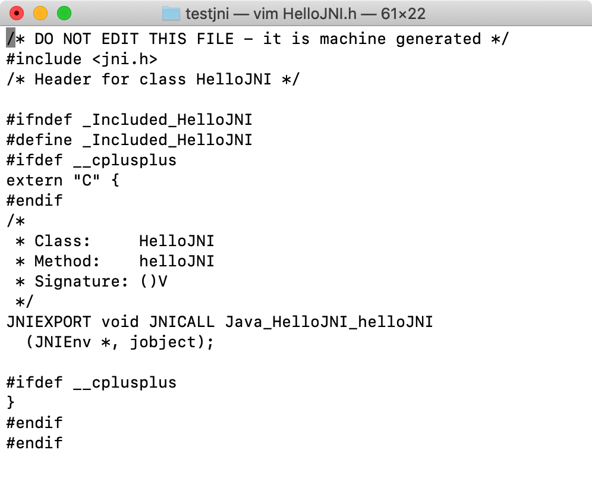
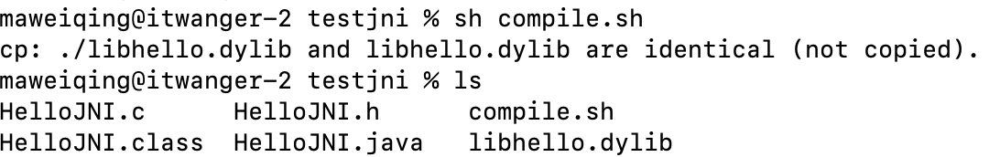
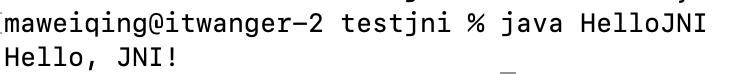

# java native方法

这是java的一个特殊的方法。他是java的本地方法。什么意思呢，我们来看一个例子。

### **1、JNI：Java Native Interface**

在介绍 native 之前，我们先了解什么是 JNI。

一般情况下，我们完全可以使用 Java 语言编写程序，但某些情况下，Java 可能满足不了需求，或者不能更好的满足需求，比如：

- ①、标准的 Java 类库不支持。
- ②、我们已经用另一种语言，比如说 C/C++ 编写了一个类库，如何用 Java 代码调用呢？
- ③、某些运行次数特别多的方法，为了加快性能，需要用更接近硬件的语言（比如汇编）编写。

上面这三种需求，说到底就是如何用 Java 代码调用不同语言编写的代码。那么 JNI 应运而生了。

从 Java 1.1 开始，Java Native Interface (JNI)标准就成为 Java 平台的一部分，它允许 Java 代码和其他语言编写的代码进行交互。

JNI 一开始是为了本地已编译语言，尤其是 C 和 C++而设计的，但是它并不妨碍你使用其他语言，只要调用约定受支持就可以了。使用 Java 与本地已编译的代码交互，通常会丧失平台可移植性，但是，有些情况下这样做是可以接受的，甚至是必须的，比如，使用一些旧的库，与硬件、操作系统进行交互，或者为了提高程序的性能。JNI 标准至少保证本地代码能工作能在任何 Java 虚拟机实现下。


通过 JNI，我们就可以通过 Java 程序（代码）调用到操作系统相关的技术实现的库函数，从而与其他技术和系统交互；同时其他技术和系统也可以通过 JNI 提供的相应原生接口调用 Java 应用系统内部实现的功能。

JNI 的缺点：

- ①、程序不再跨平台。要想跨平台，必须在不同的系统环境下重新编译本地语言部分。
- ②、程序不再是绝对安全的，本地代码的不当使用可能导致整个程序崩溃。一个通用规则是，你应该让本地方法集中在少数几个类当中。这样就降低了 Java 和 C/C++ 之间的耦合性。

目前来讲使用 JNI 的缺点相对于优点还是可以接受的，可能后面随着 Java 的技术发展，我们不在需要 JNI，但是目前 JDK 还是一直提供了对 JNI 标准的支持。

### **2、用 C 语言编写程序本地方法**

> 官方文档如下：[https://docs.oracle.com/javase/8/docs/technotes/guides/jni/spec/jniTOC.htmlopen in new window](https://docs.oracle.com/javase/8/docs/technotes/guides/jni/spec/jniTOC.html)

步骤如下：

①、编写带有 native 方法的 Java 类，生成.java 文件；

②、使用 javac 命令编译所编写的 Java 类，生成.class 文件；

③、使用 javah -jni java 类名 生成扩展名为 h 的头文件，也即生成 .h 文件；

④、使用 C/C++（或者其他编程想语言）实现本地方法，创建 .h 文件的实现，也就是创建 .cpp 文件实现.h 文件中的方法；

⑤、将 C/C++ 编写的文件生成动态连接库，生成 dll 文件；

下面我们通过一个 HelloWorld 程序的调用来完成这几个步骤。

#### 01）编写带有 native 方法的 Java 类 HelloJNI.java

在 `/Users/itwanger/Documents/Github/javabetter/testjni` 目录下创建 HelloJNI.java 文件，内容如下所示。


```java
public class HelloJNI {
    static {
        System.loadLibrary("hello"); // 加载名为 libhello.dylib 的动态链接库
    }

    // 定义本地方法
    private native void helloJNI();

    public static void main(String[] args) {
        new HelloJNI().helloJNI(); // 调用本地方法
    }
}
```

**PS：后面执行的命令都将在 testjni 的目录下**。

解释一下这段代码：

`private native void helloJNI()`：用 native 声明的方法告知 JVM 调用该方法在外部定义，也就是我们会用 C 语言去实现。

`System.loadLibrary("hello")`：加载动态库，参数 hello 是动态库的名字。我们可以这样理解：程序中的方法 helloJNI() 在程序中没有实现，但是我们下面要调用这个方法，怎么办呢？

我们就需要对这个方法进行初始化，所以用了 static 代码块进行初始化，后面会讲到。

#### 02）编译 HelloJNI.java

在命令行通过 `javac HelloJNI.java` 来编译源代码。


#### 03）使用 `javah -jni HelloJNI` 生成扩展名为 h 的头文件


> PS：Java 9 以后，javah 被弃用，取而代之的是使用 -h 选项来生成头文件，例如 `javac -h . ClassName.java`。

执行完毕后，会在 HelloJNI.java 所在目录下生成一个名为 HelloJNI.h 的头文件。打开 HelloJNI.h 文件，可以看到如下代码。



看不懂没关系，无所谓，直到它是自动生成的就好。

#### 04）使用 C 语言实现本地方法

创建一个 C 文件 HelloJNI.c，实现本地方法 sayHello。


```c
#include <stdio.h>
#include <jni.h>
#include "HelloJNI.h"

JNIEXPORT void JNICALL Java_HelloJNI_helloJNI(JNIEnv *env, jobject obj) {
    printf("Hello, JNI!\n");
    return;
}
```

注意，这里需要引入 JNI 头文件，并且实现的方法名称需要与在 Java 中声明的名称一致（`HelloJNI_helloJNI` HelloJNI 类的 helloJNI 方法）。

#### 05）编写编译脚本 [compile.shopen in new window](http://compile.sh/)


```bash
#!/bin/bash

# 编译 HelloJNI.c 文件
gcc -I"$JAVA_HOME/include" -I"$JAVA_HOME/include/darwin" -shared -o libhello.dylib HelloJNI.c

# 把生成的 libhello.dylib 文件拷贝到当前目录
cp libhello.dylib .
```

注意事项：

- `$JAVA_HOME` 是 JDK 的安装路径，需要根据实际情况修改。
- 在 macOS 上，动态链接库（hello）的后缀是 .dylib，而不是 Linux 上的 .so。

这里的 -I 选项是为了告诉编译器头文件的位置，`$JAVA_HOME` 是 Java 安装目录的路径。

#### 06）执行编译脚本


```text
sh compile.sh
```

执行完毕后，会在当前目录下生成一个名为 libhello.dylib 的动态链接库。



#### 07）运行 HelloJNI

执行`java HelloJNI`命令运行 HelloJNI，如果一切正常，就会在终端上输出 Hello, JNI!。



### **3、JNI 调用 C 的流程图**


### **4、native 关键字**

native 用来修饰方法，用 native 声明的方法表示该方法的实现在外部定义，可以用任何语言去实现它，比如说 C/C++。 简单地讲，一个 native Method 就是一个 Java 调用非 Java 代码的接口。

native 语法：

- ①、修饰方法的位置必须在返回类型之前，和其余的方法控制符前后关系不受限制。
- ②、不能用 abstract 修饰，也没有方法体，也没有左右大括号。
- ③、返回值可以是任意类型