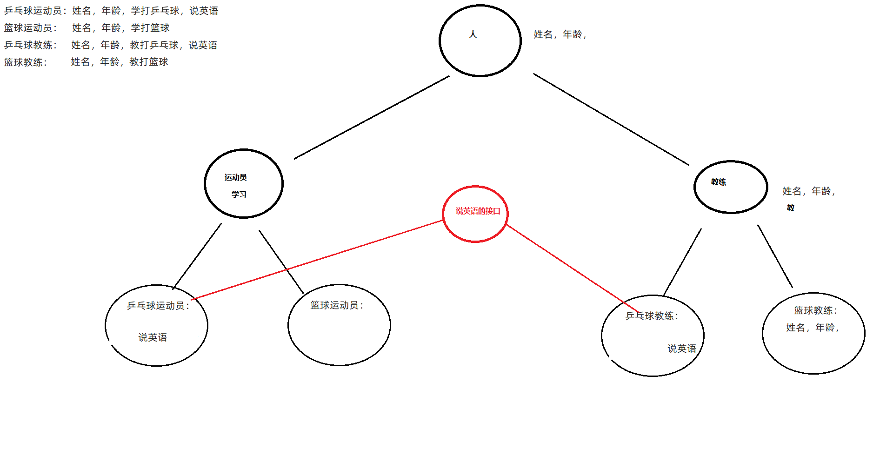

# 案例


首先我们话一个图帮助我们来理解



之后开始我们的代码实现吧。

先看父类

```java
package 面向对象进阶.a12;
//因为创建人对象是没有意义的，所以就把她写成一个抽象的
public abstract class  Person {
    private String name;
    private int age;

    public Person() {
    }

    public Person(String name, int age) {
        this.name = name;
        this.age = age;
    }

    /**
     * 获取
     * @return name
     */
    public String getName() {
        return name;
    }

    /**
     * 设置
     * @param name
     */
    public void setName(String name) {
        this.name = name;
    }

    /**
     * 获取
     * @return age
     */
    public int getAge() {
        return age;
    }

    /**
     * 设置
     * @param age
     */
    public void setAge(int age) {
        this.age = age;
    }

}

```

之后再看接口。

```java
package 面向对象进阶.a12;

/**
 * 〈功能概述〉<br>
 *
 * @author:Lenovo
 * @date: 2022/12/23 16:36
 */
public interface English {
    public abstract void speakEnglish();
}

```

之后再看子类。

先是俩个定义了抽象的子类

```java
package 面向对象进阶.a12;

public abstract class Coach extends Person{
    public abstract void teach();

    public Coach() {
    }

    public Coach(String name, int age) {
        super(name, age);
    }
}

```

```java
package 面向对象进阶.a12;

public abstract class Sporter extends Person {
    public abstract void study();

    public Sporter() {
    }

    public Sporter(String name, int age) {
        super(name, age);
    }
}

```

之后是她们的子类。

```java
package 面向对象进阶.a12;

public class BasketballCoach extends Coach{
    @Override
    public void teach() {
        System.out.println("篮球教练在教如何打篮球");
    }

    public BasketballCoach() {
    }

    public BasketballCoach(String name, int age) {
        super(name, age);
    }
}

```

```java
package 面向对象进阶.a12;

public class BaseketballSprot extends Sporter{
    @Override
    public void study() {
        System.out.println("篮球运动员在学习如何打篮球");
    }

    public BaseketballSprot() {
    }

    public BaseketballSprot(String name, int age) {
        super(name, age);
    }
}

```

```java
package 面向对象进阶.a12;

public class PingPangCoach extends Coach implements English{
    @Override
    public void teach() {
        System.out.println("乒乓球教练在教如何打乒乓球");
    }

    @Override
    public void speakEnglish() {
        System.out.println("乒乓球教练学习说英语");
    }

    public PingPangCoach() {
    }

    public PingPangCoach(String name, int age) {
        super(name, age);
    }
}

```

```java
package 面向对象进阶.a12;

public class PingPangSport extends Sporter implements English{
    @Override
    public void speakEnglish() {
        System.out.println("乒乓球运动员在说英语");
    }

    @Override
    public void study() {
        System.out.println("乒乓球运动员在学习如何打乒乓球");
    }

    public PingPangSport() {
    }

    public PingPangSport(String name, int age) {
        super(name, age);
    }
}

```

最后是我们的test类

```java
package 面向对象进阶.a12;

public class Test {
    public static void main(String[] args) {
        PingPangCoach ppc=new PingPangCoach("你好",20);
        ppc.speakEnglish();
        ppc.teach();

    }
}

```

# 