# 面向对象三大基本特征

## 封装(Encapsulation)


所谓封装，也就是把客观事物封装成抽象的类，并且类可以把自己的数据和方法只让可信的类或者对象操作，对不可信的进行信息隐藏。

简单的说，一个类就是一个封装了数据以及操作这些数据的代码的逻辑实体。在一个对象内部，某些代码或某些数据可以是私有的，不能被外界访问。通过这种方式，对象对内部数据提供了不同级别的保护，以防止程序中无关的部分意外的改变或错误的使用了对象的私有部分。

封装从字面上来理解就是包装的意思，专业点就是信息隐藏，**是指利用抽象将数据和基于数据的操作封装在一起，使其构成一个不可分割的独立实体**。

使用封装有 4 大好处：

- 1、良好的封装能够减少耦合。
- 2、类内部的结构可以自由修改。
- 3、可以对成员进行更精确的控制。
- 4、隐藏信息，实现细节。


如我们想要定义一个矩形，先定义一个Rectangle类，并其中通过封装的手段放入一些必备数据。

```markup
/**
* 矩形
*/
class Rectangle {

     /**
      * 设置矩形的长度和宽度
      */
     public Rectangle(int length, int width) {
         this.length = length;
         this.width = width;
     }
    
     /**
      * 长度
      */
     private int length;
    
     /**
      * 宽度
      */
     private int width;
    
     /**
      * 获得矩形面积
      *
      * @return
      */
     public int area() {
         return this.length * this.width;
     }
}复制ErrorOK!
```

我们通过封装的方式，给"矩形"定义了"长度"和"宽度"，这就完成了对现实世界中的"矩形"的抽象的第一步。

如果这个还没有那么的直观，那我们来看下面的这两个类

Husband.java


```java
public class Husband {
    
    /*
     * 对属性的封装
     * 一个人的姓名、性别、年龄、妻子都是这个人的私有属性
     */
    private String name ;
    private String sex ;
    private int age ;
    private Wife wife;
    
    /*
     * setter()、getter()是该对象对外开发的接口
     */
    public String getName() {
        return name;
    }

    public void setName(String name) {
        this.name = name;
    }

    public String getSex() {
        return sex;
    }

    public void setSex(String sex) {
        this.sex = sex;
    }

    public int getAge() {
        return age;
    }

    public void setAge(int age) {
        this.age = age;
    }

    public void setWife(Wife wife) {
        this.wife = wife;
    }
}
```

Wife.java


```java
public class Wife {
    private String name;
    private int age;
    private String sex;
    private Husband husband;

    public String getName() {
        return name;
    }

    public void setName(String name) {
        this.name = name;
    }

    public String getSex() {
        return sex;
    }

    public void setSex(String sex) {
        this.sex = sex;
    }

    public void setAge(int age) {
        this.age = age;
    }

    public void setHusband(Husband husband) {
        this.husband = husband;
    }

    public Husband getHusband() {
        return husband;
    }
    
}
```

可以看得出， Husband 类里面的 wife 属性是没有 `getter()`的，同时 Wife 类的 age 属性也是没有 `getter()`方法的。

所以封装把一个对象的属性私有化，同时提供一些可以被外界访问的属性的方法，如果不想被外界方法，我们大可不必提供方法给外界访问。

但是如果一个类没有提供给外界任何可以访问的方法，那么这个类也没有什么意义了。

比如我们将一个房子看做是一个对象，里面有漂亮的装饰，如沙发、电视剧、空调、茶桌等等都是该房子的私有属性，但是如果我们没有那些墙遮挡，是不是别人就会一览无余呢？没有一点儿隐私！

因为存在那个遮挡的墙，我们既能够有自己的隐私而且我们可以随意的更改里面的摆设而不会影响到外面的人。

但是如果没有门窗，一个包裹的严严实实的黑盒子，又有什么存在的意义呢？所以通过门窗别人也能够看到里面的风景。所以说门窗就是房子对象留给外界访问的接口。

通过这个我们还不能真正体会封装的好处。现在我们从程序的角度来分析封装带来的好处。如果我们不使用封装，那么该对象就没有 `setter()`和 `getter()`，那么 Husband 类应该这样写：


```java
public class Husband {
    public String name ;
    public String sex ;
    public int age ;
    public Wife wife;
}
```

我们应该这样来使用它：


```java
Husband husband = new Husband();
husband.age = 30;
husband.name = "张三";
husband.sex = "男";    //貌似有点儿多余
```

但是哪天如果我们需要修改 Husband，例如将 age 修改为 String 类型的呢？你只有一处使用了这个类还好，如果你有几十个甚至上百个这样地方，你是不是要改到崩溃。如果使用了封装，我们完全可以不需要做任何修改，只需要稍微改变下 Husband 类的 `setAge()`方法即可。


```java
public class Husband {
    
    /*
     * 对属性的封装
     * 一个人的姓名、性别、年龄、妻子都是这个人的私有属性
     */
    private String name ;
    private String sex ;
    private String age ;    /* 改成 String类型的*/
    private Wife wife;
    
    public String getAge() {
        return age;
    }
    
    public void setAge(int age) {
        //转换即可
        this.age = String.valueOf(age);
    }
    
    /** 省略其他属性的setter、getter **/
    
}
```

其他的地方依然这样引用( `husband.setAge(22)` )保持不变。

到了这里我们确实可以看出，**封装确实可以使我们更容易地修改类的内部实现，而无需修改使用了该类的代码**。

我们再看这个好处：**封装可以对成员变量进行更精确的控制**。

还是那个 Husband，一般来说我们在引用这个对象的时候是不容易出错的，但是有时你迷糊了，写成了这样：


```java
Husband husband = new Husband();
husband.age = 300;
```

也许你是因为粗心写成了这样，你发现了还好，如果没有发现那就麻烦大了，谁见过 300 岁的老妖怪啊！

但是使用封装我们就可以避免这个问题，我们对 age 的访问入口做一些控制(setter)如：


```java
public class Husband {
    
    /*
     * 对属性的封装
     * 一个人的姓名、性别、年龄、妻子都是这个人的私有属性
     */
    private String name ;
    private String sex ;
    private int age ;    /* 改成 String类型的*/
    private Wife wife;

    public int getAge() {
        return age;
    }

    public void setAge(int age) {
        if(age > 120){
            System.out.println("ERROR：error age input....");    //提示錯誤信息
        }else{
            this.age = age;
        }
        
    }
    
    /** 省略其他属性的setter、getter **/
    
}
```

上面都是对 setter 方法的控制，其实通过封装我们也能够对对象的出口做出很好的控制。例如性别在数据库中一般都是以 1、0 的方式来存储的，但是在前台我们又不能展示 1、0，这里我们只需要在 `getter()`方法里面做一些转换即可。


```java
public String getSexName() {
    if("0".equals(sex)){
        sexName = "女";
    }
    else if("1".equals(sex)){
        sexName = "男";
    }
    return sexName;
}
```

在使用的时候我们只需要使用 sexName 即可实现正确的性别显示。同理也可以用于针对不同的状态做出不同的操作。


```java
public String getCzHTML(){
    if("1".equals(zt)){
        czHTML = "<a href='javascript:void(0)' onclick='qy("+id+")'>启用</a>";
    }
    else{
        czHTML = "<a href='javascript:void(0)' onclick='jy("+id+")'>禁用</a>";
    }
    return czHTML;
}
```

说了这么多，我们来看java实现封装的基本思路

1. 修改属性的可见性来限制对属性的访问（一般限制为private），例如：

```java
public class Person {
    private String name;
    private int age;
}
```

这段代码中，将 **name** 和 **age** 属性设置为私有的，只能本类才能访问，其他类都访问不了，如此就对信息进行了隐藏。

2. 对每个值属性提供对外的公共方法访问，也就是创建一对赋取值方法，用于对私有属性的访问，例如：

```java
public class Person{
    private String name;
    private int age;

    public int getAge(){
      return age;
    }

    public String getName(){
      return name;
    }

    public void setAge(int age){
      this.age = age;
    }

    public void setName(String name){
      this.name = name;
    }
}
```

采用 **this** 关键字是为了解决实例变量（private String name）和局部变量（setName(String name)中的name变量）之间发生的同名的冲突。

之后我们来复习一个这个private关键字，他是一个权限修饰符。可以修饰成员(成员变量和成员方法)被private修饰的成员，只能在 本类中才能访问如果一个关键字被private修饰后，就只能通过set和get方法来获得和更改参数。

```java
package 面向方法;
public class a3 {
    private String name;
    private int age;
    private String gender;

    //提供get和set方法
    //作用：给name赋值需要有赋值
    public void setName(String n){
        name=n;
    }
    //对外提供数据
    public String getName(){
        return name;
    }


    public void setAge(int a){
        if (a>=18&&a<=50){
            age=a;
        }else {
            System.out.println("非法参数");
        }

    }

    public int getAge(){
        return age;
    }

    public void setGender(String g){
        gender=g;
    }
    public String getGender(){
        return gender;
    }


    public void sleep(){
        System.out.println("在睡觉");
    }public void eat(){
        System.out.println("在吃饭");
    }
}

```

例如这里的get和set方法。

以及main主函数里的调用：

```java
package 面向方法;

public class a3test {
    public static void main(String[] args) {
        a3 gf1=new a3();
        gf1.setName("小诗诗");
        gf1.setAge(18);
        gf1.setGender("傻逼");
        System.out.println(gf1.getAge());
        System.out.println(gf1.getName());
        System.out.println(gf1.getGender());
        gf1.eat();
        gf1.sleep();
    }
}

```

看了这么多，相信大家应该已经看明白什么是封装了。

下面就开始讲第二个基本特征

## 继承(Inheritance)]

继承是指这样一种能力：它可以使用现有类的所有功能，并在无需重新编写原来的类的情况下对这些功能进行扩展。

通过继承创建的新类称为“子类”或“派生类”，被继承的类称为“基类”、“父类”或“超类”。继承的过程，就是从一般到特的过程。

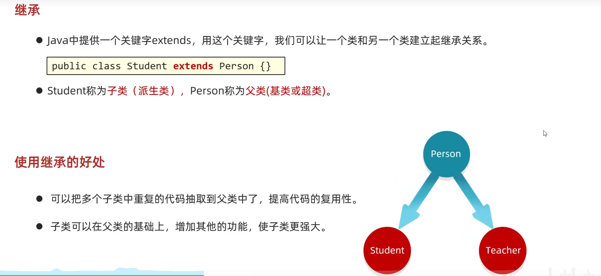


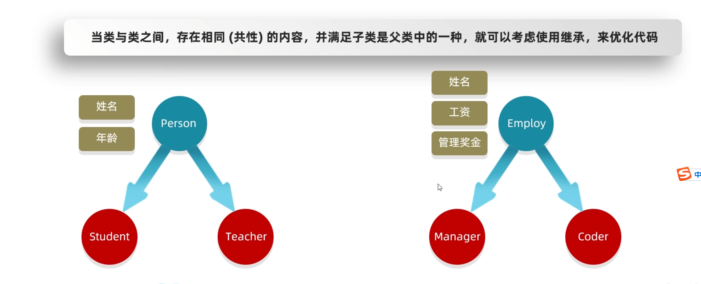

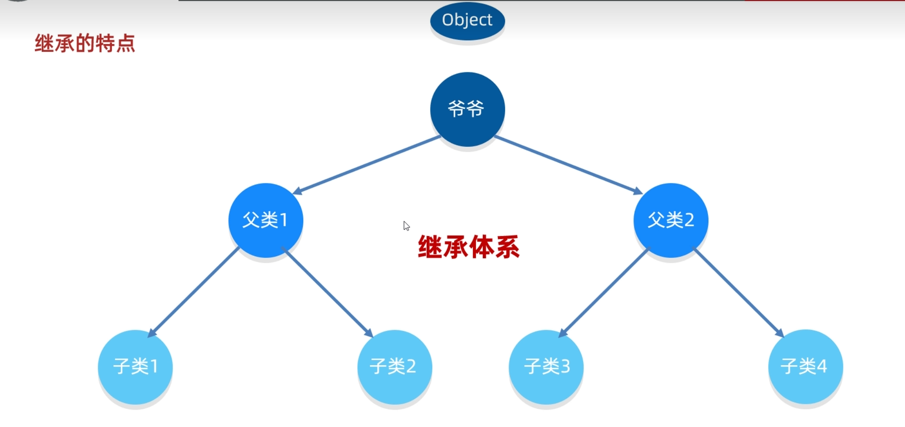

继承是java面向对象编程技术的一块基石，因为它允许创建分等级层次的类。

继承就是子类继承父类的特征和行为，使得子类对象（实例）具有父类的实例域和方法，或子类从父类继承方法，使得子类具有父类相同的行为。

生活中的继承：


兔子和羊属于食草动物类，狮子和豹属于食肉动物类。

食草动物和食肉动物又是属于动物类。

所以继承需要符合的关系是：is-a，父类更通用，子类更具体。

虽然食草动物和食肉动物都是属于动物，但是两者的属性和行为上有差别，所以子类会具有父类的一般特性也会具有自身的特性。


我们想要定义一个正方形，因为已经有了矩形，所以我们可以直接继承Rectangle类，因为正方形是长方形的一种特例。

```markup
/**
 * 正方形，继承自矩形
 */
class Square extends Rectangle {

    /**
     * 设置正方形边长
     *
     * @param length
     */
    public Square(int length) {
        super(length, length);
    }
}复制ErrorOK!
```

现实世界中，"正方形"是"矩形"的特例，或者说正方形是通过矩形派生出来的，这种派生关系，在面向对象中可以用继承来表达。

如果仅仅只有两三个类，每个类的属性和方法很有限的情况下确实没必要实现继承，但事情并非如此，事实上一个系统中往往有很多个类并且有着很多相似之处，比如猫和狗同属动物，或者学生和老师同属人。各个类可能又有很多个相同的属性和方法，这样的话如果每个类都重新写不仅代码显得很乱，代码工作量也很大。

这时继承的优势就出来了：可以直接使用父类的属性和方法，自己也可以有自己新的属性和方法满足拓展，父类的方法如果自己有需求更改也可以重写。这样**使用继承不仅大大的减少了代码量，也使得代码结构更加清晰可见**。

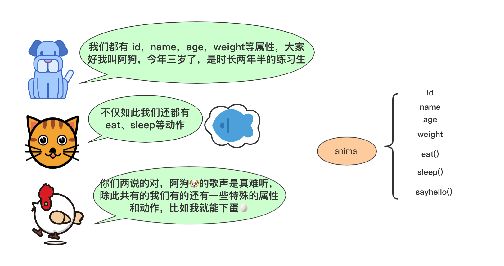

所以这样从代码的层面上来看我们设计这个完整的 Animal 类是这样的：


```java
class Animal
{
    public int id;
    public String name;
    public int age;
    public int weight;

    public Animal(int id, String name, int age, int weight) {
        this.id = id;
        this.name = name;
        this.age = age;
        this.weight = weight;
    }
    //这里省略get set方法
    public void sayHello()
    {
        System.out.println("hello");
    }
    public void eat()
    {
        System.out.println("I'm eating");
    }
    public void sing()
    {
        System.out.println("sing");
    }
}
```

而 Dog，Cat，Chicken 类可以这样设计：


```java
class Dog extends Animal//继承animal
{
    public Dog(int id, String name, int age, int weight) {
        super(id, name, age, weight);//调用父类构造方法
    }
}
class Cat extends Animal{

    public Cat(int id, String name, int age, int weight) {
        super(id, name, age, weight);//调用父类构造方法
    }
}
class Chicken extends Animal{

    public Chicken(int id, String name, int age, int weight) {
        super(id, name, age, weight);//调用父类构造方法
    }
    //鸡下蛋
    public void layEggs()
    {
        System.out.println("我是老母鸡下蛋啦，咯哒咯！咯哒咯！");
    }
}
```

各自的类继承 Animal 后可以直接使用 Animal 类的属性和方法而不需要重复编写，各个类如果有自己的方法也可很容易地拓展

继承的分类

继承分为单继承和多继承，Java 语言只支持类的单继承，但可以通过实现接口的方式达到多继承的目的。****

| 继承                                                         | 定义                       | 优缺点                                                       |
| ------------------------------------------------------------ | -------------------------- | ------------------------------------------------------------ |
| 单继承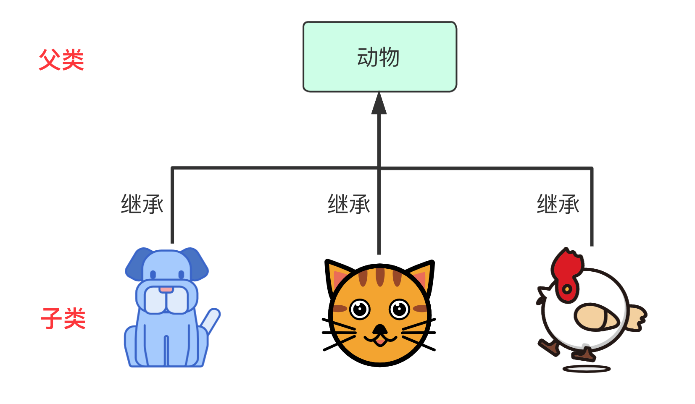 | 一个子类只拥有一个父类     | 优点：在类层次结构上比较清晰 缺点：结构的丰富度有时不能满足使用需求 |
| 多继承（Java 不支持，但可以用其它方式满足多继承使用需求）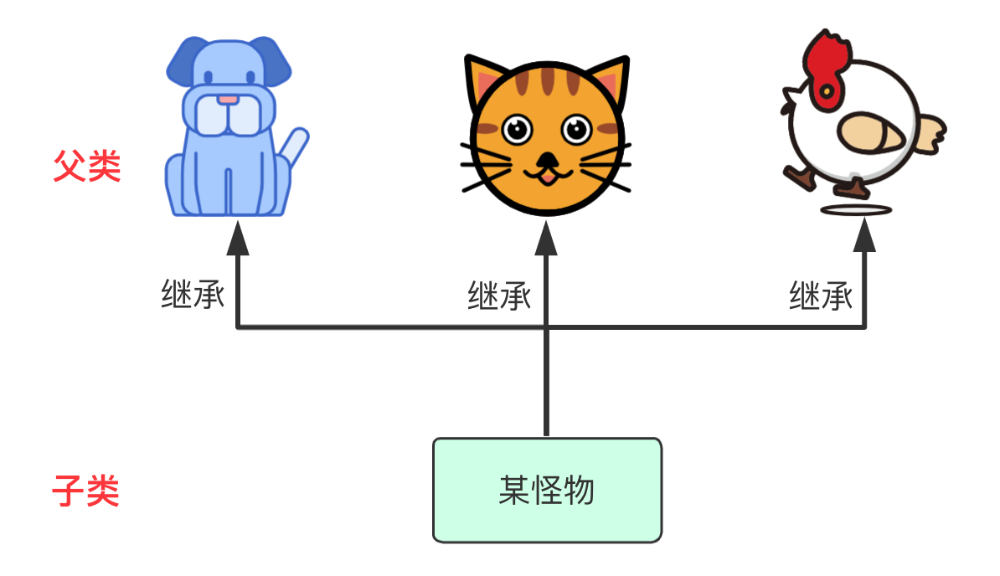 | 一个子类拥有多个直接的父类 | 优点：子类的丰富度很高 缺点：容易造成混乱                    |

### **单继承**

单继承，一个子类只有一个父类，如我们上面讲过的 Animal 类和它的子类。**单继承在类层次结构上比较清晰，但缺点是结构的丰富度有时不能满足使用需求**。

### **多继承**

多继承，一个子类有多个直接的父类。这样做的好处是子类拥有所有父类的特征，**子类的丰富度很高，但是缺点就是容易造成混乱**。下图为一个混乱的例子。

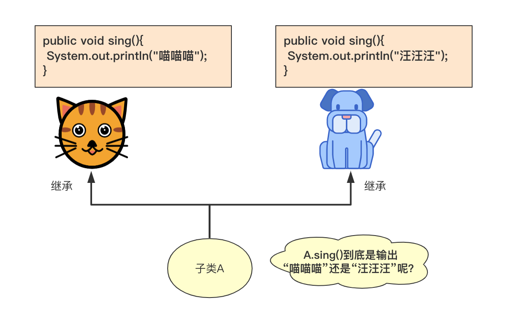

要注意的是，java是不支持多继承的，至于为什么不支持多继承呢，我们来看一下解释。

下面我们来看这个菱型继承

假设我们有类B和类C，它们都继承了相同的类A。另外我们还有类D，类D通过多重继承机制继承了类B和类C。

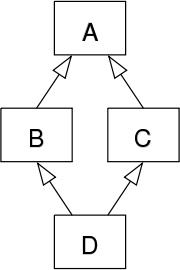

这时候，因为D同时继承了B和C，并且B和C又同时继承了A，那么，D中就会因为多重继承，继承到两份来自A中的属性和方法。

这时候，在使用D的时候，如果想要调用一个定义在A中的方法时，就会出现歧义。

因为这样的继承关系的形状类似于菱形，因此这个问题被形象地称为菱形继承问题。

而C++为了解决菱形继承问题，又引入了**虚继承**。

因为支持多继承，引入了菱形继承问题，又因为要解决菱形继承问题，引入了虚继承。而经过分析，人们发现我们其实真正想要使用多继承的情况并不多。

所以，在 Java 中，不允许“实现多继承”，即一个类不允许继承多个父类。但是 Java 允许“声明多继承”，即一个类可以实现多个接口，一个接口也可以继承多个父接口。由于接口只允许有方法声明而不允许有方法实现（Java 8以前），这就避免了 C++ 中多继承的歧义问题。

但是，Java不支持多继承，在Java 8中支持了默认函数（default method ）之后就不那么绝对了。

虽然我们还是没办法使用extends同时继承多个类，但是因为有了默认函数，我们有可能通过implements从多个接口中继承到多个默认函数，那么，又如何解决这种情况带来的菱形继承问题呢？这个问题留给大家去查询答案。


Java 虽然不支持多继承，但是 Java 有三种实现多继承效果的方式，**分别是**内部类、多层继承和实现接口。

内部类可以继承一个与外部类无关的类，保证了内部类的独立性，正是基于这一点，可以达到多继承的效果。

**多层继承：\**子类继承父类，父类如果还继承其他的类，那么这就叫\**多层继承**。这样子类就会拥有所有被继承类的属性和方法。


实现接口无疑是满足多继承使用需求的最好方式，一个类可以实现多个接口满足自己在丰富性和复杂环境的使用需求。

类和接口相比，**类就是一个实体，有属性和方法，而接口更倾向于一组方法**。举个例子，就拿斗罗大陆的唐三来看，他存在的继承关系可能是这样的：


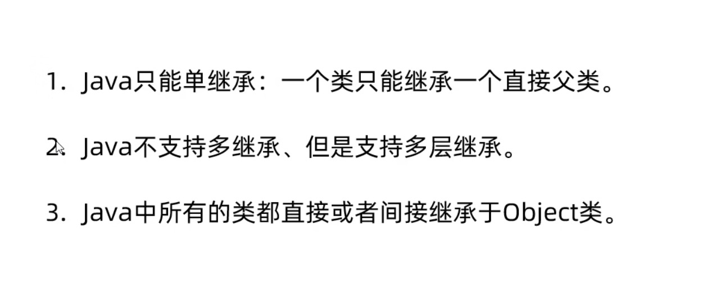

下面来一个图，让你快速区分这个继承的分类


### 如何实现继承

#### **extends 关键字**

在 Java 中，类的继承是单一继承，也就是说一个子类只能拥有一个父类，所以**extends**只能继承一个类。其使用语法为：


```java
class 子类名 extends 父类名{}
```

例如 Dog 类继承 Animal 类，它是这样的：


```java
class Animal{} //定义Animal类
class Dog extends Animal{} //Dog类继承Animal类
```

子类继承父类后，就拥有父类的非私有的**属性和方法**。如果不明白，请看这个案例，在 IDEA 下创建一个项目，创建一个 test 类做测试，分别创建 Animal 类和 Dog 类，Animal 作为父类写一个 sayHello()方法，Dog 类继承 Animal 类之后就可以调用 sayHello()方法。具体代码为：


```java
class Animal {
    public void  sayHello()//父类的方法
    {
        System.out.println("hello,everybody");
    }
}
class Dog extends Animal//继承animal
{ }
public class test {
    public static void main(String[] args) {
       Dog dog=new Dog();
       dog.sayHello();
    }
}
```

点击运行的时候 Dog 子类可以直接使用 Animal 父类的方法。

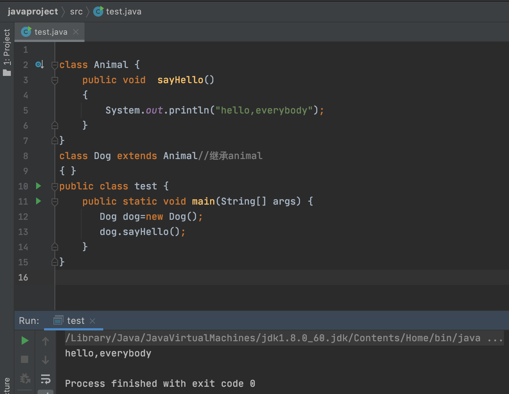

#### **implements 关键字**

使用 implements 关键字可以变相使 Java 拥有多继承的特性，使用范围为类实现接口的情况，一个类可以实现多个接口(接口与接口之间用逗号分开)。

我们来看一个案例，创建一个 test2 类做测试，分别创建 doA 接口和 doB 接口，doA 接口声明 sayHello()方法，doB 接口声明 eat()方法，创建 Cat2 类实现 doA 和 doB 接口，并且在类中需要重写 sayHello()方法和 eat()方法。具体代码为：


```java
interface doA{
     void sayHello();
}
interface doB{
     void eat();
    //以下会报错 接口中的方法不能具体定义只能声明
    //public void eat(){System.out.println("eating");}
}
class Cat2 implements  doA,doB{
    @Override//必须重写接口内的方法
    public void sayHello() {
        System.out.println("hello!");
    }
    @Override
    public void eat() {
        System.out.println("I'm eating");
    }
}
public class test2 {
    public static void main(String[] args) {
        Cat2 cat=new Cat2();
        cat.sayHello();
        cat.eat();
    }
}
```

Cat 类实现 doA 和 doB 接口的时候，需要实现其声明的方法，点击运行结果如下，这就是一个类实现接口的简单案例：

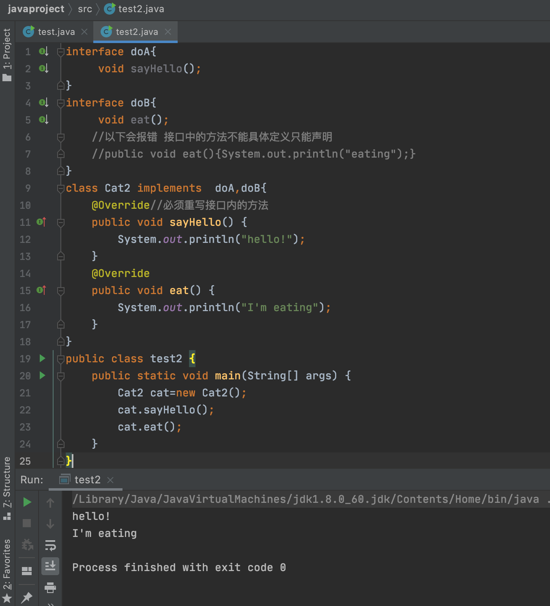

说了这么多我们来看一个继承的练习

### 练习

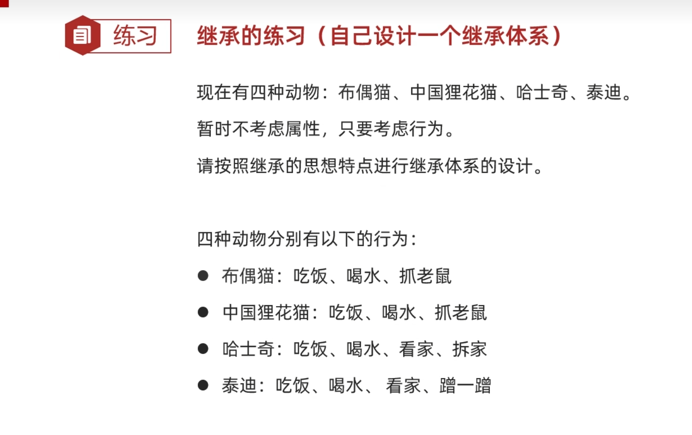

首先我们先画一个图

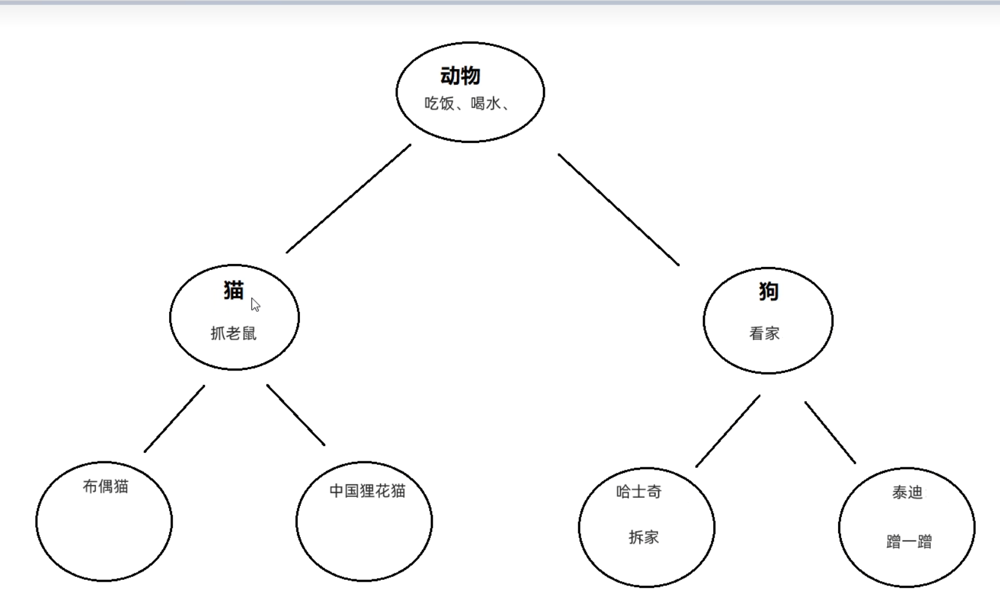

画出继承关系。画图是从下往上画。

之后是写代码。写代码的话，就是从上往下写。

先是动物

```java
package 面向对象进阶.a4;

public class Animal {
    //这里用的是public。所以所有继承他的子类都可以用这个方法。
    //如果是private，就只有自己可以用
    //可以相当于一个人的私房钱
    public void eat(){
        System.out.println("吃东西");
    }
    public void drink(){
        System.out.println("喝水");
    }
}

```

之后是猫和狗

```java
package 面向对象进阶.a4;

public class Cat extends Animal {
    public void cathMouse(){
        System.out.println("猫在抓老鼠");
    }

}

```


```java
package 面向对象进阶.a4;

public class Dog extends Animal {
    public void lookHome(){
        System.out.println("狗在看见");
    }
}

```

最后开始详细书写

```java
package 面向对象进阶.a4;

public class Husky extends Dog{
    public void breakHome(){
        System.out.println("哈士奇在拆家");
    }

}

```

```java
package 面向对象进阶.a4;

public class LiHua extends Cat{
}

```

```java
package 面向对象进阶.a4;

public class Ragdoll extends Cat {
}

```

```java
package 面向对象进阶.a4;

public class Teddy extends Dog {
    public void touch(){
        System.out.println("泰迪又在蹭我的腿了~");
    }
}

```

```java
package 面向对象进阶.a4;
/*
注意事项，子类只能访问父类中非私有的成员
 */
public class Test {
    public static void main(String[] args) {
        //创建一个布偶猫的对象
        Ragdoll rd=new Ragdoll();
        rd.eat();
        rd.drink();
        rd.cathMouse();
        System.out.println("--------------------------");
        //创建一个哈奇士对象
        Husky h=new Husky();
        h.eat();
        h.breakHome();
        h.drink();
        h.lookHome();
    }
}

```

最后的是我们的测试类。就可以发现测试成功了。

这样就算是一个完整的继承了。

## 多态(Polymorphism)

所谓多态就是指一个类实例的相同方法在不同情形有不同表现形式。多态机制使具有不同内部结构的对象可以共享相同的外部接口。

这意味着，虽然针对不同对象的具体操作不同，但通过一个公共的类，它们（那些操作）可以通过相同的方式予以调用。

最常见的多态就是将子类传入父类参数中，运行时调用父类方法时通过传入的子类决定具体的内部结构或行为。

在我刻板的印象里，西游记里的那段孙悟空和二郎神的精彩对战就能很好的解释“多态”这个词：一个孙悟空，能七十二变；一个二郎神，也能七十二变；他们都可以变成不同的形态，但只需要悄悄地喊一声“变”。

Java的多态是什么呢？其实就是一种能力——同一个行为具有不同的表现形式；换句话说就是，执行一段代码，Java 在运行时能根据对象的不同产生不同的结果。和孙悟空和二郎神都只需要喊一声“变”，然后就变了，并且每次变得还不一样；一个道理。

多态的前提条件有三个：

- 子类继承父类
- 子类覆盖父类的方法
- 父类引用指向子类对象

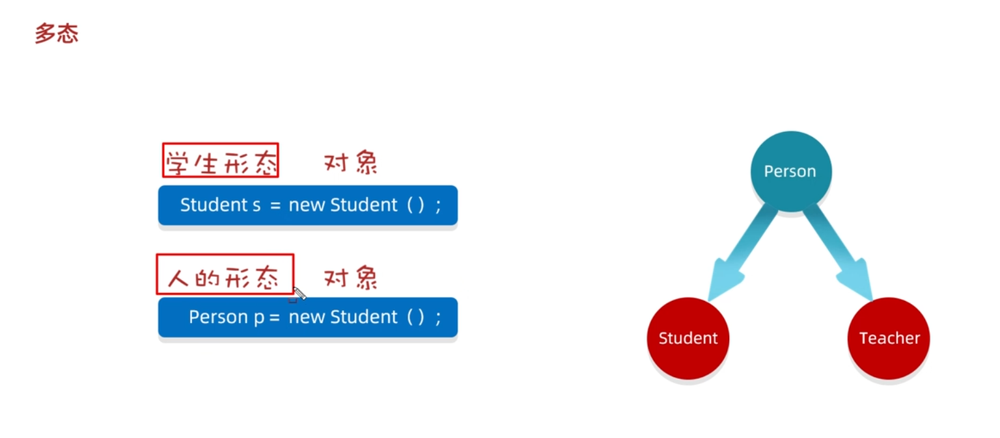

这个简单理解他的应用场景。就是

比如说有一个登录系统。

有三个不同身份的人都需要登录

这个时候。我们登录系统的这个形参。就可以写他父类的person了。

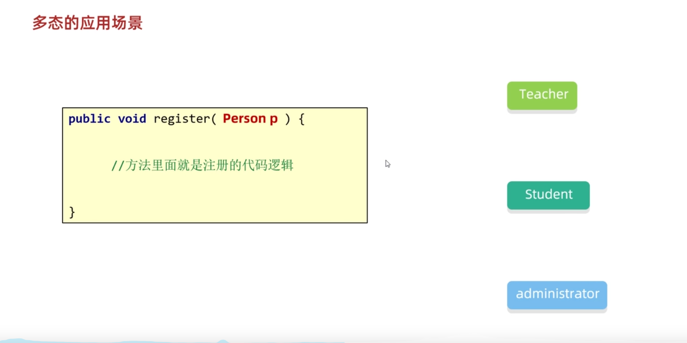

多态的一个简单应用，来看程序清单1-1：


```java
//子类继承父类
public class Wangxiaoer extends Wanger {
    public void write() { // 子类覆盖父类方法
        System.out.println("记住仇恨，表明我们要奋发图强的心智");
    }

    public static void main(String[] args) {
        // 父类引用指向子类对象
        Wanger[] wangers = { new Wanger(), new Wangxiaoer() };

        for (Wanger wanger : wangers) {
            // 对象是王二的时候输出：勿忘国耻
            // 对象是王小二的时候输出：记住仇恨，表明我们要奋发图强的心智
            wanger.write();
        }
    }
}

class Wanger {
    public void write() {
        System.out.println("勿忘国耻");
    }
}
```

#### 01、多态与后期绑定

现在，我们来思考一个问题：程序清单1-1在执行 `wanger.write()` 时，由于编译器只有一个 Wanger 引用，它怎么知道究竟该调用父类 Wanger 的 `write()` 方法，还是子类 Wangxiaoer 的 `write()` 方法呢？

答案是在运行时根据对象的类型进行后期绑定，编译器在编译阶段并不知道对象的类型，但是Java的方法调用机制能找到正确的方法体，然后执行出正确的结果。

多态机制提供的一个重要的好处程序具有良好的扩展性。来看程序清单2-1：


```java
//子类继承父类
public class Wangxiaoer extends Wanger {
    public void write() { // 子类覆盖父类方法
        System.out.println("记住仇恨，表明我们要奋发图强的心智");
    }
    
    public void eat() {
        System.out.println("我不喜欢读书，我就喜欢吃");
    }

    public static void main(String[] args) {
        // 父类引用指向子类对象
        Wanger[] wangers = { new Wanger(), new Wangxiaoer() };

        for (Wanger wanger : wangers) {
            // 对象是王二的时候输出：勿忘国耻
            // 对象是王小二的时候输出：记住仇恨，表明我们要奋发图强的心智
            wanger.write();
        }
    }
}

class Wanger {
    public void write() {
        System.out.println("勿忘国耻");
    }
    
    public void read() {
        System.out.println("每周读一本好书");
    }
}
```

在程序清单 2-1 中，我们在 Wanger 类中增加了 read() 方法，在 Wangxiaoer 类中增加了eat()方法，但这丝毫不会影响到 write() 方法的调用。write() 方法忽略了周围代码发生的变化，依然正常运行。这让我想起了金庸《倚天屠龙记》里九阳真经的口诀：“他强由他强，清风拂山岗；他横由他横，明月照大江。”

多态的这个优秀的特性，让我们在修改代码的时候不必过于紧张，因为多态是一项让程序员“将改变的与未改变的分离开来”的重要特性。

#### 02、多态与构造方法

在构造方法中调用多态方法，会产生一个奇妙的结果，我们来看程序清单3-1：


```java
public class Wangxiaosan extends Wangsan {
    private int age = 3;
    public Wangxiaosan(int age) {
        this.age = age;
        System.out.println("王小三的年龄：" + this.age);
    }
    
    public void write() { // 子类覆盖父类方法
        System.out.println("我小三上幼儿园的年龄是：" + this.age);
    }
    
    public static void main(String[] args) {
        new Wangxiaosan(4);
//      上幼儿园之前
//      我小三上幼儿园的年龄是：0
//      上幼儿园之后
//      王小三的年龄：4
    }
}

class Wangsan {
    Wangsan () {
        System.out.println("上幼儿园之前");
        write();
        System.out.println("上幼儿园之后");
    }
    public void write() {
        System.out.println("老子上幼儿园的年龄是3岁半");
    }
}
```

从输出结果上看，是不是有点诧异？明明在创建 Wangxiaosan 对象的时候，年龄传递的是 4，但输出结果既不是“老子上幼儿园的年龄是 3 岁半”，也不是“我小三上幼儿园的年龄是：4”。

为什么？

因为在创建子类对象时，会先去调用父类的构造方法，而父类构造方法中又调用了被子类覆盖的多态方法，由于父类并不清楚子类对象中的属性值是什么，于是把int类型的属性暂时初始化为 0，然后再调用子类的构造方法（子类构造方法知道王小二的年龄是 4）。

#### 03、多态与向下转型

向下转型是指将父类引用强转为子类类型；这是不安全的，因为有的时候，父类引用指向的是父类对象，向下转型就会抛出 ClassCastException，表示类型转换失败；但如果父类引用指向的是子类对象，那么向下转型就是成功的。

来看程序清单4-1：


```java
public class Wangxiaosi extends Wangsi {
    public void write() {
        System.out.println("记住仇恨，表明我们要奋发图强的心智");
    }

    public void eat() {
        System.out.println("我不喜欢读书，我就喜欢吃");
    }

    public static void main(String[] args) {
        Wangsi[] wangsis = { new Wangsi(), new Wangxiaosi() };

        // wangsis[1]能够向下转型
        ((Wangxiaosi) wangsis[1]).write();
        // wangsis[0]不能向下转型
        ((Wangxiaosi)wangsis[0]).write();
    }
}

class Wangsi {
    public void write() {
        System.out.println("勿忘国耻");
    }

    public void read() {
        System.out.println("每周读一本好书");
    }
}
```


简单的来总结这个就是


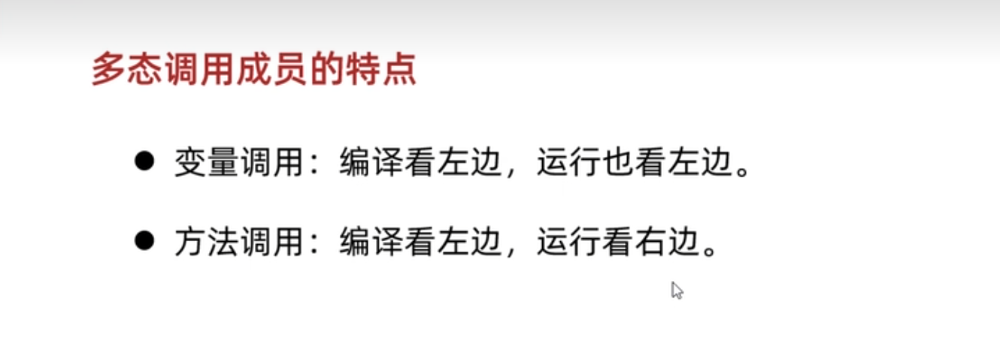


具体这个怎么理解呢。

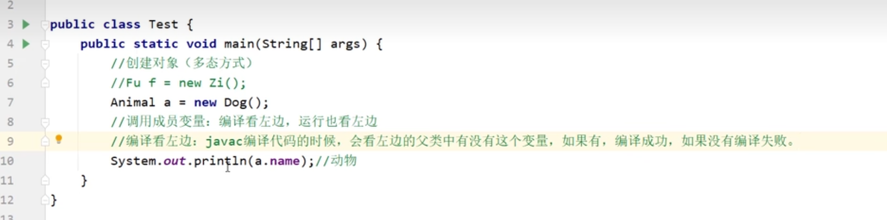


可以这样理解。就是如果子类和父类都有这个变量。那么sout之后。输出的是父类的变量。

运行也看左边。也就是说实际获取的值也是左边的值。

之后看这个方法调用的解释


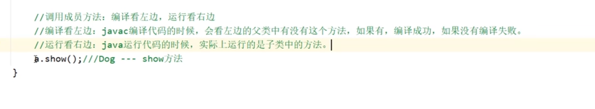


这里编译看左边。简单来说。就是编译的时候要去判断父类中是否有这个方法。如果没有的话。也会报错的。然后运行的时候。运行的就是右边子类所提供的方法内容。

因此。这也就产生的多态的一个弊端。不能调用子类的特殊功能。解决方案也很简单：变回子类类型。用()括起来进行转换。

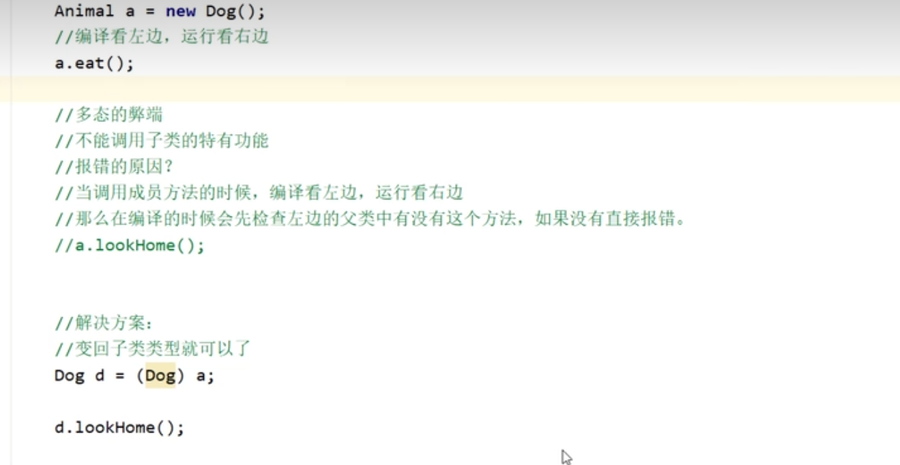


但是也不能随便的转换，

就比如还是上边的代码。

你把a转换为cat。

就会报错。为了尽量避免这种情况的发生。

我们可以用if来进行判断类型。

这里就要用到一个instanceof参数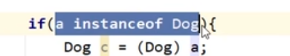


这也就可以判断a是否是dog类型的。如果是返回true。

如果不是就返回false

因此可以看这个类型转换的一个判断代码

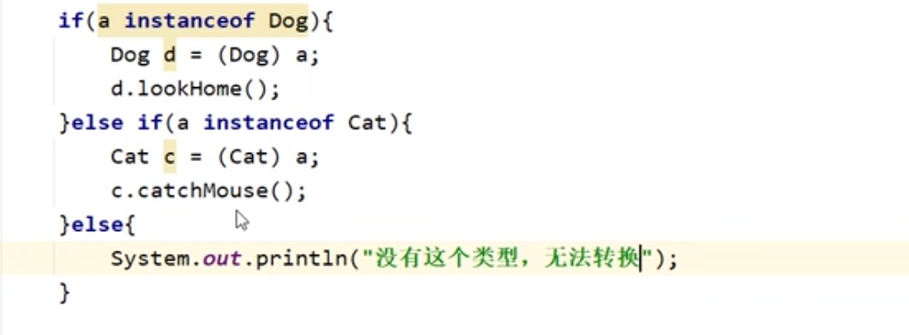

但是这也有点麻烦。

所以java在jdk14之后提供了新特性。


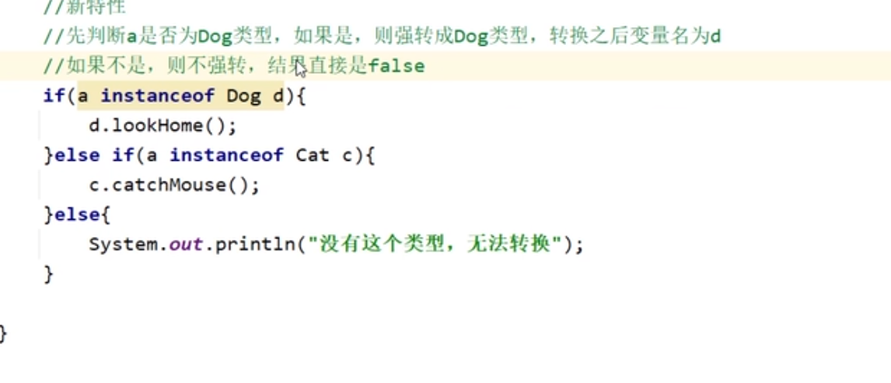

有点类似python中语法糖的效果。


在介绍了面向对象的封装、继承、多态的三个基本特征之后，我们基本掌握了对现实世界抽象的基本方法。

封装：是对类的封装，封装是对类的属性和方法进行封装，只对外暴露方法而不暴露具体使用细节，所以我们一般设计类成员变量时候大多设为私有而通过一些 get、set 方法去读写。

继承：子类继承父类，即“子承父业”，子类拥有父类除私有的所有属性和方法，自己还能在此基础上拓展自己新的属性和方法。主要目的是**复用代码**。

**多态**：多态是同一个行为具有多个不同表现形式或形态的能力。即一个父类可能有若干子类，各子类实现父类方法有多种多样，调用父类方法时，父类引用变量指向不同子类实例而执行不同方法，这就是所谓父类方法是多态的。

下面我们来用一个图来看懂这三者的关系

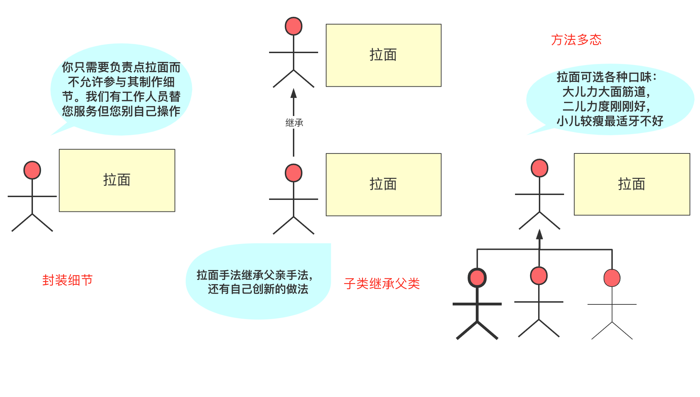

莎士比亚说："一千个读者眼里有一千个哈姆雷特"，说到对现实世界的抽象，虽然方法相同，但是运用同样的方法，最终得到的结果可能千差万别，那么如何评价这个抽象的结果的好坏呢？

这就要提到面喜爱那个对象的五大基本原则了，有了五大原则，我们参考他们来评价一个抽象的好坏。