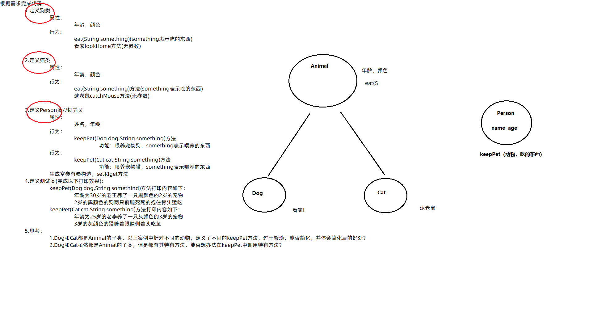

# 案例

```java
根据需求完成代码:
    1.定义狗类
        属性：
            年龄，颜色
        行为:
            eat(String something)(something表示吃的东西)
            看家lookHome方法(无参数)

    2.定义猫类
        属性：
            年龄，颜色
        行为:
            eat(String something)方法(something表示吃的东西)
            逮老鼠catchMouse方法(无参数)

    3.定义Person类//饲养员
        属性：
            姓名，年龄
        行为：
            keepPet(Dog dog,String something)方法
                功能：喂养宠物狗，something表示喂养的东西
        行为：
            keepPet(Cat cat,String something)方法
                功能：喂养宠物猫，something表示喂养的东西
        生成空参有参构造，set和get方法  
    4.定义测试类(完成以下打印效果):
        keepPet(Dog dog,String somethind)方法打印内容如下：
            年龄为30岁的老王养了一只黑颜色的2岁的狗
            2岁的黑颜色的狗两只前腿死死的抱住骨头猛吃
        keepPet(Cat cat,String somethind)方法打印内容如下：
            年龄为25岁的老李养了一只灰颜色的3岁的猫
            3岁的灰颜色的猫眯着眼睛侧着头吃鱼
    5.思考：       
        1.Dog和Cat都是Animal的子类，以上案例中针对不同的动物，定义了不同的keepPet方法，过于繁琐，能否简化，并体会简化后的好处？
        2.Dog和Cat虽然都是Animal的子类，但是都有其特有方法，能否想办法在keepPet中调用特有方法？
```

下面我们来看思维导图



之后开始进行代码演示：

 先写父类的animal

```java
package 面向对象进阶.a8;

public class Animal {
    private int age;
    private String color;

    public void eat(String something){
        System.out.println("动物在吃"+something);
    }

    public Animal() {
    }

    public Animal(int age, String color) {
        this.age = age;
        this.color = color;
    }

    /**
     * 获取
     * @return age
     */
    public int getAge() {
        return age;
    }

    /**
     * 设置
     * @param age
     */
    public void setAge(int age) {
        this.age = age;
    }

    /**
     * 获取
     * @return color
     */
    public String getColor() {
        return color;
    }

    /**
     * 设置
     * @param color
     */
    public void setColor(String color) {
        this.color = color;
    }

    public String toString() {
        return "Animal{age = " + age + ", color = " + color + "}";
    }
}

```

之后是子类的

```java
package 面向对象进阶.a8;

public class Cat extends Animal{
    public Cat() {
    }

    public Cat(int age, String color) {
        super(age, color);
    }

    @Override
    public void eat(String something) {
        System.out.println(getAge()+"岁的"+getColor()+"颜色的猫咪眯着眼睛" +
                "侧着头吃"+something);
    }
    public void catchMouse(){
        System.out.println("猫捉老鼠");
    }
}

```

```java
package 面向对象进阶.a8;

public class Dog extends Animal{

    public Dog() {
    }

    public Dog(int age, String color) {
        super(age, color);
    }
    //行为


    @Override
    public void eat(String something) {
        System.out.println(getAge()+"的"+getColor()+"颜色的狗，俩只前脚" +
                "死死抱着"+something+"猛吃");
    }
    public void lookHome(){
        System.out.println("狗在看见");
    }
}

```

这里是person的。person这里用到了多态。

```java
package 面向对象进阶.a8;

import javax.sound.midi.Soundbank;

//这里的person不要去继承animal
public class Person {
    private String name;
    private int age;
    //饲养猫和狗
    public void KeepPet(Animal a,String something){
        if (a instanceof Dog){
            Dog d=(Dog) a;
            System.out.println("年龄为"+age+"岁的"+name+"养了一直"+a.getColor()
                    +"颜色的"+a.getAge()+"岁的狗");
            d.eat(something);
        }else if (a instanceof Cat){
            Cat c=(Cat) a;
            System.out.println("年龄为"+age+"岁的"+name+"养了一直"+a.getColor()
                    +"颜色的"+a.getAge()+"岁的猫");
            c.eat(something);
        }else {
            System.out.println("没有这种动物");
        }

    }

    public Person() {
    }

    public Person(String name, int age) {
        this.name = name;
        this.age = age;
    }

    /**
     * 获取
     * @return name
     */
    public String getName() {
        return name;
    }

    /**
     * 设置
     * @param name
     */
    public void setName(String name) {
        this.name = name;
    }

    /**
     * 获取
     * @return age
     */
    public int getAge() {
        return age;
    }

    /**
     * 设置
     * @param age
     */
    public void setAge(int age) {
        this.age = age;
    }

    public String toString() {
        return "Person{name = " + name + ", age = " + age + "}";
    }
}

```

之后再看test类。

```java
package 面向对象进阶.a8;

public class Test {
    public static void main(String[] args) {
        //创建对象并且调用方法。


        Person p1=new Person("老王",30);
        Dog d=new Dog(2,"黑");
        Cat c=new Cat(1,"白");
        p1.KeepPet(d,"骨头");
        p1.KeepPet(c,"鱼");

    }
}

```

# 