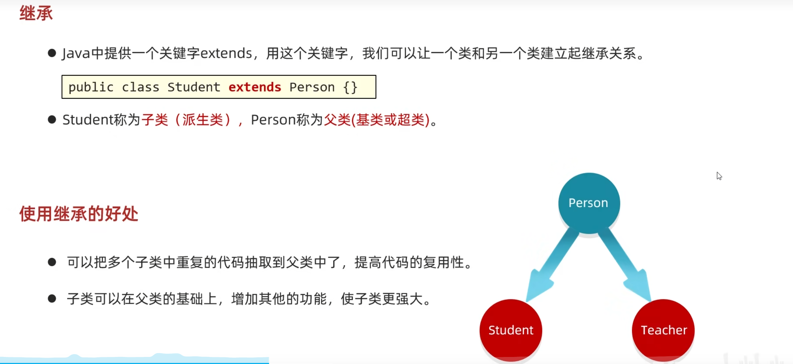
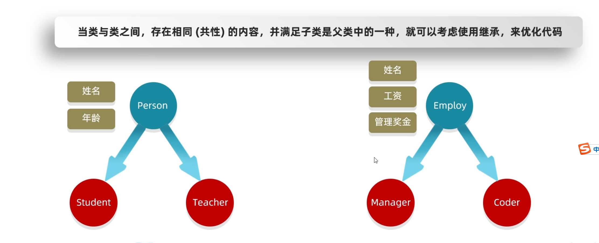
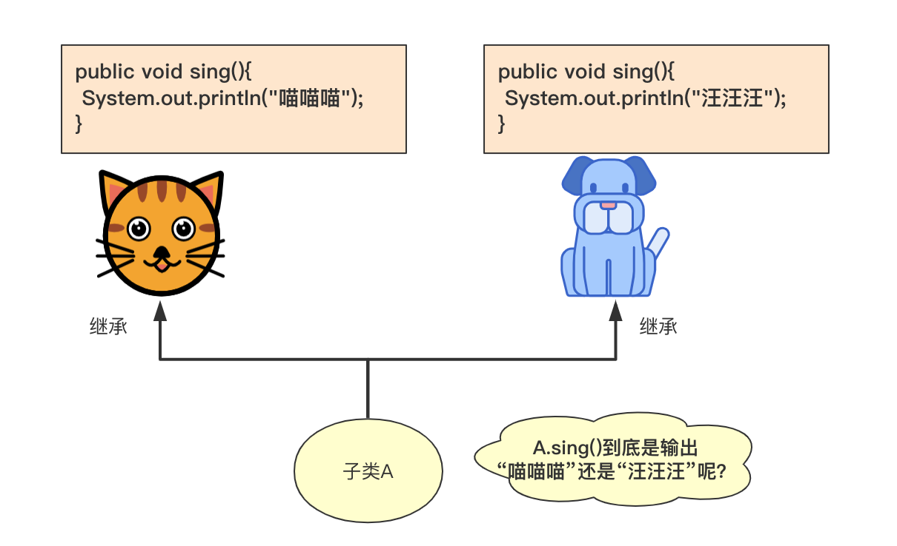
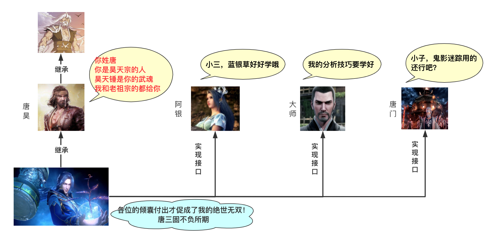
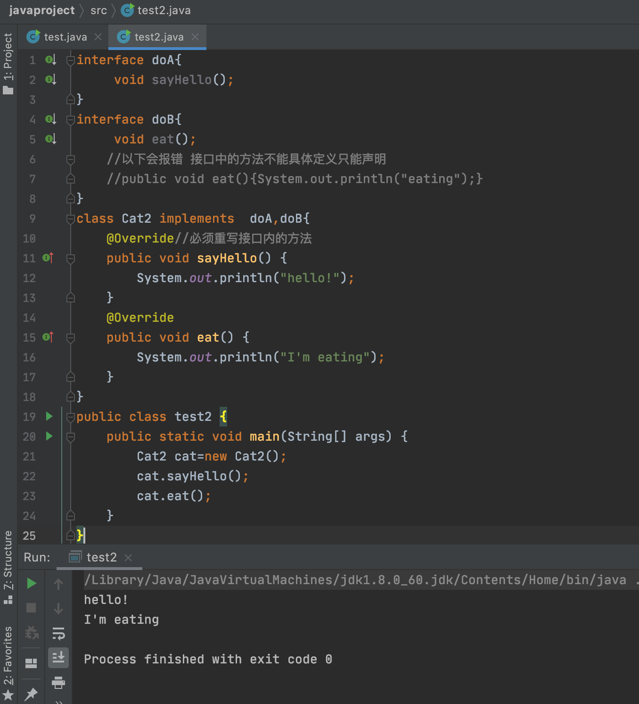
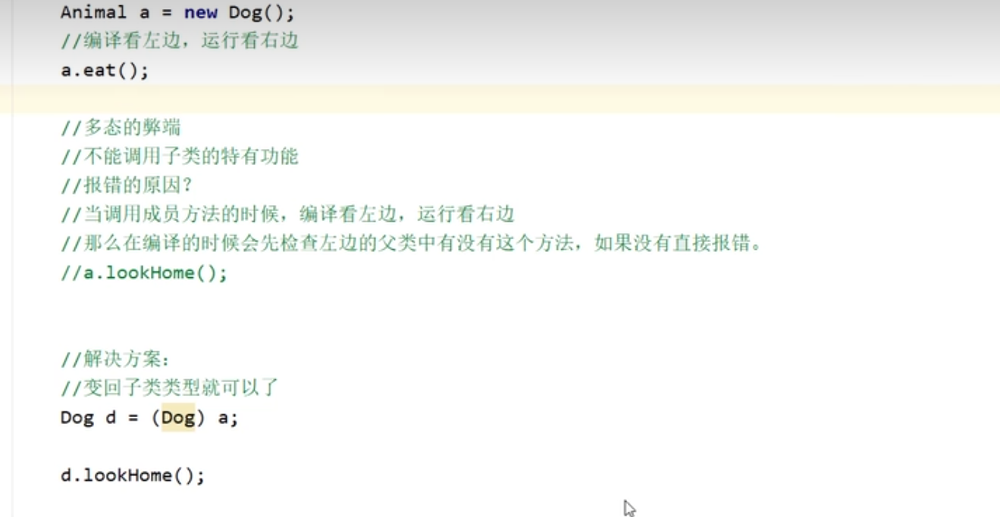
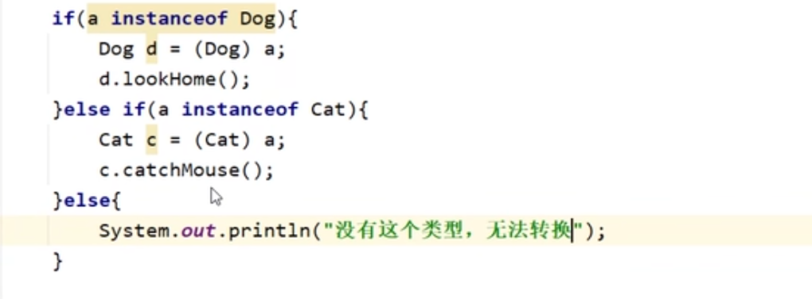
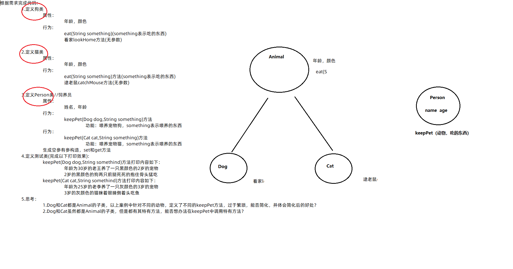

# 前言

这本书励志与用这一本书讲透java的面向对象，其实面向对象是一个非常常见的场景在java里面，所以这个是每一个学习java要实现掌握的，并且详细掌握的，为了以后我们去学习一些框架，打下基础。

# 什么是面向对象

相信很多Java开发者，在最初接触Java的时候就听说过，Java是一种面向对象的开发语言，那么什么是面向对象呢？

首先，所谓面向对象，其实是指软件工程中的一类编程风格，很多人称呼他们为开发范式、编程泛型（Programming Paradigm）。面向对象是众多开发范式中的一种。除了面向对象以外，还有面向过程、指令式编程、函数式编程等。

虽然这几年函数式编程越来越被人们所熟知，但是，在所有的开发范式中，我们接触最多的主要还是面向过程和面向对象两种。

### 什么是面向过程

面向过程(Procedure Oriented)是一种以过程为中心的编程思想，是一种自顶而下的编程模式。最典型的面向过程的编程语言就是C语言。

简单来说，面向过程的开发范式中，程序员需要把问题分解成一个一个步骤，每个步骤用函数实现，依次调用即可。

就是说，在进行面向过程编程的时候，不需要考虑那么多，上来先定义一个函数，然后使用各种诸如if-else、for-each等方式进行代码执行。最典型的用法就是实现一个简单的算法，比如实现冒泡排序。

面向过程进行的软件开发，其代码都是流程化的，很明确的可以看出第一步做什么、第二步做什么。这种方式的代码执行起来效率很高。

但是，面向过程同时存在着代码重用性低，扩展能力差，后期维护难度比较大等问题。

### 什么是面向对象

面向对象（Object Oriented）的雏形，最早在出现在1960年的Simula语言中，当时的程序设计领域正面临着一种危机：在软硬件环境逐渐复杂的情况下，软件如何得到良好的维护？

面向对象程序设计在某种程度上通过强调可重复性解决了这一问题。目前较为流行的面向对象语言主要有Java、C#、C++、Python、Ruby、PHP等。

简单来说，面向对象的开发范式中，程序员将问题分解成一个一个步骤，对每个步骤进行相应的抽象，形成对象，通过不同对象之间的调用，组合解决问题。

就是说，在进行面向对象进行编程的时候，要把属性、行为等封装成对象，然后基于这些对象及对象的能力进行业务逻辑的实现。比如:想要造一辆车，上来要先把车的各种属性定义出来，然后抽象成一个Car类。

面向对象的编程方法之所以更加受欢迎，是因为他更加符合人类的思维方式。这种方式编写出来的代码扩展性、可维护性都很高。

与其实面向对象是一种开发范式，倒不如说面向对象是一种对现实世界的理解和抽象的方法。通过对现实世界的理解和抽象，在运用封装、继承、多态等方法，通过抽象出对象的方式进行软件开发。


举个简单点的例子来区分一下面向过程和面向对象。

有一天，你想吃小碗汤了，怎么办呢？有两个选择：

1）自己买食材，豆腐皮啊、肉啊、蒜苔啊等等，自己动手做。

2）到饭店去，只需要对老板喊一声，“来份小碗汤。”

第一种就是面向过程，第二种就是面向对象。

面向过程有什么劣势呢？假如你买了小碗汤的食材，临了又想吃宫保鸡丁了，你是不是还得重新买食材？

面向对象有什么优势呢？假如你不想吃小碗汤了，你只需要对老板说，“我那个小碗汤如果没做的话，换成宫保鸡丁吧！”

面向过程是流程化的，一步一步，上一步做完了，再做下一步。

面向对象是模块化的，我做我的，你做你的，我需要你做的话，我就告诉你一声。我不需要知道你到底怎么做，只看功劳不看苦劳。

不过，如果追到底的话，面向对象的底层其实还是面向过程，只不过把面向过程进行了抽象化，封装成了类，方便我们的调用。

# 类和对象

对象可以是现实中看得见的任何物体，比如说，一只特立独行的猪；也可以是想象中的任何虚拟物体，比如说能七十二变的孙悟空。

Java 通过类（class）来定义这些物体，这些物体有什么状态，通过字段来定义，比如说比如说猪的颜色是纯色还是花色；这些物体有什么行为，通过方法来定义，比如说猪会吃，会睡觉。

来，定义一个简单的类给你看看。


```java

public class Person {
    private String name;
    private int age;
    private int sex;

    private void eat() {
    }

    private void sleep() {
    }

    private void dadoudou() {
    }
}
```

一个类可以包含：

- 字段（Filed）
- 方法（Method）
- 构造方法（Constructor）

在 Person 类中，字段有 3 个，分别是 name、age 和 sex，它们也称为成员变量——在类内部但在方法外部，方法内部的叫临时变量。

成员变量有时候也叫做实例变量，在编译时不占用内存空间，在运行时获取内存，也就是说，只有在对象实例化（`new Person()`）后，字段才会获取到内存，这也正是它被称作“实例”变量的原因。

方法有 3 个，分别是 `eat()`、`sleep()` 和 `dadoudou()`，表示 Person 这个对象可以做什么，也就是吃饭睡觉打豆豆。

那么我们可能会疑惑，为什么没有构造方法。

的确在 Person 类的源码文件（.java）中没看到，但在反编译后的字节码文件（.class）中是可以看得到的。


```java
//
// Source code recreated from a .class file by IntelliJ IDEA
// (powered by Fernflower decompiler)
//

package com.itwanger.twentythree;

public class Person {
    private String name;
    private int age;
    private int sex;

    public Person() {
    }

    private void eat() {
    }

    private void sleep() {
    }

    private void dadoudou() {
    }
}
```

`public Person(){}` 就是默认的构造方法，因为是空的构造方法（方法体中没有内容），所以可以缺省。Java 聪明就聪明在这，有些很死板的代码不需要开发人员添加，它会偷偷地做了。但是在实际的开发中，我们还是推荐加上的。

## new一个对象

创建 Java 对象时，需要用到 `new` 关键字。


```java
Person person = new Person();
```

这行代码就通过 Person 类创建了一个 Person 对象。所有**对象**在创建的时候都会在**堆内存中分配空间**。

创建对象的时候，需要一个 `main()` 方法作为入口， `main()` 方法可以在当前类中，也可以在另外一个类中。

第一种：`main()` 方法直接放在 Person 类中。


```java
public class Person {
    private String name;
    private int age;
    private int sex;

    private void eat() {}
    private void sleep() {}
    private void dadoudou() {}

    public static void main(String[] args) {
        Person person = new Person();
        System.out.println(person.name);
        System.out.println(person.age);
        System.out.println(person.sex);
    }
}
```

输出结果如下所示：


```text
null
0
0
```

第二种：`main()` 方法不在 Person 类中，而在另外一个类中。


实际开发中，我们通常不在当前类中直接创建对象并使用它，而是放在使用对象的类中，比如说上图中的 PersonTest 类。

可以把 PersonTest 类和 Person 类放在两个文件中，也可以放在一个文件（命名为 PersonTest.java）中，就像下面这样。


```java

public class PersonTest {
    public static void main(String[] args) {
        Person person = new Person();
    }
}

class Person {
    private String name;
    private int age;
    private int sex;

    private void eat() {}
    private void sleep() {}
    private void dadoudou() {}
}
```

## 初始化对象

在之前的例子中，程序输出结果为：


```text
null
0
0
```

为什么会有这样的输出结果呢？因为 Person 对象没有初始化，因此输出了 String 的默认值 null，int 的默认值 0。

那怎么初始化 Person 对象（对字段赋值）呢？

#### 第一种：通过对象的引用变量。


```java
public class Person {
    private String name;
    private int age;
    private int sex;

    public static void main(String[] args) {
        Person person = new Person();
        person.name = "xiaou";
        person.age = 18;
        person.sex = 1;
        
        System.out.println(person.name);
        System.out.println(person.age);
        System.out.println(person.sex);
    }
}
```

person 被称为对象 Person 的引用变量，见下图：


通过对象的引用变量，可以直接对字段进行初始化（`person.name = "xiaou"`），所以以上代码输出结果如下所示：


```text
xiaou
18
1
```

#### 第二种：通过方法初始化。


```java

public class Person {
    private String name;
    private int age;
    private int sex;

    public void initialize(String n, int a, int s) {
        name = n;
        age = a;
        sex = s;
    }

    public static void main(String[] args) {
        Person person = new Person();
        person.initialize("xiaou",18,1);

        System.out.println(person.name);
        System.out.println(person.age);
        System.out.println(person.sex);
    }
}
```

在 Person 类中新增方法 `initialize()`，然后在新建对象后传参进行初始化（`person.initialize("xiaou", 18, 1)`）。

#### 第三种：通过构造方法初始化。


```java

public class Person {
    private String name;
    private int age;
    private int sex;

    public Person(String name, int age, int sex) {
        this.name = name;
        this.age = age;
        this.sex = sex;
    }

    public static void main(String[] args) {
        Person person = new Person("xiaou", 18, 1);

        System.out.println(person.name);
        System.out.println(person.age);
        System.out.println(person.sex);
    }
}
```

这也是最标准的一种做法，直接在 new 的时候把参数传递过去。

补充一点知识，匿名对象。匿名对象意味着没有引用变量，它只能在创建的时候被使用一次。


```java
new Person();
```

可以直接通过匿名对象调用方法：

```java
new Person().initialize("xiaou", 18, 1);
```

我们来看下面的这个

```java
public class a1phone {
    String brand;
    double price;

    public void call(){
        System.out.println("手机在打电话");
    }
    public void playGame(){
        System.out.println("手机在玩游戏");
    }
}

```


```java
package 面向方法;

public class a1phonetest {
    public static void main(String[] args) {
        //创建手机的对象
        a1phone p=new a1phone();
        p.brand="小米";
        p.price=1999.98;
        System.out.println(p.brand);
        System.out.println(p.price);
        p.call();
        p.playGame();
        a1phone p2=new a1phone();
        p2.brand="苹果";
        p2.price=9999.99;

    }
}
```

我们把我们新建的这个对象，也叫做javabean。

在javabean类中，是不写main方法的。

在以前，编写main方法的类，都叫做，测试类。

我们可以在测试类中创建javabean类的对象进行赋值调用

## 关于对象

#### **1）抽象的历程**

所有编程语言都是一种抽象，甚至可以说，我们能够解决的问题的复杂程度取决于抽象的类型和质量。

Smalltalk 是历史上第一门获得成功的面向对象语言，也为 Java 提供了灵感。它有 5 个基本特征：

- 万物皆对象。
- 一段程序实际上就是多个对象通过发送消息的方式来告诉彼此该做什么。
- 通过组合的方式，可以将多个对象封装成其他更为基础的对象。
- 对象是通过类实例化的。
- 同一类型的对象可以接收相同的消息。

总结一句话就是：

> 状态+行为+标识=对象，每个对象在内存中都会有一个唯一的地址。

#### **2）对象具有接口**

所有的对象，都可以被归为一类，并且同一类对象拥有一些共同的行为和特征。在 Java 中，class 关键字用来定义一个类型。

创建抽象数据类型是面向对象编程的一个基本概念。你可以创建某种类型的变量，Java 中称之为对象或者实例，然后你就可以操作这些变量，Java 中称之为发送消息或者发送请求，最后对象决定自己该怎么做。

类描述了一系列具有相同特征和行为的对象，从宽泛的概念上来说，类其实就是一种自定义的数据类型。

一旦创建了一个类，就可以用它创建任意多个对象。面向对象编程语言遇到的最大一个挑战就是，如何把现实/虚拟的元素抽象为 Java 中的对象。

对象能够接收什么样的请求是由它的接口定义的。具体是怎么做到的，就由它的实现方法来实现。

#### **3）访问权限修饰符**

类的创建者有时候也被称为 API 提供者，对应的，类的使用者就被称为 API 调用者。

JDK 就给我们提供了 Java 的基础实现，JDK 的作者也就是基础 API 的提供者（Java 多线程部分的作者 Doug Lea 是被 Java 程序员敬佩的一个大佬），我们这些 Java 语言的使用者，说白了就是 JDK 的调用者。


当然了，假如我们也提供了新的类给其他调用者，我们也就成为了新的创建者。

API 创建者在创建新的类的时候，只暴露必要的接口，而隐藏其他所有不必要的信息，之所以要这么做，是因为如果这些信息对调用者是不可见的，那么创建者就可以随意修改隐藏的信息，而不用担心对调用者的影响。

这里就必须要讲到 java 的权限修饰符

访问权限修饰符的第一个作用是，防止类的调用者接触到他们不该接触的内部实现；第二个作用是，让类的创建者可以轻松修改内部机制而不用担心影响到调用者的使用。

- public
- private
- protected

还有一种“默认”的权限修饰符，是缺省的，它修饰的类可以访问同一个包下面的其他类。

#### **4）组合**

我们可以把一个创建好的类作为另外一个类的成员变量来使用，利用已有的类组成成一个新的类，被称为“复用”，组合代表的关系是 has-a 的关系。

之后来看我们java中，面向对象的三大基本特征：

# 面向对象三大基本特征

## 封装(Encapsulation)


所谓封装，也就是把客观事物封装成抽象的类，并且类可以把自己的数据和方法只让可信的类或者对象操作，对不可信的进行信息隐藏。

简单的说，一个类就是一个封装了数据以及操作这些数据的代码的逻辑实体。在一个对象内部，某些代码或某些数据可以是私有的，不能被外界访问。通过这种方式，对象对内部数据提供了不同级别的保护，以防止程序中无关的部分意外的改变或错误的使用了对象的私有部分。

封装从字面上来理解就是包装的意思，专业点就是信息隐藏，**是指利用抽象将数据和基于数据的操作封装在一起，使其构成一个不可分割的独立实体**。

使用封装有 4 大好处：

- 1、良好的封装能够减少耦合。
- 2、类内部的结构可以自由修改。
- 3、可以对成员进行更精确的控制。
- 4、隐藏信息，实现细节。


如我们想要定义一个矩形，先定义一个Rectangle类，并其中通过封装的手段放入一些必备数据。

```markup
/**
* 矩形
*/
class Rectangle {

     /**
      * 设置矩形的长度和宽度
      */
     public Rectangle(int length, int width) {
         this.length = length;
         this.width = width;
     }
    
     /**
      * 长度
      */
     private int length;
    
     /**
      * 宽度
      */
     private int width;
    
     /**
      * 获得矩形面积
      *
      * @return
      */
     public int area() {
         return this.length * this.width;
     }
}复制ErrorOK!
```

我们通过封装的方式，给"矩形"定义了"长度"和"宽度"，这就完成了对现实世界中的"矩形"的抽象的第一步。

如果这个还没有那么的直观，那我们来看下面的这两个类

Husband.java


```java
public class Husband {
    
    /*
     * 对属性的封装
     * 一个人的姓名、性别、年龄、妻子都是这个人的私有属性
     */
    private String name ;
    private String sex ;
    private int age ;
    private Wife wife;
    
    /*
     * setter()、getter()是该对象对外开发的接口
     */
    public String getName() {
        return name;
    }

    public void setName(String name) {
        this.name = name;
    }

    public String getSex() {
        return sex;
    }

    public void setSex(String sex) {
        this.sex = sex;
    }

    public int getAge() {
        return age;
    }

    public void setAge(int age) {
        this.age = age;
    }

    public void setWife(Wife wife) {
        this.wife = wife;
    }
}
```

Wife.java


```java
public class Wife {
    private String name;
    private int age;
    private String sex;
    private Husband husband;

    public String getName() {
        return name;
    }

    public void setName(String name) {
        this.name = name;
    }

    public String getSex() {
        return sex;
    }

    public void setSex(String sex) {
        this.sex = sex;
    }

    public void setAge(int age) {
        this.age = age;
    }

    public void setHusband(Husband husband) {
        this.husband = husband;
    }

    public Husband getHusband() {
        return husband;
    }
    
}
```

可以看得出， Husband 类里面的 wife 属性是没有 `getter()`的，同时 Wife 类的 age 属性也是没有 `getter()`方法的。

所以封装把一个对象的属性私有化，同时提供一些可以被外界访问的属性的方法，如果不想被外界方法，我们大可不必提供方法给外界访问。

但是如果一个类没有提供给外界任何可以访问的方法，那么这个类也没有什么意义了。

比如我们将一个房子看做是一个对象，里面有漂亮的装饰，如沙发、电视剧、空调、茶桌等等都是该房子的私有属性，但是如果我们没有那些墙遮挡，是不是别人就会一览无余呢？没有一点儿隐私！

因为存在那个遮挡的墙，我们既能够有自己的隐私而且我们可以随意的更改里面的摆设而不会影响到外面的人。

但是如果没有门窗，一个包裹的严严实实的黑盒子，又有什么存在的意义呢？所以通过门窗别人也能够看到里面的风景。所以说门窗就是房子对象留给外界访问的接口。

通过这个我们还不能真正体会封装的好处。现在我们从程序的角度来分析封装带来的好处。如果我们不使用封装，那么该对象就没有 `setter()`和 `getter()`，那么 Husband 类应该这样写：


```java
public class Husband {
    public String name ;
    public String sex ;
    public int age ;
    public Wife wife;
}
```

我们应该这样来使用它：


```java
Husband husband = new Husband();
husband.age = 30;
husband.name = "张三";
husband.sex = "男";    //貌似有点儿多余
```

但是哪天如果我们需要修改 Husband，例如将 age 修改为 String 类型的呢？你只有一处使用了这个类还好，如果你有几十个甚至上百个这样地方，你是不是要改到崩溃。如果使用了封装，我们完全可以不需要做任何修改，只需要稍微改变下 Husband 类的 `setAge()`方法即可。


```java
public class Husband {
    
    /*
     * 对属性的封装
     * 一个人的姓名、性别、年龄、妻子都是这个人的私有属性
     */
    private String name ;
    private String sex ;
    private String age ;    /* 改成 String类型的*/
    private Wife wife;
    
    public String getAge() {
        return age;
    }
    
    public void setAge(int age) {
        //转换即可
        this.age = String.valueOf(age);
    }
    
    /** 省略其他属性的setter、getter **/
    
}
```

其他的地方依然这样引用( `husband.setAge(22)` )保持不变。

到了这里我们确实可以看出，**封装确实可以使我们更容易地修改类的内部实现，而无需修改使用了该类的代码**。

我们再看这个好处：**封装可以对成员变量进行更精确的控制**。

还是那个 Husband，一般来说我们在引用这个对象的时候是不容易出错的，但是有时你迷糊了，写成了这样：


```java
Husband husband = new Husband();
husband.age = 300;
```

也许你是因为粗心写成了这样，你发现了还好，如果没有发现那就麻烦大了，谁见过 300 岁的老妖怪啊！

但是使用封装我们就可以避免这个问题，我们对 age 的访问入口做一些控制(setter)如：


```java
public class Husband {
    
    /*
     * 对属性的封装
     * 一个人的姓名、性别、年龄、妻子都是这个人的私有属性
     */
    private String name ;
    private String sex ;
    private int age ;    /* 改成 String类型的*/
    private Wife wife;

    public int getAge() {
        return age;
    }

    public void setAge(int age) {
        if(age > 120){
            System.out.println("ERROR：error age input....");    //提示錯誤信息
        }else{
            this.age = age;
        }
        
    }
    
    /** 省略其他属性的setter、getter **/
    
}
```

上面都是对 setter 方法的控制，其实通过封装我们也能够对对象的出口做出很好的控制。例如性别在数据库中一般都是以 1、0 的方式来存储的，但是在前台我们又不能展示 1、0，这里我们只需要在 `getter()`方法里面做一些转换即可。


```java
public String getSexName() {
    if("0".equals(sex)){
        sexName = "女";
    }
    else if("1".equals(sex)){
        sexName = "男";
    }
    return sexName;
}
```

在使用的时候我们只需要使用 sexName 即可实现正确的性别显示。同理也可以用于针对不同的状态做出不同的操作。


```java
public String getCzHTML(){
    if("1".equals(zt)){
        czHTML = "<a href='javascript:void(0)' onclick='qy("+id+")'>启用</a>";
    }
    else{
        czHTML = "<a href='javascript:void(0)' onclick='jy("+id+")'>禁用</a>";
    }
    return czHTML;
}
```

说了这么多，我们来看java实现封装的基本思路

1. 修改属性的可见性来限制对属性的访问（一般限制为private），例如：

```java
public class Person {
    private String name;
    private int age;
}
```

这段代码中，将 **name** 和 **age** 属性设置为私有的，只能本类才能访问，其他类都访问不了，如此就对信息进行了隐藏。

2. 对每个值属性提供对外的公共方法访问，也就是创建一对赋取值方法，用于对私有属性的访问，例如：

```java
public class Person{
    private String name;
    private int age;

    public int getAge(){
      return age;
    }

    public String getName(){
      return name;
    }

    public void setAge(int age){
      this.age = age;
    }

    public void setName(String name){
      this.name = name;
    }
}
```

采用 **this** 关键字是为了解决实例变量（private String name）和局部变量（setName(String name)中的name变量）之间发生的同名的冲突。

之后我们来复习一个这个private关键字，他是一个权限修饰符。可以修饰成员(成员变量和成员方法)被private修饰的成员，只能在 本类中才能访问如果一个关键字被private修饰后，就只能通过set和get方法来获得和更改参数。

```java
package 面向方法;
public class a3 {
    private String name;
    private int age;
    private String gender;

    //提供get和set方法
    //作用：给name赋值需要有赋值
    public void setName(String n){
        name=n;
    }
    //对外提供数据
    public String getName(){
        return name;
    }


    public void setAge(int a){
        if (a>=18&&a<=50){
            age=a;
        }else {
            System.out.println("非法参数");
        }

    }

    public int getAge(){
        return age;
    }

    public void setGender(String g){
        gender=g;
    }
    public String getGender(){
        return gender;
    }


    public void sleep(){
        System.out.println("在睡觉");
    }public void eat(){
        System.out.println("在吃饭");
    }
}

```

例如这里的get和set方法。

以及main主函数里的调用：

```java
package 面向方法;

public class a3test {
    public static void main(String[] args) {
        a3 gf1=new a3();
        gf1.setName("小诗诗");
        gf1.setAge(18);
        gf1.setGender("傻逼");
        System.out.println(gf1.getAge());
        System.out.println(gf1.getName());
        System.out.println(gf1.getGender());
        gf1.eat();
        gf1.sleep();
    }
}

```

看了这么多，相信大家应该已经看明白什么是封装了。

下面就开始讲第二个基本特征

## 继承(Inheritance)]

继承是指这样一种能力：它可以使用现有类的所有功能，并在无需重新编写原来的类的情况下对这些功能进行扩展。

通过继承创建的新类称为“子类”或“派生类”，被继承的类称为“基类”、“父类”或“超类”。继承的过程，就是从一般到特的过程。







继承是java面向对象编程技术的一块基石，因为它允许创建分等级层次的类。

继承就是子类继承父类的特征和行为，使得子类对象（实例）具有父类的实例域和方法，或子类从父类继承方法，使得子类具有父类相同的行为。

生活中的继承：


兔子和羊属于食草动物类，狮子和豹属于食肉动物类。

食草动物和食肉动物又是属于动物类。

所以继承需要符合的关系是：is-a，父类更通用，子类更具体。

虽然食草动物和食肉动物都是属于动物，但是两者的属性和行为上有差别，所以子类会具有父类的一般特性也会具有自身的特性。


我们想要定义一个正方形，因为已经有了矩形，所以我们可以直接继承Rectangle类，因为正方形是长方形的一种特例。

```markup
/**
 * 正方形，继承自矩形
 */
class Square extends Rectangle {

    /**
     * 设置正方形边长
     *
     * @param length
     */
    public Square(int length) {
        super(length, length);
    }
}复制ErrorOK!
```

现实世界中，"正方形"是"矩形"的特例，或者说正方形是通过矩形派生出来的，这种派生关系，在面向对象中可以用继承来表达。

如果仅仅只有两三个类，每个类的属性和方法很有限的情况下确实没必要实现继承，但事情并非如此，事实上一个系统中往往有很多个类并且有着很多相似之处，比如猫和狗同属动物，或者学生和老师同属人。各个类可能又有很多个相同的属性和方法，这样的话如果每个类都重新写不仅代码显得很乱，代码工作量也很大。

这时继承的优势就出来了：可以直接使用父类的属性和方法，自己也可以有自己新的属性和方法满足拓展，父类的方法如果自己有需求更改也可以重写。这样**使用继承不仅大大的减少了代码量，也使得代码结构更加清晰可见**。


所以这样从代码的层面上来看我们设计这个完整的 Animal 类是这样的：


```java
class Animal
{
    public int id;
    public String name;
    public int age;
    public int weight;

    public Animal(int id, String name, int age, int weight) {
        this.id = id;
        this.name = name;
        this.age = age;
        this.weight = weight;
    }
    //这里省略get set方法
    public void sayHello()
    {
        System.out.println("hello");
    }
    public void eat()
    {
        System.out.println("I'm eating");
    }
    public void sing()
    {
        System.out.println("sing");
    }
}
```

而 Dog，Cat，Chicken 类可以这样设计：


```java
class Dog extends Animal//继承animal
{
    public Dog(int id, String name, int age, int weight) {
        super(id, name, age, weight);//调用父类构造方法
    }
}
class Cat extends Animal{

    public Cat(int id, String name, int age, int weight) {
        super(id, name, age, weight);//调用父类构造方法
    }
}
class Chicken extends Animal{

    public Chicken(int id, String name, int age, int weight) {
        super(id, name, age, weight);//调用父类构造方法
    }
    //鸡下蛋
    public void layEggs()
    {
        System.out.println("我是老母鸡下蛋啦，咯哒咯！咯哒咯！");
    }
}
```

各自的类继承 Animal 后可以直接使用 Animal 类的属性和方法而不需要重复编写，各个类如果有自己的方法也可很容易地拓展

继承的分类

继承分为单继承和多继承，Java 语言只支持类的单继承，但可以通过实现接口的方式达到多继承的目的。****

| 继承                                                         | 定义                       | 优缺点                                                       |
| ------------------------------------------------------------ | -------------------------- | ------------------------------------------------------------ |
| 单继承 | 一个子类只拥有一个父类     | 优点：在类层次结构上比较清晰 缺点：结构的丰富度有时不能满足使用需求 |
| 多继承（Java 不支持，但可以用其它方式满足多继承使用需求） | 一个子类拥有多个直接的父类 | 优点：子类的丰富度很高 缺点：容易造成混乱                    |

### **单继承**

单继承，一个子类只有一个父类，如我们上面讲过的 Animal 类和它的子类。**单继承在类层次结构上比较清晰，但缺点是结构的丰富度有时不能满足使用需求**。

### **多继承**

多继承，一个子类有多个直接的父类。这样做的好处是子类拥有所有父类的特征，**子类的丰富度很高，但是缺点就是容易造成混乱**。下图为一个混乱的例子。



要注意的是，java是不支持多继承的，至于为什么不支持多继承呢，我们来看一下解释。

下面我们来看这个菱型继承

假设我们有类B和类C，它们都继承了相同的类A。另外我们还有类D，类D通过多重继承机制继承了类B和类C。



这时候，因为D同时继承了B和C，并且B和C又同时继承了A，那么，D中就会因为多重继承，继承到两份来自A中的属性和方法。

这时候，在使用D的时候，如果想要调用一个定义在A中的方法时，就会出现歧义。

因为这样的继承关系的形状类似于菱形，因此这个问题被形象地称为菱形继承问题。

而C++为了解决菱形继承问题，又引入了**虚继承**。

因为支持多继承，引入了菱形继承问题，又因为要解决菱形继承问题，引入了虚继承。而经过分析，人们发现我们其实真正想要使用多继承的情况并不多。

所以，在 Java 中，不允许“实现多继承”，即一个类不允许继承多个父类。但是 Java 允许“声明多继承”，即一个类可以实现多个接口，一个接口也可以继承多个父接口。由于接口只允许有方法声明而不允许有方法实现（Java 8以前），这就避免了 C++ 中多继承的歧义问题。

但是，Java不支持多继承，在Java 8中支持了默认函数（default method ）之后就不那么绝对了。

虽然我们还是没办法使用extends同时继承多个类，但是因为有了默认函数，我们有可能通过implements从多个接口中继承到多个默认函数，那么，又如何解决这种情况带来的菱形继承问题呢？这个问题留给大家去查询答案。


Java 虽然不支持多继承，但是 Java 有三种实现多继承效果的方式，**分别是**内部类、多层继承和实现接口。

内部类可以继承一个与外部类无关的类，保证了内部类的独立性，正是基于这一点，可以达到多继承的效果。

**多层继承：\**子类继承父类，父类如果还继承其他的类，那么这就叫\**多层继承**。这样子类就会拥有所有被继承类的属性和方法。


实现接口无疑是满足多继承使用需求的最好方式，一个类可以实现多个接口满足自己在丰富性和复杂环境的使用需求。

类和接口相比，**类就是一个实体，有属性和方法，而接口更倾向于一组方法**。举个例子，就拿斗罗大陆的唐三来看，他存在的继承关系可能是这样的：




下面来一个图，让你快速区分这个继承的分类


### 如何实现继承

#### **extends 关键字**

在 Java 中，类的继承是单一继承，也就是说一个子类只能拥有一个父类，所以**extends**只能继承一个类。其使用语法为：


```java
class 子类名 extends 父类名{}
```

例如 Dog 类继承 Animal 类，它是这样的：


```java
class Animal{} //定义Animal类
class Dog extends Animal{} //Dog类继承Animal类
```

子类继承父类后，就拥有父类的非私有的**属性和方法**。如果不明白，请看这个案例，在 IDEA 下创建一个项目，创建一个 test 类做测试，分别创建 Animal 类和 Dog 类，Animal 作为父类写一个 sayHello()方法，Dog 类继承 Animal 类之后就可以调用 sayHello()方法。具体代码为：


```java
class Animal {
    public void  sayHello()//父类的方法
    {
        System.out.println("hello,everybody");
    }
}
class Dog extends Animal//继承animal
{ }
public class test {
    public static void main(String[] args) {
       Dog dog=new Dog();
       dog.sayHello();
    }
}
```

点击运行的时候 Dog 子类可以直接使用 Animal 父类的方法。


#### **implements 关键字**

使用 implements 关键字可以变相使 Java 拥有多继承的特性，使用范围为类实现接口的情况，一个类可以实现多个接口(接口与接口之间用逗号分开)。

我们来看一个案例，创建一个 test2 类做测试，分别创建 doA 接口和 doB 接口，doA 接口声明 sayHello()方法，doB 接口声明 eat()方法，创建 Cat2 类实现 doA 和 doB 接口，并且在类中需要重写 sayHello()方法和 eat()方法。具体代码为：


```java
interface doA{
     void sayHello();
}
interface doB{
     void eat();
    //以下会报错 接口中的方法不能具体定义只能声明
    //public void eat(){System.out.println("eating");}
}
class Cat2 implements  doA,doB{
    @Override//必须重写接口内的方法
    public void sayHello() {
        System.out.println("hello!");
    }
    @Override
    public void eat() {
        System.out.println("I'm eating");
    }
}
public class test2 {
    public static void main(String[] args) {
        Cat2 cat=new Cat2();
        cat.sayHello();
        cat.eat();
    }
}
```

Cat 类实现 doA 和 doB 接口的时候，需要实现其声明的方法，点击运行结果如下，这就是一个类实现接口的简单案例：



说了这么多我们来看一个继承的练习

### 练习


首先我们先画一个图


画出继承关系。画图是从下往上画。

之后是写代码。写代码的话，就是从上往下写。

先是动物

```java
package 面向对象进阶.a4;

public class Animal {
    //这里用的是public。所以所有继承他的子类都可以用这个方法。
    //如果是private，就只有自己可以用
    //可以相当于一个人的私房钱
    public void eat(){
        System.out.println("吃东西");
    }
    public void drink(){
        System.out.println("喝水");
    }
}

```

之后是猫和狗

```java
package 面向对象进阶.a4;

public class Cat extends Animal {
    public void cathMouse(){
        System.out.println("猫在抓老鼠");
    }

}

```


```java
package 面向对象进阶.a4;

public class Dog extends Animal {
    public void lookHome(){
        System.out.println("狗在看见");
    }
}

```

最后开始详细书写

```java
package 面向对象进阶.a4;

public class Husky extends Dog{
    public void breakHome(){
        System.out.println("哈士奇在拆家");
    }

}

```

```java
package 面向对象进阶.a4;

public class LiHua extends Cat{
}

```

```java
package 面向对象进阶.a4;

public class Ragdoll extends Cat {
}

```

```java
package 面向对象进阶.a4;

public class Teddy extends Dog {
    public void touch(){
        System.out.println("泰迪又在蹭我的腿了~");
    }
}

```

```java
package 面向对象进阶.a4;
/*
注意事项，子类只能访问父类中非私有的成员
 */
public class Test {
    public static void main(String[] args) {
        //创建一个布偶猫的对象
        Ragdoll rd=new Ragdoll();
        rd.eat();
        rd.drink();
        rd.cathMouse();
        System.out.println("--------------------------");
        //创建一个哈奇士对象
        Husky h=new Husky();
        h.eat();
        h.breakHome();
        h.drink();
        h.lookHome();
    }
}

```

最后的是我们的测试类。就可以发现测试成功了。

这样就算是一个完整的继承了。

## 多态(Polymorphism)

所谓多态就是指一个类实例的相同方法在不同情形有不同表现形式。多态机制使具有不同内部结构的对象可以共享相同的外部接口。

这意味着，虽然针对不同对象的具体操作不同，但通过一个公共的类，它们（那些操作）可以通过相同的方式予以调用。

最常见的多态就是将子类传入父类参数中，运行时调用父类方法时通过传入的子类决定具体的内部结构或行为。

在我刻板的印象里，西游记里的那段孙悟空和二郎神的精彩对战就能很好的解释“多态”这个词：一个孙悟空，能七十二变；一个二郎神，也能七十二变；他们都可以变成不同的形态，但只需要悄悄地喊一声“变”。

Java的多态是什么呢？其实就是一种能力——同一个行为具有不同的表现形式；换句话说就是，执行一段代码，Java 在运行时能根据对象的不同产生不同的结果。和孙悟空和二郎神都只需要喊一声“变”，然后就变了，并且每次变得还不一样；一个道理。

多态的前提条件有三个：

- 子类继承父类
- 子类覆盖父类的方法
- 父类引用指向子类对象


这个简单理解他的应用场景。就是

比如说有一个登录系统。

有三个不同身份的人都需要登录

这个时候。我们登录系统的这个形参。就可以写他父类的person了。


多态的一个简单应用，来看程序清单1-1：


```java
//子类继承父类
public class Wangxiaoer extends Wanger {
    public void write() { // 子类覆盖父类方法
        System.out.println("记住仇恨，表明我们要奋发图强的心智");
    }

    public static void main(String[] args) {
        // 父类引用指向子类对象
        Wanger[] wangers = { new Wanger(), new Wangxiaoer() };

        for (Wanger wanger : wangers) {
            // 对象是王二的时候输出：勿忘国耻
            // 对象是王小二的时候输出：记住仇恨，表明我们要奋发图强的心智
            wanger.write();
        }
    }
}

class Wanger {
    public void write() {
        System.out.println("勿忘国耻");
    }
}
```

#### 01、多态与后期绑定

现在，我们来思考一个问题：程序清单1-1在执行 `wanger.write()` 时，由于编译器只有一个 Wanger 引用，它怎么知道究竟该调用父类 Wanger 的 `write()` 方法，还是子类 Wangxiaoer 的 `write()` 方法呢？

答案是在运行时根据对象的类型进行后期绑定，编译器在编译阶段并不知道对象的类型，但是Java的方法调用机制能找到正确的方法体，然后执行出正确的结果。

多态机制提供的一个重要的好处程序具有良好的扩展性。来看程序清单2-1：


```java
//子类继承父类
public class Wangxiaoer extends Wanger {
    public void write() { // 子类覆盖父类方法
        System.out.println("记住仇恨，表明我们要奋发图强的心智");
    }
    
    public void eat() {
        System.out.println("我不喜欢读书，我就喜欢吃");
    }

    public static void main(String[] args) {
        // 父类引用指向子类对象
        Wanger[] wangers = { new Wanger(), new Wangxiaoer() };

        for (Wanger wanger : wangers) {
            // 对象是王二的时候输出：勿忘国耻
            // 对象是王小二的时候输出：记住仇恨，表明我们要奋发图强的心智
            wanger.write();
        }
    }
}

class Wanger {
    public void write() {
        System.out.println("勿忘国耻");
    }
    
    public void read() {
        System.out.println("每周读一本好书");
    }
}
```

在程序清单 2-1 中，我们在 Wanger 类中增加了 read() 方法，在 Wangxiaoer 类中增加了eat()方法，但这丝毫不会影响到 write() 方法的调用。write() 方法忽略了周围代码发生的变化，依然正常运行。这让我想起了金庸《倚天屠龙记》里九阳真经的口诀：“他强由他强，清风拂山岗；他横由他横，明月照大江。”

多态的这个优秀的特性，让我们在修改代码的时候不必过于紧张，因为多态是一项让程序员“将改变的与未改变的分离开来”的重要特性。

#### 02、多态与构造方法

在构造方法中调用多态方法，会产生一个奇妙的结果，我们来看程序清单3-1：


```java
public class Wangxiaosan extends Wangsan {
    private int age = 3;
    public Wangxiaosan(int age) {
        this.age = age;
        System.out.println("王小三的年龄：" + this.age);
    }
    
    public void write() { // 子类覆盖父类方法
        System.out.println("我小三上幼儿园的年龄是：" + this.age);
    }
    
    public static void main(String[] args) {
        new Wangxiaosan(4);
//      上幼儿园之前
//      我小三上幼儿园的年龄是：0
//      上幼儿园之后
//      王小三的年龄：4
    }
}

class Wangsan {
    Wangsan () {
        System.out.println("上幼儿园之前");
        write();
        System.out.println("上幼儿园之后");
    }
    public void write() {
        System.out.println("老子上幼儿园的年龄是3岁半");
    }
}
```

从输出结果上看，是不是有点诧异？明明在创建 Wangxiaosan 对象的时候，年龄传递的是 4，但输出结果既不是“老子上幼儿园的年龄是 3 岁半”，也不是“我小三上幼儿园的年龄是：4”。

为什么？

因为在创建子类对象时，会先去调用父类的构造方法，而父类构造方法中又调用了被子类覆盖的多态方法，由于父类并不清楚子类对象中的属性值是什么，于是把int类型的属性暂时初始化为 0，然后再调用子类的构造方法（子类构造方法知道王小二的年龄是 4）。

#### 03、多态与向下转型

向下转型是指将父类引用强转为子类类型；这是不安全的，因为有的时候，父类引用指向的是父类对象，向下转型就会抛出 ClassCastException，表示类型转换失败；但如果父类引用指向的是子类对象，那么向下转型就是成功的。

来看程序清单4-1：


```java
public class Wangxiaosi extends Wangsi {
    public void write() {
        System.out.println("记住仇恨，表明我们要奋发图强的心智");
    }

    public void eat() {
        System.out.println("我不喜欢读书，我就喜欢吃");
    }

    public static void main(String[] args) {
        Wangsi[] wangsis = { new Wangsi(), new Wangxiaosi() };

        // wangsis[1]能够向下转型
        ((Wangxiaosi) wangsis[1]).write();
        // wangsis[0]不能向下转型
        ((Wangxiaosi)wangsis[0]).write();
    }
}

class Wangsi {
    public void write() {
        System.out.println("勿忘国耻");
    }

    public void read() {
        System.out.println("每周读一本好书");
    }
}
```


简单的来总结这个就是


具体这个怎么理解呢。


可以这样理解。就是如果子类和父类都有这个变量。那么sout之后。输出的是父类的变量。

运行也看左边。也就是说实际获取的值也是左边的值。

之后看这个方法调用的解释


这里编译看左边。简单来说。就是编译的时候要去判断父类中是否有这个方法。如果没有的话。也会报错的。然后运行的时候。运行的就是右边子类所提供的方法内容。

因此。这也就产生的多态的一个弊端。不能调用子类的特殊功能。解决方案也很简单：变回子类类型。用()括起来进行转换。




但是也不能随便的转换，

就比如还是上边的代码。

你把a转换为cat。

就会报错。为了尽量避免这种情况的发生。

我们可以用if来进行判断类型。

这里就要用到一个instanceof参数


这也就可以判断a是否是dog类型的。如果是返回true。

如果不是就返回false

因此可以看这个类型转换的一个判断代码



但是这也有点麻烦。

所以java在jdk14之后提供了新特性。


有点类似python中语法糖的效果。


在介绍了面向对象的封装、继承、多态的三个基本特征之后，我们基本掌握了对现实世界抽象的基本方法。

封装：是对类的封装，封装是对类的属性和方法进行封装，只对外暴露方法而不暴露具体使用细节，所以我们一般设计类成员变量时候大多设为私有而通过一些 get、set 方法去读写。

继承：子类继承父类，即“子承父业”，子类拥有父类除私有的所有属性和方法，自己还能在此基础上拓展自己新的属性和方法。主要目的是**复用代码**。

**多态**：多态是同一个行为具有多个不同表现形式或形态的能力。即一个父类可能有若干子类，各子类实现父类方法有多种多样，调用父类方法时，父类引用变量指向不同子类实例而执行不同方法，这就是所谓父类方法是多态的。

下面我们来用一个图来看懂这三者的关系


莎士比亚说："一千个读者眼里有一千个哈姆雷特"，说到对现实世界的抽象，虽然方法相同，但是运用同样的方法，最终得到的结果可能千差万别，那么如何评价这个抽象的结果的好坏呢？

这就要提到面喜爱那个对象的五大基本原则了，有了五大原则，我们参考他们来评价一个抽象的好坏。

# 面向对象的五大基本原则

面向对象开发范式的最大的好处就是易用、易扩展、易维护，但是，什么样的代码是易用、易扩展、易维护的呢？如何衡量他们呢？

罗伯特·C·马丁在21世纪早期提出了SOLID原则，这是五个原则的缩写的组合，这五个原则沿用至今。

### 单一职责原（single-responsibility-principle）)

其核心思想为：一个类，最好只做一件事，只有一个引起它的变化。

单一职责原则可以看做是低耦合、高内聚在面向对象原则上的引申，将职责定义为引起变化的原因，以提高内聚性来减少引起变化的原因。职责过多，可能引起它变化的原因就越多，这将导致职责依赖，相互之间就产生影响，从而大大损伤其内聚性和耦合度。通常意义下的单一职责，就是指只有一种单一功能，不要为类实现过多的功能点，以保证实体只有一个引起它变化的原因。 专注，是一个人优良的品质；同样的，单一也是一个类的优良设计。交杂不清的职责将使得代码看起来特别别扭牵一发而动全身，有失美感和必然导致丑陋的系统错误风险。

### 开放封闭原则（Open-Closed principle

其核心思想是：软件实体应该是可扩展的，而不可修改的。也就是，对扩展开放，对修改封闭的。

开放封闭原则主要体现在两个方面：

1、对扩展开放，意味着有新的需求或变化时，可以对现有代码进行扩展，以适应新的情况。

2、对修改封闭，意味着类一旦设计完成，就可以独立完成其工作，而不要对其进行任何尝试的修改。

实现开放封闭原则的核心思想就是对抽象编程，而不对具体编程，因为抽象相对稳定。让类依赖于固定的抽象，所以修改就是封闭的；而通过面向对象的继承和多态机制，又可以实现对抽象类的继承，通过覆写其方法来改变固有行为，实现新的拓展方法，所以就是开放的。 “需求总是变化”没有不变的软件，所以就需要用封闭开放原则来封闭变化满足需求，同时还能保持软件内部的封装体系稳定，不被需求的变化影响。

### 里氏替换原则（Liskov-Substitution Principle]

其核心思想是：子类必须能够替换其基类。这一思想体现为对继承机制的约束规范，只有子类能够替换基类时，才能保证系统在运行期内识别子类，这是保证继承复用的基础。

在父类和子类的具体行为中，必须严格把握继承层次中的关系和特征，将基类替换为子类，程序的行为不会发生任何变化。同时，这一约束反过来则是不成立的，子类可以替换基类，但是基类不一定能替换子类。 里氏替换原则，主要着眼于对抽象和多态建立在继承的基础上，因此只有遵循了Liskov替换原则，才能保证继承复用是可靠地。实现的方法是面向接口编程：将公共部分抽象为基类接口或抽象类，通过Extract Abstract Class，在子类中通过覆写父类的方法实现新的方式支持同样的职责。

里氏替换原则是关于继承机制的设计原则，违反了Liskov替换原则就必然导致违反开放封闭原则。

里氏替换原则能够保证系统具有良好的拓展性，同时实现基于多态的抽象机制，能够减少代码冗余，避免运行期的类型判别。

### 依赖倒置原则（Dependecy-Inversion Principle）

其核心思想是：依赖于抽象。具体而言就是高层模块不依赖于底层模块，二者都同依赖于抽象；抽象不依赖于具体，具体依赖于抽象。

我们知道，依赖一定会存在于类与类、模块与模块之间。当两个模块之间存在紧密的耦合关系时，最好的方法就是分离接口和实现：在依赖之间定义一个抽象的接口使得高层模块调用接口，而底层模块实现接口的定义，以此来有效控制耦合关系，达到依赖于抽象的设计目标。 抽象的稳定性决定了系统的稳定性，因为抽象是不变的，依赖于抽象是面向对象设计的精髓，也是依赖倒置原则的核心。

依赖于抽象是一个通用的原则，而某些时候依赖于细节则是在所难免的，必须权衡在抽象和具体之间的取舍，方法不是一层不变的。依赖于抽象，就是对接口编程，不要对实现编程。

### 接口隔离原则（Interface-Segregation Principle）

其核心思想是：使用多个小的专门的接口，而不要使用一个大的总接口。

具体而言，接口隔离原则体现在：接口应该是内聚的，应该避免“胖”接口。一个类对另外一个类的依赖应该建立在最小的接口上，不要强迫依赖不用的方法，这是一种接口污染。

接口有效地将细节和抽象隔离，体现了对抽象编程的一切好处，接口隔离强调接口的单一性。而胖接口存在明显的弊端，会导致实现的类型必须完全实现接口的所有方法、属性等；而某些时候，实现类型并非需要所有的接口定义，在设计上这是“浪费”，而且在实施上这会带来潜在的问题，对胖接口的修改将导致一连串的客户端程序需要修改，有时候这是一种灾难。在这种情况下，将胖接口分解为多个特点的定制化方法，使得客户端仅仅依赖于它们的实际调用的方法，从而解除了客户端不会依赖于它们不用的方法。 分离的手段主要有以下两种：

1、委托分离，通过增加一个新的类型来委托客户的请求，隔离客户和接口的直接依赖，但是会增加系统的开销。

2、多重继承分离，通过接口多继承来实现客户的需求，这种方式是较好的。

以上就是5个基本的面向对象设计原则，它们就像面向对象程序设计中的金科玉律，遵守它们可以使我们的代码更加鲜活，易于复用，易于拓展，灵活优雅。

不同的设计模式对应不同的需求，而设计原则则代表永恒的灵魂，需要在实践中时时刻刻地遵守。就如ARTHUR J.RIEL在那边《OOD启示录》中所说的：“你并不必严格遵守这些原则，违背它们也不会被处以宗教刑罚。但你应当把这些原则看做警铃，若违背了其中的一条，那么警铃就会响起。”

很多人刚开始可能对这些原则无法深刻的理解，但是没关系，随着自己开发经验的增长，就会慢慢的可以理解这些原则了。

在了解了这个之后，我们来看一个比较大的案例

# 案例

```java
根据需求完成代码:
    1.定义狗类
        属性：
            年龄，颜色
        行为:
            eat(String something)(something表示吃的东西)
            看家lookHome方法(无参数)

    2.定义猫类
        属性：
            年龄，颜色
        行为:
            eat(String something)方法(something表示吃的东西)
            逮老鼠catchMouse方法(无参数)

    3.定义Person类//饲养员
        属性：
            姓名，年龄
        行为：
            keepPet(Dog dog,String something)方法
                功能：喂养宠物狗，something表示喂养的东西
        行为：
            keepPet(Cat cat,String something)方法
                功能：喂养宠物猫，something表示喂养的东西
        生成空参有参构造，set和get方法  
    4.定义测试类(完成以下打印效果):
        keepPet(Dog dog,String somethind)方法打印内容如下：
            年龄为30岁的老王养了一只黑颜色的2岁的狗
            2岁的黑颜色的狗两只前腿死死的抱住骨头猛吃
        keepPet(Cat cat,String somethind)方法打印内容如下：
            年龄为25岁的老李养了一只灰颜色的3岁的猫
            3岁的灰颜色的猫眯着眼睛侧着头吃鱼
    5.思考：       
        1.Dog和Cat都是Animal的子类，以上案例中针对不同的动物，定义了不同的keepPet方法，过于繁琐，能否简化，并体会简化后的好处？
        2.Dog和Cat虽然都是Animal的子类，但是都有其特有方法，能否想办法在keepPet中调用特有方法？
```

下面我们来看思维导图



之后开始进行代码演示：

 先写父类的animal

```java
package 面向对象进阶.a8;

public class Animal {
    private int age;
    private String color;

    public void eat(String something){
        System.out.println("动物在吃"+something);
    }

    public Animal() {
    }

    public Animal(int age, String color) {
        this.age = age;
        this.color = color;
    }

    /**
     * 获取
     * @return age
     */
    public int getAge() {
        return age;
    }

    /**
     * 设置
     * @param age
     */
    public void setAge(int age) {
        this.age = age;
    }

    /**
     * 获取
     * @return color
     */
    public String getColor() {
        return color;
    }

    /**
     * 设置
     * @param color
     */
    public void setColor(String color) {
        this.color = color;
    }

    public String toString() {
        return "Animal{age = " + age + ", color = " + color + "}";
    }
}

```

之后是子类的

```java
package 面向对象进阶.a8;

public class Cat extends Animal{
    public Cat() {
    }

    public Cat(int age, String color) {
        super(age, color);
    }

    @Override
    public void eat(String something) {
        System.out.println(getAge()+"岁的"+getColor()+"颜色的猫咪眯着眼睛" +
                "侧着头吃"+something);
    }
    public void catchMouse(){
        System.out.println("猫捉老鼠");
    }
}

```

```java
package 面向对象进阶.a8;

public class Dog extends Animal{

    public Dog() {
    }

    public Dog(int age, String color) {
        super(age, color);
    }
    //行为


    @Override
    public void eat(String something) {
        System.out.println(getAge()+"的"+getColor()+"颜色的狗，俩只前脚" +
                "死死抱着"+something+"猛吃");
    }
    public void lookHome(){
        System.out.println("狗在看见");
    }
}

```

这里是person的。person这里用到了多态。

```java
package 面向对象进阶.a8;

import javax.sound.midi.Soundbank;

//这里的person不要去继承animal
public class Person {
    private String name;
    private int age;
    //饲养猫和狗
    public void KeepPet(Animal a,String something){
        if (a instanceof Dog){
            Dog d=(Dog) a;
            System.out.println("年龄为"+age+"岁的"+name+"养了一直"+a.getColor()
                    +"颜色的"+a.getAge()+"岁的狗");
            d.eat(something);
        }else if (a instanceof Cat){
            Cat c=(Cat) a;
            System.out.println("年龄为"+age+"岁的"+name+"养了一直"+a.getColor()
                    +"颜色的"+a.getAge()+"岁的猫");
            c.eat(something);
        }else {
            System.out.println("没有这种动物");
        }

    }

    public Person() {
    }

    public Person(String name, int age) {
        this.name = name;
        this.age = age;
    }

    /**
     * 获取
     * @return name
     */
    public String getName() {
        return name;
    }

    /**
     * 设置
     * @param name
     */
    public void setName(String name) {
        this.name = name;
    }

    /**
     * 获取
     * @return age
     */
    public int getAge() {
        return age;
    }

    /**
     * 设置
     * @param age
     */
    public void setAge(int age) {
        this.age = age;
    }

    public String toString() {
        return "Person{name = " + name + ", age = " + age + "}";
    }
}

```

之后再看test类。

```java
package 面向对象进阶.a8;

public class Test {
    public static void main(String[] args) {
        //创建对象并且调用方法。


        Person p1=new Person("老王",30);
        Dog d=new Dog(2,"黑");
        Cat c=new Cat(1,"白");
        p1.KeepPet(d,"骨头");
        p1.KeepPet(c,"鱼");

    }
}

```

# java中的包

为了更好地组织类，Java 提供了包机制，用于区别类名的命名空间。

在前面的代码中，我们把类和接口命名为`Person`、`Student`、`Hello`等简单的名字。

在团队开发中，如果小明写了一个`Person`类，小红也写了一个`Person`类，现在，小白既想用小明的`Person`，也想用小红的`Person`，怎么办？

如果小军写了一个`Arrays`类，恰好 JDK 也自带了一个`Arrays`类，如何解决类名冲突？

在 Java 中，我们使用`package`来解决名字冲突。

Java 定义了一种名字空间，称之为包：`package`。一个类总是属于某个包，类名（比如`Person`）只是一个简写，真正的完整类名是`包名.类名`。

例如：

小明的`Person`类存放在包`ming`下面，因此，完整类名是`ming.Person`；

小红的`Person`类存放在包`hong`下面，因此，完整类名是`hong.Person`；

小军的`Arrays`类存放在包`mr.jun`下面，因此，完整类名是`mr.jun.Arrays`；

JDK 的`Arrays`类存放在包`java.util`下面，因此，完整类名是`java.util.Arrays`。

在定义`class`的时候，我们需要在第一行声明这个`class`属于哪个包。

小明的`Person.java`文件：


```java
package ming; // 申明包名ming

public class Person {
}
```

小军的`Arrays.java`文件：


```java
package mr.jun; // 申明包名mr.jun

public class Arrays {
}
```

在 Java 虚拟机执行的时候，JVM 只看完整类名，因此，只要包名不同，类就不同。

包可以是多层结构，用`.`隔开。例如：`java.util`。

> 要特别注意：包没有父子关系。java.util和java.util.zip是不同的包，两者没有任何继承关系。

没有定义包名的`class`，它使用的是默认包，非常容易引起名字冲突，因此，不推荐不写包名的做法。

我们还需要按照包结构把上面的 Java 文件组织起来。假设以`package_sample`作为根目录，`src`作为源码目录，那么所有文件结构就是：


```ascii
package_sample
└─ src
    ├─ hong
    │  └─ Person.java
    │  ming
    │  └─ Person.java
    └─ mr
       └─ jun
          └─ Arrays.java
```

即所有 Java 文件对应的目录层次要和包的层次一致。

编译后的`.class`文件也需要按照包结构存放。如果使用 IDE，把编译后的`.class`文件放到`bin`目录下，那么，编译的文件结构就是：


```ascii
package_sample
└─ bin
   ├─ hong
   │  └─ Person.class
   │  ming
   │  └─ Person.class
   └─ mr
      └─ jun
         └─ Arrays.class
```

编译的命令相对比较复杂，我们需要在`src`目录下执行`javac`命令：


```text
javac -d ../bin ming/Person.java hong/Person.java mr/jun/Arrays.java
```

在 IDE 中，会自动根据包结构编译所有 Java 源码，所以不必担心使用命令行编译的复杂命令

因此，我们可以总结出来包的优点有下面的三个部分

- 1、把功能相似或相关的类或接口组织在同一个包中，方便类的查找和使用。
- 2、如同文件夹一样，包也采用了树形目录的存储方式。同一个包中的类名字是不同的，不同的包中的类的名字是可以相同的，当同时调用两个不同包中相同类名的类时，应该加上包名加以区别。因此，包可以避免名字冲突。
- 3、包也限定了访问权限，拥有包访问权限的类才能访问某个包中的类。

### 包的作用域

位于同一个包的类，可以访问包作用域的字段和方法。

不用`public`、`protected`、`private`修饰的字段和方法就是包作用域。例如，`Person`类定义在`hello`包下面：


```java
package hello;

public class Person {
    // 包作用域:
    void hello() {
        System.out.println("Hello!");
    }
}
```

`Main`类也定义在`hello`包下面，就可以直接访问 Person 类：


```java
package hello;

public class Main {
    public static void main(String[] args) {
        Person p = new Person();
        p.hello(); // 可以调用，因为Main和Person在同一个包
    }
}
```

### 导入包

在一个`class`中，我们总会引用其他的`class`。例如，小明的`ming.Person`类，如果要引用小军的`mr.jun.Arrays`类，他有三种写法：

第一种，直接写出完整类名，例如：


```java
// Person.java
package ming;

public class Person {
    public void run() {
        mr.jun.Arrays arrays = new mr.jun.Arrays();
    }
}
```

很显然，每次都要写完整的类名比较痛苦。

因此，第二种写法是用`import`语句，导入小军的`Arrays`，然后写简单类名：


```java
// Person.java
package ming;

// 导入完整类名:
import mr.jun.Arrays;

public class Person {
    public void run() {
        Arrays arrays = new Arrays();
    }
}
```

在写`import`的时候，可以使用`*`，表示把这个包下面的所有`class`都导入进来（但不包括子包的`class`）：


```java
// Person.java
package ming;

// 导入mr.jun包的所有class:
import mr.jun.*;

public class Person {
    public void run() {
        Arrays arrays = new Arrays();
    }
}
```

我们一般不推荐这种写法，因为在导入了多个包后，很难看出`Arrays`类属于哪个包。

还有一种`import static`的语法，它可以导入一个类的静态字段和静态方法：


```java
package main;

// 导入System类的所有静态字段和静态方法:
import static java.lang.System.*;

public class Main {
    public static void main(String[] args) {
        // 相当于调用System.out.println(…)
        out.println("Hello, world!");
    }
}
```

`import static`很少使用。

Java 编译器最终编译出的`.class`文件只使用 *完整类名*，因此，在代码中，当编译器遇到一个`class`名称时：

- 如果是完整类名，就直接根据完整类名查找这个`class`；
- 如果是简单类名，按下面的顺序依次查找：
  - 查找当前`package`是否存在这个`class`；
  - 查找`import`的包是否包含这个`class`；
  - 查找`java.lang`包是否包含这个`class`。

如果按照上面的规则还无法确定类名，则编译报错。

我们来看一个例子：


```java
// Main.java
package test;

import java.text.Format;

public class Main {
    public static void main(String[] args) {
        java.util.List list; // ok，使用完整类名 -> java.util.List
        Format format = null; // ok，使用import的类 -> java.text.Format
        String s = "hi"; // ok，使用java.lang包的String -> java.lang.String
        System.out.println(s); // ok，使用java.lang包的System -> java.lang.System
        MessageFormat mf = null; // 编译错误：无法找到MessageFormat: MessageFormat cannot be resolved to a type
    }
}
```

因此，编写 class 的时候，编译器会自动帮我们做两个 import 动作：

- 默认自动`import`当前`package`的其他`class`；
- 默认自动`import java.lang.*`。

> 注意：自动导入的是java.lang包，但类似java.lang.reflect这些包仍需要手动导入。

如果有两个`class`名称相同，例如，`mr.jun.Arrays`和`java.util.Arrays`，那么只能`import`其中一个，另一个必须写完整类名。

关于这个导包的问题，我们简单的进行一些了解就可以了，因为我们再用idea编程的时候，实际上她会自动的给我们进行导入

### 包的最佳实践

为了避免名字冲突，我们需要确定唯一的包名。推荐的做法是使用倒置的域名来确保唯一性。例如：

- org.apache
- org.apache.commons.log
- com.tobebetterjavaer.sample

子包就可以根据功能自行命名。

要注意不要和`java.lang`包的类重名，即自己的类不要使用这些名字：

- String
- System
- Runtime
- ...

要注意也不要和 JDK 常用类重名：

- java.util.List
- java.text.Format
- java.math.BigInteger
- ...


Java 内建的`package`机制是为了避免`class`命名冲突；

JDK 的核心类使用`java.lang`包，编译器会自动导入；

JDK 的其它常用类定义在`java.util.*`，`java.math.*`，`java.text.*`，……；

包名推荐使用倒置的域名，例如`org.apache`。


Java中共有三种变量，分别是类变量(也叫静态变量)、成员变量和局部变量。他们分别存放在JVM的方法区、堆内存和栈内存中。

```java
    /**
     * @author Hollis
     */
    public class Variables {
    
        /**
         * 类变量
         */
        private static int a;
    
        /**
         * 成员变量
         */
        private int b;
    
        /**
         * 局部变量
         * @param c
         */
        public void test(int c){
            int d;
        }
    }
```

下面我们来详细的去了解一下这些变量

# java中的变量

### 01、局部变量

在方法体内声明的变量被称为局部变量，该变量只能在该方法内使用，类中的其他方法并不知道该变量。来看下面这个示例：


```java
/**
 */
public class LocalVariable {
    public static void main(String[] args) {
        int a = 10;
        int b = 10;
        int c = a + b;
        System.out.println(c);
    }
}
```

其中 a、b、c 就是局部变量，它们只能在当前这个 main 方法中使用。

声明局部变量时的注意事项：

- 局部变量声明在方法、构造方法或者语句块中。
- 局部变量在方法、构造方法、或者语句块被执行的时候创建，当它们执行完成后，将会被销毁。
- 访问修饰符不能用于局部变量。
- 局部变量只在声明它的方法、构造方法或者语句块中可见。
- 局部变量是在栈上分配的。
- 局部变量没有默认值，所以局部变量被声明后，必须经过初始化，才可以使用。

### 02、成员变量

在类内部但在方法体外声明的变量称为成员变量，或者实例变量，或者字段。之所以称为实例变量，是因为该变量只能通过类的实例（对象）来访问。来看下面这个示例：


```java
/**
 */
public class InstanceVariable {
    int data = 88;
    public static void main(String[] args) {
        InstanceVariable iv = new InstanceVariable();
        System.out.println(iv.data); // 88
    }
}
```

其中 iv 是一个变量，它是一个引用类型的变量。`new` 关键字可以创建一个类的实例（也称为对象），通过“=”操作符赋值给 iv 这个变量，iv 就成了这个对象的引用，通过 `iv.data` 就可以访问成员变量了。

声明成员变量时的注意事项：

- 成员变量声明在一个类中，但在方法、构造方法和语句块之外。
- 当一个对象被实例化之后，每个成员变量的值就跟着确定。
- 成员变量在对象创建的时候创建，在对象被销毁的时候销毁。
- 成员变量的值应该至少被一个方法、构造方法或者语句块引用，使得外部能够通过这些方式获取实例变量信息。
- 成员变量可以声明在使用前或者使用后。
- 访问修饰符可以修饰成员变量。
- 成员变量对于类中的方法、构造方法或者语句块是可见的。一般情况下应该把成员变量设为私有。通过使用访问修饰符可以使成员变量对子类可见；成员变量具有默认值。数值型变量的默认值是 0，布尔型变量的默认值是 false，引用类型变量的默认值是 null。变量的值可以在声明时指定，也可以在构造方法中指定。

### 03、静态变量

通过 static 关键字声明的变量被称为静态变量（类变量），它可以直接被类访问，来看下面这个示例：


```java
/**
 */
public class StaticVariable {
    static int data = 99;
    public static void main(String[] args) {
        System.out.println(StaticVariable.data); // 99
    }
}
```

其中 data 就是静态变量，通过`类名.静态变量`就可以访问了，不需要创建类的实例。

声明静态变量时的注意事项：

- 静态变量在类中以 static 关键字声明，但必须在方法构造方法和语句块之外。
- 无论一个类创建了多少个对象，类只拥有静态变量的一份拷贝。
- 静态变量除了被声明为常量外很少使用。
- 静态变量储存在静态存储区。
- 静态变量在程序开始时创建，在程序结束时销毁。
- 与成员变量具有相似的可见性。但为了对类的使用者可见，大多数静态变量声明为 public 类型。
- 静态变量的默认值和实例变量相似。
- 静态变量还可以在静态语句块中初始化。

### 04、常量

在 Java 中，有些数据的值是不会发生改变的，这些数据被叫做常量——使用 final 关键字修饰的成员变量。常量的值一旦给定就无法改变！

常量在程序运行过程中主要有 2 个作用：

- 代表常数，便于修改（例如：圆周率的值，`final double PI = 3.14`）
- 增强程序的可读性（例如：常量 UP、DOWN 用来代表上和下，`final int UP = 0`）

Java 要求常量名必须大写。来看下面这个示例：


```java
/**
 */
public class FinalVariable {
    final String CHEN = "沉";
    static final String MO = "默";
    public static void main(String[] args) {
        FinalVariable fv = new FinalVariable();
        System.out.println(fv.CHEN);
        System.out.println(MO);
    }
}
```

# java中的方法


### 01、Java中的方法是什么？

方法用来实现代码的可重用性，我们编写一次方法，并多次使用它。通过增加或者删除方法中的一部分代码，就可以提高整体代码的可读性。

只有方法被调用时，它才会执行。Java 中最有名的方法当属 `main()` 方法，这是程序的入口。

### 02、如何声明方法？

方法的声明反映了方法的一些信息，比如说可见性、返回类型、方法名和参数。如下图所示。


**访问权限**：它指定了方法的可见性。Java 提供了四种访问权限修饰符o：

- public：该方法可以被所有类访问。
- private：该方法只能在定义它的类中访问。
- protected：该方法可以被同一个包中的类，或者不同包中的子类访问。
- default：如果一个方法没有使用任何访问权限修饰符，那么它是 package-private 的，意味着该方法只能被同一个包中的类可见。

**返回类型**：方法返回的数据类型，可以是基本数据类型、对象和集合，如果不需要返回数据，则使用 void 关键字。

**方法名**：方法名最好反应出方法的功能，比如，我们要创建一个将两个数字相减的方法，那么方法名最好是 subtract。

方法名最好是一个动词，并且以小写字母开头。如果方法名包含两个以上单词，那么第一个单词最好是动词，然后是形容词或者名词，并且要以驼峰式的命名方式命名。比如：

- 一个单词的方法名：`sum()`
- 多个单词的方法名：`stringComparision()`

一个方法可能与同一个类中的另外一个方法同名，这被称为方法重载。

**参数**：参数被放在一个圆括号内，如果有多个参数，可以使用逗号隔开。参数包含两个部分，参数类型和参数名。如果方法没有参数，圆括号是空的。

**方法签名**：每一个方法都有一个签名，包括方法名和参数。

**方法体**：方法体放在一对花括号内，把一些代码放在一起，用来执行特定的任务。

### 03、方法有哪几种？

方法可以分为两种，一种叫标准类库方法，一种叫用户自定义方法。

#### **1）预先定义方法**

Java 提供了大量预先定义好的方法供我们调用，也称为标准类库方法，或者内置方法。比如说 String 类的 `length()`、`equals()`、`compare()` 方法，以及我们在初学 Java 阶段最常用的 `println()` 方法，用来在控制台打印信息。


```java
/**
 */
public class PredefinedMethodDemo {
    public static void main(String[] args) {
        System.out.println("Hello Java");
    }
}
```

在上面的代码中，我们使用了两个预先定义的方法，`main()` 方法是程序运行的入口，`println()` 方法是 `PrintStream` 类的一个方法。这些方法已经提前定义好了，所以我们可以直接使用它们。

我们可以通过集成开发工具查看预先定义方法的方法签名。

`println()` 方法的访问权限修饰符是 public，返回类型为 void，方法名为 println，参数为 `String x`，以及 Javadoc（方法是干嘛的）。

预先定义方法让编程变得简单了起来，我们只需要在实现某些功能的时候直接调用这些方法即可，不需要重新编写。

Java 的一个非常大的优势，就是，JDK 的设计者（开发者）为我们提供了大量的标准类库方法，这对于初学编程的新手来说极其友好；不仅如此，GitHub/码云上也有大量可以直接拿到生产环境下使用的第三方类库，比如说 hutool 啊、Apache 包啊、一线大厂或者顶级开发大佬贡献的类库，比如说 Druid、Gson 等等。这里是建议使用hutool的，如果有时间我会详细的讲解一下这个包的。

但如果你想从一个初级开发者（俗称调包侠）晋升为一名优秀的 Java 工程师，那就需要深入研究这些源码，并掌握，最好是能自己写出来这些源码，最起码能自定义一些源码，以便为我们所用。

#### **2）用户自定义方法**

当预先定义方法无法满足我们的要求时，就需要自定义一些方法，比如说，我们来定义这样一个方法，用来检查数字是偶数还是奇数。


```java
public static void findEvenOdd(int num) {
    if (num % 2 == 0) {
        System.out.println(num + " 是偶数");
    } else {
        System.out.println(num + " 是奇数");
    }
}
```

方法名叫做 `findEvenOdd`，访问权限修饰符是 public，并且是静态的（static），返回类型是 void，参数有一个整型（int）的 num。方法体中有一个 if else 语句，如果 num 可以被 2 整除，那么就打印这个数字是偶数，否则就打印这个数字是奇数。

方法被定义好后，如何被调用呢？


```java
/**
 */
public class EvenOddDemo {
    public static void main(String[] args) {
        findEvenOdd(10);
        findEvenOdd(11);
    }

    public static void findEvenOdd(int num) {
        if (num % 2 == 0) {
            System.out.println(num + " 是偶数");
        } else {
            System.out.println(num + " 是奇数");
        }
    }
}
```

`main()` 方法是程序的入口，并且是静态的，那么就可以直接调用同样是静态方法的 `findEvenOdd()`。

当一个方法被 static 关键字修饰时，它就是一个静态方法。换句话说，静态方法是属于类的，不属于类实例的（不需要通过 new 关键字创建对象来调用，直接通过类名就可以调用）。

这个其实放到这里讲解，也是有些不好的，但是如果一开始就讲解一这些的话，难免会有人不懂。

### 04、什么是实例方法？

没有使用 static 关键字修饰，但在类中声明的方法被称为实例方法，在调用实例方法之前，必须创建类的对象。


```java
/**
 */
public class InstanceMethodExample {
    public static void main(String[] args) {
        InstanceMethodExample instanceMethodExample = new InstanceMethodExample();
        System.out.println(instanceMethodExample.add(1, 2));
    }

    public int add(int a, int b) {
        return a + b;
    }
}
```

`add()` 方法是一个实例方法，需要创建 InstanceMethodExample 对象来访问。

实例方法有两种特殊类型：

- getter 方法
- setter 方法

getter 方法用来获取私有变量（private 修饰的字段）的值，setter 方法用来设置私有变量的值。


```java
/**

 */
public class Person {
    private String name;
    private int age;
    private int sex;

    public String getName() {
        return name;
    }

    public void setName(String name) {
        this.name = name;
    }

    public int getAge() {
        return age;
    }

    public void setAge(int age) {
        this.age = age;
    }

    public int getSex() {
        return sex;
    }

    public void setSex(int sex) {
        this.sex = sex;
    }
}
```

getter 方法以 get 开头，setter 方法以 set 开头。这个熟悉不熟悉，这个就是我们之前讲解的构造方法。

### 05、什么是静态方法？

相应的，有 static 关键字修饰的方法就叫做静态方法。


```java
/**

 */
public class StaticMethodExample {
    public static void main(String[] args) {
        System.out.println(add(1,2));
    }

    public static int add(int a, int b) {
        return a + b;
    }
}
```

StaticMethodExample 类中，mian 和 add 方法都是静态方法，不同的是，main 方法是程序的入口。当我们调用静态方法的时候，就不需要 new 出来类的对象，就可以直接调用静态方法了，一些工具类的方法都是静态方法，比如说 hutool 工具类库，里面有大量的静态方法可以直接调用。

> Hutool 的目标是使用一个工具方法代替一段复杂代码，从而最大限度的避免“复制粘贴”代码的问题，彻底改变我们写代码的方式。

以计算 MD5 为例：

- 👴【以前】打开搜索引擎 -> 搜“Java MD5 加密” -> 打开某篇博客-> 复制粘贴 -> 改改好用
- 👦【现在】引入 Hutool -> SecureUtil.md5()

Hutool 的存在就是为了减少代码搜索成本，避免网络上参差不齐的代码出现导致的 bug。

### 06、什么是抽象方法？

没有方法体的方法被称为抽象方法，它总是在抽象类中声明。这意味着如果类有抽象方法的话，这个类就必须是抽象的。可以使用 atstract 关键字创建抽象方法和抽象类。


```java
/**
 */
abstract class AbstractDemo {
    abstract void display();
}
```

当一个类继承了抽象类后，就必须重写抽象方法：


```java
/**
 */
public class MyAbstractDemo extends AbstractDemo {
    @Override
    void display() {
        System.out.println("重写了抽象方法");
    }

    public static void main(String[] args) {
        MyAbstractDemo myAbstractDemo = new MyAbstractDemo();
        myAbstractDemo.display();
    }
}
```

输出结果如下所示：


```text
重写了抽象方法
```


这个看的有一点的难懂。

这个概念和多态的相似还是很多的。


```java
package 面向对象进阶.a10;

public abstract class Person {
    public abstract void work();
}

```

这就是一个抽象类。

注意事项：

1.抽象类不能创建对象

2.抽象类不一定有抽象方法，但有抽象方法的类一定是抽象类。

3.抽象类可以有构造方法。

4.抽象类的子类：

 要么重写抽象类中的所有抽象方法

要么子类本身也是一个抽象类

我们这里讲到了重写，那么，什么是重写呢

### 07、方法重写与重载

重载（Overloading）和重写（Overriding）是Java中两个比较重要的概念。但是对于新手来说也比较容易混淆，本文就举两个实际的例子，来说明下到底是什么是重写和重载。


首先我们分别来看一下重载和重写的定义：

重载：指的是在同一个类中，多个函数或者方法有同样的名称，但是参数列表不相同的情形，这样的同名不同参数的函数或者方法之间，互相称之为重载函数或者方法。

重写：指的是在Java的子类与父类中有两个名称、参数列表都相同的方法的情况。由于他们具有相同的方法签名，所以子类中的新方法将覆盖父类中原有的方法。

下面的是重载

```markup
class Dog{
    public void bark(){
        System.out.println("woof ");
    }

    //overloading method
    public void bark(int num){
        for(int i=0; i<num; i++)
            System.out.println("woof ");
    }
}复制ErrorOK!
```

上面的代码中，定义了两个bark方法，一个是没有参数的bark方法，另外一个是包含一个int类型参数的bark方法。我们就可以说这两个方法是重载方法，因为他们的方法名相同，参数列表不同。

在编译期，编译期可以根据方法签名（方法名和参数情况）情况确定具体哪个bark方法被调用。

方法重载的条件需要具备以下条件和要求：

1、被重载的方法必须改变参数列表； 2、被重载的方法可以改变返回类型； 3、被重载的方法可以改变访问修饰符； 4、被重载的方法可以声明新的或更广的检查异常； 5、方法能够在同一个类中或者在一个子类中被重载。


下面是一个重写的例子，看完代码之后不妨猜测一下输出结果：

```markup
class Dog{
    public void bark(){
        System.out.println("woof ");
    }
}
class Hound extends Dog{
    public void sniff(){
        System.out.println("sniff ");
    }

    public void bark(){
        System.out.println("bowl");
    }
}

public class OverridingTest{
    public static void main(String [] args){
        Dog dog = new Hound();
        dog.bark();
    }
}复制ErrorOK!
```

输出结果：

```markup
bowl复制ErrorOK!
```

上面的例子中，我们分别在父类、子类中都定义了bark方法，并且他们都是无参方法，所以我们就说这种情况就是方法重写。即子类Hound重写了父类Gog中的bark方法。

在测试的main方法中，`dog`对象被定义为`Dog`类型。

在编译期，编译器会检查Dog类中是否有可访问的`bark()`方法，只要其中包含`bark（）`方法，那么就可以编译通过。

在运行期，`Hound`对象被`new`出来，并赋值给`dog`变量，这时，JVM是明确的知道`dog`变量指向的其实是`Hound`对象的引用。所以，当`dog`调用`bark()`方法的时候，就会调用`Hound`类中定义的`bark（）`方法。这就是所谓的动态多态性。

方法重写的条件需要具备以下条件和要求：

1、参数列表必须完全与被重写方法的相同； 2、返回类型必须完全与被重写方法的返回类型相同； 3、访问级别的限制性一定不能比被重写方法的强； 4、访问级别的限制性可以比被重写方法的弱； 5、重写方法一定不能抛出新的检查异常或比被重写的方法声明的检查异常更广泛的检查异常 6、重写的方法能够抛出更少或更有限的异常（也就是说，被重写的方法声明了异常，但重写的方法可以什么也不声明） 7、不能重写被标示为final的方法； 8、如果不能继承一个方法，则不能重写这个方法。

简单概括可以是

方法重载是指多个方法的方法名相同，但各自的参数不同；

重载方法应该完成类似的功能，参考`String`的`indexOf()`；

重载方法返回值类型应该相同。

# javq实现平台无关性

相信对于很多Java开发来说，在刚刚接触Java语言的时候，就听说过Java是一门跨平台的语言，Java是平台无关性的，这也是Java语言可以迅速崛起并风光无限的一个重要原因。那么，到底什么是平台无关性？Java又是如何实现平台无关性的呢？本文就来简单介绍一下。

### 什么是平台无关性

平台无关性就是一种语言在计算机上的运行不受平台的约束，一次编译，到处执行（Write Once ,Run Anywhere）。

也就是说，用Java创建的可执行二进制程序，能够不加改变的运行于多个平台。

#### 平台无关性好处

作为一门平台无关性语言，无论是在自身发展，还是对开发者的友好度上都是很突出的。

因为其平台无关性，所以Java程序可以运行在各种各样的设备上，尤其是一些嵌入式设备，如打印机、扫描仪、传真机等。随着5G时代的来临，也会有更多的终端接入网络，相信平台无关性的Java也能做出一些贡献。

对于Java开发者来说，Java减少了开发和部署到多个平台的成本和时间。真正的做到一次编译，到处运行。

### 平台无关性的实现

对于Java的平台无关性的支持，就像对安全性和网络移动性的支持一样，是分布在整个Java体系结构中的。其中扮演者重要的角色的有Java语言规范、Class文件、Java虚拟机（JVM）等。

#### 编译原理基础

讲到Java语言规范、Class文件、Java虚拟机就不得不提Java到底是是如何运行起来的。

我们知道在计算机世界中，计算机只认识0和1，所以，真正被计算机执行的其实是由0和1组成的二进制文件。

但是，我们日常开发使用的C、C++、Java、Python等都属于高级语言，而非二进制语言。所以，想要让计算机认识我们写出来的Java代码，那就需要把他"翻译"成由0和1组成的二进制文件。这个过程就叫做编译。负责这一过程的处理的工具叫做编译器。

在Java平台中，想要把Java文件，编译成二进制文件，需要经过两步编译，前端编译和后端编译：


前端编译主要指与源语言有关但与目标机无关的部分。Java中，我们所熟知的`javac`的编译就是前端编译。除了这种以外，我们使用的很多IDE，如eclipse，idea等，都内置了前端编译器。主要功能就是把`.java`代码转换成`.class`代码。

这里提到的`.class`代码，其实就是Class文件。

后端编译主要是将中间代码再翻译成机器语言。Java中，这一步骤就是Java虚拟机来执行的。


所以，我们说的，Java的平台无关性实现主要作用于以上阶段。如下图所示：


我们从后往前介绍一下这三位主演：Java虚拟机、Class文件、Java语言规范

**Java虚拟机**

所谓平台无关性，就是说要能够做到可以在多个平台上都能无缝对接。但是，对于不同的平台，硬件和操作系统肯定都是不一样的。

对于不同的硬件和操作系统，最主要的区别就是指令不同。比如同样执行a+b，A操作系统对应的二进制指令可能是10001000，而B操作系统对应的指令可能是11101110。那么，想要做到跨平台，最重要的就是可以根据对应的硬件和操作系统生成对应的二进制指令。

而这一工作，主要由我们的Java虚拟机完成。虽然Java语言是平台无关的，但是JVM却是平台有关的，不同的操作系统上面要安装对应的JVM。


上图是Oracle官网下载JDK的指引，不同的操作系统需要下载对应的Java虚拟机。

有了Java虚拟机，想要执行a+b操作，A操作系统上面的虚拟机就会把指令翻译成10001000，B操作系统上面的虚拟机就会把指令翻译成11101110。

 ps：图中的Class文件中内容为mock内容

所以，Java之所以可以做到跨平台，是因为Java虚拟机充当了桥梁。他扮演了运行时Java程序与其下的硬件和操作系统之间的缓冲角色。

#### 字节码

各种不同的平台的虚拟机都使用统一的程序存储格式——字节码（ByteCode）是构成平台无关性的另一个基石。Java虚拟机只与由字节码组成的Class文件进行交互。

我们说Java语言可以Write Once ,Run Anywhere。这里的Write其实指的就是生成Class文件的过程。

因为Java Class文件可以在任何平台创建，也可以被任何平台的Java虚拟机装载并执行，所以才有了Java的平台无关性。

#### Java语言规范

已经有了统一的Class文件，以及可以在不同平台上将Class文件翻译成对应的二进制文件的Java虚拟机，Java就可以彻底实现跨平台了吗？

其实并不是的，Java语言在跨平台方面也是做了一些努力的，这些努力被定义在Java语言规范中。

比如，Java中基本数据类型的值域和行为都是由其自己定义的。而C/C++中，基本数据类型是由它的占位宽度决定的，占位宽度则是由所在平台决定的。所以，在不同的平台中，对于同一个C++程序的编译结果会出现不同的行为。

举一个简单的例子，对于int类型，在Java中，int占4个字节，这是固定的。

但是在C++中却不是固定的了。在16位计算机上，int类型的长度可能为两字节；在32位计算机上，可能为4字节；当64位计算机流行起来后，int类型的长度可能会达到8字节。（这里说的都是可能哦！）


通过保证基本数据类型在所有平台的一致性，Java语言为平台无关性提供强了有力的支持。

### 小结

对于Java的平台无关性的支持是分布在整个Java体系结构中的。其中扮演着重要角色的有Java语言规范、Class文件、Java虚拟机等。

- Java语言规范
  - 通过规定Java语言中基本数据类型的取值范围和行为
- Class文件
  - 所有Java文件要编译成统一的Class文件
- Java虚拟机
  - 通过Java虚拟机将Class文件转成对应平台的二进制文件等

Java的平台无关性是建立在Java虚拟机的平台有关性基础之上的，是因为Java虚拟机屏蔽了底层操作系统和硬件的差异。

### 语言无关性

其实，Java的无关性不仅仅体现在平台无关性上面，向外扩展一下，Java还具有语言无关性。

前面我们提到过。JVM其实并不是和Java文件进行交互的，而是和Class文件，也就是说，其实JVM运行的时候，并不依赖于Java语言。

时至今日，商业机构和开源机构已经在Java语言之外发展出一大批可以在JVM上运行的语言了，如Groovy、Scala、Python等。之所以可以支持，就是因为这些语言也可以被编译成字节码（Class文件）。而虚拟机并不关心字节码是有哪种语言编译而来的。

# Java可变参数

可变参数是 Java 1.5 的时候引入的功能，它允许方法使用任意多个、类型相同（`is-a`）的值作为参数。就像下面这样。


```java
public static void main(String[] args) {
    print("小");
    print("小", "u");
    print("小", "u", "你");
    print("小", "u", "你", "好");
}

public static void print(String... strs) {
    for (String s : strs)
        System.out.print(s);
    System.out.println();
}
```

静态方法 `print()` 就使用了可变参数，所以 `print("xiao")` 可以，`print("xiao", "u")` 也可以，甚至 3 个、 4 个或者更多个字符串都可以作为参数传递给 `print()` 方法。

说到可变参数，我想起来阿里巴巴开发手册上有这样一条规约。


意思就是尽量不要使用可变参数，如果要用的话，可变参数必须要在参数列表的最后一位。既然坑位有限，只能在最后，那么可变参数就只能有一个（悠着点，悠着点）。如果可变参数不在最后一位，IDE 就会提示对应的错误，如下图所示。


可变参数看起来就像是个语法糖，它背后究竟隐藏了什么呢？让我们来一探究竟，在追求真理这条路上我们要执着。

其实也很简单。**当使用可变参数的时候，实际上是先创建了一个数组，该数组的大小就是可变参数的个数，然后将参数放入数组当中，再将数组传递给被调用的方法**。

这就是为什么可以使用数组作为参数来调用带有可变参数的方法的根本原因。

那如果方法的参数是一个数组，然后像使用可变参数那样去调用方法的时候，能行得通吗？

可变参数，可变参数，顾名思义，当一个方法需要处理任意多个相同类型的对象时，就可以定义可变参数。Java 中有一个很好的例子，就是 String 类的 `format()` 方法，就像下面这样。


```java
System.out.println(String.format("年纪是: %d", 18));
System.out.println(String.format("年纪是: %d 名字是: %s", 18, "小u"));
```

`%d` 表示将整数格式化为 10 进制整数，`%s` 表示输出字符串。

如果不使用可变参数，那需要格式化的参数就必须使用“+”号操作符拼接起来了。麻烦也就惹上身了。

在实际的项目代码中，slf4j的日志输出就经常要用到可变参数（log4j就没法使用可变参数，日志中需要记录多个参数时就痛苦不堪了）。就像下面这样。


```java
protected Logger logger = LoggerFactory.getLogger(getClass());
logger.debug("名字是{}", mem.getName());
logger.debug("名字是{}，年纪是{}", mem.getName(), mem.getAge());
```

查看源码就可以发现，`debug()` 方法使用了可变参数。


```java
public void debug(String format, Object... arguments);
```

“那在使用可变参数的时候有什么注意事项吗？”

有的。我们要避免重载带有可变参数的方法——这样很容易让编译器陷入自我怀疑中。


```java
public static void main(String[] args) {
    print(null);
}

public static void print(String... strs) {
    for (String a : strs)
        System.out.print(a);
    System.out.println();
}

public static void print(Integer... ints) {
    for (Integer i : ints)
        System.out.print(i);
    System.out.println();
}
```

这时候，编译器完全不知道该调用哪个 `print()` 方法，`print(String... strs)` 还是 `print(Integer... ints)`，傻傻分不清。


假如真的需要重载带有可变参数的方法，就必须在调用方法的时候给出明确的指示，不要让编译器去猜。


```java
public static void main(String[] args) {
    String [] strs = null;
    print(strs);

    Integer [] ints = null;
    print(ints);
}

public static void print(String... strs) {
}

public static void print(Integer... ints) {
}
```

上面这段代码是可以编译通过的。因为编译器知道参数是 String 类型还是 Integer 类型，只不过为了运行时不抛出 `NullPointerException`，两个 `print()` 方法的内部要做好判空操作。

# java native方法

这是java的一个特殊的方法。他是java的本地方法。什么意思呢，我们来看一个例子。

### **1、JNI：Java Native Interface**

在介绍 native 之前，我们先了解什么是 JNI。

一般情况下，我们完全可以使用 Java 语言编写程序，但某些情况下，Java 可能满足不了需求，或者不能更好的满足需求，比如：

- ①、标准的 Java 类库不支持。
- ②、我们已经用另一种语言，比如说 C/C++ 编写了一个类库，如何用 Java 代码调用呢？
- ③、某些运行次数特别多的方法，为了加快性能，需要用更接近硬件的语言（比如汇编）编写。

上面这三种需求，说到底就是如何用 Java 代码调用不同语言编写的代码。那么 JNI 应运而生了。

从 Java 1.1 开始，Java Native Interface (JNI)标准就成为 Java 平台的一部分，它允许 Java 代码和其他语言编写的代码进行交互。

JNI 一开始是为了本地已编译语言，尤其是 C 和 C++而设计的，但是它并不妨碍你使用其他语言，只要调用约定受支持就可以了。使用 Java 与本地已编译的代码交互，通常会丧失平台可移植性，但是，有些情况下这样做是可以接受的，甚至是必须的，比如，使用一些旧的库，与硬件、操作系统进行交互，或者为了提高程序的性能。JNI 标准至少保证本地代码能工作能在任何 Java 虚拟机实现下。


通过 JNI，我们就可以通过 Java 程序（代码）调用到操作系统相关的技术实现的库函数，从而与其他技术和系统交互；同时其他技术和系统也可以通过 JNI 提供的相应原生接口调用 Java 应用系统内部实现的功能。

JNI 的缺点：

- ①、程序不再跨平台。要想跨平台，必须在不同的系统环境下重新编译本地语言部分。
- ②、程序不再是绝对安全的，本地代码的不当使用可能导致整个程序崩溃。一个通用规则是，你应该让本地方法集中在少数几个类当中。这样就降低了 Java 和 C/C++ 之间的耦合性。

目前来讲使用 JNI 的缺点相对于优点还是可以接受的，可能后面随着 Java 的技术发展，我们不在需要 JNI，但是目前 JDK 还是一直提供了对 JNI 标准的支持。

### **2、用 C 语言编写程序本地方法**

> 官方文档如下：[https://docs.oracle.com/javase/8/docs/technotes/guides/jni/spec/jniTOC.htmlopen in new window](https://docs.oracle.com/javase/8/docs/technotes/guides/jni/spec/jniTOC.html)

步骤如下：

①、编写带有 native 方法的 Java 类，生成.java 文件；

②、使用 javac 命令编译所编写的 Java 类，生成.class 文件；

③、使用 javah -jni java 类名 生成扩展名为 h 的头文件，也即生成 .h 文件；

④、使用 C/C++（或者其他编程想语言）实现本地方法，创建 .h 文件的实现，也就是创建 .cpp 文件实现.h 文件中的方法；

⑤、将 C/C++ 编写的文件生成动态连接库，生成 dll 文件；

下面我们通过一个 HelloWorld 程序的调用来完成这几个步骤。

#### 01）编写带有 native 方法的 Java 类 HelloJNI.java

在 `/Users/itwanger/Documents/Github/javabetter/testjni` 目录下创建 HelloJNI.java 文件，内容如下所示。


```java
public class HelloJNI {
    static {
        System.loadLibrary("hello"); // 加载名为 libhello.dylib 的动态链接库
    }

    // 定义本地方法
    private native void helloJNI();

    public static void main(String[] args) {
        new HelloJNI().helloJNI(); // 调用本地方法
    }
}
```

**PS：后面执行的命令都将在 testjni 的目录下**。

解释一下这段代码：

`private native void helloJNI()`：用 native 声明的方法告知 JVM 调用该方法在外部定义，也就是我们会用 C 语言去实现。

`System.loadLibrary("hello")`：加载动态库，参数 hello 是动态库的名字。我们可以这样理解：程序中的方法 helloJNI() 在程序中没有实现，但是我们下面要调用这个方法，怎么办呢？

我们就需要对这个方法进行初始化，所以用了 static 代码块进行初始化，后面会讲到。

#### 02）编译 HelloJNI.java

在命令行通过 `javac HelloJNI.java` 来编译源代码。


#### 03）使用 `javah -jni HelloJNI` 生成扩展名为 h 的头文件


> PS：Java 9 以后，javah 被弃用，取而代之的是使用 -h 选项来生成头文件，例如 `javac -h . ClassName.java`。

执行完毕后，会在 HelloJNI.java 所在目录下生成一个名为 HelloJNI.h 的头文件。打开 HelloJNI.h 文件，可以看到如下代码。


看不懂没关系，无所谓，直到它是自动生成的就好。

#### 04）使用 C 语言实现本地方法

创建一个 C 文件 HelloJNI.c，实现本地方法 sayHello。


```c
#include <stdio.h>
#include <jni.h>
#include "HelloJNI.h"

JNIEXPORT void JNICALL Java_HelloJNI_helloJNI(JNIEnv *env, jobject obj) {
    printf("Hello, JNI!\n");
    return;
}
```

注意，这里需要引入 JNI 头文件，并且实现的方法名称需要与在 Java 中声明的名称一致（`HelloJNI_helloJNI` HelloJNI 类的 helloJNI 方法）。

#### 05）编写编译脚本 [compile.shopen in new window](http://compile.sh/)


```bash
#!/bin/bash

# 编译 HelloJNI.c 文件
gcc -I"$JAVA_HOME/include" -I"$JAVA_HOME/include/darwin" -shared -o libhello.dylib HelloJNI.c

# 把生成的 libhello.dylib 文件拷贝到当前目录
cp libhello.dylib .
```

注意事项：

- `$JAVA_HOME` 是 JDK 的安装路径，需要根据实际情况修改。
- 在 macOS 上，动态链接库（hello）的后缀是 .dylib，而不是 Linux 上的 .so。

这里的 -I 选项是为了告诉编译器头文件的位置，`$JAVA_HOME` 是 Java 安装目录的路径。

#### 06）执行编译脚本


```text
sh compile.sh
```

执行完毕后，会在当前目录下生成一个名为 libhello.dylib 的动态链接库。


#### 07）运行 HelloJNI

执行`java HelloJNI`命令运行 HelloJNI，如果一切正常，就会在终端上输出 Hello, JNI!。


### **3、JNI 调用 C 的流程图**


### **4、native 关键字**

native 用来修饰方法，用 native 声明的方法表示该方法的实现在外部定义，可以用任何语言去实现它，比如说 C/C++。 简单地讲，一个 native Method 就是一个 Java 调用非 Java 代码的接口。

native 语法：

- ①、修饰方法的位置必须在返回类型之前，和其余的方法控制符前后关系不受限制。
- ②、不能用 abstract 修饰，也没有方法体，也没有左右大括号。
- ③、返回值可以是任意类型

# java的构造方法

在之前我们一直提到过构造方法，那么什么是构造方法呢，这里来进行一个详细的介绍。

“在 Java 中，构造方法是一种特殊的方法，当一个类被实例化的时候，就会调用构造方法。只有在构造方法被调用的时候，对象才会被分配内存空间。每次使用 `new` 关键字创建对象的时候，构造方法至少会被调用一次。”

“如果你在一个类中没有看见构造方法，并不是因为构造方法不存在，而是被缺省了，编译器会给这个类提供一个默认的构造方法。就是说，Java 有两种类型的构造方法：**无参构造方法和有参构造方法**。”


### 01、创建构造方法的规则

构造方法必须符合以下规则：

- 构造方法的名字必须和类名一样；
- 构造方法没有返回类型，包括 void；
- 构造方法不能是抽象的（abstract）、静态的（static）、最终的（final）、同步的（synchronized）。

简单解析一下最后一条规则。

- 由于构造方法不能被子类继承，所以用 final 和 abstract 关键字修饰没有意义；
- 构造方法用于初始化一个对象，所以用 static 关键字修饰没有意义；
- 多个线程不会同时创建内存地址相同的同一个对象，所以用 synchronized 关键字修饰没有必要。

构造方法的语法格式如下：


```java
class class_name {
    public class_name(){}    // 默认无参构造方法
    public ciass_name([paramList]){}    // 定义有参数列表的构造方法
    …
    // 类主体
}
```

值得注意的是，如果用 void 声明构造方法的话，编译时不会报错，但 Java 会把这个所谓的“构造方法”当成普通方法来处理。


```java
/**
 *
 * @date 2020/11/26
 */
public class Demo {
    void Demo(){ }
}
```

`void Demo(){}` 看起来很符合构造方法的写法（与类名相同），但其实只是一个不符合规范的普通方法，方法名的首字母使用了大写，方法体为空，它并不是默认的无参构造方法，可以通过反编译后的字节码验证。


```java
public class Demo {
    public Demo() {
    }

    void Demo() {
    }
}
```

`public Demo() {}` 才是真正的无参构造方法。

不过，可以使用访问权限修饰符（private、protected、public、default）来修饰构造方法，访问权限修饰符决定了构造方法的创建方式。

### 02、默认构造方法

如果一个构造方法中没有任何参数，那么它就是一个默认构造方法，也称为无参构造方法。


```java
/**
 */
public class Bike {
    Bike(){
        System.out.println("一辆自行车被创建");
    }

    public static void main(String[] args) {
        Bike bike = new Bike();
    }
}
```

在上面这个例子中，我们为 Bike 类中创建了一个无参的构造方法，它在我们创建对象的时候被调用。

程序输出结果如下所示：


```text
一辆自行车被创建
```

通常情况下，无参构造方法是可以缺省的，我们开发者并不需要显式的声明无参构造方法，把这项工作交给编译器就可以了。


默认构造方法的目的是什么？它为什么是一个空的啊？

默认构造方法的目的主要是为对象的字段提供默认值，看下面这个例子你就明白了。

```java

public class Person {
    private String name;
    private int age;

    public static void main(String[] args) {
        Person p = new Person();
        System.out.println("姓名 " + p.name + " 年龄 " + p.age);
    }
}
```

输出结果如下所示：


```text
姓名 null 年龄 0
```

在上面的例子中，默认构造方法初始化了 name 和 age 的值，name 是 String 类型，所以默认值为 null，age 是 int 类型，所以默认值为 0。如果没有默认构造方法的话，这项工作就无法完成了。

### 3、有参构造方法

有参数的构造方法被称为有参构造方法，参数可以有一个或多个。有参构造方法可以为不同的对象提供不同的值。当然，也可以提供相同的值。


```java

public class ParamConstructorPerson {
    private String name;
    private int age;

    public ParamConstructorPerson(String name, int age) {
        this.name = name;
        this.age = age;
    }

    public void out() {
        System.out.println("姓名 " + name + " 年龄 " + age);
    }

    public static void main(String[] args) {
        ParamConstructorPerson p1 = new ParamConstructorPerson("xiaou",18);
        p1.out();

        ParamConstructorPerson p2 = new ParamConstructorPerson("xiaou2",16);
        p2.out();
    }
}
```

在上面的例子中，构造方法有两个参数（name 和 age），这样的话，我们在创建对象的时候就可以直接为 name 和 age 赋值了。

### 04、重载构造方法

在 Java 中，构造方法和方法类似，只不过没有返回类型。它也可以像方法一样被重载。构造方法的重载也很简单，只需要提供不同的参数列表即可。编译器会通过参数的数量来决定应该调用哪一个构造方法。


```java
public class OverloadingConstrutorPerson {
    private String name;
    private int age;
    private int sex;

    public OverloadingConstrutorPerson(String name, int age, int sex) {
        this.name = name;
        this.age = age;
        this.sex = sex;
    }

    public OverloadingConstrutorPerson(String name, int age) {
        this.name = name;
        this.age = age;
    }

    public void out() {
        System.out.println("姓名 " + name + " 年龄 " + age + " 性别 " + sex);
    }

    public static void main(String[] args) {
        OverloadingConstrutorPerson p1 = new OverloadingConstrutorPerson("王二",18, 1);
        p1.out();

        OverloadingConstrutorPerson p2 = new OverloadingConstrutorPerson("王三",16);
        p2.out();
    }
}
```

创建对象的时候，如果传递的是三个参数，那么就会调用 `OverloadingConstrutorPerson(String name, int age, int sex)` 这个构造方法；如果传递的是两个参数，那么就会调用 `OverloadingConstrutorPerson(String name, int age)` 这个构造方法。

### 05、构造方法和方法的区别

构造方法和方法之间的区别还是蛮多的，比如说下面这些：


### 06、复制对象

复制一个对象可以通过下面三种方式完成：

- 通过构造方法
- 通过对象的值
- 通过 Object 类的 `clone()` 方法

#### 1）通过构造方法


```java

public class CopyConstrutorPerson {
    private String name;
    private int age;

    public CopyConstrutorPerson(String name, int age) {
        this.name = name;
        this.age = age;
    }

    public CopyConstrutorPerson(CopyConstrutorPerson person) {
        this.name = person.name;
        this.age = person.age;
    }

    public void out() {
        System.out.println("姓名 " + name + " 年龄 " + age);
    }

    public static void main(String[] args) {
        CopyConstrutorPerson p1 = new CopyConstrutorPerson("王二",18);
        p1.out();

        CopyConstrutorPerson p2 = new CopyConstrutorPerson(p1);
        p2.out();
    }
}
```

在上面的例子中，有一个参数为 CopyConstrutorPerson 的构造方法，可以把该参数的字段直接复制到新的对象中，这样的话，就可以在 new 关键字创建新对象的时候把之前的 p1 对象传递过去。

#### 2）通过对象的值


```java

public class CopyValuePerson {
    private String name;
    private int age;

    public CopyValuePerson(String name, int age) {
        this.name = name;
        this.age = age;
    }

    public CopyValuePerson() {
    }

    public void out() {
        System.out.println("姓名 " + name + " 年龄 " + age);
    }

    public static void main(String[] args) {
        CopyValuePerson p1 = new CopyValuePerson("王二",18);
        p1.out();

        CopyValuePerson p2 = new CopyValuePerson();
        p2.name = p1.name;
        p2.age = p1.age;
        
        p2.out();
    }
}
```

这种方式比较粗暴，直接拿 p1 的字段值复制给 p2 对象（`p2.name = p1.name`）。

#### 3）通过 Object 类的 `clone()` 方法


```java

public class ClonePerson implements Cloneable {
    private String name;
    private int age;

    public ClonePerson(String name, int age) {
        this.name = name;
        this.age = age;
    }

    @Override
    protected Object clone() throws CloneNotSupportedException {
        return super.clone();
    }

    public void out() {
        System.out.println("姓名 " + name + " 年龄 " + age);
    }

    public static void main(String[] args) throws CloneNotSupportedException {
        ClonePerson p1 = new ClonePerson("王二",18);
        p1.out();

        ClonePerson p2 = (ClonePerson) p1.clone();
        p2.out();
    }
}
```

通过 `clone()` 方法复制对象的时候，ClonePerson 必须先实现 Cloneable 接口的 `clone()` 方法，然后再调用 `clone()` 方法（`ClonePerson p2 = (ClonePerson) p1.clone()`）。

# Java访问权限修饰符

这个是我们掌握封装的核心知识。

考虑两个场景：

场景 1：工程师 A 编写了一个类 ClassA，但是工程师 A 并不希望 ClassA 被其他类都访问到，该如何处理呢？

场景 2：工程师 A 编写了一个类 ClassA，其中有两个方法 fun1、fun2，工程师只想让 fun1 对外可见，也就是说，如果别的工程师来调用 ClassA，只可以调用方法 fun1，该怎么处理呢？

此时，访问权限控制便可以起到作用了。

在 Java 中，提供了四种访问权限控制：

- 默认访问权限（包访问权限）
- public
- private
- protected

类只可以用默认访问权限和 public 修饰。比如说：


```java
public class Wanger{}
```

或者


```java
class Wanger{}
```

但变量和方法则都可以修饰。

### 1. 修饰类

- 默认访问权限（包访问权限）：用来修饰类的话，表示该类只对同一个包中的其他类可见。
- public：用来修饰类的话，表示该类对其他所有的类都可见。

例 1：

Main.java:


```java
package com.tobetterjavaer.test1;

public class Main {
	public static void main(String\[\] args) {

		People people = new People("Tom");
		System.out.println(people.getName());
	}

}
```

People.java


```java
package com.tobetterjavaer.test1;

class People {//默认访问权限（包访问权限）

	private String name = null;

	public People(String name) {
		this.name = name;
	}

	public String getName() {
		return name;
	}

	public void setName(String name) {
		this.name = name;
	}
}
```

从代码可以看出，修饰 People 类采用的是默认访问权限，而由于 People 类和 Main 类在同一个包中，因此 People 类对于 Main 类是可见的。

例子 2：

People.java


```java
package com.tobetterjavaer.test2;

class People {//默认访问权限（包访问权限）

	private String name = null;

	public People(String name) {
		this.name = name;
	}

	public String getName() {
		return name;
	}

	public void setName(String name) {
		this.name = name;
	}
}
```

此时 People 类和 Main 类不在同一个包中，会发生什么情况呢？

下面是 Main 类中的提示的错误：


提示 Peolple 类在 Main 类中不可见。从这里就可以看出，如果用默认访问权限去修饰一个类，该类只对同一个包中的其他类可见，对于不同包中的类是不可见的。

正如上图的快速修正提示所示，将 People 类的默认访问权限更改为 public 的话，People 类对于 Main 类便可见了。

### 2. 修饰方法和变量

- 默认访问权限（包访问权限）：如果一个类的方法或变量被包访问权限修饰，也就意味着只能在同一个包中的其他类中显示地调用该类的方法或者变量，在不同包中的类中不能显式地调用该类的方法或变量。
- private：如果一个类的方法或者变量被 private 修饰，那么这个类的方法或者变量只能在该类本身中被访问，在类外以及其他类中都不能显式的进行访问。
- protected：如果一个类的方法或者变量被 protected 修饰，对于同一个包的类，这个类的方法或变量是可以被访问的。对于不同包的类，只有继承于该类的类才可以访问到该类的方法或者变量。
- public：被 public 修饰的方法或者变量，在任何地方都是可见的。

例 3：

Main.java 没有变化

People.java


```java
package com.tobebetterjavaer.test1;

public class People {

	private String name = null;

	public People(String name) {
		this.name = name;
	}

	String getName() {    //默认访问权限（包访问权限）
		return name;
	}

	void setName(String name) {   //默认访问权限（包访问权限）
		this.name = name;
	}
}
```

此时在 Main 类是可以显示调用方法 getName 和 setName 的。

但是如果 People 类和 Main 类不在同一个包中：


```java
package com.tobebetterjavaer.test2;    //与Main类处于不同包中

public class People {

	private String name = null;

	public People(String name) {
		this.name = name;
	}

	String getName() {    //默认访问权限（包访问权限）
		return name;
	}

	void setName(String name) {   //默认访问权限（包访问权限）
		this.name = name;
	}
}
```

此时在 Main 类中会提示错误：


由此可以看出，如果用默认访问权限来修饰类的方法或者变量，则只能在同一个包的其他类中进行访问。

例 4:

People.java


```java
package com.tobebetterjavaer.test1;

public class People {

	private String name = null;

	public People(String name) {
		this.name = name;
	}

	protected String getName() {
		return name;
	}

	protected void setName(String name) {
		this.name = name;
	}
}
```

此时是可以在 Main 中显示调用方法 getName 和 setName 的。

如果 People 类和 Main 类处于不同包中：


```java
package com.tobebetterjavaer.test2;

public class People {

	private String name = null;

	public People(String name) {
		this.name = name;
	}

	protected String getName() {
		return name;
	}

	protected void setName(String name) {
		this.name = name;
	}
}
```

则会在 Main 中报错：


如果在 com.cxh.test1 中定一个类 Man 继承 People，则可以在类 Man 中显示调用方法 getName 和 setName：


```java
package com.tobebetterjavaer.test1;

import com.tobebetterjavaer.test2.People;

public class Man extends People {

    public Man(String name){
        super(name);
    }

    public String toString() {
        return getName();
    }
}
```

补充一些关于 Java 包和类文件的知识：

1）Java 中的包主要是为了防止类文件命名冲突以及方便进行代码组织和管理；

2）对于一个 Java 源代码文件，如果存在 public 类的话，只能有一个 public 类，且此时源代码文件的名称必须和 public 类的名称完全相同。

另外，如果还存在其他类，这些类在包外是不可见的。如果源代码文件没有 public 类，则源代码文件的名称可以随意命名。


简单的来说就是


# java初始代码块

代码初始化块用于初始化一些成员变量

“可以直接通过‘=’操作符对成员变量进行初始化，但通过代码初始化块可以做更多的事情，比如说打印出成员变量初始化后的值。”

我们来看下面的代码可以直接通过 `=` 操作符对成员变量进行初始化。


```java
class Bike{  
    int speed=100;  
}  
```

那为什么还需要代码初始化块呢？“我们可以通过代码初始化块执行一个更复杂的操作，比如为集合填充值。来看下面这段代码

```java
public class Bike {
    List<String> list;

    {
        list = new ArrayList<>();
        list.add("1");
        list.add("2");
    }

    public static void main(String[] args) {
        System.out.println(new Bike().list);
    }
}

```


“如果只使用‘=’操作符的话，是没办法完成集合初始化的，对吧？‘=’ 后面只能 new 出集合，却没办法填充值，代码初始化就可以完成这项工作。”

再看下面的例子

```java
public class Car {
    Car() {
        System.out.println("构造方法");
    }

    {
        System.out.println("代码初始化块");
    }

    public static void main(String[] args) {
        new Car();
    }
}

```

我们可以发现输出的结果是

```java
代码初始化块
构造方法

```

从输出结果看上去，仿佛代码初始化块执行得更早，

对象在初始化的时候会先调用构造方法，这是毫无疑问的，只不过，构造方法在执行的时候会把代码初始化块放在构造方法中其他代码之前，所以，先看到了‘代码初始化块’，后看到了‘’构造方法’。


对于代码初始化来说，它有三个规则。

- 类实例化的时候执行代码初始化块；
- 实际上，代码初始化块是放在构造方法中执行的，只不过比较靠前；
- 代码初始化块里的执行顺序是从前到后的。

这些规则不用死记硬背，大致了解一下就行了。我们继续来看下面这段代码

```java
class A {
    A () {
        System.out.println("父类构造方法");
    }
}
public class B extends A{
    B() {
        System.out.println("子类构造方法");
    }

    {
        System.out.println("代码初始化块");
    }

    public static void main(String[] args) {
        new B();
    }
}

```

下面来看输出结果

```java
父类构造方法
代码初始化块
子类构造方法
```

在默认情况下，子类的构造方法在执行的时候会主动去调用父类的构造方法。也就是说，其实是构造方法先执行的，再执行的代码初始化块。

“这个例子再次印证了之前的第二条规则：代码初始化块是放在构造方法中执行的，只不过比较靠前。

下面是一个 Java 示例代码，演示实例初始化块和静态初始化块的用法：

```java
public class Example {
    // 静态变量
    public static int staticVar = 1;
    // 实例变量
    public int instanceVar = 2;

    // 静态初始化块
    static {
        System.out.println("执行静态初始化块");
        staticVar = 3;
    }

    // 实例初始化块
    {
        System.out.println("执行实例初始化块");
        instanceVar = 4;
    }

    // 构造方法
    public Example() {
        System.out.println("执行构造方法");
    }

    public static void main(String[] args) {
        System.out.println("执行main方法");

        Example e1 = new Example();
        Example e2 = new Example();

        System.out.println("e1的静态变量：" + e1.staticVar);
        System.out.println("e1的实例变量：" + e1.instanceVar);
        System.out.println("e2的静态变量：" + e2.staticVar);
        System.out.println("e2的实例变量：" + e2.instanceVar);
    }
}

```

在这个示例代码中，有一个静态变量 staticVar 和一个实例变量 instanceVar，以及一个静态初始化块和一个实例初始化块。在静态初始化块中，我们打印了一条消息并修改了静态变量的值；在实例初始化块中，我们也打印了一条消息并修改了实例变量的值。来看一下执行结果：


```text
执行静态初始化块
执行main方法
执行实例初始化块
执行构造方法
执行实例初始化块
执行构造方法
e1的静态变量：3
e1的实例变量：4
e2的静态变量：3
e2的实例变量：4
```

从输出结果可以看出，静态初始化块在类加载时执行，只会执行一次，并且优先于实例初始化块和构造方法的执行；实例初始化块在每次创建对象时执行，在构造方法之前执行。

# java抽象类

### 01、定义抽象类

定义抽象类的时候需要用到关键字 `abstract`，放在 `class` 关键字前，就像下面这样。


```java
abstract class AbstractPlayer {
}
```

关于抽象类的命名，《阿里的 Java 开发手册》上有强调，“抽象类命名要使用 Abstract 或 Base 开头”，这条规约还是值得遵守的，真正做到名如其意。

### 02、抽象类的特征

抽象类是不能实例化的，尝试通过 `new` 关键字实例化的话，编译器会报错，提示“类是抽象的，不能实例化”。


虽然抽象类不能实例化，但可以有子类。子类通过 `extends` 关键字来继承抽象类。就像下面这样。


```java
public class BasketballPlayer extends AbstractPlayer {
}
```

如果一个类定义了一个或多个抽象方法，那么这个类必须是抽象类。

当我们尝试在一个普通类中定义抽象方法的时候，编译器会有两处错误提示。第一处在类级别上，提示“这个类必须通过 `abstract` 关键字定义”，见下图。


第二处在尝试定义 abstract 的方法上，提示“抽象方法所在的类不是抽象的”，见下图。


抽象类中既可以定义抽象方法，也可以定义普通方法，就像下面这样：


```java
public abstract class AbstractPlayer {
    abstract void play();
    
    public void sleep() {
        System.out.println("运动员也要休息而不是挑战极限");
    }
}
```

抽象类派生的子类必须实现父类中定义的抽象方法。比如说，抽象类 AbstractPlayer 中定义了 `play()` 方法，子类 BasketballPlayer 中就必须实现。


```java
public class BasketballPlayer extends AbstractPlayer {
    @Override
    void play() {
        System.out.println("我是张伯伦，篮球场上得过 100 分");
    }
}
```

如果没有实现的话，编译器会提示“子类必须实现抽象方法”，见下图。


### 03、抽象类的应用场景

#### **01）第一种场景**

当我们希望一些通用的功能被多个子类复用的时候，就可以使用抽象类。比如说，AbstractPlayer 抽象类中有一个普通的方法 `sleep()`，表明所有运动员都需要休息，那么这个方法就可以被子类复用。


```java
abstract class AbstractPlayer {
    public void sleep() {
        System.out.println("运动员也要休息而不是挑战极限");
    }
}
```

子类 BasketballPlayer 继承了 AbstractPlayer 类：


```java
class BasketballPlayer extends AbstractPlayer {
}
```

也就拥有了 `sleep()` 方法。BasketballPlayer 的对象可以直接调用父类的 `sleep()` 方法：


```java
BasketballPlayer basketballPlayer = new BasketballPlayer();
basketballPlayer.sleep();
```

子类 FootballPlayer 继承了 AbstractPlayer 类：


```java
class FootballPlayer extends AbstractPlayer {
}
```

也拥有了 `sleep()` 方法，FootballPlayer 的对象也可以直接调用父类的 `sleep()` 方法：


```java
FootballPlayer footballPlayer = new FootballPlayer();
footballPlayer.sleep();
```

这样是不是就实现了代码的复用呢？

#### **02）第二种场景**

当我们需要在抽象类中定义好 API，然后在子类中扩展实现的时候就可以使用抽象类。比如说，AbstractPlayer 抽象类中定义了一个抽象方法 `play()`，表明所有运动员都可以从事某项运动，但需要对应子类去扩展实现，表明篮球运动员打篮球，足球运动员踢足球。

```java
abstract class AbstractPlayer {
    abstract void play();
}
```

BasketballPlayer 继承了 AbstractPlayer 类，扩展实现了自己的 `play()` 方法。


```java
public class BasketballPlayer extends AbstractPlayer {
    @Override
    void play() {
        System.out.println("我是张伯伦，我篮球场上得过 100 分，");
    }
}
```

FootballPlayer 继承了 AbstractPlayer 类，扩展实现了自己的 `play()` 方法。


```java
public class FootballPlayer extends AbstractPlayer {
    @Override
    void play() {
        System.out.println("我是C罗，我能接住任意高度的头球");
    }
}
```

为了进一步展示抽象类的特性，我们再来看一个具体的示例。


假设现在有一个文件，里面的内容非常简单，只有一个“Hello World”，现在需要有一个读取器将内容从文件中读取出来，最好能按照大写的方式，或者小写的方式来读。

这时候，最好定义一个抽象类 BaseFileReader：


```java
/**
 * 抽象类，定义了一个读取文件的基础框架，其中 mapFileLine 是一个抽象方法，具体实现需要由子类来完成
 */
abstract class BaseFileReader {
    protected Path filePath; // 定义一个 protected 的 Path 对象，表示读取的文件路径

    /**
     * 构造方法，传入读取的文件路径
     * @param filePath 读取的文件路径
     */
    protected BaseFileReader(Path filePath) {
        this.filePath = filePath;
    }

    /**
     * 读取文件的方法，返回一个字符串列表
     * @return 字符串列表，表示文件的内容
     * @throws IOException 如果文件读取出错，抛出该异常
     */
    public List<String> readFile() throws IOException {
        return Files.lines(filePath) // 使用 Files 类的 lines 方法，读取文件的每一行
                .map(this::mapFileLine) // 对每一行应用 mapFileLine 方法，将其转化为指定的格式
                .collect(Collectors.toList()); // 将处理后的每一行收集到一个字符串列表中，返回
    }

    /**
     * 抽象方法，子类需要实现该方法，将文件中的每一行转化为指定的格式
     * @param line 文件中的每一行
     * @return 转化后的字符串
     */
    protected abstract String mapFileLine(String line);
}
```

- filePath 为文件路径，使用 protected 修饰，表明该成员变量可以在需要时被子类访问到。
- `readFile()` 方法用来读取文件，方法体里面调用了抽象方法 `mapFileLine()`——需要子类来扩展实现大小写的不同读取方式。

在我看来，BaseFileReader 类设计的就非常合理，并且易于扩展，子类只需要专注于具体的大小写实现方式就可以了。

小写的方式：


```java
class LowercaseFileReader extends BaseFileReader {
    protected LowercaseFileReader(Path filePath) {
        super(filePath);
    }

    @Override
    protected String mapFileLine(String line) {
        return line.toLowerCase();
    }
}
```

大写的方式：


```java
class UppercaseFileReader extends BaseFileReader {
    protected UppercaseFileReader(Path filePath) {
        super(filePath);
    }

    @Override
    protected String mapFileLine(String line) {
        return line.toUpperCase();
    }
}
```

从文件里面一行一行读取内容的代码被子类复用了。与此同时，子类只需要专注于自己该做的工作，LowercaseFileReader 以小写的方式读取文件内容，UppercaseFileReader 以大写的方式读取文件内容。

来看一下测试类 FileReaderTest：


```java
public class FileReaderTest {
    public static void main(String[] args) throws URISyntaxException, IOException {
        URL location = FileReaderTest.class.getClassLoader().getResource("helloworld.txt");
        Path path = Paths.get(location.toURI());
        BaseFileReader lowercaseFileReader = new LowercaseFileReader(path);
        BaseFileReader uppercaseFileReader = new UppercaseFileReader(path);
        System.out.println(lowercaseFileReader.readFile());
        System.out.println(uppercaseFileReader.readFile());
    }
}
```

在项目的 resource 目录下建一个文本文件，名字叫 helloworld.txt，里面的内容就是“Hello World”。文件的具体位置如下图所示，我用的集成开发环境是 Intellij IDEA。


在 resource 目录下的文件可以通过 `ClassLoader.getResource()` 的方式获取到 URI 路径，然后就可以取到文本内容了。

输出结果如下所示：


```text
[hello world]
[HELLO WORLD]
```

### 04、抽象类总结

好了，对于抽象类我们简单总结一下：

- 1、抽象类不能被实例化。
- 2、抽象类应该至少有一个抽象方法，否则它没有任何意义。
- 3、抽象类中的抽象方法没有方法体。
- 4、抽象类的子类必须给出父类中的抽象方法的具体实现，除非该子类也是抽象类。

# java接口

在抽象类中，抽象方法本质上是定义接口规范：即规定高层类的接口，从而保证所有子类都有相同的接口实现，这样，多态就能发挥出威力。

如果一个抽象类没有字段，所有方法全部都是抽象方法：

```java
abstract class Person {
    public abstract void run();
    public abstract String getName();
}
```

就可以把该抽象类改写为接口：`interface`。

在Java中，使用`interface`可以声明一个接口：

```java
interface Person {
    void run();
    String getName();
}
```

所谓`interface`，就是比抽象类还要抽象的纯抽象接口，因为它连字段都不能有。因为接口定义的所有方法默认都是`public abstract`的，所以这两个修饰符不需要写出来（写不写效果都一样）。当一个具体的`class`去实现一个`interface`时，需要使用`implements`关键字。举个例子：

```java
class Student implements Person {
    private String name;

    public Student(String name) {
        this.name = name;
    }

    @Override
    public void run() {
        System.out.println(this.name + " run");
    }

    @Override
    public String getName() {
        return this.name;
    }
}
```

我们知道，在Java中，一个类只能继承自另一个类，不能从多个类继承。但是，一个类可以实现多个`interface`，例如：

```
class Student implements Person, Hello { // 实现了两个interface
    ...
}
```

### 术语

注意区分术语：

Java的接口特指`interface`的定义，表示一个接口类型和一组方法签名，而编程接口泛指接口规范，如方法签名，数据格式，网络协议等。

抽象类和接口的对比如下：

|            | abstract class       | interface                   |
| :--------- | :------------------- | :-------------------------- |
| 继承       | 只能extends一个class | 可以implements多个interface |
| 字段       | 可以定义实例字段     | 不能定义实例字段            |
| 抽象方法   | 可以定义抽象方法     | 可以定义抽象方法            |
| 非抽象方法 | 可以定义非抽象方法   | 可以定义default方法         |

### 接口继承

一个`interface`可以继承自另一个`interface`。`interface`继承自`interface`使用`extends`，它相当于扩展了接口的方法。例如：

```
interface Hello {
    void hello();
}

interface Person extends Hello {
    void run();
    String getName();
}
```

此时，`Person`接口继承自`Hello`接口，因此，`Person`接口现在实际上有3个抽象方法签名，其中一个来自继承的`Hello`接口。

### 继承关系

合理设计`interface`和`abstract class`的继承关系，可以充分复用代码。一般来说，公共逻辑适合放在`abstract class`中，具体逻辑放到各个子类，而接口层次代表抽象程度。可以参考Java的集合类定义的一组接口、抽象类以及具体子类的继承关系：

```ascii
┌───────────────┐
│   Iterable    │
└───────────────┘
        ▲                ┌───────────────────┐
        │                │      Object       │
┌───────────────┐        └───────────────────┘
│  Collection   │                  ▲
└───────────────┘                  │
        ▲     ▲          ┌───────────────────┐
        │     └──────────│AbstractCollection │
┌───────────────┐        └───────────────────┘
│     List      │                  ▲
└───────────────┘                  │
              ▲          ┌───────────────────┐
              └──────────│   AbstractList    │
                         └───────────────────┘
                                ▲     ▲
                                │     │
                                │     │
                     ┌────────────┐ ┌────────────┐
                     │ ArrayList  │ │ LinkedList │
                     └────────────┘ └────────────┘
```

在使用的时候，实例化的对象永远只能是某个具体的子类，但总是通过接口去引用它，因为接口比抽象类更抽象：

```java
List list = new ArrayList(); // 用List接口引用具体子类的实例
Collection coll = list; // 向上转型为Collection接口
Iterable it = coll; // 向上转型为Iterable接口
```

说了这么多，让我们来看看接口对我们的用途

### 01、定义接口


接口通过 interface 关键字来定义，它可以包含一些常量和方法，来看下面这个示例。


```java
public interface Electronic {
    // 常量
    String LED = "LED";
// 抽象方法
int getElectricityUse();

// 静态方法
static boolean isEnergyEfficient(String electtronicType) {
    return electtronicType.equals(LED);
}

// 默认方法
default void printDescription() {
    System.out.println("电子");
}
    }
```
来看一下这段代码反编译后的字节码。

```java
public interface Electronic
{

    public abstract int getElectricityUse();

    public static boolean isEnergyEfficient(String electtronicType)
    {
        return electtronicType.equals("LED");
    }

    public void printDescription()
    {
        System.out.println("\u7535\u5B50");
    }

    public static final String LED = "LED";
}

```

发现没？接口中定义的所有变量或者方法，都会自动添加上 `public` 关键字。

接下来，我来一一解释下 Electronic 接口中的核心知识点。

**1）接口中定义的变量会在编译的时候自动加上 `public static final` 修饰符**（注意看一下反编译后的字节码），也就是说上例中的 LED 变量其实就是一个常量。

Java 官方文档上有这样的声明：

> Every field declaration in the body of an interface is implicitly public, static, and final.

换句话说，接口可以用来作为常量类使用，还能省略掉 `public static final`，看似不错的一种选择，对吧？

不过，这种选择并不可取。因为接口的本意是对方法进行抽象，而常量接口会对子类中的变量造成命名空间上的“污染”。

**2）没有使用 `private`、`default` 或者 `static` 关键字修饰的方法是隐式抽象的**，在编译的时候会自动加上 `public abstract` 修饰符。也就是说上例中的 `getElectricityUse()` 其实是一个抽象方法，没有方法体——这是定义接口的本意。

**3）从 Java 8 开始，接口中允许有静态方法**，比如说上例中的 `isEnergyEfficient()` 方法。

静态方法无法由（实现了该接口的）类的对象调用，它只能通过接口名来调用，比如说 `Electronic.isEnergyEfficient("LED")`。

接口中定义静态方法的目的是为了提供一种简单的机制，使我们不必创建对象就能调用方法，从而提高接口的竞争力。

**4）接口中允许定义 `default` 方法**也是从 Java 8 开始的，比如说上例中的 `printDescription()` 方法，它始终由一个代码块组成，为实现该接口而不覆盖该方法的类提供默认实现。既然要提供默认实现，就要有方法体，换句话说，默认方法后面不能直接使用“;”号来结束——编译器会报错。


“为什么要在接口中定义默认方法呢？”

允许在接口中定义默认方法的理由很充分，因为一个接口可能有多个实现类，这些类就必须实现接口中定义的抽象类，否则编译器就会报错。假如我们需要在所有的实现类中追加某个具体的方法，在没有 `default` 方法的帮助下，我们就必须挨个对实现类进行修改。

由之前的例子我们就可以得出下面这些结论：

- 接口中允许定义变量
- 接口中允许定义抽象方法
- 接口中允许定义静态方法（Java 8 之后）
- 接口中允许定义默认方法（Java 8 之后）

除此之外，我们还应该知道：

**1）接口不允许直接实例化**，否则编译器会报错。


需要定义一个类去实现接口，见下例。


```java
public class Computer implements Electronic {

    public static void main(String[] args) {
        new Computer();
    }

    @Override
    public int getElectricityUse() {
        return 0;
    }
}
```

然后再实例化。


```text
Electronic e = new Computer();
```

**2）接口可以是空的**，既可以不定义变量，也可以不定义方法。最典型的例子就是 Serializable 接口，在 `java.io` 包下。


```java
public interface Serializable {
}
```

Serializable 接口用来为序列化的具体实现提供一个标记，也就是说，只要某个类实现了 Serializable 接口，那么它就可以用来序列化了。

**3）不要在定义接口的时候使用 final 关键字**，否则会报编译错误，因为接口就是为了让子类实现的，而 final 阻止了这种行为。


**4）接口的抽象方法不能是 private、protected 或者 final**，否则编译器都会报错。


**5）接口的变量是隐式 `public static final`（常量）**，所以其值无法改变。

### 02、接口的作用

**第一，使某些实现类具有我们想要的功能**，比如说，实现了 Cloneable 接口的类具有拷贝的功能，实现了 Comparable 或者 Comparator 的类具有比较功能。

Cloneable 和 Serializable 一样，都属于标记型接口，它们内部都是空的。实现了 Cloneable 接口的类可以使用 `Object.clone()` 方法，否则会抛出 CloneNotSupportedException。

```java
public class CloneableTest implements Cloneable {
    @Override
    protected Object clone() throws CloneNotSupportedException {
        return super.clone();
    }

    public static void main(String[] args) throws CloneNotSupportedException {
        CloneableTest c1 = new CloneableTest();
        CloneableTest c2 = (CloneableTest) c1.clone();
    }
}

```


运行后没有报错。现在把 `implements Cloneable` 去掉。

运行后抛出 CloneNotSupportedException：

```java
Exception in thread "main" java.lang.CloneNotSupportedException: com.cmower.baeldung.interface1.CloneableTest
	at java.base/java.lang.Object.clone(Native Method)
	at com.cmower.baeldung.interface1.CloneableTest.clone(CloneableTest.java:6)
	at com.cmower.baeldung.interface1.CloneableTest.main(CloneableTest.java:11)

```

**第二，Java 原则上只支持单一继承，但通过接口可以实现多重继承的目的**。

如果有两个类共同继承（extends）一个父类，那么父类的方法就会被两个子类重写。然后，如果有一个新类同时继承了这两个子类，那么在调用重写方法的时候，编译器就不能识别要调用哪个类的方法了。这也正是著名的菱形问题，见下图。


简单解释下，ClassC 同时继承了 ClassA 和 ClassB，ClassC 的对象在调用 ClassA 和 ClassB 中重写的方法时，就不知道该调用 ClassA 的方法，还是 ClassB 的方法。

接口没有这方面的困扰。来定义两个接口，Fly 接口会飞，Run 接口会跑。


```java
public interface Fly {
    void fly();
}
public interface Run {
    void run();
}
```

然后让 Pig 类同时实现这两个接口。


```java
public class Pig implements Fly,Run{
    @Override
    public void fly() {
        System.out.println("会飞的猪");
    }

    @Override
    public void run() {
        System.out.println("会跑的猪");
    }
}
```

在某种形式上，接口实现了多重继承的目的：现实世界里，猪的确只会跑，但在雷军的眼里，站在风口的猪就会飞，这就需要赋予这只猪更多的能力，通过抽象类是无法实现的，只能通过接口。

**第三，实现多态**。

什么是多态呢？通俗的理解，就是同一个事件发生在不同的对象上会产生不同的结果，鼠标左键点击窗口上的 X 号可以关闭窗口，点击超链接却可以打开新的网页。

多态可以通过继承（`extends`）的关系实现，也可以通过接口的形式实现。

Shape 接口表示一个形状。


```java
public interface Shape {
    String name();
}
```

Circle 类实现了 Shape 接口，并重写了 `name()` 方法。


```java
public class Circle implements Shape {
    @Override
    public String name() {
        return "圆";
    }
}
```

Square 类也实现了 Shape 接口，并重写了 `name()` 方法。


```java
public class Square implements Shape {
    @Override
    public String name() {
        return "正方形";
    }
}
```

然后来看测试类。


```java
List<Shape> shapes = new ArrayList<>();
Shape circleShape = new Circle();
Shape squareShape = new Square();

shapes.add(circleShape);
shapes.add(squareShape);

for (Shape shape : shapes) {
    System.out.println(shape.name());
}
```

这就实现了多态，变量 circleShape、squareShape 的引用类型都是 Shape，但执行 `shape.name()` 方法的时候，Java 虚拟机知道该去调用 Circle 的 `name()` 方法还是 Square 的 `name()` 方法。

说一下多态存在的 3 个前提：

- 1、要有继承关系，比如说 Circle 和 Square 都实现了 Shape 接口。
- 2、子类要重写父类的方法，Circle 和 Square 都重写了 `name()` 方法。
- 3、父类引用指向子类对象，circleShape 和 squareShape 的类型都为 Shape，但前者指向的是 Circle 对象，后者指向的是 Square 对象。

然后，我们来看一下测试结果：


```text
圆
正方形
```

也就意味着，尽管在 for 循环中，shape 的类型都为 Shape，但在调用 `name()` 方法的时候，它知道 Circle 对象应该调用 Circle 类的 `name()` 方法，Square 对象应该调用 Square 类的 `name()` 方法。


### 03、接口的三种模式

**在编程领域，好的设计模式能够让我们的代码事半功倍**。在使用接口的时候，经常会用到三种模式，分别是策略模式、适配器模式和工厂模式。

#### 1）策略模式

策略模式的思想是，针对一组算法，将每一种算法封装到具有共同接口的实现类中，接口的设计者可以在不影响调用者的情况下对算法做出改变。示例如下：


```java
// 接口：教练
interface Coach {
    // 方法：防守
    void defend();
}

// 何塞·穆里尼奥
class Hesai implements Coach {

    @Override
    public void defend() {
        System.out.println("防守赢得冠军");
    }
}

// 德普·瓜迪奥拉
class Guatu implements Coach {

    @Override
    public void defend() {
        System.out.println("进攻就是最好的防守");
    }
}

public class Demo {
    // 参数为接口
    public static void defend(Coach coach) {
        coach.defend();
    }
    
    public static void main(String[] args) {
        // 为同一个方法传递不同的对象
        defend(new Hesai());
        defend(new Guatu());
    }
}
```

`Demo.defend()` 方法可以接受不同风格的 Coach，并根据所传递的参数对象的不同而产生不同的行为，这被称为“策略模式”。

#### 2）适配器模式

适配器模式的思想是，针对调用者的需求对原有的接口进行转接。生活当中最常见的适配器就是HDMI（英语：`High Definition Multimedia Interface`，中文：高清多媒体接口）线，可以同时发送音频和视频信号。适配器模式的示例如下：


```java
interface Coach {
    void defend();
    void attack();
}

// 抽象类实现接口，并置空方法
abstract class AdapterCoach implements Coach {
    public void defend() {};
    public void attack() {};
}

// 新类继承适配器
class Hesai extends AdapterCoach {
    public void defend() {
        System.out.println("防守赢得冠军");
    }
}

public class Demo {
    public static void main(String[] args) {
        Coach coach = new Hesai();
        coach.defend();
    }
}
```

Coach 接口中定义了两个方法（`defend()` 和 `attack()`），如果类直接实现该接口的话，就需要对两个方法进行实现。

如果我们只需要对其中一个方法进行实现的话，就可以使用一个抽象类作为中间件，即适配器（AdapterCoach），用这个抽象类实现接口，并对抽象类中的方法置空（方法体只有一对花括号），这时候，新类就可以绕过接口，继承抽象类，我们就可以只对需要的方法进行覆盖，而不是接口中的所有方法。

简单的来看一个案例

```java
package 面向对象进阶.a13;


public interface Inter {
    public abstract void metho1();
    public abstract void metho2();
    public abstract void metho3();
    public abstract void metho4();
    public abstract void metho5();
    public abstract void metho6();
    public abstract void metho7();
}

```

比如有这样一个接口，里面有非常多的接口。

之后写一个类实现这个接口的时候。

必须要重写其中的所有的方法。非常的麻烦。

如果你只想用metho5，那就没有办法了吗？

实际上是有的。

我们用一个中间的类。

```java
package 面向对象进阶.a13;

public abstract class InterAdapter implements Inter{
    @Override
    public void metho1() {

    }

    @Override
    public void metho2() {

    }

    @Override
    public void metho3() {

    }

    @Override
    public void metho4() {

    }

    @Override
    public void metho5() {

    }

    @Override
    public void metho6() {

    }

    @Override
    public void metho7() {

    }
}
```

让外界调用她，所以把她设置成抽象的。

之后我们直接继承这个类。需要重写哪一个方法就重写哪一个就可以了。

```java
package 面向对象进阶.a13;

public class Interlmpl extends InterAdapter{
    //需要什么方法重写就可以了

    @Override
    public void metho5() {
        super.metho5();
    }
}

```


#### 3）工厂模式

所谓的工厂模式理解起来也不难，就是什么工厂生产什么，比如说宝马工厂生产宝马，奔驰工厂生产奔驰，A 级学院毕业 A 级教练，C 级学院毕业 C 级教练。示例如下：


```java
// 教练
interface Coach {
    void command();
}

// 教练学院
interface CoachFactory {
    Coach createCoach();
}

// A级教练
class ACoach implements Coach {

    @Override
    public void command() {
        System.out.println("我是A级证书教练");
    }
    
}

// A级教练学院
class ACoachFactory implements CoachFactory {

    @Override
    public Coach createCoach() {
        return new ACoach();
    }
    
}

// C级教练
class CCoach implements Coach {

    @Override
    public void command() {
        System.out.println("我是C级证书教练");
    }
    
}

// C级教练学院
class CCoachFactory implements CoachFactory {

    @Override
    public Coach createCoach() {
        return new CCoach();
    }
    
}

public class Demo {
    public static void create(CoachFactory factory) {
        factory.createCoach().command();
    }
    
    public static void main(String[] args) {
        // 对于一支球队来说，需要什么样的教练就去找什么样的学院
        // 学院会介绍球队对应水平的教练。
        create(new ACoachFactory());
        create(new CCoachFactory());
    }
}
```

有两个接口，一个是 Coach（教练），可以 `command()`（指挥球队）；另外一个是 CoachFactory（教练学院），能 `createCoach()`（教出一名优秀的教练）。然后 ACoach 类实现 Coach 接口，ACoachFactory 类实现 CoachFactory 接口；CCoach 类实现 Coach 接口，CCoachFactory 类实现 CoachFactory 接口。当需要 A 级教练时，就去找 A 级教练学院；当需要 C 级教练时，就去找 C 级教练学院。

依次类推，我们还可以用 BCoach 类实现 Coach 接口，BCoachFactory 类实现 CoachFactory 接口，从而不断地丰富教练的梯队。


### 04、抽象类和接口的区别

简单总结一下抽象类和接口的区别。

在 Java 中，通过关键字 `abstract` 定义的类叫做抽象类。Java 是一门面向对象的语言，因此所有的对象都是通过类来描述的；但反过来，并不是所有的类都是用来描述对象的，抽象类就是其中的一种。

以下示例展示了一个简单的抽象类：


```java
// 个人认为，一名教练必须攻守兼备
abstract class Coach {
	public abstract void defend();

	public abstract void attack();
}
```

我们知道，有抽象方法的类被称为抽象类，也就意味着抽象类中还能有不是抽象方法的方法。这样的类就不能算作纯粹的接口，尽管它也可以提供接口的功能——只能说抽象类是普通类与接口之间的一种中庸之道。

**接口（英文：Interface），在 Java 中是一个抽象类型，是抽象方法的集合**；接口通过关键字 `interface` 来定义。接口与抽象类的不同之处在于：

- 1、抽象类可以有方法体的方法，但接口没有（Java 8 以前）。
- 2、接口中的成员变量隐式为 `static final`，但抽象类不是的。
- 3、一个类可以实现多个接口，但只能继承一个抽象类。

以下示例展示了一个简单的接口：


```java
// 隐式的abstract
interface Coach {
	// 隐式的public
	void defend();
	void attack();
}
```

- 接口是隐式抽象的，所以声明时没有必要使用 `abstract` 关键字；
- 接口的每个方法都是隐式抽象的，所以同样不需要使用 `abstract` 关键字；
- 接口中的方法都是隐式 `public` 的。

#### 1）语法层面上

- 抽象类可以提供成员方法的实现细节，而接口中只能存在 public abstract 方法；
- 抽象类中的成员变量可以是各种类型的，而接口中的成员变量只能是 public static final 类型的；
- 接口中不能含有静态代码块，而抽象类可以有静态代码块；
- 一个类只能继承一个抽象类，而一个类却可以实现多个接口。

#### 2）设计层面上

抽象类是对一种事物的抽象，即对类抽象，继承抽象类的子类和抽象类本身是一种 `is-a` 的关系。而接口是对行为的抽象。抽象类是对整个类整体进行抽象，包括属性、行为，但是接口却是对类局部（行为）进行抽象。

举个简单的例子，飞机和鸟是不同类的事物，但是它们都有一个共性，就是都会飞。那么在设计的时候，可以将飞机设计为一个类 Airplane，将鸟设计为一个类 Bird，但是不能将 飞行 这个特性也设计为类，因此它只是一个行为特性，并不是对一类事物的抽象描述。

此时可以将 飞行 设计为一个接口 Fly，包含方法 fly()，然后 Airplane 和 Bird 分别根据自己的需要实现 Fly 这个接口。然后至于有不同种类的飞机，比如战斗机、民用飞机等直接继承 Airplane 即可，对于鸟也是类似的，不同种类的鸟直接继承 Bird 类即可。从这里可以看出，继承是一个 "是不是"的关系，而 接口 实现则是 "有没有"的关系。如果一个类继承了某个抽象类，则子类必定是抽象类的种类，而接口实现则是有没有、具备不具备的关系，比如鸟是否能飞（或者是否具备飞行这个特点），能飞行则可以实现这个接口，不能飞行就不实现这个接口。

接口是对类的某种行为的一种抽象，接口和类之间并没有很强的关联关系，举个例子来说，所有的类都可以实现 `Serializable` 接口，从而具有序列化的功能，但不能说所有的类和 Serializable 之间是 `is-a` 的关系。

抽象类作为很多子类的父类，它是一种模板式设计。而接口是一种行为规范，它是一种辐射式设计。什么是模板式设计？最简单例子，大家都用过 ppt 里面的模板，如果用模板 A 设计了 ppt B 和 ppt C，ppt B 和 ppt C 公共的部分就是模板 A 了，如果它们的公共部分需要改动，则只需要改动模板 A 就可以了，不需要重新对 ppt B 和 ppt C 进行改动。而辐射式设计，比如某个电梯都装了某种报警器，一旦要更新报警器，就必须全部更新。也就是说对于抽象类，如果需要添加新的方法，可以直接在抽象类中添加具体的实现，子类可以不进行变更；而对于接口则不行，如果接口进行了变更，则所有实现这个接口的类都必须进行相应的改动。

简单的来说，接口就是一个规范。也是在以后多人协作创作项目的时候所使用的。

这个和抽象非常的类似。那他们之间有什么区别的呢。

简单的来说，接口是多继承的。

而抽象是单继承的。所以，接口就是一种规则。

下面我们来写一个案例，来巩固这个操作

# 案例


首先我们话一个图帮助我们来理解


之后开始我们的代码实现吧。

先看父类

```java
package 面向对象进阶.a12;
//因为创建人对象是没有意义的，所以就把她写成一个抽象的
public abstract class  Person {
    private String name;
    private int age;

    public Person() {
    }

    public Person(String name, int age) {
        this.name = name;
        this.age = age;
    }

    /**
     * 获取
     * @return name
     */
    public String getName() {
        return name;
    }

    /**
     * 设置
     * @param name
     */
    public void setName(String name) {
        this.name = name;
    }

    /**
     * 获取
     * @return age
     */
    public int getAge() {
        return age;
    }

    /**
     * 设置
     * @param age
     */
    public void setAge(int age) {
        this.age = age;
    }

}

```

之后再看接口。

```java
package 面向对象进阶.a12;

/**
 * 〈功能概述〉<br>
 *
 * @author:Lenovo
 * @date: 2022/12/23 16:36
 */
public interface English {
    public abstract void speakEnglish();
}

```

之后再看子类。

先是俩个定义了抽象的子类

```java
package 面向对象进阶.a12;

public abstract class Coach extends Person{
    public abstract void teach();

    public Coach() {
    }

    public Coach(String name, int age) {
        super(name, age);
    }
}

```

```java
package 面向对象进阶.a12;

public abstract class Sporter extends Person {
    public abstract void study();

    public Sporter() {
    }

    public Sporter(String name, int age) {
        super(name, age);
    }
}

```

之后是她们的子类。

```java
package 面向对象进阶.a12;

public class BasketballCoach extends Coach{
    @Override
    public void teach() {
        System.out.println("篮球教练在教如何打篮球");
    }

    public BasketballCoach() {
    }

    public BasketballCoach(String name, int age) {
        super(name, age);
    }
}

```

```java
package 面向对象进阶.a12;

public class BaseketballSprot extends Sporter{
    @Override
    public void study() {
        System.out.println("篮球运动员在学习如何打篮球");
    }

    public BaseketballSprot() {
    }

    public BaseketballSprot(String name, int age) {
        super(name, age);
    }
}

```

```java
package 面向对象进阶.a12;

public class PingPangCoach extends Coach implements English{
    @Override
    public void teach() {
        System.out.println("乒乓球教练在教如何打乒乓球");
    }

    @Override
    public void speakEnglish() {
        System.out.println("乒乓球教练学习说英语");
    }

    public PingPangCoach() {
    }

    public PingPangCoach(String name, int age) {
        super(name, age);
    }
}

```

```java
package 面向对象进阶.a12;

public class PingPangSport extends Sporter implements English{
    @Override
    public void speakEnglish() {
        System.out.println("乒乓球运动员在说英语");
    }

    @Override
    public void study() {
        System.out.println("乒乓球运动员在学习如何打乒乓球");
    }

    public PingPangSport() {
    }

    public PingPangSport(String name, int age) {
        super(name, age);
    }
}

```

最后是我们的test类

```java
package 面向对象进阶.a12;

public class Test {
    public static void main(String[] args) {
        PingPangCoach ppc=new PingPangCoach("你好",20);
        ppc.speakEnglish();
        ppc.teach();

    }
}

```

# default方法


在接口中，可以定义`default`方法。例如，把`Person`接口的`run()`方法改为`default`方法：

```java
public class Main {
    public static void main(String[] args) {
        Person p = new Student("Xiao Ming");
        p.run();
    }
}

interface Person {
    String getName();
    default void run() {
        System.out.println(getName() + " run");
    }
}

class Student implements Person {
    private String name;

    public Student(String name) {
        this.name = name;
    }

    public String getName() {
        return this.name;
    }
}

```

实现类可以不必覆写`default`方法。`default`方法的目的是，当我们需要给接口新增一个方法时，会涉及到修改全部子类。如果新增的是`default`方法，那么子类就不必全部修改，只需要在需要覆写的地方去覆写新增方法。

`default`方法和抽象类的普通方法是有所不同的。因为`interface`没有字段，`default`方法无法访问字段，而抽象类的普通方法可以访问实例字段。

# java内部类


一般来说，内部类分为成员内部类、局部内部类、匿名内部类和静态内部类。”

### **1）成员内部类**

成员内部类是最常见的内部类，看下面的代码：


```java
class Wanger {
    int age = 18;
    
    class Wangxiaoer {
        int age = 81;
    }
}
```

看起来内部类 Wangxiaoer 就好像 Wanger 的一个成员，成员内部类可以无限制访问外部类的所有成员属性。


```java
public class Wanger {
    int age = 18;
    private String name = "小u";
    static double money = 1;

    class Wangxiaoer {
        int age = 81;
        
        public void print() {
            System.out.println(name);
            System.out.println(money);
        }
    }
}
```

内部类可以随心所欲地访问外部类的成员，但外部类想要访问内部类的成员，就不那么容易了，必须先创建一个成员内部类的对象，再通过这个对象来访问：


```java
public class Wanger {
    int age = 18;
    private String name = "小u";
    static double money = 1;

    public Wanger () {
        new Wangxiaoer().print();
    }

    class Wangxiaoer {
        int age = 81;

        public void print() {
            System.out.println(name);
            System.out.println(money);
        }
    }
}
```

这也就意味着，如果想要在静态方法中访问成员内部类的时候，就必须先得创建一个外部类的对象，因为内部类是依附于外部类的。


```java
public class Wanger {
    int age = 18;
    private String name = "小u";
    static double money = 1;

    public Wanger () {
        new Wangxiaoer().print();
    }

    public static void main(String[] args) {
        Wanger wanger = new Wanger();
        Wangxiaoer xiaoer = wanger.new Wangxiaoer();
        xiaoer.print();
    }

    class Wangxiaoer {
        int age = 81;

        public void print() {
            System.out.println(name);
            System.out.println(money);
        }
    }
}
```

这种创建内部类的方式在实际开发中并不常用，因为内部类和外部类紧紧地绑定在一起，使用起来非常不便。


### **2）局部内部类**

局部内部类是定义在一个方法或者一个作用域里面的类，所以局部内部类的生命周期仅限于作用域内。


```java
public class Wangsan {
    public Wangsan print() {
        class Wangxiaosan extends Wangsan{
            private int age = 18;
        }
        return new Wangxiaosan();
    }
}
```

局部内部类就好像一个局部变量一样，它是不能被权限修饰符修饰的，比如说 public、protected、private 和 static 等。


### **3）匿名内部类**

匿名内部类是我们平常用得最多的，尤其是启动多线程的时候，会经常用到，并且 IDE 也会帮我们自动生成。


```java
public class ThreadDemo {
    public static void main(String[] args) {
        Thread t = new Thread(new Runnable() {
            @Override
            public void run() {
                System.out.println(Thread.currentThread().getName());
            }
        });
        t.start();
    }
}
```

匿名内部类就好像一个方法的参数一样，用完就没了，以至于我们都不需要为它专门写一个构造方法，它的名字也是由系统自动命名的。仔细观察编译后的字节码文件也可以发现，匿名内部类连名字都不配拥有，哈哈，直接借用的外部类，然后 `$1` 就搞定了。


匿名内部类是唯一一种没有构造方法的类。就上面的写法来说，匿名内部类也不允许我们为其编写构造方法，因为它就像是直接通过 new 关键字创建出来的一个对象。

匿名内部类的作用主要是用来继承其他类或者实现接口，并不需要增加额外的方法，方便对继承的方法进行实现或者重写。

### **4）静态内部类**

静态内部类和成员内部类类似，只是多了一个 static 关键字。


```java
public class Wangsi {
    static int age;
    double money;
    
    static class Wangxxiaosi {
        public Wangxxiaosi (){
            System.out.println(age);
        }
    }
}
```

由于 static 关键字的存在，静态内部类是不允许访问外部类中非 static 的变量和方法的，这一点也非常好理解：你一个静态的内部类访问我非静态的成员变量干嘛？


在《Think in java》中有这样一句话：

> 使用内部类最吸引人的原因是：每个内部类都能独立地继承一个（接口的）实现，所以无论外围类是否已经继承了某个（接口的）实现，对于内部类都没有影响。

在我们程序设计中有时候会存在一些使用接口很难解决的问题，这个时候我们可以利用内部类提供的、可以继承多个具体的或者抽象的类的能力来解决这些程序设计问题。可以这样说，接口只是解决了部分问题，而内部类使得多重继承的解决方案变得更加完整。

使用内部类还能够为我们带来如下特性：

- 1、内部类可以使用多个实例，每个实例都有自己的状态信息，并且与其他外围对象的信息相互独立。
- 2、在单个外部类中，可以让多个内部类以不同的方式实现同一个接口，或者继承同一个类。
- 3、创建内部类对象的时刻并不依赖于外部类对象的创建。
- 4、内部类并没有令人迷惑的“is-a”关系，他就是一个独立的实体。
- 5、内部类提供了更好的封装，除了该外围类，其他类都不能访问。


# java关键字this和super

## this

this 关键字有很多种用法，其中最常用的一个是，它可以作为引用变量，指向当前对象。

除此之外， this 关键字还可以完成以下工作。

- 调用当前类的方法；
- `this()` 可以调用当前类的构造方法；
- this 可以作为参数在方法中传递；
- this 可以作为参数在构造方法中传递；
- this 可以作为方法的返回值，返回当前类的对象

### 01、 指向当前对象

```java
public class WithoutThisStudent {
    String name;
    int age;

    WithoutThisStudent(String name, int age) {
        name = name;
        age = age;
    }

    void out() {
        System.out.println(name+" " + age);
    }

    public static void main(String[] args) {
        WithoutThisStudent s1 = new WithoutThisStudent("xiaou", 18);
        WithoutThisStudent s2 = new WithoutThisStudent("xiaou", 16);

        s1.out();
        s2.out();
    }
}

```

在上面的例子中，构造方法的参数名和实例变量名相同，由于没有使用 this 关键字，所以无法为实例变量赋值。

下面来看输出的结果

```java
null 0
null 0
```

从结果中可以看得出来，尽管创建对象的时候传递了参数，但实例变量并没有赋值。这是因为如果构造方法中没有使用 this 关键字的话，name 和 age 指向的并不是实例变量而是参数本身。

所以当我们在构造函数中，加上this，就可以了。

这次，实例变量有值了，在构造方法中，`this.xxx` 指向的就是实例变量，而不再是参数本身了。”我慢吞吞地说着，“当然了，如果参数名和实例变量名不同的话，就不必使用 this 关键字，但我建议使用 this 关键字，这样的代码更有意义。

### 02、调用当前类的方法

```java
public class InvokeCurrentClassMethod {
    void method1() {}
    void method2() {
        method1();
    }

    public static void main(String[] args) {
        new InvokeCurrentClassMethod().method1();
    }
}

```

我们来看这个代码，可以发现并没有this这个关键字，但是在我们的反编译字节码文件中

```java
public class InvokeCurrentClassMethod {
    public InvokeCurrentClassMethod() {
    }

    void method1() {
    }

    void method2() {
        this.method1();
    }

    public static void main(String[] args) {
        (new InvokeCurrentClassMethod()).method1();
    }
}

```

出现了this

我们可以在一个类中使用 this 关键字来调用另外一个方法，如果没有使用的话，编译器会自动帮我们加上。“在源代码中，`method2()` 在调用 `method1()` 的时候并没有使用 this 关键字，但通过反编译后的字节码可以看得到

### 03、调用当前类的构造方法

“再来看下面这段代码。”


```java
public class InvokeConstrutor {
    InvokeConstrutor() {
        System.out.println("hello");
    }

    InvokeConstrutor(int count) {
        this();
        System.out.println(count);
    }

    public static void main(String[] args) {
        InvokeConstrutor invokeConstrutor = new InvokeConstrutor(10);
    }
}
```

“在有参构造方法 `InvokeConstrutor(int count)` 中，使用了 `this()` 来调用无参构造方法 `InvokeConstrutor()`

`this()` 可用于调用当前类的构造方法——构造方法可以重用了。”

“来看一下输出结果。”


```text
hello
10
```

同样的也可以在无参构造方法中使用 `this()` 并传递参数来调用有参构造方法。

```java
public class InvokeParamConstrutor {
    InvokeParamConstrutor() {
        this(10);
        System.out.println("hello");
    }

    InvokeParamConstrutor(int count) {
        System.out.println(count);
    }

    public static void main(String[] args) {
        InvokeParamConstrutor invokeConstrutor = new InvokeParamConstrutor();
    }
}

```

下面再来看一个输出结果

```tex
10
hello

```

“不过，需要注意的是，`this()` 必须放在构造方法的第一行，否则就报错了。”


### 04、作为参数在方法中传递
