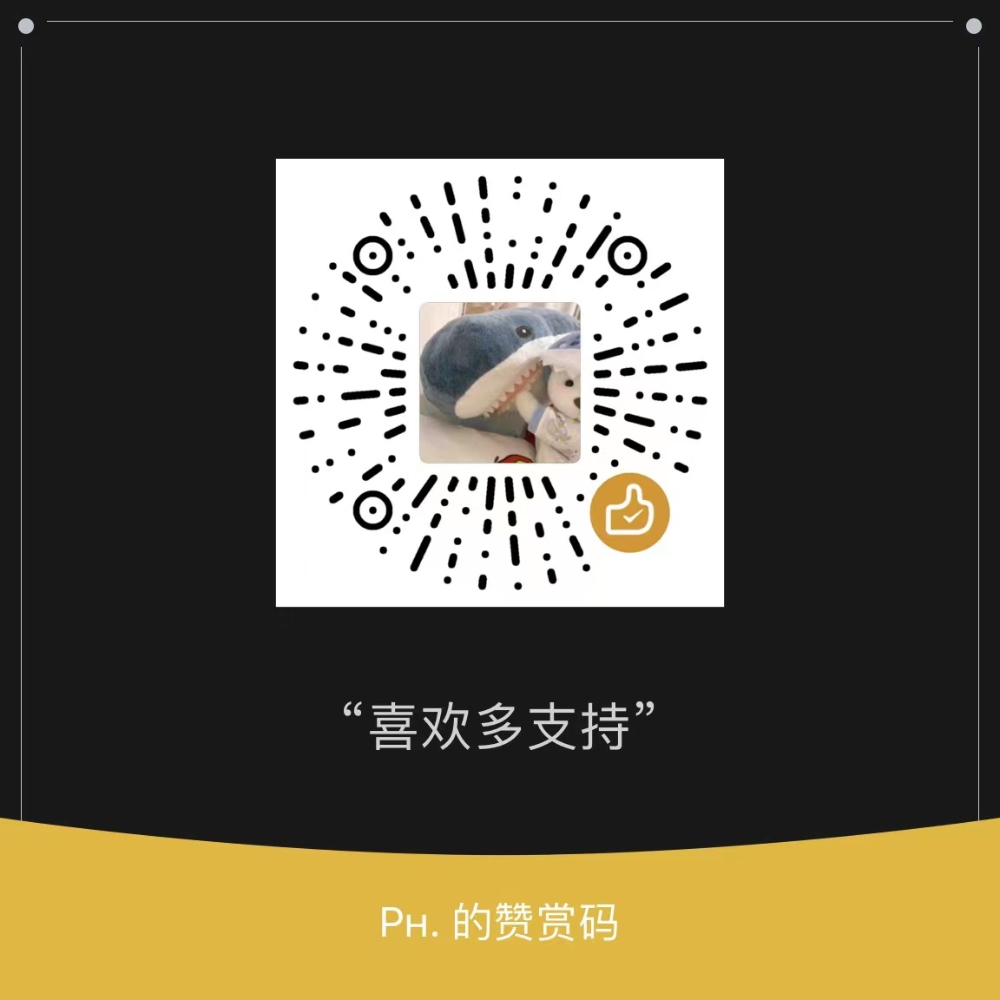
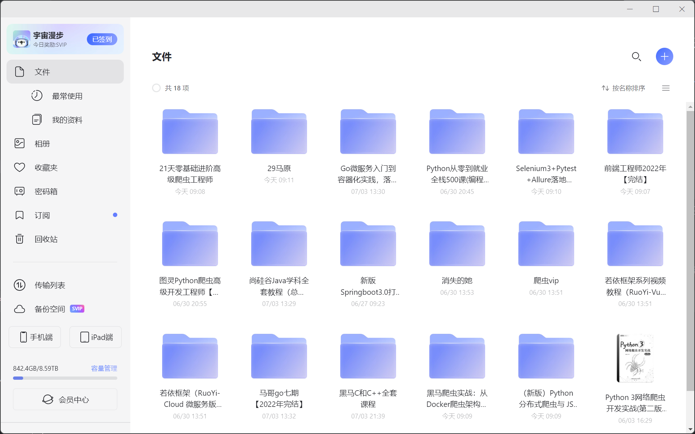

# 个人博客记录

> 本人联系方式 微信17713088356

&nbsp; &nbsp; &nbsp; &nbsp; &nbsp; &nbsp; 书写这个博客也是一时兴起。但是总想着记录些什么东西。所以就咬咬牙完成了这个的一套搭建。 
首先我来介绍一下自己 目前就读于[河北科技师范学院](https://www.hevttc.edu.cn/)计算机专业的学生。主要研究java，目前看到了springcould微服务系列。之后了解一些前端及其主流框架Vue之类的简单使用。做过的项目也都在github上开源，有兴趣的可以去查看。[github](https://github.com/xiaou61) 
如果你想赞助我，可以从以下途径赞助我 

 
&nbsp; &nbsp;  &nbsp; &nbsp; &nbsp; &nbsp;赞助我有什么好处呢？一个最大的好处就是你可以通过我的赞助我的截图，赞助金额30起步上不封顶，你就可以加上我的私人微信，获得以下的课程：
  
 
&nbsp; &nbsp; &nbsp; &nbsp; &nbsp; &nbsp;除了这些，这里还有黑马的v12.5全套课程，尚硅谷的全套，coderwhy的全部，以及各类培训机构，以及慕课，腾讯课堂里面的课程，你都可以咨询我来找我要。
 
&nbsp; &nbsp; &nbsp; &nbsp; &nbsp; &nbsp;当然，学了这么多的东西，其实目的也有很多，一个是对这方面感兴趣，另一个，就是想给自己的爱妻，小雪一个完整的家。
有一句话很喜欢，娇妻扶我青云志，我还娇妻万两金。 
&nbsp; &nbsp; &nbsp; &nbsp; &nbsp; &nbsp;很喜欢这句话，同时我也非常的认同这句话，同时，在上面提到过，除了学习java之外，还学习一些前端的知识，这里有一个网站，就是记录着我和娇妻的一些事情，虽然好久没更新了，那就凑合着看，对于这个网站，也都是随缘进行一个更新的。
[网站地址](https://www.guoyaxue.top/)  
&nbsp; &nbsp; &nbsp; &nbsp; &nbsp; &nbsp;之后你可以通过右上角导航栏，去查找你想要查询的知识
