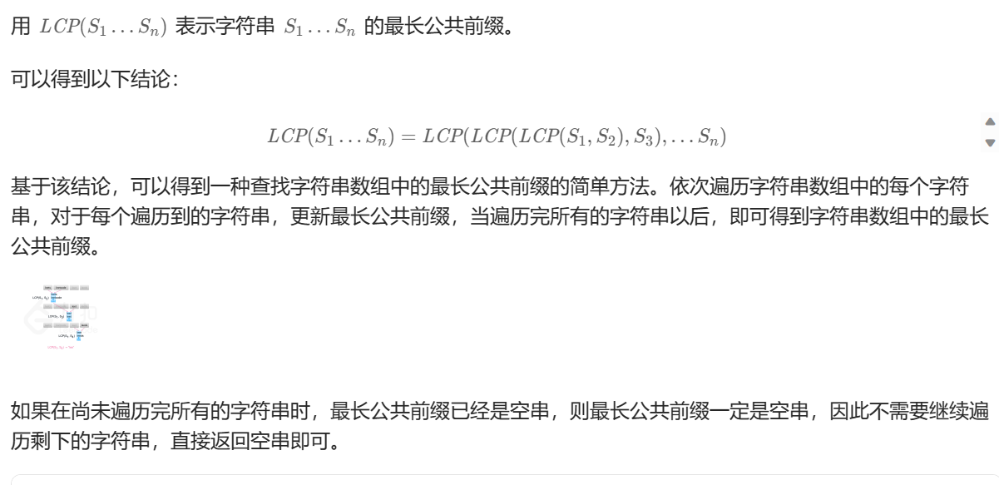
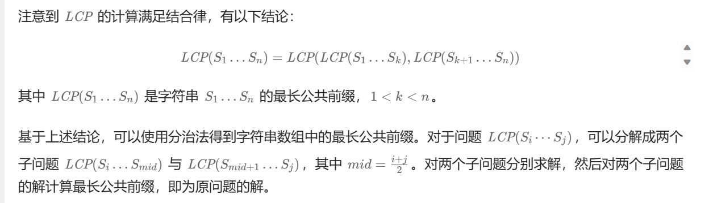
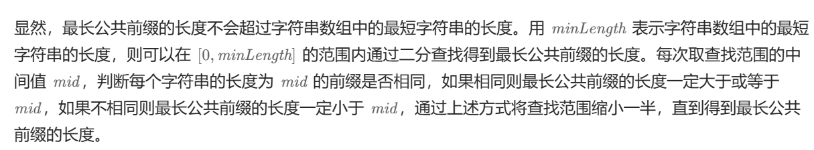

# 简单题目

# 1.两数之和

给定一个整数数组 `nums` 和一个整数目标值 `target`，请你在该数组中找出 **和为目标值** *`target`* 的那 **两个** 整数，并返回它们的数组下标。

你可以假设每种输入只会对应一个答案。但是，数组中同一个元素在答案里不能重复出现。

你可以按任意顺序返回答案。

**示例 1：**

```
输入：nums = [2,7,11,15], target = 9
输出：[0,1]
解释：因为 nums[0] + nums[1] == 9 ，返回 [0, 1] 。
```

**示例 2：**

```
输入：nums = [3,2,4], target = 6
输出：[1,2]
```

**示例 3：**

```
输入：nums = [3,3], target = 6
输出：[0,1]
```

 

**提示：**

- `2 <= nums.length <= 104`
- `-109 <= nums[i] <= 109`
- `-109 <= target <= 109`
- **只会存在一个有效答案**

 

**进阶：**你可以想出一个时间复杂度小于 `O(n2)` 的算法吗？


**方法一：哈希表**

我们可以用哈希表 `m`存放数组值以及对应的下标。

遍历数组 `nums`，当发现 `target - nums[i]` 在哈希表中，说明找到了目标值，返回 `target - nums[i]` 的下标以及 $i$ 即可。

时间复杂度 `O(n)`，空间复杂度 `O(n)`。其中 `n` 是数组 `nums` 的长度。

```java
class Solution {
    public int[] twoSum(int[] nums, int target) {
        Map<Integer, Integer> m = new HashMap<>();
        for (int i = 0;; ++i) {
            int x = nums[i];
            int y = target - x;
            if (m.containsKey(y)) {
                return new int[] {m.get(y), i};
            }
            m.put(x, i);
        }
    }
}
```

**方法二：暴力法**

思路及算法

最容易想到的方法是枚举数组中的每一个数 x，寻找数组中是否存在 target - x。

当我们使用遍历整个数组的方式寻找 target - x 时，需要注意到每一个位于 x 之前的元素都已经和 x 匹配过，因此不需要再进行匹配。而每一个元素不能被使用两次，所以我们只需要在 x 后面的元素中寻找 target - x。

```java
class Solution {
    public int[] twoSum(int[] nums, int target) {
        int n = nums.length;
        for (int i = 0; i < n; ++i) {
            for (int j = i + 1; j < n; ++j) {
                if (nums[i] + nums[j] == target) {
                    return new int[]{i, j};
                }
            }
        }
        return new int[0];
    }
}
```

# 9.回文数

给你一个整数 `x` ，如果 `x` 是一个回文整数，返回 `true` ；否则，返回 `false` 。

回文数是指正序（从左向右）和倒序（从右向左）读都是一样的整数。

- 例如，`121` 是回文，而 `123` 不是。

 

**示例 1：**

```
输入：x = 121
输出：true
```

**示例 2：**

```
输入：x = -121
输出：false
解释：从左向右读, 为 -121 。 从右向左读, 为 121- 。因此它不是一个回文数。
```

**示例 3：**

```
输入：x = 10
输出：false
解释：从右向左读, 为 01 。因此它不是一个回文数。
```

 

**提示：**

- `-231 <= x <= 231 - 1`

 

**进阶：**你能不将整数转为字符串来解决这个问题吗？

**方法一：普通解法**

最好理解的一种解法就是先将 **整数转为字符串** ，然后将字符串分割为数组，只需要循环数组的一半长度进行判断对应元素是否相等即可。

```java
///简单粗暴，看看就行
class Solution {
    public boolean isPalindrome(int x) {
        String reversedStr = (new StringBuilder(x + "")).reverse().toString();
        return (x + "").equals(reversedStr);
    }
}
```

**解法二：进阶解法---数学解法**
通过取整和取余操作获取整数中对应的数字进行比较。

举个例子：1221 这个数字。

通过计算 1221 / 1000， 得首位1
通过计算 1221 % 10， 可得末位 1
进行比较
再将 22 取出来继续比较

```java
class Solution {
    public boolean isPalindrome(int x) {
        //边界判断
        if (x < 0) return false;
        int div = 1;
        
        while (x / div >= 10) div *= 10;
        while (x > 0) {
            int left = x / div;
            int right = x % 10;
            if (left != right) return false;
            x = (x % div) / 10;
            div /= 100;
        }
        return true;
    }
}

```

**方法三：反转一半数字**

我们先判断特殊情况：

- 如果 `x<0`，那么 `x` 不是回文数，直接返回 `false`；
- 如果 `x>0` 且 `x` 的个位数是 0，那么 `x` 不是回文数，直接返回 `false`；
- 如果 `x` 的个位数不是 0，那么 `x` 可能是回文数，继续执行下面的步骤。

我们将 `x` 的后半部分反转，与前半部分进行比较，如果相等，那么 `x` 是回文数，否则 `x` 不是回文数。

举个例子，例如 `x=1221`，我们可以将数字后半部分从 “21” 反转为 “12”，并将其与前半部分 “12” 进行比较，因为二者相等，我们得知数字 `x` 是回文。

让我们看看如何将后半部分反转。

对于数字 12211221，如果执行`1221mod10`，我们将得到最后一位数字 `1`，要得到倒数第二位数字，我们可以先通过除以 `10` 将最后一位数字从 `1221`中移除，1`221/10=122`，再求出上一步结果除以 `10` 的余数，`122 mod 10=2`，就可以得到倒数第二位数字。

如果继续这个过程，我们将得到更多位数的反转数字。

通过将最后一位数字不断地累乘到取出数字的变量 `y` 上，我们可以得到以相反顺序的数字。

在代码实现上，我们可以反复“取出” `x` 的最后一位数字，并将其“添加”到 `y` 的后面，循环直到 `y≥x`，如果此时 `x=y`，或者`x=y/10`，那么 `x` 就是回文数。

时间复杂度 `O(log10(n))`，其中 `n `是 `x`。对于每次迭代，我们会将输入除以 `10`，因此时间复杂度为 `O(log10(n)`。空间复杂度 `O(1)`。

```java
class Solution {
    public boolean isPalindrome(int x) {
        if (x < 0 || (x > 0 && x % 10 == 0)) {
            return false;
        }
        int y = 0;
        for (; y < x; x /= 10) {
            y = y * 10 + x % 10;
        }
        return x == y || x == y / 10;
    }
}

```


这里的巧妙之处也在于`x%10`中的这个%，例如我们当前的x是1221

那么第一次进入循环`y=0+1221%10`

也就是y=1，也就是最后一位

之后继续取122的最后一位，也就是2

这个时候，y已经是12了。不满足循环条件了，就可以直接退出了。

# 13.罗马数字转整数

罗马数字包含以下七种字符: `I`， `V`， `X`， `L`，`C`，`D` 和 `M`。

```
字符          数值
I             1
V             5
X             10
L             50
C             100
D             500
M             1000
```

例如， 罗马数字 `2` 写做 `II` ，即为两个并列的 1 。`12` 写做 `XII` ，即为 `X` + `II` 。 `27` 写做 `XXVII`, 即为 `XX` + `V` + `II` 。

通常情况下，罗马数字中小的数字在大的数字的右边。但也存在特例，例如 4 不写做 `IIII`，而是 `IV`。数字 1 在数字 5 的左边，所表示的数等于大数 5 减小数 1 得到的数值 4 。同样地，数字 9 表示为 `IX`。这个特殊的规则只适用于以下六种情况：

- `I` 可以放在 `V` (5) 和 `X` (10) 的左边，来表示 4 和 9。
- `X` 可以放在 `L` (50) 和 `C` (100) 的左边，来表示 40 和 90。 
- `C` 可以放在 `D` (500) 和 `M` (1000) 的左边，来表示 400 和 900。

给定一个罗马数字，将其转换成整数。

 

**示例 1:**

```
输入: s = "III"
输出: 3
```

**示例 2:**

```
输入: s = "IV"
输出: 4
```

**示例 3:**

```
输入: s = "IX"
输出: 9
```

**示例 4:**

```
输入: s = "LVIII"
输出: 58
解释: L = 50, V= 5, III = 3.
```

**示例 5:**

```
输入: s = "MCMXCIV"
输出: 1994
解释: M = 1000, CM = 900, XC = 90, IV = 4.
```

 

**提示：**

- `1 <= s.length <= 15`
- `s` 仅含字符 `('I', 'V', 'X', 'L', 'C', 'D', 'M')`
- 题目数据保证 `s` 是一个有效的罗马数字，且表示整数在范围 `[1, 3999]` 内
- 题目所给测试用例皆符合罗马数字书写规则，不会出现跨位等情况。
- IL 和 IM 这样的例子并不符合题目要求，49 应该写作 XLIX，999 应该写作 CMXCIX 。


```java
class Solution {
    public int romanToInt(String s) {
        String cs = "IVXLCDM";
        int[] vs = {1, 5, 10, 50, 100, 500, 1000};
        Map<Character, Integer> d = new HashMap<>();
        for (int i = 0; i < vs.length; ++i) {
            d.put(cs.charAt(i), vs[i]);
        }
        int n = s.length();
        int ans = d.get(s.charAt(n - 1));
        for (int i = 0; i < n - 1; ++i) {
            int sign = d.get(s.charAt(i)) < d.get(s.charAt(i + 1)) ? -1 : 1;
            ans += sign * d.get(s.charAt(i));
        }
        return ans;
    }
}
```

这个写法用了一个三元表达式巧妙的写出来了，同时这个还可以用一个通俗易懂的方法来写。

```java
class Solution {
    Map<Character, Integer> symbolValues = new HashMap<Character, Integer>() {{
        put('I', 1);
        put('V', 5);
        put('X', 10);
        put('L', 50);
        put('C', 100);
        put('D', 500);
        put('M', 1000);
    }};

    public int romanToInt(String s) {
        int ans = 0;
        int n = s.length();
        for (int i = 0; i < n; ++i) {
            int value = symbolValues.get(s.charAt(i));
            if (i < n - 1 && value < symbolValues.get(s.charAt(i + 1))) {
                ans -= value;
            } else {
                ans += value;
            }
        }
        return ans;
    }
}

```

这样都是可以的。

# 14.最长公共前缀

编写一个函数来查找字符串数组中的最长公共前缀。

如果不存在公共前缀，返回空字符串 `""`。

 

**示例 1：**

```
输入：strs = ["flower","flow","flight"]
输出："fl"
```

**示例 2：**

```
输入：strs = ["dog","racecar","car"]
输出：""
解释：输入不存在公共前缀。
```

 

**提示：**

- `1 <= strs.length <= 200`
- `0 <= strs[i].length <= 200`
- `strs[i]` 仅由小写英文字母组成

**方法一：字符比较**

我们以第一个字符串 `strs[0]` 为基准，依次比较后面的字符串的第 `i `个字符是否与 `strs[0]` 的第 `i` 个字符相同，如果相同则继续比较下一个字符，否则返回 `strs[0]` 的前 `i` 个字符。

遍历结束，说明所有字符串的前 `i` 个字符都相同，返回 `strs[0] `即可。

时间复杂度`(n×m)`，其中 `n `和 `m` 分别为字符串数组的长度以及字符串的最小长度。空间复杂度 `O(1)`。

```java
class Solution {
    public String longestCommonPrefix(String[] strs) {
        int n = strs.length;
        for (int i = 0; i < strs[0].length(); ++i) {
            for (int j = 1; j < n; ++j) {
                if (strs[j].length() <= i || strs[j].charAt(i) != strs[0].charAt(i)) {
                    return strs[0].substring(0, i);
                }
            }
        }
        return strs[0];
    }
}
```

**方法二：横向扫描**

这个是leetcode官方提供的解法之一



```java
class Solution {
    public String longestCommonPrefix(String[] strs) {
        if (strs == null || strs.length == 0) {
            return "";
        }
        String prefix = strs[0];
        int count = strs.length;
        for (int i = 1; i < count; i++) {
            prefix = longestCommonPrefix(prefix, strs[i]);
            if (prefix.length() == 0) {
                break;
            }
        }
        return prefix;
    }

    public String longestCommonPrefix(String str1, String str2) {
        int length = Math.min(str1.length(), str2.length());
        int index = 0;
        while (index < length && str1.charAt(index) == str2.charAt(index)) {
            index++;
        }
        return str1.substring(0, index);
    }
}
```

**方法三：纵向扫描**

方法一是横向扫描，依次遍历每个字符串，更新最长公共前缀。另一种方法是纵向扫描。纵向扫描时，从前往后遍历所有字符串的每一列，比较相同列上的字符是否相同，如果相同则继续对下一列进行比较，如果不相同则当前列不再属于公共前缀，当前列之前的部分为最长公共前缀。

```java
class Solution {
    public String longestCommonPrefix(String[] strs) {
        if (strs == null || strs.length == 0) {
            return "";
        }
        int length = strs[0].length();
        int count = strs.length;
        for (int i = 0; i < length; i++) {
            char c = strs[0].charAt(i);
            for (int j = 1; j < count; j++) {
                if (i == strs[j].length() || strs[j].charAt(i) != c) {
                    return strs[0].substring(0, i);
                }
            }
        }
        return strs[0];
    }
}
```

**方法四：分治**

这个也是官方提供的一种算法，这个是用到了分治的思想



```java
class Solution {
    public String longestCommonPrefix(String[] strs) {
        if (strs == null || strs.length == 0) {
            return "";
        } else {
            return longestCommonPrefix(strs, 0, strs.length - 1);
        }
    }

    public String longestCommonPrefix(String[] strs, int start, int end) {
        if (start == end) {
            return strs[start];
        } else {
            int mid = (end - start) / 2 + start;
            String lcpLeft = longestCommonPrefix(strs, start, mid);
            String lcpRight = longestCommonPrefix(strs, mid + 1, end);
            return commonPrefix(lcpLeft, lcpRight);
        }
    }

    public String commonPrefix(String lcpLeft, String lcpRight) {
        int minLength = Math.min(lcpLeft.length(), lcpRight.length());       
        for (int i = 0; i < minLength; i++) {
            if (lcpLeft.charAt(i) != lcpRight.charAt(i)) {
                return lcpLeft.substring(0, i);
            }
        }
        return lcpLeft.substring(0, minLength);
    }
}

```

**方法五：二分查找**



```java
class Solution {
    public String longestCommonPrefix(String[] strs) {
        if (strs == null || strs.length == 0) {
            return "";
        }
        int minLength = Integer.MAX_VALUE;
        for (String str : strs) {
            minLength = Math.min(minLength, str.length());
        }
        int low = 0, high = minLength;
        while (low < high) {
            int mid = (high - low + 1) / 2 + low;
            if (isCommonPrefix(strs, mid)) {
                low = mid;
            } else {
                high = mid - 1;
            }
        }
        return strs[0].substring(0, low);
    }

    public boolean isCommonPrefix(String[] strs, int length) {
        String str0 = strs[0].substring(0, length);
        int count = strs.length;
        for (int i = 1; i < count; i++) {
            String str = strs[i];
            for (int j = 0; j < length; j++) {
                if (str0.charAt(j) != str.charAt(j)) {
                    return false;
                }
            }
        }
        return true;
    }
}
```

**方法六：数组排序法**

这个方法主要用到了arrays里面的sort方法。

因为这个对数组进行了排序，所以说，只用比较第一个和最后一个的就可以了，要不然是第一个是最小的，最后一个是最长的，要不然就是第一个是最长的，第二个是最小的。

```java
class Solution {
    public String longestCommonPrefix(String[] strs) {
        if (strs.length == 0) {
            return "";
        }
        Arrays.sort(strs);
        String st = strs[0];
        String en = strs[strs.length - 1];
        int i;
        int num = Math.min(st.length(), en.length());
        for (i = 0; i < num && st.charAt(i) == en.charAt(i); i++) ;
        String res = st.substring(0, i);
        return res;
    }
}

```

# 20.有效的括号

给定一个只包括 `'('`，`')'`，`'{'`，`'}'`，`'['`，`']'` 的字符串 `s` ，判断字符串是否有效。

有效字符串需满足：

1. 左括号必须用相同类型的右括号闭合。
2. 左括号必须以正确的顺序闭合。
3. 每个右括号都有一个对应的相同类型的左括号。

 

**示例 1：**

```
输入：s = "()"
输出：true
```

**示例 2：**

```
输入：s = "()[]{}"
输出：true
```

**示例 3：**

```
输入：s = "(]"
输出：false
```

 

**提示：**

- `1 <= s.length <= 104`
- `s` 仅由括号 `'()[]{}'` 组成


**方法一：栈**

遍历括号字符串 `s`，遇到左括号时，压入当前的左括号；遇到右括号时，弹出栈顶元素（若栈为空，直接返回 `false`），判断是否匹配，若不匹配，直接返回 `false`。

也可以选择遇到左括号时，将右括号压入栈中；遇到右括号时，弹出栈顶元素（若栈为空，直接返回 `false`），判断是否是相等。若不匹配，直接返回 `false`。

> 两者的区别仅限于括号转换时机，一个是在入栈时，一个是在出栈时。

遍历结束，若栈为空，说明括号字符串有效，返回 `true`；否则，返回 `false`。

时间复杂度 `O(n)`，空间复杂度 `O(n)`。其中 `n `为括号字符串 `s` 的长度。

```java
class Solution {
    public boolean isValid(String s) {
        Deque<Character> stk = new ArrayDeque<>();
        for (char c : s.toCharArray()) {
            if (c == '(' || c == '{' || c == '[') {
                stk.push(c);
            } else if (stk.isEmpty() || !match(stk.pop(), c)) {
                return false;
            }
        }
        return stk.isEmpty();
    }

    private boolean match(char l, char r) {
        return (l == '(' && r == ')') || (l == '{' && r == '}') || (l == '[' && r == ']');
    }
}
```

# 21.合并两个有序序列

将两个升序链表合并为一个新的 **升序** 链表并返回。新链表是通过拼接给定的两个链表的所有节点组成的。 


```
输入：l1 = [1,2,4], l2 = [1,3,4]
输出：[1,1,2,3,4,4]
```

**示例 2：**

```
输入：l1 = [], l2 = []
输出：[]
```

**示例 3：**

```
输入：l1 = [], l2 = [0]
输出：[0]
```

 

**提示：**

- 两个链表的节点数目范围是 `[0, 50]`

- `-100 <= Node.val <= 100`

- `l1` 和 `l2` 均按 **非递减顺序** 排列

- **方法一：递归**

  我们先判断链表 `l1` 和 `l2` 是否为空，若其中一个为空，则返回另一个链表。否则，我们比较 `l1` 和 `l2` 的头节点：

  - 若 `l1` 的头节点的值小于等于 `l2` 的头节点的值，则递归调用函数 `mergeTwoLists(l1.next,l2)`，并将 `l1` 的头节点与返回的链表头节点相连，返回 `l1` 的头节点。
  - 否则，递归调用函数 `mergeTwoLists(l1,l2.next)`，并将 `l2` 的头节点与返回的链表头节点相连，返回 `l2 `的头节点。

  时间复杂度`O(m+n)`，空间复杂度`O(m+n)`。其中 `m `和 `n` 分别为两个链表的长度。

```java
/**
 * Definition for singly-linked list.
 * public class ListNode {
 *     int val;
 *     ListNode next;
 *     ListNode() {}
 *     ListNode(int val) { this.val = val; }
 *     ListNode(int val, ListNode next) { this.val = val; this.next = next; }
 * }
 */
class Solution {
    public ListNode mergeTwoLists(ListNode list1, ListNode list2) {
        if (list1 == null) {
            return list2;
        }
        if (list2 == null) {
            return list1;
        }
        if (list1.val <= list2.val) {
            list1.next = mergeTwoLists(list1.next, list2);
            return list1;
        } else {
            list2.next = mergeTwoLists(list1, list2.next);
            return list2;
        }
    }
}
```

**方法二：迭代**

我们也可以用迭代的方式来实现两个排序链表的合并。

我们先定义一个虚拟头节点 `dummy`，然后循环遍历两个链表，比较两个链表的头节点，将较小的节点添加到 `dummy` 的末尾，直到其中一个链表为空，然后将另一个链表的剩余部分添加到 `dummy` 的末尾。

最后返回 `dummy.next` 即可。

时间复杂度 `O(m+n)`，其中 `m` 和 `n `分别为两个链表的长度。忽略答案链表的空间消耗，空间复杂度`O(1`)。

```java
/**
 * Definition for singly-linked list.
 * public class ListNode {
 *     int val;
 *     ListNode next;
 *     ListNode() {}
 *     ListNode(int val) { this.val = val; }
 *     ListNode(int val, ListNode next) { this.val = val; this.next = next; }
 * }
 */
class Solution {
    public ListNode mergeTwoLists(ListNode list1, ListNode list2) {
        ListNode dummy = new ListNode();
        ListNode curr = dummy;
        while (list1 != null && list2 != null) {
            if (list1.val <= list2.val) {
                curr.next = list1;
                list1 = list1.next;
            } else {
                curr.next = list2;
                list2 = list2.next;
            }
            curr = curr.next;
        }
        curr.next = list1 == null ? list2 : list1;
        return dummy.next;
    }
}
```

# 26.删除有序数组的重复项

给你一个 **升序排列** 的数组 `nums` ，请你**[ 原地](http://baike.baidu.com/item/原地算法)** 删除重复出现的元素，使每个元素 **只出现一次** ，返回删除后数组的新长度。元素的 **相对顺序** 应该保持 **一致** 。然后返回 `nums` 中唯一元素的个数。

考虑 `nums` 的唯一元素的数量为 `k` ，你需要做以下事情确保你的题解可以被通过：

- 更改数组 `nums` ，使 `nums` 的前 `k` 个元素包含唯一元素，并按照它们最初在 `nums` 中出现的顺序排列。`nums` 的其余元素与 `nums` 的大小不重要。
- 返回 `k` 。

**判题标准:**

系统会用下面的代码来测试你的题解:

```
int[] nums = [...]; // 输入数组
int[] expectedNums = [...]; // 长度正确的期望答案

int k = removeDuplicates(nums); // 调用

assert k == expectedNums.length;
for (int i = 0; i < k; i++) {
    assert nums[i] == expectedNums[i];
}
```

如果所有断言都通过，那么您的题解将被 **通过**。

 

**示例 1：**

```
输入：nums = [1,1,2]
输出：2, nums = [1,2,_]
解释：函数应该返回新的长度 2 ，并且原数组 nums 的前两个元素被修改为 1, 2 。不需要考虑数组中超出新长度后面的元素。
```

**示例 2：**

```
输入：nums = [0,0,1,1,1,2,2,3,3,4]
输出：5, nums = [0,1,2,3,4]
解释：函数应该返回新的长度 5 ， 并且原数组 nums 的前五个元素被修改为 0, 1, 2, 3, 4 。不需要考虑数组中超出新长度后面的元素。
```

 

**提示：**

- `1 <= nums.length <= 3 * 104`
- `-104 <= nums[i] <= 104`
- `nums` 已按 **升序** 排列

**方法一：一次遍历**

我们用一个变量 `k` 记录当前已经处理好的数组的长度，初始时 `k=0`，表示空数组。

然后我们从左到右遍历数组，对于遍历到的每个元素 `x`，如果 `k=0 `或者 `x\\=nums[k−1]`，我们就将 `x `放到`nums[k] `的位置，然后 `k` 自增 1。否则，`x` 与 `nums[k−1] `相同，我们直接跳过这个元素。继续遍历，直到遍历完整个数组。

这样，当遍历结束时，`nums `中前 `k `个元素就是我们要求的答案，且 `k `就是答案的长度。

时间复杂度 `O(n)`，空间复杂度 `O(1)`。其中 `n` 为数组的长度。

补充：

原问题要求最多相同的数字最多出现 11 次，我们可以扩展至相同的数字最多保留 `k` 个。

- 由于相同的数字最多保留 `k `个，那么原数组的前 `k` 个元素我们可以直接保留；

- 对于后面的数字，能够保留的前提是：当前数字 `x `与前面已保留的数字的倒数第 `k `个元素比较，不同则保留，相同则跳过。

- 

- ```java
  class Solution {
      public int removeDuplicates(int[] nums) {
          int k = 0;
          for (int x : nums) {
              if (k == 0 || x != nums[k - 1]) {
                  nums[k++] = x;
              }
          }
          return k;
      }
  }
  ```

