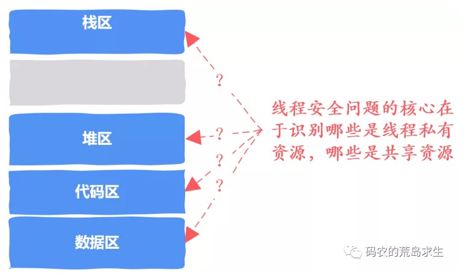
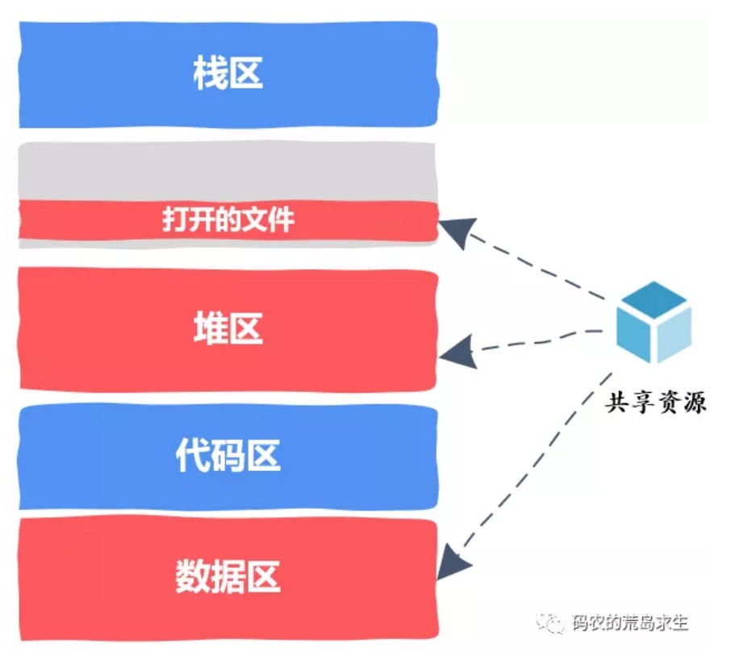
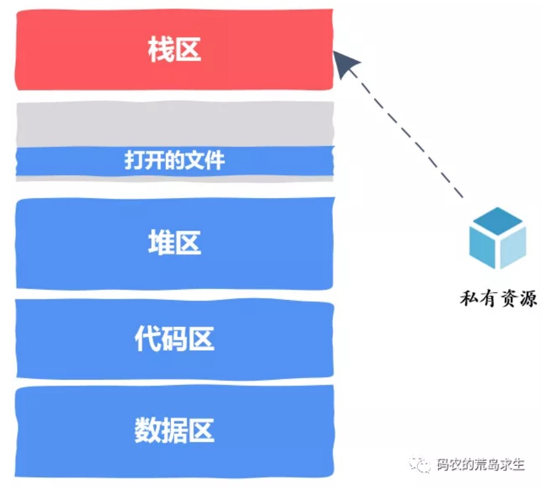
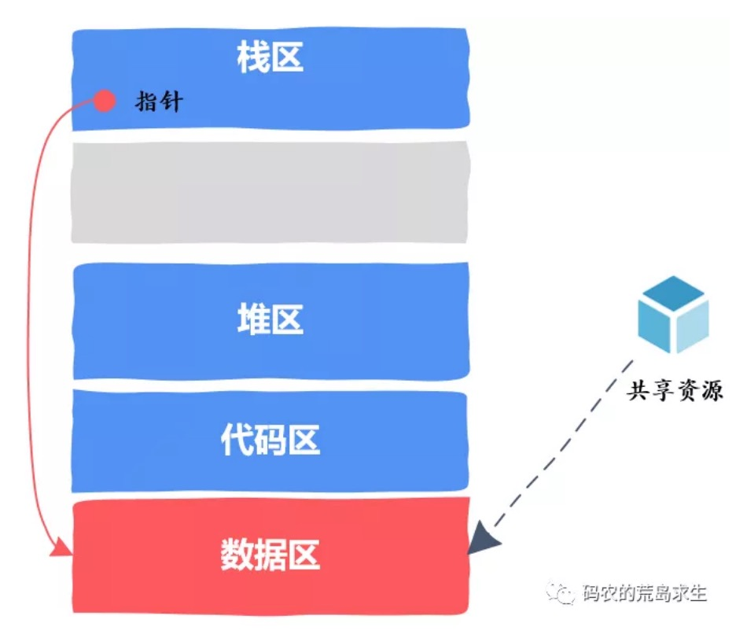
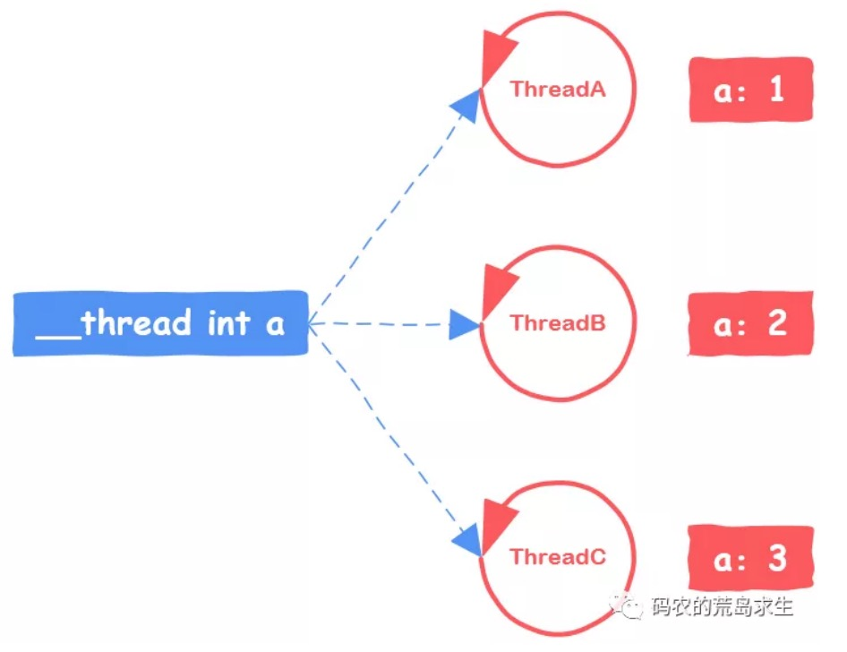
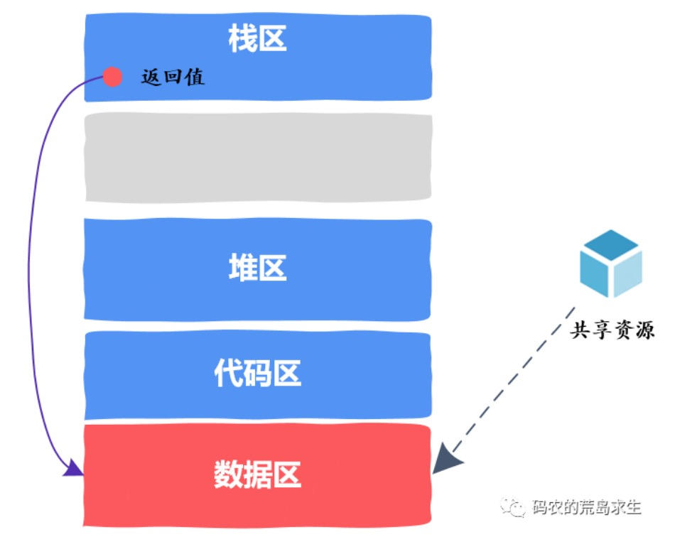

# 13.线程安全代码到底是怎么编写的？

相信有很多同学在面对多线程代码时都会望而生畏，认为多线程代码就像一头难以驯服的怪兽，你制服不了这头怪兽它就会反过来吞噬你。&#x20;

夸张了哈，总之，多线程程序有时就像一潭淤泥，走不进去退不出来。&#x20;

可这是为什么呢？**为什么多线程代码如此难以正确编写呢**？

### **从根源上思考**

关于这个问题，本质上是有一个词语你没有透彻理解，这个词就是所谓的**线程安全**，thread safe。&#x20;

**如果你不能理解线程安全，那么给你再多的方案也是无用武之地**。

&#x20;接下来我们了解一下什么是线程安全，怎样才能做到线程安全。&#x20;

这些问题解答后，多线程这头大怪兽自然就会变成温顺的小猫咪。

**关你什么屁事**

生活中我们口头上经常说的一句话就是“关你屁事”，大家想一想，为什么我们的屁事不关别人？&#x20;

原因很简单，这是我的**私事**啊！我的衣服、我的电脑，我的手机、我的车子、我的别墅以及私人泳池 (可以没有，但不妨碍想象)，我想怎么处理就怎么处理，妨碍不到别人，只属于我一个人的东西以及 事情当然不关别人，即使是屁事也不关别人。


我们在自己家里想吃什么吃什么，想去厕所就去厕所！因为这些都是我私有的，只有我自己使用。 那么什么时候会和其它人有交集呢？&#x20;

答案就是**公共场所**。&#x20;

在公共场所下你不能像在自己家里一样想去哪就去哪，想什么时候去厕所就去厕所，为什么呢？原因很简单，因为公共场所下的饭馆、卫生间不是你家的，这是公共资源，大家都可以使用的**公共资源**。&#x20;

如果你想去饭馆、去公共卫生间那么就必须遵守规则，这个规则就是**排队**，只有前一个人用完公共资源后下一个人才可以使用，而且**不能同时使用，想使用就必须排队等待**。&#x20;

上面这段话道理足够简单吧。&#x20;

如果你能理解这段话，那么驯服多线程这头小怪兽就不在话下。

**维护公共场所秩序**

如果把你自己理解为线程的话，那么在你自己家里使用私有资源就是所谓的线程安全，原因很简单， 因为**你随便怎么折腾自己的东西(资源)都不会妨碍到别人**；

但到公共场所浪的话就不一样了，在公共场所使用的是公共资源，这时你就不能像在自己家里一样想怎么用就怎么用想什么时候用就什么时候用，公共场所必须有相应规则，这里的规则通常是排队，只有这样公共场所的秩序才不会被破坏，线程以某种不妨碍到其它线程的秩序使用共享资源就能实现线程安全。&#x20;

因此我们可以看到，这里有两种情况：

* 线程私有资源，没有线程安全问题
* 共享资源，线程间以某种秩序使用共享资源也能实现线程安全。

本文都是围绕着上述两个核心点来讲解的，现在我们就可以正式的聊聊编程中的线程安全了。

### **什么是线程安全**

我们说一段代码是线程安全的，**当且仅当我们在多个线程中同时且多次调用的这段代码都能给出正确的结果**，这样的代码我们才说是线程安全代码，Thread Safety，否则就不是线程安全代码，threadunsafe。&#x20;

非线程安全的代码其运行结果是由掷骰子决定的。


怎么样，线程安全的定义很简单吧，也就是说你的代码不管是在单个线程还是多个线程中被执行都应该能给出正确的运行结果，这样的代码是不会出现多线程问题的，就像下面这段代码：

```
int func() {
   int a = 1;
   int b = 1;
   return a + b;
}
```

对于这样段代码，**无论你用多少线程同时调用、怎么调用、什么时候调用都会返回2**，这段代码就是线程安全的。&#x20;

那么我们该怎样写出线程安全的代码呢？&#x20;

要回答这个问题，我们需要知道我们的代码什么时候呆在自己家里使用私有资源，什么时候去公共场所使用公共资源，也就是说你需要识别线程的私有资源和共享资源都有哪些，这是解决线程安全问题的**核心**所在。



### **线程私有资源**

线程都有哪些私有资源呢？啊哈，我们在上一篇《线程到底共享了哪些进程资源》中详细讲解了这个问题。

线程运行的本质其实就是函数的执行，函数的执行总会有一个源头，这个源头就是所谓的入口函数，CPU从入口函数开始执行从而形成一个执行流，只不过我们人为的给执行流起一个名字，这个名字就叫线程。

既然线程运行的本质就是函数的执行，那么函数运行时信息都保存在哪里呢？&#x20;

答案就是栈区，每个线程都有一个私有的栈区，因此在栈上分配的局部变量就是线程私有的，无论我 们怎样使用这些局部变量都不管其它线程屁事。


**线程私有的栈区就是线程自己家。**&#x20;

### **线程间共享数据**

除了上一节提到的剩下的区域就是公共场合了，这包括：

* 用于动态分配内存的堆区，我们用C/C++中的malloc或者new就是在堆区上申请的内存
* 全局区，这里存放的就是全局变量
* 文件，我们知道线程是共享进程打开的文件



有的同学可能说，等等，在上一篇文章不是说还有代码区和动态链接库吗？&#x20;

要知道这两个区域是不能被修改的，也就是说这两个区域是只读的，因此多个线程使用是没有问题 的。&#x20;

在刚才我们提到的堆区、数据区以及文件，这些就是所有的线程都可以共享的资源，也就是公共场 所，线程在这些公共场所就不能随便浪了。&#x20;

线程使用这些共享资源必须要遵守秩序，这个秩序的核心就是**对共享资源的使用不能妨碍到其它线程**，无论你使用各种锁也好、信号量也罢，其目的都是在维护公共场所的秩序。&#x20;

知道了哪些是线程私有的，哪些是线程间共享的，接下来就简单了。&#x20;

值得注意的是，关于线程安全的一切问题全部围绕着线程私有数据与线程共享数据来处理，**抓住了线 程私有资源和共享资源这个主要矛盾也就抓住了解决线程安全问题的核心**。&#x20;

接下来我们看下在各种情况下该怎样实现线程安全，依然以C/C++代码为例，但是这里讲解的方法适用于任何语言，请放心，这些代码足够简单。

### **只使用线程私有资源**

我们来看这段代码：

```
int func() { 
    int a = 1; 
    int b = 1; 
    return a + b;
}
```

这段代码在前面提到过，**无论你在多少个线程中怎么调用什么时候调用，func函数都会确定的返回2**，该函数不依赖任何全局变量，不依赖任何函数参数，且使用的局部变量都是线程私有资源，这样的代码也被称为无状态函数，stateless，很显然这样的代码是线程安全的。



这样的代码请放心大胆的在多线程中使用，不会有任何问题。&#x20;

有的同学可能会说，那如果我们还是使用线程私有资源，但是传入函数参数呢？

### **线程私有资源+函数参数**

这样的代码是线程安全的吗？自己先想一想这个问题。&#x20;

答案是**it depends**，也就是要看情况。看什么情况呢？

**1，按值传参**

如果你传入的参数的方式是**按值传入**，那么没有问题，代码依然是线程安全的：

```
int func(int num) { num++; return num;}
```

这这段代码无论在多少个线程中调用怎么调用什么时候调用都会正确返回参数加1后的值。&#x20;

原因很简单，按值传入的这些参数是线程私有资源。

**2，按引用传参**&#x20;

但如果是按引用传入参数，那么情况就不一样了：

```
int func(int* num) {
  ++(*num);
  return *num;
}
```

如果调用该函数的线程传入的参数是线程私有资源，那么该函数依然是线程安全的，能正确的返回参数加1后的值。&#x20;

但如果传入的参数是全局变量，就像这样：

```
int global_num = 1;
int func(int* num) { ++(*num); return *num;}
// 线程1void thread1() { func(&global_num);}
// 线程2void thread1() { func(&global_num);}
```

那此时func函数将不再是线程安全代码，因为传入的参数指向了全局变量，这个全局变量是所有线程可共享资源，这种情况下如果不改变全局变量的使用方式，那么对该全局变量的加1操作必须施加某种秩序，比如加锁。



有的同学可能会说如果我传入的不是全局变量的指针(引用)是不是就不会有问题了？&#x20;

答案依然是it depends，要看情况。&#x20;

即便我们传入的参数是在堆上(heap)用malloc或new出来的，依然可能会有问题，为什么？&#x20;

答案很简单，因为**堆上的资源也是所有线程可共享的**。&#x20;

假如有两个线程调用func函数时传入的指针(引用)指向了同一个堆上的变量，那么该变量就变成了这两个线程的**共享资源**，在这种情况下func函数依然不是线程安全的。&#x20;

改进也很简单，那就是每个线程调用func函数传入一个独属于该线程的资源地址，这样各个线程就不会妨碍到对方了，因此，**写出线程安全代码的一大原则就是能用线程私有的资源就用私有资源，线程之间尽最大可能不去使用共享资源**。&#x20;

如果线程不得已要使用全局资源呢？

### **使用全局资源**

使用全局资源就一定不是线程安全代码吗？

答案还是。。有的同学可能已经猜到了，答案依然是要看情况。

如果使用的全局资源只在程序运行时初始化一次，此后所有代码对其使用都是只读的，那么没有问题，就像这样：

```
int global_num = 100; //初始化一次，此后没有其它代码修改其值
int func() {
    return global_num;
}
```

我们看到，即使func函数使用了全局变量，但该全局变量只在运行前初始化一次，此后的代码都不会对其进行修改，那么func函数依然是线程安全的。&#x20;

但，如果我们简单修改一下func：

```
int global_num = 100;
int func() { ++global_num; return global_num;}
```

这时，func函数就不再是线程安全的了，对全局变量的修改必须加锁保护。

### **线程局部存储**

接下来我们再对上述func函数简单修改：

```
__thread int global_num = 100;
int func() {
    ++global_num;
    return global_num;
}
```

我们看到全局变量global\_num前加了关键词\_\_thread修饰，这时，func代码就是又是线程安全的了。&#x20;

为什么呢？&#x20;

其实在上一篇文章中我们讲过，被\_\_thread关键词修饰过的变量放在了线程私有存储中，Thread Local Storage，什么意思呢？&#x20;

意思是说这个变量是线程私有的全局变量：

* global\_num是全局变量&#x20;
* global\_num是线程私有的



各个线程对global\_num的修改不会影响到其它线程，因为是线程私有资源，因此func函数是线程安 全的。&#x20;

说完了局部变量、全局变量、函数参数，那么接下来就到函数返回值了。

### **函数返回值**

这里也有两种情况，一种是函数返回的是值；另一种返回对变量的引用。

**1，返回的是值**

我们来看这样一段代码：

```
int func() { int a = 100; return a;}
```

毫无疑问，这段代码是线程安全的，无论我们怎样调用该函数都会返回确定的值100。

**2，返回的是引用**&#x20;

我们把上述代码简单的改一改：

```
int* func() { static int a = 100; return &a;}
```

如果我们在多线程中调用这样的函数，那么接下来等着你的可能就是难以调试的bug以及漫漫的加班长夜。。



很显然，这不是线程安全代码，产生bug的原因也很简单，你在使用该变量前其值可能已经被其它线程修改了。因为该函数使用了一个静态全局变量，只要能拿到该变量的地址那么所有线程都可以修改该变量的值，因为这是线程间的共享资源，不到万不得已不要写出上述代码，除非老板拿刀架在你脖子上。&#x20;

但是，请注意，**有一个特例**，这种使用方法可以用来实现设计模式中的**单例模式**，就像这样：

```
class S {
 public:
 static S& getInstance() {
   static S instance;
   return instance;
 }
 private: S() {} // 其它省略
}
```

为什么呢？&#x20;

因为无论我们调用多少次func函数，static局部变量都只会被初始化一次，这种特性可以很方便的让我们实现单例模式。&#x20;

最后让我们来看下这种情况，那就是如果我们调用一个非线程安全的函数，那么我们的函数是线程安全的吗？

### **调用非线程安全代码**&#x20;

假如一个函数A调用另一个函数B，但B不是线程安全，那么函数A是线程安全的吗？&#x20;

答案依然是，要看情况。&#x20;

我们看下这样一段代码，这段代码在之前讲解过：

```
int global_num = 0;
int func() { ++global_num; return global_num;}
```

我们认为func函数是非线程安全的，因为func函数使用了全局变量并对其进行了修改，但如果我们这样调用func函数：

```
int funcA() {
 mutex l;
 l.lock();
 func();
 l.unlock();
}
```

虽然func函数是非线程安全的，但是我们在调用该函数前加了一把锁进行保护，那么这时funcA函数就是线程安全的了，其本质就是我们用一把锁间接的保护了全局变量。&#x20;

再看这样一段代码：

```
int func(int *num) {
   ++(*num);
   return *num;
}
```

一般我们认为func函数是非线程安全的，因为我们不知道传入的指针是不是指向了一个全局变量，但如果调用func函数的代码是这样的：

```
void funcA() {
 int a = 100;
 func(&a);
}
```

那么这时funcA函数依然是线程安全的，因为传入的参数是线程私有的局部变量，无论多少线程调用funcA都不会干扰到其它线程。&#x20;

看了各种情况下的线程安全问题，最后让我们来总结一下实现线程安全代码都有哪些措施。

### **如何实现线程安全**&#x20;

从上面各种情况的分析来看，实现线程安全无外乎围绕线程私有资源和线程共享资源这两点，你需要识别出哪些是线程私有，哪些是共享的，这是核心，然后对症下药就可以了。

* **不使用任何全局资源**，只使用线程私有资源，这种通常被称为无状态代码&#x20;
* **线程局部存储**，如果要使用全局资源，是否可以声明为线程局部存储，因为这种变量虽然是全局的，但每个线程都有一个属于自己的副本，对其修改不会影响到其它线程&#x20;
* **只读**，如果必须使用全局资源，那么全局资源是否可以是只读的，多线程使用只读的全局资源不会有线程安全问题。&#x20;
* **原子操作**，原子操作是说其在执行过程中是不可能被其它线程打断的，像C++中的std::atomic修饰过的变量，对这类变量的操作无需传统的加锁保护，因为C++会确保在变量的修改过程中不会被打断。我们常说的各种无锁数据结构通常是在这类原子操作的基础上构建的 。&#x20;
* **同步互斥**，到这里也就确定了你必须要以某种形式使用全局资源，那么在这种情况下公共场所的秩序必须得到维护，那么怎么维护呢？通过同步或者互斥的方式，这是一大类问题，我们将在《深入理解操作系统》系列文章中详细阐述这一问题。

### **总结**

怎么样，想写出线程安全的还是不简单的吧，如果本文你只能记住一句话的话，那么我希望是这句，这也是本文的核心：&#x20;

实现线程安全无外乎围绕线程私有资源和线程共享资源来进行，你需要识别出哪些是线程私有，哪些是共享的，然后对症下药就可以了。&#x20;

希望本文对大家编写多线程程序有帮助。


