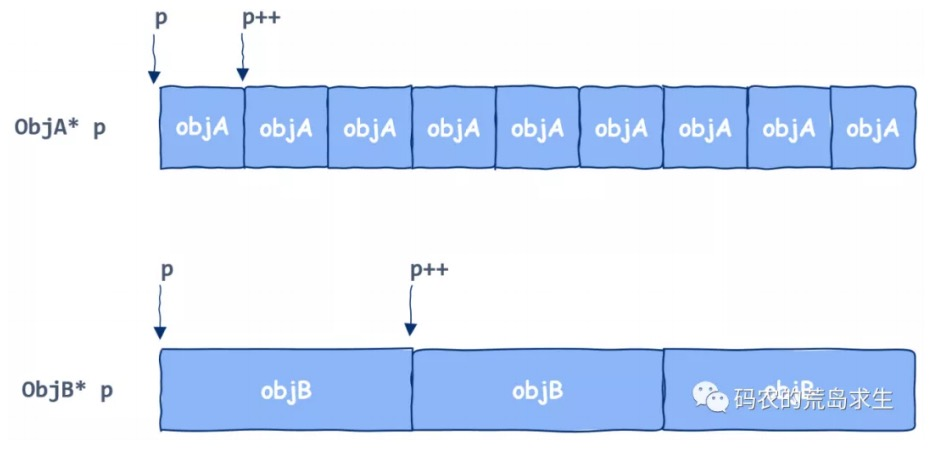
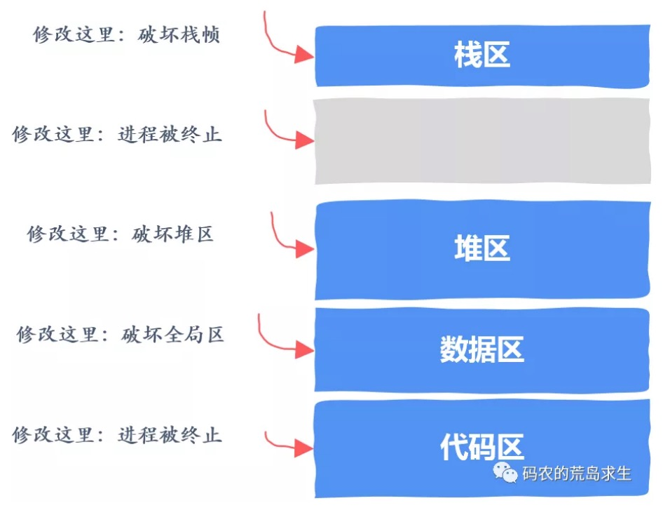
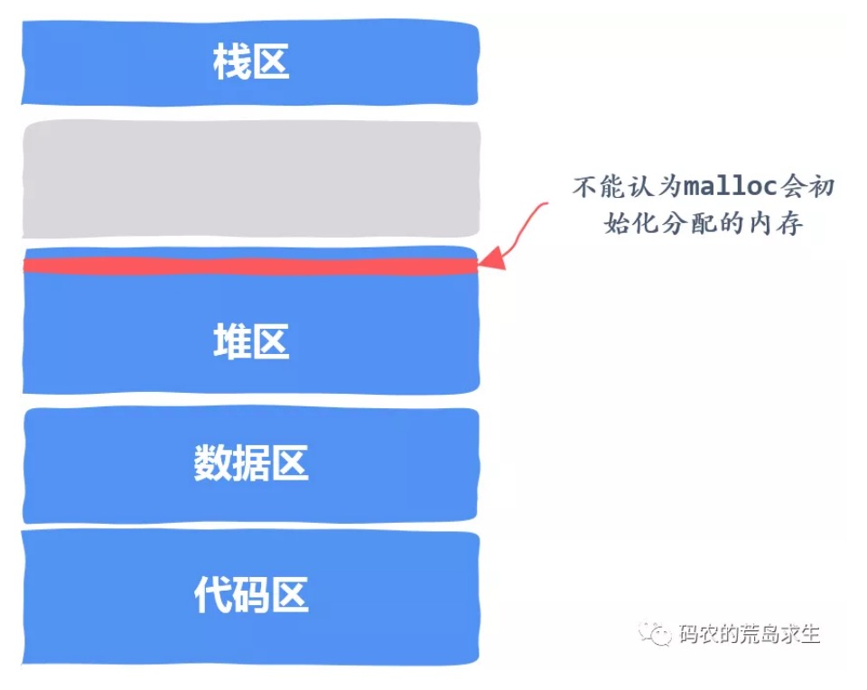
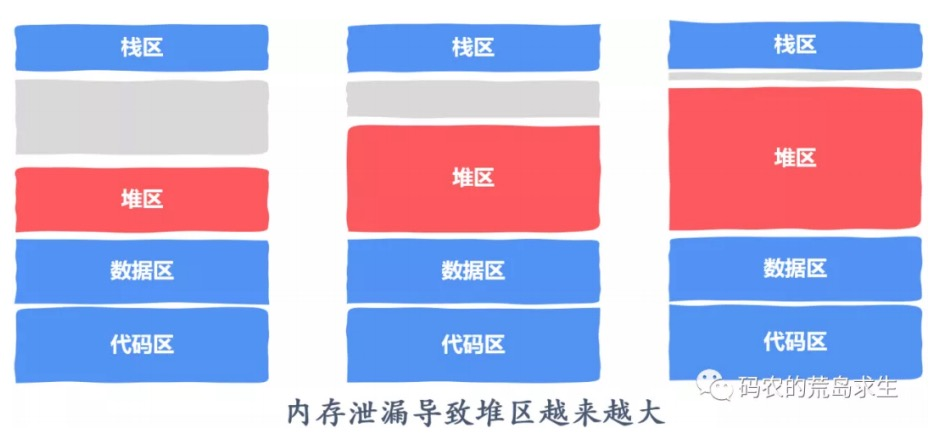
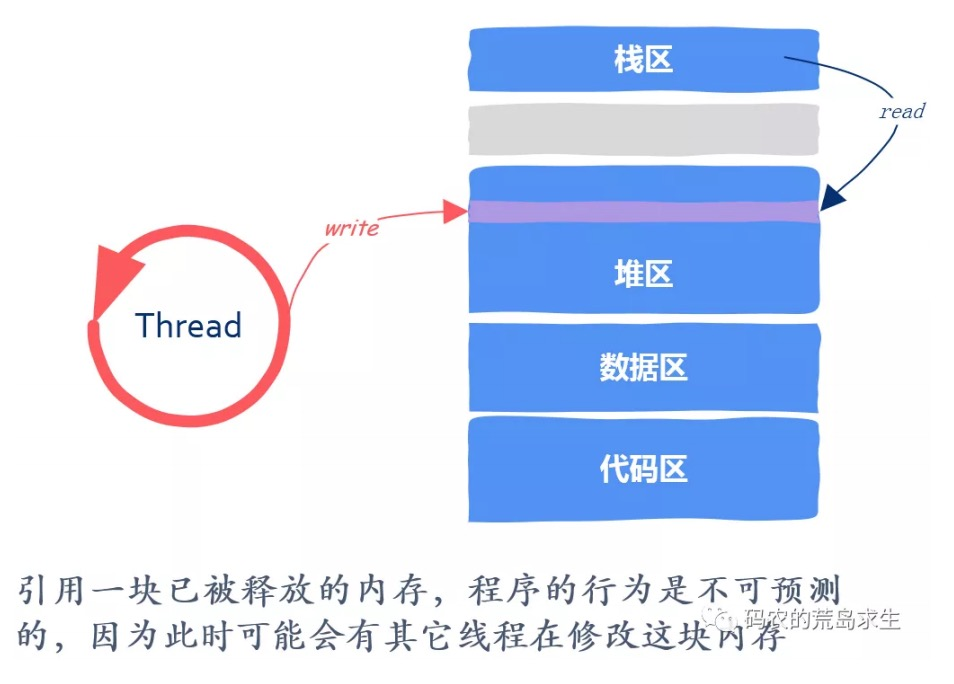
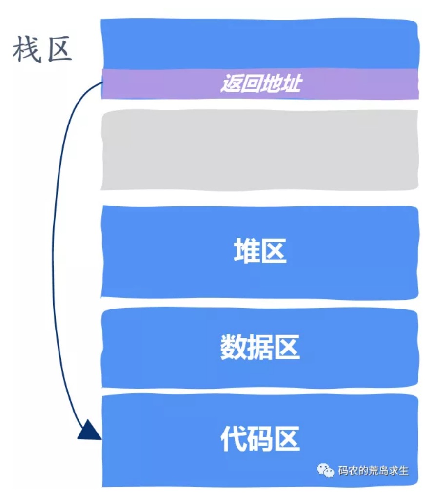
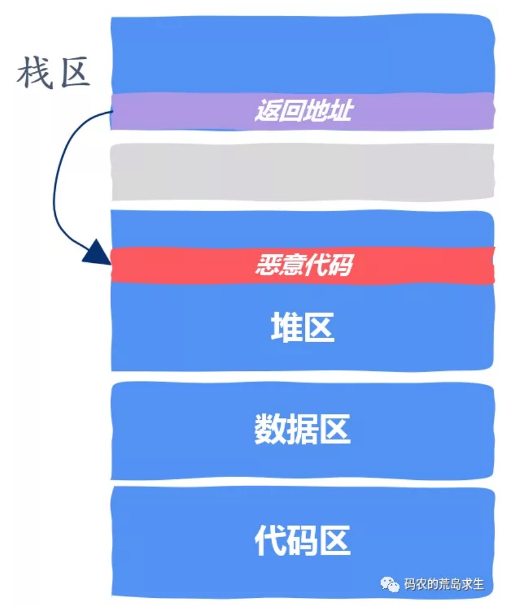

# 15.十个内存引发的大坑

对程序员来说内存相关的 bug 排查难度几乎和多线程问题并驾齐驱，**当程序出现运行异常时可能距离真正有 bug 的那行代码已经很远了**，这就导致问题定位排查非常困难，这篇文章将总结涉及内存的一些经典 bug ，快来看看你知道几个，或者你的程序中现在有几个。。。

### 返回局部变量地址

我们来看这样一段代码：

```
int fun() {
 int a = 2;
 return &a;
}
void main() {
 int* p = fun();
 *p = 20;
}
```

这段代码非常简单，func 函数返回一个指向局部变量的地址，main 函数中调用 fun 函数，获取到指针后将其设置为 20。&#x20;

你能看出这段代码有什么问题吗？&#x20;

问题在于局部变量 a 位于 func 的栈帧中，当 func 执行结束，其栈帧也不复存在，因此 main 函数中调用 func 函数后得到的指针指向一个**不存在的变量**：


尽管上述代码仍然可以“正常”运行，但如果后续调用其它函数比如funcB，那么指针p指向的内容将被funcB 函数的栈帧内容覆盖掉，又或者修改指针 p 实际上是在破坏 funcB 函数的栈帧，这将导致极其难以排查的 bug。

### 错误的理解指针运算

```
int sum(int* arr, int len) {
   int sum = 0;
   for (int i = 0; i < len; i++) {
     sum += *arr;
     arr += sizeof(int);
     }
   return sum;
}
```

这段代码本意是想计算给定数组的和，但上述代码并没有理解指针运算的本意。&#x20;

指针运算中的加1并不是说移动一个字节而是移动一个单位，指针指向的数据结构大小就是一个单位。因此，如果指针指向的数据类型是 int，那么指针加 1 则移动 4 个字节(32位)，如果指针指向的是结构体，该结构体的大小为 1024 字节，那么指针加 1 其实是移动 1024 字节。



从这里我们可以看出，**移动指针时我们根本不需要关心指针指向的数据类型的大小**，因此上述代码简单的将arr += sizeof(int)改为arr++即可。

### 解引用有问题的指针

C语言初学者常会犯一个经典错误，那就是从标准输入中获取键盘数据，代码是这样写的：

```
int a;
scanf("%d", a);
```

很多同学并不知道这样写会有什么问题，因为上述代码有时并不会出现运行时错误。&#x20;

原来 scanf 会将a的值当做地址来对待，并将从标准输入中获取到的数据写到该地址中。

这时接下来程序的表现就取决于a的值了，而上述代码中局部变量a的值是不确定的，那么这时：

1. 如果a的值作为指针指向代码区或者其它不可写区域，操作系统将立刻kill掉该进程，这是最好的情况，这时发现问题还不算很难&#x20;
2. 如果a的值作为指针指向栈区，那么此时恭喜你，其它函数的栈帧已经被破坏掉了，那么程序接下来的行为将脱离掌控，这样的 bug 极难定位&#x20;
3. 如果a的值作为指针指向堆区，那么此时也恭喜你，代码中动态分配的内存已经被你破坏掉了，那么程序接下来的行为同样脱离掌控，这样的bug也极难定位



### 读取未初始化的内存

我们来看这样一段代码：

```
void add() {
 int* a = (int*)malloc(sizeof(int));
 *a += 10;
}
```

上述代码的错误之处在于假设从堆上动态分配的内存总是初始化为 0，**实际上并不是这样的**。&#x20;

我们需要知道，当调用 malloc 时实际上有以下两种可能：

1. 如果 malloc 自己维护的内存够用，那么 malloc 从空闲内存中找到一块大小合适的返回，注意，这一块内存可能是之前用过后释放的。在这种情况下，这块内存包含了上次使用时留下的信息，因此不一定为0&#x20;
2. 如果 malloc 自己维护的内存不够用，那么通过 brk 等系统调用向操作系统申请内存，在这种情况下操作系统返回的内存确实会被初始化为0。原因很简单，操作系统返回的这块内存可能之前被其它进程使用过，这里面也许会包含了一些敏感信息，像密码之类，因此出于安全考虑防止你读取到其它进程的信息，操作系统在把内存交给你之前会将其初始化为0。

现在你应该知道了吧，你不能想当然的假定 malloc 返回给你的内存已经被初始化为 0，你需要自己手动清空。



### 内存泄漏

```
void memory_leak() {
 int *p = (int *)malloc(sizeof(int));
 return;
}
```

上述代码在申请一段内存后直接返回，这样申请到的这块内存在代码中再也没有机会释放掉了，这就是内存泄漏。&#x20;

内存泄漏是一类极为常见的问题，尤其对于不支持自动垃圾回收的语言来说，但并不是说自带垃圾回收的语言像 Java 等就不会有内存泄漏，这类语言同样会遇到内存泄漏问题。&#x20;

有内存泄漏问题的程序会不断的申请内存，但不去释放，这会导致进程的堆区越来越大直到进程被操作系统 Kill 掉，在 Linux 系统中这就是有名的 OOM 机制，Out Of Memory Killer。



幸好，有专门的工具来检测内存泄漏出在了哪里，像valgrind、gperftools等。&#x20;

内存泄漏是一个很有意思的问题，对于那些运行时间很短的程序来说，内存泄漏根本就不是事儿，因为对现代操作系统来说，进程退出后操作系统回收其所有内存，这就是意味着对于这类程序即使有内存泄漏也就是发生在短时间内，甚至你根本就察觉不出来。&#x20;

但是对于服务器一类需要长时间运行的程序来说内存泄漏问题就比较严重了，内存泄漏将会影响系统性能最终导致进程被 OOM 杀掉，对于一些关键的程序来说，进程退出就意味着收入损失，特别是在节假日等重要节点出现内存泄漏的话，那么肯定又有一批程序员要被问责了。

### 引用已被释放的内存

```
void add() {
 int* a = (int*)malloc(sizeof(int));
 ...
 free(a);
 int* b = (int*)malloc(sizeof(int));
 *b = *a;
}
```

这段代码在堆区申请了一块内存装入整数，之后释放，可是在后续代码中又再一次引用了被释放的内存块，此时a指向的内存保存什么内容取决于malloc 内部的工作状态：

1. 指针a指向的那块内存释放后没有被 malloc 再次分配出去，那么此时a指向的值和之前一样&#x20;
2. 指针a指向的那块内存已经被 malloc分配出去了，此时a指向的内存可能已经被覆盖，那么\*b得到的就是一个被覆盖掉的数据，这类问题可能要等程序运行很久才会发现，而且往往难以定位。



### 循环遍历是0开始的

```
void init(int n) {
 int* arr = (int*)malloc(n * sizeof(int));
 for (int i = 0; i <= n; i++) {
   arr[i] = i;
 }
}
```

这段代码的本意是要初始化数组，但忘记了数组遍历是从 0 开始的，实际上述代码执行了 n+1 次赋值操作，同时将数组 arr 之后的内存用 i 覆盖掉了。&#x20;

这同样取决于 malloc 的工作状态，如果 malloc 给到 arr 的内存本身比n\*sizeof(int)要大，那么覆盖掉这块内存可能也不会有什么问题，但如果覆盖的这块内存中保存有 malloc 用于维护内存分配信息的话，那么此举将破坏 malloc 的工作状态。


### 指针大小与指针所指向对象的大小不同

```
int **create(int n) {
 int i;
 int **M = (int **)malloc(n * sizeof(int));
 for (i = 0; i < n; i++)
   M[i] = (int *)malloc(m * sizeof(int));
 return M;
}
```

这段代码的本意是要创建一个n\*n二维数组，但其错误出现在了第3行，应该是 sizeof(int \*) 而不是sizeof(int)，实际上这行代码创建了一个包含有 n 个 int 的数组，而不是包含 n 个 int 指针的数组。

但有趣的是，**这行代码在int和int\*大小相同的系统上可以正常运行**，但是对于int指针比int要大的系统来说，上述代码同样会覆盖掉数组M之后的一部分内存，这里和上一个例子类似，如果这部分内存是malloc 用来保存内存分配信息用的，那么也许当释放这段内存时才会出现运行时异常，此时可能 已经距离出现问题的那行代码很远了，这类 bug 同样难以排查。

### 栈缓冲器溢出

```
void buffer_overflow() {
 char buf[32];
 gets(buf);
 return;
}
```

上面这段代码总是假定用户的输入不过超过 32 字节，一旦超过后，那么将立刻破坏栈帧中相邻的数据，破坏函数栈帧最好的结果是程序立刻crash，否则和前面的例子一样，也许程序运行很长一段时间后才出现错误，或者程序根本就不会有运行时异常但是会给出错误的计算结果。&#x20;

实际上在上面几个例子中也会有“溢出”，不过是在堆区上的溢出，但栈缓冲器溢出更容易导致问题，因为栈帧中保存有函数返回地址等重要信息，一类经典的黑客攻击技术就是利用栈缓冲区溢出，其原理也非常简单。&#x20;

原来，每个函数运行时在栈区都会存在一段栈帧，栈帧中保存有函数返回地址，在正常情况下，一个函数运行完成后会根据栈帧中保存的返回地址跳转到上一个函数，假设函数A调用函数B，那么当函数B运行完成后就会返回函数A，这个过程如图所示：



你可以在《函数运行时在内存中是什么样子》这篇文章中找到关于函数运行时栈帧的详细讲解。&#x20;

但如果代码中存在栈缓冲区溢出问题，那么在黑客的精心设计下，溢出的部分会“恰好”覆盖掉栈帧中的返回地址，将其修改为一个特定的地址，这个特定的地址中保存有黑客留下的恶意代码，如图所示：



这样当该进程运行起来后实际上是在执行黑客的恶意代码，这就是利用缓冲区溢出进行攻击的一个经典案例。

### 操作指针所指对象而非指针本身

```
void delete_one(int** arr, int* size) {
 free(arr[*size - 1]);
 *size--;
}
```

arr 是一个指针数组，这段代码的本意是要删除掉数组中最后一个元素，同时将数组的大小减一。

但上述代码的问题在于 _\*_ 和 -- 有相同的优先级，该代码实际上会将 size 指针减1而不是把 size 指向的值减1。

如果你足够幸运的话那么上述程序运行到size--时立刻 crash，这样你就有机会快速发现问题。但更有可能的是上述代码会看上去一切正常的继续运行并返回一个错误的执行结果，**这样的bug排查起来会让你终生难忘**，因此当不确定优先级时不要吝啬括号，加上它。

### 总结

内存是计算机系统中至关重要的一个组成部分，C/C++这类偏底层的语言在带来高性能的同事也带来内存相关的无尽问题，而这类问题通常难以排查，不过知彼知己，当你理解了常见的内存相关问题后将极大减少出现此类问题的概率。&#x20;

希望这篇文章对大家理解内存与指针有所帮助。


