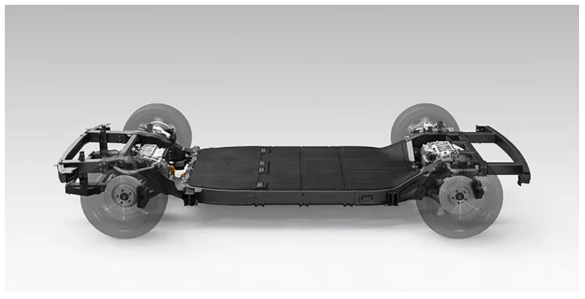
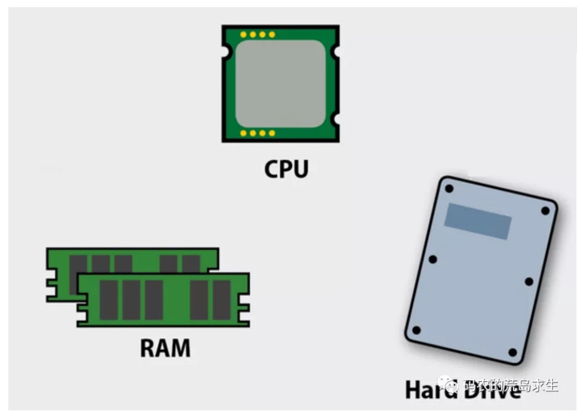
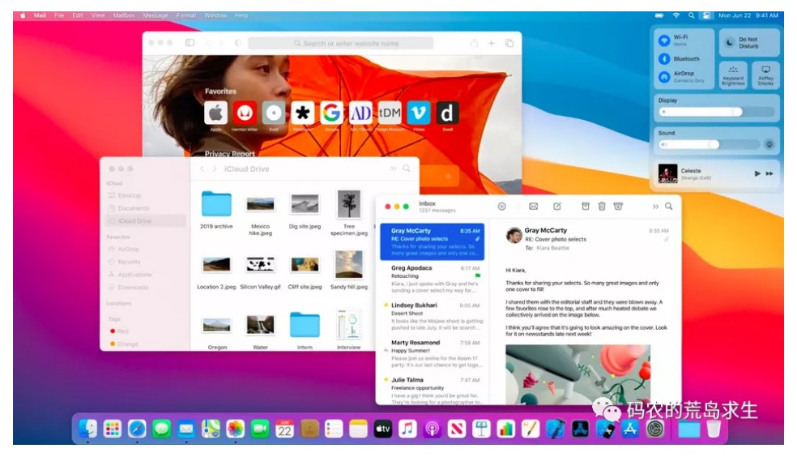
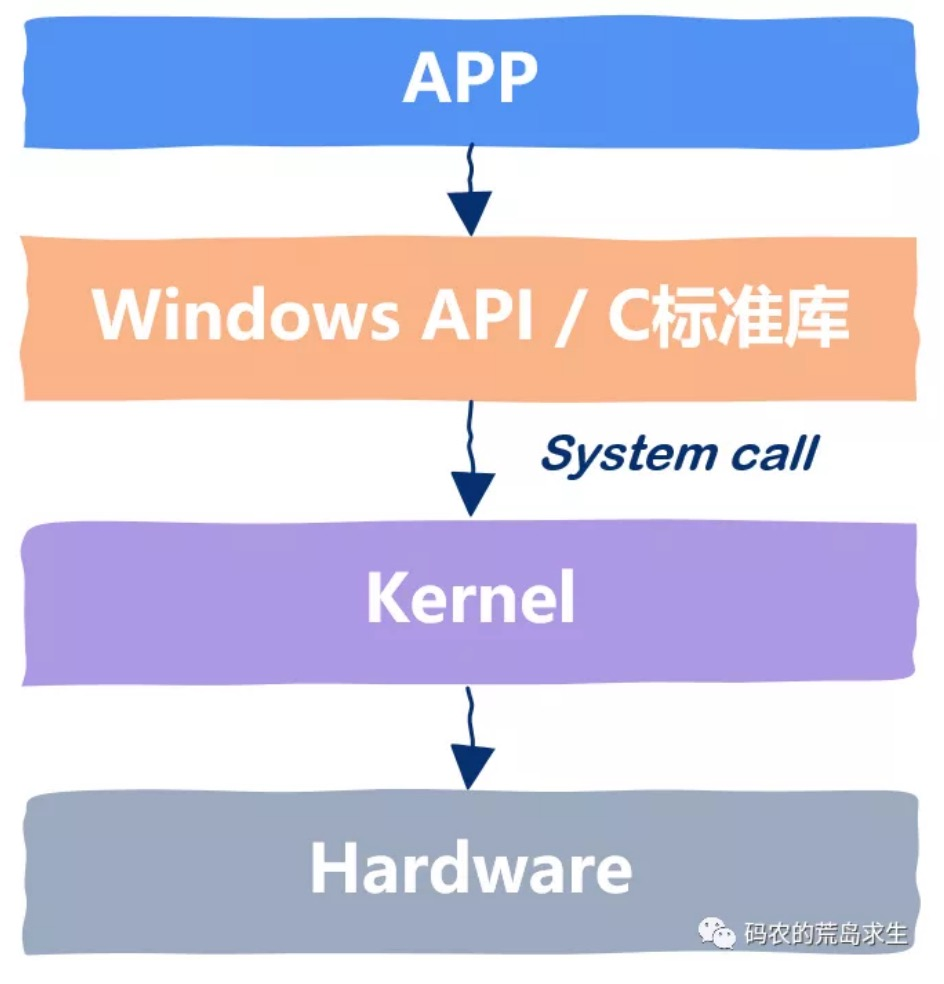
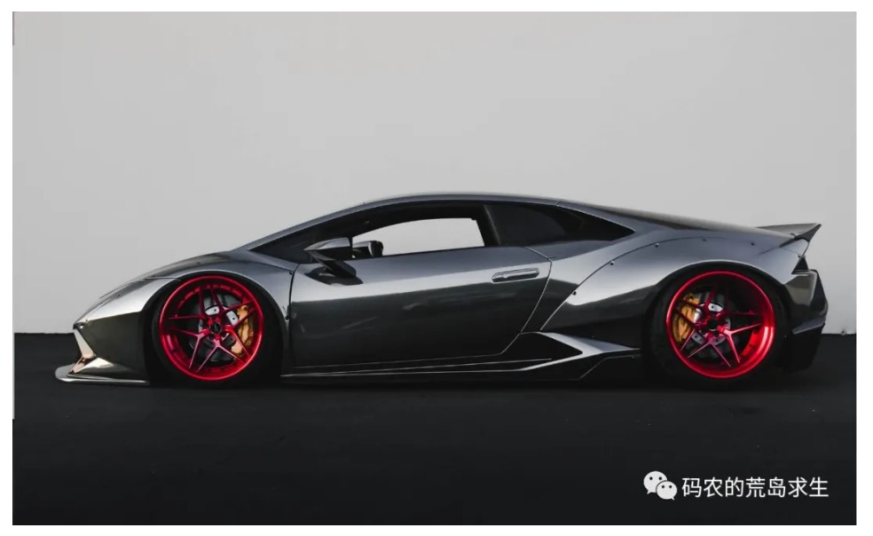

# 23.操作系统与内核有什么区别？

## 通用底盘技术

Canoo公司有一项核心技术专利，这就是它们的通用电动底盘技术，长得是这个样子，非常像一个滑板：

这个带轮子、有电池、能动的滑板已经包含了一辆车最核心的组件，差的就是一个外壳。&#x20;

这个看起来像滑板的东西就是所谓的电池系统和底盘一体化技术，Canoo公司在它们的通用底盘上加装不同的外壳就能制造出不同的车型。&#x20;

## 什么是内核？&#x20;

在上面这个示例中，**包含轮子以及电池系统的底盘就好比内核，而套上外壳加上椅子以及内饰后的整体成品就好比操作系统**。&#x20;

内核仅仅是操作系统的一部分，是真正与硬件交互的那部分软件，与硬件交互包括读写硬盘、读写网盘、读写内存以及任何连接到系统中的硬件。&#x20;

除了与硬件交互外，内核还负责分配资源，分配什么资源呢？所谓资源就是硬件，比如CPU时间、内存、IO等等，这些都是资源。

现在我们知道了内核负责分配资源，那么问题来了，要怎么分配这些资源呢？答案就是以进程的形式来分配资源。&#x20;

怎么分配呢？&#x20;

一句话：**虚拟大法好**。&#x20;

每个进程都认为自己在独占CPU，这通过CPU时间片来实现，内核让CPU在各个进程之间快速切换，这样程序员写好程序员后直接运行即可，即使在单核系统中运行成百上千个进程都没有问题。&#x20;

每个进程都认为自己在独占内存，这通过虚拟内存来实现。&#x20;

有的同学可能会问，为什么都要虚拟化呢？&#x20;

答案显而易见，因为计算机系统内的资源是有限的，**我们只有几个CPU核心、几个G的内存，但却要同时运行几百几千个进程**，除此之外我们别无它法。&#x20;

如果你还知道有其它更高效的方法那么赶紧放下手机，马上将你的思想写成论文发表出来，下一届的图灵奖非你莫属，当然在发表获奖感言的时候一定要记得表示是受到了【码农的荒岛求生】这个公众号的启发才想到的。

因此，内核的职责就是以进程的形式来分配CPU时间，以虚拟内存的形式来分配物理内存，以文件的形式来管理IO设备。&#x20;

## 什么是操作系统？&#x20;

然而只有一个内核实际上是做不了什么真正有用的事情，就像上面示例中那个通用底盘一样，这个底盘确实能跑起来，但你没办法开着这样一个底盘出去浪，因为这个底盘很难用。&#x20;

因此，你不得不加装上方向盘、座椅以及车身外壳等，同样的道理，内核是给人用的，为了与内核交互，发明了命令行以及图形界面GUI。

**除了给普通用户提供使用的接口之外，操作系统还需要给程序员提供编写程序的接口**，当我们写的程序依赖内核提供的服务时是该怎么办呢？&#x20;

有的同学说我们需要依赖内核提供的服务吗？&#x20;

想一想，进行网络编程时你有没有自己编写过处理TCP/IP协议栈数据的代码？你有没有自己写代码从网卡上收发数据？都没有，实际上你需要做的仅仅是简单的调用一些socket接口就可以了。&#x20;

网络编程仅仅是其中的一项，其它还包括文件IO、创建进程、创建线程等等等等，这些是内核提供的，那么我们该怎么使用呢？&#x20;

答案就是通过所谓的系统调用，system call。&#x20;

通过系统调用，我们可以像使用普通函数那样向操作系统请求服务，当然，直接使用系统调用是非常繁琐的，**因此通常会在这之上提供一层封装**。

在Windows平台就是给程序员提供编程接口的是Windows API，这层API包罗万象，不但包括上文提到对系统调用的封装，还包括其它功能，像创建带有图形界面的应用程序等等。&#x20;

**但在Linux世界你找不到一种类似Windows API的东西**，毕竟Windows是微软自家产品，什么都可以打包起来，Linux只是一个开源的内核，如果一定要找一个类似的东西话那就是libc，也就是C标准库，这里同样包括了对系统调用的封装以及一些库函数，但libc不包含创建带有图形界面应用程序的 功能。&#x20;

现在我们知道了，操作系统需要提供两种接口：

* 给用户提供操作接口。&#x20;
* 给程序员提供编程接口。

这些就是好比汽车的外壳，我们(用户和程序员)看得见摸得着，外壳加上底盘——也就是内核，才是功能完善的操作系统。

## 各种各样的操作系统&#x20;

实际上我们熟悉的Linux只是内核而不能称得上是操作系统，Ubuntu则可以认为是操作系统，其内核是Linux；RedHat也是操作系统，其内核同样是Linux；我们可以看到，尽管Ubuntu和RedHat是不同的操作系统，但其内核可以是相同的。&#x20;

这就好比它们可以基于同样的底盘打造出不同的车型。&#x20;

而我们熟悉的Windows也是操作系统，其内核是Windows NT内核。&#x20;

## 总结&#x20;

内核就像本文开头提到的电动底盘，包含了一个汽车的最核心元素；但这样一个底盘并没有什么实际用处，当搭配上外壳以及座椅后才是一辆真正有用的车，这就好比操作系统。值得注意的是，不同的操作系统可以有相同的内核。&#x20;

当我们在使用方便的智能手机以及个人PC时不应忘记，正是操作系统在背后的默默工作让一堆硬件电路变得这么好用。&#x20;

希望这篇文章对大家理解操作系统以及内核有所帮助。

