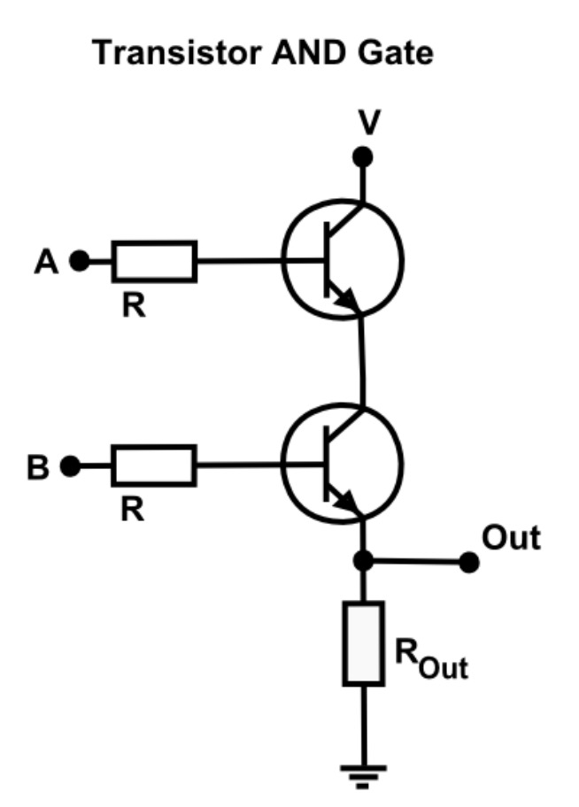
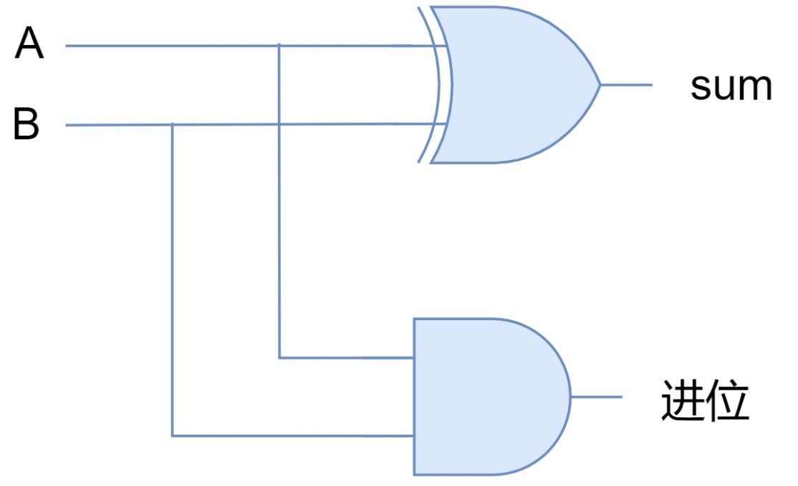
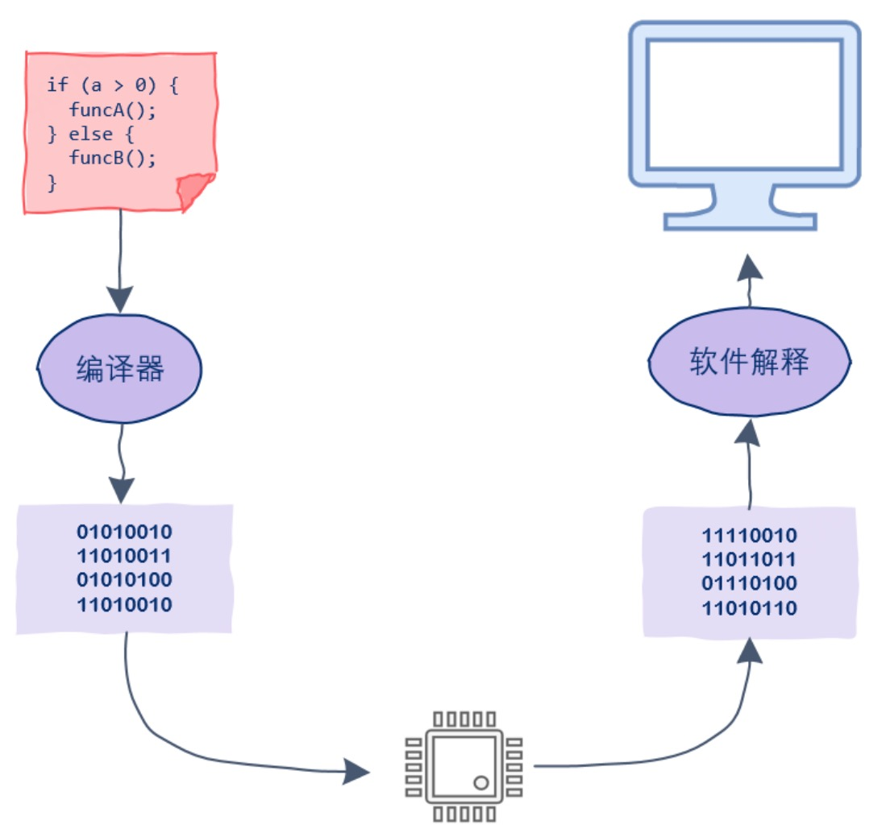

# 6.CPU是如何理解01二进制的？

准确的来说，**CPU不认识也不理解任何东西**。

CPU就像一个单细胞一样，本身不具备任何思考能力，没什么自己的想法，只是简单的你给它一个刺 激，它会有一个反应。

那这个刺激是什么呢？是电压，硬件感知到的仅仅就是电压。&#x20;

电压有两种，高电压和低电压。&#x20;

你马上就能反应过来，这就是01二进制，高电压代表1低电压代表0，0和1仅仅是人类可以理解的东西，硬件电路可不理解这玩意，它仅仅就是靠电流驱动来工作。&#x20;

让我们来看看这个简单的电路，这个就是与门：

你能说这个电路理解它自己该做什么吗？它有自我意识吗？当然没有。&#x20;

所以说这个问题的答案非常简单：&#x20;

**CPU根本就不能理解任何东西，之所以CPU能正常工作，仅仅是因为你(制作CPU的人)让它这么工作**。&#x20;

这个问题就好比你问一辆自行车是如何理解自己怎么跑起来的？还不是因为你设计了车轮、车链然后用脚一蹬跑起来的。

你希望两个开关都打开灯才亮，因此你这样设计电路，这就是与门；你希望任意一个开关打开灯就亮，因此你那样设计电路，这就是或门；你希望关闭开关灯才亮，这就是非门，有了与或非你可以搭建出任意复杂的逻辑电路，比如下面这个能执行加操作的加法器。

看看这个电路，你能说它知道自己是在执行加法操作吗，这当然是人类认为这个电路的输出等价于加法操作的结果。&#x20;

尽管这个电路看上去很不错，给定两个输入得到的输出和我们人类认为的加法是一样一样的，但这有点简单。&#x20;

除了加法是不是还应该有其它操作，如果有多种类型的操作那么就必须告诉电路该操作的类型是上面(操作码)，操作的数字是什么(操作数)。&#x20;

这样我们给它一个输入就能按照我的想法来控制电路该怎么工作了，BOOM！！！宇宙大爆炸！

哦不对，CPU诞生了！&#x20;

人类编写的代码必须首先转为01二进制，之后才能驱动CPU工作。&#x20;

当然，怎么把一坨代码高效等价的转为1001011100。。。这项工作可不简单，人类探索了几十年，一干人等还获得了图灵奖，可见这个问题的重要程度以及难度。

你今天能简单点一下build按钮或简单运行一个命令就能把你写的代码转为01串，要知道这简单的背 后是靠无数天才榨干天量的脑细胞才实现的。

从这里应该应该能看出来，**CPU根本也不会认识任何语言**。&#x20;

现在我们能给CPU输入了，那么输出怎么办呢？&#x20;

**剩下的仅仅就是解释了**，比如给你一个01串，01001101，你可以认为这是一个数字，也可以认为这 是一个字符，也可以是表示RGB颜色，一切都看你怎么解释，这就是软件的工作了。&#x20;

最终的目的只有一个：**让人类能看懂**。&#x20;

整个流程就是这样的：

计算机真实一个非常神奇的机器，如此简单，却又能完成复杂无比的工作。&#x20;

现在你应该明白了吧，计算机所谓能理解二进制就好比你的台灯能理解开关一样。&#x20;

它们真的对此一无所知。

