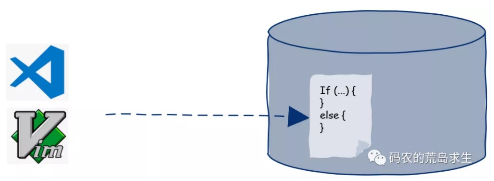
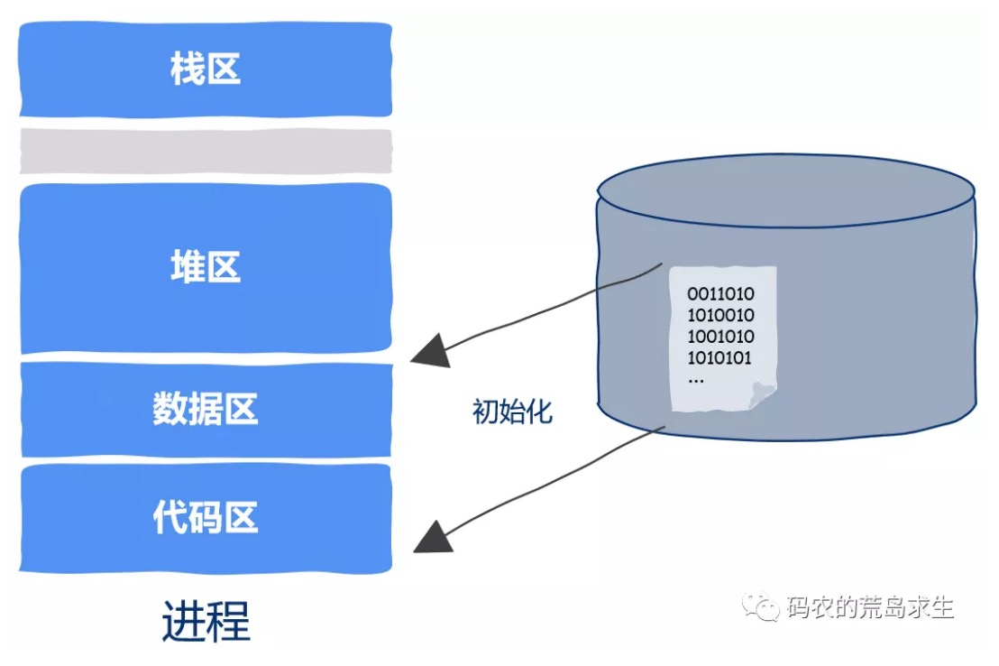
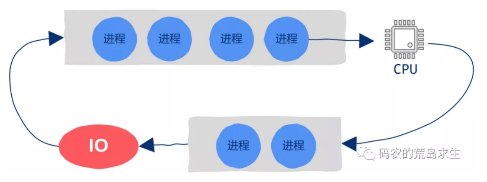
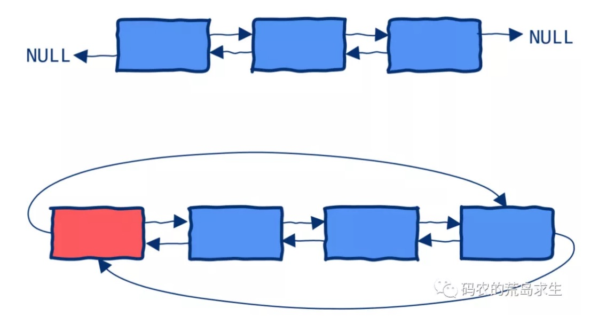
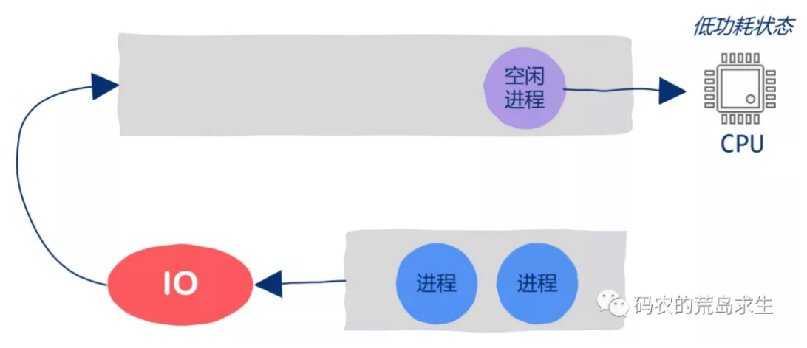

# 7.CPU空闲时在干嘛？

人空闲时会发呆会无聊，计算机呢？&#x20;

假设你正在用计算机浏览网页，当网页加载完成后你开始阅读，此时你没有移动鼠标，没有敲击键盘，也没有网络通信，那么你的计算机此时在干嘛？&#x20;

有的同学可能会觉得这个问题很简单，但实际上，这个问题涉及从硬件到软件、从 CPU 到操作系统等一系列环节，理解了这个问题你就能明白操作系统是如何工作的了。

**你的计算机 CPU 使用率是多少？**

如果此时你正在计算机旁，并且安装有 Windows 或者 Linux ，你可以立刻看到自己的计算机 CPU 使 用率是多少。&#x20;

这是博主的一台安装有 Win10 的笔记本：


可以看到大部分情况下 CPU 利用率很低，也就在 8% 左右，而且开启了 283 个进程，这么多进程基本上无所事事，都在等待某个特定事件来唤醒自己，就好比你写了一个打印用户输入的程序，如果用户一直不按键盘，那么你的进程就处于这种状态。&#x20;

有的同学可能会想也就你的比较空闲吧，实际上大部分个人计算机 CPU 使用率都差不多这样(排除掉看电影、玩游戏等场景)，如果你的使用率总是很高，风扇一直在嗡嗡的转，那么不是软件 bug 就有可能是病毒。。。&#x20;

那么有的同学可能会问，剩下的 CPU 时间都去哪里了？

### 剩下的 CPU 时间去哪里了？

这个问题也很简单，还是以 Win10 为例，打开任务管理器，找到 “详细信息” 这一栏，你会发现有一个 “系统空闲进程”，其 CPU 使用率达到了 99%，正是这个进程消耗了几乎所有的 CPU 时间。


那么为什么存在这样一个进程呢？以及这个进程什么时候开始运行呢？&#x20;

这就要从操作系统说起了。

### 程序、进程与操作系统&#x20;

当你用最喜欢的代码编辑器编写代码时，这时的代码不过就是磁盘上的普通文件，此时的程序和操作系统没有半毛钱关系，操作系统也不认知这种文本文件。



程序员写完代码后开始编译，这时编译器将普通的文本文件翻译成二进制可执行文件，此时的程序依然是保存在磁盘上的文件，和普通没有本质区别。


但此时不一样的是，该文件是可执行文件，也就是说操作系统开始 “懂得” 这种文件，所谓 “懂得” 是指操作系统可以识别、解析、加载，因此必定有某种类似协议的规范，这样编译器按照这种协议生成可执行文件，操作系统就能加载了。&#x20;

在 Linux 下可执行文件格式为 ELF ，在 Windows 下是 EXE 。&#x20;

此时虽然操作系统可以识别可执行程序，**但如果你不去双击一下(或者在Linux下运行相应命令)的依然和操作系统没有半毛钱关系**。&#x20;

但是当你运行可执行程序时魔法就出现了。&#x20;

此时操作系统开始将可执行文件加载到内存，解析出代码段、数据段等，并为这个程序创建运行时需要的堆区栈区等内存区域，此时这个程序在内存中就是这样了：



最后，根据可执行文件的内容，操作系统知道该程序应该执行的第一条机器指令是什么，并将其告诉CPU ，CPU 从该程序的第一条指令开始执行，程序就这样运行起来了。&#x20;

一个在内存中运行起来的程序显然和保存在磁盘上的二进制文件是不一样的，总的有个名字吧，根据“弄不懂原则”，这个名字就叫进程，英文名叫做Process。&#x20;

**我们把一个运行起来的程序叫做进程，这就是进程的由来。**&#x20;

此时操作系统开始掌管进程，现在进程已经有了，那么操作系统是怎么管理进程的呢？

### 调度器与进程管理

银行想必大家都去过，实际上如果你仔细观察的话银行的办事大厅就能体现出操作系统最核心的进程管理与调度。&#x20;

首先大家去银行都要排队，类似的，进程在操作系统中也是通过队列来管理的。&#x20;

同时银行还按照客户的重要程度划分了优先级，大部分都是普通客户；但当你在这家银行存上几个亿时就能升级为 VIP 客户，优先级最高，每次去银行都不用排队，优先办理你的业务。&#x20;

类似的，操作系统也会为进程划分优先级，操作系统会根据进程优先级将其放到相应的队列中供调度器调度。



这就是操作系统需要实现的最核心功能。&#x20;

现在准备工作已经就绪。&#x20;

接下来的问题就是操作系统如何确定是否还有进程需要运行。

### 队列判空：一个更好的设计

从上一节我们知道，实际上操作系统是用队列来管理进程的，那么很显然，如果队列已经为空，那么说明此时操作系统内部没有进程需要运行，这是 CPU 就空闲下来了，此时，我们需要做点什么，就像这样：

```
if (queue.empty()) {
 do_someting();
}
```

这些编写内核代码虽然简单，但内核中到处充斥着 if 这种异常处理的语句，这会让代码看起来一团糟，**因此更好的设计是没有异常**，那么怎样才能没有异常呢？&#x20;

很简单，**那就是让队列永远不会空**，这样调度器永远能从队列中找到一个可供运行的进程。&#x20;

而这也是为什么链表中通常会有哨兵节点的原因，就是为了避免各种判空，这样既容易出错也会让代码一团糟。



就这样，**内核设计者创建了一个叫做空闲任务的进程**，这个进程就是Windows 下的我们最开始看到的“系统空闲进程”，在 Linux 下就是第 0号进程。&#x20;

当其它进程都处于不可运行状态时，调度器就从队列中取出空闲进程运行，显然，**空闲进程永远处于就绪状态，且优先级最低**。&#x20;

既然我们已经知道了，当系统无所事事后开始运行空闲进程，那么这个空闲进程到底在干嘛呢？&#x20;

这就需要硬件来帮忙了。

### 一切都要归结到硬件

在计算机系统中，**一切最终都要靠 CPU 来驱动**，CPU 才是那个真正干活的。


原来，CPU 设计者早就考虑到系统会存在空闲的可能，因此设计了一条机器指令，这个机器指令就是 halt 指令，停止的意思。&#x20;

这条指令会让部分CPU进入休眠状态，从而**极大减少对电力的消耗**，通常这条指令也被放到循环中执 行，原因也很简单，就是要维持这种休眠状态。&#x20;

值得注意的是，halt 指令是特权指令，也就是说只有在内核态下 CPU 才可以执行这条指令，程序员 写的应用都运行在用户态，因此你没有办法在用户态让 CPU 去执行这条指令。&#x20;

此外，不要把进程挂起和 halt 指令混淆，当我们调用 sleep 之类函数时，暂停运行的只是进程，此时 如果还有其它进程可以运行那么 CPU 是不会空闲下来的，当 CPU 开始执行halt指令时就意味着系统 中所有进程都已经暂停运行。

### 软件硬件结合

现在我们有了 halt 机器指令，同时有一个循环来不停的执行 halt 指令，这样空闲任务进程的实际上就已经实现了，其本质上就是这个不断执行 halt 指令的循环，大功告成。&#x20;

这样，当调度器在没有其它进程可供调度时就开始运行空间进程，也就是在循环中不断的执行 halt 指令，此时 CPU 开始进入低功耗状态。



在 Linux 内核中，这段代码是这样写的：

```
while (1) {
 while(!need_resched()) {
     cpuidle_idle_call();  
 }
}
```

其中 cpuidle\_idle\_call函数最终会执行 halt 指令，注意，**这里删掉了很多细节，只保留最核心代码**，实际上 Linux 内核在实现空闲进程时还要考虑很多很多，不同类型的 CPU 可能会有深睡眠浅睡眠之类，操作系统必须要预测出系统可能的空闲时长并以此判断要进入哪种休眠等等，但这并不是我们关注的重点。&#x20;

总的来说，这就是计算机系统空闲时 CPU 在干嘛，就是在执行这一段代码，本质上就是 CPU 在执行halt 指令。&#x20;

实际上，对于个人计算机来说，halt 可能是 CPU 执行最多的一条指令，**全世界的 CPU 大部分时间都用在这条指令上了**，是不是很奇怪。&#x20;

更奇怪的来了，有的同学可能已经注意到了，上面的循环可以是一个while(1) 死循环，而且这个循环里没有break语句，也没有return，那么**操作系统是怎样跳出这个循环的呢**？&#x20;

关于这个问题，我们将会在后续文章中讲解。

### 总结

CPU 空闲时执行特定的 halt 指令，这看上去是一个很简单的问题，但实际上由于 halt 是特权指令，只有操作系统才可以去执行，因此 CPU 空闲时执行 halt 指令就变成了软件和硬件相结合的问题。&#x20;

操作系统必须判断什么情况下系统是空闲的，这涉及到进程管理和进程调度，同时，halt 指令其实是放到了一个 while 死循环中，操作系统必须有办法能跳出循环，所以，CPU 空闲时执行 halt 指令并没有看上去那么简单。&#x20;

希望这篇文章对大家理解 CPU 和操作系统有所帮助。

