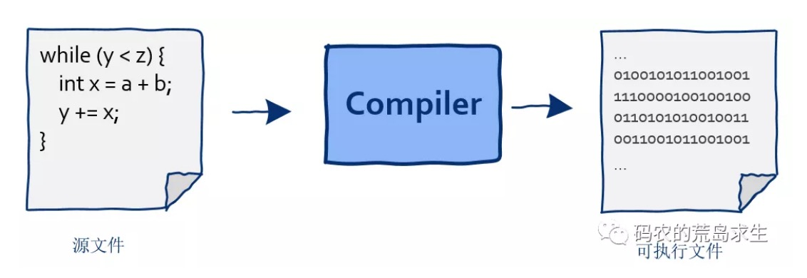
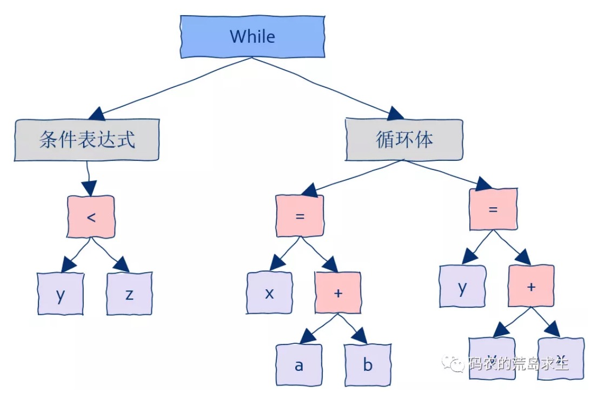
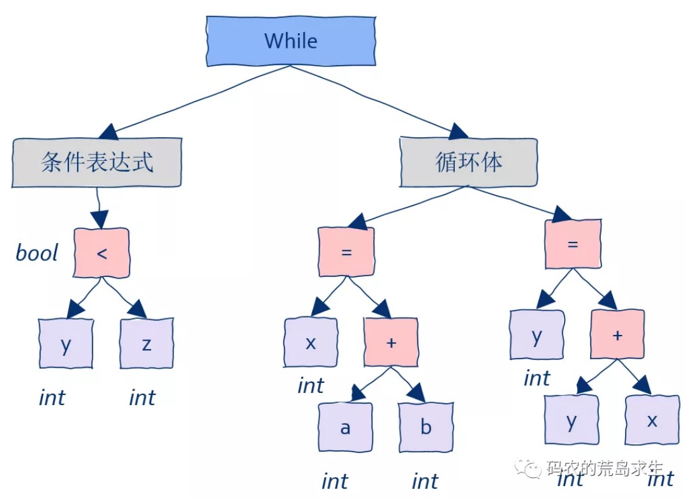

# 8.编译器是如何工作的？

对于程序员来说编译器是非常熟悉的，每天都在用，但是当你在点击“Run”这个按钮或者执行编译命令时你知道编译器是怎样工作的吗？&#x20;

这篇文章就为你解答这个问题。

### 编译器就是一个普通程序，没什么大不了的

什么是编译器？

_<mark style="background-color:blue;">`编译器是一个将高级语言翻译为低级语言的程序。`</mark>_

首先我们一定要意识到编译器就是一个普通程序，没什么大不了的。&#x20;

在没有弄明白编译器如何工作之前你可以简单的把编译器当做一个黑盒子，其作用就是输入一个文本文件输出一个二进制文件。



基本上编译器经过了以下几个阶段，等等，这句话教科书上也有，但是我相信很多同学其实并没有真正理解这几个步骤到底在说些什么，为了让你彻底理解这几个步骤，我们用一个简单的例子来讲解。&#x20;

假定我们有一段程序：

```
while (y < z) {
   int x = a + b;
   y += x;
}
```

那么编译器是怎样把这一段程序人类认识的程序转换为CPU认识的二进制机器指令呢？

### 提取出每一个单词：词法分析

首先编译器要把源代码中的每个“单词”提取出来，在编译技术中“单词”被称为token。其实不只是每个单词被称为一个token，除去单词之外的比如左括号、右括号、赋值操作符等都被称为token。&#x20;

从源代码中提取出token的过程就被称为词法分析，Lexical Analysis。&#x20;

经过一遍词法分析，编译器得到了以下token：

```
T_While     while
T_LeftParen   （
T_Identifier   y
T_Less         <
T_Identifier   z
T_RightParen   )
T_OpenBrace   {
T_Int         int
T_Identifier   x
T_Assign       =
T_Identifier   a
T_Plus         +
T_Identifier   b
T_Semicolon   ;
T_Identifier   y
T_PlusAssign   +=
T_Identifier   x
T_Semicolon   ;
T_CloseBrace   }
```

就这样一个磁盘中保存的字符串源代码文件就转换为了一个个的token。

### 这些token想表达什么意思：语法分析

有了这些token之后编译器就可以根据语言定义的语法恢复其原本的结构，怎么恢复呢？



原来，编译器在扫描出各个token后根据规则将其用树的形式表示出来，这颗树就被称为**语法树**。

### 语法树是不是合理的：语义分析

有了语法树后我们还要检查这棵树是不是合法的，比如我们不能把一个整数和一个字符串相加、比较符左右两边的数据类型要相同，等等。&#x20;

这一步通过后就证明了程序合法，不会有编译错误。



### 根据语法树生成中间代码：代码生成

语义分析之后接下来编译器遍历语法树并用另一种形式来表示，用什么来表示呢？那就是中间代码，intermediate representation code，简称**IR code**。&#x20;

上述语法树可能就会表示为这样的中间代码：

```
Loop: x   = a + b
     y   = x + y
     _t1 = y < z
     if _t1 goto Loop
```

怎么样，这实际上已经比较接近最后的机器指令了。&#x20;

只不过这还不是最终形态。

### 中间代码优化

在生成中间代码后要对其进行优化，我们可以看到，实际上可以把x = a + b这行代码放到循环外，因为每次循环都不会改变x的值，因此优化后就是这样了：

```
     x   = a + b
Loop:y   = x + y
     _t1 = y < z
     if _t1 goto Loop
```

中间代码优化后就可以生成机器指令了。

### 代码生成

将上述优化后的中间代码转换为机器指令：

```
     add $1, $2, $3
Loop:add $4, $1, $4
     slt $6, $1, $5
     beq $6, loop
```

最终，编译器将程序员认识的代码转换为了CPU认识的机器指令。

### 总结

注意这篇简短的讲解不希望给大家留下这样的印象，那就是编译器是很简单的，恰恰相反，现代编译器是非常智能并且极其复杂的，绝不是短短一篇文章就能讲清楚的，能实现一个编译器是困难的，实现一个好的编译器更是难上加难。&#x20;

本文的目的旨在以极简的方式描述编译器的工作原理，这样你就不用把编译器当做一个黑盒了，希望这篇文章能对你有所帮助。
