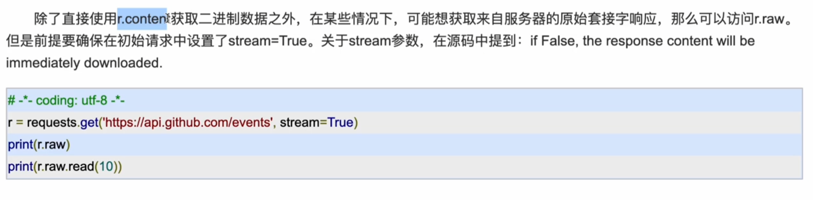
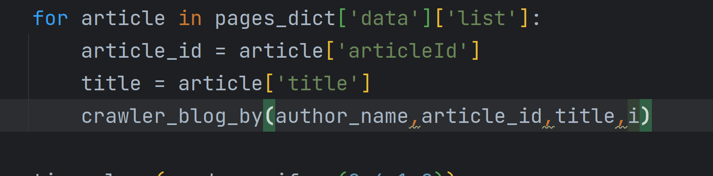
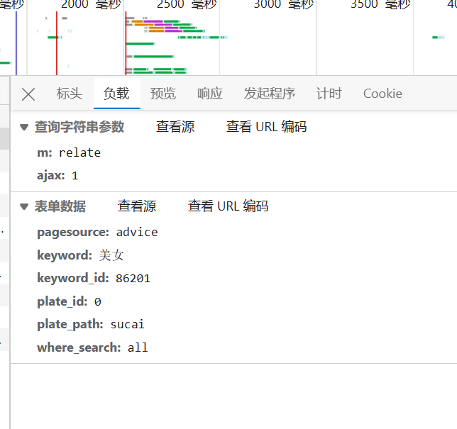
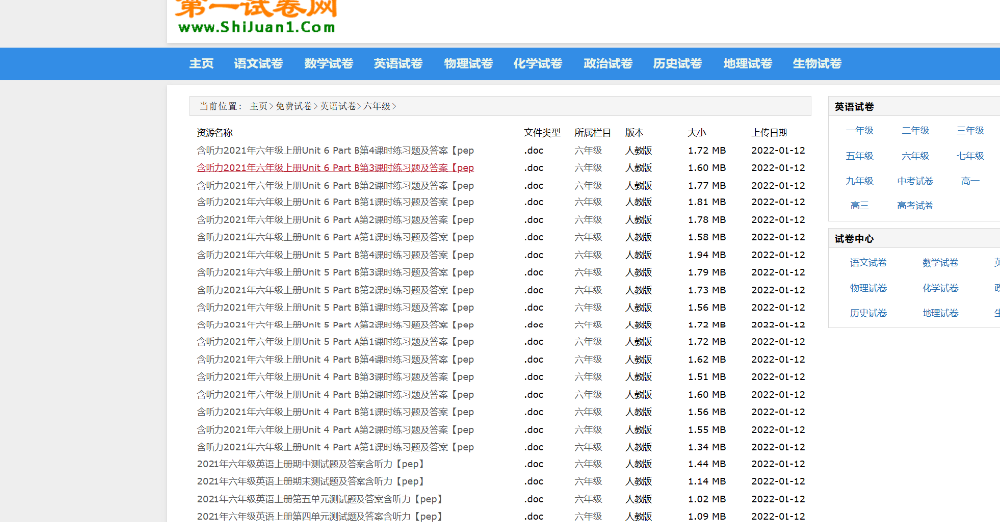

# 1.实战豆瓣top250

这例用bs加上requests

网址是豆瓣的top250

豆瓣电影 Top 250 (douban.com)

还是一个大概的框架


```python
def main(page):
   url = 'https://movie.douban.com/top250?start='+ str(page*25)+'&filter='
   html = request_douban(url)
   soup = BeautifulSoup(html, 'lxml')
   save_to_excel(soup)
```


首先保存请求豆瓣的。


```python
def request_douban(url):
   try:
       response = requests.get(url)
       if response.status_code == 200:
           return response.text
   except requests.RequestException:
       return None
```

之后进行解析。

之后用bs4进行解析。

```python
list = soup.find(class_='grid_view').find_all('li')

   for item in list:
       item_name = item.find(class_='title').string
       item_img = item.find('a').find('img').get('src')
       item_index = item.find(class_='').string
       item_score = item.find(class_='rating_num').string
       item_author = item.find('p').text
       item_intr = item.find(class_='inq').string
```

之后可以将这些数据存储到excel表格里面

这里用到xlwt

```python
book=xlwt.Workbook(encoding='utf-8',style_compression=0)

sheet=book.add_sheet('豆瓣电影Top250',cell_overwrite_ok=True)
sheet.write(0,0,'名称')
sheet.write(0,1,'图片')
sheet.write(0,2,'排名')
sheet.write(0,3,'评分')
sheet.write(0,4,'作者')
sheet.write(0,5,'简介')
```

最后进行一下保存

```python
book.save(u'豆瓣最受欢迎的250部电影.xlsx')
```

就可以了。

# 2.**爬取1000首背景音乐**

这里选取的网站是

动态配乐模板下载_精美好看的配乐模板大全_图客巴巴 (tuke88.com)


我们发现这个网站的爬取是非常的简单的。


结构非常的简单。


这个分页的规律也很简单


具体就是lmt-> audio-list 定位到a


```python
html.xpath("//div[@class='lmt']//div[@class='audio-list']//a[@class='title']/text()")
```

这个就是title的，之后的audio也是同理。


```python
import requests
import lxml.etree

page_n= int(input("请输入你想要爬取的网页数量"))

for i in range(page_n):
    url=f'https://www.tuke88.com/peiyue/zonghe_0_{i}.html'
    response = requests.get(url)

    # 修改html中的语法错误
    html_parser = lxml.etree.HTMLParser()
    html = lxml.etree.fromstring(response.text, parser=html_parser)
    titles = html.xpath("//div[@class='lmt']//div[@class='audio-list']//a[@class='title']/text()")
    mp3_urls=html.xpath("//div[@class='lmt']//div[@class='audio-list']//source/@src")
    print(mp3_urls)
```

这样就可以了，之后我们要把文件存储到本地。

之后进行存储


```python
if not os.path.exists('pymp3'):
    os.makedirs('pymp3')
for title,mp3_urls in zip(titles,mp3_urls):
    #mp3一般流下载
    mp3_stream = requests.get(mp3_urls, stream=True)
    with open(os.path.join('pymp3',title+".mp3"),'wb+') as writer:
        writer.write(mp3_stream.raw.read())
        print(f'【Info】{title}.mp3下载成功')
```


之后加入随机时间


```
time.sleep(random.uniform(0.1,0.4))
```


这样就可以了。下面就是我们的全部源码


```python
import random
import time
import requests
import lxml.etree
import os
page_n= int(input("请输入你想要爬取的网页数量"))

for i in range(page_n):
    url=f'https://www.tuke88.com/peiyue/zonghe_0_{i}.html'
    response = requests.get(url)

    # 修改html中的语法错误
    html_parser = lxml.etree.HTMLParser()
    html = lxml.etree.fromstring(response.text, parser=html_parser)
    titles = html.xpath("//div[@class='lmt']//div[@class='audio-list']//a[@class='title']/text()")
    mp3_urls=html.xpath("//div[@class='lmt']//div[@class='audio-list']//source/@src")
    print(mp3_urls)
    if not os.path.exists('pymp3'):
        os.makedirs('pymp3')
    for title,mp3_urls in zip(titles,mp3_urls):
        #mp3一般流下载
        mp3_stream = requests.get(mp3_urls, stream=True)
        with open(os.path.join('pymp3',title+".mp3"),'wb+') as writer:
            writer.write(mp3_stream.raw.read())
            print(f'【Info】{title}.mp3下载成功')
            time.sleep(random.uniform(0.1,0.4))
```

之后我们来详细说一下这个流的下载，和我们普通的有什么不同




如果为false，他就是立即下载的意思。


# 3.爬取csdn


这里的JavaScript就不做过多的讲解了。

我们首先来进行一个分析

## 博客主页博客文章分析


我们发现我们往下滑的时候，明显是有ajax请求的。

看我们的请求参数


我们发现这个username就是一个博主姓名的标志

以及他的一些返回信息。


这里可以用articledID或者是url都可以。我们路由用

articledId

下面我们开始正式爬取

## 爬取页面数据

我们分析可以看到


需要的数据在这里div id是content_views


```python
def crawler_blog_by(author_name,article_id,title,i):
     article_request_url=f"https://blog.csdn.net/{author_name}/article/details/{article_id}"
     response = sess.get(article_request_url)

     selector = etree.HTML(response.text)
     head_msg = selector.xpath(r"//head")[0]
     head_str = etree.tostring(head_msg, encoding='utf-8', method='html').decode()
     body_msg = selector.xpath(r"//div[@id='content_views]'")
     body_str = etree.tostring(body_msg, encoding="utf-8", method="html").decode()
    
```

我们有了之后，我们就保存为html就可以了


```python
if not os.path.exists("c_articles"):
    os.makedirs("c_articles")
# title进行一些优化
title = title.title("/", "-").title(":", "").title(": ", "")

save_file_name = os.path.join("c_articles", f'{author_name}-{title}-{article_id}.html')
with open(save_file_name, 'w', encoding='utf-8') as writer:
    writer.write(f"""<head> <meta charset="utf-8 </head>
        {body_str}
    """)
    print(f'【info】: {author_name}第{i}篇博文{title}-{article_id}.html保存文件成功')
    i += 1

```

之后我们开始循环爬取


```python
# 循环爬取分页html
for page_no in range(MAX_PAGE_NUM):
    try:
        data = {
            'page': '2',
            'size': '20',
            'businessType': 'blog',
            'orderby': '',
            'noMore': 'false',
            'year': '',
            'month': '',
            'username': author_name}
        pages_dict = sess.get('https://blog.csdn.net/community/home-api/v1/get-business-list', params=data).json()
        for article in pages_dict['data']['list']:
            article_id = article['articleId']
            title = article['title']
            crawler_blog_by(author_name,article_id,title,i)

        time.sleep(random.uniform(0.4,1.0))
    except Exception as e:
        print(e) #log日志文件系统，实际开发的话
```


这里就是对数据简单的进行了一些分析

这里有一些bug





那么我们怎么办呢

我们给他定义成全局的i


这样就可以了

之后我们来看如何下载这个pdf的插件

wkhtmltopdf

官网是在这里的

然后配置环境变量就可以了

## 保存为pdf文件


```python
def html_to_pdf(file_html_name):
    pre_file_name = os.path.splitext(file_html_name)[0]#这里的0就是.html前面，1就是html
    pdfkit.from_file(file_html_name,pre_file_name+".pdf")
```


很简单

下面我们就来看全部的源码


```python
"""
1 爬取博主的所有博文的article_ids
2 根据id爬取html
3 保存为html 在保存一个pdf格式
"""
import random
import time

import requests
from lxml import etree
import pdfkit
import os

author_name = input("输入博主ID:")
MAX_PAGE_NUM = 200
i = 1

sess = requests.Session()
agent = "Mozilla/5.0 (Windows NT 10.0; Win64; x64) AppleWebKit/537.36 (KHTML, like Gecko) Chrome/114.0.0.0 Safari/537.36 Edg/114.0.1823.58"
sess.headers['User-Agent'] = agent

def html_to_pdf(file_html_name):

    pre_file_name = os.path.splitext(file_html_name)[0]#这里的0就是.html前面，1就是html
    pdfkit.from_file(file_html_name,pre_file_name+".pdf")

def crawler_blog_by(author_name, article_id, title):
    article_request_url = f"https://blog.csdn.net/{author_name}/article/details/{article_id}"

    response = sess.get(article_request_url)

    selector = etree.HTML(response.text)


    head_msg = selector.xpath(r"//head")[0]
    head_str = etree.tostring(head_msg, encoding='utf-8', method='html').decode()
    body_msg = selector.xpath(r'//div[@id="content_views"]')[0]
    body_str = etree.tostring(body_msg, encoding="utf-8", method="html").decode()


    if not os.path.exists("c_articles"):
        os.makedirs("c_articles")
    # title进行一些优化
    title = title.replace("/", "-").replace(":", "").replace(": ", "")

    save_file_name = os.path.join("c_articles", f'{author_name}-{title}-{article_id}.html')
    with open(save_file_name, 'w', encoding='utf-8') as writer:
        writer.write(f"""<head> <meta charset="utf-8 </head>
            {body_str}
        """)
        html_to_pdf(save_file_name)
        global i
        print(f'【info】: {author_name}第{i}篇博文{title}-{article_id}.html保存文件成功')
        i += 1


# 循环爬取分页html
for page_no in range(MAX_PAGE_NUM):
    try:
        data = {
            'page': '2',
            'size': '20',
            'businessType': 'blog',
            'orderby': '',
            'noMore': 'false',
            'year': '',
            'month': '',
            'username': author_name}
        pages_dict = sess.get('https://blog.csdn.net/community/home-api/v1/get-business-list', params=data).json()
        for article in pages_dict['data']['list']:
            article_id = article['articleId']
            title = article['title']
            crawler_blog_by(author_name,article_id,title)
            time.sleep(random.uniform(0.4,1.0))
    except Exception as e:
        print(e) #log日志文件系统，实际开发的话


```

# 4.觅知网

我们进行一下分析


首先来看响应的


通过比较我们发现

https://www.51miz.com/so-sucai/86201/p_1/

为第一页，p_2就是第二页





这些是我们需要发送的参数


```python
url="https://www.51miz.com/index.php?m=relate&ajax=1"
params={
    'pagesource': 'advice',
    'keyword': '跑车',
    'keyword_id': '',#这里经过测试是可以为空的
    'plate_id': '0',
    'plate_path': 'sucai',
    'where_search': 'all'
}
```

之后是对这些进行下载

```python
headers = {
    'User-Agent': "Mozilla/5.0 (Windows NT 10.0; Win64; x64) AppleWebKit/537.36 (KHTML, like Gecko) Chrome/114.0.0.0 Safari/537.36 Edg/114.0.1823.58"
}

response1 = requests.post(url=url, params=params, headers=headers)
index_dict = response1.json()
for item in index_dict:
    print(f"【开始下载】 : 类别为{item['word']}的图片")
    index_url = f"{item['url'][:-5]}/p_{i}"
    response2 = requests.get(index_url)
    html_parser = lxml.etree.HTMLParser
    html = lxml.etree.fromstring(response2.text, parser=html_parser)
    titles=html.xpath("//a[@class='image-box']//img/@title")
    html.xpath("//img[@class='lazyload']/@data-original")
    if not os.path.exists('picture'):
        os.mkdir('picture')
```

之后我们开始持久化存储

```python
for title,pic_url in zip(titles,pic_url):
    try:
        png_url=pic_url[:pic_url.index('!')] #提取！以前的
        pic_stream = requests.get(f'https:{png_url}', stream=True)
        title=title[:200] #文件名限制为255
        with open(os.path.join('picture',title+".png"),'wb+') as writer:
            writer.write(pic_stream.raw.read())
            print(f"【INFO】{title}下载成功")
            time.sleep(random.uniform(0.1,0.4))
    except Exception as e:
        with open("error.log",'a') as fo:
            fo.write(str(e))
```

至此就可以了。下面我们来看一个全部的代码


```python
import time
import random
import requests
import lxml.etree
import os

key_word = input("输入下载图片的关键词")
page_n = int(input("输入要爬取的网页数量"))
url = "https://www.51miz.com/index.php?m=relate&ajax=1"
params = {
    'pagesource': 'advice',
    'keyword': key_word,
    'keyword_id': '',  # 这里经过测试是可以为空的
    'plate_id': '0',
    'plate_path': 'sucai',
    'where_search': 'all'
}
headers = {
    'User-Agent': "Mozilla/5.0 (Windows NT 10.0; Win64; x64) AppleWebKit/537.36 (KHTML, like Gecko) Chrome/114.0.0.0 Safari/537.36 Edg/114.0.1823.58"
}
response1 = requests.post(url=url, params=params, headers=headers)
index_dict = response1.json()
each_class_n = page_n // len(index_dict) + 1
for item in index_dict:
    j = 1
    while j <= each_class_n:
        print(f"【开始下载】 : 类别为{item['word']}的图片")
        index_url = f"{item['url'][:-5]}/p_{j}"
        response2 = requests.get(index_url,headers=headers)
        html_parser = lxml.etree.HTMLParser()
        html = lxml.etree.fromstring(response2.text, parser=html_parser)
        titles = html.xpath("//a[@class='image-box']//img/@title")
        pic_url = html.xpath("//img[@class='lazyload ']/@data-original")
        if not os.path.exists(key_word):
            os.mkdir(key_word)
        for title, pic_url in zip(titles, pic_url):
            try:
                png_url = pic_url[:pic_url.index('!')]  # 提取！以前的
                pic_stream = requests.get(f'https:{png_url}', stream=True)
                title = title[:200]  # 文件名限制为255
                with open(os.path.join(key_word, title + ".png"), 'wb+') as writer:
                    writer.write(pic_stream.raw.read())
                    print(f"【INFO】{title}下载成功")
                    time.sleep(random.uniform(0.1, 0.4))
            except Exception as e:
                with open("error.log", 'a') as fo:
                    fo.write(str(e))
    j += 1

```

# 5.微博超话爬取


我们发现这里是有一个高级搜素的。这个可以作为我们的一个，爬取的思路


很显然是没有加密过的。


之后去网页上定位一下内容。

同时对于展开的这个问题


就是很简单。俩个不一样的。

## 构造小时对


```python
import calendar


def create_hour_list(year):
    data_list=[]
    for month in range(1,13):
        month_days=calendar.monthrange(year,month)[1]#返回多少天
        for day in range(1,month_days+1):
            ymd=f"{year}-{month:>02}-{day:>02}"
            data_list.append(ymd)
    day_hour_list=[f"{day}-{hour}" for day in data_list for hour in range(24)]
    return day_hour_list

if __name__ == '__main__':
    hour_list = create_hour_list(2023)
    print(hour_list)
```

这个构造很简单。这里就不做介绍了。

返回格式就是


和这个一样的


这个就算是构造完成了。


```python
if __name__ == '__main__':
    year=int(input('输入要查询微博的年份'))
    key_word=input('输入要爬取的主题词')
    crawler(key_word,year=year,only_chaohua=True)
```

之后我们根据这个格式来写我们的代码

## 主要代码

这里需要说一个巧妙的地方

```python
year_hour_pair=list(zip(year_hour[:-1],year_hour[1:]))
```

这段代码是将一个名为year_hour的列表进行处理，并生成一个新的列表year_hour_pair。这个新列表包含了year_hour中相邻元素的配对。

具体来说，zip(year_hour[:-1], year_hour[1:])的作用是将year_hour列表的第一个元素与第二个元素配对，第二个元素与第三个元素配对，以此类推，直到倒数第二个元素与最后一个元素配对。这样就生成了一系列的元组，每个元组中包含了相邻的两个元素。

举个例子，假设year_hour列表的内容为[2021, 2022, 2023, 2024, 2025]，那么year_hour_pair列表的内容将会是[(2021, 2022), (2022, 2023), (2023, 2024), (2024, 2025)]。

我们来看一下请求头：


```python
headers = {
    'User-Agent': "Mozilla/5.0 (Windows NT 10.0; Win64; x64) AppleWebKit/537.36 (KHTML, like Gecko) Chrome/114.0.0.0 Safari/537.36 Edg/114.0.1823.58",
    'referer': f"https://s.weibo.com/weibo/?q={key_word}&typeall=1&suball=1&timescope=custom:{start_hour}:{end_hour}&Refer=g",
    'cookie': "login_sid_t=4cf9918868f99a80993ee8db70ea9978; cross_origin_proto=SSL; _s_tentry=passport.weibo.com; Apache=4295370010248.756.1688354182480; SINAGLOBAL=4295370010248.756.1688354182480; ULV=1688354182482:1:1:1:4295370010248.756.1688354182480:; SUB=_2A25Jpk5ADeRhGeFL61MT9ybOzDiIHXVq0jiIrDV8PUNbmtANLVDBkW9NQrM7Yw-SB6k32M9TnUFEl3ZR1SRytf8I; SUBP=0033WrSXqPxfM725Ws9jqgMF55529P9D9WF97F3KxUrKVsFgiw-BcK.W5JpX5KzhUgL.FoMfeh2ES0nES0B2dJLoIp7LxKML1KBLBKnLxKqL1hnLBoMNSK5peoMReoMX; ALF=1719890320; SSOLoginState=1688354320"
}
```

用这三个就是可以的

我们这里介绍一下cookie。


```python
page_no=1
while page_no < ASSUME_HOUR_MAX_PAGE_N:
    url=f"https://s.weibo.com/weibo/?q={key_word}&typeall=1&suball=1&timescope=custom:{start_hour}:{end_hour}&Refer=g&page={page_no}:

    try:
        response = sess.get(url, headers=headers, verify=False, timeout=50)
        soup = BeautifulSoup(response.text, 'html5lib')
        error_bs = soup.find('div', attrs={'class': 'm-error'})
        if error_bs:
            print(f"{start_hour}到{end_hour}时间区域内发布的{key_word}超话数据,一共{page_no}页")
            break

        soup.findAll('div',attrs={'action-type':'feed_list_item'})

```

这里用soup

假如出错的话，有一个

error_bs这个。假如有这个的话，就说明已经爬取完了。


```python
all_bs_list = soup.findAll('div', attrs={'action-type': 'feed_list_item'})
```

这里是所有的内容

之后进行一个查找


```python
for item_bs in all_bs_list:
    if only_chaohua:
        topic_from_href=item_bs.find('a',attrs={'href':'https://huati.weibo.com/11256'})
        topic_from=item_bs.find('a',text=f"{key_word}超话")
    if topic_from_href or topic_from:
        name_bs = item_bs.find('a', attrs={'class': 'name'})
        name = item_bs.get('nick-name')
        item_bs.find('p',attrs={'node-type': 'feed_list_content_full'})
        if not name_bs:
            content_bs = item_bs.find('p', attrs={'node-type': 'feed_list_content'})
        content = content_bs.get_text().strip()
```


很简单的就不分析了。

之后持久化存储

```python
 with open(f'{year}-{key_word}-微博.csv','a') as appender:
            appender.write(f"{name},{content},{url}\n")
page_no+=1
```


之后是错误的处理


```python
except Exception as e:
    with open('error_log.log','a') as error_log:
        error_log.write(str(e)+"\n")
```

下面我们来看全部的代码

```
import calendar

import requests
from bs4 import BeautifulSoup
import urllib3


urllib3.disable_warnings()

def create_hour_list(year):
    data_list = []
    for month in range(1, 13):
        month_days = calendar.monthrange(year, month)[1]  # 返回多少天
        for day in range(1, month_days + 1):
            ymd = f"{year}-{month:>02}-{day:>02}"
            data_list.append(ymd)
    day_hour_list = [f"{day}-{hour}" for day in data_list for hour in range(24)]
    return day_hour_list


def crawler(key_word, year, only_chaohua):
    ASSUME_HOUR_MAX_PAGE_N = 100
    year_hour = create_hour_list(year)
    # 组建相邻元素来进行配对
    year_hour_pair = list(zip(year_hour[:-1], year_hour[1:]))
    sess = requests.Session()
    for start_hour, end_hour in year_hour_pair:
        key_word_code = key_word.strip().encode('utf-8')
        headers = {
            'User-Agent': "Mozilla/5.0 (Windows NT 10.0; Win64; x64) AppleWebKit/537.36 (KHTML, like Gecko) Chrome/114.0.0.0 Safari/537.36 Edg/114.0.1823.58",
            'referer': f"https://s.weibo.com/weibo/?q={key_word_code}&typeall=1&suball=1&timescope=custom:{start_hour}:{end_hour}&Refer=g",
            'cookie': "login_sid_t=4cf9918868f99a80993ee8db70ea9978; cross_origin_proto=SSL; _s_tentry=passport.weibo.com; Apache=4295370010248.756.1688354182480; SINAGLOBAL=4295370010248.756.1688354182480; ULV=1688354182482:1:1:1:4295370010248.756.1688354182480:; SUB=_2A25Jpk5ADeRhGeFL61MT9ybOzDiIHXVq0jiIrDV8PUNbmtANLVDBkW9NQrM7Yw-SB6k32M9TnUFEl3ZR1SRytf8I; SUBP=0033WrSXqPxfM725Ws9jqgMF55529P9D9WF97F3KxUrKVsFgiw-BcK.W5JpX5KzhUgL.FoMfeh2ES0nES0B2dJLoIp7LxKML1KBLBKnLxKqL1hnLBoMNSK5peoMReoMX; ALF=1719890320; SSOLoginState=1688354320"
        }
        page_no = 1
        while page_no < ASSUME_HOUR_MAX_PAGE_N:
            url = f"https://s.weibo.com/weibo/?q={key_word}&typeall=1&suball=1&timescope=custom:{start_hour}:{end_hour}&Refer=g&page={page_no}"

            try:
                response = sess.get(url, headers=headers, verify=False, timeout=50)
                soup = BeautifulSoup(response.text, 'html5lib')
                error_bs = soup.find('div', attrs={'class': 'm-error'})
                if error_bs:
                    print(f"{start_hour}到{end_hour}时间区域内发布的{key_word}超话数据,一共{page_no}页")
                    break
                all_bs_list = soup.findAll('div', attrs={'action-type': 'feed_list_item'})

                for item_bs in all_bs_list:
                    if only_chaohua:
                        topic_from_href=item_bs.find('a',attrs={'href':'https://huati.weibo.com/11256'})
                        topic_from = item_bs.find('a', string=f"{key_word}超话")

                    if topic_from_href or topic_from:
                        name_bs = item_bs.find('a', attrs={'class': 'name'})
                        name = name_bs.get('nick-name')
                        content_bs = item_bs.find('p', attrs={'node-type': 'feed_list_content_full'})
                        if not content_bs:
                            content_bs = item_bs.find('p', attrs={'node-type': 'feed_list_content'})
                        content = content_bs.get_text().strip()
                        with open(f'{year}-{key_word}-微博.csv','a',encoding='utf-8') as appender:
                            appender.write(f"{name},{content},{url}\n")
                page_no+=1
            except Exception as e:
                with open('error_log.log','a') as error_log:
                    error_log.write(str(e)+"\n")
if __name__ == '__main__':
    year = int(input('输入要查询微博的年份'))
    key_word = input('输入要爬取的主题词')
    crawler(key_word, year=year, only_chaohua=True)

```


# 6.关于图怪网去水印

当时本来想去可画上做一个东西的，发现没有想要的素材，于是去搜索了一下，发现了这个网站。这个如果不开会员的话。


是有一个浅浅的水印，简单的进行一个分析，首先我在想她是不是一个div的元素，但是找了半天没有找见。后来把她放到了ajax请求上。


发现了这个，我们右键把她阻断了


就没有了。

至于你问如何拿到这个图。

截屏是最快的方法。

其他的方法目前研究不出来。

# 7.第一试卷网

爬取第一试卷网网站

免费试卷 / 英语试卷 / 六年级_第一试卷网 (shijuan1.com)



先是通过了正则表达式，来获取到了每个试卷的子链接。

```python
import re
import requests
num=1
url="https://www.shijuan1.com/a/sjyy6/list_609_"+str(num)+".html"
resp=requests.get(url)
resp.encoding=resp.apparent_encoding

obj=re.compile(r"<td width='52%' height='23'><a href=\"(?P<href>.*?)"
               r"\" class=\"title\" target='_blank'>",re.S)
result=obj.finditer(resp.text)
#定义一个爬虫
child_href_list=[]
for it in result:
   ul=it.group('href')


```

之后对子页面进行提取

```python
#提取子页面
for href in child_href_list:
    child_resp=requests.get(href)
    child_resp.encoding=child_resp.apparent_encoding
    result2=obj2.search(child_resp.text,re.S)
    downloadadress=domain+result2.group('download')
    print(downloadadress)

```

对于提取到的东西，需要进行下载。

一个下载的模板。

原理就是转换为二进制。


```python
#获取试卷
img_resp = requests.get(downloadadress)
img_picture_bite = img_resp.content  # 这里拿到的是字节
img_name = downloadadress.split("/")[-1]  # 拿到url的最后一个/以后的内容
with open(img_name, mode="wb") as f:
    f.write(img_picture_bite)  # 将字节写入到文件中
print("over!", img_name)
sleep(1)  # 为了防止服务器不把这个ip拉黑。模拟人工访问
break
```


最后是全部的源码


```python
import re
import requests
from time import sleep
num = 1
url = "https://www.shijuan1.com/a/sjyy6/list_609_" + str(num) + ".html"
domain="https://www.shijuan1.com"
resp = requests.get(url)
resp.encoding = resp.apparent_encoding

obj = re.compile(r"<td width='52%' height='23'><a href=\"(?P<href>.*?)"
                 r"\" class=\"title\" target='_blank'>", re.S)

obj2=re.compile(r'<li><a href="(?P<download>.*?)" target="_blank"')

result = obj.finditer(resp.text)

# 定义一个爬虫进行子页面的爬取
child_href_list = []
for it in result:
    ul = it.group('href')
    child_href=domain+it.group('href')
    child_href_list.append(child_href)
    print(child_href_list)
    break
#提取子页面
for href in child_href_list:
    child_resp=requests.get(href)
    child_resp.encoding=child_resp.apparent_encoding
    result2=obj2.search(child_resp.text,re.S)
    downloadadress=domain+result2.group('download')
    print(downloadadress)
    #获取试卷
    img_resp = requests.get(downloadadress)
    img_picture_bite = img_resp.content  # 这里拿到的是字节
    img_name = downloadadress.split("/")[-1]  # 拿到url的最后一个/以后的内容
    with open(img_name, mode="wb") as f:
        f.write(img_picture_bite)  # 将字节写入到文件中
    print("over!", img_name)
    sleep(1)  # 为了防止服务器不把这个ip拉黑。模拟人工访问
    break

```

这里用了break是为了测试方便，当大面积的爬取的时候，不需要break


成果也是非常的明显。


