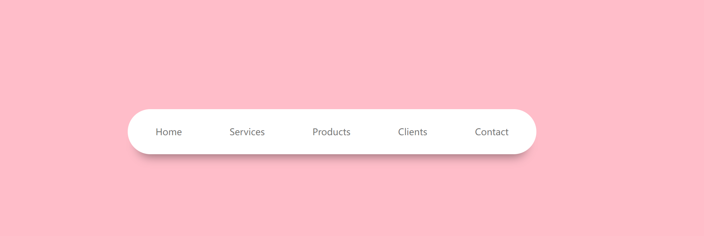
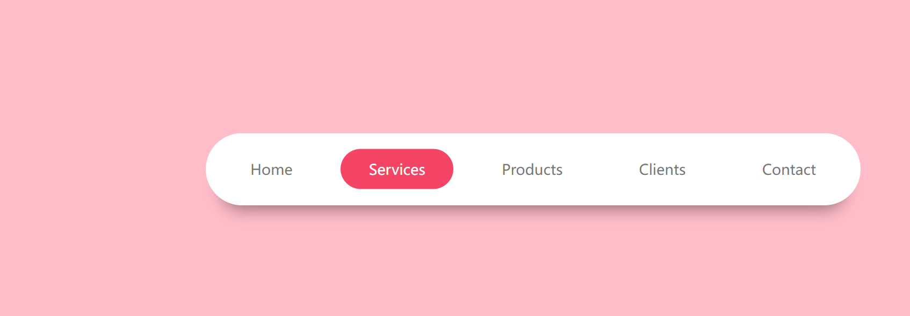
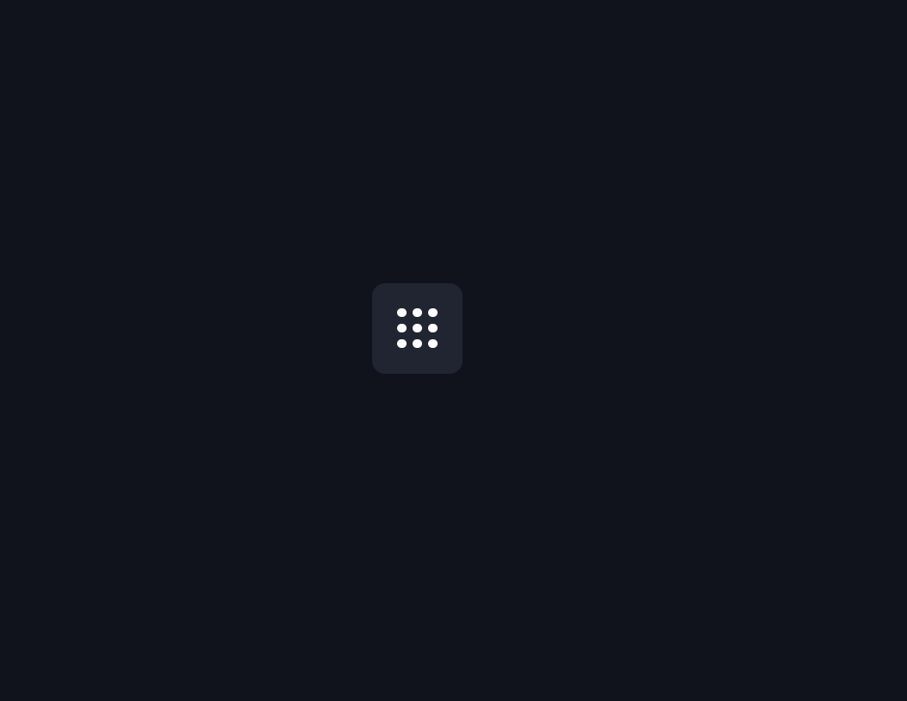
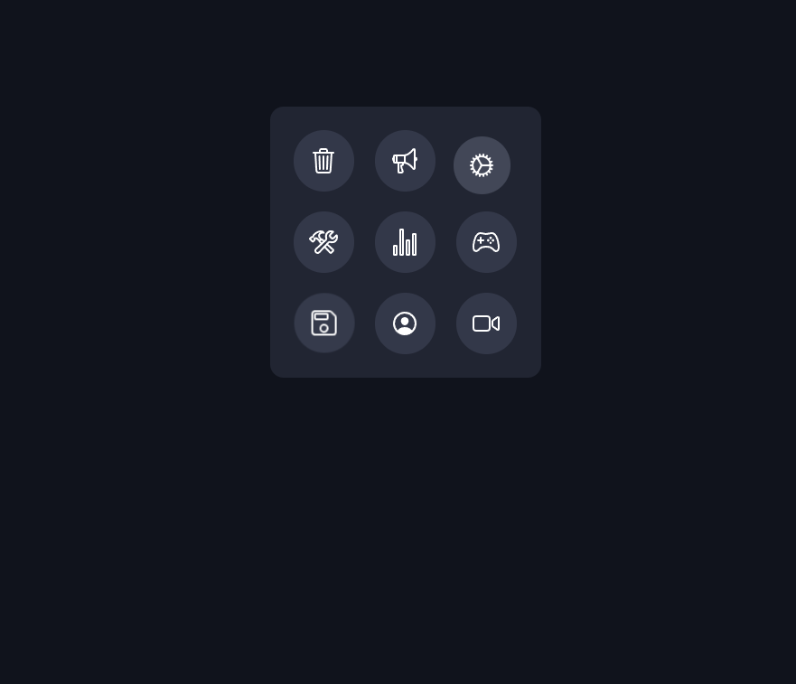
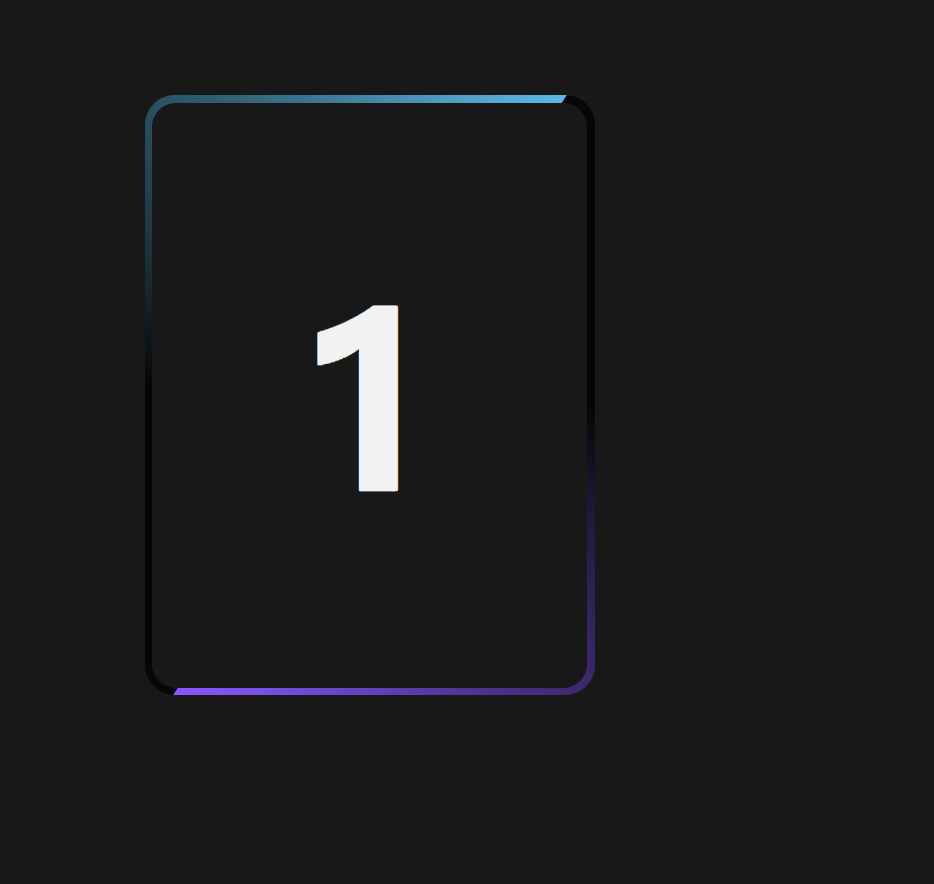
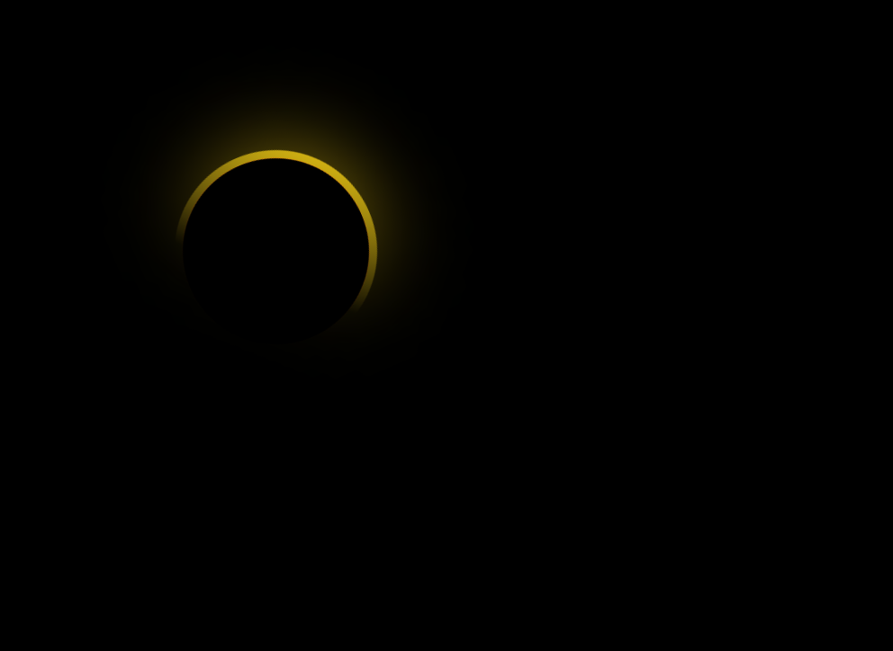

# 立体导航栏

实现了当鼠标滑动的时候



会有一个动态选中的效果



html部分

```html
<!DOCTYPE html>
<html lang="en">
<head>
  <meta charset="UTF-8">
  <meta http-equiv="X-UA-Compatible" content="IE=edge">
  <meta name="viewport" content="width=device-width, initial-scale=1.0">
  <link rel="stylesheet" href="./style.css">
  <title>立体导航栏</title>
</head>
<body>
  <div class="container">
    <nav>
      <ul>
        <li>Home</li>
        <li>Services</li>
        <li>Products</li>
        <li>Clients</li>
        <li>Contact</li>
      </ul>
    </nav>
  </div>
</body>
</html>
```

style部分：

```css
* {
  margin: 0;
  padding: 0;
  box-sizing: border-box;
  font-family: 'Poppins', sans-serif;
}
.container {
  background: #ffbdc9;
  width: 100%;
  height: 100vh;
  display: flex;
  align-items: center;
  justify-content: center;
}
nav {
  background: #fff;
  border-radius: 50px;
  padding: 10px;
  box-shadow: 0 25px 20px -20px rgba(0, 0, 0, 0.4);
}
nav ul li {
  list-style: none;
  display: inline-block;
  padding: 13px 35px;
  margin: 10px;
  font-size: 18px;
  font-weight: 500;
  color: #777;
  cursor: pointer;
  position: relative;
  z-index: 2;
  transition: color 0.5s;
}
nav ul li::after {
  content: '';
  background: #f44566;
  width: 100%;
  height: 100%;
  border-radius: 30px;
  position: absolute;
  top: 100%;
  left: 50%;
  transform: translate(-50%, -50%);
  z-index: -1;
  opacity: 0;
  transition: top 0.5s,opacity 0.5s;
}
nav ul li:hover{
  color: #fff;
}
nav ul li:hover::after{
  top: 50%;
  opacity: 1;
}
```

效果展示网页

[立体导航栏 (guoyaxue.top)](https://effect.guoyaxue.top/07/01/index.html)

# 多个功能button组件

起初是一个这样的盒子



之后当点击的时候

就会以一个动态发散的行为，发散出来



html部分

```html
<!DOCTYPE html>
<html lang="en">
<head>
  <meta charset="UTF-8" />
  <meta http-equiv="X-UA-Compatible" content="IE=edge" />
  <meta name="viewport" content="width=device-width, initial-scale=1.0" />
  <link rel="stylesheet" href="style.css">
  <title>盒子</title>
</head>

<body>
<div class="navigation">
      <span style="--i: 0; --x: -1; --y: 0"><ion-icon name="construct-outline"></ion-icon>
      </span>
  <span style="--i: 1; --x: 1; --y: 0"><ion-icon name="game-controller-outline"></ion-icon></span>
  <span style="--i: 2; --x: 0; --y: -1"><ion-icon name="megaphone-outline"></ion-icon></span>
  <span style="--i: 3; --x: 0; --y: 1"><ion-icon name="person-circle-outline"></ion-icon></span>
  <span style="--i: 4; --x: 1; --y: 1"><ion-icon name="videocam-outline"></ion-icon></span>
  <span style="--i: 5; --x: -1; --y: -1"><ion-icon name="trash-outline"></ion-icon></span>
  <span style="--i: 6; --x: 0; --y: 0"><ion-icon name="stats-chart-outline"></ion-icon></span>
  <span style="--i: 7; --x: -1; --y: 1"><ion-icon name="save-outline"></ion-icon></span>
  <span style="--i: 8; --x: 1; --y: -1"><ion-icon name="cog-outline"></ion-icon></span>
</div>
<script type="module" src="https://unpkg.com/ionicons@5.5.2/dist/ionicons/ionicons.esm.js"></script>
<script nomodule src="https://unpkg.com/ionicons@5.5.2/dist/ionicons/ionicons.js"></script>
<script type="text/javascript" src="js.js"></script>
</body>
</html>

```

css部分

```css
* {
    margin: 0;
    padding: 0;
    box-sizing: border-box;
}
body {
    display: flex;
    align-items: center;
    justify-content: center;
    min-height: 100vh;
    background: #10131c;
}

.navigation {
    position: relative;
    width: 70px;
    height: 70px;
    background: #212532;
    border-radius: 10px;
    cursor: pointer;
    display: flex;
    align-items: center;
    justify-content: center;
    transition: 0.5s;
    transition-delay: 0.8s;
}

.navigation.active {
    width: 200px;
    height: 200px;
    transition-delay: 0s;
}

.navigation span {
    position: absolute;
    width: 7px;
    height: 7px;
    background: #fff;
    display: flex;
    align-items: center;
    justify-content: center;
    border-radius: 50%;
    transform: translate(calc(12px * var(--x)), calc(12px * var(--y)));
    transition: transform 0.5s,width 0.5s,height 0.5s,background 0.5s;
    transition-delay: calc(0.1s * var(--i));
}

.navigation.active span{
    width: 45px;
    height: 45px;
    background: #333849;
    transform: translate(calc(60px * var(--x)), calc(60px * var(--y)));

}

.navigation span ion-icon{
    font-size: 0em;
    transition: 0.5s;
}
.navigation.active span ion-icon{

    font-size: 1.35em;
    color: #fff;
}

.navigation.active span:hover ion-icon{
    color: #2dfc52;
    filter: drop-shadow(0 0 2px #2dfc52) drop-shadow(0 0 5px #2dfc52) drop-shadow(0 0 15px #2dfc52);
}

```

js部分

```javascript
let navigation=document.querySelector('.navigation');
navigation.onclick=function(){
    navigation.classList.toggle('active')
}

```

演示网站

https://effect.guoyaxue.top/07/01/index.html

# css动态border


动态的




html部分

```html
<!DOCTYPE html>
<html lang="en">
<head>
  <meta charset="UTF-8">
  <meta http-equiv="X-UA-Compatible" content="IE=edge">
  <meta name="viewport" content="width=device-width, initial-scale=1.0">
  <link rel="stylesheet" href="./style.css">
  <title>Document</title>
</head>
<body>
<div class="box">
  <span></span>
  <h2>1</h2>
</div>
</body>
</html>

```

css部分

```css
* {
    margin: 0;
    padding: 0;
    box-sizing: border-box;
}

body {
    display: flex;
    align-items: center;
    justify-content: center;
    min-height: 100vh;
    background: #181818;
}

.box {
    position: relative;
    width: 300px;
    height: 400px;
    background: rgba(0, 0, 0, 0.75);
    border-radius: 20px;
    overflow: hidden;
    display: flex;
    align-items: center;
    justify-content: center;
}
.box::before {
    content: '';
    position: absolute;
    width: 500px;
    height: 500px;
    background-image: conic-gradient(transparent, transparent, transparent, #8758FF);
    animation: animate 4s linear infinite;
    animation-delay:-2s ;
}
.box::after {
    content: '';
    position: absolute;
    width: 500px;
    height: 500px;
    background-image: conic-gradient(transparent, transparent, transparent, #5CB8E4);
    animation: animate 4s linear infinite;
}

@keyframes animate {
    0% {
        transform: rotate(0deg);
}
    100% {
        transform: rotate(360deg);
}
}

.box span{
    position: absolute;
    inset: 5px;
    border-radius: 16px;
    background: #181818;
    z-index: 1;
}

.box h2{
    position: relative;
    z-index: 2;
    color: #F2F2F2;
    font-size: 10em;
}

```

演示网站

[Document (guoyaxue.top)](https://effect.guoyaxue.top/07/03/index.html)

# css光环



一个旋转的光环效果

html部分

```html
<!DOCTYPE html>
<html lang="en">
  <head>
    <meta charset="UTF-8" />
    <meta http-equiv="X-UA-Compatible" content="IE=edge" />
    <meta name="viewport" content="width=device-width, initial-scale=1.0" />
    <link rel="stylesheet" href="./style.css" />
    <title>Document</title>
  </head>
  <body>
    <div class="loader"></div>
  </body>
</html>

```

css部分

```css
* {
    margin: 0;
    padding: 0;
    box-sizing: border-box;
}

body {
    display: flex;
    justify-content: center;
    align-items: center;
    min-height: 100vh;
    background: #000;
}

.loader {
    position: relative;
    width: 150px;
    height: 150px;
    border-radius: 50%;
    background: linear-gradient(45deg, transparent, transparent 40%, #e5f403);
    animation: animate 2s linear infinite;
}

@keyframes animate {
    0% {
        transform: rotate(0deg);
        filter: hue-rotate(0deg);
    }

    100% {
        transform: rotate(360deg);
        filter: hue-rotate(360deg);
    }
}

.loader::before {
    content: "";
    position: absolute;
    top: 6px;
    left: 6px;
    right: 6px;
    bottom: 6px;
    background: #000;
    border-radius: 50%;
    z-index: 100;
}

.loader::after {
    content: "";
    position: absolute;
    top: 0px;
    left: 0px;
    right: 0px;
    bottom: 0px;
    background: linear-gradient(45deg, transparent, transparent 40%, #e5f403);
    border-radius: 50%;
    z-index: 1;
    filter: blur(30px);
}
```

演示网站

[Document (guoyaxue.top)](https://effect.guoyaxue.top/07/04/index.html)


# 上传示例

html部分

```html

```

css部分

```css

```

演示网站

